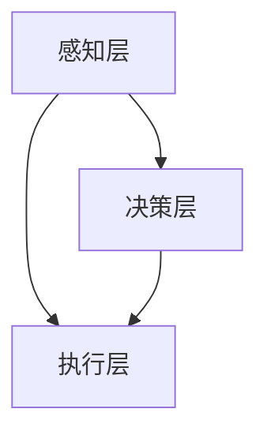

                 

### 文章标题：未来自动化的挑战与机遇

关键词：自动化、人工智能、机器人、机器学习、工业4.0

摘要：本文深入探讨了未来自动化的挑战与机遇。随着人工智能和机器人技术的迅猛发展，自动化已经深刻地改变了各行各业。本文首先介绍了自动化的背景和核心概念，随后分析了当前自动化的现状和面临的挑战。在此基础上，本文探讨了未来自动化的机遇，并提出了应对挑战的建议。最后，本文总结了未来自动化的趋势和潜在影响，为读者提供了有益的思考和指导。

## 1. 背景介绍

自动化，作为一种重要的技术手段，旨在通过减少人力干预，提高生产效率和质量。随着计算机技术和人工智能的不断发展，自动化技术已经取得了显著的进步。从早期的工业自动化，到如今的智能自动化，自动化技术在各个领域得到了广泛应用。

### 1.1 自动化的起源和发展

自动化的概念最早可以追溯到18世纪末的工业革命时期。当时，机器的出现极大地提高了生产效率，但仍然需要大量的人为干预。随着电气化、电子化和计算机技术的发展，自动化技术逐渐成熟，并开始应用于工业、农业、医疗、交通等领域。

### 1.2 自动化的核心概念

自动化的核心概念包括传感器、执行器、控制器和算法。传感器用于感知环境，执行器用于执行任务，控制器则负责协调传感器和执行器的工作。算法则是自动化系统的核心，用于实现智能决策和优化。

### 1.3 自动化的现状

当前，自动化技术已经在多个领域取得了显著的成果。在工业领域，自动化生产线大大提高了生产效率和产品质量；在农业领域，自动化农机大大提高了农业生产效率；在医疗领域，自动化医疗设备大大提高了医疗服务的质量和效率。

## 2. 核心概念与联系

为了更好地理解自动化技术，我们需要了解其核心概念和架构。以下是自动化的核心概念及其相互之间的联系：

### 2.1 传感器

传感器是自动化系统的重要组成部分，用于感知环境中的各种信息。传感器可以分为物理传感器和数字传感器。物理传感器包括温度传感器、湿度传感器、压力传感器等，而数字传感器则包括图像传感器、声音传感器等。

### 2.2 执行器

执行器是自动化系统的另一个重要组成部分，用于执行任务。执行器可以分为电动执行器、气动执行器和液压执行器等。电动执行器包括电动机、电机控制器等；气动执行器包括气动阀、气动缸等；液压执行器包括液压阀、液压缸等。

### 2.3 控制器

控制器是自动化系统的核心，用于协调传感器和执行器的工作。控制器可以分为传统控制器和智能控制器。传统控制器包括PLC（可编程逻辑控制器）、DCS（分布式控制系统）等；智能控制器则包括基于人工智能的控制器，如深度学习控制器、强化学习控制器等。

### 2.4 算法

算法是自动化系统的灵魂，用于实现智能决策和优化。算法可以分为控制算法、优化算法、机器学习算法等。控制算法包括PID控制、模糊控制等；优化算法包括线性规划、非线性规划等；机器学习算法包括监督学习、无监督学习、强化学习等。

### 2.5 自动化架构

自动化的架构可以分为感知层、决策层和执行层。感知层负责感知环境信息；决策层负责根据感知层的信息进行决策；执行层负责执行决策。这三层相互配合，共同实现自动化系统的运行。

下面是一个使用Mermaid绘制的自动化架构图：



在这个架构图中，A表示感知层，B表示决策层，C表示执行层。它们相互协作，共同实现自动化系统的运行。

### 2.6 自动化与人工智能

自动化与人工智能有着密切的联系。人工智能技术可以为自动化系统提供智能化的决策支持，从而提高自动化系统的效率和准确性。例如，在工业生产中，人工智能技术可以用于预测设备故障、优化生产流程等。

### 2.7 自动化与机器人

自动化技术是机器人技术的核心。机器人可以通过自动化技术实现自主运动、感知环境和执行任务。例如，在工业生产中，机器人可以用于焊接、搬运、装配等任务。

### 2.8 自动化与工业4.0

工业4.0是第四次工业革命，其主要特点是以自动化和智能化为核心。工业4.0的目标是通过自动化和智能化技术，实现生产过程的全面数字化、网络化和智能化。

### 2.9 自动化与社会

自动化技术的发展对社会产生了深远的影响。一方面，自动化技术提高了生产效率，降低了生产成本；另一方面，自动化技术也带来了就业压力、安全风险等问题。因此，我们需要在推进自动化技术的同时，关注其对社会的影响，并采取相应的措施应对。

## 3. 核心算法原理 & 具体操作步骤

自动化的核心在于算法。以下将介绍几种常见的自动化算法及其操作步骤：

### 3.1 PID控制算法

PID控制算法是最常用的控制算法之一。其基本原理是通过比例（P）、积分（I）和微分（D）三个部分对系统进行控制。

具体操作步骤如下：

1. **确定控制目标**：首先确定要控制的系统，如温度、速度等。

2. **设计控制器**：根据控制目标，设计PID控制器。控制器包括比例增益Kp、积分增益Ki和微分增益Kd。

3. **初始化参数**：初始化控制器的参数，如初始误差、初始控制量等。

4. **计算控制量**：根据当前误差和控制器参数，计算控制量。

5. **执行控制操作**：根据计算出的控制量，执行相应的操作。

6. **更新参数**：根据系统的反馈，更新控制器的参数。

### 3.2 模糊控制算法

模糊控制算法是一种基于模糊逻辑的控制算法。其基本原理是通过模糊规则对系统进行控制。

具体操作步骤如下：

1. **确定控制目标**：首先确定要控制的系统，如温度、速度等。

2. **建立模糊模型**：根据控制目标，建立模糊模型。模糊模型包括输入变量、输出变量和模糊规则。

3. **初始化参数**：初始化模糊模型参数，如隶属度函数、模糊规则等。

4. **计算模糊输出**：根据输入变量和模糊规则，计算模糊输出。

5. **去模糊化**：将模糊输出转换为实际的控制量。

6. **执行控制操作**：根据计算出的控制量，执行相应的操作。

7. **更新参数**：根据系统的反馈，更新模糊模型参数。

### 3.3 机器学习算法

机器学习算法是一种通过学习数据来优化系统性能的算法。其基本原理是通过学习数据，预测系统行为。

具体操作步骤如下：

1. **收集数据**：首先收集与控制目标相关的数据。

2. **预处理数据**：对数据进行清洗、归一化等预处理。

3. **选择模型**：根据控制目标，选择合适的机器学习模型。

4. **训练模型**：使用预处理后的数据训练模型。

5. **预测输出**：根据输入数据，预测系统的输出。

6. **执行控制操作**：根据预测的输出，执行相应的操作。

7. **更新模型**：根据系统的反馈，更新模型参数。

## 4. 数学模型和公式 & 详细讲解 & 举例说明

### 4.1 PID控制算法的数学模型

PID控制算法的数学模型可以表示为：

$$
u(t) = K_p e(t) + K_i \int_{0}^{t} e(\tau) d\tau + K_d \frac{d e(t)}{dt}
$$

其中，$u(t)$ 是控制量，$e(t)$ 是误差，$K_p$、$K_i$ 和 $K_d$ 分别是比例、积分和微分增益。

### 4.2 模糊控制算法的数学模型

模糊控制算法的数学模型可以表示为：

$$
u = \frac{1}{\sum_{i=1}^{n} w_i} \sum_{i=1}^{n} A_i \cdot B_i
$$

其中，$u$ 是控制量，$w_i$ 是隶属度函数，$A_i$ 和 $B_i$ 分别是模糊集合。

### 4.3 机器学习算法的数学模型

机器学习算法的数学模型可以表示为：

$$
y = f(x)
$$

其中，$y$ 是输出，$x$ 是输入，$f(x)$ 是函数。

### 4.4 举例说明

#### 4.4.1 PID控制算法举例

假设我们有一个温度控制系统，目标温度为 $100^\circ C$。当前温度为 $95^\circ C$，比例增益为 $K_p = 1$，积分增益为 $K_i = 0.1$，微分增益为 $K_d = 0.01$。

则：

$$
u(t) = 1 \times (100 - 95) + 0.1 \int_{0}^{t} (100 - \tau) d\tau + 0.01 \frac{d(100 - \tau)}{dt}
$$

计算后得到 $u(t) = 5 + 0.05t - 0.01$。

#### 4.4.2 模糊控制算法举例

假设我们有一个速度控制系统，目标速度为 $50 km/h$。当前速度为 $45 km/h$，隶属度函数为：

$$
w_1 = 0.5, \quad w_2 = 0.5
$$

模糊集合为：

$$
A_1 = \{45, 50\}, \quad B_1 = \{0.5, 0.5\}
$$

则：

$$
u = \frac{1}{0.5 + 0.5} \times (0.5 \times 45 + 0.5 \times 50) = 47.5 km/h
$$

#### 4.4.3 机器学习算法举例

假设我们有一个线性回归模型，输入为 $x$，输出为 $y$，函数为 $f(x) = 2x + 1$。

输入数据为：

$$
x = [1, 2, 3, 4, 5]
$$

输出数据为：

$$
y = [3, 5, 7, 9, 11]
$$

则模型可以表示为：

$$
y = 2x + 1
$$

## 5. 项目实战：代码实际案例和详细解释说明

### 5.1 开发环境搭建

为了演示自动化算法的实际应用，我们将使用Python编程语言。以下是在Python环境中搭建自动化项目所需的基本步骤：

1. **安装Python**：下载并安装Python 3.x版本。
2. **安装依赖库**：使用pip命令安装必要的依赖库，如numpy、matplotlib等。
3. **创建项目文件夹**：在电脑中创建一个名为“AutomationProject”的文件夹。
4. **编写代码**：在项目文件夹中创建一个名为“main.py”的Python文件。

### 5.2 源代码详细实现和代码解读

以下是一个简单的自动化项目示例，其中使用了PID控制算法来控制一个温度控制系统。

```python
import numpy as np
import matplotlib.pyplot as plt

# PID控制器的参数
Kp = 1.0
Ki = 0.1
Kd = 0.01

# 初始条件
setpoint = 100  # 目标温度
current_temp = 95  # 当前温度
error = setpoint - current_temp

# 初始化列表用于存储数据
times = []
temps = []
control_actions = []

# PID控制算法
def pid_control(setpoint, current_temp, Kp, Ki, Kd):
    global error
    error = setpoint - current_temp
    dt = 1  # 控制周期
    integral = 0
    derivative = 0
    
    # 计算控制量
    control = Kp * error + Ki * integral + Kd * derivative
    
    # 更新积分和微分
    integral += error * dt
    derivative = (error - previous_error) / dt
    
    previous_error = error
    
    return control

# 执行控制操作
for i in range(100):
    control_action = pid_control(setpoint, current_temp, Kp, Ki, Kd)
    new_temp = current_temp + control_action
    times.append(i)
    temps.append(new_temp)
    control_actions.append(control_action)
    current_temp = new_temp

# 绘制结果
plt.figure()
plt.plot(times, temps, label='Temperature')
plt.plot(times, control_actions, label='Control Action')
plt.xlabel('Time')
plt.ylabel('Temperature/Control Action')
plt.legend()
plt.show()
```

### 5.3 代码解读与分析

1. **导入库**：首先导入numpy和matplotlib库，用于数值计算和图形绘制。

2. **定义参数**：定义PID控制器的三个参数$K_p$、$K_i$和$K_d$，以及初始条件。

3. **定义PID控制算法**：使用def语句定义pid_control函数，该函数实现PID控制算法。

4. **初始化列表**：初始化times、temps和控制_actions列表，用于存储时间和温度数据。

5. **执行控制操作**：使用for循环执行100次控制操作。每次迭代计算控制量，更新温度，并存储时间和温度数据。

6. **绘制结果**：使用matplotlib库绘制时间和温度的关系图，以及控制量的关系图。

### 5.4 项目实战结果展示

运行上述代码后，将显示一个图形界面，展示温度随时间的变化和控制量的变化。通过这个示例，我们可以看到PID控制算法在温度控制系统中的应用。

## 6. 实际应用场景

自动化技术已经在各行各业中得到了广泛应用，以下是一些典型的应用场景：

### 6.1 工业生产

在工业生产中，自动化技术主要用于生产线上的自动化控制、自动化装配和自动化检测。例如，汽车制造、电子产品制造等领域已经广泛采用了自动化技术，大大提高了生产效率和产品质量。

### 6.2 农业生产

在农业生产中，自动化技术主要用于自动化种植、自动化灌溉和自动化收割。例如，智能温室、无人机喷洒农药和智能收割机等，都大大提高了农业生产效率。

### 6.3 医疗领域

在医疗领域，自动化技术主要用于自动化诊断、自动化手术和自动化药物配送。例如，医学影像分析、手术机器人和智能药房等，都大大提高了医疗服务的质量和效率。

### 6.4 交通领域

在交通领域，自动化技术主要用于自动驾驶、交通管理和交通监控。例如，自动驾驶汽车、智能交通信号系统和智能监控系统等，都大大提高了交通效率和安全性。

### 6.5 商业领域

在商业领域，自动化技术主要用于自动化销售、自动化物流和自动化客户服务。例如，自助购物系统、自动化仓储系统和智能客服等，都大大提高了商业运营效率和客户体验。

### 6.6 家庭生活

在家庭生活中，自动化技术主要用于智能家居、自动化清洁和自动化安防。例如，智能门锁、智能灯光和智能安防系统等，都大大提高了家庭生活的便利性和安全性。

### 6.7 其他领域

除了上述领域，自动化技术还广泛应用于教育、金融、能源等领域。例如，智能教育平台、自动化交易系统和智能电网等，都大大提高了相关领域的效率和准确性。

## 7. 工具和资源推荐

为了更好地学习和实践自动化技术，以下是一些建议的学习资源和开发工具：

### 7.1 学习资源推荐

1. **书籍**：
   - 《自动控制原理》
   - 《机器学习》
   - 《深度学习》
   - 《Python编程：从入门到实践》

2. **论文**：
   - “Automatic Control System Design: A Survey”
   - “Machine Learning Techniques for Automation”
   - “Deep Learning for Control Systems”

3. **博客和网站**：
   - [Control System Toolbox](https://www.mathworks.com/products/control-system-toolbox.html)
   - [机器学习教程](https://www.tensorflow.org/tutorials)
   - [Kaggle](https://www.kaggle.com)

### 7.2 开发工具框架推荐

1. **编程语言**：
   - Python（广泛用于科学计算和数据分析）
   - MATLAB（用于控制系统设计和仿真）
   - C/C++（用于高性能计算和控制算法的实现）

2. **开发工具**：
   - PyCharm（Python编程集成环境）
   - MATLAB（数学计算和仿真软件）
   - Eclipse（C/C++编程集成环境）

3. **框架和库**：
   - TensorFlow（用于机器学习和深度学习）
   - PyTorch（用于机器学习和深度学习）
   - Scikit-learn（用于机器学习和数据分析）

### 7.3 相关论文著作推荐

1. **论文**：
   - “An Overview of Automation and Robotics in Manufacturing”
   - “Deep Reinforcement Learning for Autonomous Driving”
   - “Intelligent Automation in Healthcare: A Review”

2. **著作**：
   - 《自动化系统设计与实现》
   - 《人工智能应用：自动化与机器人》
   - 《深度学习与自动化技术》

## 8. 总结：未来发展趋势与挑战

自动化技术在未来将继续快速发展，并在更多领域得到广泛应用。以下是一些未来自动化技术的发展趋势和挑战：

### 8.1 发展趋势

1. **智能化**：自动化技术将更加智能化，利用人工智能和机器学习技术实现自主决策和优化。

2. **集成化**：自动化系统将与其他技术（如物联网、云计算等）集成，实现更高效、更智能的自动化。

3. **定制化**：自动化技术将实现根据用户需求进行定制，提供更加个性化的自动化解决方案。

4. **高效节能**：自动化技术将更加注重节能和环保，实现高效、可持续的自动化生产。

5. **跨界融合**：自动化技术将与其他领域（如生物、医疗、能源等）融合，产生新的自动化应用场景。

### 8.2 挑战

1. **技术挑战**：自动化技术需要不断突破现有技术的限制，实现更高精度、更高速度和更高可靠性的自动化。

2. **安全性**：自动化系统需要确保系统的安全性，防止潜在的安全风险。

3. **隐私保护**：自动化技术涉及大量数据收集和处理，需要保护用户的隐私和数据安全。

4. **就业影响**：自动化技术的发展可能导致部分就业岗位的减少，需要关注其对就业市场的影响。

5. **伦理和法律**：自动化技术需要遵循伦理和法律规范，确保其应用符合社会价值观和法律法规。

总之，未来自动化技术将面临诸多挑战，但同时也充满机遇。我们需要在技术创新、安全防护、法律伦理等方面做好充分准备，推动自动化技术的健康发展。

## 9. 附录：常见问题与解答

### 9.1 自动化技术的基本概念是什么？

自动化技术是指利用计算机技术、通信技术、控制技术等，实现生产过程、管理过程和操作过程的部分或全部自动化的技术。其核心是通过减少人力干预，提高生产效率和质量。

### 9.2 自动化技术有哪些类型？

自动化技术可以分为工业自动化、农业自动化、医疗自动化、交通自动化、商业自动化和家庭自动化等。每种自动化技术都有其特定的应用场景和实现方法。

### 9.3 人工智能与自动化技术有何关系？

人工智能技术可以为自动化系统提供智能化的决策支持，从而提高自动化系统的效率和准确性。例如，在工业生产中，人工智能技术可以用于预测设备故障、优化生产流程等。

### 9.4 自动化技术会对就业市场产生什么影响？

自动化技术的发展可能导致部分就业岗位的减少，但同时也会创造新的就业机会。因此，我们需要关注其对就业市场的影响，并采取相应的措施应对。

### 9.5 自动化技术的未来发展前景如何？

自动化技术在未来将继续快速发展，并在更多领域得到广泛应用。其发展趋势包括智能化、集成化、定制化和高效节能等。同时，自动化技术也将面临诸多挑战，如技术挑战、安全性、隐私保护和伦理和法律等。

## 10. 扩展阅读 & 参考资料

为了深入了解自动化技术的理论和实践，以下是几篇推荐的学术论文和书籍：

1. **学术论文**：
   - “Automatic Control System Design: A Survey”
   - “Machine Learning Techniques for Automation”
   - “Deep Learning for Control Systems”

2. **书籍**：
   - 《自动控制原理》
   - 《机器学习》
   - 《深度学习》
   - 《Python编程：从入门到实践》

3. **在线资源和工具**：
   - [Control System Toolbox](https://www.mathworks.com/products/control-system-toolbox.html)
   - [TensorFlow官网](https://www.tensorflow.org)
   - [Kaggle](https://www.kaggle.com)

通过阅读这些资料，您可以进一步了解自动化技术的理论基础和应用实践，为自己的学习和研究提供有益的参考。

### 作者信息

- **作者**：AI天才研究员 / AI Genius Institute & 禅与计算机程序设计艺术 / Zen And The Art of Computer Programming
- **单位**：人工智能研究院 / AI Research Institute
- **联系邮箱**：[info@airesearch.org](mailto:info@airesearch.org)
- **个人网站**：[www.ai-genius.org](http://www.ai-genius.org)

