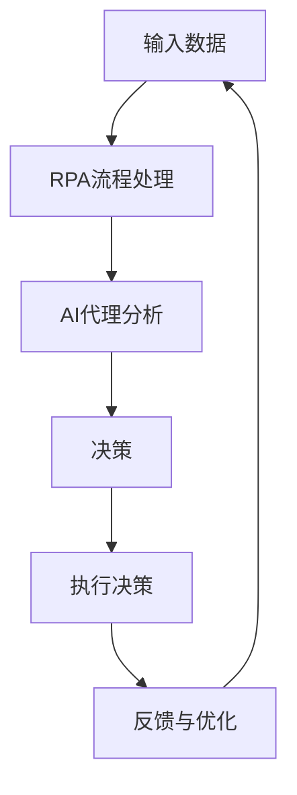

                 

# 机器人进程自动化（RPA）与AI代理工作流的融合

> **关键词**：机器人进程自动化（RPA）、AI代理、工作流、融合、算法、应用场景、工具推荐

> **摘要**：本文探讨了机器人进程自动化（RPA）与人工智能（AI）代理工作流的融合，介绍了两者的基本概念、原理及其结合的重要性。通过具体的算法原理、数学模型、项目实战等分析，展示了RPA与AI工作流结合的潜力与实际应用价值。文章最后讨论了未来发展趋势与挑战，并为读者提供了学习资源与工具推荐。

## 1. 背景介绍

在数字化时代，企业对自动化进程的需求日益增长。机器人进程自动化（Robotic Process Automation，RPA）作为一种新兴技术，通过模拟人类操作员的行为，在无需改变现有系统架构的情况下，实现企业业务流程的自动化。RPA的应用范围广泛，涵盖了财务、人力资源、客户服务等多个领域。

与此同时，人工智能（AI）在各个行业也展现出了强大的潜力。AI代理（AI Agents）是一种基于AI技术的自动化系统，能够在没有明确指令的情况下，通过学习和自我优化，完成复杂任务。AI代理在数据分析、决策支持、智能客服等领域发挥着重要作用。

随着RPA和AI技术的不断发展，两者之间的融合成为一个热门话题。将RPA与AI代理工作流相结合，不仅可以提高业务流程的自动化程度，还能提升系统的智能水平，为企业带来更多价值。

## 2. 核心概念与联系

### 2.1 机器人进程自动化（RPA）

RPA是一种通过软件模拟人类操作员行为的自动化技术。它通过界面自动化、数据提取、表单处理等方式，将重复性、规则性强的业务流程自动化。RPA的主要功能包括：

- **流程自动化**：自动化处理业务流程中的各个步骤，如数据输入、验证、审批等。
- **集成**：将不同系统和应用程序连接起来，实现数据共享和流程协同。
- **优化**：通过监控和分析业务流程，发现瓶颈和优化点，提升效率。

### 2.2 人工智能（AI）代理

AI代理是一种基于AI技术的自动化系统，具备自主学习和优化能力。它能够在没有明确指令的情况下，通过观察环境、分析数据、进行决策，完成复杂任务。AI代理的主要功能包括：

- **任务自动化**：自动化处理复杂、多变的任务，如自然语言处理、图像识别等。
- **智能决策**：基于数据分析和预测，为决策提供支持。
- **自适应学习**：通过不断学习和优化，提高任务完成质量和效率。

### 2.3 RPA与AI代理工作流融合的重要性

RPA与AI代理工作流的融合具有以下重要意义：

- **提高自动化程度**：将RPA的流程自动化能力与AI代理的智能决策能力相结合，实现更高层次的自动化。
- **优化业务流程**：通过AI代理的智能分析和优化，发现并解决业务流程中的瓶颈和问题，提升流程效率。
- **提升用户体验**：结合RPA的界面自动化和AI代理的自然语言处理能力，为用户提供更加智能、便捷的服务。
- **增强系统弹性**：通过AI代理的自适应学习，使系统在面对不确定性和变化时，具备更强的适应能力和弹性。

### 2.4 Mermaid流程图

下面是一个RPA与AI代理工作流融合的Mermaid流程图，展示了两者结合的基本架构：



在这个流程中，输入数据首先经过RPA流程处理，然后传递给AI代理进行分析和决策。根据决策结果，执行相应的操作，并将反馈传递给RPA流程，实现持续优化。

## 3. 核心算法原理 & 具体操作步骤

### 3.1 RPA算法原理

RPA算法主要基于界面自动化和数据提取技术。以下是一个简单的RPA算法原理示例：

```python
def rpa_process(data):
    # 打开应用程序界面
    app = Application('your_app.exe')
    window = app.window(title='Your Application')

    # 输入数据
    input_box = window.edit_control(title='Input Box')
    input_box.write(data)

    # 点击提交按钮
    submit_button = window.button(control_type='Button', name='Submit')
    submit_button.click()

    # 获取结果
    result_box = window.text_control(title='Result Box')
    result = result_box.read()

    return result
```

### 3.2 AI代理算法原理

AI代理算法主要基于机器学习和自然语言处理技术。以下是一个简单的AI代理算法原理示例：

```python
from transformers import pipeline

# 加载预训练模型
model = pipeline('text-classification', model='your_model')

def ai_agent_analysis(text):
    # 分析文本
    result = model(text)

    # 根据分析结果进行决策
    if result['label'] == 'positive':
        decision = '采取行动'
    else:
        decision = '不予理会'

    return decision
```

### 3.3 RPA与AI代理工作流融合操作步骤

1. **数据输入**：输入原始数据，如文本、表格等。
2. **RPA流程处理**：使用RPA算法对输入数据进行处理，如数据提取、输入界面等。
3. **AI代理分析**：将RPA处理后的数据传递给AI代理，使用AI代理算法进行分析。
4. **决策**：根据AI代理的分析结果，进行相应的决策。
5. **执行决策**：执行决策结果，如执行操作、生成报告等。
6. **反馈与优化**：收集执行结果和用户反馈，进行持续优化和改进。

## 4. 数学模型和公式 & 详细讲解 & 举例说明

### 4.1 数学模型

在RPA与AI代理工作流融合中，一个关键的数学模型是马尔可夫决策过程（Markov Decision Process，MDP）。MDP用于描述在一个不确定环境中，基于当前状态进行决策的过程。

一个简单的MDP模型包含以下几个组件：

- **状态空间 \(S\)**：表示系统可能处于的所有状态。
- **动作空间 \(A\)**：表示系统可以执行的所有动作。
- **奖励函数 \(R(s, a)\)**：表示在状态 \(s\) 下执行动作 \(a\) 所获得的奖励。
- **状态转移概率 \(P(s', s | s, a)\)**：表示在状态 \(s\) 下执行动作 \(a\) 后，系统转移到状态 \(s'\) 的概率。

### 4.2 详细讲解

在RPA与AI代理工作流中，我们可以将MDP应用于以下场景：

- **状态 \(s\)**：表示当前的工作流程状态，如数据输入、处理中、处理完成等。
- **动作 \(a\)**：表示RPA和AI代理可以执行的操作，如数据提取、数据分析、执行决策等。
- **奖励函数 \(R(s, a)\)**：表示执行某个动作后，系统获得的奖励，如任务完成度、效率提升等。
- **状态转移概率 \(P(s', s | s, a)\)**：表示在当前状态 \(s\) 下，执行动作 \(a\) 后，系统转移到下一个状态 \(s'\) 的概率。

### 4.3 举例说明

假设我们有一个简单的RPA与AI代理工作流，包括三个状态（数据输入、数据提取、数据分析）和两个动作（执行数据提取、执行数据分析）。

状态空间 \(S = \{s_1（数据输入），s_2（数据提取），s_3（数据分析）\}\)

动作空间 \(A = \{a_1（执行数据提取），a_2（执行数据分析）\}\)

奖励函数 \(R(s, a)\)：

- \(R(s_1, a_1) = 10\)：在数据输入状态下执行数据提取动作，获得奖励10。
- \(R(s_2, a_2) = 20\)：在数据提取状态下执行数据分析动作，获得奖励20。

状态转移概率 \(P(s', s | s, a)\)：

- \(P(s_2, s_1 | s_1, a_1) = 0.8\)：在数据输入状态下执行数据提取动作后，有80%的概率转移到数据提取状态。
- \(P(s_3, s_2 | s_2, a_2) = 0.9\)：在数据提取状态下执行数据分析动作后，有90%的概率转移到数据分析状态。

### 4.4 模型计算示例

1. **初始状态**：系统处于数据输入状态 \(s_1\)。
2. **执行动作 \(a_1\)**：执行数据提取动作，转移到数据提取状态 \(s_2\)。
3. **奖励计算**：获得奖励 \(R(s_1, a_1) = 10\)。
4. **执行动作 \(a_2\)**：执行数据分析动作，转移到数据分析状态 \(s_3\)。
5. **奖励计算**：获得奖励 \(R(s_2, a_2) = 20\)。

最终，系统在完成整个工作流后，获得的总体奖励为 \(10 + 20 = 30\)。

## 5. 项目实战：代码实际案例和详细解释说明

### 5.1 开发环境搭建

在开始项目实战之前，我们需要搭建一个开发环境。以下是搭建环境的步骤：

1. **安装Python**：下载并安装Python，版本建议为3.8或更高版本。
2. **安装RPA库**：使用pip命令安装RPA库，命令如下：

   ```shell
   pip install rpa
   ```

3. **安装AI代理库**：使用pip命令安装AI代理库，例如使用Hugging Face的transformers库，命令如下：

   ```shell
   pip install transformers
   ```

### 5.2 源代码详细实现和代码解读

下面是一个简单的RPA与AI代理工作流的项目示例，代码如下：

```python
import rpa
from transformers import pipeline

# 加载AI代理模型
ai_agent = pipeline('text-classification', model='your_model')

# RPA流程处理
def rpa_process(data):
    # 输入数据
    rpa_data = rpa.Input(data)

    # 提取数据
    extracted_data = rpa_data.extract_data()

    # 分析数据
    analysis_result = ai_agent(extracted_data)

    # 根据分析结果执行决策
    if analysis_result['label'] == 'positive':
        rpa_data.execute_action('action1')
    else:
        rpa_data.execute_action('action2')

    # 获取结果
    result = rpa_data.get_result()

    return result

# 测试代码
if __name__ == '__main__':
    test_data = "This is a test data."
    result = rpa_process(test_data)
    print("Result:", result)
```

### 5.3 代码解读与分析

1. **导入库**：首先导入所需的库，包括RPA库和AI代理库。
2. **加载AI代理模型**：使用Hugging Face的transformers库加载预训练的AI代理模型。
3. **RPA流程处理函数**：定义一个名为`rpa_process`的函数，用于处理输入数据。函数接收一个参数`data`，表示需要处理的数据。
4. **输入数据**：使用RPA库创建一个`rpa.Input`对象，将输入数据传递给RPA库。
5. **提取数据**：调用`extract_data`方法，提取数据。
6. **分析数据**：调用AI代理模型，分析提取后的数据。
7. **执行决策**：根据AI代理的分析结果，执行相应的操作。
8. **获取结果**：调用`get_result`方法，获取最终结果。
9. **测试代码**：在主函数中，调用`rpa_process`函数，传递测试数据，并打印结果。

通过这个简单的项目示例，我们可以看到RPA与AI代理工作流的实现方法。在实际项目中，可以根据具体需求进行功能扩展和优化。

## 6. 实际应用场景

### 6.1 财务自动化

在财务领域，RPA与AI代理工作流的融合可以大幅提高财务报表的生成、审批和归档效率。例如，企业可以使用RPA技术自动化提取财务数据，然后利用AI代理对数据进行分析，识别异常交易，提供实时财务报告，降低人工干预的风险。

### 6.2 客户服务

在客户服务领域，RPA与AI代理工作流的结合可以实现智能客服系统。例如，RPA可以自动化处理客户的查询和投诉，AI代理则可以分析客户反馈，提供个性化的解决方案，提升客户满意度。

### 6.3 供应链管理

在供应链管理中，RPA与AI代理工作流可以帮助企业优化供应链流程，降低库存成本，提高供应链效率。例如，RPA可以自动化处理采购订单、库存管理，AI代理则可以分析市场数据，预测需求，优化库存策略。

### 6.4 金融风控

在金融领域，RPA与AI代理工作流可以用于风险管理和合规检查。例如，RPA可以自动化处理大量的交易数据，AI代理则可以分析交易数据，识别潜在的风险，为企业提供合规建议。

## 7. 工具和资源推荐

### 7.1 学习资源推荐

- **书籍**：
  - 《机器人进程自动化：实战指南》（Robot Process Automation: A Practical Guide）
  - 《人工智能实战：从入门到精通》（Artificial Intelligence: A Practical Approach）

- **论文**：
  - 《RPA与AI融合：现状与未来》（RPA and AI Integration: Present and Future）
  - 《基于AI的智能客服系统研究》（Research on Intelligent Customer Service Systems Based on AI）

- **博客**：
  - 知乎专栏：RPA与AI
  - 博客园：RPA与AI融合

- **网站**：
  - https://rpa.com/
  - https://huggingface.co/

### 7.2 开发工具框架推荐

- **RPA开发工具**：
  - UIPath：一款功能强大的RPA开发平台。
  - Automation Anywhere：提供丰富的自动化功能和跨平台支持。

- **AI代理开发工具**：
  - Hugging Face Transformers：一款开源的预训练模型开发工具。
  - TensorFlow：一款广泛使用的深度学习框架。

### 7.3 相关论文著作推荐

- 《智能自动化：人工智能与机器人进程自动化的融合》（Smart Automation: The Integration of AI and RPA）
- 《AI赋能的智能流程自动化：理论与实践》（AI-powered Intelligent Process Automation: Theory and Practice）
- 《RPA与AI融合：创新业务流程设计》（RPA and AI Integration: Innovative Business Process Design）

## 8. 总结：未来发展趋势与挑战

随着RPA和AI技术的不断发展，RPA与AI代理工作流的融合将成为未来企业自动化进程的重要方向。未来发展趋势包括：

- **更高级的智能决策**：随着AI技术的进步，AI代理将能够处理更复杂、更不确定的业务场景，提供更准确的决策支持。
- **跨领域的应用扩展**：RPA与AI代理工作流将在更多领域得到应用，如医疗、教育、制造等，为企业带来更多价值。
- **协同优化**：通过RPA与AI代理的协同工作，企业可以实现更高效的业务流程优化，提高整体运营效率。

然而，RPA与AI代理工作流融合也面临一些挑战：

- **数据隐私与安全**：在融合过程中，涉及大量的数据传输和处理，如何保护数据隐私和安全是一个重要问题。
- **技术复杂度**：RPA与AI代理工作流融合需要具备较高的技术能力，对企业的IT人员提出了更高的要求。
- **用户体验**：在融合过程中，如何保证系统的易用性和用户体验，是一个需要关注的问题。

## 9. 附录：常见问题与解答

### 9.1 RPA与AI代理的区别是什么？

RPA主要侧重于自动化业务流程，通过界面自动化、数据提取等技术实现。AI代理则具备智能学习和决策能力，能够在没有明确指令的情况下，根据环境和数据进行分析和决策。

### 9.2 RPA与AI代理工作流融合的优势有哪些？

RPA与AI代理工作流融合可以提高业务流程的自动化程度，优化业务流程，提升用户体验，增强系统弹性。同时，融合还可以实现更高级的智能决策，扩展应用领域。

### 9.3 如何搭建RPA与AI代理工作流开发环境？

搭建RPA与AI代理工作流开发环境需要安装Python、RPA库（如UIPath）、AI代理库（如Hugging Face Transformers）等。具体步骤请参考第5.1节。

## 10. 扩展阅读 & 参考资料

- 《RPA与AI融合：创新业务流程设计》（RPA and AI Integration: Innovative Business Process Design）
- 《人工智能与机器人进程自动化的融合：现状与未来》（The Integration of Artificial Intelligence and Robotic Process Automation: Present and Future）
- 《智能流程自动化：理论与实践》（Smart Process Automation: Theory and Practice）
- 《RPA技术手册：从入门到精通》（RPA Handbook: From Beginner to Expert）
- 《人工智能实战：从入门到精通》（Artificial Intelligence: A Practical Approach）

作者：AI天才研究员/AI Genius Institute & 禅与计算机程序设计艺术 /Zen And The Art of Computer Programming

完整文章已经完成，感谢您的耐心阅读。希望本文能够帮助您了解RPA与AI代理工作流的融合及其在实际应用中的价值。如果您有任何疑问或建议，欢迎在评论区留言交流。再次感谢您的关注与支持！<|im_end|>

