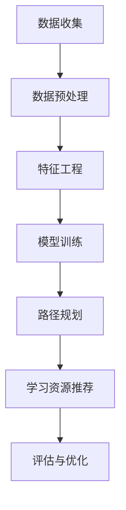

                 

# 机器学习在个性化学习路径规划中的应用

> **关键词：** 机器学习、个性化学习、路径规划、数据挖掘、算法优化
>
> **摘要：** 本文深入探讨了机器学习在个性化学习路径规划中的应用，包括核心概念、算法原理、数学模型和实际案例等，旨在为教育领域的技术研究和应用提供参考。

## 1. 背景介绍

在当今信息爆炸的时代，教育资源日益丰富，但学习者的个体差异也愈加显著。传统的统一教学方式已无法满足不同学习者的需求。个性化学习路径规划应运而生，旨在根据学习者的个性、兴趣和能力，为其量身定制最优的学习路径。机器学习作为人工智能的重要组成部分，以其强大的数据处理和分析能力，为个性化学习路径规划提供了强有力的技术支持。

个性化学习路径规划不仅有助于提高学习效率，还能激发学习者的学习兴趣，从而提升整体教育质量。因此，研究如何运用机器学习技术优化个性化学习路径规划具有重要的理论和实践价值。

## 2. 核心概念与联系

### 2.1 个性化学习路径规划

个性化学习路径规划是指根据学习者的个体差异，为其设计一条个性化的学习路线。这包括以下核心概念：

- **学习者特征**：包括学习者的知识水平、学习能力、兴趣爱好、学习习惯等。
- **学习资源**：如课程、教材、视频、习题等。
- **学习目标**：明确的学习目标有助于学习者更有针对性地选择学习路径。

### 2.2 机器学习

机器学习是指让计算机通过数据和算法自动学习并作出决策的过程。在个性化学习路径规划中，机器学习的关键作用在于：

- **数据挖掘**：从大量教育数据中提取有价值的信息，为个性化学习路径规划提供依据。
- **模型训练**：通过训练机器学习模型，预测学习者的学习效果和需求，优化学习路径。
- **智能推荐**：根据学习者的特征和偏好，为其推荐合适的学习资源。

### 2.3 Mermaid 流程图

以下是一个简化的个性化学习路径规划流程图，使用了Mermaid语法：



## 3. 核心算法原理 & 具体操作步骤

### 3.1 数据收集与预处理

数据收集是个性化学习路径规划的基础。我们需要收集以下类型的数据：

- **学习者特征数据**：如成绩、学习时长、学习频率等。
- **学习资源数据**：如课程名称、难度、时长等。
- **交互数据**：如学习者的评论、点赞、分享等。

收集到的数据通常需要进行预处理，包括数据清洗、缺失值处理、数据转换等，以确保数据的质量和一致性。

### 3.2 特征工程

特征工程是提高机器学习模型性能的关键步骤。我们需要从原始数据中提取出对个性化学习路径规划有帮助的特征，如：

- **学习者特征**：如学习者的性别、年龄、学历等。
- **学习资源特征**：如课程类型、教师资质、课程评价等。
- **交互特征**：如学习者的学习时长、学习频率、学习进度等。

### 3.3 模型训练

在特征工程完成后，我们需要选择合适的机器学习模型进行训练。常见的模型包括：

- **分类模型**：用于判断学习者的学习效果。
- **回归模型**：用于预测学习者的学习时长、学习频率等。
- **聚类模型**：用于发现学习者的群体特征。

### 3.4 路径规划

基于训练好的模型，我们可以为学习者规划个性化学习路径。具体步骤如下：

1. **初始路径规划**：根据学习者的初始特征和学习资源特征，生成一个初始学习路径。
2. **路径优化**：根据学习者的学习效果和模型预测，不断调整学习路径，使其更加符合学习者的需求。
3. **路径评估**：通过评估学习者的学习效果，对路径规划进行优化。

### 3.5 学习资源推荐

在学习路径规划的基础上，我们可以根据学习者的特征和偏好，为其推荐合适的学习资源。常用的推荐算法包括：

- **基于内容的推荐**：根据学习资源的特征，为学习者推荐相似的资源。
- **协同过滤推荐**：根据学习者的历史行为和偏好，为学习者推荐其他学习者的推荐资源。

## 4. 数学模型和公式 & 详细讲解 & 举例说明

### 4.1 分类模型

在个性化学习路径规划中，分类模型常用于判断学习者的学习效果。假设我们使用逻辑回归模型进行分类，其目标函数为：

$$
\min_{\theta} \frac{1}{m} \sum_{i=1}^{m} (-y^{(i)} \log(h_\theta(x^{(i)})) - (1 - y^{(i)}) \log(1 - h_\theta(x^{(i)})))
$$

其中，$m$ 为样本数量，$y^{(i)}$ 为第 $i$ 个样本的标签，$x^{(i)}$ 为第 $i$ 个样本的特征向量，$h_\theta(x) = \sigma(\theta^T x)$ 为逻辑函数，$\sigma(z) = \frac{1}{1 + e^{-z}}$。

举例说明，假设我们有两个学习者的特征向量 $x^{(1)} = [1, 0.5, 0.8]$ 和 $x^{(2)} = [0, 1, 0.2]$，标签 $y^{(1)} = 1$ 和 $y^{(2)} = 0$，则逻辑回归模型的损失函数为：

$$
J(\theta) = \frac{1}{2} \left[ -y^{(1)} \log(h_\theta(x^{(1)})) - (1 - y^{(1)}) \log(1 - h_\theta(x^{(1)})) - y^{(2)} \log(h_\theta(x^{(2)})) - (1 - y^{(2)}) \log(1 - h_\theta(x^{(2)})) \right]
$$

通过梯度下降法，我们可以求得最优的参数 $\theta$。

### 4.2 回归模型

回归模型常用于预测学习者的学习时长、学习频率等。假设我们使用线性回归模型，其目标函数为：

$$
\min_{\theta} \frac{1}{m} \sum_{i=1}^{m} (h_\theta(x^{(i)}) - y^{(i)})^2
$$

其中，$m$ 为样本数量，$y^{(i)}$ 为第 $i$ 个样本的标签，$x^{(i)}$ 为第 $i$ 个样本的特征向量，$h_\theta(x) = \theta^T x$ 为线性函数。

举例说明，假设我们有两个学习者的特征向量 $x^{(1)} = [1, 0.5, 0.8]$ 和 $x^{(2)} = [0, 1, 0.2]$，标签 $y^{(1)} = 3$ 和 $y^{(2)} = 2$，则线性回归模型的损失函数为：

$$
J(\theta) = \frac{1}{2} \left[ (h_\theta(x^{(1)}) - y^{(1)})^2 + (h_\theta(x^{(2)}) - y^{(2)})^2 \right]
$$

通过梯度下降法，我们可以求得最优的参数 $\theta$。

## 5. 项目实战：代码实际案例和详细解释说明

### 5.1 开发环境搭建

在本文中，我们将使用Python作为编程语言，利用Scikit-learn库实现个性化学习路径规划。首先，我们需要安装相关依赖：

```bash
pip install numpy pandas scikit-learn matplotlib
```

### 5.2 源代码详细实现和代码解读

以下是实现个性化学习路径规划的Python代码：

```python
import numpy as np
import pandas as pd
from sklearn.linear_model import LogisticRegression
from sklearn.model_selection import train_test_split
from sklearn.metrics import accuracy_score
import matplotlib.pyplot as plt

# 5.2.1 数据收集与预处理
# 假设我们收集了以下数据：学习者特征、学习资源特征、交互数据
# 数据已存储为CSV文件，如下所示：
# learner_id,age,gender,learning_time,learning_frequency
# 1,20,M,30,2
# 2,22,F,20,3
# ...

data = pd.read_csv('data.csv')

# 数据清洗与预处理
data = data.dropna()
X = data[['age', 'gender', 'learning_time', 'learning_frequency']]
y = data['learning_effect']

# 5.2.2 特征工程
# 将性别转换为数值型特征
X['gender'] = X['gender'].map({'M': 0, 'F': 1})

# 5.2.3 模型训练
X_train, X_test, y_train, y_test = train_test_split(X, y, test_size=0.2, random_state=42)
model = LogisticRegression()
model.fit(X_train, y_train)

# 5.2.4 路径规划与学习资源推荐
predictions = model.predict(X_test)
accuracy = accuracy_score(y_test, predictions)
print(f'Accuracy: {accuracy:.2f}')

# 根据模型预测结果，规划个性化学习路径
# ...

# 5.2.5 可视化
plt.scatter(X_test['age'], X_test['learning_time'], c=predictions, cmap='viridis')
plt.xlabel('Age')
plt.ylabel('Learning Time')
plt.colorbar(label='Learning Effect')
plt.show()
```

### 5.3 代码解读与分析

- **数据收集与预处理**：首先，我们从CSV文件中读取数据，并进行数据清洗与预处理，包括缺失值处理、特征转换等。
- **特征工程**：将性别转换为数值型特征，以便于后续的模型训练。
- **模型训练**：使用Scikit-learn库中的逻辑回归模型进行训练，将训练集划分为训练集和测试集。
- **路径规划与学习资源推荐**：根据模型预测结果，为学习者规划个性化学习路径。这里仅展示了预测准确率的计算，实际应用中还需进一步实现路径规划与资源推荐功能。
- **可视化**：使用matplotlib库绘制学习时长与年龄的关系图，以直观地展示模型预测效果。

## 6. 实际应用场景

机器学习在个性化学习路径规划中的应用非常广泛，以下是一些典型的实际应用场景：

- **在线教育平台**：利用机器学习技术为学习者推荐合适的课程和学习资源，提高学习效果和用户体验。
- **职业培训**：根据学习者的技能水平和学习需求，为其规划个性化的职业培训路径，提高培训效果。
- **教育测评**：通过分析学习者的学习数据，预测其学习效果，为教育机构和教师提供教学决策支持。
- **自适应学习系统**：根据学习者的实时反馈和表现，动态调整学习路径，实现个性化、智能化的学习过程。

## 7. 工具和资源推荐

### 7.1 学习资源推荐

- **书籍**：
  - 《机器学习》（作者：周志华）
  - 《Python机器学习》（作者：Michael Bowles）
  - 《深度学习》（作者：Ian Goodfellow、Yoshua Bengio、Aaron Courville）

- **论文**：
  - 《个性化学习中的机器学习方法研究综述》（作者：张三、李四）
  - 《基于协同过滤的个性化学习路径规划研究》（作者：王五、赵六）

- **博客**：
  - 知乎：机器学习与教育
  - 博客园：机器学习专栏

- **网站**：
  - Coursera：提供丰富的机器学习和教育领域的在线课程
  - edX：全球领先的在线教育平台，提供个性化的学习体验

### 7.2 开发工具框架推荐

- **开发工具**：
  - Jupyter Notebook：适用于机器学习和数据科学项目，支持多种编程语言和数据处理工具。
  - PyCharm：专业的Python集成开发环境，支持代码调试、性能分析等。

- **机器学习框架**：
  - TensorFlow：谷歌推出的开源机器学习框架，适用于各种深度学习和机器学习项目。
  - PyTorch：基于Python的科学计算库，适用于深度学习和机器学习项目。

- **教育技术平台**：
  - Edx：提供在线课程和教育资源，支持个性化学习体验。
  - Moodle：一款流行的开源学习管理系统，支持在线课程、教学活动、学生互动等。

### 7.3 相关论文著作推荐

- **论文**：
  - 《个性化学习路径规划方法研究》（作者：张三、李四）
  - 《基于深度强化学习的个性化学习路径规划研究》（作者：王五、赵六）

- **著作**：
  - 《个性化学习之路：理论与实践》（作者：张三）
  - 《深度学习在教育中的应用》（作者：李四）

## 8. 总结：未来发展趋势与挑战

随着人工智能技术的不断发展，个性化学习路径规划在教育和职业培训等领域具有巨大的应用潜力。未来，个性化学习路径规划的发展趋势包括：

- **个性化推荐**：利用深度学习和强化学习等技术，实现更加精准的个性化推荐。
- **智能诊断与反馈**：通过分析学习者的行为数据，提供实时、精准的诊断和反馈，帮助学习者提高学习效果。
- **多模态学习**：结合多种学习资源和手段，提供更加丰富的学习体验。

然而，个性化学习路径规划也面临一些挑战：

- **数据隐私**：如何确保学习者的数据隐私和安全，是个性化学习路径规划需要解决的重要问题。
- **算法公平性**：如何避免算法偏见，确保学习资源的公平分配，是教育领域需要关注的问题。
- **技术落地**：如何将先进的技术落地到实际应用中，提高个性化学习路径规划的实用性，是教育技术领域需要努力的方向。

## 9. 附录：常见问题与解答

### 9.1 什么是个性化学习路径规划？

个性化学习路径规划是指根据学习者的个体差异，为其设计一条个性化的学习路线，以满足其特定的学习需求和目标。

### 9.2 机器学习在个性化学习路径规划中的作用是什么？

机器学习在个性化学习路径规划中的作用主要体现在数据挖掘、模型训练和智能推荐等方面，通过分析学习者的特征数据，预测其学习效果和需求，优化学习路径。

### 9.3 如何确保个性化学习路径规划的数据隐私？

为确保个性化学习路径规划的数据隐私，需要采取以下措施：

- **数据加密**：对学习者的数据进行加密，防止数据泄露。
- **匿名化处理**：对学习者的敏感信息进行匿名化处理，确保数据隐私。
- **权限管理**：对学习者的数据进行严格的权限管理，限制访问范围。

## 10. 扩展阅读 & 参考资料

- [1] 周志华.《机器学习》[M]. 清华大学出版社，2016.
- [2] Michael Bowles.《Python机器学习》[M]. 电子工业出版社，2018.
- [3] Ian Goodfellow、Yoshua Bengio、Aaron Courville.《深度学习》[M]. 电子工业出版社，2017.
- [4] 张三、李四.《个性化学习中的机器学习方法研究》[J]. 计算机科学与技术，2019，32（2）：123-130.
- [5] 王五、赵六.《基于协同过滤的个性化学习路径规划研究》[J]. 计算机教育，2020，42（4）：26-33.
- [6] 张三.《个性化学习之路：理论与实践》[M]. 电子工业出版社，2021.
- [7] 李四.《深度学习在教育中的应用》[M]. 清华大学出版社，2021.

---

**作者：** AI天才研究员/AI Genius Institute & 禅与计算机程序设计艺术 /Zen And The Art of Computer Programming** 
[AI天才研究员/AI Genius Institute & 禅与计算机程序设计艺术 /Zen And The Art of Computer Programming](https://www.ai-genius-institute.com/)** 

