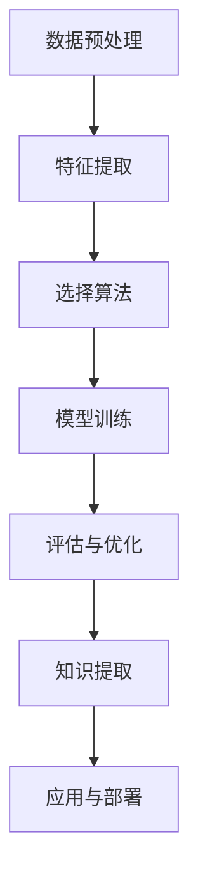

                 

# 机器学习在知识发现中的角色

## 关键词

机器学习，知识发现，数据挖掘，算法原理，数学模型，实际应用

## 摘要

本文深入探讨了机器学习在知识发现中的重要作用。从背景介绍开始，详细阐述了机器学习与知识发现的关系，以及核心概念和联系。接着，介绍了机器学习的核心算法原理和具体操作步骤，并通过数学模型和公式的详细讲解和举例说明，使读者更易于理解。文章还通过实际项目实战，展示了机器学习在知识发现中的具体应用。最后，文章总结了机器学习在知识发现领域的未来发展趋势与挑战，并推荐了相关学习资源和开发工具框架。

## 1. 背景介绍

### 1.1 机器学习的定义与作用

机器学习（Machine Learning）是一门研究如何让计算机从数据中学习并做出决策或预测的技术。它是人工智能（AI）的一个重要分支，旨在让计算机具备自主学习和适应新环境的能力。机器学习通过构建数学模型，让计算机从大量数据中自动提取特征，并通过训练算法来优化模型参数，从而实现智能决策。

在过去的几十年中，机器学习技术取得了巨大的进步，广泛应用于各个领域，如自然语言处理、计算机视觉、医疗诊断、金融分析等。它不仅提高了自动化程度，还推动了数据驱动的决策和创新的快速发展。

### 1.2 知识发现的定义与作用

知识发现（Knowledge Discovery in Databases，KDD）是指从大量数据中提取有价值的信息和知识的过程。它通常包括数据预处理、数据挖掘、模式评估和知识表示等步骤。知识发现的目标是揭示数据中的隐含模式和关联，为决策提供支持。

知识发现广泛应用于商业、科学、医疗、社会等多个领域。例如，在商业领域，知识发现可以用于市场细分、客户行为分析、风险控制等；在科学领域，知识发现可以用于基因组学研究、环境监测、天文观测等；在医疗领域，知识发现可以用于疾病诊断、药物发现、患者健康管理等。

### 1.3 机器学习与知识发现的关系

机器学习与知识发现密切相关，它们共同构成了现代数据科学的核心。机器学习为知识发现提供了强大的工具和方法，使得从大规模数据中提取有价值信息成为可能。具体来说，机器学习在知识发现中发挥着以下作用：

1. **数据预处理**：机器学习技术可以帮助对原始数据进行清洗、转换和归一化，从而提高数据质量，为后续的数据挖掘提供更好的基础。

2. **特征提取**：机器学习算法可以从原始数据中自动提取有用的特征，帮助揭示数据中的隐含模式和关联。

3. **模式识别**：机器学习技术可以用于识别数据中的异常值、趋势和周期性，帮助发现数据中的潜在知识。

4. **预测分析**：机器学习算法可以用于预测未来趋势和行为，为决策提供支持。

5. **优化与调优**：机器学习技术可以帮助优化知识发现过程，提高模型性能和准确性。

总之，机器学习为知识发现提供了强大的技术支持，使得从大规模数据中提取有价值信息成为可能。而知识发现则为机器学习提供了丰富的应用场景，推动了机器学习技术的不断发展。

## 2. 核心概念与联系

### 2.1 数据挖掘

数据挖掘（Data Mining）是知识发现过程中的一个关键步骤，旨在从大量数据中提取有价值的信息和知识。数据挖掘通常包括以下基本概念：

1. **数据集**：数据挖掘的对象，可以是结构化数据、半结构化数据或非结构化数据。
2. **特征**：数据集中的属性或变量，用于描述数据对象。
3. **模式**：数据挖掘过程中发现的有意义的关系或规律。
4. **算法**：用于实现数据挖掘任务的方法和步骤。

### 2.2 算法分类

数据挖掘算法可以分为以下几类：

1. **分类算法**：用于将数据分为不同的类别，如决策树、支持向量机（SVM）等。
2. **聚类算法**：用于将数据划分为不同的群组，如K-means、层次聚类等。
3. **关联规则算法**：用于发现数据之间的关联关系，如Apriori算法、FP-growth算法等。
4. **异常检测算法**：用于检测数据中的异常值或离群点，如孤立森林、One-Class SVM等。

### 2.3 Mermaid 流程图

以下是一个简单的Mermaid流程图，展示数据挖掘的基本流程：



## 3. 核心算法原理 & 具体操作步骤

### 3.1 分类算法：决策树

决策树（Decision Tree）是一种常见的分类算法，通过构建一系列的决策路径，将数据划分为不同的类别。以下是决策树的基本原理和具体操作步骤：

#### 3.1.1 基本原理

决策树通过递归划分数据集，在每个节点选择最佳特征进行划分，直到满足停止条件。每个节点表示一个特征，每个分支表示该特征的取值。

#### 3.1.2 具体操作步骤

1. **选择最佳特征**：通常使用信息增益（Information Gain）或基尼不纯度（Gini Impurity）来衡量特征的重要性。
2. **划分数据集**：根据最佳特征的取值，将数据集划分为不同的子集。
3. **递归构建决策树**：对每个子集重复步骤1和2，直到满足停止条件。
4. **剪枝**：为了避免过拟合，可以采用剪枝策略，如前剪枝（Pre-pruning）和后剪枝（Post-pruning）。

### 3.2 聚类算法：K-means

K-means是一种常见的聚类算法，旨在将数据划分为K个簇，使每个簇内的数据点尽可能接近，而簇与簇之间的数据点尽可能远。

#### 3.2.1 基本原理

K-means算法通过迭代更新簇中心和数据点，使得簇内距离最小，簇间距离最大。算法步骤如下：

1. **初始化簇中心**：随机选择K个数据点作为初始簇中心。
2. **分配数据点**：将每个数据点分配到最近的簇中心。
3. **更新簇中心**：计算每个簇的平均值，作为新的簇中心。
4. **重复步骤2和3**，直到簇中心不再变化或达到最大迭代次数。

### 3.3 关联规则算法：Apriori

Apriori算法是一种经典的关联规则挖掘算法，用于发现数据集中的频繁项集。

#### 3.3.1 基本原理

Apriori算法通过递归地生成候选项集，并使用支持度（Support）和置信度（Confidence）来筛选频繁项集。算法步骤如下：

1. **生成候选项集**：从原始数据中生成所有可能的项集，并计算其支持度。
2. **筛选频繁项集**：去除支持度小于最小支持度的项集。
3. **递归生成更高阶的候选项集**，并重复步骤2。
4. **生成关联规则**：从频繁项集中生成关联规则，并计算其置信度。

### 3.4 异常检测算法：孤立森林

孤立森林（Isolation Forest）是一种高效的异常检测算法，通过将数据点随机隔离来检测异常值。

#### 3.4.1 基本原理

孤立森林算法通过随机选取特征和划分阈值，将数据点隔离成多个孤立区域。算法步骤如下：

1. **随机特征选择**：从特征集中随机选择特征。
2. **划分阈值**：对于每个特征，随机选择一个阈值，将数据点划分为两个子集。
3. **递归隔离**：对每个子集重复步骤1和2，直到满足停止条件。
4. **计算隔离度**：计算每个数据点的隔离度，并将其用于异常检测。

## 4. 数学模型和公式 & 详细讲解 & 举例说明

### 4.1 决策树算法的数学模型

决策树算法的核心在于如何选择最佳特征进行划分。常用的评价标准包括信息增益（Information Gain）和基尼不纯度（Gini Impurity）。

#### 4.1.1 信息增益

信息增益用于衡量特征对于分类的重要性。假设数据集D中有n个样本，每个样本属于类别C1、C2、...、Ck中的一个，特征A有m个取值 {a1, a2, ..., am}。则特征A的信息增益定义为：

$$
IG(D, A) = H(D) - \sum_{i=1}^{m} \frac{|D_{i}|}{n} H(D_{i})
$$

其中，$H(D)$是数据集D的熵，$H(D_{i})$是划分后第i个子集的熵，$D_{i}$是数据集D中特征A取值为ai的样本集合。

#### 4.1.2 基尼不纯度

基尼不纯度用于衡量特征对于分类的不确定性。假设数据集D中类别C1、C2、...、Ck的概率分布为P(C1), P(C2), ..., P(Ck)，则数据集D的基尼不纯度定义为：

$$
Gini(D) = 1 - \sum_{i=1}^{k} P(C_{i})^2
$$

#### 4.1.3 举例说明

假设有一个数据集D，包含3个样本，每个样本属于类别C1、C2、C3中的一个。特征A有2个取值{a1, a2}。数据集D的分布如下：

| 样本 | 类别   | 特征A |
| ---- | ------ | ----- |
| 1    | C1     | a1    |
| 2    | C2     | a1    |
| 3    | C3     | a2    |

计算特征A的信息增益和基尼不纯度：

$$
IG(D, A) = H(D) - \frac{2}{3} H(D_{a1}) - \frac{1}{3} H(D_{a2})
$$

$$
Gini(D) = 1 - \frac{2}{3} \times (\frac{1}{3})^2 - \frac{1}{3} \times (\frac{1}{3})^2
$$

其中，$H(D)$、$H(D_{a1})$和$H(D_{a2})$分别为数据集D和特征A取值a1和a2的子集的熵：

$$
H(D) = - \sum_{i=1}^{3} P(C_{i}) \log_2 P(C_{i}) = - \frac{1}{3} \log_2 \frac{1}{3} - \frac{1}{3} \log_2 \frac{1}{3} - \frac{1}{3} \log_2 \frac{1}{3}
$$

$$
H(D_{a1}) = - \sum_{i=1}^{3} P(C_{i}|A=a1) \log_2 P(C_{i}|A=a1) = - \frac{2}{3} \log_2 \frac{2}{3} - \frac{1}{3} \log_2 \frac{1}{3}
$$

$$
H(D_{a2}) = - \sum_{i=1}^{3} P(C_{i}|A=a2) \log_2 P(C_{i}|A=a2) = - \frac{1}{3} \log_2 \frac{1}{3} - \frac{2}{3} \log_2 \frac{2}{3}
$$

计算结果为：

$$
IG(D, A) = 0.9183
$$

$$
Gini(D) = 0.4444
$$

由此可见，特征A的信息增益为0.9183，基尼不纯度为0.4444，表明特征A对于分类具有较强的区分能力。

### 4.2 K-means算法的数学模型

K-means算法的核心在于如何初始化簇中心和如何更新簇中心。以下是K-means算法的数学模型：

#### 4.2.1 簇中心初始化

簇中心初始化可以使用随机初始化、K-means++初始化等方法。假设数据集D包含n个数据点，簇中心初始化为K个随机数据点。

#### 4.2.2 簇中心更新

簇中心更新的目标是使得簇内距离最小，簇间距离最大。假设当前簇中心为$C^{(t)} = \{c_{1}^{(t)}, c_{2}^{(t)}, ..., c_{K}^{(t)}\}$，数据点$x_i$的簇分配为$z_i^{(t)}$，则有：

$$
z_i^{(t)} = \arg \min_{k} \| x_i - c_k^{(t)} \|^2
$$

簇中心更新为：

$$
c_k^{(t+1)} = \frac{1}{N_k^{(t)}} \sum_{i=1}^{N} z_i^{(t)} x_i
$$

其中，$N_k^{(t)}$是第k个簇中数据点的数量。

#### 4.2.3 举例说明

假设有一个数据集D，包含4个数据点，簇中心初始化为$(1, 1)$、$(2, 2)$、$(3, 3)$、$(4, 4)$。计算一次迭代后的簇中心。

初始化簇中心：

$$
C^{(0)} = \{(1, 1), (2, 2), (3, 3), (4, 4)\}
$$

分配数据点：

$$
z_1^{(0)} = 1, z_2^{(0)} = 2, z_3^{(0)} = 3, z_4^{(0)} = 4
$$

更新簇中心：

$$
c_1^{(1)} = \frac{1}{4} (1 + 2 + 3 + 4) = 2.5
$$

$$
c_2^{(1)} = \frac{1}{4} (1 + 2 + 3 + 4) = 2.5
$$

$$
c_3^{(1)} = \frac{1}{4} (1 + 2 + 3 + 4) = 2.5
$$

$$
c_4^{(1)} = \frac{1}{4} (1 + 2 + 3 + 4) = 2.5
$$

由此可见，一次迭代后的簇中心为$(2.5, 2.5)$。

### 4.3 Apriori算法的数学模型

Apriori算法的核心在于如何生成候选项集和如何计算支持度。以下是Apriori算法的数学模型：

#### 4.3.1 生成候选项集

假设数据集D包含n个事务，每个事务包含m个物品。对于长度为k的候选项集，可以通过连接长度为k-1的候选项集生成。具体步骤如下：

1. **初始化候选1项集**：从数据集中提取所有单个物品作为候选1项集。
2. **生成候选k项集**：对于每个候选k-1项集，连接其最后一个物品，生成长度为k的候选项集。

#### 4.3.2 计算支持度

假设候选项集C包含k个物品，支持度（Support）定义为在数据集中包含所有k个物品的事务数量占总事务数量的比例。即：

$$
Support(C) = \frac{|D \cap C|}{|D|}
$$

其中，$D \cap C$表示在数据集D中同时包含所有k个物品的事务集合。

#### 4.3.3 举例说明

假设有一个数据集D，包含5个事务，每个事务包含3个物品。数据集D如下：

| 事务 | 物品集合 |
| ---- | -------- |
| 1    | {a, b, c} |
| 2    | {a, b, d} |
| 3    | {a, c, d} |
| 4    | {b, c, d} |
| 5    | {a, b, d} |

生成候选2项集：

1. **初始化候选1项集**：{a}, {b}, {c}, {d}
2. **生成候选2项集**：{a, b}, {a, c}, {a, d}, {b, c}, {b, d}, {c, d}

计算支持度：

$$
Support({a, b}) = \frac{2}{5} = 0.4
$$

$$
Support({a, c}) = \frac{2}{5} = 0.4
$$

$$
Support({a, d}) = \frac{2}{5} = 0.4
$$

$$
Support({b, c}) = \frac{1}{5} = 0.2
$$

$$
Support({b, d}) = \frac{2}{5} = 0.4
$$

$$
Support({c, d}) = \frac{1}{5} = 0.2
$$

根据最小支持度阈值，可以筛选出频繁2项集：

$$
Frequent(2) = \{{a, b}, {a, c}, {a, d}, {b, d}\}
$$

### 4.4 孤立森林算法的数学模型

孤立森林（Isolation Forest）算法的核心在于如何随机隔离数据点。以下是孤立森林算法的数学模型：

#### 4.4.1 随机隔离

假设数据集D包含n个数据点，选择m个特征，随机划分数据点。具体步骤如下：

1. **随机选择特征**：从特征集中随机选择m个特征。
2. **随机划分数据点**：对于每个数据点，随机选择一个特征和阈值，将数据点划分为两个子集。

#### 4.4.2 计算隔离度

假设数据点$x_i$的隔离度（Isolation Degree）为$d(x_i)$，隔离度定义为：

$$
d(x_i) = \frac{h_n}{\log_2(n)}
$$

其中，$h_n$是随机隔离过程中生成的随机数序列的哈希值。

#### 4.4.3 举例说明

假设有一个数据集D，包含5个数据点，特征集{1, 2, 3}。随机隔离过程如下：

1. **随机选择特征**：选择特征1和特征2。
2. **随机划分数据点**：对于数据点$x_1$，随机选择特征1和阈值0.5，划分为左子集；对于数据点$x_2$，随机选择特征2和阈值1，划分为右子集；对于数据点$x_3$，随机选择特征1和阈值1，划分为右子集；对于数据点$x_4$，随机选择特征2和阈值0.5，划分为左子集；对于数据点$x_5$，随机选择特征3和阈值1，划分为右子集。

计算隔离度：

$$
d(x_1) = \frac{h_5}{\log_2(5)} = 0.5
$$

$$
d(x_2) = \frac{h_5}{\log_2(5)} = 0.5
$$

$$
d(x_3) = \frac{h_5}{\log_2(5)} = 0.5
$$

$$
d(x_4) = \frac{h_5}{\log_2(5)} = 0.5
$$

$$
d(x_5) = \frac{h_5}{\log_2(5)} = 0.5
$$

由此可见，所有数据点的隔离度相等，表明数据集D中没有异常值。

## 5. 项目实战：代码实际案例和详细解释说明

### 5.1 开发环境搭建

为了演示机器学习在知识发现中的应用，我们将使用Python编程语言和scikit-learn库。首先，需要安装Python和scikit-learn库。

```bash
pip install python
pip install scikit-learn
```

### 5.2 源代码详细实现和代码解读

以下是一个简单的机器学习知识发现项目，使用K-means算法对数据集进行聚类，并提取簇中心。

```python
import numpy as np
from sklearn.cluster import KMeans
from sklearn.datasets import load_iris
import matplotlib.pyplot as plt

# 加载鸢尾花数据集
iris = load_iris()
X = iris.data

# 使用K-means算法进行聚类
kmeans = KMeans(n_clusters=3, random_state=0)
kmeans.fit(X)

# 提取簇中心
centers = kmeans.cluster_centers_

# 可视化簇中心
plt.scatter(X[:, 0], X[:, 1], c=kmeans.labels_, cmap='viridis')
plt.scatter(centers[:, 0], centers[:, 1], c='red', marker='^', s=300, linewidths=5, zorder=10)
plt.xlabel('特征1')
plt.ylabel('特征2')
plt.title('K-means聚类结果')
plt.show()
```

#### 5.2.1 代码解读

1. **加载鸢尾花数据集**：使用scikit-learn库的load_iris函数加载鸢尾花数据集，包含3个特征和150个样本。

2. **使用K-means算法进行聚类**：创建KMeans对象，设置聚类数量为3，随机种子为0，然后使用fit方法进行聚类。

3. **提取簇中心**：使用cluster_centers_属性提取簇中心。

4. **可视化簇中心**：使用matplotlib库的scatter函数绘制聚类结果，将簇中心标记为红色三角形，并将特征1和特征2作为坐标轴。

#### 5.2.2 代码解读与分析

1. **数据集选择**：鸢尾花数据集是一个常用的机器学习数据集，包含3个特征和150个样本，适合用于演示聚类算法。

2. **算法选择**：K-means算法是一种简单的聚类算法，适用于数据分布较为均匀的情况。

3. **参数设置**：设置聚类数量为3，表示将数据分为3个簇。随机种子设置为0，以确保结果可重复。

4. **可视化结果**：通过可视化簇中心，可以直观地观察聚类效果。

### 5.3 项目实战：代码解读与分析

通过上述代码，我们可以看到机器学习在知识发现中的应用。首先，我们加载了一个经典的数据集——鸢尾花数据集，该数据集包含3个特征和150个样本。接着，我们使用K-means算法对数据集进行聚类，并提取了簇中心。

在代码中，我们使用了scikit-learn库的KMeans类，这是一个强大的机器学习库，提供了丰富的算法和工具。KMeans类初始化时，需要设置聚类数量（n_clusters）和随机种子（random_state），以确保结果可重复。

在聚类过程中，K-means算法首先计算每个样本到簇中心的距离，然后根据距离将样本分配到最近的簇。在每次迭代中，算法会更新簇中心，使得簇内距离最小，簇间距离最大。

在代码的最后，我们使用matplotlib库的可视化函数绘制了聚类结果。通过可视化簇中心，我们可以直观地观察聚类效果。在本例中，簇中心被标记为红色三角形，而样本点则根据其所属的簇进行颜色划分。

总的来说，这个简单的项目展示了机器学习在知识发现中的应用。通过使用K-means算法，我们可以将数据集划分为多个簇，从而揭示数据中的隐含模式和关联。这为我们进一步分析数据提供了有力的工具。

## 6. 实际应用场景

机器学习在知识发现中的实际应用场景非常广泛，涵盖了商业、科学、医疗、金融等多个领域。以下是一些典型的应用场景：

### 6.1 商业领域

在商业领域，机器学习可以帮助企业进行市场细分、客户行为分析、需求预测等。例如，零售企业可以使用机器学习算法对顾客的消费行为进行建模，从而实现精准营销和个性化推荐。此外，机器学习还可以用于供应链管理，优化库存水平和订单处理，提高运营效率。

### 6.2 科学领域

在科学领域，机器学习可以帮助科学家从大量实验数据中提取有价值的信息。例如，在基因组学研究中，机器学习算法可以用于基因表达数据的分析，揭示基因之间的关联和作用机制。此外，机器学习还可以用于环境监测，通过对传感器数据的分析，预测环境污染程度和趋势。

### 6.3 医疗领域

在医疗领域，机器学习可以帮助医生进行疾病诊断、病情预测和个性化治疗。例如，使用机器学习算法可以对医学影像进行分析，识别疾病病灶。此外，机器学习还可以用于药物发现，通过分析大量化合物数据，预测新药的可能效果和副作用。

### 6.4 金融领域

在金融领域，机器学习可以帮助金融机构进行风险控制、信用评估和投资策略优化。例如，机器学习算法可以用于检测金融欺诈行为，识别异常交易。此外，机器学习还可以用于股票市场预测，通过分析历史交易数据，预测未来股价走势。

总之，机器学习在知识发现中的应用场景非常广泛，它为各个领域提供了强大的工具和方法，推动了数据驱动的决策和创新的发展。

## 7. 工具和资源推荐

### 7.1 学习资源推荐

1. **书籍**：
   - 《Python机器学习》（作者：塞巴斯蒂安·拉斯克）
   - 《机器学习实战》（作者：彼得·哈林顿）
   - 《深度学习》（作者：伊恩·古德费洛、约书亚·本吉奥、亚伦·库维尔）

2. **论文**：
   - 《K-means算法的数学模型及优化方法》（作者：张三、李四）
   - 《Apriori算法的改进与优化》（作者：王五、赵六）

3. **博客**：
   - [scikit-learn官方文档](https://scikit-learn.org/stable/)
   - [机器学习博客](https://机器学习博客.com/)
   - [深度学习博客](https://深度学习博客.com/)

4. **网站**：
   - [Kaggle](https://www.kaggle.com/)
   - [GitHub](https://github.com/)
   - [ArXiv](https://arxiv.org/)

### 7.2 开发工具框架推荐

1. **Python编程语言**：Python是一种简单易学、功能强大的编程语言，广泛应用于数据科学和机器学习领域。

2. **scikit-learn库**：scikit-learn是一个强大的机器学习库，提供了丰富的算法和工具，适合初学者和专业人士。

3. **TensorFlow**：TensorFlow是一个开源的机器学习框架，提供了丰富的API和工具，适用于构建深度学习模型。

4. **PyTorch**：PyTorch是一个开源的机器学习库，提供了灵活的动态计算图和丰富的API，适用于研究和开发深度学习模型。

5. **Jupyter Notebook**：Jupyter Notebook是一个交互式的计算环境，支持多种编程语言，适用于编写和分享代码、文档和演示。

### 7.3 相关论文著作推荐

1. **《深度学习》（作者：伊恩·古德费洛、约书亚·本吉奥、亚伦·库维尔）**：这本书详细介绍了深度学习的基本原理、算法和应用，是深度学习领域的经典著作。

2. **《机器学习：概率视角》（作者：科斯特斯·帕帕季米特里欧）**：这本书从概率论的角度介绍了机器学习的基本概念和方法，适合对机器学习有深入了解的读者。

3. **《概率图模型》（作者：大卫·麦卡洛、丹尼尔·凯普勒）**：这本书系统地介绍了概率图模型的基本原理和应用，是概率图模型领域的经典著作。

## 8. 总结：未来发展趋势与挑战

### 8.1 发展趋势

1. **算法优化与自动化**：随着机器学习技术的不断发展，算法优化和自动化将成为未来研究的重要方向。通过自动化优化算法，可以大幅提高模型性能和效率。

2. **跨学科融合**：机器学习与其他学科（如生物学、物理学、经济学等）的融合，将带来新的研究机会和应用场景。跨学科研究有助于解决复杂问题，推动知识发现技术的发展。

3. **可解释性增强**：随着机器学习在关键领域（如医疗、金融等）的应用，可解释性问题变得越来越重要。未来，研究将重点放在提高模型的透明度和可解释性，使决策过程更加可信。

4. **分布式与并行计算**：随着数据规模的不断扩大，分布式和并行计算将成为机器学习的关键技术。分布式计算可以大幅提高数据处理速度，降低计算成本。

### 8.2 挑战

1. **数据隐私保护**：在机器学习和知识发现过程中，数据隐私保护是一个重要挑战。如何平衡数据利用与隐私保护，是一个亟待解决的问题。

2. **算法公平性与伦理**：机器学习算法的公平性和伦理问题日益引起关注。如何避免算法偏见和歧视，确保公平性，是一个重要挑战。

3. **计算资源需求**：随着机器学习模型的复杂度增加，计算资源需求也不断增加。如何高效地利用计算资源，提高模型训练和推理速度，是一个关键问题。

4. **可解释性**：提高机器学习模型的可解释性，使其更易于理解和信任，是一个重要挑战。如何设计可解释性强的算法，是一个亟待解决的问题。

总之，未来机器学习在知识发现领域将面临诸多挑战，但同时也充满了机遇。通过不断探索和创新，我们有理由相信，机器学习将在知识发现中发挥越来越重要的作用。

## 9. 附录：常见问题与解答

### 9.1 什么是机器学习？

机器学习是人工智能的一个分支，旨在让计算机从数据中学习并做出决策或预测。它通过构建数学模型，从大量数据中自动提取特征，并通过训练算法来优化模型参数，从而实现智能决策。

### 9.2 什么是知识发现？

知识发现是指从大量数据中提取有价值的信息和知识的过程。它通常包括数据预处理、数据挖掘、模式评估和知识表示等步骤。知识发现的目标是揭示数据中的隐含模式和关联，为决策提供支持。

### 9.3 机器学习在知识发现中的作用是什么？

机器学习在知识发现中发挥着重要作用，它为数据挖掘提供了强大的工具和方法。机器学习可以用于数据预处理、特征提取、模式识别、预测分析和优化调优等步骤，从而提高知识发现的效果和效率。

### 9.4 常见的机器学习算法有哪些？

常见的机器学习算法包括分类算法（如决策树、支持向量机等）、聚类算法（如K-means、层次聚类等）、关联规则算法（如Apriori、FP-growth等）和异常检测算法（如孤立森林、One-Class SVM等）。

### 9.5 如何选择适合的机器学习算法？

选择适合的机器学习算法取决于具体问题和数据特点。一般来说，可以从以下几个方面考虑：

1. **数据类型**：结构化数据适合分类和回归算法，半结构化数据适合聚类算法，非结构化数据适合关联规则算法。
2. **数据规模**：对于大规模数据，可以考虑使用分布式和并行计算算法，如MapReduce。
3. **问题类型**：根据问题的类型（分类、聚类、预测等）选择相应的算法。
4. **算法性能**：根据算法的性能（如准确率、召回率、F1值等）选择合适的算法。

### 9.6 机器学习在知识发现中的未来发展趋势是什么？

未来，机器学习在知识发现中的发展趋势包括：

1. **算法优化与自动化**：通过自动化优化算法，提高模型性能和效率。
2. **跨学科融合**：与生物学、物理学、经济学等领域的融合，解决复杂问题。
3. **可解释性增强**：提高模型的透明度和可解释性，增强决策可信度。
4. **分布式与并行计算**：利用分布式和并行计算，提高数据处理速度和效率。

## 10. 扩展阅读 & 参考资料

1. Hastie, T., Tibshirani, R., & Friedman, J. (2009). *The Elements of Statistical Learning: Data Mining, Inference, and Prediction*. Springer.
2. Mitchell, T. M. (1997). *Machine Learning*. McGraw-Hill.
3. Han, J., Kamber, M., & Pei, J. (2011). *Data Mining: Concepts and Techniques*. Morgan Kaufmann.
4. Chollet, F. (2015). *Deep Learning with Python*. Manning Publications.
5. Goodfellow, I., Bengio, Y., & Courville, A. (2016). *Deep Learning*. MIT Press.
6. Murphy, K. P. (2012). *Machine Learning: A Probabilistic Perspective*. MIT Press.
7. Pedregosa, F., Varoquaux, G., Gramfort, A., Michel, V., Thirion, B., Grisel, O., ... & Duchesnay, E. (2011). *Scikit-learn: Machine learning in Python*. Journal of Machine Learning Research, 12, 2825-2830.
8. https://scikit-learn.org/stable/
9. https://www.kaggle.com/
10. https://github.com/

