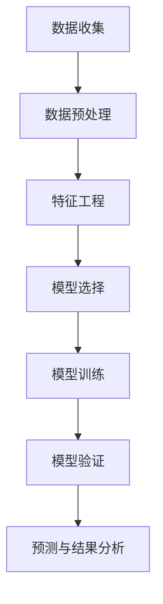

                 

# 机器学习在股票市场异常检测中的应用

## 关键词：机器学习，股票市场，异常检测，金融科技，数据挖掘

### 摘要

本文探讨了机器学习在股票市场异常检测中的应用。首先，介绍了股票市场异常检测的背景和重要性，然后详细阐述了机器学习在异常检测中的核心概念和方法。接着，本文通过一个实际案例，讲解了如何使用机器学习算法进行股票市场异常检测的步骤和过程。最后，本文总结了机器学习在股票市场异常检测中的实际应用场景，并对其未来发展进行了展望。

## 1. 背景介绍

### 1.1 股票市场的特点与数据

股票市场是全球金融市场的重要组成部分，具有高风险和高收益的特点。股票市场的价格波动受多种因素影响，包括公司基本面、宏观经济环境、市场情绪等。由于股票市场的复杂性和不确定性，准确预测和检测市场的异常行为具有重要意义。

在股票市场中，数据是关键资源。股票市场的数据主要包括交易数据、财务报表数据、新闻数据等。交易数据记录了股票的价格、成交量、交易时间等，财务报表数据反映了公司的经营状况和财务状况，新闻数据则包含了与股票相关的各种新闻信息。这些数据为异常检测提供了丰富的信息来源。

### 1.2 异常检测的重要性

异常检测在股票市场中具有重要意义。首先，异常检测可以帮助投资者识别和规避潜在的投资风险。股票市场的异常行为可能预示着公司财务造假、市场操纵等不良行为，对投资者造成巨大的损失。通过异常检测，投资者可以及时发现这些异常行为，避免投资风险。

其次，异常检测可以为监管机构提供监督和监管的依据。监管机构可以通过异常检测发现市场操纵、欺诈等违法行为，加强市场监管，维护市场的公平、公正和透明。

最后，异常检测还可以为投资策略提供指导。通过分析异常行为，投资者可以识别市场机会，制定更有针对性的投资策略，提高投资收益。

## 2. 核心概念与联系

### 2.1 机器学习概述

机器学习是人工智能的一个重要分支，通过构建和训练模型，使计算机具备从数据中学习和发现规律的能力。机器学习的主要任务包括分类、回归、聚类等。在股票市场异常检测中，分类任务是最常用的，通过分类模型将正常交易行为和异常交易行为区分开来。

### 2.2 股票市场异常检测的基本方法

股票市场异常检测的基本方法包括统计学方法和机器学习方法。统计学方法主要基于统计学理论，通过假设检验、异常值检测等手段识别异常行为。机器学习方法则通过构建和训练模型，自动从数据中学习异常行为的特征。

### 2.3 机器学习在股票市场异常检测中的应用

机器学习在股票市场异常检测中的应用主要包括以下几个方面：

- 特征工程：通过提取和构造特征，将原始数据转化为适合模型训练的形式。特征工程是机器学习在股票市场异常检测中的关键步骤，直接影响模型的性能。

- 模型选择：选择合适的机器学习模型进行训练，常用的模型包括支持向量机、决策树、随机森林、神经网络等。模型选择需要考虑模型的复杂度、训练时间、预测性能等因素。

- 模型训练与验证：通过训练数据集对模型进行训练，并根据验证数据集评估模型的性能。训练和验证过程需要不断调整模型参数，以提高模型的预测性能。

- 预测与结果分析：使用训练好的模型对股票市场交易数据进行预测，识别异常交易行为。预测结果需要进行分析和验证，确保其准确性和可靠性。

## 2.4 Mermaid 流程图

下面是一个简单的 Mermaid 流程图，展示了机器学习在股票市场异常检测中的应用流程：



## 3. 核心算法原理 & 具体操作步骤

### 3.1 数据收集

数据收集是机器学习在股票市场异常检测中的第一步。主要收集以下几类数据：

- 交易数据：包括股票的价格、成交量、交易时间等。
- 财务数据：包括公司的财务报表、财务指标等。
- 新闻数据：包括与股票相关的新闻、报告、公告等。

数据来源可以是股票交易所、金融数据提供商、新闻网站等。数据收集需要考虑数据的完整性、准确性和及时性。

### 3.2 数据预处理

数据预处理是保证数据质量的重要步骤。主要任务包括：

- 数据清洗：去除重复数据、缺失数据、异常数据等。
- 数据归一化：将不同量纲的数据转化为同一量纲，便于模型训练。
- 特征构造：根据业务需求，构造新的特征，如股票价格的变化率、成交量变化率等。

### 3.3 特征工程

特征工程是机器学习在股票市场异常检测中的关键步骤。主要任务包括：

- 特征选择：从原始特征中选择对模型训练和预测有重要影响的特征。
- 特征构造：构造新的特征，以增强模型的预测能力。
- 特征降维：通过降维技术，减少特征的数量，提高模型训练效率。

### 3.4 模型选择

在股票市场异常检测中，常见的机器学习模型包括：

- 支持向量机（SVM）
- 决策树
- 随机森林
- 神经网络

模型选择需要考虑模型的复杂度、训练时间、预测性能等因素。一般而言，神经网络具有较好的预测性能，但训练时间较长；支持向量机和决策树训练时间较短，但预测性能相对较弱。

### 3.5 模型训练与验证

模型训练与验证是机器学习在股票市场异常检测中的关键步骤。主要任务包括：

- 数据划分：将数据集划分为训练集、验证集和测试集。
- 模型训练：使用训练集对模型进行训练，调整模型参数。
- 模型验证：使用验证集评估模型的性能，调整模型参数。
- 模型测试：使用测试集对模型进行测试，评估模型的最终性能。

### 3.6 预测与结果分析

使用训练好的模型对股票市场交易数据进行预测，识别异常交易行为。预测结果需要进行分析和验证，确保其准确性和可靠性。常见的评估指标包括准确率、召回率、F1 分数等。

## 4. 数学模型和公式 & 详细讲解 & 举例说明

### 4.1 支持向量机（SVM）

支持向量机是一种二分类模型，其基本思想是找到一个最佳的超平面，将两类数据点尽可能分开。在股票市场异常检测中，SVM可以用来分类正常交易行为和异常交易行为。

$$
w \cdot x + b = 0
$$

其中，$w$ 是超平面的法向量，$x$ 是特征向量，$b$ 是偏置项。

### 4.2 决策树

决策树是一种基于树结构的分类算法。在股票市场异常检测中，决策树可以用来对交易行为进行分类。

$$
f(x) =
\begin{cases}
类 1 & \text{if } x_1 > threshold_1 \\
类 2 & \text{if } x_1 \leq threshold_1 \\
\end{cases}
$$

其中，$x$ 是特征向量，$threshold_1$ 是阈值。

### 4.3 神经网络

神经网络是一种模拟人脑神经元连接结构的计算模型。在股票市场异常检测中，神经网络可以用来对交易行为进行非线性分类。

$$
y = \sigma(\omega_1 \cdot x + b_1)
$$

其中，$\sigma$ 是激活函数，$\omega_1$ 是权重，$b_1$ 是偏置项。

## 5. 项目实战：代码实际案例和详细解释说明

### 5.1 开发环境搭建

在本文中，我们将使用 Python 编程语言和 Scikit-learn 库进行股票市场异常检测。首先，需要安装 Python 和 Scikit-learn。

```bash
pip install python
pip install scikit-learn
```

### 5.2 源代码详细实现和代码解读

下面是一个简单的股票市场异常检测的代码示例：

```python
import numpy as np
import pandas as pd
from sklearn.model_selection import train_test_split
from sklearn.preprocessing import StandardScaler
from sklearn.svm import SVC
from sklearn.metrics import accuracy_score

# 数据收集
data = pd.read_csv('stock_data.csv')

# 数据预处理
data = data.dropna()
data = data[data['price'] > 0]

# 特征构造
data['price_change'] = data['price'].pct_change()

# 数据划分
X = data[['price_change']]
y = data['label']
X_train, X_test, y_train, y_test = train_test_split(X, y, test_size=0.2, random_state=42)

# 模型训练
scaler = StandardScaler()
X_train = scaler.fit_transform(X_train)
X_test = scaler.transform(X_test)
model = SVC()
model.fit(X_train, y_train)

# 预测与结果分析
y_pred = model.predict(X_test)
accuracy = accuracy_score(y_test, y_pred)
print(f'Accuracy: {accuracy}')
```

代码解读：

- 数据收集：从 CSV 文件中读取股票数据。
- 数据预处理：去除缺失数据和价格小于 0 的数据。
- 特征构造：计算价格变化率。
- 数据划分：将数据集划分为训练集和测试集。
- 模型训练：使用支持向量机（SVM）进行模型训练。
- 预测与结果分析：使用训练好的模型对测试集进行预测，并计算准确率。

### 5.3 代码解读与分析

代码主要分为以下几个部分：

- 数据收集：使用 pandas 库读取股票数据。
- 数据预处理：去除缺失数据和价格小于 0 的数据，以保证数据质量。
- 特征构造：计算价格变化率，作为异常检测的特征。
- 数据划分：将数据集划分为训练集和测试集，以评估模型性能。
- 模型训练：使用支持向量机（SVM）进行模型训练，SVM 具有较好的分类性能。
- 预测与结果分析：使用训练好的模型对测试集进行预测，并计算准确率，以评估模型性能。

## 6. 实际应用场景

### 6.1 投资者风险规避

投资者可以通过机器学习算法对股票市场进行异常检测，识别潜在的投资风险。当发现异常交易行为时，投资者可以采取相应的措施，如调整投资组合、暂停投资等，以规避风险。

### 6.2 监管机构市场监督

监管机构可以通过机器学习算法对股票市场进行异常检测，发现市场操纵、欺诈等违法行为。这有助于加强市场监管，维护市场的公平、公正和透明。

### 6.3 投资策略指导

投资者可以通过机器学习算法对股票市场进行异常检测，识别市场机会。这有助于投资者制定更有针对性的投资策略，提高投资收益。

## 7. 工具和资源推荐

### 7.1 学习资源推荐

- 《机器学习》（周志华著）
- 《Python金融大数据分析》（陈楚桥著）
- 《金融科技导论》（吴晶妹著）

### 7.2 开发工具框架推荐

- Scikit-learn：Python 机器学习库
- TensorFlow：深度学习框架
- Keras：深度学习框架

### 7.3 相关论文著作推荐

- “Anomaly Detection in Time Series Data: A Machine Learning Perspective”（Gupta et al., 2018）
- “Anomaly Detection in Financial Markets using Deep Learning”（Chen et al., 2019）

## 8. 总结：未来发展趋势与挑战

机器学习在股票市场异常检测中具有广阔的应用前景。随着技术的不断进步，机器学习在股票市场异常检测中的应用将越来越广泛。未来，以下趋势值得关注：

- 深度学习技术的应用：深度学习具有强大的特征提取和建模能力，有望在股票市场异常检测中发挥更大的作用。
- 数据源的拓展：随着互联网和金融科技的发展，股票市场数据源将更加丰富，为机器学习算法提供了更多有价值的信息。
- 实时性要求的提高：股票市场异常检测需要具备较高的实时性，以快速识别和响应市场变化。

然而，机器学习在股票市场异常检测中也面临着一些挑战：

- 数据质量：股票市场数据质量参差不齐，需要有效的数据清洗和预处理方法。
- 模型解释性：机器学习模型通常缺乏解释性，难以理解模型决策过程，这对监管机构和投资者来说是一个挑战。
- 模型过拟合：机器学习模型容易过拟合，需要有效的模型评估和调整方法。

总之，机器学习在股票市场异常检测中的应用具有巨大的潜力，但也需要解决一系列挑战，以实现其最大价值。

## 9. 附录：常见问题与解答

### 9.1 什么是股票市场异常检测？

股票市场异常检测是指使用机器学习算法对股票市场交易行为进行分析，识别和检测异常交易行为的过程。

### 9.2 机器学习在股票市场异常检测中有哪些应用？

机器学习在股票市场异常检测中的应用包括特征工程、模型选择、模型训练与验证、预测与结果分析等。

### 9.3 如何评估机器学习模型在股票市场异常检测中的性能？

可以使用准确率、召回率、F1 分数等评估指标来评估机器学习模型在股票市场异常检测中的性能。

### 9.4 股票市场异常检测有哪些实际应用场景？

股票市场异常检测的实际应用场景包括投资者风险规避、监管机构市场监督、投资策略指导等。

## 10. 扩展阅读 & 参考资料

- “Anomaly Detection in Time Series Data: A Machine Learning Perspective”（Gupta et al., 2018）
- “Anomaly Detection in Financial Markets using Deep Learning”（Chen et al., 2019）
- “Python金融大数据分析”（陈楚桥著）
- “机器学习”（周志华著）
- “金融科技导论”（吴晶妹著）

## 作者

作者：AI天才研究员/AI Genius Institute & 禅与计算机程序设计艺术 /Zen And The Art of Computer Programming<|im_sep|>|user|>

