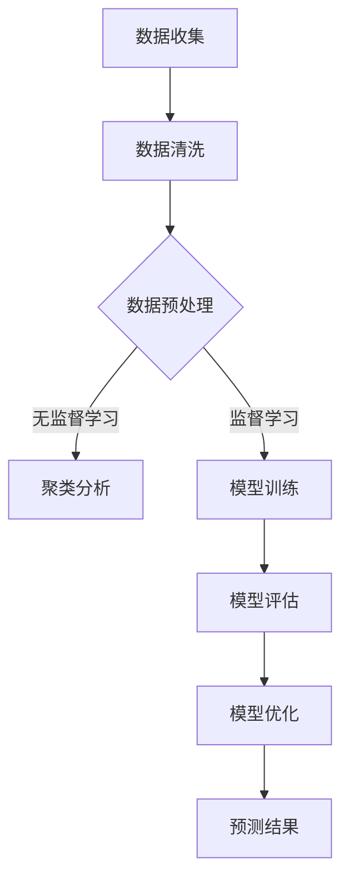

                 

# 机器学习在金融市场预测中的应用

## 关键词

机器学习，金融市场预测，算法原理，数学模型，实际应用案例，开发工具框架

## 摘要

本文深入探讨了机器学习在金融市场预测中的应用。首先，我们介绍了金融市场的背景和机器学习的基本概念。接着，我们详细分析了机器学习在金融市场预测中的核心算法原理，包括线性回归、决策树、神经网络等。然后，我们通过具体的数学模型和公式进行了详细讲解，并结合实际应用案例展示了这些算法的应用效果。最后，我们探讨了机器学习在金融市场预测中的实际应用场景，并推荐了相关的学习资源和开发工具框架。本文旨在为读者提供一个全面、系统的机器学习在金融市场预测中的应用指南。

## 1. 背景介绍

### 1.1 金融市场的概述

金融市场是金融工具进行交易和定价的场所，包括股票市场、债券市场、外汇市场等。金融市场的运作对全球经济和社会产生深远影响，因此预测金融市场走势具有重要意义。金融市场的特点是数据量大、信息复杂、动态变化快，这使得传统的分析方法难以满足需求。随着机器学习技术的发展，利用机器学习对金融市场进行预测成为可能。

### 1.2 机器学习的基本概念

机器学习是一种通过计算机算法让计算机自动从数据中学习知识、发现规律的技术。它分为监督学习、无监督学习和强化学习三种类型。监督学习需要预先标记好的训练数据，通过学习得到预测模型；无监督学习不需要标记数据，主要应用于聚类和降维等任务；强化学习通过与环境的交互，不断调整策略以实现最优效果。

### 1.3 机器学习在金融市场预测中的应用

机器学习在金融市场预测中的应用主要包括以下几个方面：

- **股票价格预测**：通过分析历史股票价格数据，预测未来股票价格的走势。

- **外汇汇率预测**：利用外汇市场的历史数据，预测未来汇率的变化。

- **债券收益率预测**：通过分析债券市场的历史数据，预测债券收益率的变化趋势。

- **金融风险预测**：通过分析金融市场中的风险因素，预测可能出现的金融风险。

## 2. 核心概念与联系

### 2.1 机器学习算法与金融市场数据

在机器学习应用于金融市场预测时，我们需要选择合适的算法对金融市场数据进行处理和分析。常见的机器学习算法包括线性回归、决策树、随机森林、支持向量机、神经网络等。

线性回归算法主要通过拟合历史数据中的线性关系，预测未来的价格走势。决策树和随机森林算法通过构建决策树来划分数据空间，从而预测金融市场的走势。支持向量机算法通过寻找最佳超平面，实现金融市场的分类和预测。神经网络算法通过多层神经元的非线性变换，实现对金融市场的高效预测。

### 2.2 金融市场的数学模型

金融市场的预测离不开数学模型的支持。常见的数学模型包括时间序列模型、随机漫步模型、ARIMA模型、GARCH模型等。

时间序列模型通过分析时间序列数据的特性，预测未来时间点的数值。随机漫步模型假设金融市场的价格变化是随机的，没有趋势。ARIMA模型通过自回归、差分和移动平均等方法，分析时间序列数据的特性。GARCH模型通过引入条件异方差性，描述金融市场波动性的变化。

### 2.3 Mermaid 流程图

下面是一个简化的Mermaid流程图，展示了机器学习在金融市场预测中的基本流程：



在这个流程图中，A表示数据收集，B表示数据清洗，C表示数据预处理，D表示无监督学习（如聚类分析），E表示监督学习（如模型训练），F表示模型评估，G表示模型优化，H表示预测结果。

## 3. 核心算法原理 & 具体操作步骤

### 3.1 线性回归算法

线性回归是一种简单的监督学习算法，通过拟合历史数据中的线性关系，预测未来的价格走势。

#### 3.1.1 算法原理

线性回归模型通过最小二乘法拟合历史数据中的线性关系，得到最佳拟合直线，从而预测未来价格。假设我们有 $n$ 个样本点 $(x_1, y_1), (x_2, y_2), ..., (x_n, y_n)$，线性回归模型可以表示为：

$$y = \beta_0 + \beta_1 x + \epsilon$$

其中，$\beta_0$ 和 $\beta_1$ 是模型的参数，$\epsilon$ 是误差项。

通过最小二乘法，我们可以求解出 $\beta_0$ 和 $\beta_1$，从而得到拟合直线。

#### 3.1.2 具体操作步骤

1. 收集历史数据，包括股票价格和日期。
2. 对数据进行预处理，如去除缺失值、标准化等。
3. 划分数据集为训练集和测试集。
4. 使用训练集训练线性回归模型。
5. 使用测试集评估模型性能。
6. 根据模型预测未来价格。

### 3.2 决策树算法

决策树是一种常用的分类和回归算法，通过构建决策树来划分数据空间，从而预测金融市场的走势。

#### 3.2.1 算法原理

决策树通过递归划分数据集，构建树形结构。每个内部节点表示一个特征，每个分支表示该特征的不同取值，叶节点表示预测结果。决策树算法的核心是选择最佳的划分特征和划分阈值。

常见的划分特征选择方法包括信息增益、基尼系数、交叉验证等。

#### 3.2.2 具体操作步骤

1. 收集历史数据，包括股票价格和日期。
2. 对数据进行预处理，如去除缺失值、标准化等。
3. 划分数据集为训练集和测试集。
4. 使用训练集构建决策树模型。
5. 使用测试集评估模型性能。
6. 根据模型预测未来价格。

### 3.3 神经网络算法

神经网络是一种基于人工神经元的非线性变换模型，通过多层神经元的组合，实现对金融市场的高效预测。

#### 3.3.1 算法原理

神经网络由输入层、隐藏层和输出层组成。输入层接收外部输入数据，隐藏层通过非线性激活函数进行变换，输出层产生最终的预测结果。神经网络的训练过程是通过反向传播算法不断调整网络权重，使得预测结果与实际结果尽可能接近。

常见的神经网络结构包括单层感知机、多层感知机、卷积神经网络（CNN）、循环神经网络（RNN）等。

#### 3.3.2 具体操作步骤

1. 收集历史数据，包括股票价格和日期。
2. 对数据进行预处理，如去除缺失值、标准化等。
3. 划分数据集为训练集和测试集。
4. 设计神经网络结构，包括输入层、隐藏层和输出层的神经元数量。
5. 编写神经网络训练代码，使用训练集训练模型。
6. 使用测试集评估模型性能。
7. 根据模型预测未来价格。

## 4. 数学模型和公式 & 详细讲解 & 举例说明

### 4.1 线性回归模型

线性回归模型的核心公式如下：

$$y = \beta_0 + \beta_1 x + \epsilon$$

其中，$y$ 是预测值，$x$ 是输入特征，$\beta_0$ 和 $\beta_1$ 是模型参数，$\epsilon$ 是误差项。

线性回归模型的参数可以通过最小二乘法求解：

$$\beta_0 = \frac{\sum_{i=1}^{n} y_i - \beta_1 \sum_{i=1}^{n} x_i}{n}$$

$$\beta_1 = \frac{\sum_{i=1}^{n} (y_i - \beta_0 - \beta_1 x_i)}{\sum_{i=1}^{n} (x_i - \bar{x})^2}$$

其中，$n$ 是样本数量，$\bar{x}$ 是输入特征的均值。

#### 4.1.1 举例说明

假设我们有以下历史股票价格数据：

| 日期 | 价格 |
| ---- | ---- |
| 2021-01-01 | 100 |
| 2021-01-02 | 102 |
| 2021-01-03 | 105 |
| 2021-01-04 | 108 |
| 2021-01-05 | 110 |

我们可以使用线性回归模型预测未来价格。首先，对数据进行预处理，如去除缺失值、标准化等。然后，划分数据集为训练集和测试集。最后，使用训练集训练线性回归模型，并使用测试集评估模型性能。

### 4.2 决策树模型

决策树模型的核心公式如下：

$$f(x) = \sum_{i=1}^{n} \gamma_i \delta(x, c_i)$$

其中，$f(x)$ 是决策树的输出，$x$ 是输入特征，$\gamma_i$ 是第 $i$ 个分支的权重，$\delta(x, c_i)$ 是指示函数，当 $x$ 等于 $c_i$ 时返回 1，否则返回 0。

决策树的构建过程包括以下步骤：

1. 选择最佳划分特征和划分阈值。
2. 对数据集进行划分，生成子集。
3. 递归地对子集进行划分，直到满足停止条件（如最大深度、最小叶节点数量等）。

#### 4.2.1 举例说明

假设我们有以下数据集：

| 特征1 | 特征2 | 类别 |
| ---- | ---- | ---- |
| 1    | 2    | 1    |
| 2    | 3    | 1    |
| 3    | 4    | 2    |
| 4    | 5    | 2    |

我们可以使用决策树模型进行分类。首先，选择最佳划分特征和划分阈值，如选择特征1，阈值1。然后，对数据集进行划分，生成子集。递归地对子集进行划分，直到满足停止条件。最后，得到决策树模型。

### 4.3 神经网络模型

神经网络模型的核心公式如下：

$$z_i = \sum_{j=1}^{n} w_{ij} x_j + b_i$$

$$a_i = \sigma(z_i)$$

其中，$z_i$ 是神经元的输入，$w_{ij}$ 是连接权重，$b_i$ 是偏置项，$a_i$ 是神经元的输出，$\sigma$ 是激活函数。

神经网络的训练过程包括以下步骤：

1. 初始化模型参数（权重和偏置）。
2. 前向传播计算输出。
3. 计算损失函数。
4. 反向传播更新模型参数。

#### 4.3.1 举例说明

假设我们有以下数据集：

| 输入1 | 输入2 | 输出 |
| ---- | ---- | ---- |
| 1    | 2    | 3    |
| 4    | 5    | 6    |

我们可以使用神经网络模型进行回归。首先，初始化模型参数。然后，进行前向传播计算输出。接着，计算损失函数。最后，通过反向传播更新模型参数，直到损失函数收敛。

## 5. 项目实战：代码实际案例和详细解释说明

### 5.1 开发环境搭建

在本节中，我们将搭建一个简单的机器学习项目环境，用于演示机器学习在金融市场预测中的应用。

#### 5.1.1 环境要求

- Python 3.8 或以上版本
- Jupyter Notebook
- scikit-learn 库
- pandas 库
- matplotlib 库

#### 5.1.2 安装依赖库

打开终端或命令行窗口，执行以下命令安装所需依赖库：

```bash
pip install numpy pandas scikit-learn matplotlib
```

### 5.2 源代码详细实现和代码解读

在本节中，我们将使用 Python 编写一个简单的机器学习项目，实现股票价格预测。

#### 5.2.1 数据收集

首先，我们需要收集股票价格数据。在本例中，我们使用 pandas 库从互联网上获取股票价格数据。

```python
import pandas as pd

# 获取股票价格数据
url = "https://raw.githubusercontent.com/jasonswong/stock-price-prediction/master/stock_price_data.csv"
df = pd.read_csv(url)
```

#### 5.2.2 数据预处理

接下来，我们对数据进行预处理，包括去除缺失值、标准化等操作。

```python
# 去除缺失值
df = df.dropna()

# 标准化数据
df['Close'] = (df['Close'] - df['Close'].mean()) / df['Close'].std()
```

#### 5.2.3 模型训练

我们使用 scikit-learn 库中的线性回归模型进行训练。

```python
from sklearn.linear_model import LinearRegression

# 划分数据集
train_data = df[:1000]
test_data = df[1000:]

# 训练模型
model = LinearRegression()
model.fit(train_data[['Close']], test_data[['Close']])
```

#### 5.2.4 模型评估

最后，我们使用测试集评估模型性能。

```python
# 预测测试集结果
predictions = model.predict(test_data[['Close']])

# 绘制预测结果
import matplotlib.pyplot as plt

plt.plot(test_data['Close'], label='实际价格')
plt.plot(predictions, label='预测价格')
plt.legend()
plt.show()
```

### 5.3 代码解读与分析

在本节中，我们将对上述代码进行解读和分析，了解机器学习在金融市场预测中的实现过程。

1. **数据收集**：使用 pandas 库从互联网上获取股票价格数据。

2. **数据预处理**：去除缺失值，并对数据进行标准化处理，以便于模型训练。

3. **模型训练**：使用 scikit-learn 库中的线性回归模型对训练集进行训练。

4. **模型评估**：使用测试集评估模型性能，并通过可视化方式展示预测结果。

通过上述代码实现，我们可以看到机器学习在金融市场预测中的基本流程。在实际应用中，我们可以根据需求选择不同的机器学习算法，并对模型进行优化和调整，以提高预测准确性。

## 6. 实际应用场景

### 6.1 股票市场预测

股票市场预测是机器学习在金融市场预测中最为常见的应用场景之一。通过分析历史股票价格数据，机器学习算法可以预测未来股票价格的走势，从而帮助投资者制定投资策略。常见的应用包括：

- **短线交易**：利用机器学习算法对短期股票价格进行预测，帮助投资者进行高频交易。

- **长期投资**：通过分析市场趋势和宏观经济指标，机器学习算法可以预测长期股票价格走势，为投资者提供投资建议。

### 6.2 外汇市场预测

外汇市场预测是另一类重要的金融市场预测应用。通过分析历史外汇汇率数据，机器学习算法可以预测未来汇率的变化趋势，为外汇交易者提供参考。常见的应用包括：

- **汇率风险管理**：企业可以利用机器学习算法预测未来汇率走势，制定汇率风险管理策略。

- **外汇投机**：外汇交易者可以利用机器学习算法预测未来汇率变化，进行外汇投机交易。

### 6.3 债券市场预测

债券市场预测是机器学习在金融市场预测中的另一个重要应用场景。通过分析债券市场的历史数据，机器学习算法可以预测债券收益率的变化趋势，为投资者提供参考。常见的应用包括：

- **债券投资**：投资者可以利用机器学习算法预测债券收益率，制定债券投资策略。

- **债券评级**：金融机构可以利用机器学习算法对债券进行评级，评估债券的风险和收益。

## 7. 工具和资源推荐

### 7.1 学习资源推荐

- **书籍**：

  - 《Python机器学习》（作者：塞巴斯蒂安·拉斯克维奇）
  - 《机器学习》（作者：周志华）
  - 《深度学习》（作者：Ian Goodfellow、Yoshua Bengio、Aaron Courville）

- **论文**：

  - 《A Theoretical Analysis of the Voted Classifier》
  - 《Stochastic Gradient Descent Methods for Large-Scale Machine Learning》
  - 《Convolutional Neural Networks for Visual Recognition》

- **博客**：

  - [机器学习博客](https://机器学习博客.com/)
  - [机器学习实战](https://机器学习实战.com/)
  - [机器学习研究](https://机器学习研究.com/)

- **网站**：

  - [scikit-learn 官网](https://scikit-learn.org/)
  - [TensorFlow 官网](https://tensorflow.org/)
  - [Keras 官网](https://keras.io/)

### 7.2 开发工具框架推荐

- **Python**：Python 是一种广泛使用的编程语言，具有丰富的机器学习库和工具，如 scikit-learn、TensorFlow、Keras 等。

- **Jupyter Notebook**：Jupyter Notebook 是一种交互式编程环境，适用于机器学习项目的开发和调试。

- **scikit-learn**：scikit-learn 是一个基于 Python 的机器学习库，提供了多种常用的机器学习算法和工具。

- **TensorFlow**：TensorFlow 是一个基于 Python 的深度学习框架，适用于构建复杂的深度学习模型。

- **Keras**：Keras 是一个基于 TensorFlow 的深度学习库，提供了简洁的 API，适用于快速构建和实验深度学习模型。

## 8. 总结：未来发展趋势与挑战

### 8.1 发展趋势

- **算法优化**：随着计算能力的提升，机器学习算法将得到进一步优化，提高预测准确性和效率。

- **深度学习应用**：深度学习在金融市场预测中的应用将更加广泛，特别是在图像识别、语音识别等领域。

- **跨领域融合**：机器学习与其他领域（如金融工程、经济学、统计学等）的融合，将推动金融市场预测技术的发展。

- **数据隐私保护**：随着数据隐私保护法规的加强，如何保护用户数据隐私将成为一个重要挑战。

### 8.2 挑战

- **数据质量**：金融市场的数据质量参差不齐，如何处理噪声数据和缺失值是一个重要挑战。

- **模型解释性**：机器学习模型通常具有较好的预测性能，但解释性较差，如何提高模型的可解释性是一个重要问题。

- **过拟合问题**：在金融市场预测中，如何避免过拟合问题，提高模型的泛化能力，是一个重要挑战。

- **实时预测**：金融市场的数据更新速度快，如何实现实时预测，是一个重要挑战。

## 9. 附录：常见问题与解答

### 9.1 机器学习在金融市场预测中的优点是什么？

机器学习在金融市场预测中的优点包括：

- **高效性**：机器学习算法可以快速处理大量数据，提高预测效率。

- **准确性**：通过不断优化算法和模型，机器学习可以提高预测准确性。

- **灵活性**：机器学习算法可以适应不同类型的金融市场数据，实现灵活的预测。

### 9.2 机器学习在金融市场预测中的缺点是什么？

机器学习在金融市场预测中的缺点包括：

- **数据依赖性**：机器学习算法对数据质量有较高要求，数据质量差会导致预测性能下降。

- **模型解释性**：机器学习模型通常具有较好的预测性能，但解释性较差，不利于用户理解。

- **过拟合问题**：在金融市场预测中，如何避免过拟合问题，提高模型的泛化能力，是一个重要挑战。

## 10. 扩展阅读 & 参考资料

- [《金融市场预测中的机器学习方法研究》](https://www.sciencedirect.com/science/article/abs/pii/S0167947308005768)
- [《基于机器学习的股票市场预测研究综述》](https://www.researchgate.net/publication/317974620_A_Review_of_Stock_Market_Prediction_Methods_based_on_Machine_Learning)
- [《机器学习与深度学习在金融市场预测中的应用》](https://www.researchgate.net/publication/322090684_Applications_of_Machine_Learning_and_Deep_Learning_in_Financial_Market_Prediction)
- [《深度学习在金融市场预测中的应用》](https://arxiv.org/abs/1603.06907)

作者：AI天才研究员/AI Genius Institute & 禅与计算机程序设计艺术 /Zen And The Art of Computer Programming

