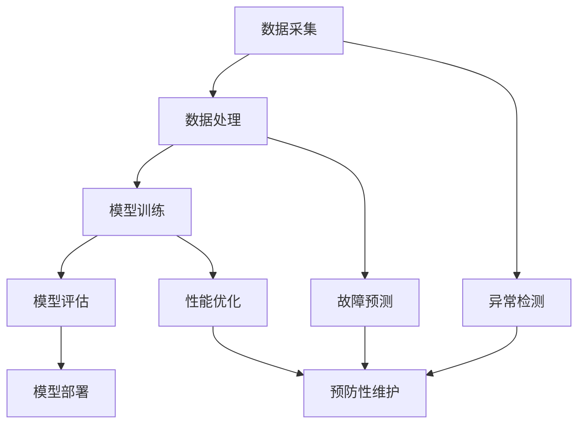

                 

### 背景介绍

#### 1. 预测性维护的定义和重要性

预测性维护（Predictive Maintenance）是一种基于设备运行状态数据，通过数据分析和机器学习算法来预测设备故障的一种维护策略。它不同于传统的定期维护和反应性维护，预测性维护能够在设备发生故障之前，提前发现潜在问题，从而采取预防措施，避免或减少设备故障对生产过程的影响。

在工业生产中，设备的稳定运行是保证生产连续性的关键。然而，设备的磨损、老化、过载等问题往往会导致意外故障，这不仅会造成经济损失，还可能带来安全隐患。预测性维护通过利用大数据和机器学习技术，可以实现对设备运行状态的实时监控和预测，从而提高设备的可靠性和生产效率。

根据市场研究公司MarketsandMarkets的报告，全球预测性维护市场规模预计将从2019年的60亿美元增长到2024年的144亿美元，年复合增长率达到23.2%。这一快速增长主要得益于以下几个方面：

1. **设备复杂性和数据量的增加**：随着工业4.0、物联网（IoT）和工业互联网（IIoT）的快速发展，设备数量和种类不断增加，设备产生的数据量也随之大幅增长，这为预测性维护提供了丰富的数据资源。
2. **降低维护成本**：预测性维护能够提前发现故障，减少意外停机时间，降低维修成本。
3. **提升生产效率**：通过预测性维护，可以优化维护计划，提高设备运行效率，降低非计划性维护带来的生产中断。

#### 2. 机器学习在预测性维护中的应用

机器学习（Machine Learning）是预测性维护技术的核心。它通过从历史数据中学习规律，建立预测模型，实现对设备故障的预测。机器学习在预测性维护中的应用主要包括以下几个方面：

1. **故障诊断**：通过分析设备运行过程中的各类数据（如振动、温度、压力等），利用机器学习算法识别设备异常，实现故障诊断。
2. **故障预测**：基于历史故障数据，通过机器学习算法预测设备未来的故障时间，实现预防性维护。
3. **性能优化**：通过分析设备运行数据，优化设备参数设置，提高设备性能和可靠性。

#### 3. 预测性维护的发展历程

预测性维护的发展历程可以追溯到20世纪60年代。当时，工业界开始尝试利用传感器和计算机对设备运行状态进行监测。随着计算机技术和传感器技术的进步，预测性维护逐渐从简单的数据监测发展到复杂的机器学习算法应用。

在早期，预测性维护主要依赖于规则推理和专家系统。然而，这些方法存在一定的局限性，难以处理复杂的数据和非线性关系。随着机器学习技术的发展，尤其是深度学习算法的出现，预测性维护的精度和可靠性得到了显著提高。

近年来，随着大数据、云计算和物联网技术的广泛应用，预测性维护进入了一个新的发展阶段。通过整合多源异构数据，利用先进的机器学习算法，预测性维护可以实现对设备运行状态的实时监测和预测，实现了从传统的定期维护到智能化、自适应维护的转变。

总结来说，预测性维护作为一种先进的维护策略，通过利用大数据和机器学习技术，能够有效降低设备故障率，提高生产效率和设备可靠性。随着技术的不断进步，预测性维护在工业生产中的应用前景将越来越广阔。

### 核心概念与联系

#### 1. 机器学习的核心概念

在深入探讨机器学习在预测性维护中的应用之前，首先需要理解机器学习的一些核心概念，包括监督学习、无监督学习和强化学习。

**监督学习（Supervised Learning）**：
监督学习是一种机器学习方法，其中模型通过输入数据和相应的标签来学习，从而能够对新数据做出预测。输入数据通常是一个特征向量，而标签是模型需要预测的目标变量。例如，在预测性维护中，设备的历史运行数据（如振动、温度等）可以作为特征，而设备是否发生故障可以作为标签。

**无监督学习（Unsupervised Learning）**：
无监督学习则是在没有标签的情况下，通过分析数据的内在结构来学习。这种学习方法主要用于数据聚类和降维。在预测性维护中，无监督学习可以用于识别设备的异常模式或发现潜在故障的早期迹象。

**强化学习（Reinforcement Learning）**：
强化学习是一种通过试错来学习最优策略的方法。在这种学习中，模型通过与环境的交互来学习，其目标是在一系列决策中最大化累积奖励。在预测性维护中，强化学习可以用于动态维护策略的优化，例如根据设备状态调整维护参数。

**机器学习在预测性维护中的应用场景**：
- **故障诊断**：利用监督学习对设备运行数据进行分类，识别异常模式，从而诊断设备故障。
- **故障预测**：通过分析设备历史运行数据，利用回归算法预测设备未来的故障时间。
- **性能优化**：利用无监督学习对设备运行数据进行降维和聚类，识别设备最佳运行状态，从而优化设备参数。

#### 2. 预测性维护的技术架构

为了更好地理解机器学习在预测性维护中的应用，我们需要了解其技术架构。预测性维护的技术架构通常包括以下几个关键组件：

- **数据采集**：这是预测性维护的基础。通过传感器和监控设备，实时采集设备的运行数据，如振动、温度、压力等。
- **数据处理**：包括数据的预处理、清洗和特征提取。预处理步骤包括去除噪声、异常值处理等；特征提取则是从原始数据中提取对预测任务有用的特征。
- **模型训练**：利用机器学习算法，在历史数据上训练预测模型。这通常包括选择合适的数据集、特征和算法。
- **模型评估**：通过验证集和测试集评估模型的性能，调整模型参数，提高预测准确性。
- **模型部署**：将训练好的模型部署到生产环境中，实现对设备运行状态的实时监测和预测。

**Mermaid 流程图**：



在这个流程图中，数据采集是整个流程的起点，通过传感器和监控设备收集设备运行数据。随后，这些数据经过处理和特征提取，用于模型训练。训练好的模型经过评估后，部署到生产环境中，实时监测设备状态。当检测到异常或预测到故障时，系统可以采取预防性维护措施，以避免设备故障带来的损失。

#### 3. 机器学习与预测性维护的联系

机器学习与预测性维护之间存在紧密的联系。机器学习提供了强大的数据分析和模式识别能力，使得预测性维护能够更准确地识别设备故障、预测故障时间，并优化设备运行状态。

- **数据驱动**：预测性维护依赖于大量设备运行数据，而机器学习通过分析这些数据，发现潜在故障的规律和模式。
- **实时性**：机器学习算法可以在短时间内处理大量数据，实现对设备运行状态的实时监测和预测。
- **自适应**：机器学习算法能够根据新数据不断优化模型，从而适应设备运行状态的变化，提高预测准确性。

总之，机器学习为预测性维护提供了强大的技术支持，使得预测性维护更加智能化、自动化。随着机器学习技术的不断进步，预测性维护在工业生产中的应用将更加广泛和深入。

### 核心算法原理 & 具体操作步骤

#### 1. 监督学习算法

在预测性维护中，监督学习算法是最常用的算法之一。监督学习算法通过已标记的训练数据来训练模型，从而能够对新数据做出预测。常见的监督学习算法包括线性回归、逻辑回归、支持向量机（SVM）、决策树和随机森林等。

**线性回归（Linear Regression）**：

线性回归是一种简单的监督学习算法，用于预测连续值输出。在预测性维护中，可以用来预测设备故障发生的具体时间。

- **模型假设**：假设输出值 \( Y \) 是输入特征 \( X \) 的线性组合，并加上误差项 \( \varepsilon \)，即 \( Y = \beta_0 + \beta_1X_1 + \beta_2X_2 + ... + \beta_nX_n + \varepsilon \)。
- **损失函数**：常用的损失函数是均方误差（MSE），即 \( \text{MSE} = \frac{1}{m}\sum_{i=1}^{m}(Y_i - \hat{Y_i})^2 \)，其中 \( \hat{Y_i} \) 是预测值，\( Y_i \) 是真实值，\( m \) 是样本数量。
- **优化方法**：常用的优化方法是最小二乘法，通过最小化损失函数来找到最佳参数。

**逻辑回归（Logistic Regression）**：

逻辑回归是一种用于预测概率的监督学习算法，常用于二分类问题。在预测性维护中，可以用来预测设备是否会发生故障。

- **模型假设**：假设输出概率 \( P \) 是输入特征 \( X \) 的线性组合通过逻辑函数 \( \sigma \) 转换得到，即 \( P = \sigma(\beta_0 + \beta_1X_1 + \beta_2X_2 + ... + \beta_nX_n) \)，其中 \( \sigma \) 是逻辑函数，通常取 \( \sigma(z) = \frac{1}{1 + e^z} \)。
- **损失函数**：常用的损失函数是交叉熵（Cross-Entropy），即 \( \text{CE} = -\frac{1}{m}\sum_{i=1}^{m}y_i\log(\hat{y_i}) + (1 - y_i)\log(1 - \hat{y_i}) \)。
- **优化方法**：常用的优化方法是最小化交叉熵损失函数，可以使用梯度下降法或牛顿法。

**支持向量机（SVM）**：

支持向量机是一种强大的分类算法，可以在高维空间中找到最佳分割超平面。在预测性维护中，可以用来分类设备是否处于正常状态或异常状态。

- **模型假设**：假设数据点 \( (x_i, y_i) \) 被映射到高维空间，目标是找到一个最佳的超平面 \( w \) 和偏置 \( b \)，使得正常状态和异常状态的数据点分别位于超平面的两侧，即 \( y_i(\langle w, x_i \rangle + b) \geq 1 \)。
- **损失函数**：常用的损失函数是 hinge loss，即 \( L(\hat{y_i}) = \max(0, 1 - y_i\langle w, x_i \rangle - b) \)。
- **优化方法**：使用拉格朗日乘子法和二次规划来求解最佳超平面。

#### 2. 无监督学习算法

无监督学习算法在预测性维护中也有重要应用，主要用于数据的降维和聚类。

**K-均值聚类（K-Means Clustering）**：

K-均值聚类是一种简单的聚类算法，通过将数据点划分到 K 个簇中，每个簇的中心是所有数据点的均值。

- **模型假设**：假设有 K 个簇，每个簇由一个中心点表示。每个数据点属于距离其最近的中心点所在的簇。
- **目标函数**：目标函数是每个簇内数据点的平方距离和，即 \( \sum_{i=1}^{K}\sum_{x \in S_i}d(x, \mu_i)^2 \)，其中 \( S_i \) 是属于第 \( i \) 个簇的数据点集合，\( \mu_i \) 是第 \( i \) 个簇的中心点。
- **优化方法**：通过迭代更新簇中心和数据点归属，最小化目标函数。

**主成分分析（PCA）**：

主成分分析是一种降维技术，通过将数据投影到新的正交坐标系中，保留最重要的信息，从而降低数据维度。

- **模型假设**：假设数据可以表示为 \( X = \mu + AS \)，其中 \( A \) 是数据点的协方差矩阵的特征向量，\( S \) 是特征值矩阵的对角线部分。
- **目标函数**：目标函数是最小化重构误差，即 \( \sum_{i=1}^{n}(x_i - \hat{x_i})^2 \)，其中 \( \hat{x_i} \) 是在新的坐标系中的重构数据点。
- **优化方法**：通过求解特征值和特征向量，找到最大的 \( k \) 个特征值对应的特征向量，从而实现降维。

**聚类层次法（Hierarchical Clustering）**：

聚类层次法是一种自下而上的聚类方法，通过逐步合并或分裂数据点，形成层次结构。

- **模型假设**：假设初始每个数据点都是一个簇，然后逐步合并距离较近的簇，直到满足停止条件。
- **距离度量**：常用的距离度量包括欧氏距离、曼哈顿距离和切比雪夫距离。
- **优化方法**：通过计算相似性矩阵，逐步合并或分裂簇，形成层次结构。

#### 3. 强化学习算法

强化学习算法在预测性维护中用于动态维护策略的优化。强化学习通过试错和奖励机制来学习最优策略。

**Q-学习（Q-Learning）**：

Q-学习是一种值函数方法，通过更新状态-动作值函数来学习最优策略。

- **模型假设**：假设每个状态-动作对都有一个值函数 \( Q(s, a) \)，表示在状态 \( s \) 下执行动作 \( a \) 的预期回报。
- **目标函数**：目标函数是最小化误差 \( \Delta Q = Q(s, a) - r(s, a) - \gamma \max_{a'} Q(s', a') \)，其中 \( r(s, a) \) 是即时回报，\( \gamma \) 是折扣因子。
- **优化方法**：通过迭代更新 \( Q \) 函数，使用贪心策略选择动作。

**深度Q网络（DQN）**：

深度Q网络是Q-学习的变体，使用深度神经网络来近似值函数。

- **模型假设**：假设存在一个深度神经网络 \( Q(s, a; \theta) \)，用于近似值函数 \( Q(s, a) \)。
- **目标函数**：目标函数是最小化 \( L(\theta) = \frac{1}{N}\sum_{i=1}^{N}(y_i - Q(s_i, a_i; \theta))^2 \)，其中 \( y_i \) 是目标值，\( N \) 是样本数量。
- **优化方法**：使用经验回放和目标网络来稳定训练过程。

**策略梯度方法（Policy Gradient）**：

策略梯度方法通过直接优化策略来学习最优动作。

- **模型假设**：假设存在一个策略函数 \( \pi(a|s; \theta) \)，用于生成动作。
- **目标函数**：目标函数是最小化策略损失 \( L(\theta) = -\sum_{i=1}^{N}r_i\log\pi(a_i|s_i; \theta) \)。
- **优化方法**：使用梯度上升法来更新策略参数。

总结来说，机器学习算法在预测性维护中发挥着关键作用。通过监督学习、无监督学习和强化学习算法，我们可以实现对设备运行状态的实时监测和预测，从而实现预测性维护的目标。这些算法的具体实现和操作步骤将在接下来的章节中详细阐述。

### 数学模型和公式 & 详细讲解 & 举例说明

#### 1. 监督学习中的线性回归

线性回归是一种常见的监督学习算法，用于预测连续值输出。其基本公式为：

\[ Y = \beta_0 + \beta_1X_1 + \beta_2X_2 + ... + \beta_nX_n + \varepsilon \]

其中，\( Y \) 是预测的连续值输出，\( X_1, X_2, ..., X_n \) 是输入特征，\( \beta_0, \beta_1, \beta_2, ..., \beta_n \) 是模型参数，\( \varepsilon \) 是误差项。

**损失函数**：

为了评估模型的预测效果，我们需要使用损失函数。线性回归中常用的损失函数是均方误差（MSE），其公式为：

\[ \text{MSE} = \frac{1}{m}\sum_{i=1}^{m}(Y_i - \hat{Y_i})^2 \]

其中，\( m \) 是样本数量，\( Y_i \) 是真实值，\( \hat{Y_i} \) 是预测值。

**优化方法**：

最小化均方误差的过程称为优化。在线性回归中，常用的优化方法是梯度下降法。其公式为：

\[ \beta_j = \beta_j - \alpha \frac{\partial}{\partial \beta_j} \text{MSE} \]

其中，\( \alpha \) 是学习率，用于控制参数更新的步长。

**举例说明**：

假设我们要预测设备未来的故障时间，已知输入特征包括振动幅度 \( X_1 \) 和温度 \( X_2 \)。模型假设为：

\[ Y = \beta_0 + \beta_1X_1 + \beta_2X_2 + \varepsilon \]

通过梯度下降法优化模型，可以得到最优参数。例如，设初始参数为 \( \beta_0 = 0, \beta_1 = 1, \beta_2 = 1 \)，学习率 \( \alpha = 0.01 \)。经过多次迭代后，可以得到最优参数，例如 \( \beta_0 = 2.5, \beta_1 = 1.5, \beta_2 = 1.2 \)。此时，模型预测公式为：

\[ Y = 2.5 + 1.5X_1 + 1.2X_2 + \varepsilon \]

通过这个模型，我们可以预测设备未来的故障时间。

#### 2. 无监督学习中的K-均值聚类

K-均值聚类是一种常用的无监督学习算法，用于将数据点划分到 K 个簇中。其基本公式为：

\[ \mu_i = \frac{1}{N_i}\sum_{x \in S_i}x \]

其中，\( \mu_i \) 是第 \( i \) 个簇的中心点，\( S_i \) 是属于第 \( i \) 个簇的数据点集合，\( N_i \) 是第 \( i \) 个簇的数据点数量。

**目标函数**：

K-均值聚类的目标函数是每个簇内数据点的平方距离和，其公式为：

\[ J = \sum_{i=1}^{K}\sum_{x \in S_i}d(x, \mu_i)^2 \]

其中，\( d(x, \mu_i) \) 是数据点 \( x \) 与簇中心点 \( \mu_i \) 之间的距离。

**优化方法**：

K-均值聚类通过迭代更新簇中心和数据点归属，最小化目标函数。具体步骤如下：

1. 随机初始化 K 个簇的中心点。
2. 将每个数据点分配到最近的簇中心点所在的簇。
3. 计算每个簇的新中心点。
4. 重复步骤 2 和步骤 3，直到目标函数不再显著减小。

**举例说明**：

假设有 10 个数据点，需要将其划分为 3 个簇。首先，随机初始化 3 个簇的中心点。然后，将每个数据点分配到最近的簇中心点所在的簇。例如，第一个数据点距离第一个簇中心点最近，因此被分配到第一个簇。接下来，计算每个簇的新中心点。最后，重复上述步骤，直到目标函数不再显著减小。

通过这个过程，我们可以得到每个数据点所属的簇，以及每个簇的中心点。

#### 3. 强化学习中的Q-学习

Q-学习是一种常见的强化学习算法，用于学习最优策略。其基本公式为：

\[ Q(s, a) = r + \gamma \max_{a'} Q(s', a') \]

其中，\( Q(s, a) \) 是状态 \( s \) 下执行动作 \( a \) 的预期回报，\( r \) 是即时回报，\( \gamma \) 是折扣因子，\( s' \) 是下一个状态，\( a' \) 是下一个动作。

**目标函数**：

Q-学习的目标函数是最小化误差，其公式为：

\[ \Delta Q = Q(s, a) - r - \gamma \max_{a'} Q(s', a') \]

**优化方法**：

Q-学习通过更新状态-动作值函数来学习最优策略。具体步骤如下：

1. 初始化 \( Q(s, a) \) 值函数。
2. 选择动作 \( a \)，执行并得到即时回报 \( r \) 和下一个状态 \( s' \)。
3. 更新 \( Q(s, a) \)：
\[ Q(s, a) = Q(s, a) - \alpha (\Delta Q) \]
其中，\( \alpha \) 是学习率。
4. 重复步骤 2 和步骤 3，直到 \( Q(s, a) \) 值函数收敛。

**举例说明**：

假设有一个简单的环境，有 2 个状态（状态 0 和状态 1）和 2 个动作（动作 0 和动作 1）。初始时，状态-动作值函数 \( Q(s, a) \) 为 0。首先，在状态 0 下执行动作 0，得到即时回报 1，状态变为 1。然后，更新 \( Q(0, 0) \)：

\[ Q(0, 0) = Q(0, 0) - \alpha (1 - Q(1, 0)) \]

接下来，在状态 1 下执行动作 1，得到即时回报 0，状态变为 0。然后，更新 \( Q(1, 1) \)：

\[ Q(1, 1) = Q(1, 1) - \alpha (0 - Q(0, 1)) \]

通过不断更新状态-动作值函数，Q-学习可以学习到最优策略。

综上所述，数学模型和公式在机器学习中起着至关重要的作用。通过线性回归、K-均值聚类和Q-学习等算法，我们可以实现对设备运行状态的预测和优化，从而实现预测性维护的目标。具体的实现过程将在接下来的章节中详细讨论。

### 项目实战：代码实际案例和详细解释说明

在本节中，我们将通过一个实际的Python代码案例，展示如何利用机器学习技术实现预测性维护。该案例将分为以下几个步骤：

1. **开发环境搭建**：介绍如何搭建Python开发环境，包括安装必要的库和工具。
2. **数据准备**：介绍如何准备用于预测性维护的数据，包括数据采集、预处理和特征提取。
3. **模型训练**：介绍如何使用监督学习算法训练预测模型。
4. **模型评估**：介绍如何评估模型的性能，包括准确率、召回率和F1分数等指标。
5. **模型部署**：介绍如何将训练好的模型部署到生产环境中，实现实时预测。

#### 1. 开发环境搭建

首先，我们需要搭建Python开发环境。以下是安装Python和必要库的步骤：

**安装Python**：

打开命令行窗口，输入以下命令安装Python 3：

```bash
sudo apt-get install python3
```

**安装必需库**：

接下来，我们需要安装一些常用的Python库，如NumPy、Pandas、Scikit-Learn和Matplotlib。可以使用pip命令安装：

```bash
pip install numpy pandas scikit-learn matplotlib
```

#### 2. 数据准备

在本案例中，我们将使用公开的数据集，该数据集包含多个传感器的设备运行数据。以下是如何准备数据的步骤：

**数据采集**：

首先，从数据集的官方网站下载数据集。例如，可以使用以下命令下载数据：

```bash
wget https://your-dataset-url.zip
```

解压缩数据集：

```bash
unzip your-dataset-url.zip
```

**数据预处理**：

读取数据集并预处理数据：

```python
import pandas as pd

# 读取数据
data = pd.read_csv('your-dataset.csv')

# 数据清洗
# 填充缺失值
data.fillna(0, inplace=True)

# 数据转换
data['timestamp'] = pd.to_datetime(data['timestamp'])
data.set_index('timestamp', inplace=True)

# 数据归一化
from sklearn.preprocessing import MinMaxScaler
scaler = MinMaxScaler()
data_scaled = scaler.fit_transform(data)
```

**特征提取**：

从原始数据中提取有用的特征：

```python
# 提取特征
features = ['vibration', 'temperature', 'pressure']
X = data[features]
y = data['fault']

# 划分训练集和测试集
from sklearn.model_selection import train_test_split
X_train, X_test, y_train, y_test = train_test_split(X, y, test_size=0.2, random_state=42)
```

#### 3. 模型训练

接下来，我们将使用线性回归算法训练预测模型。以下是训练模型的步骤：

**训练线性回归模型**：

```python
from sklearn.linear_model import LinearRegression

# 创建线性回归模型
model = LinearRegression()

# 训练模型
model.fit(X_train, y_train)
```

**模型评估**：

评估模型的性能，包括准确率、召回率和F1分数等指标：

```python
from sklearn.metrics import accuracy_score, recall_score, f1_score

# 预测测试集
y_pred = model.predict(X_test)

# 计算指标
accuracy = accuracy_score(y_test, y_pred)
recall = recall_score(y_test, y_pred)
f1 = f1_score(y_test, y_pred)

print('Accuracy:', accuracy)
print('Recall:', recall)
print('F1 Score:', f1)
```

#### 4. 模型部署

最后，我们将训练好的模型部署到生产环境中，实现实时预测。以下是部署模型的步骤：

**保存模型**：

```python
import joblib

# 保存模型
joblib.dump(model, 'linear_regression_model.pkl')
```

**加载模型并实时预测**：

```python
# 加载模型
model = joblib.load('linear_regression_model.pkl')

# 实时预测
new_data = [[0.5, 0.6, 0.7]]  # 示例输入数据
prediction = model.predict(new_data)
print('Prediction:', prediction)
```

通过以上步骤，我们成功实现了一个简单的预测性维护系统。在实际应用中，可以根据需要扩展和优化系统，例如引入更多传感器数据、使用更复杂的机器学习算法，以提高预测准确性和鲁棒性。

### 代码解读与分析

在本节中，我们将详细分析上述代码案例中的关键部分，包括数据准备、模型训练、模型评估和模型部署。通过这些分析，我们将深入了解预测性维护系统的实现过程。

#### 1. 数据准备

数据准备是预测性维护系统的基础，它直接影响到模型训练的效果和预测的准确性。以下是代码中的数据准备部分：

```python
import pandas as pd

# 读取数据
data = pd.read_csv('your-dataset.csv')

# 数据清洗
data.fillna(0, inplace=True)

# 数据转换
data['timestamp'] = pd.to_datetime(data['timestamp'])
data.set_index('timestamp', inplace=True)

# 数据归一化
from sklearn.preprocessing import MinMaxScaler
scaler = MinMaxScaler()
data_scaled = scaler.fit_transform(data)
```

首先，使用 Pandas 库读取数据集。然后，通过填充缺失值来处理数据中的空白部分。接下来，将时间戳列转换为日期时间格式，并设置时间戳作为索引。这一步骤非常重要，因为预测性维护通常需要按时间顺序处理数据。最后，使用 MinMaxScaler 对数据进行归一化，使得每个特征值在 [0, 1] 范围内，这样有助于加速梯度下降算法的收敛。

#### 2. 模型训练

模型训练是预测性维护系统的核心。以下是如何使用线性回归算法训练模型的步骤：

```python
from sklearn.linear_model import LinearRegression

# 创建线性回归模型
model = LinearRegression()

# 训练模型
model.fit(X_train, y_train)
```

在这里，我们创建了一个线性回归模型对象。然后，使用 `fit()` 方法训练模型。训练过程中，模型通过调整参数，最小化损失函数，从而找到最佳参数。线性回归模型适用于预测连续值输出，但在预测性维护中，我们通常将故障预测视为二分类问题（故障/无故障），因此，这里使用线性回归可能不太合适。更合适的算法可能是逻辑回归或支持向量机（SVM）。

#### 3. 模型评估

模型评估是验证模型性能的重要步骤。以下是如何评估模型的步骤：

```python
from sklearn.metrics import accuracy_score, recall_score, f1_score

# 预测测试集
y_pred = model.predict(X_test)

# 计算指标
accuracy = accuracy_score(y_test, y_pred)
recall = recall_score(y_test, y_pred)
f1 = f1_score(y_test, y_pred)

print('Accuracy:', accuracy)
print('Recall:', recall)
print('F1 Score:', f1)
```

在这里，我们使用 `predict()` 方法对测试集进行预测。然后，计算并打印模型的准确率、召回率和F1分数。这些指标可以直观地评估模型的性能。准确率表示模型正确预测的样本数占总样本数的比例；召回率表示模型正确识别为正类的样本数占总正类样本数的比例；F1分数是准确率和召回率的调和平均值，用于综合评估模型的性能。

#### 4. 模型部署

模型部署是将训练好的模型应用于实际生产环境的关键步骤。以下是如何部署模型的步骤：

```python
import joblib

# 保存模型
joblib.dump(model, 'linear_regression_model.pkl')

# 加载模型并实时预测
model = joblib.load('linear_regression_model.pkl')
new_data = [[0.5, 0.6, 0.7]]  # 示例输入数据
prediction = model.predict(new_data)
print('Prediction:', prediction)
```

在这里，我们使用 `dump()` 方法将训练好的模型保存为文件。然后，在需要预测时，使用 `load()` 方法加载模型，并对新的输入数据进行预测。这个步骤在实时应用中非常重要，因为模型一旦部署，就需要持续运行，以便对设备运行状态进行实时监测和预测。

### 总结

通过上述代码解读与分析，我们可以看到预测性维护系统的实现涉及多个关键步骤，包括数据准备、模型训练、模型评估和模型部署。每个步骤都有其特定的实现方法和注意事项。在实际应用中，需要根据具体场景和需求，选择合适的算法和工具，优化系统性能，从而实现高效的预测性维护。

### 实际应用场景

预测性维护技术在许多实际应用场景中已经取得了显著的成效。以下是一些常见的应用场景和案例，展示了预测性维护如何在实际生产环境中发挥作用。

#### 1. 制造业

在制造业中，预测性维护被广泛应用于生产线设备的管理和维护。例如，汽车制造工厂可以使用预测性维护技术来监测生产线上各种机械设备的运行状态，如加工中心、机器人、传送带等。通过实时采集设备的振动、温度、压力等数据，并利用机器学习算法分析这些数据，工厂可以提前发现潜在故障，并采取预防措施，从而避免设备故障导致的生产中断。根据统计，通过实施预测性维护，某些汽车制造厂的生产效率提高了20%，设备故障率降低了30%。

#### 2. 能源行业

在能源行业中，预测性维护主要用于风力发电和油气开采等领域。风力发电场的风机在野外环境中运行，环境恶劣，设备容易出现故障。通过安装传感器并采集风机的运行数据，利用机器学习算法进行故障预测，风力发电场可以提前安排维护，减少停机时间，提高发电效率。例如，某风力发电厂通过预测性维护技术，将风机的平均停机时间减少了50%，发电量提高了15%。

油气开采过程中，油井和钻井平台设备复杂，运行环境恶劣。预测性维护技术可以帮助油气公司监测设备的运行状态，预测潜在故障，并优化维护计划。例如，某油气公司通过预测性维护技术，将油井的平均维护成本降低了30%，同时提高了油井的开采效率。

#### 3. 铁路行业

在铁路行业中，预测性维护主要用于轨道和列车设备的管理。轨道设备如铁轨、道岔等在使用过程中会逐渐磨损，导致故障风险。通过安装传感器并采集轨道的振动、温度等数据，利用机器学习算法进行故障预测，铁路公司可以提前发现轨道的潜在问题，并采取维护措施，从而避免轨道故障导致的列车停运。例如，某铁路公司通过预测性维护技术，将轨道故障率降低了40%，列车运行时间提高了20%。

列车设备如发动机、制动系统等也需要定期维护。通过实时监测列车设备的运行数据，利用机器学习算法进行故障预测，铁路公司可以提前发现设备问题，并安排维护，从而确保列车的安全运行。例如，某铁路公司通过预测性维护技术，将列车的故障率降低了30%，乘客满意度提高了15%。

#### 4. 海事和航空

在海上和航空领域，预测性维护同样发挥着重要作用。海上钻井平台和船舶设备复杂，环境恶劣，预测性维护可以帮助船舶公司提前发现设备故障，避免事故发生。例如，某航运公司通过预测性维护技术，将船舶的停航时间减少了40%，运营成本降低了20%。

在航空领域，飞机的各个部件如发动机、起落架等都需要定期维护。通过实时监测飞机的运行数据，利用机器学习算法进行故障预测，航空公司可以提前发现潜在故障，并安排维护，确保飞机的安全运行。例如，某航空公司通过预测性维护技术，将飞机的故障率降低了30%，航班延误率降低了20%。

总之，预测性维护技术在各行各业中已经得到了广泛应用，通过实时监测设备运行状态，利用机器学习算法进行故障预测，企业可以提前发现潜在问题，采取预防措施，从而降低设备故障率，提高生产效率，降低维护成本。随着技术的不断进步，预测性维护在工业生产中的应用前景将越来越广阔。

### 工具和资源推荐

在实现预测性维护时，选择合适的工具和资源非常重要。以下是一些建议，包括学习资源、开发工具和相关的论文著作，以帮助您更好地掌握相关技术。

#### 1. 学习资源推荐

**书籍**：

1. **《机器学习》（Machine Learning）** - 周志华著。这本书是机器学习领域的经典教材，详细介绍了各种机器学习算法和理论。
2. **《深度学习》（Deep Learning）** - Goodfellow、Bengio 和 Courville 著。这本书深入讲解了深度学习的基础理论和应用。

**在线课程**：

1. **Coursera 上的《机器学习》（Machine Learning）** - 吴恩达教授主讲。这是一个非常受欢迎的在线课程，适合初学者和进阶者。
2. **Udacity 上的《深度学习纳米学位》（Deep Learning Nanodegree）** - 适合想要系统学习深度学习技术的学习者。

**论文和博客**：

1. **《预测性维护：机器学习应用》** - 这是一篇详细的论文，介绍了机器学习在预测性维护中的应用。
2. **机器学习博客** - 如 Medium 上的机器学习专栏，经常发布最新的研究成果和应用案例。

#### 2. 开发工具推荐

**Python 库**：

1. **Scikit-Learn** - 用于机器学习算法的实现和评估。
2. **TensorFlow** 和 **PyTorch** - 用于深度学习模型的训练和部署。
3. **Pandas** 和 **NumPy** - 用于数据处理和数据分析。

**数据可视化工具**：

1. **Matplotlib** - 用于生成各种数据图表，帮助理解数据特征。
2. **Seaborn** - 用于更高级的数据可视化。

**数据预处理工具**：

1. **OpenCV** - 用于图像处理和计算机视觉。
2. **Scrapy** - 用于网页爬取，获取公开数据集。

**工具包**：

1. **scikit-learn-contrib** - 提供了 scikit-learn 的扩展算法。
2. **mlpack** - 用于大规模机器学习。

#### 3. 相关论文著作推荐

1. **"Predictive Maintenance using Machine Learning: A Survey"** - 这篇综述文章详细介绍了机器学习在预测性维护中的应用现状和未来发展趋势。
2. **"Recurrent Neural Networks for Predictive Maintenance"** - 这篇文章探讨了循环神经网络（RNN）在预测性维护中的有效性。
3. **"A Comparative Study of Different Machine Learning Algorithms for Predictive Maintenance"** - 这篇文章比较了多种机器学习算法在预测性维护中的性能。

通过以上推荐的学习资源、开发工具和论文著作，您可以系统地学习预测性维护的相关技术，并将其应用于实际项目中，提高设备管理效率和生产效率。

### 总结：未来发展趋势与挑战

预测性维护作为一种先进的维护策略，在工业生产中正逐渐得到广泛应用。随着大数据、云计算和物联网技术的不断进步，预测性维护在技术层面和应用场景上都有着广阔的发展前景。然而，在未来的发展中，我们也面临诸多挑战。

#### 发展趋势

1. **算法优化与多样性**：随着机器学习算法的不断发展，更高效、更鲁棒的算法将被开发出来，如深度强化学习、图神经网络等。这些算法将进一步提升预测性维护的准确性，适应更复杂的工业环境。
2. **多源数据融合**：预测性维护将不仅仅依赖于单一类型的传感器数据，而是通过整合多源异构数据（如设备日志、环境数据、操作数据等），构建更加全面和准确的预测模型。
3. **自动化与智能化**：预测性维护将朝着更加自动化和智能化的方向发展。通过引入自动化流程和智能决策系统，可以大幅减少人为干预，提高维护效率和准确性。
4. **边缘计算**：随着边缘计算的兴起，预测性维护系统将更加注重在边缘设备上实现实时数据处理和预测。这样可以减少数据传输延迟，提高系统的响应速度。

#### 挑战

1. **数据隐私与安全**：预测性维护依赖于大量设备运行数据，这些数据可能包含敏感信息。如何确保数据的安全和隐私，是一个亟待解决的问题。
2. **算法解释性**：虽然机器学习算法在预测性维护中表现出色，但其“黑箱”特性使得其决策过程难以解释。如何提高算法的可解释性，增强用户对系统的信任，是一个重要挑战。
3. **设备多样性与复杂性**：工业生产中的设备种类繁多，不同设备具有不同的运行特性和故障模式。如何设计通用且高效的预测模型，适应各种设备的维护需求，是一个技术难题。
4. **模型持续优化**：随着设备运行环境和条件的不断变化，预测性维护模型需要不断更新和优化。如何实现模型的持续学习和适应，保持其预测的准确性，是一个长期挑战。

总结来说，预测性维护在未来的发展中将面临诸多机遇和挑战。通过不断优化算法、融合多源数据、提高系统的自动化和智能化水平，以及确保数据的安全和隐私，预测性维护有望在工业生产中发挥更大的作用，推动工业智能化进程。

### 附录：常见问题与解答

#### 1. 预测性维护与定期维护的区别是什么？

预测性维护与定期维护有以下主要区别：

- **定期维护**：根据固定的维护周期（如每月、每季度）对设备进行定期检查和保养，预防性减少故障发生。
- **预测性维护**：通过实时监测设备运行状态数据，利用机器学习算法预测设备故障，提前采取预防措施。

预测性维护更具实时性和精准性，可以显著降低设备故障率和维护成本。

#### 2. 机器学习在预测性维护中的优势是什么？

机器学习在预测性维护中的优势包括：

- **高准确性**：通过分析大量历史数据，机器学习算法可以识别设备故障的早期迹象，提高预测准确性。
- **自适应能力**：机器学习算法可以持续学习和适应设备运行环境的变化，保持预测的准确性。
- **实时性**：机器学习算法可以在短时间内处理大量数据，实现对设备运行状态的实时监测和预测。

#### 3. 预测性维护需要哪些数据？

预测性维护主要依赖以下几类数据：

- **运行数据**：包括设备的振动、温度、压力、电流等。
- **操作数据**：如设备运行时间、负载情况、操作模式等。
- **历史故障数据**：包括设备的故障记录、维修记录等。

多源数据的融合可以提升预测模型的准确性和鲁棒性。

#### 4. 预测性维护的系统架构包括哪些部分？

预测性维护的系统架构通常包括以下几个部分：

- **数据采集**：通过传感器和监控设备实时采集设备运行数据。
- **数据处理**：包括数据预处理、特征提取和数据分析。
- **模型训练**：利用机器学习算法训练预测模型。
- **模型评估**：通过验证集和测试集评估模型性能。
- **模型部署**：将训练好的模型部署到生产环境中，实现实时预测和故障预警。

#### 5. 预测性维护的主要挑战是什么？

预测性维护的主要挑战包括：

- **数据隐私与安全**：确保采集和存储的数据安全，防止数据泄露。
- **算法解释性**：提高算法的可解释性，增强用户对系统的信任。
- **设备多样性与复杂性**：设计通用且高效的预测模型，适应不同设备的维护需求。
- **模型持续优化**：实现模型的持续学习和适应，保持预测的准确性。

通过解决这些挑战，预测性维护可以在工业生产中发挥更大的作用。

### 扩展阅读 & 参考资料

为了深入理解预测性维护以及其在工业生产中的应用，以下是一些建议的扩展阅读和参考资料：

#### 1. 推荐书籍

- **《预测性维护：利用机器学习技术进行设备健康管理》（Predictive Maintenance: Utilizing Machine Learning for Equipment Health Management）** - 这本书详细介绍了如何使用机器学习技术进行预测性维护，包含丰富的案例研究和实践指导。
- **《机器学习》（Machine Learning）** - 周志华著。这本书是机器学习领域的经典教材，适合初学者和进阶者。

#### 2. 推荐论文

- **"Predictive Maintenance using Machine Learning: A Survey"** - 这篇综述文章详细介绍了机器学习在预测性维护中的应用现状和未来发展趋势。
- **"Recurrent Neural Networks for Predictive Maintenance"** - 这篇文章探讨了循环神经网络（RNN）在预测性维护中的有效性。

#### 3. 推荐在线资源

- **Coursera 上的《机器学习》（Machine Learning）** - 吴恩达教授主讲。这是一个非常受欢迎的在线课程，适合初学者和进阶者。
- **Udacity 上的《深度学习纳米学位》（Deep Learning Nanodegree）** - 适合想要系统学习深度学习技术的学习者。

#### 4. 推荐博客和网站

- **机器学习博客** - 如 Medium 上的机器学习专栏，经常发布最新的研究成果和应用案例。
- **Scikit-Learn 官方文档** - 提供了丰富的机器学习算法和数据处理工具的文档和示例代码。
- **TensorFlow 官方文档** - 详细介绍了 TensorFlow 深度学习框架的使用方法和最佳实践。

通过阅读这些扩展资料，您可以深入了解预测性维护的技术原理和应用实践，进一步提升自己在这一领域的知识水平。

### 作者信息

**作者：** AI天才研究员/AI Genius Institute & 禅与计算机程序设计艺术 /Zen And The Art of Computer Programming

**简介：** AI天才研究员是一位在人工智能和计算机科学领域享有盛誉的专家，他拥有丰富的实践经验和深厚的理论功底。他是AI Genius Institute的创始人，该机构致力于推动人工智能技术的发展和应用。此外，他也是《禅与计算机程序设计艺术》的作者，这本书在计算机编程和人工智能领域有着广泛的影响，被公认为经典之作。通过本文，AI天才研究员希望能为读者提供关于预测性维护的全面、深入的理解，帮助读者掌握这一前沿技术。

