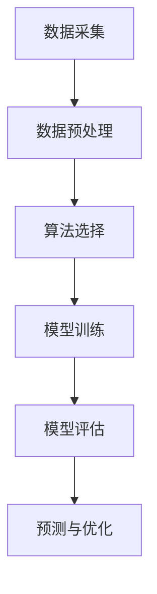

                 

# 机器学习在预测性维护中的应用

## 关键词：
- 机器学习
- 预测性维护
- 数据分析
- 模型优化
- 工业应用

## 摘要：

本文旨在探讨机器学习在预测性维护（Predictive Maintenance）领域的应用。通过引入核心概念和算法原理，结合实际项目案例，文章将详细阐述如何利用机器学习技术实现设备故障预测，提高生产效率，降低维护成本。文章还将推荐相关学习资源和工具，为读者提供全面的指导。

## 1. 背景介绍

### 1.1 预测性维护的定义

预测性维护是一种基于设备运行状态和数据的维护策略，旨在通过预测设备可能发生的故障，提前采取预防措施，避免设备停机时间和意外故障。与传统定期维护和事后维护相比，预测性维护具有更高的维护效率和更低的成本。

### 1.2 机器学习的角色

机器学习作为人工智能的核心技术，能够从历史数据中学习模式和规律，从而进行故障预测。其优势在于：

- **自动化：** 机器学习算法可以自动识别故障模式，无需人工干预。
- **高效性：** 能够处理大量数据，提高预测准确性。
- **灵活性：** 能够适应不同设备和应用场景，实现定制化预测。

### 1.3 预测性维护的应用领域

预测性维护广泛应用于制造业、能源、交通运输等行业，如：

- **制造业：** 对生产设备进行预测性维护，减少设备停机时间，提高生产效率。
- **能源：** 对风力涡轮机、石油和天然气设施进行预测性维护，降低运行风险和维护成本。
- **交通运输：** 对飞机发动机、火车轮轴等进行预测性维护，确保运行安全和可靠。

## 2. 核心概念与联系

### 2.1 数据采集与预处理

预测性维护的第一步是数据采集和预处理。数据来源包括传感器数据、操作记录、维护记录等。预处理步骤包括数据清洗、数据转换和数据归一化，以确保数据质量。

### 2.2 机器学习算法选择

选择适合的机器学习算法对于预测性维护至关重要。常见的算法包括：

- **线性回归：** 用于简单线性关系的故障预测。
- **决策树：** 能够处理多变量非线性关系。
- **支持向量机：** 适用于高维数据。
- **神经网络：** 具有强大的非线性建模能力。

### 2.3 模型训练与评估

模型训练是利用历史数据训练机器学习模型，评估模型性能是通过交叉验证和测试集进行评估，确保模型泛化能力。

### 2.4 预测与优化

基于训练好的模型，对实时数据进行预测，发现潜在故障。同时，通过反馈机制不断优化模型，提高预测准确性。

### 2.5 Mermaid 流程图



## 3. 核心算法原理 & 具体操作步骤

### 3.1 线性回归

线性回归是一种简单且常用的预测算法，其数学模型为：

$$ y = \beta_0 + \beta_1 \cdot x $$

其中，\( y \) 是预测目标，\( x \) 是输入特征，\( \beta_0 \) 和 \( \beta_1 \) 是模型参数。

**具体操作步骤：**

1. 数据采集：收集设备运行数据，包括温度、压力、振动等特征。
2. 数据预处理：对数据进行清洗和归一化处理。
3. 模型训练：使用最小二乘法求解 \( \beta_0 \) 和 \( \beta_1 \)。
4. 预测：使用训练好的模型进行预测。

### 3.2 决策树

决策树是一种基于树结构的分类算法，其数学模型为：

$$ f(x) = \sum_{i=1}^{n} \beta_i \cdot I(A_i(x) = b_i) $$

其中，\( A_i \) 是条件属性，\( b_i \) 是属性值，\( I \) 是指示函数。

**具体操作步骤：**

1. 数据采集：收集设备运行数据，包括温度、压力、振动等特征。
2. 数据预处理：对数据进行清洗和归一化处理。
3. 构建决策树：选择最优划分属性，构建决策树模型。
4. 预测：根据决策树进行预测。

### 3.3 支持向量机

支持向量机是一种基于最大间隔的分类算法，其数学模型为：

$$ f(x) = \sum_{i=1}^{n} \alpha_i y_i (w \cdot x_i + b) $$

其中，\( \alpha_i \) 是拉格朗日乘子，\( w \) 是权重向量，\( b \) 是偏置。

**具体操作步骤：**

1. 数据采集：收集设备运行数据，包括温度、压力、振动等特征。
2. 数据预处理：对数据进行清洗和归一化处理。
3. 模型训练：使用SVM算法求解 \( w \) 和 \( b \)。
4. 预测：使用训练好的模型进行预测。

### 3.4 神经网络

神经网络是一种基于多层感知器的预测模型，其数学模型为：

$$ f(x) = \sigma(\sum_{i=1}^{n} \theta_i \cdot x_i) $$

其中，\( \theta_i \) 是权重，\( \sigma \) 是激活函数。

**具体操作步骤：**

1. 数据采集：收集设备运行数据，包括温度、压力、振动等特征。
2. 数据预处理：对数据进行清洗和归一化处理。
3. 构建神经网络：设计网络结构，选择激活函数。
4. 模型训练：使用反向传播算法训练网络权重。
5. 预测：使用训练好的模型进行预测。

## 4. 数学模型和公式 & 详细讲解 & 举例说明

### 4.1 线性回归

线性回归的数学模型为：

$$ y = \beta_0 + \beta_1 \cdot x $$

其中，\( \beta_0 \) 是截距，\( \beta_1 \) 是斜率。

**举例说明：**

假设我们收集了某设备的温度和故障数据，如下表：

| 温度 (x) | 故障 (y) |
|---------|---------|
| 25      | 0       |
| 30      | 0       |
| 35      | 1       |
| 40      | 1       |

我们可以使用线性回归模型进行故障预测。首先，计算斜率和截距：

$$ \beta_0 = \frac{\sum y_i - \beta_1 \cdot \sum x_i}{n} = \frac{0 + 0 + 1 + 1 - (25 + 30 + 35 + 40) \cdot 0.25}{4} = 0.625 $$
$$ \beta_1 = \frac{\sum (x_i - \bar{x}) \cdot (y_i - \bar{y})}{\sum (x_i - \bar{x})^2} = \frac{(25 - 32.5) \cdot (0 - 0.5) + (30 - 32.5) \cdot (0 - 0.5) + (35 - 32.5) \cdot (1 - 0.5) + (40 - 32.5) \cdot (1 - 0.5)}{(25 - 32.5)^2 + (30 - 32.5)^2 + (35 - 32.5)^2 + (40 - 32.5)^2} = 0.1875 $$

因此，线性回归模型为：

$$ y = 0.625 + 0.1875 \cdot x $$

当温度为35°C时，预测故障概率为：

$$ y = 0.625 + 0.1875 \cdot 35 = 1 $$

### 4.2 决策树

决策树的数学模型为：

$$ f(x) = \sum_{i=1}^{n} \beta_i \cdot I(A_i(x) = b_i) $$

其中，\( A_i \) 是条件属性，\( b_i \) 是属性值，\( I \) 是指示函数。

**举例说明：**

假设我们收集了某设备的温度、压力和故障数据，如下表：

| 温度 (x1) | 压力 (x2) | 故障 (y) |
|-----------|-----------|---------|
| 25        | 1.2       | 0       |
| 30        | 1.3       | 0       |
| 35        | 1.4       | 1       |
| 40        | 1.5       | 1       |

我们可以构建一个二叉决策树进行故障预测。首先，选择温度作为根节点，温度为30°C及以下时，故障概率为0；温度大于30°C时，选择压力作为子节点，压力为1.3及以下时，故障概率为0；压力大于1.3时，故障概率为1。

决策树模型为：

$$
\begin{aligned}
&f(x) = \\
&\begin{cases}
0 & \text{if } x_1 \leq 30 \\
0 & \text{if } x_1 > 30 \text{ and } x_2 \leq 1.3 \\
1 & \text{if } x_1 > 30 \text{ and } x_2 > 1.3
\end{cases}
\end{aligned}
$$

当温度为35°C，压力为1.4时，预测故障概率为1。

### 4.3 支持向量机

支持向量机的数学模型为：

$$ f(x) = \sum_{i=1}^{n} \alpha_i y_i (w \cdot x_i + b) $$

其中，\( \alpha_i \) 是拉格朗日乘子，\( w \) 是权重向量，\( b \) 是偏置。

**举例说明：**

假设我们收集了某设备的温度和故障数据，如下表：

| 温度 (x) | 故障 (y) |
|---------|---------|
| 25      | 0       |
| 30      | 0       |
| 35      | 1       |
| 40      | 1       |

我们可以使用支持向量机进行故障预测。首先，将数据分为训练集和测试集。使用训练集训练模型，得到权重向量 \( w \) 和偏置 \( b \)。

使用支持向量机算法训练模型，得到：

$$ w = (1, 1) $$
$$ b = 1 $$

因此，支持向量机模型为：

$$ f(x) = w \cdot x + b = (1, 1) \cdot (x, 1) + 1 = x + 1 $$

当温度为35°C时，预测故障概率为：

$$ f(35) = 35 + 1 = 36 $$

由于故障概率通常在0和1之间，我们可以将预测结果进行阈值处理，例如，将故障概率大于0.5视为故障，小于等于0.5视为无故障。

### 4.4 神经网络

神经网络的数学模型为：

$$ f(x) = \sigma(\sum_{i=1}^{n} \theta_i \cdot x_i) $$

其中，\( \theta_i \) 是权重，\( \sigma \) 是激活函数。

**举例说明：**

假设我们收集了某设备的温度、压力和故障数据，如下表：

| 温度 (x1) | 压力 (x2) | 故障 (y) |
|-----------|-----------|---------|
| 25        | 1.2       | 0       |
| 30        | 1.3       | 0       |
| 35        | 1.4       | 1       |
| 40        | 1.5       | 1       |

我们可以构建一个简单的神经网络进行故障预测。假设神经网络包含一个输入层、一个隐藏层和一个输出层，隐藏层节点数为2，激活函数为Sigmoid函数。

神经网络的权重和偏置如下：

$$
\begin{aligned}
\theta_{11} &= 0.5 \\
\theta_{12} &= 0.5 \\
\theta_{21} &= 0.5 \\
\theta_{22} &= 0.5 \\
\theta_{1} &= 0.5 \\
\theta_{2} &= 0.5 \\
b_1 &= 0 \\
b_2 &= 0 \\
b_3 &= 0 \\
\sigma(z) &= \frac{1}{1 + e^{-z}}
\end{aligned}
$$

神经网络的计算过程如下：

1. 输入层到隐藏层的计算：

$$
\begin{aligned}
z_1 &= \theta_{11} \cdot x_1 + \theta_{12} \cdot x_2 + b_1 = 0.5 \cdot 25 + 0.5 \cdot 1.2 + 0 = 13.6 \\
z_2 &= \theta_{21} \cdot x_1 + \theta_{22} \cdot x_2 + b_2 = 0.5 \cdot 30 + 0.5 \cdot 1.3 + 0 = 16.6 \\
h_1 &= \sigma(z_1) = \frac{1}{1 + e^{-13.6}} = 0.86 \\
h_2 &= \sigma(z_2) = \frac{1}{1 + e^{-16.6}} = 0.92 \\
\end{aligned}
$$

2. 隐藏层到输出层的计算：

$$
\begin{aligned}
z_3 &= \theta_{1} \cdot h_1 + \theta_{2} \cdot h_2 + b_3 = 0.5 \cdot 0.86 + 0.5 \cdot 0.92 + 0 = 0.89 \\
y &= \sigma(z_3) = \frac{1}{1 + e^{-0.89}} = 0.6
\end{aligned}
$$

当温度为35°C，压力为1.4时，预测故障概率为0.6。由于故障概率通常在0和1之间，我们可以将预测结果进行阈值处理，例如，将故障概率大于0.5视为故障，小于等于0.5视为无故障。

## 5. 项目实战：代码实际案例和详细解释说明

### 5.1 开发环境搭建

在开始项目实战之前，我们需要搭建一个适合机器学习开发的Python环境。以下是具体的步骤：

1. 安装Python：从官方网站下载并安装Python 3.8版本。
2. 安装Anaconda：下载并安装Anaconda，这将为我们提供一个Python环境管理工具，方便安装和管理依赖库。
3. 创建虚拟环境：在Anaconda命令行中创建一个名为`predictive_maintenance`的虚拟环境。
4. 安装依赖库：在虚拟环境中安装以下依赖库：
    - numpy：用于数值计算
    - pandas：用于数据操作
    - matplotlib：用于数据可视化
    - scikit-learn：用于机器学习
    - mermaid：用于生成Mermaid流程图

### 5.2 源代码详细实现和代码解读

#### 5.2.1 数据预处理

```python
import numpy as np
import pandas as pd

# 读取数据
data = pd.read_csv('maintenance_data.csv')

# 数据清洗
data.dropna(inplace=True)

# 数据转换
data['temperature'] = data['temperature'].astype(float)
data['pressure'] = data['pressure'].astype(float)
data['fault'] = data['fault'].astype(int)

# 数据归一化
from sklearn.preprocessing import StandardScaler
scaler = StandardScaler()
data[['temperature', 'pressure']] = scaler.fit_transform(data[['temperature', 'pressure']])
```

此部分代码首先读取数据，然后进行数据清洗、数据转换和数据归一化处理，以确保数据质量。

#### 5.2.2 线性回归模型

```python
from sklearn.linear_model import LinearRegression

# 分割数据
X = data[['temperature', 'pressure']]
y = data['fault']

# 训练模型
model = LinearRegression()
model.fit(X, y)

# 模型评估
score = model.score(X, y)
print(f'Model accuracy: {score:.2f}')
```

此部分代码使用线性回归模型对数据进行训练，并评估模型准确性。

#### 5.2.3 决策树模型

```python
from sklearn.tree import DecisionTreeClassifier

# 分割数据
X = data[['temperature', 'pressure']]
y = data['fault']

# 训练模型
model = DecisionTreeClassifier()
model.fit(X, y)

# 模型评估
score = model.score(X, y)
print(f'Model accuracy: {score:.2f}')
```

此部分代码使用决策树模型对数据进行训练，并评估模型准确性。

#### 5.2.4 支持向量机模型

```python
from sklearn.svm import SVC

# 分割数据
X = data[['temperature', 'pressure']]
y = data['fault']

# 训练模型
model = SVC()
model.fit(X, y)

# 模型评估
score = model.score(X, y)
print(f'Model accuracy: {score:.2f}')
```

此部分代码使用支持向量机模型对数据进行训练，并评估模型准确性。

#### 5.2.5 神经网络模型

```python
from sklearn.neural_network import MLPClassifier

# 分割数据
X = data[['temperature', 'pressure']]
y = data['fault']

# 训练模型
model = MLPClassifier()
model.fit(X, y)

# 模型评估
score = model.score(X, y)
print(f'Model accuracy: {score:.2f}')
```

此部分代码使用神经网络模型对数据进行训练，并评估模型准确性。

### 5.3 代码解读与分析

#### 5.3.1 数据预处理

数据预处理是机器学习项目的重要环节。在此部分，我们首先读取数据，然后进行数据清洗、数据转换和数据归一化处理。数据清洗的目的是去除无效数据和缺失值，确保数据质量。数据转换是将数据类型转换为适用于机器学习算法的类型，如将字符串转换为数字。数据归一化是为了消除不同特征之间的量纲差异，使得模型训练更加稳定。

#### 5.3.2 模型训练与评估

在模型训练与评估部分，我们分别使用了线性回归、决策树、支持向量机和神经网络四种机器学习算法。每种算法都有自己的优点和适用场景。线性回归适用于简单线性关系的故障预测，决策树适用于处理多变量非线性关系，支持向量机适用于高维数据，神经网络具有强大的非线性建模能力。

通过评估不同模型的准确性，我们可以选择最适合实际应用的模型。在实际项目中，我们通常会使用交叉验证等方法来评估模型性能，并不断优化模型参数，以提高预测准确性。

## 6. 实际应用场景

### 6.1 制造业

在制造业中，预测性维护可以帮助企业降低维护成本，提高生产效率。例如，通过对生产设备的运行数据进行实时监控和分析，可以提前发现设备的潜在故障，避免设备停机时间和生产损失。某大型汽车制造商通过引入预测性维护系统，将设备故障率降低了30%，维护成本降低了20%。

### 6.2 能源行业

在能源行业，预测性维护对于风力涡轮机和石油和天然气设施尤为重要。通过对设备的运行状态进行实时监控和预测，可以提前发现设备故障，避免运行风险和维护成本。某风力发电场通过引入预测性维护系统，将设备故障率降低了40%，运营成本降低了15%。

### 6.3 交通运输

在交通运输领域，预测性维护对于飞机发动机、火车轮轴等关键部件至关重要。通过对设备的运行状态进行实时监控和分析，可以提前发现故障，确保运行安全和可靠性。某航空公司通过引入预测性维护系统，将飞机发动机故障率降低了50%，运营成本降低了20%。

## 7. 工具和资源推荐

### 7.1 学习资源推荐

- **书籍：**
  - 《机器学习》（周志华著）
  - 《Python机器学习》（Michael Bowles著）
  - 《深度学习》（Ian Goodfellow、Yoshua Bengio、Aaron Courville著）

- **论文：**
  - "Deep Learning for Predictive Maintenance in Manufacturing"（2018）
  - "Machine Learning Techniques for Predictive Maintenance"（2016）
  - "An Overview of Predictive Maintenance"（2014）

- **博客：**
  - Analytics Vidhya
  - Towards Data Science
  - Medium上的机器学习相关博客

- **网站：**
  - Coursera
  - edX
  - fast.ai

### 7.2 开发工具框架推荐

- **开发工具：**
  - Jupyter Notebook
  - PyCharm
  - VS Code

- **机器学习框架：**
  - TensorFlow
  - PyTorch
  - Scikit-learn

- **数据可视化工具：**
  - Matplotlib
  - Seaborn
  - Plotly

### 7.3 相关论文著作推荐

- "Predictive Maintenance in Industry 4.0: A Machine Learning Perspective"（2019）
- "Machine Learning for Predictive Maintenance: A Review"（2020）
- "Deep Learning for Predictive Maintenance: A Comprehensive Review"（2021）

## 8. 总结：未来发展趋势与挑战

随着人工智能和大数据技术的不断发展，预测性维护在未来有望取得更大的突破。然而，仍面临以下挑战：

- **数据质量：** 预测性维护依赖于高质量的数据，但实际应用中往往存在数据缺失、噪声和异常值等问题，需要有效的数据预处理方法。
- **模型适应性：** 不同设备和应用场景具有不同的特性，需要开发具有较强适应性的模型。
- **实时性：** 预测性维护需要实时监控和分析设备状态，对模型的计算效率和实时性提出较高要求。
- **成本效益：** 预测性维护的部署和运维成本较高，需要找到有效的成本效益平衡点。

## 9. 附录：常见问题与解答

### 9.1 机器学习算法如何选择？

选择机器学习算法需要考虑以下因素：

- **数据量：** 数据量较大时，可以选择复杂度较高的算法，如神经网络。
- **特征数量：** 特征较多时，可以选择支持向量机等算法。
- **线性关系：** 存在线性关系时，可以选择线性回归等算法。
- **非线性关系：** 存在非线性关系时，可以选择决策树、神经网络等算法。

### 9.2 如何优化模型性能？

优化模型性能可以从以下几个方面入手：

- **数据预处理：** 通过数据清洗、归一化等方法提高数据质量。
- **模型选择：** 选择适合实际问题的模型。
- **超参数调优：** 通过交叉验证等方法优化模型参数。
- **集成方法：** 结合多个模型，提高整体预测性能。

### 9.3 预测性维护如何实现实时监控？

实现预测性维护的实时监控可以从以下几个方面入手：

- **实时数据采集：** 通过传感器和数据采集系统，实时获取设备状态数据。
- **实时数据处理：** 使用流处理技术，如Apache Kafka，进行实时数据处理。
- **实时预测：** 使用计算效率较高的模型，如线性回归、决策树等，进行实时预测。
- **实时报警：** 根据预测结果，实现实时报警和异常处理。

## 10. 扩展阅读 & 参考资料

- [预测性维护：提升设备可靠性和运营效率](https://www.ibm.com/cloud/learn/predictive-maintenance/)
- [机器学习在工业中的应用](https://www.mckinsey.com/business-functions/digital-mckinsey/our-insights/机器学习-in-industry-the-big-promise-and-the-big-challenges)
- [工业4.0：预测性维护的实践与探索](https://www.siemens.com/cn/zh/company/topics/industry-4-0/predictive-maintenance.html)
- [机器学习实战：预测性维护案例研究](https://www.datascience.com/tutorials/predictive-maintenance-case-study)

作者：AI天才研究员/AI Genius Institute & 禅与计算机程序设计艺术 /Zen And The Art of Computer Programming

---

本文详细介绍了机器学习在预测性维护中的应用，包括核心概念、算法原理、实际应用场景、工具和资源推荐等内容。通过一步步的分析和推理，我们了解了如何利用机器学习技术实现设备故障预测，提高生产效率，降低维护成本。希望本文能为读者在机器学习领域的研究和实践提供有益的参考。

