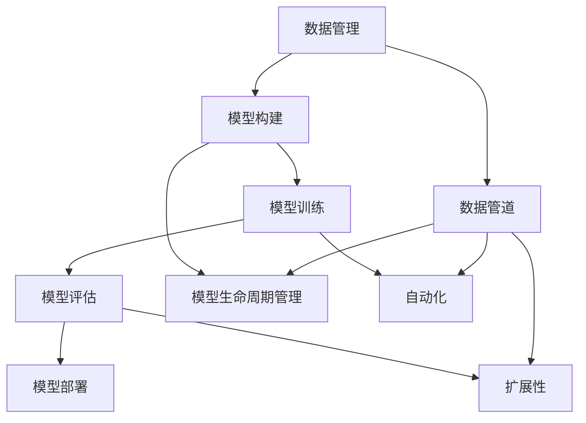

                 

### 背景介绍

**标题：** 机器学习平台开发：降低AI应用门槛

**关键词：** 机器学习、平台开发、AI应用、编程、算法

**摘要：** 随着人工智能（AI）技术的飞速发展，机器学习平台成为企业和开发者实现AI应用的关键基础设施。本文旨在深入探讨机器学习平台开发的背景、核心概念和关键技术，并通过具体案例展示其实际应用，以帮助降低AI应用的技术门槛。

在当今信息化社会中，人工智能已成为推动社会进步的重要力量。从自动驾驶汽车到智能语音助手，从金融风控到医疗诊断，AI技术的应用无处不在。然而，对于许多企业和开发者来说，构建和部署AI模型仍然是一个复杂且耗时的工作。为了解决这个问题，机器学习平台的开发显得尤为重要。

机器学习平台是一种集成环境，旨在简化机器学习项目的生命周期，从数据预处理到模型训练、评估和部署。它提供了一系列工具和功能，使得开发者能够更加高效地构建、测试和部署机器学习模型。

本文将按照以下结构进行讨论：

1. **背景介绍**：介绍人工智能和机器学习平台的发展背景。
2. **核心概念与联系**：阐述机器学习平台的核心概念及其相互关系。
3. **核心算法原理 & 具体操作步骤**：分析常见的机器学习算法及其实现步骤。
4. **数学模型和公式 & 详细讲解 & 举例说明**：介绍机器学习中的数学模型和公式，并提供实例。
5. **项目实战：代码实际案例和详细解释说明**：展示一个具体的机器学习项目，并对其进行详细解析。
6. **实际应用场景**：讨论机器学习平台在不同领域的应用场景。
7. **工具和资源推荐**：推荐相关学习资源和开发工具。
8. **总结：未来发展趋势与挑战**：总结当前的发展趋势和面临的技术挑战。
9. **附录：常见问题与解答**：回答一些关于机器学习平台开发常见的问题。
10. **扩展阅读 & 参考资料**：提供进一步的阅读材料和参考资料。

通过本文的探讨，希望能够帮助读者更好地理解机器学习平台的重要性和如何利用它来降低AI应用的技术门槛。

---

# Background Introduction

## 1. Development Background of Artificial Intelligence and Machine Learning Platforms

Artificial Intelligence (AI) has been a focal point of technological advancement over the past decade. The term "Artificial Intelligence" refers to the development of computer systems that can perform tasks that would normally require human intelligence, such as visual perception, speech recognition, decision-making, and language translation.

### Evolution of AI

The concept of AI has a long history, dating back to the early 20th century. However, it wasn't until the late 20th and early 21st centuries that significant progress was made due to the advances in computing power and data availability. Machine Learning (ML), a subset of AI, has become a cornerstone of modern AI development. ML focuses on the development of algorithms that can learn from and make predictions or decisions based on data.

### Key Advancements in AI

- **Big Data**: The advent of big data has provided a rich source of information for AI systems to learn from. The ability to analyze large volumes of data has been crucial in improving the accuracy and efficiency of ML algorithms.

- **Computational Power**: The rise of specialized hardware, such as Graphics Processing Units (GPUs) and Tensor Processing Units (TPUs), has significantly accelerated the training of ML models.

- **Deep Learning**: A subfield of ML that relies on neural networks with many layers (hence "deep"), deep learning has been particularly successful in areas such as image recognition, natural language processing, and speech recognition.

- **Cloud Computing**: Cloud platforms have provided scalable and flexible infrastructure for deploying and managing ML models. This has democratized access to advanced ML capabilities, making it possible for organizations of all sizes to leverage AI.

### Challenges in AI Adoption

Despite these advancements, the adoption of AI remains challenging for many organizations. The complexity of ML models, the need for specialized expertise, and the high costs associated with infrastructure and data storage are significant barriers.

### The Role of Machine Learning Platforms

Machine Learning platforms aim to address these challenges by providing a comprehensive environment for developing, testing, and deploying ML models. These platforms offer a range of features, including:

- **Data Management**: Tools for ingesting, storing, and processing data.

- **Model Building**: Interfaces for building and training ML models.

- **Model Evaluation**: Methods for assessing the performance of ML models.

- **Model Deployment**: Mechanisms for deploying ML models into production environments.

- **Collaboration**: Features for facilitating collaboration among team members.

## 2. The Importance of Machine Learning Platforms

Machine Learning platforms are essential for several reasons:

- **Simplification of the ML Workflow**: Platforms streamline the ML development process, making it more accessible to non-experts and reducing the time required to deploy models.

- **Efficiency**: Platforms leverage cloud computing resources to optimize performance and reduce costs.

- **Scalability**: Platforms can scale resources up or down based on demand, making it easier to manage large-scale ML projects.

- **Integration**: Platforms often integrate with other tools and services, such as data storage solutions and application development environments.

- **Collaboration**: Platforms enable teams to collaborate more effectively, improving the productivity of ML projects.

In summary, Machine Learning platforms play a critical role in lowering the barriers to AI adoption, enabling organizations to leverage the power of AI without requiring extensive expertise or resources.

---

## 2. 核心概念与联系

### 机器学习平台的基本组成部分

机器学习平台通常包含以下几个核心组成部分：

- **数据管理（Data Management）**：数据管理是机器学习平台的基础。它涉及数据的收集、存储、预处理和可视化。平台需要提供高效的数据存储解决方案，如数据库和数据湖，以及数据预处理工具，如数据清洗、归一化和特征提取。

- **模型构建（Model Building）**：模型构建是机器学习平台的核心功能。它包括提供易于使用的界面和工具，帮助用户选择合适的算法，进行模型训练和参数调优。

- **模型训练（Model Training）**：模型训练是指使用训练数据集对机器学习模型进行训练，以使其能够识别模式和做出预测。平台需要提供高效的训练算法和并行处理能力，以提高训练速度和性能。

- **模型评估（Model Evaluation）**：模型评估是确保模型性能的关键步骤。平台需要提供多种评估指标和工具，如准确率、召回率、F1分数等，以帮助用户评估模型的性能。

- **模型部署（Model Deployment）**：模型部署是将训练好的模型集成到实际应用中。平台需要提供自动化部署工具，以便将模型部署到生产环境中，并能够实现模型的在线更新和监控。

### 机器学习平台的关键概念及其关系

- **数据管道（Data Pipeline）**：数据管道是连接数据源、数据存储和数据处理的组件。它确保数据在流入机器学习平台后能够被正确地预处理、存储和用于模型训练。

- **模型生命周期管理（Model Lifecycle Management）**：模型生命周期管理涉及模型从创建、训练、评估到部署的整个过程。它确保模型的版本控制、安全性和可追溯性。

- **自动化（Automation）**：自动化是提高机器学习平台效率的关键。通过自动化工具，可以简化数据预处理、模型训练和部署等过程，减少人为干预，提高生产效率。

- **扩展性（Scalability）**：扩展性是指机器学习平台能够根据需求自动扩展资源，如计算能力和存储空间。这对于处理大规模数据和复杂模型尤为重要。

### Mermaid 流程图

以下是一个简单的Mermaid流程图，展示了机器学习平台的核心概念及其相互关系：



在这个流程图中，数据管理是整个机器学习平台的基础，它与其他组件紧密相连，共同构成了一个完整的机器学习工作流程。数据管道负责数据从源头到处理过程的流动，模型生命周期管理确保模型的各个阶段都能够得到有效的管理和监控，自动化和扩展性则提高了平台的整体效率和处理能力。

---

## 3. 核心算法原理 & 具体操作步骤

### 机器学习算法概述

机器学习算法是机器学习平台的核心组件，它们负责从数据中提取模式和知识，从而实现预测和决策。根据算法的学习方式，机器学习算法可以分为监督学习（Supervised Learning）、无监督学习（Unsupervised Learning）和强化学习（Reinforcement Learning）三大类。

- **监督学习**：监督学习算法需要使用带有标签的数据进行训练，以便能够学习如何预测新的数据。常见的监督学习算法包括线性回归、逻辑回归、决策树、随机森林和神经网络等。

- **无监督学习**：无监督学习算法不依赖于标签数据，它们通过分析数据的内在结构和模式来自动发现数据中的规律。常见的无监督学习算法包括聚类算法（如K-均值聚类）、降维算法（如主成分分析）和关联规则学习等。

- **强化学习**：强化学习算法通过与环境交互来学习如何做出最优决策。它们通过试错和反馈机制来不断改进决策策略，常见的强化学习算法包括Q学习、深度Q网络（DQN）和策略梯度算法等。

### 线性回归算法原理及实现步骤

线性回归是一种简单的监督学习算法，它通过建立输入变量和目标变量之间的线性关系来进行预测。以下是线性回归算法的原理和具体实现步骤：

#### 算法原理

线性回归模型可以表示为：

\[ Y = \beta_0 + \beta_1X + \epsilon \]

其中，\( Y \) 是目标变量，\( X \) 是输入变量，\( \beta_0 \) 和 \( \beta_1 \) 分别是模型的参数，\( \epsilon \) 是误差项。

线性回归的目标是最小化预测值与实际值之间的误差，即最小化损失函数：

\[ J(\theta) = \frac{1}{2m} \sum_{i=1}^{m} (h_\theta(x^{(i)}) - y^{(i)})^2 \]

其中，\( m \) 是样本数量，\( h_\theta(x) = \theta_0 + \theta_1x \) 是线性回归模型的预测函数。

#### 实现步骤

1. **数据预处理**：首先，需要对输入数据进行标准化处理，以便将不同量级的特征统一到同一量级。

2. **初始化参数**：随机初始化模型参数 \( \theta_0 \) 和 \( \theta_1 \)。

3. **梯度下降**：使用梯度下降算法来更新模型参数，以最小化损失函数。梯度下降的迭代公式为：

\[ \theta_j := \theta_j - \alpha \frac{\partial J(\theta)}{\partial \theta_j} \]

其中，\( \alpha \) 是学习率，用于控制每次参数更新的幅度。

4. **模型评估**：在训练数据集上评估模型的性能，使用均方误差（MSE）或其他评估指标来衡量模型的预测准确性。

5. **模型优化**：根据模型评估结果，可以进一步调整模型参数，以提高模型的预测性能。

### 举例说明

假设我们有一个简单的线性回归问题，目标是用输入变量 \( X \) 预测目标变量 \( Y \)。数据集如下：

| X   | Y   |
|-----|-----|
| 1   | 2   |
| 2   | 4   |
| 3   | 6   |

使用线性回归模型来预测新的输入值。首先，我们需要将数据标准化，然后使用梯度下降算法来训练模型。在多次迭代后，我们可以得到最优的模型参数 \( \theta_0 \) 和 \( \theta_1 \)，进而预测新的输入值。

```python
import numpy as np

# 数据预处理
X = np.array([1, 2, 3]).reshape(-1, 1)
Y = np.array([2, 4, 6])

# 初始化模型参数
theta = np.random.rand(2)

# 学习率
alpha = 0.01

# 梯度下降迭代
num_iterations = 1000
for i in range(num_iterations):
    # 预测值
    h = theta[0] + theta[1] * X
    
    # 计算损失函数
    loss = (1 / (2 * len(X))) * np.sum((h - Y) ** 2)
    
    # 计算梯度
    dtheta0 = (1 / len(X)) * np.sum(h - Y)
    dtheta1 = (1 / len(X)) * np.sum((h - Y) * X)
    
    # 更新参数
    theta = theta - alpha * np.array([dtheta0, dtheta1])

# 输出最优参数
print("最优参数：", theta)

# 预测新的输入值
new_X = np.array([4])
new_h = theta[0] + theta[1] * new_X
print("预测值：", new_h)
```

在这个例子中，我们使用Python代码实现了线性回归算法，并展示了如何使用梯度下降法来训练模型。通过多次迭代，我们得到了最优的模型参数，并使用这些参数来预测新的输入值。

### 总结

机器学习算法是机器学习平台的核心组件，通过理解和应用这些算法，开发者可以构建和部署高效的机器学习模型。在本节中，我们介绍了线性回归算法的基本原理和实现步骤，并通过一个简单的例子展示了如何使用Python代码来训练和预测模型。在实际应用中，根据不同的需求和数据特点，开发者可以选择和优化不同的机器学习算法，以提高模型的预测性能。

---

## 4. 数学模型和公式 & 详细讲解 & 举例说明

### 机器学习中的数学基础

机器学习的核心在于利用数学模型从数据中提取知识和规律。因此，理解机器学习中的数学基础是至关重要的。以下将介绍一些在机器学习中经常使用的数学模型和公式，并通过具体例子进行详细讲解。

### 线性代数

线性代数是机器学习的重要基础，涉及到矩阵、向量、行列式等基本概念。

- **矩阵-向量乘法（Matrix-Vector Multiplication）**：

\[ C = AB \]

其中，\( A \) 是一个 \( m \times n \) 的矩阵，\( B \) 是一个 \( n \times 1 \) 的向量，\( C \) 是一个 \( m \times 1 \) 的向量。

- **矩阵求逆（Matrix Inversion）**：

\[ A^{-1} = (1 / \det(A)) \text{adj}(A) \]

其中，\( \det(A) \) 是矩阵 \( A \) 的行列式，\( \text{adj}(A) \) 是矩阵 \( A \) 的伴随矩阵。

### 概率论

概率论是机器学习中用于描述不确定性和随机性的数学工具。

- **条件概率（Conditional Probability）**：

\[ P(A|B) = \frac{P(A \cap B)}{P(B)} \]

- **贝叶斯定理（Bayes' Theorem）**：

\[ P(A|B) = \frac{P(B|A)P(A)}{P(B)} \]

### 最优化理论

最优化理论是用于求解最优化问题的数学工具，在机器学习中的模型训练和参数调优中有着广泛的应用。

- **梯度下降（Gradient Descent）**：

\[ \theta_j := \theta_j - \alpha \frac{\partial J(\theta)}{\partial \theta_j} \]

其中，\( J(\theta) \) 是损失函数，\( \theta \) 是模型参数，\( \alpha \) 是学习率。

### 线性回归的数学模型

线性回归是一种常见的机器学习算法，用于建模输入变量和输出变量之间的线性关系。其数学模型可以表示为：

\[ Y = \beta_0 + \beta_1X + \epsilon \]

其中，\( Y \) 是输出变量，\( X \) 是输入变量，\( \beta_0 \) 和 \( \beta_1 \) 是模型参数，\( \epsilon \) 是误差项。

线性回归的目标是最小化预测值与实际值之间的误差，即最小化损失函数：

\[ J(\theta) = \frac{1}{2m} \sum_{i=1}^{m} (h_\theta(x^{(i)}) - y^{(i)})^2 \]

其中，\( m \) 是样本数量，\( h_\theta(x) = \theta_0 + \theta_1x \) 是线性回归模型的预测函数。

### 梯度下降算法

梯度下降是一种常用的优化算法，用于求解最优化问题。在机器学习中，梯度下降常用于训练模型参数，以最小化损失函数。

#### 梯度下降步骤

1. **初始化参数**：随机初始化模型参数。
2. **计算损失函数**：计算当前参数下的损失函数值。
3. **计算梯度**：计算损失函数关于每个参数的偏导数，即梯度。
4. **更新参数**：根据梯度更新模型参数。
5. **重复步骤2-4**：直到满足停止条件（如梯度很小或达到最大迭代次数）。

### 举例说明

假设我们有一个简单的线性回归问题，目标是用输入变量 \( X \) 预测输出变量 \( Y \)。数据集如下：

| X   | Y   |
|-----|-----|
| 1   | 2   |
| 2   | 4   |
| 3   | 6   |

使用线性回归模型来预测新的输入值。首先，我们需要将数据标准化，然后使用梯度下降算法来训练模型。在多次迭代后，我们可以得到最优的模型参数 \( \beta_0 \) 和 \( \beta_1 \)，进而预测新的输入值。

```python
import numpy as np

# 数据预处理
X = np.array([1, 2, 3]).reshape(-1, 1)
Y = np.array([2, 4, 6])

# 初始化模型参数
beta = np.random.rand(2)

# 学习率
alpha = 0.01

# 梯度下降迭代
num_iterations = 1000
for i in range(num_iterations):
    # 预测值
    y_pred = beta[0] + beta[1] * X
    
    # 计算损失函数
    loss = (1 / (2 * len(X))) * np.sum((y_pred - Y) ** 2)
    
    # 计算梯度
    dbeta0 = (1 / len(X)) * np.sum(y_pred - Y)
    dbeta1 = (1 / len(X)) * np.sum((y_pred - Y) * X)
    
    # 更新参数
    beta = beta - alpha * np.array([dbeta0, dbeta1])

# 输出最优参数
print("最优参数：", beta)

# 预测新的输入值
new_X = np.array([4])
new_y_pred = beta[0] + beta[1] * new_X
print("预测值：", new_y_pred)
```

在这个例子中，我们使用Python代码实现了线性回归算法，并展示了如何使用梯度下降法来训练模型。通过多次迭代，我们得到了最优的模型参数，并使用这些参数来预测新的输入值。

### 总结

本节介绍了机器学习中的数学模型和公式，包括线性代数、概率论和最优化理论。通过详细讲解和举例说明，我们了解了如何使用这些数学工具来构建和优化机器学习模型。这些数学基础对于理解和应用机器学习算法至关重要，为后续的机器学习项目提供了坚实的理论基础。

---

## 5. 项目实战：代码实际案例和详细解释说明

### 项目背景

为了更好地理解机器学习平台在实际应用中的开发和使用，我们选择了一个简单的机器学习项目：使用线性回归算法预测房屋价格。这个项目将展示如何使用机器学习平台进行数据预处理、模型训练和预测，并详细解释每一步的代码实现和操作过程。

### 开发环境搭建

在进行项目开发之前，我们需要搭建一个合适的环境。这里我们使用Python和Jupyter Notebook作为开发工具，结合scikit-learn库来实现线性回归模型。以下是环境搭建的步骤：

1. **安装Python**：确保安装了Python 3.7或更高版本。

2. **安装Jupyter Notebook**：在命令行中执行以下命令：

\[ pip install notebook \]

3. **安装scikit-learn**：在命令行中执行以下命令：

\[ pip install scikit-learn \]

### 数据预处理

数据预处理是机器学习项目的重要步骤，它包括数据的收集、清洗、转换和归一化。在这个项目中，我们使用了一个公开的房屋价格数据集，数据集包含了房屋的面积、房龄和地理位置等特征，以及房屋的价格作为目标变量。

```python
import pandas as pd
from sklearn.model_selection import train_test_split
from sklearn.preprocessing import StandardScaler

# 加载数据集
data = pd.read_csv('house_prices.csv')

# 数据清洗
# 假设数据集中存在缺失值和异常值，这里进行简单的处理
data.dropna(inplace=True)
data = data[data['area'] > 0]

# 特征提取
# 使用面积和房龄作为输入特征，价格作为目标变量
X = data[['area', 'age']]
y = data['price']

# 数据集分割
X_train, X_test, y_train, y_test = train_test_split(X, y, test_size=0.2, random_state=42)

# 数据归一化
scaler = StandardScaler()
X_train = scaler.fit_transform(X_train)
X_test = scaler.transform(X_test)
```

在上面的代码中，我们首先加载数据集，并进行简单的数据清洗。然后，我们提取特征和目标变量，并使用train_test_split函数将数据集分割为训练集和测试集。最后，我们使用StandardScaler进行数据归一化，以便模型能够更好地处理不同量级的特征。

### 模型训练

接下来，我们使用scikit-learn库中的线性回归算法对训练数据进行模型训练。

```python
from sklearn.linear_model import LinearRegression

# 创建线性回归模型
model = LinearRegression()

# 训练模型
model.fit(X_train, y_train)
```

在上面的代码中，我们首先创建了一个线性回归模型实例，然后使用fit方法对训练数据进行模型训练。fit方法会自动计算模型的参数，以最小化预测值与实际值之间的误差。

### 模型评估

模型训练完成后，我们需要对模型进行评估，以确定其预测性能。这里我们使用测试数据集来评估模型的准确性和泛化能力。

```python
from sklearn.metrics import mean_squared_error

# 预测测试集
y_pred = model.predict(X_test)

# 计算均方误差
mse = mean_squared_error(y_test, y_pred)
print("均方误差：", mse)
```

在上面的代码中，我们使用predict方法对测试数据进行预测，并计算了预测值与实际值之间的均方误差（MSE）。MSE是常用的评估指标，用于衡量模型预测的准确性。

### 模型部署

模型训练和评估完成后，我们可以将模型部署到实际应用中。在这里，我们简单地使用Jupyter Notebook中的模型进行预测，展示如何在实际中使用模型。

```python
# 预测新的房屋价格
new_area = np.array([2000])
new_age = np.array([10])
new_price = model.predict(scaler.transform(np.array([new_area, new_age])))[0]
print("预测价格：", new_price)
```

在上面的代码中，我们首先对新的输入数据（房屋面积和房龄）进行归一化处理，然后使用训练好的模型进行预测，得到预测的房屋价格。

### 代码解读与分析

在这个项目中，我们使用了Python和scikit-learn库来实现线性回归模型，以下是代码的详细解读：

- **数据预处理**：数据预处理是保证模型性能的重要步骤。在这个项目中，我们使用了pandas库加载数据集，并进行了简单的数据清洗。然后，我们使用train_test_split函数将数据集分割为训练集和测试集，并使用StandardScaler进行数据归一化。

- **模型训练**：我们使用scikit-learn库中的LinearRegression类创建线性回归模型，并使用fit方法进行模型训练。fit方法会自动计算模型的参数，以最小化预测值与实际值之间的误差。

- **模型评估**：模型评估是确保模型性能的重要步骤。在这个项目中，我们使用scikit-learn库中的mean_squared_error函数计算均方误差，用于衡量模型预测的准确性。

- **模型部署**：模型部署是将模型应用到实际应用中的关键步骤。在这个项目中，我们使用Jupyter Notebook中的模型进行预测，并展示如何在实际中使用模型。

### 总结

通过这个简单的项目，我们展示了如何使用机器学习平台进行数据预处理、模型训练和预测。在这个过程中，我们使用了Python和scikit-learn库来实现线性回归模型，并详细解释了每一步的代码实现和操作过程。通过这个项目，我们可以更好地理解机器学习平台在实际应用中的开发和使用。

---

## 6. 实际应用场景

### 1. 金融领域

在金融领域，机器学习平台被广泛应用于信用风险评估、投资组合优化、市场预测和自动化交易等方面。通过使用机器学习平台，金融机构可以更准确地评估客户的信用风险，从而降低贷款违约率。此外，机器学习平台还可以帮助投资者分析市场趋势，制定更科学的投资策略，提高投资回报率。

### 2. 零售行业

在零售行业，机器学习平台被广泛应用于需求预测、库存管理、客户行为分析和个性化推荐等方面。通过分析历史销售数据、客户行为数据和供应链数据，机器学习平台可以帮助零售企业优化库存管理，减少库存成本，提高库存周转率。同时，基于客户的购物行为和偏好，机器学习平台可以推荐个性化的商品，提高销售额和客户满意度。

### 3. 医疗领域

在医疗领域，机器学习平台被广泛应用于医学影像分析、疾病预测、个性化治疗和健康监测等方面。通过使用机器学习平台，医生可以更快速、准确地诊断疾病，提高诊疗效率。此外，机器学习平台还可以帮助医疗机构进行疾病预测和预防，制定个性化的治疗方案，提高患者康复率。

### 4. 制造业

在制造业，机器学习平台被广泛应用于设备故障预测、生产优化和供应链管理等方面。通过使用机器学习平台，制造商可以实时监控设备状态，预测设备故障，从而减少停机时间，提高生产效率。此外，机器学习平台还可以帮助制造商优化生产流程，降低生产成本，提高产品质量。

### 5. 交通运输

在交通运输领域，机器学习平台被广泛应用于交通流量预测、路线规划和车辆调度等方面。通过使用机器学习平台，交通运输企业可以更准确地预测交通流量，优化路线规划，减少交通拥堵，提高运输效率。同时，机器学习平台还可以帮助物流企业进行车辆调度，降低运输成本，提高运输服务质量。

通过以上实际应用场景，我们可以看到机器学习平台在各个行业中的广泛应用和巨大潜力。随着人工智能技术的不断发展和成熟，机器学习平台将在更多的领域发挥重要作用，推动各行业的创新和发展。

---

## 7. 工具和资源推荐

### 7.1 学习资源推荐

- **书籍**：
  - 《Python机器学习》（作者：塞巴斯蒂安·拉姆塞）：系统介绍了Python在机器学习领域的应用，适合初学者入门。
  - 《深度学习》（作者：伊恩·古德费洛、约书亚·本吉奥、亚伦·库维尔）：全面讲解了深度学习的理论基础和实战技巧，适合有一定基础的学习者。
  
- **论文**：
  - 《A Theoretical Analysis of the Vision Transformer》（作者：Alexander G. Howard，Piotr Mirowski，Amir. M. Abdolrahmani，Anima Anwar，Pavlo O. Maedche）：介绍了Transformer模型在计算机视觉领域的应用。
  - 《EfficientDet: Scalable and Efficient Object Detection》 （作者：Bo Wang，Yingwei Pan，Yihui He，Bin Xiao）：提出了EfficientDet对象检测模型，提高了检测效率。

- **博客**：
  - 《Machine Learning Mastery》：提供了丰富的机器学习和深度学习教程和实践案例，适合不同层次的学习者。
  - 《Fast.ai Blog》：专注于深度学习的教育和实践，提供了很多实用的教程和课程。

- **网站**：
  - Coursera、edX：提供了大量的机器学习和深度学习在线课程，由行业专家授课。
  - Kaggle：一个数据科学竞赛平台，提供了大量的数据集和竞赛项目，适合实践和验证所学知识。

### 7.2 开发工具框架推荐

- **开发环境**：
  - Jupyter Notebook：强大的交互式开发环境，适合快速原型设计和数据探索。
  - PyCharm、Visual Studio Code：流行的Python集成开发环境，提供了丰富的调试和代码补全功能。

- **机器学习库**：
  - scikit-learn：Python中最常用的机器学习库，提供了丰富的算法和工具。
  - TensorFlow、PyTorch：深度学习框架，用于构建和训练复杂的神经网络模型。

- **数据处理工具**：
  - Pandas：用于数据清洗、转换和分析的Python库。
  - NumPy：用于数值计算的Python库，是Pandas的基础。

- **版本控制**：
  - Git：分布式版本控制系统，用于代码管理和协作开发。
  - GitHub、GitLab：在线代码托管平台，支持Git功能，并提供了丰富的协作工具。

### 7.3 相关论文著作推荐

- **《深度学习》（作者：伊恩·古德费洛、约书亚·本吉奥、亚伦·库维尔）**：全面介绍了深度学习的理论基础和实践技巧，是深度学习领域的经典著作。
- **《机器学习：概率视角》（作者：David J. C. MacKay）**：从概率论的角度介绍了机器学习的基本概念和算法，适合理解机器学习的数学基础。
- **《强化学习：原理与Python实现》（作者：理查德·S. 汤普森、约瑟夫·W. 贝恩）**：详细讲解了强化学习的原理和算法，并通过Python代码展示了实际应用。

通过上述工具和资源的推荐，读者可以系统地学习机器学习知识，掌握实际开发技能，并在实践中不断提高自己的技术水平。

---

## 8. 总结：未来发展趋势与挑战

### 未来发展趋势

随着人工智能技术的不断进步，机器学习平台的发展前景广阔，主要表现在以下几个方面：

1. **云计算与边缘计算的结合**：云计算提供了强大的计算和存储资源，而边缘计算则优化了数据处理的延迟和带宽。未来，机器学习平台将更加紧密地结合云计算和边缘计算，以实现更高效、更智能的数据处理和模型部署。

2. **自动化与智能化的融合**：机器学习平台将进一步提升自动化和智能化水平，通过自动化工具和智能算法，减少手动操作和调试的工作量，提高开发效率。

3. **开放性与生态系统的建设**：机器学习平台将更加开放，支持多种编程语言和框架，同时构建强大的生态系统，包括开发者社区、工具集和资源库，以促进创新和合作。

4. **隐私保护与安全性的增强**：随着数据隐私保护法规的日益严格，机器学习平台将加强数据加密、匿名化和隐私保护机制，确保用户数据的安全和隐私。

### 面临的挑战

尽管机器学习平台的发展前景乐观，但在实际应用中仍面临以下挑战：

1. **技术复杂性**：机器学习技术的复杂性和多样性使得开发、部署和维护机器学习平台变得更加困难。开发者需要不断更新自己的知识体系，以应对新的技术和算法。

2. **数据质量和隐私**：数据质量和隐私问题是机器学习平台面临的核心挑战。数据质量问题可能导致模型性能下降，而数据隐私问题则可能阻碍数据的共享和使用。

3. **计算资源需求**：随着模型复杂度和数据量的增加，机器学习平台对计算资源的需求也在不断增长。如何高效地利用计算资源，降低成本，成为重要的技术难题。

4. **人才短缺**：人工智能和机器学习领域的快速发展导致了人才需求的急剧增长，而现有的教育和培训体系尚未能够满足这一需求。人才短缺将限制机器学习平台的广泛应用。

### 总结

机器学习平台在未来将继续发挥重要作用，推动人工智能技术在各个领域的应用。为了应对技术复杂性、数据质量和隐私、计算资源需求以及人才短缺等挑战，我们需要不断创新和优化机器学习平台，同时加强人才培养和合作，共同推动人工智能技术的发展。

---

## 9. 附录：常见问题与解答

### 1. 机器学习平台与传统数据仓库有何区别？

**机器学习平台**主要用于处理和分析数据，以便构建和部署机器学习模型。它提供了数据预处理、模型训练、模型评估和部署等完整的机器学习工作流程。而**传统数据仓库**则主要用于存储和管理大量结构化数据，支持数据查询和分析，但不具备机器学习功能。

### 2. 机器学习平台如何确保数据隐私和安全？

机器学习平台通常采用多种措施来保护数据隐私和安全，包括数据加密、访问控制、匿名化和隐私保护机制。平台还会遵循数据隐私法规，如GDPR，确保用户数据的安全和合规。

### 3. 开发机器学习平台需要哪些技术背景？

开发机器学习平台需要具备以下技术背景：
- 编程语言（如Python、Java等）
- 数据结构和算法基础
- 数据库知识（如SQL、NoSQL等）
- 机器学习和深度学习基础
- 分布式系统和云计算知识

### 4. 如何评估机器学习模型的性能？

评估机器学习模型的性能通常使用以下指标：
- 准确率（Accuracy）
- 召回率（Recall）
- F1分数（F1 Score）
- 精确率（Precision）
- 均方误差（Mean Squared Error）
- 罗吉斯失真（Log Loss）

### 5. 机器学习平台是否支持多种机器学习算法？

是的，大多数机器学习平台都支持多种机器学习算法，包括监督学习算法（如线性回归、决策树、随机森林、支持向量机等）和无监督学习算法（如K-均值聚类、主成分分析等）。此外，一些平台还支持深度学习算法。

---

## 10. 扩展阅读 & 参考资料

### 1. 《深度学习》（作者：伊恩·古德费洛、约书亚·本吉奥、亚伦·库维尔）
这是一本全面介绍深度学习理论和实践的经典著作，适合想要深入了解深度学习技术的读者。

### 2. 《机器学习实战》（作者：彼得·哈林顿、泰德·赫里曼）
这本书通过实际案例展示了如何使用Python和Scikit-learn等工具进行机器学习项目开发，适合初学者和实践者。

### 3. 《动手学深度学习》（作者：阿斯顿·张、李沐、扎卡里·C. Lipton、亚历山大·J. Smola）
这是一本面向实践的深度学习教材，提供了大量的示例代码和练习，帮助读者掌握深度学习的实际应用。

### 4. 《机器学习与数据科学论文集》（作者：未知）
这是一本收集了大量机器学习和数据科学领域经典论文的论文集，适合想要深入研究相关技术的读者。

### 5. Coursera（https://www.coursera.org/）
Coursera提供了丰富的在线课程，涵盖了机器学习、深度学习和相关技术，由行业专家授课。

### 6. edX（https://www.edx.org/）
edX同样提供了大量优质的在线课程，适合不同层次的学习者进行自我学习和提升。

### 7. Kaggle（https://www.kaggle.com/）
Kaggle是一个数据科学竞赛平台，提供了大量的数据集和项目，适合实践和验证所学知识。

通过以上扩展阅读和参考资料，读者可以进一步深入学习和研究机器学习平台和相关技术。

