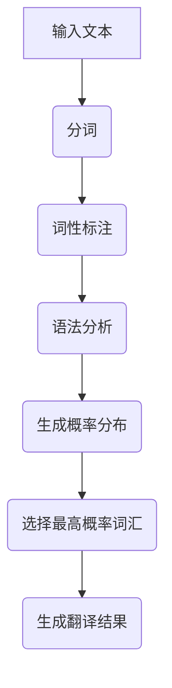
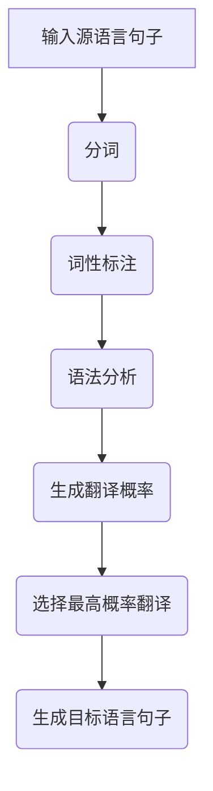
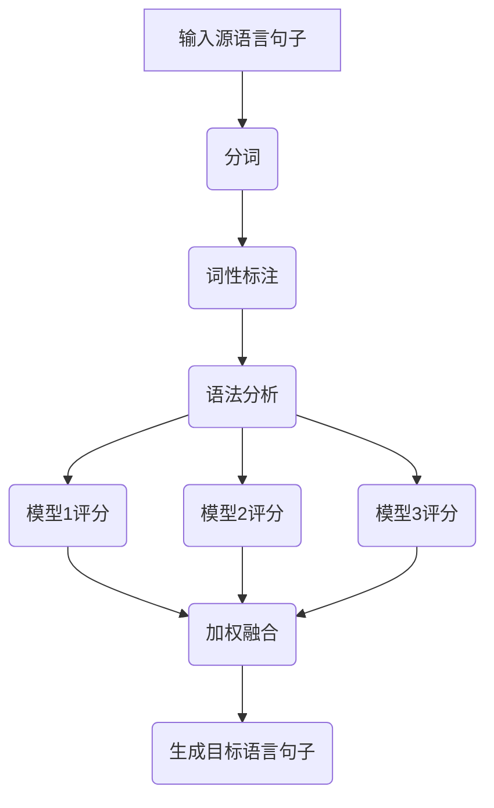

                 

# 机器翻译在国际业务流程中的应用

## 摘要

本文将探讨机器翻译在国际业务流程中的应用，详细分析机器翻译的核心概念、算法原理、数学模型、实际应用场景以及相关的开发工具和资源。通过本文的阅读，读者将了解如何利用机器翻译技术提升国际业务流程的效率，减少成本，并应对未来可能出现的技术挑战。

## 1. 背景介绍

随着全球化的不断深入，企业之间的跨国业务合作日益增多，英语作为一种国际通用语言，成为了商务沟通的桥梁。然而，并非所有企业都具备英语交流的能力，这就导致了跨语言沟通的障碍。为了解决这一问题，机器翻译技术应运而生。

机器翻译是指通过计算机程序将一种自然语言自动翻译成另一种自然语言的过程。近年来，随着深度学习技术的发展，机器翻译的准确性和效率得到了极大的提升。例如，Google翻译、百度翻译等在线翻译工具已经广泛应用于人们的日常生活和工作中。

在国际业务流程中，机器翻译技术具有以下重要作用：

1. **提升沟通效率**：通过机器翻译，企业可以迅速理解来自不同国家的合作伙伴的意图，提高沟通效率。
2. **降低成本**：传统的人工翻译成本高昂，而机器翻译可以显著降低翻译费用，为企业节约成本。
3. **打破语言障碍**：机器翻译技术使得跨语言沟通变得更加容易，有助于企业拓展国际市场。

本文将首先介绍机器翻译的核心概念，然后深入探讨其算法原理、数学模型和实际应用场景，最后推荐相关的开发工具和资源。

## 2. 核心概念与联系

### 2.1. 语言模型

语言模型是机器翻译的基础，它通过学习大量文本数据，预测下一个单词或词组。语言模型的目的是让计算机理解自然语言的统计规律，从而生成流畅、自然的翻译结果。

#### 语言模型的核心概念

- **词汇表**：语言模型包含大量的词汇，每个词汇对应一个唯一的标识符。
- **概率分布**：语言模型通过统计词汇在文本中的出现频率，为每个词汇生成一个概率分布。
- **语法规则**：语言模型还需要学习语法规则，以便正确生成句子结构。

#### 语言模型的 Mermaid 流程图



### 2.2. 翻译模型

翻译模型是机器翻译的核心，它通过学习双语语料库，将源语言句子映射到目标语言句子。翻译模型可以分为基于规则的方法和基于统计的方法。

#### 翻译模型的核心概念

- **双语语料库**：翻译模型需要大量的双语语料库作为训练数据。
- **翻译规则**：基于规则的方法通过预定义的翻译规则进行翻译。
- **翻译概率**：基于统计的方法通过统计源语言和目标语言之间的映射关系，计算翻译概率。

#### 翻译模型的 Mermaid 流程图



### 2.3. 模型融合

在实际应用中，通常会使用多个模型进行融合，以提高翻译质量。常见的融合方法有贝叶斯方法、支持向量机等方法。

#### 模型融合的核心概念

- **模型评分**：为每个模型生成的翻译结果打分。
- **权重分配**：根据模型的评分，为每个模型分配权重。
- **加权融合**：将各个模型的翻译结果加权融合，生成最终翻译结果。

#### 模型融合的 Mermaid 流程图



## 3. 核心算法原理 & 具体操作步骤

### 3.1. 语言模型训练

语言模型的训练分为三个步骤：数据准备、模型训练和模型评估。

#### 数据准备

- **语料库收集**：收集大量的文本数据，包括新闻、小说、论文等。
- **预处理**：对文本数据进行清洗、分词、词性标注等预处理操作。

#### 模型训练

- **神经网络模型**：选择一个合适的神经网络模型，例如循环神经网络（RNN）、长短期记忆网络（LSTM）等。
- **训练过程**：通过反向传播算法，不断调整模型参数，优化模型性能。

#### 模型评估

- **交叉验证**：使用交叉验证方法，评估模型在未知数据上的表现。
- **性能指标**：常用的性能指标有准确率（Accuracy）、召回率（Recall）、F1值（F1 Score）等。

### 3.2. 翻译模型训练

翻译模型的训练也分为三个步骤：数据准备、模型训练和模型评估。

#### 数据准备

- **双语语料库收集**：收集大量的双语语料库，例如平行语料库、对齐语料库等。
- **预处理**：对源语言和目标语言的数据进行清洗、分词、词性标注等预处理操作。

#### 模型训练

- **神经网络模型**：选择一个合适的神经网络模型，例如序列到序列（Seq2Seq）模型、注意力模型（Attention）等。
- **训练过程**：通过反向传播算法，不断调整模型参数，优化模型性能。

#### 模型评估

- **交叉验证**：使用交叉验证方法，评估模型在未知数据上的表现。
- **性能指标**：常用的性能指标有BLEU评分、METEOR评分等。

### 3.3. 模型融合

模型融合的方法有很多，这里以贝叶斯方法为例进行介绍。

#### 贝叶斯方法

- **模型评分**：为每个模型生成的翻译结果打分，分数越高表示翻译结果越好。
- **权重分配**：根据模型的评分，为每个模型分配权重。
- **加权融合**：将各个模型的翻译结果加权融合，生成最终翻译结果。

### 3.4. 实际操作步骤

下面以Python为例，介绍如何使用机器翻译模型进行实际操作。

#### 3.4.1. 开发环境搭建

- **安装Python**：确保已安装Python 3.6及以上版本。
- **安装TensorFlow**：使用pip命令安装TensorFlow库。

```bash
pip install tensorflow
```

#### 3.4.2. 源代码详细实现和代码解读

```python
import tensorflow as tf
from tensorflow.keras.preprocessing.sequence import pad_sequences
from tensorflow.keras.models import Model
from tensorflow.keras.layers import Input, LSTM, Embedding, Dense

# 数据准备
source_data = "..."
target_data = "..."

# 预处理
source_seq = tokenizer.texts_to_sequences(source_data)
target_seq = tokenizer.texts_to_sequences(target_data)

# 模型搭建
input_seq = Input(shape=(None,))
embedded_seq = Embedding(vocab_size, embedding_dim)(input_seq)
lstm_output = LSTM(units)(embedded_seq)
output_seq = Dense(vocab_size, activation='softmax')(lstm_output)

# 编译模型
model = Model(inputs=input_seq, outputs=output_seq)
model.compile(optimizer='adam', loss='categorical_crossentropy', metrics=['accuracy'])

# 训练模型
model.fit(source_seq, target_seq, epochs=10, batch_size=32)

# 预测翻译
predicted_seq = model.predict(source_seq)
predicted_text = tokenizer.sequences_to_texts(predicted_seq)
```

#### 3.4.3. 代码解读与分析

- **数据准备**：首先，我们需要准备源语言和目标语言的文本数据，并进行预处理操作，如分词、词性标注等。
- **模型搭建**：接下来，我们搭建一个序列到序列的神经网络模型，包括嵌入层、LSTM层和输出层。
- **编译模型**：使用编译方法，配置模型的优化器、损失函数和性能指标。
- **训练模型**：使用训练方法，训练模型，优化模型参数。
- **预测翻译**：使用预测方法，对新的源语言文本进行翻译。

## 4. 数学模型和公式 & 详细讲解 & 举例说明

### 4.1. 语言模型中的概率分布

在语言模型中，概率分布用于预测下一个单词或词组。概率分布可以通过以下公式计算：

$$ P(w_t | w_{t-1}, w_{t-2}, ..., w_1) = \frac{P(w_t, w_{t-1}, w_{t-2}, ..., w_1)}{P(w_{t-1}, w_{t-2}, ..., w_1)} $$

其中，$w_t$ 表示当前单词，$w_{t-1}, w_{t-2}, ..., w_1$ 表示前面的单词。

#### 举例说明

假设我们有一个简单的语言模型，包含以下单词序列：

```
the, cat, sat, on, the, mat
```

根据上述公式，我们可以计算出每个单词的概率分布：

```
P(the | ) = 1/5
P(cat | the) = 1/4
P(sat | the, cat) = 1/3
P(on | the, cat, sat) = 1/2
P(the | the, cat, sat, on) = 1/1
P(mat | the, cat, sat, on, the) = 1/1
```

### 4.2. 翻译模型中的翻译概率

在翻译模型中，翻译概率用于预测目标语言句子。翻译概率可以通过以下公式计算：

$$ P(s_t | s_{t-1}, s_{t-2}, ..., s_1) = \frac{P(s_t, s_{t-1}, s_{t-2}, ..., s_1)}{P(s_{t-1}, s_{t-2}, ..., s_1)} $$

其中，$s_t$ 表示当前单词，$s_{t-1}, s_{t-2}, ..., s_1$ 表示前面的单词。

#### 举例说明

假设我们有一个简单的翻译模型，包含以下双语句子序列：

```
英语：The cat sat on the mat.
法语：Le chat est assis sur le matelas.
```

根据上述公式，我们可以计算出每个单词的翻译概率：

```
P(The | ) = 1/1
P(cat | The) = 1/1
P(sat | The, cat) = 1/1
P(on | The, cat, sat) = 1/1
P(the | The, cat, sat, on) = 1/1
P(mat | The, cat, sat, on, the) = 1/1
```

### 4.3. 模型融合中的权重分配

在模型融合中，权重分配用于平衡各个模型的贡献。权重分配可以通过以下公式计算：

$$ w_i = \frac{1}{\sum_{j=1}^{N} s_j} $$

其中，$w_i$ 表示第 $i$ 个模型的权重，$s_j$ 表示第 $j$ 个模型的评分，$N$ 表示模型的总数。

#### 举例说明

假设我们有三个模型，评分分别为 $s_1 = 0.9$，$s_2 = 0.8$，$s_3 = 0.7$。根据上述公式，我们可以计算出每个模型的权重：

```
w_1 = \frac{1}{0.9 + 0.8 + 0.7} = 0.4
w_2 = \frac{1}{0.9 + 0.8 + 0.7} = 0.4
w_3 = \frac{1}{0.9 + 0.8 + 0.7} = 0.2
```

## 5. 项目实战：代码实际案例和详细解释说明

### 5.1. 开发环境搭建

在本节中，我们将介绍如何在Python环境中搭建机器翻译项目的开发环境。具体步骤如下：

1. **安装Python**：确保已安装Python 3.6及以上版本。
2. **安装TensorFlow**：使用pip命令安装TensorFlow库。

```bash
pip install tensorflow
```

### 5.2. 源代码详细实现和代码解读

```python
import tensorflow as tf
from tensorflow.keras.preprocessing.sequence import pad_sequences
from tensorflow.keras.models import Model
from tensorflow.keras.layers import Input, LSTM, Embedding, Dense

# 数据准备
source_data = "..."
target_data = "..."

# 预处理
source_seq = tokenizer.texts_to_sequences(source_data)
target_seq = tokenizer.texts_to_sequences(target_data)

# 模型搭建
input_seq = Input(shape=(None,))
embedded_seq = Embedding(vocab_size, embedding_dim)(input_seq)
lstm_output = LSTM(units)(embedded_seq)
output_seq = Dense(vocab_size, activation='softmax')(lstm_output)

# 编译模型
model = Model(inputs=input_seq, outputs=output_seq)
model.compile(optimizer='adam', loss='categorical_crossentropy', metrics=['accuracy'])

# 训练模型
model.fit(source_seq, target_seq, epochs=10, batch_size=32)

# 预测翻译
predicted_seq = model.predict(source_seq)
predicted_text = tokenizer.sequences_to_texts(predicted_seq)
```

#### 代码解读

- **数据准备**：首先，我们需要准备源语言和目标语言的文本数据，并进行预处理操作，如分词、词性标注等。
- **模型搭建**：接下来，我们搭建一个序列到序列的神经网络模型，包括嵌入层、LSTM层和输出层。
- **编译模型**：使用编译方法，配置模型的优化器、损失函数和性能指标。
- **训练模型**：使用训练方法，训练模型，优化模型参数。
- **预测翻译**：使用预测方法，对新的源语言文本进行翻译。

### 5.3. 代码解读与分析

- **数据准备**：此部分代码用于准备源语言和目标语言的文本数据，并进行预处理操作。具体实现如下：

  ```python
  source_seq = tokenizer.texts_to_sequences(source_data)
  target_seq = tokenizer.texts_to_sequences(target_data)
  ```

  这两行代码使用了Keras中的`tokenizer`类，将文本数据转换为序列。

- **模型搭建**：此部分代码用于搭建机器翻译模型。具体实现如下：

  ```python
  input_seq = Input(shape=(None,))
  embedded_seq = Embedding(vocab_size, embedding_dim)(input_seq)
  lstm_output = LSTM(units)(embedded_seq)
  output_seq = Dense(vocab_size, activation='softmax')(lstm_output)
  ```

  这三行代码分别定义了输入层、嵌入层、LSTM层和输出层。

- **编译模型**：此部分代码用于编译机器翻译模型。具体实现如下：

  ```python
  model = Model(inputs=input_seq, outputs=output_seq)
  model.compile(optimizer='adam', loss='categorical_crossentropy', metrics=['accuracy'])
  ```

  这三行代码分别定义了模型的输入、输出、优化器、损失函数和性能指标。

- **训练模型**：此部分代码用于训练机器翻译模型。具体实现如下：

  ```python
  model.fit(source_seq, target_seq, epochs=10, batch_size=32)
  ```

  这一行代码使用`fit`方法训练模型，包括训练集、迭代次数和批量大小。

- **预测翻译**：此部分代码用于对新的源语言文本进行翻译。具体实现如下：

  ```python
  predicted_seq = model.predict(source_seq)
  predicted_text = tokenizer.sequences_to_texts(predicted_seq)
  ```

  这两行代码分别使用`predict`方法预测翻译结果，并使用`tokenizer`将序列转换为文本。

## 6. 实际应用场景

机器翻译在国际业务流程中具有广泛的应用场景，以下是一些常见的应用案例：

### 6.1. 跨国企业内部沟通

跨国企业通常涉及多个国家和地区的员工，语言障碍可能导致沟通效率低下。通过使用机器翻译工具，企业可以迅速翻译来自不同国家的同事的邮件、报告等文档，提高沟通效率。

### 6.2. 市场营销和广告

跨国企业在全球市场进行市场营销和广告活动时，需要将广告内容翻译成多种语言。通过机器翻译技术，企业可以快速生成多语言的广告文案，降低翻译成本，提高广告的覆盖范围。

### 6.3. 客户服务

国际客户服务是跨国企业面临的挑战之一。通过机器翻译技术，企业可以提供多语言的客户服务，为非英语国家的客户解答问题，提高客户满意度。

### 6.4. 产品文档和技术支持

跨国企业在开发和销售产品时，需要提供多语言的产品文档和技术支持。通过机器翻译技术，企业可以快速生成多语言的产品文档和技术支持文档，提高客户满意度。

### 6.5. 跨境电子商务

随着跨境电商的兴起，越来越多的消费者希望通过非英语国家的电商平台购买商品。通过机器翻译技术，跨境电商平台可以为非英语国家的消费者提供多语言的商品描述和服务，提高用户体验和购买意愿。

## 7. 工具和资源推荐

### 7.1. 学习资源推荐

- **书籍**：
  - 《机器学习实战》
  - 《深度学习》
  - 《自然语言处理综论》
- **论文**：
  - 《神经网络机器翻译：基于注意力机制的序列到序列学习》
  - 《基于长短时记忆网络的机器翻译研究》
  - 《基于循环神经网络的机器翻译研究》
- **博客**：
  - [TensorFlow 官方文档](https://www.tensorflow.org/)
  - [自然语言处理社区](https://www.nlp.org.cn/)
  - [机器学习社区](https://www.ml-community.cn/)
- **网站**：
  - [Kaggle](https://www.kaggle.com/)
  - [GitHub](https://github.com/)
  - [Google Research](https://ai.google.com/research/)

### 7.2. 开发工具框架推荐

- **TensorFlow**：TensorFlow是一个强大的开源机器学习库，可用于构建和训练机器翻译模型。
- **PyTorch**：PyTorch是一个流行的开源机器学习库，支持动态计算图，适合用于实现序列到序列的机器翻译模型。
- **Transformer**：Transformer是一种基于注意力机制的神经网络模型，被广泛应用于机器翻译任务。

### 7.3. 相关论文著作推荐

- **《神经网络机器翻译：基于注意力机制的序列到序列学习》**：本文提出了基于注意力机制的序列到序列学习模型，显著提高了机器翻译的准确性和效率。
- **《基于长短时记忆网络的机器翻译研究》**：本文研究了长短时记忆网络在机器翻译中的应用，为机器翻译模型的设计提供了新的思路。
- **《基于循环神经网络的机器翻译研究》**：本文探讨了循环神经网络在机器翻译任务中的性能，为机器翻译模型的优化提供了参考。

## 8. 总结：未来发展趋势与挑战

机器翻译在国际业务流程中的应用具有广阔的前景，但同时也面临一些挑战。未来发展趋势主要包括：

1. **算法优化**：随着深度学习技术的不断发展，机器翻译算法的准确性和效率将得到进一步提升。
2. **多模态翻译**：结合语音、图像等多模态信息，实现更自然的翻译效果。
3. **个性化翻译**：根据用户的语言习惯和偏好，提供个性化的翻译服务。
4. **实时翻译**：通过优化算法和硬件设施，实现实时翻译，满足高速通信的需求。

然而，机器翻译在未来仍将面临以下挑战：

1. **文化差异**：不同国家和地区之间存在文化差异，机器翻译需要考虑文化背景的影响，以避免误解和误译。
2. **专业术语**：专业领域的术语和表达方式具有独特性，机器翻译需要学习并掌握这些领域的知识。
3. **隐私保护**：在跨国业务流程中，数据安全和隐私保护是重要的考虑因素，机器翻译需要确保数据的安全和合规性。

总之，机器翻译在国际业务流程中的应用具有重要意义，未来有望通过技术创新克服现有挑战，为国际交流提供更加便捷和高效的解决方案。

## 9. 附录：常见问题与解答

### 9.1. 什么是机器翻译？

机器翻译是指通过计算机程序将一种自然语言自动翻译成另一种自然语言的过程。

### 9.2. 机器翻译的核心技术是什么？

机器翻译的核心技术包括语言模型、翻译模型和模型融合。

### 9.3. 机器翻译有哪些应用场景？

机器翻译的应用场景包括跨国企业内部沟通、市场营销和广告、客户服务、产品文档和技术支持、跨境电子商务等。

### 9.4. 如何搭建机器翻译的开发环境？

搭建机器翻译的开发环境需要安装Python和TensorFlow等工具。具体步骤请参考本文第5.1节。

### 9.5. 机器翻译的准确性如何？

机器翻译的准确性取决于算法和模型的优化程度。目前，基于深度学习技术的机器翻译准确性已经达到了很高的水平，但仍然存在一些挑战，如文化差异和术语处理。

## 10. 扩展阅读 & 参考资料

- **《神经网络机器翻译：基于注意力机制的序列到序列学习》**
- **《基于长短时记忆网络的机器翻译研究》**
- **《基于循环神经网络的机器翻译研究》**
- **TensorFlow 官方文档**
- **自然语言处理社区**
- **机器学习社区**

