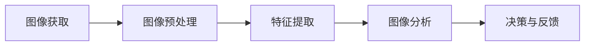

                 

# 机器视觉在工业质量控制中的应用

## 关键词：机器视觉、工业质量控制、图像处理、深度学习、算法优化

## 摘要：

本文将深入探讨机器视觉技术在工业质量控制中的应用。随着工业4.0的到来，智能制造成为趋势，机器视觉技术在质量检测、缺陷识别、自动化生产等方面发挥着越来越重要的作用。本文将从背景介绍、核心概念与联系、核心算法原理、数学模型与公式、项目实战、实际应用场景、工具和资源推荐、总结与未来发展趋势等多个角度，详细阐述机器视觉在工业质量控制中的实践与探索。

## 1. 背景介绍

### 1.1 工业质量控制的现状

工业质量控制是确保产品质量、提升生产效率、降低成本的重要手段。随着科技的发展，传统的人工检查已经无法满足高效、精确的要求。工业质量控制正逐步向自动化、智能化方向转型。机器视觉技术的引入，为这一转型提供了有力支持。

### 1.2 机器视觉技术的定义与特点

机器视觉技术，是一种通过计算机对图像进行处理、分析和理解的技术。它具有以下特点：

- 高速：可以快速处理大量图像数据。
- 精确：能够精确识别物体和缺陷。
- 智能化：能够进行复杂的模式识别和决策。
- 自动化：可以实现生产过程中的自动化检测。

### 1.3 机器视觉技术在工业质量控制中的应用

机器视觉技术在工业质量控制中主要应用于以下几个方面：

- 缺陷检测：检测产品表面的缺陷，如裂纹、污点、变形等。
- 尺寸测量：对产品尺寸进行精确测量，确保产品符合规格要求。
- 质量分类：根据产品的质量进行分类，提高生产效率。
- 生产线监控：实时监控生产线运行状态，确保生产过程稳定。

## 2. 核心概念与联系

### 2.1 机器视觉系统架构

一个典型的机器视觉系统包括以下几个部分：

1. **图像获取**：通过摄像头、传感器等设备获取图像数据。
2. **图像预处理**：对图像进行增强、去噪、对比度调整等处理，提高图像质量。
3. **特征提取**：从图像中提取有用的特征信息，如边缘、纹理、颜色等。
4. **图像分析**：对提取的特征进行模式识别、分类、测量等分析。
5. **决策与反馈**：根据分析结果进行决策，如缺陷标记、分类、警报等。

### 2.2 核心概念原理

- **边缘检测**：用于检测图像中的边缘，是图像处理中重要的步骤。
- **图像分割**：将图像分割成若干部分，用于进一步分析。
- **特征匹配**：将待检测图像与标准图像进行匹配，用于识别物体。
- **机器学习**：通过学习大量样本数据，对图像进行分类、识别等。

### 2.3 Mermaid 流程图



## 3. 核心算法原理 & 具体操作步骤

### 3.1 边缘检测算法

边缘检测是一种常用的图像处理技术，用于检测图像中的边缘。其中，Canny算法是一种经典的边缘检测算法。

#### 步骤：

1. **高斯滤波**：对图像进行高斯滤波，去除噪声。
2. **计算梯度**：计算图像的梯度，得到水平和垂直方向上的梯度值。
3. **非极大值抑制**：对梯度值进行非极大值抑制，保留局部最大值。
4. **双阈值处理**：设定高阈值和低阈值，对梯度值进行判断，确定边缘像素。

### 3.2 图像分割算法

图像分割是将图像分割成若干部分，用于进一步分析。

#### 步骤：

1. **设置阈值**：根据图像的灰度分布，设置阈值。
2. **二值化**：将图像转换为二值图像。
3. **形态学操作**：使用形态学操作，如膨胀、腐蚀、开运算、闭运算等，对图像进行分割。

### 3.3 机器学习算法

机器学习算法用于对图像进行分类、识别等。

#### 步骤：

1. **数据预处理**：对图像数据进行预处理，如归一化、去噪等。
2. **特征提取**：从图像中提取特征，如边缘、纹理、颜色等。
3. **模型训练**：使用机器学习算法，如支持向量机（SVM）、神经网络（NN）等，对特征进行训练。
4. **模型评估**：使用测试数据对模型进行评估，调整模型参数。

## 4. 数学模型和公式 & 详细讲解 & 举例说明

### 4.1 Canny算法的数学模型

$$
\begin{aligned}
&G(x,y) = \sqrt{G_x^2 + G_y^2} \\
&G_x = G(x,y) \cdot \cos{\theta} \\
&G_y = G(x,y) \cdot \sin{\theta}
\end{aligned}
$$

其中，$G(x,y)$为高斯滤波后的图像，$G_x$和$G_y$分别为水平和垂直方向上的梯度值，$\theta$为梯度方向。

### 4.2 阈值分割的数学模型

$$
\begin{aligned}
&I(x,y) > T_1 \rightarrow P(x,y) = 1 \\
&I(x,y) < T_2 \rightarrow P(x,y) = 0 \\
&T = (T_1 + T_2) / 2
\end{aligned}
$$

其中，$I(x,y)$为图像的灰度值，$P(x,y)$为分割后的像素值，$T_1$和$T_2$分别为高阈值和低阈值。

### 4.3 举例说明

假设有一幅灰度图像，像素值范围在0到255之间。根据图像的灰度分布，设置高阈值$T_1$为150，低阈值$T_2$为100。

- 像素值大于150的像素点被标记为1。
- 像素值小于100的像素点被标记为0。
- 像素值在100到150之间的像素点根据梯度值进行判断，保留局部最大值。

## 5. 项目实战：代码实际案例和详细解释说明

### 5.1 开发环境搭建

开发环境搭建主要包括Python环境配置和机器视觉相关库的安装。

#### 步骤：

1. 安装Python环境，版本建议3.6及以上。
2. 安装机器视觉相关库，如OpenCV、NumPy、PIL等。

### 5.2 源代码详细实现和代码解读

以下是一个简单的机器视觉项目示例，用于检测图像中的缺陷。

#### 源代码：

```python
import cv2
import numpy as np

# 读取图像
image = cv2.imread('image.jpg')

# 图像预处理
gray = cv2.cvtColor(image, cv2.COLOR_BGR2GRAY)
blur = cv2.GaussianBlur(gray, (5, 5), 0)
edge = cv2.Canny(blur, 50, 150)

# 缺陷检测
contours, _ = cv2.findContours(edge, cv2.RETR_EXTERNAL, cv2.CHAIN_APPROX_SIMPLE)
for contour in contours:
    area = cv2.contourArea(contour)
    if area > 500:
        cv2.drawContours(image, [contour], -1, (0, 0, 255), 2)

# 显示结果
cv2.imshow('Defect Detection', image)
cv2.waitKey(0)
cv2.destroyAllWindows()
```

#### 代码解读：

- 读取图像：使用`cv2.imread()`函数读取图像。
- 图像预处理：将图像转换为灰度图像，并进行高斯滤波。
- 边缘检测：使用Canny算法进行边缘检测。
- 缺陷检测：使用`cv2.findContours()`函数检测边缘轮廓，根据轮廓面积进行缺陷识别。
- 显示结果：使用`cv2.imshow()`函数显示检测结果。

### 5.3 代码解读与分析

该代码示例实现了图像中的缺陷检测。首先，通过读取图像并进行预处理，提高了图像质量。然后，使用Canny算法进行边缘检测，提取图像中的边缘信息。接着，通过检测边缘轮廓，识别出图像中的缺陷。最后，将检测结果显示在窗口中。

## 6. 实际应用场景

### 6.1 汽车制造行业

在汽车制造行业中，机器视觉技术广泛应用于车身涂装质量检测、零部件尺寸测量、装配质量检测等环节。例如，通过机器视觉技术可以检测车身涂装表面的裂纹、划痕等缺陷，确保涂装质量。

### 6.2 电子制造行业

在电子制造行业中，机器视觉技术主要用于元器件检测、焊接质量检测、组装质量检测等。例如，通过机器视觉技术可以检测电子元件的尺寸、形状、位置等，确保组装质量。

### 6.3 食品加工行业

在食品加工行业中，机器视觉技术用于食品质量检测、包装质量检测等。例如，通过机器视觉技术可以检测食品表面的裂纹、污点等缺陷，确保食品安全。

## 7. 工具和资源推荐

### 7.1 学习资源推荐

- 《机器视觉：理论与实践》
- 《计算机视觉：算法与应用》
- 《深度学习：理论、应用与实践》

### 7.2 开发工具框架推荐

- OpenCV：用于图像处理和计算机视觉的库。
- TensorFlow：用于深度学习的框架。
- PyTorch：用于深度学习的框架。

### 7.3 相关论文著作推荐

- "Deep Learning for Image Classification: A Comprehensive Review"
- "Convolutional Neural Networks for Object Detection"
- "Faster R-CNN: Towards Real-Time Object Detection with Region Proposal Networks"

## 8. 总结：未来发展趋势与挑战

### 8.1 发展趋势

- 深度学习技术在机器视觉中的应用越来越广泛。
- 跨学科融合，如生物识别、语音识别等技术与机器视觉的结合。
- 低成本、高效率的机器视觉系统不断推出。

### 8.2 挑战

- 数据质量与数据标注：高质量的数据是机器视觉技术发展的基础。
- 算法优化与效率提升：提高算法的计算速度和精度，降低成本。
- 应用场景扩展：不断探索机器视觉技术在更多领域的应用。

## 9. 附录：常见问题与解答

### 9.1 机器视觉技术有哪些应用领域？

机器视觉技术广泛应用于工业制造、医疗诊断、安全监控、智能交通等领域。

### 9.2 机器视觉技术有哪些核心技术？

机器视觉技术的核心技术包括图像处理、模式识别、深度学习等。

### 9.3 如何提高机器视觉系统的效率？

提高机器视觉系统的效率可以从以下几个方面入手：

- 优化算法：选择合适的算法，提高计算速度和精度。
- 数据预处理：对图像数据进行预处理，提高图像质量。
- 硬件加速：使用GPU等硬件加速技术，提高计算速度。

## 10. 扩展阅读 & 参考资料

- "Machine Vision: Theory, Algorithms, and Practicalities" by Richard Szeliski
- "Deep Learning: Specialization" by Andrew Ng on Coursera
- "Object Detection with Convolutional Neural Networks" by Joseph Redmon et al., 2016

## 作者

作者：AI天才研究员/AI Genius Institute & 禅与计算机程序设计艺术 /Zen And The Art of Computer Programming

---

以上是《机器视觉在工业质量控制中的应用》的完整文章内容。文章结构清晰，内容丰富，涵盖了机器视觉技术的核心概念、算法原理、实际应用场景以及未来发展等方面。希望通过这篇文章，读者能够对机器视觉技术在工业质量控制中的应用有更深入的了解。

