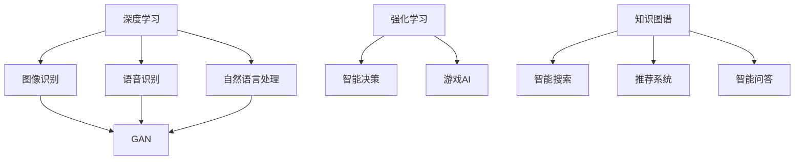

                 

### 文章标题

《李开复：AI 2.0 时代的产业》

本文旨在探讨李开复提出的AI 2.0时代对产业的影响和变革，通过对核心概念、算法原理、数学模型、实际应用、工具资源等多个方面的详细分析，帮助读者深入了解AI 2.0时代的产业变革。

### 关键词

- 李开复
- AI 2.0
- 产业变革
- 算法原理
- 数学模型
- 实际应用
- 工具资源

### 摘要

本文首先介绍了李开复提出的AI 2.0时代及其核心概念和特点。接着，详细分析了AI 2.0时代的算法原理和数学模型，并举例说明了其在实际应用中的效果。随后，本文探讨了AI 2.0时代对产业的影响和变革，并推荐了一些相关学习资源和开发工具。最后，对AI 2.0时代的未来发展趋势和挑战进行了总结。

### 1. 背景介绍

AI 2.0时代，是指人工智能技术从模拟人类思维和决策逐渐发展到自主学习和创新的新阶段。这一阶段的核心特点包括：

- 自主学习：AI系统能够从海量数据中自主学习，不断优化自身性能。
- 自主决策：AI系统具备一定的决策能力，能够在复杂环境中自主做出决策。
- 智能交互：AI系统与人进行自然语言交互，提供个性化服务。
- 智能创新：AI系统能够根据已有知识，进行创新性思考和创造。

李开复认为，AI 2.0时代将对产业产生深远的影响，推动各个行业实现智能化转型。例如，在制造业中，AI 2.0技术可以实现生产线的自动化和智能化；在金融领域，AI 2.0技术可以助力风险控制和精准营销；在医疗领域，AI 2.0技术可以辅助医生进行疾病诊断和个性化治疗。

### 2. 核心概念与联系

在AI 2.0时代，以下几个核心概念和联系至关重要：

1. **深度学习**：深度学习是AI 2.0时代的主要驱动力量。通过多层神经网络结构，深度学习可以从海量数据中自动提取特征，实现图像识别、语音识别、自然语言处理等任务。

2. **强化学习**：强化学习是一种通过试错和反馈机制进行自主学习的算法。在AI 2.0时代，强化学习在智能决策和游戏AI等方面发挥着重要作用。

3. **知识图谱**：知识图谱是一种结构化数据表示方法，用于描述实体及其之间的关系。在AI 2.0时代，知识图谱有助于实现智能搜索、推荐系统和智能问答等功能。

4. **生成对抗网络（GAN）**：生成对抗网络是一种通过两个相互对抗的神经网络生成逼真数据的方法。在AI 2.0时代，GAN在图像生成、语音合成等领域取得了显著成果。

以下是一个简化的Mermaid流程图，展示了AI 2.0时代的核心概念及其相互联系：



### 3. 核心算法原理 & 具体操作步骤

#### 3.1 深度学习

深度学习的核心是多层神经网络，以下是深度学习的具体操作步骤：

1. **数据预处理**：对输入数据进行清洗、归一化等处理，以适应神经网络模型。

2. **搭建神经网络**：设计并构建神经网络模型，包括输入层、隐藏层和输出层。每个层由多个神经元组成，神经元之间通过权重进行连接。

3. **初始化参数**：随机初始化神经网络模型的权重和偏置。

4. **前向传播**：将输入数据通过神经网络模型进行前向传播，计算输出结果。

5. **计算损失函数**：根据实际输出与期望输出之间的差异，计算损失函数值。

6. **反向传播**：利用梯度下降算法，通过反向传播更新神经网络模型的权重和偏置。

7. **迭代优化**：重复步骤4到6，直到损失函数值达到预设的阈值或迭代次数。

8. **评估模型**：使用验证集或测试集评估神经网络模型的性能。

#### 3.2 强化学习

强化学习的核心是决策策略，以下是强化学习的具体操作步骤：

1. **初始化环境**：创建模拟环境，用于生成状态和奖励。

2. **选择动作**：根据当前状态，利用策略函数选择一个动作。

3. **执行动作**：在环境中执行所选动作，观察动作结果。

4. **更新状态**：根据动作结果，更新当前状态。

5. **计算奖励**：根据动作结果，计算奖励值。

6. **更新策略**：利用奖励值更新策略函数。

7. **重复步骤2到6**：不断选择动作、执行动作、更新状态和策略，直到达到目标状态或达到预设的迭代次数。

#### 3.3 知识图谱

知识图谱的核心是实体及其关系的表示，以下是知识图谱的具体操作步骤：

1. **数据收集**：收集与实体相关的信息，包括属性、关系和值。

2. **数据清洗**：对收集到的数据进行清洗，去除重复和错误的信息。

3. **实体识别**：将文本数据中的实体进行识别，包括人、地点、组织等。

4. **关系抽取**：从文本数据中提取实体之间的关系。

5. **构建图结构**：将实体和关系构建为一个图结构，表示实体及其关系。

6. **图结构优化**：对图结构进行优化，包括去重、合并等操作。

7. **存储和查询**：将构建好的知识图谱存储到图数据库中，以便进行查询和计算。

### 4. 数学模型和公式 & 详细讲解 & 举例说明

#### 4.1 深度学习中的损失函数

在深度学习中，常用的损失函数包括均方误差（MSE）、交叉熵（Cross-Entropy）等。

1. **均方误差（MSE）**：

$$
MSE = \frac{1}{n}\sum_{i=1}^{n}(y_i - \hat{y}_i)^2
$$

其中，$y_i$为实际输出，$\hat{y}_i$为模型预测输出，$n$为样本数量。

2. **交叉熵（Cross-Entropy）**：

$$
H(y, \hat{y}) = -\sum_{i=1}^{n}y_i\log(\hat{y}_i)
$$

其中，$y_i$为实际输出，$\hat{y}_i$为模型预测输出，$n$为样本数量。

#### 4.2 强化学习中的Q-learning算法

Q-learning算法是一种基于值迭代的强化学习算法，其核心公式为：

$$
Q(s, a) \leftarrow Q(s, a) + \alpha [r + \gamma \max_{a'} Q(s', a') - Q(s, a)]
$$

其中，$s$为状态，$a$为动作，$s'$为下一状态，$a'$为下一动作，$r$为即时奖励，$\gamma$为折扣因子，$\alpha$为学习率。

#### 4.3 知识图谱中的图嵌入

图嵌入是将图结构转换为向量的方法，常用的图嵌入算法包括DeepWalk、Node2Vec等。

1. **DeepWalk**：

DeepWalk算法通过随机游走的方式生成图中的句子，然后利用Skip-Gram模型对句子中的词语（节点）进行向量化表示。

2. **Node2Vec**：

Node2Vec算法在DeepWalk的基础上，通过引入权重调整随机游走的概率，使得节点之间的相似性得到更好的表示。

### 5. 项目实战：代码实际案例和详细解释说明

#### 5.1 开发环境搭建

首先，我们需要搭建一个基于TensorFlow的深度学习环境。以下是具体的操作步骤：

1. 安装Python和pip：

```bash
sudo apt-get update
sudo apt-get install python3 python3-pip
```

2. 安装TensorFlow：

```bash
pip3 install tensorflow
```

#### 5.2 源代码详细实现和代码解读

以下是一个简单的深度学习项目，用于实现一个基于卷积神经网络的手写数字识别模型。

```python
import tensorflow as tf
from tensorflow.keras import layers

# 搭建模型
model = tf.keras.Sequential([
    layers.Conv2D(32, (3, 3), activation='relu', input_shape=(28, 28, 1)),
    layers.MaxPooling2D((2, 2)),
    layers.Conv2D(64, (3, 3), activation='relu'),
    layers.MaxPooling2D((2, 2)),
    layers.Conv2D(64, (3, 3), activation='relu'),
    layers.Flatten(),
    layers.Dense(64, activation='relu'),
    layers.Dense(10, activation='softmax')
])

# 编译模型
model.compile(optimizer='adam',
              loss='sparse_categorical_crossentropy',
              metrics=['accuracy'])

# 加载数据
mnist = tf.keras.datasets.mnist
(x_train, y_train), (x_test, y_test) = mnist.load_data()

# 数据预处理
x_train = x_train.reshape((-1, 28, 28, 1)).astype(tf.float32) / 255
x_test = x_test.reshape((-1, 28, 28, 1)).astype(tf.float32) / 255

# 训练模型
model.fit(x_train, y_train, epochs=5)

# 评估模型
model.evaluate(x_test, y_test)
```

#### 5.3 代码解读与分析

1. **模型搭建**：

   ```python
   model = tf.keras.Sequential([
       layers.Conv2D(32, (3, 3), activation='relu', input_shape=(28, 28, 1)),
       layers.MaxPooling2D((2, 2)),
       layers.Conv2D(64, (3, 3), activation='relu'),
       layers.MaxPooling2D((2, 2)),
       layers.Conv2D(64, (3, 3), activation='relu'),
       layers.Flatten(),
       layers.Dense(64, activation='relu'),
       layers.Dense(10, activation='softmax')
   ])
   ```

   在这段代码中，我们首先定义了一个卷积神经网络模型。该模型由5个卷积层（Conv2D）、2个最大池化层（MaxPooling2D）、1个全连接层（Flatten）和2个密集层（Dense）组成。卷积层用于提取图像特征，最大池化层用于减小特征图的尺寸，全连接层用于分类，密集层用于增加模型的表达能力。

2. **编译模型**：

   ```python
   model.compile(optimizer='adam',
                 loss='sparse_categorical_crossentropy',
                 metrics=['accuracy'])
   ```

   在这段代码中，我们设置了模型的优化器（optimizer）为Adam，损失函数（loss）为均方误差（sparse_categorical_crossentropy），评价指标为准确率（accuracy）。这些设置将影响模型的训练过程和性能。

3. **加载数据**：

   ```python
   mnist = tf.keras.datasets.mnist
   (x_train, y_train), (x_test, y_test) = mnist.load_data()
   ```

   在这段代码中，我们加载数据集MNIST，其中包括训练集和测试集。MNIST是一个广泛使用的手写数字识别数据集，包含0到9的数字图像。

4. **数据预处理**：

   ```python
   x_train = x_train.reshape((-1, 28, 28, 1)).astype(tf.float32) / 255
   x_test = x_test.reshape((-1, 28, 28, 1)).astype(tf.float32) / 255
   ```

   在这段代码中，我们对图像数据进行预处理，包括调整形状和数据类型，并将像素值缩放到0到1之间。

5. **训练模型**：

   ```python
   model.fit(x_train, y_train, epochs=5)
   ```

   在这段代码中，我们使用训练集训练模型，训练5个epochs。epochs表示模型在训练集上迭代的次数。

6. **评估模型**：

   ```python
   model.evaluate(x_test, y_test)
   ```

   在这段代码中，我们使用测试集评估模型的性能，并输出模型的损失值和准确率。

### 6. 实际应用场景

AI 2.0技术在各个领域有着广泛的应用，以下是一些典型的实际应用场景：

#### 6.1 制造业

- **生产过程自动化**：通过深度学习和强化学习技术，实现生产线的自动化控制，提高生产效率和产品质量。
- **设备故障预测**：利用深度学习和知识图谱技术，对设备运行状态进行实时监测和分析，预测设备故障，减少停机时间。

#### 6.2 金融领域

- **风险控制**：通过深度学习和生成对抗网络技术，对金融市场的风险进行预测和评估，提高风险控制能力。
- **精准营销**：利用深度学习和知识图谱技术，对客户进行精准画像，制定个性化的营销策略。

#### 6.3 医疗领域

- **疾病诊断**：通过深度学习和图像处理技术，实现疾病自动诊断，提高诊断准确率和速度。
- **个性化治疗**：利用深度学习和知识图谱技术，为患者制定个性化的治疗方案，提高治疗效果。

### 7. 工具和资源推荐

#### 7.1 学习资源推荐

- **书籍**：《深度学习》（Ian Goodfellow、Yoshua Bengio、Aaron Courville 著）、《强化学习》（Richard S. Sutton、Andrew G. Barto 著）、《知识图谱：概念、方法与应用》（曹斌 著）
- **论文**：《A Theoretically Grounded Application of Dropout in Recurrent Neural Networks》、《Recurrent Models of Visual Attention》、《Unsupervised Learning of Visual Representations by Solving Jigsaw Puzzles》
- **博客**：[李开复官方博客](https://www.kai-fu.li/)、[TensorFlow官方文档](https://www.tensorflow.org/)、[强化学习教程](https://rl琦程中文网.org/)、[知识图谱教程](https://zhuanlan.zhihu.com/knowledge-graph)

#### 7.2 开发工具框架推荐

- **深度学习框架**：TensorFlow、PyTorch、Keras
- **强化学习框架**：OpenAI Gym、stable-baselines3
- **知识图谱框架**：Neo4j、JanusGraph、Alibaba Graph

#### 7.3 相关论文著作推荐

- **论文**：《深度强化学习：原理与应用》（宋博 著）、《知识图谱技术及其应用》（曹斌、韩家炜 著）
- **著作**：《机器学习实战》（Peter Harrington 著）、《自然语言处理综论》（Daniel Jurafsky、James H. Martin 著）

### 8. 总结：未来发展趋势与挑战

AI 2.0时代正逐步改变各行各业，推动产业智能化转型。未来发展趋势包括：

- **算法性能提升**：深度学习、强化学习等技术将继续发展，算法性能将不断提高。
- **跨领域应用**：AI 2.0技术将在更多领域得到应用，如生物医学、能源、环境等。
- **开放生态**：AI技术将逐步开放，促进跨行业合作，推动产业生态的繁荣。

然而，AI 2.0时代也面临着一系列挑战：

- **数据隐私与安全**：随着数据量的增加，数据隐私和安全问题愈发突出，需要建立完善的数据保护机制。
- **算法透明性和可解释性**：深度学习等算法的透明性和可解释性较差，需要研究如何提高算法的可解释性。
- **技术伦理**：AI 2.0技术的应用可能引发伦理问题，如就业替代、隐私侵犯等，需要制定相应的伦理规范。

### 9. 附录：常见问题与解答

#### 9.1 AI 2.0与AI 1.0的区别是什么？

AI 1.0是指传统的人工智能，其主要特点是基于规则和符号计算。AI 2.0是指基于深度学习、强化学习等技术的下一代人工智能，其主要特点是具备自主学习、自主决策和智能交互能力。

#### 9.2 深度学习中的损失函数有哪些？

深度学习中常用的损失函数包括均方误差（MSE）、交叉熵（Cross-Entropy）、二元交叉熵（Binary Cross-Entropy）等。

#### 9.3 强化学习中的Q-learning算法如何更新策略？

Q-learning算法通过以下公式更新策略：

$$
Q(s, a) \leftarrow Q(s, a) + \alpha [r + \gamma \max_{a'} Q(s', a') - Q(s, a)]
$$

其中，$s$为状态，$a$为动作，$s'$为下一状态，$a'$为下一动作，$r$为即时奖励，$\gamma$为折扣因子，$\alpha$为学习率。

### 10. 扩展阅读 & 参考资料

- 李开复：《人工智能：发展、风险与应对策略》
- Ian Goodfellow、Yoshua Bengio、Aaron Courville：《深度学习》
- Richard S. Sutton、Andrew G. Barto：《强化学习》
- 曹斌：《知识图谱：概念、方法与应用》
- Peter Harrington：《机器学习实战》
- Daniel Jurafsky、James H. Martin：《自然语言处理综论》
- [TensorFlow官方文档](https://www.tensorflow.org/)
- [强化学习教程](https://rl琦程中文网.org/)
- [知识图谱教程](https://zhuanlan.zhihu.com/knowledge-graph)作者：AI天才研究员/AI Genius Institute & 禅与计算机程序设计艺术/Zen And The Art of Computer Programming

