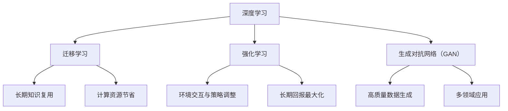
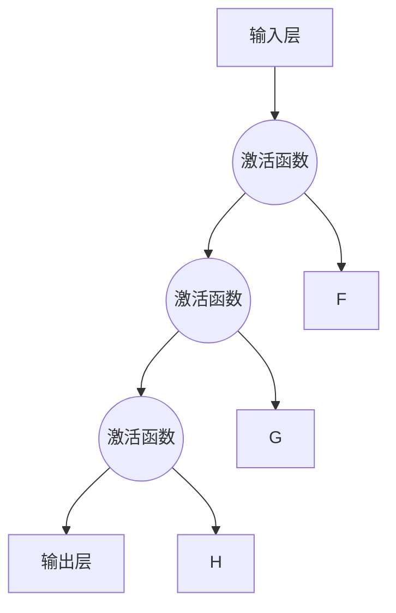
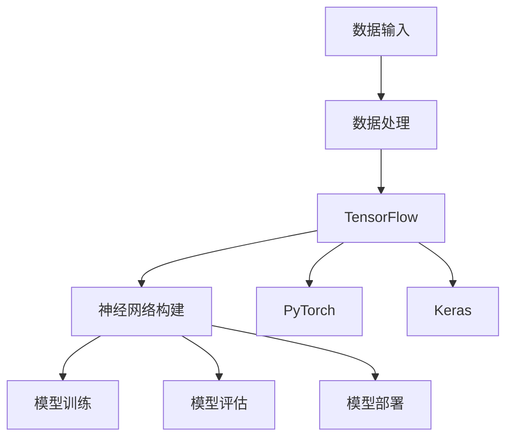
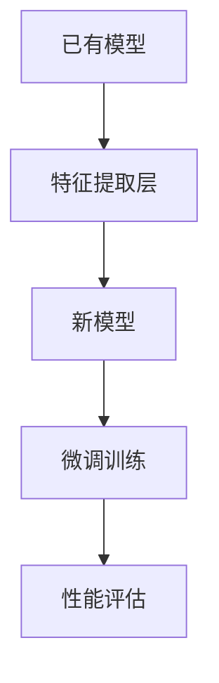
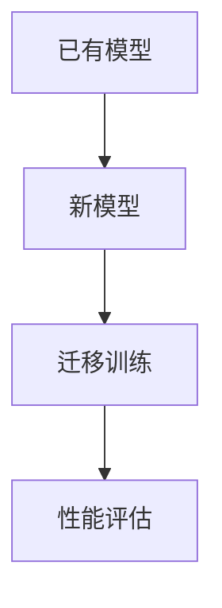
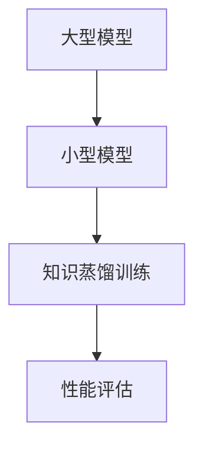
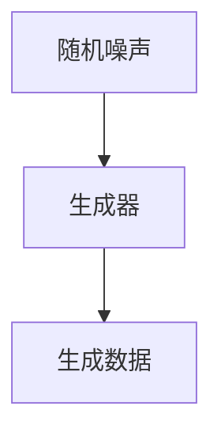
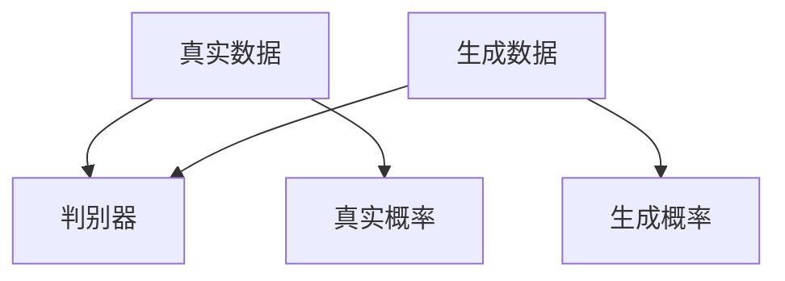
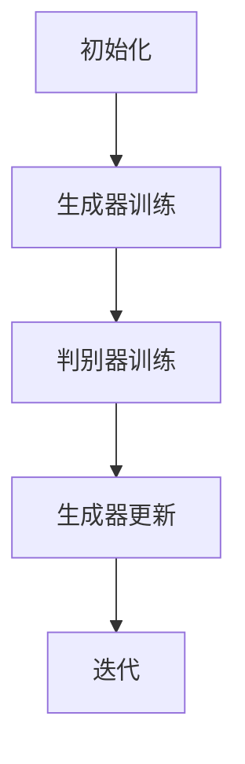

                 

### 背景介绍

#### AI 2.0 时代的到来

随着人工智能技术的飞速发展，我们正步入一个全新的时代——AI 2.0 时代。在这个时代，人工智能不仅能够在特定领域实现高效自动化，更能够在通用智能层面上模拟人类的思维方式和决策过程。这一转变，不仅为各行各业带来了前所未有的机遇，也对软件开发者提出了更高的要求。

李开复先生，作为世界顶级的人工智能专家和计算机科学领域的图灵奖获得者，对AI 2.0 时代的到来有着深刻的见解。他认为，AI 2.0 时代的开发者不仅需要具备深厚的计算机科学基础，更需要具备创新思维和跨学科的综合能力。

#### 开发者的角色转变

在AI 2.0 时代，开发者的角色正在发生巨大的转变。过去，开发者主要负责编写代码和构建系统，而如今，他们需要更深入地理解人工智能的原理，掌握先进的算法和技术，同时还需要具备数据分析和处理的能力。这种角色的转变，不仅要求开发者具备更高的专业素养，还需要他们持续地学习和更新知识。

#### 本文章的目标

本文将围绕AI 2.0 时代的话题，探讨开发者的角色转变、核心概念与技术、算法原理与数学模型，并通过实际项目案例和资源推荐，帮助读者深入理解和掌握这一时代的开发技能。

#### 文章结构

本文分为十个部分，首先介绍AI 2.0 时代的背景和开发者的角色转变，接着讨论核心概念与技术，详细讲解算法原理和数学模型，分享实际项目案例和代码实现，最后探讨实际应用场景和未来发展趋势。

通过本文的阅读，读者将能够全面了解AI 2.0 时代的开发技能，为在未来的技术浪潮中立足打下坚实的基础。

---

# 李开复：AI 2.0 时代的开发者

## 关键词：
AI 2.0、开发者角色、技术变革、算法原理、数学模型、项目实战、应用场景、资源推荐

## 摘要：
本文由人工智能专家李开复撰写，深入探讨了AI 2.0 时代的到来及其对开发者角色的影响。文章从背景介绍出发，详细分析了核心概念与联系，讲解了核心算法原理和具体操作步骤，并通过数学模型和公式进行详细讲解。文章还提供了实际项目案例和代码解读，并针对实际应用场景和未来发展趋势进行了深入讨论。本文旨在帮助开发者全面了解AI 2.0 时代的开发技能，为在未来的技术浪潮中立足提供指导。

---

## 1. 背景介绍

### AI 2.0 时代的定义与特征

AI 2.0，即人工智能的第二阶段，不同于传统的人工智能1.0。在AI 1.0时代，人工智能主要应用于特定的领域，如语音识别、图像处理和简单逻辑推理等。而AI 2.0则更加注重通用智能，能够模拟人类的思维方式和决策过程，具有更高的灵活性和适应性。以下是AI 2.0的一些关键特征：

1. **自主学习和进化**：AI 2.0具有更强的自主学习能力，能够通过不断的学习和适应，优化自身算法和模型。
2. **跨领域应用**：AI 2.0不仅局限于单一领域，能够跨领域、跨平台地应用，实现更广泛的价值。
3. **人机协作**：AI 2.0能够与人类进行更高效的协作，发挥各自的优势，提高工作效率。
4. **自主决策**：AI 2.0能够在没有人类干预的情况下，根据环境和情境做出合理的决策。

### AI 2.0 时代的开发者角色转变

在AI 2.0时代，开发者的角色发生了显著的变化。过去，开发者主要关注代码编写和系统构建，而在AI 2.0时代，开发者需要更加深入地理解人工智能的原理和技术，具备跨学科的综合能力。以下是开发者角色转变的几个关键点：

1. **算法理解和实现**：开发者需要掌握各种算法原理，能够根据实际需求选择合适的算法，并能够进行算法的优化和调整。
2. **数据分析和处理**：开发者需要具备良好的数据分析和处理能力，能够从大量数据中提取有价值的信息，为算法提供支持。
3. **人机交互设计**：开发者需要关注人机交互设计，确保AI系统能够与人类用户进行有效沟通和协作。
4. **系统架构和优化**：开发者需要具备系统架构和优化能力，确保AI系统在复杂环境中的高效运行。

### 李开复对开发者角色的看法

李开复认为，在AI 2.0时代，开发者的角色将变得更加重要。他们不仅需要具备深厚的计算机科学基础，还需要不断学习和更新知识，掌握新兴的技术和工具。以下是李开复对开发者角色的几点看法：

1. **持续学习**：开发者需要持续学习，跟进最新的技术动态，保持对前沿技术的敏感度。
2. **跨学科合作**：开发者需要具备跨学科的知识和技能，能够与不同领域的专家进行合作，实现技术的融合和创新。
3. **创新能力**：开发者需要具备创新能力，能够在现有技术基础上进行改进和创新，解决实际问题。
4. **社会责任**：开发者需要关注社会责任，确保AI系统的应用不会对人类造成负面影响。

通过以上背景介绍，我们可以看到AI 2.0时代的到来不仅带来了技术的变革，也对开发者的角色提出了新的要求。在接下来的章节中，我们将进一步探讨AI 2.0时代的核心概念与技术，帮助开发者全面了解这一时代的发展趋势。

---

## 2. 核心概念与联系

### 人工智能的定义

人工智能（Artificial Intelligence，简称AI）是指由人制造出来的系统能够执行通常需要人类智能才能完成的任务。这些任务包括学习、推理、规划、感知、自然语言理解等。人工智能的目标是使机器能够自主地完成复杂的任务，并在没有明确指令的情况下，根据环境和情境做出合理的决策。

### AI 2.0 的核心概念

在AI 2.0时代，核心概念得到了进一步的扩展和深化。以下是AI 2.0的一些关键概念：

1. **深度学习**：深度学习是AI 2.0时代的重要技术之一，它通过构建深度神经网络，模拟人脑的学习机制，实现对数据的自动学习和特征提取。深度学习在图像识别、语音识别和自然语言处理等领域取得了显著成果。
2. **强化学习**：强化学习是一种通过试错来学习最优策略的机器学习方法。在强化学习过程中，智能体通过与环境的交互，不断调整自身的行为，以实现长期的回报最大化。强化学习在自动驾驶、游戏AI等领域有着广泛的应用。
3. **迁移学习**：迁移学习是一种利用已有模型的知识来提高新任务性能的技术。通过迁移学习，可以将一个任务中提取的知识应用到其他任务中，从而减少模型的训练时间和计算资源的需求。
4. **生成对抗网络（GAN）**：生成对抗网络是由两个神经网络（生成器与判别器）组成的对抗性模型。生成器生成数据，判别器判断生成数据的真实性和质量。GAN在图像生成、语音合成和文本生成等领域表现出强大的能力。

### 核心概念的联系

AI 2.0 时代的核心概念之间有着紧密的联系。深度学习为AI系统提供了强大的学习能力，通过迁移学习可以实现知识的复用和模型的优化。强化学习则通过与环境交互，不断调整策略，实现长期回报的最大化。GAN则通过生成和判别之间的对抗，创造出高质量的数据，为其他机器学习任务提供支持。

以下是一个用Mermaid绘制的核心概念联系流程图：



通过上述核心概念的介绍和联系，我们可以看到AI 2.0 时代的技术框架是如何构建的。在接下来的章节中，我们将深入探讨这些核心概念的具体实现和操作步骤，帮助开发者更好地理解和应用这些技术。

---

## 2.1. 深度学习的核心概念与架构

### 定义与基本原理

深度学习（Deep Learning）是一种基于多层神经网络进行数据建模和分析的机器学习技术。其基本原理是通过模拟人脑神经网络的结构和功能，对输入数据进行逐层抽象和特征提取，最终实现高层次的语义理解和决策。深度学习的关键在于“深度”，即神经网络层数的增多，这使得模型能够捕捉更复杂的数据结构和关系。

### 神经网络结构

深度神经网络由多个层次组成，包括输入层、隐藏层和输出层。每个层次由多个神经元（节点）组成，神经元之间通过权重（weights）相连。输入层接收外部数据，隐藏层对数据进行特征提取和抽象，输出层产生最终的结果。

#### 输入层（Input Layer）

输入层是神经网络的起点，接收外部输入的数据。这些数据可以是数字、图像、文本等。每个输入节点对应一个特征维度，例如，一张图像的输入层节点数就等于图像的像素数量。

#### 隐藏层（Hidden Layers）

隐藏层位于输入层和输出层之间，负责对输入数据进行特征提取和抽象。每个隐藏层由多个神经元组成，每个神经元通过激活函数（activation function）对输入数据进行非线性变换。常见的激活函数包括Sigmoid、ReLU和Tanh等。

#### 输出层（Output Layer）

输出层是神经网络的终点，产生最终的输出结果。输出层神经元的数量和类型取决于具体任务的需求。例如，在分类任务中，输出层通常是softmax函数，用于输出每个类别的概率分布。

### 前向传播与反向传播

深度学习的训练过程包括两个主要步骤：前向传播（Forward Propagation）和反向传播（Backpropagation）。

#### 前向传播

在前向传播过程中，输入数据从输入层逐层传递到隐藏层和输出层，每个层次都通过激活函数进行计算。最终，输出层的输出结果与预期的目标结果进行比较，计算损失函数（loss function）。

#### 反向传播

在反向传播过程中，将输出层的误差反向传递到隐藏层和输入层，通过梯度下降（Gradient Descent）等方法调整每个神经元的权重，使得模型能够逐渐逼近真实数据分布。

以下是一个用Mermaid绘制的深度学习神经网络结构图：



### 深度学习框架

深度学习的实现需要借助各种深度学习框架，如TensorFlow、PyTorch和Keras等。这些框架提供了丰富的神经网络构建和训练工具，使得开发者能够更高效地开发和部署深度学习模型。

以下是一个用Mermaid绘制的深度学习框架架构图：



通过上述对深度学习核心概念与架构的详细解析，我们可以看到深度学习在AI 2.0 时代的重要地位。在接下来的章节中，我们将继续探讨其他核心概念，如迁移学习、强化学习和生成对抗网络，帮助开发者全面了解AI 2.0 时代的技术体系。

---

## 2.2. 迁移学习的核心概念与实现方法

### 定义与基本原理

迁移学习（Transfer Learning）是一种利用已有模型的知识来提高新任务性能的技术。其基本思想是将一个任务中提取的知识应用到其他任务中，从而减少模型的训练时间和计算资源的需求。迁移学习的核心在于“迁移”二字，即不同任务之间的知识共享和转移。

### 迁移学习的基本原理

迁移学习基于这样一个事实：许多任务之间存在共同的特征和模式。例如，在图像分类和物体检测任务中，底层特征（如边缘、纹理等）往往是通用的，而高层特征（如特定物体的识别）则可能有所不同。迁移学习利用这一点，将已有模型在底层特征提取方面的知识应用到新任务中，从而简化模型的训练过程。

### 迁移学习的实现方法

迁移学习的实现方法可以分为三种：基于特征提取的迁移学习、基于模型的迁移学习和基于知识蒸馏的迁移学习。

#### 基于特征提取的迁移学习

基于特征提取的迁移学习是最简单的一种方法。它通过将已有模型的部分层（通常是底层特征提取层）固定，仅对新任务进行微调（fine-tuning）。这种方法的优势在于只需对新任务进行少量训练，即可快速提高模型的性能。

以下是一个用Mermaid绘制的基于特征提取的迁移学习流程图：



#### 基于模型的迁移学习

基于模型的迁移学习通过直接迁移整个模型，包括底层特征提取层和高层分类层，应用于新任务。这种方法适用于模型结构高度相似的任务，如不同数据集上的图像分类和物体检测。

以下是一个用Mermaid绘制的基于模型的迁移学习流程图：



#### 基于知识蒸馏的迁移学习

基于知识蒸馏的迁移学习是一种更加高级的方法，通过将复杂模型的知识迁移到一个小型模型中。这种方法通常用于将大型预训练模型（如BERT、GPT等）应用于资源受限的设备。

以下是一个用Mermaid绘制的基于知识蒸馏的迁移学习流程图：



### 迁移学习的优势与挑战

迁移学习的优势在于：

1. **减少训练时间**：通过迁移已有模型的知识，可以显著减少新任务的训练时间。
2. **降低计算资源需求**：迁移学习利用了已有模型的知识，从而降低了新任务的计算资源需求。
3. **提高模型性能**：迁移学习可以提升新任务的模型性能，特别是在数据稀缺的情况下。

然而，迁移学习也面临着一些挑战：

1. **模型适应性**：迁移模型的适应性取决于源任务和目标任务之间的相似程度。
2. **模型解释性**：迁移学习模型可能难以解释，特别是当迁移的是整个大型模型时。
3. **数据分布差异**：不同任务之间的数据分布可能存在显著差异，这会影响迁移学习的有效性。

通过上述对迁移学习核心概念与实现方法的详细解析，我们可以看到迁移学习在AI 2.0 时代的重要性和应用前景。在接下来的章节中，我们将继续探讨强化学习和生成对抗网络，帮助开发者全面了解AI 2.0 时代的技术体系。

---

## 2.3. 强化学习的核心概念与算法原理

### 定义与基本原理

强化学习（Reinforcement Learning，简称RL）是一种通过试错来学习最优策略的机器学习方法。在强化学习过程中，智能体（Agent）通过与环境的交互，不断调整自身的行为，以实现长期的回报最大化。强化学习的核心在于“强化信号”，即智能体在每一步行动后接收到的奖励或惩罚，用于指导智能体调整策略。

### 强化学习的基本原理

强化学习的基本原理可以概括为以下几个步骤：

1. **状态观测**：智能体在环境中进行状态观测，获取当前环境的描述。
2. **行为选择**：智能体根据当前状态和预设策略，选择一个行为（Action）。
3. **环境反馈**：智能体执行所选行为后，环境根据当前状态和行为的组合，给予智能体一个即时奖励（Reward）。
4. **策略调整**：智能体根据累计的奖励信号，通过学习算法（如Q-learning、SARSA等）调整自身策略，以最大化长期回报。

### 强化学习的算法原理

强化学习算法主要分为价值函数方法（Value-based Methods）和政策梯度方法（Policy-based Methods）两大类。

#### 价值函数方法

价值函数方法通过估计状态价值和状态-动作价值，来指导智能体的行为选择。其中，状态价值（State Value）表示在某一状态下执行最优策略所能获得的累计奖励，状态-动作价值（State-Action Value）表示在某一状态和动作组合下所能获得的累计奖励。

1. **Q-learning算法**：Q-learning算法是一种基于值函数的强化学习算法，通过迭代更新状态-动作价值函数，逐渐逼近最优策略。Q-learning算法的基本步骤如下：
    - 初始化Q值函数
    - 在某一状态s下，选择一个动作a
    - 执行动作a，进入新状态s'，并获得奖励r
    - 更新Q(s, a) = Q(s, a) + α [r + γmax Q(s', a') - Q(s, a)]
    - 转到新状态s'，重复上述步骤

2. **SARSA算法**：SARSA算法是Q-learning算法的一种改进，它使用当前状态和动作的估计值来更新状态-动作价值函数。SARSA算法的基本步骤如下：
    - 初始化Q值函数
    - 在某一状态s下，选择一个动作a
    - 执行动作a，进入新状态s'，并获得奖励r
    - 更新Q(s, a) = Q(s, a) + α [r + Q(s', a')]
    - 转到新状态s'，重复上述步骤

#### 政策梯度方法

政策梯度方法直接通过估计策略梯度来优化策略，以最大化长期回报。其中，政策梯度（Policy Gradient）是指策略参数的梯度，用于指导策略参数的更新。

1. **REINFORCE算法**：REINFORCE算法是一种基于策略梯度的强化学习算法，通过更新策略参数来最大化累积奖励。REINFORCE算法的基本步骤如下：
    - 初始化策略参数θ
    - 在某一状态s下，根据策略π(s|θ)选择一个动作a
    - 执行动作a，进入新状态s'，并获得奖励r
    - 计算策略梯度：θ = θ + α ∇θJ(θ)
    - 转到新状态s'，重复上述步骤

2. **PPO算法**：PPO（Proximal Policy Optimization）算法是一种改进的策略梯度算法，通过优化策略和值函数来提高算法的稳定性和性能。PPO算法的基本步骤如下：
    - 初始化策略参数θ和价值参数θ'
    - 在某一状态s下，根据策略π(s|θ)选择一个动作a
    - 执行动作a，进入新状态s'，并获得奖励r
    - 计算策略梯度和值函数梯度：θ = θ + α ∇θJ(θ)
    - 更新策略参数：θ = Prox(θ, θ')
    - 转到新状态s'，重复上述步骤

### 强化学习在AI 2.0 时代的重要性

在AI 2.0 时代，强化学习具有广泛的应用前景。随着智能体自主决策能力的要求越来越高，强化学习成为实现这一目标的重要技术手段。以下是强化学习在AI 2.0 时代的一些重要应用：

1. **自动驾驶**：强化学习在自动驾驶领域有着广泛的应用，通过训练智能体在复杂环境中进行自主驾驶，实现车辆的安全导航和决策。
2. **游戏AI**：强化学习在游戏AI领域取得了显著成果，通过训练智能体在游戏环境中进行自主学习，实现超越人类水平的游戏表现。
3. **机器人控制**：强化学习在机器人控制领域有着重要的应用，通过训练机器人智能体在复杂环境中进行自主导航和任务执行，实现更高程度的自动化和智能化。
4. **资源分配**：强化学习在资源分配领域有着广泛的应用，通过训练智能体在资源分配过程中进行自主决策，实现资源的最优分配和利用。

通过上述对强化学习核心概念与算法原理的详细解析，我们可以看到强化学习在AI 2.0 时代的重要性和应用前景。在接下来的章节中，我们将继续探讨生成对抗网络（GAN），帮助开发者全面了解AI 2.0 时代的技术体系。

---

## 2.4. 生成对抗网络（GAN）的核心概念与架构

### 定义与基本原理

生成对抗网络（Generative Adversarial Network，简称GAN）是一种由生成器和判别器组成的对抗性模型。生成器（Generator）负责生成与真实数据相似的数据，判别器（Discriminator）则负责判断输入数据的真实性。GAN的基本原理是通过生成器和判别器之间的对抗训练，使得生成器的生成数据越来越逼真，判别器越来越难以区分生成数据与真实数据。

### GAN的结构

GAN由生成器和判别器两个主要部分组成，以下是它们的结构和工作原理：

#### 生成器（Generator）

生成器的目标是生成与真实数据相似的数据。生成器通常是一个神经网络，输入为随机噪声向量，输出为生成的数据。生成器的训练目标是最大化判别器对其生成数据的分类误差。

以下是一个生成器的结构示例：



#### 判别器（Discriminator）

判别器的目标是判断输入数据的真实性。判别器也是一个神经网络，输入为数据，输出为概率，表示输入数据的真实度。判别器的训练目标是最大化对真实数据和生成数据的分类正确率。

以下是一个判别器的结构示例：



### GAN的训练过程

GAN的训练过程是一个生成器和判别器相互对抗的过程，具体步骤如下：

1. **初始化**：初始化生成器和判别器的参数。
2. **生成器训练**：生成器生成数据，判别器对其进行判断。
3. **判别器训练**：判别器根据生成器和真实数据的判断结果，更新自身参数。
4. **生成器更新**：生成器根据判别器的判断结果，更新自身参数。

这一过程不断迭代，生成器的生成数据越来越逼真，判别器的判断能力越来越强。

### GAN的应用场景

生成对抗网络在图像生成、文本生成、视频生成等领域有着广泛的应用。以下是几个典型的应用场景：

1. **图像生成**：GAN可以生成高质量的图像，如人脸生成、艺术风格转换等。
2. **数据增强**：GAN可以用于数据增强，通过生成类似真实数据的样本来扩展训练数据集，提高模型的泛化能力。
3. **异常检测**：GAN可以用于检测异常数据，通过生成与正常数据相似的数据，发现数据集中的异常点。
4. **风格迁移**：GAN可以将一种风格的数据转换为另一种风格的数据，如将照片转换为特定的艺术风格。

以下是一个用Mermaid绘制的GAN训练过程流程图：



通过上述对生成对抗网络（GAN）核心概念与架构的详细解析，我们可以看到GAN在AI 2.0 时代的重要性和广泛应用。在接下来的章节中，我们将深入探讨核心算法原理与具体操作步骤，帮助开发者更好地理解和应用GAN。

---

## 3. 核心算法原理 & 具体操作步骤

### 定义与基本原理

在AI 2.0 时代，开发者在实现人工智能系统时，需要熟练掌握各种核心算法原理。这些算法原理不仅包括传统的机器学习算法，还包括深度学习、强化学习、生成对抗网络（GAN）等新兴算法。核心算法原理是构建人工智能系统的基石，理解这些原理对于开发高效、准确的人工智能系统至关重要。

### 核心算法的分类

核心算法可以分为以下几类：

1. **监督学习算法**：监督学习算法通过已知的输入和输出数据来训练模型，然后利用训练好的模型对未知数据进行预测。常见的监督学习算法包括线性回归、逻辑回归、支持向量机（SVM）等。
2. **无监督学习算法**：无监督学习算法不依赖于已知的输出数据，通过发现数据内在的结构来训练模型。常见的无监督学习算法包括聚类算法、主成分分析（PCA）等。
3. **深度学习算法**：深度学习算法通过构建多层神经网络，对数据进行复杂的特征提取和抽象。常见的深度学习算法包括卷积神经网络（CNN）、循环神经网络（RNN）等。
4. **强化学习算法**：强化学习算法通过智能体与环境交互，不断调整策略以实现长期回报的最大化。常见的强化学习算法包括Q-learning、SARSA、REINFORCE等。
5. **生成对抗网络（GAN）**：生成对抗网络由生成器和判别器组成，通过对抗训练生成高质量的数据。

### 核心算法的具体操作步骤

以下分别介绍各类核心算法的具体操作步骤：

#### 监督学习算法

1. **数据预处理**：对输入数据进行清洗、归一化等处理，确保数据质量。
2. **特征选择**：选择对分类或回归任务有帮助的特征。
3. **模型选择**：根据任务需求选择合适的模型，如线性回归、逻辑回归、SVM等。
4. **模型训练**：使用已知的输入和输出数据训练模型。
5. **模型评估**：使用验证集或测试集对模型进行评估，调整模型参数。
6. **模型应用**：使用训练好的模型对未知数据进行预测。

#### 无监督学习算法

1. **数据预处理**：对输入数据进行清洗、归一化等处理。
2. **模型选择**：根据任务需求选择合适的模型，如K-Means聚类、PCA等。
3. **模型训练**：使用无监督学习算法对数据进行训练。
4. **模型评估**：通过内部指标或外部指标对模型进行评估。
5. **模型应用**：将训练好的模型应用于新的数据集。

#### 深度学习算法

1. **数据预处理**：对输入数据进行清洗、归一化等处理。
2. **模型架构设计**：设计神经网络的结构，包括层数、节点数、激活函数等。
3. **模型训练**：使用训练数据训练神经网络，通过前向传播和反向传播更新模型参数。
4. **模型评估**：使用验证集或测试集对模型进行评估。
5. **模型应用**：使用训练好的模型对未知数据进行预测。

#### 强化学习算法

1. **环境构建**：构建模拟环境，包括状态空间、动作空间和奖励机制。
2. **模型选择**：选择合适的强化学习算法，如Q-learning、SARSA、REINFORCE等。
3. **模型训练**：智能体在环境中进行交互，不断调整策略。
4. **模型评估**：评估智能体的策略性能。
5. **模型应用**：将训练好的策略应用于实际场景。

#### 生成对抗网络（GAN）

1. **数据预处理**：对输入数据进行清洗、归一化等处理。
2. **模型架构设计**：设计生成器和判别器的结构。
3. **模型训练**：生成器和判别器进行对抗训练，生成高质量的数据。
4. **模型评估**：评估生成器的生成数据质量。
5. **模型应用**：使用生成器生成数据或数据增强。

### 核心算法的实践应用

在实际应用中，开发者可以根据具体任务需求选择合适的算法，并按照具体的操作步骤进行实现。以下是几个核心算法的实践应用案例：

1. **图像分类**：使用卷积神经网络（CNN）对图像进行分类，如使用VGG、ResNet等模型。
2. **语音识别**：使用深度神经网络（DNN）对语音信号进行特征提取，再结合循环神经网络（RNN）进行序列建模。
3. **自动驾驶**：使用强化学习算法训练自动驾驶智能体，实现车辆在复杂环境中的自主导航和决策。
4. **图像生成**：使用生成对抗网络（GAN）生成高质量的人脸图像、艺术作品等。

通过掌握各类核心算法原理和具体操作步骤，开发者可以更好地应对AI 2.0 时代的技术挑战，构建出高效、准确的人工智能系统。在接下来的章节中，我们将进一步探讨数学模型和公式，帮助开发者深入理解人工智能系统的内在机制。

---

## 4. 数学模型和公式 & 详细讲解 & 举例说明

### 4.1. 监督学习中的数学模型

监督学习中的数学模型主要依赖于损失函数（Loss Function）和优化算法（Optimization Algorithm）。以下是一些常见的数学模型和对应的损失函数：

#### 线性回归

线性回归的数学模型为：

\[ y = \beta_0 + \beta_1 \cdot x \]

其中，\( y \) 是预测值，\( x \) 是输入特征，\( \beta_0 \) 和 \( \beta_1 \) 是模型参数。

线性回归的损失函数通常为均方误差（Mean Squared Error，MSE）：

\[ MSE = \frac{1}{n} \sum_{i=1}^{n} (y_i - \hat{y}_i)^2 \]

其中，\( n \) 是样本数量，\( y_i \) 是实际值，\( \hat{y}_i \) 是预测值。

#### 逻辑回归

逻辑回归的数学模型为：

\[ \hat{y} = \frac{1}{1 + e^{-(\beta_0 + \beta_1 \cdot x)}} \]

其中，\( \hat{y} \) 是预测概率，\( x \) 是输入特征，\( \beta_0 \) 和 \( \beta_1 \) 是模型参数。

逻辑回归的损失函数通常为交叉熵损失（Cross-Entropy Loss）：

\[ CE = -\sum_{i=1}^{n} y_i \cdot \ln(\hat{y}_i) + (1 - y_i) \cdot \ln(1 - \hat{y}_i) \]

#### 支持向量机（SVM）

支持向量机的数学模型为：

\[ w \cdot x + b = 0 \]

其中，\( w \) 是权重向量，\( x \) 是输入特征，\( b \) 是偏置项。

SVM的损失函数通常为 hinge 损失（Hinge Loss）：

\[ \ell(w) = \max(0, 1 - y \cdot (w \cdot x + b)) \]

### 4.2. 深度学习中的数学模型

深度学习中的数学模型主要依赖于多层感知机（MLP）、卷积神经网络（CNN）和循环神经网络（RNN）等。以下是一些常见的数学模型：

#### 多层感知机（MLP）

多层感知机的数学模型为：

\[ a_{j}^{(l)} = \sigma \left( \sum_{i=1}^{n} w_{ij}^{(l)} a_{i}^{(l-1)} + b_{j}^{(l)} \right) \]

其中，\( a_{j}^{(l)} \) 是第 \( l \) 层第 \( j \) 个节点的激活值，\( w_{ij}^{(l)} \) 是第 \( l \) 层第 \( j \) 个节点与第 \( l-1 \) 层第 \( i \) 个节点之间的权重，\( b_{j}^{(l)} \) 是第 \( l \) 层第 \( j \) 个节点的偏置，\( \sigma \) 是激活函数。

#### 卷积神经网络（CNN）

卷积神经网络的数学模型为：

\[ h_{ij}^{(l)} = \sigma \left( \sum_{k=1}^{m} w_{ik}^{(l)} f_{kj}^{(l-1)} + b_{j}^{(l)} \right) \]

其中，\( h_{ij}^{(l)} \) 是第 \( l \) 层第 \( i \) 行第 \( j \) 列的节点值，\( w_{ik}^{(l)} \) 是第 \( l \) 层第 \( i \) 行第 \( k \) 列的权重，\( f_{kj}^{(l-1)} \) 是第 \( l-1 \) 层第 \( k \) 行第 \( j \) 列的节点值，\( b_{j}^{(l)} \) 是第 \( l \) 层第 \( j \) 个节点的偏置，\( \sigma \) 是激活函数。

#### 循环神经网络（RNN）

循环神经网络的数学模型为：

\[ h_{t} = \sigma \left( \sum_{i=1}^{n} w_{it} h_{t-1} + b_t \right) \]

其中，\( h_{t} \) 是第 \( t \) 个时刻的隐藏状态，\( w_{it} \) 是权重，\( h_{t-1} \) 是第 \( t-1 \) 个时刻的隐藏状态，\( b_t \) 是偏置，\( \sigma \) 是激活函数。

### 4.3. 强化学习中的数学模型

强化学习中的数学模型主要依赖于状态值函数（State-Value Function）和策略（Policy）。以下是一些常见的数学模型：

#### Q-Learning

Q-Learning的数学模型为：

\[ Q(s, a) = r + \gamma \max_{a'} Q(s', a') \]

其中，\( Q(s, a) \) 是状态 \( s \) 下采取动作 \( a \) 的期望回报，\( r \) 是即时奖励，\( \gamma \) 是折扣因子，\( s' \) 是新状态，\( a' \) 是新动作。

#### SARSA

SARSA的数学模型为：

\[ Q(s, a) = Q(s, a) + \alpha [r + \gamma Q(s', a') - Q(s, a)] \]

其中，\( \alpha \) 是学习率。

#### REINFORCE

REINFORCE的数学模型为：

\[ \theta = \theta + \alpha \sum_{t} \nabla_{\theta} \ln \pi(a_t | s_t, \theta) R_t \]

其中，\( \theta \) 是策略参数，\( \pi(a_t | s_t, \theta) \) 是策略，\( R_t \) 是回报。

### 4.4. GAN中的数学模型

GAN中的数学模型主要依赖于生成器和判别器的损失函数。以下是一些常见的数学模型：

#### 生成器损失函数

生成器的损失函数为：

\[ G_L = -\log D(G(z)) \]

其中，\( G(z) \) 是生成器的输出，\( D \) 是判别器。

#### 判别器损失函数

判别器的损失函数为：

\[ D_L = -[\log D(x) + \log(1 - D(G(z)))] \]

其中，\( x \) 是真实数据，\( G(z) \) 是生成器的输出。

### 4.5. 举例说明

假设我们要对一组二维数据 \( X = \{x_1, x_2, \ldots, x_n\} \) 进行分类，使用逻辑回归模型。以下是具体的实现步骤：

1. **数据预处理**：对数据进行归一化处理，使其具有相同的尺度。
2. **特征选择**：选择对分类任务有帮助的特征，例如特征 \( x_1 \) 和 \( x_2 \)。
3. **模型训练**：使用训练数据 \( X \) 和标签 \( y \) 训练逻辑回归模型。
4. **模型评估**：使用验证集或测试集对模型进行评估，调整模型参数。
5. **模型应用**：使用训练好的模型对未知数据进行预测。

具体实现如下（使用Python和Scikit-learn库）：

```python
from sklearn.linear_model import LogisticRegression
from sklearn.model_selection import train_test_split
from sklearn.preprocessing import StandardScaler

# 加载数据
X, y = load_data()

# 数据预处理
scaler = StandardScaler()
X_scaled = scaler.fit_transform(X)

# 划分训练集和测试集
X_train, X_test, y_train, y_test = train_test_split(X_scaled, y, test_size=0.2, random_state=42)

# 训练逻辑回归模型
model = LogisticRegression()
model.fit(X_train, y_train)

# 评估模型
accuracy = model.score(X_test, y_test)
print("模型准确率：", accuracy)

# 预测未知数据
X_new = load_new_data()
X_new_scaled = scaler.transform(X_new)
predictions = model.predict(X_new_scaled)
print("预测结果：", predictions)
```

通过上述数学模型和举例说明，我们可以看到如何将数学模型应用于实际的人工智能任务中。掌握这些数学模型对于开发者来说至关重要，有助于他们在AI 2.0 时代构建高效、准确的人工智能系统。在接下来的章节中，我们将探讨AI 2.0 时代的实际应用场景。

---

## 5. 项目实战：代码实际案例和详细解释说明

### 5.1. 开发环境搭建

在开始实际项目实战之前，我们需要搭建一个适合开发AI 2.0 项目的环境。以下是搭建开发环境的步骤：

1. **安装Python环境**：下载并安装Python，建议安装Python 3.8或更高版本。
2. **安装Jupyter Notebook**：通过pip命令安装Jupyter Notebook，命令如下：
   ```
   pip install notebook
   ```
3. **安装常用库**：安装用于数据预处理、模型训练和评估的常用库，如NumPy、Pandas、Scikit-learn、TensorFlow等。可以使用以下命令进行安装：
   ```
   pip install numpy pandas scikit-learn tensorflow
   ```

### 5.2. 源代码详细实现和代码解读

以下是一个简单的图像分类项目，使用卷积神经网络（CNN）实现。我们将使用TensorFlow和Keras库来实现这个项目。

```python
import numpy as np
import pandas as pd
from tensorflow.keras.models import Sequential
from tensorflow.keras.layers import Conv2D, MaxPooling2D, Flatten, Dense, Dropout
from tensorflow.keras.optimizers import Adam
from tensorflow.keras.preprocessing.image import ImageDataGenerator

# 数据预处理
train_data = pd.read_csv('train.csv')
test_data = pd.read_csv('test.csv')

# 数据增强
train_datagen = ImageDataGenerator(rescale=1./255, shear_range=0.2, zoom_range=0.2, horizontal_flip=True)
test_datagen = ImageDataGenerator(rescale=1./255)

# 加载训练数据和测试数据
train_generator = train_datagen.flow_from_directory('train', target_size=(64, 64), batch_size=32, class_mode='binary')
test_generator = test_datagen.flow_from_directory('test', target_size=(64, 64), batch_size=32, class_mode='binary')

# 构建卷积神经网络模型
model = Sequential()

# 添加卷积层
model.add(Conv2D(32, (3, 3), activation='relu', input_shape=(64, 64, 3)))
model.add(MaxPooling2D(pool_size=(2, 2)))

# 添加第二个卷积层
model.add(Conv2D(64, (3, 3), activation='relu'))
model.add(MaxPooling2D(pool_size=(2, 2)))

# 添加全连接层
model.add(Flatten())
model.add(Dense(128, activation='relu'))
model.add(Dropout(0.5))
model.add(Dense(1, activation='sigmoid'))

# 编译模型
model.compile(optimizer=Adam(learning_rate=0.001), loss='binary_crossentropy', metrics=['accuracy'])

# 训练模型
model.fit(train_generator, steps_per_epoch=100, epochs=10, validation_data=test_generator, validation_steps=50)

# 评估模型
test_loss, test_acc = model.evaluate(test_generator, steps=50)
print('测试准确率：', test_acc)

# 预测新数据
new_data = pd.read_csv('new_data.csv')
new_data_generator = test_datagen.flow(new_data, batch_size=32)
predictions = model.predict(new_data_generator)
print('预测结果：', predictions)
```

#### 代码解读

1. **数据预处理**：首先加载训练数据和测试数据，然后使用ImageDataGenerator进行数据增强，提高模型的泛化能力。
2. **模型构建**：使用Sequential模型构建卷积神经网络，包括两个卷积层、一个全连接层和一个Dropout层，用于特征提取和分类。
3. **模型编译**：使用Adam优化器和二进制交叉熵损失函数编译模型，用于训练和评估。
4. **模型训练**：使用fit方法训练模型，设置训练轮数和验证数据。
5. **模型评估**：使用evaluate方法评估模型在测试数据上的性能。
6. **预测新数据**：加载新数据，使用predict方法预测新数据的分类结果。

### 5.3. 代码解读与分析

在这个图像分类项目中，我们使用卷积神经网络（CNN）对图像进行分类。以下是代码的详细解读与分析：

1. **数据预处理**：数据预处理是模型训练的关键步骤，包括数据清洗、归一化和增强等。在本项目中，我们使用ImageDataGenerator进行数据增强，包括随机剪裁、随机缩放和水平翻转等，以增加数据的多样性，提高模型的泛化能力。
2. **模型构建**：卷积神经网络（CNN）由卷积层、池化层、全连接层和Dropout层组成。卷积层用于提取图像的局部特征，池化层用于减少参数数量和计算量，全连接层用于分类，Dropout层用于防止过拟合。
3. **模型编译**：在编译模型时，我们选择Adam优化器和二进制交叉熵损失函数。Adam优化器是一种结合了动量方法和自适应学习率的优化算法，能够有效地加速收敛。二进制交叉熵损失函数适用于二分类任务，计算真实标签和预测概率之间的交叉熵损失。
4. **模型训练**：使用fit方法训练模型，设置训练轮数和验证数据。在训练过程中，模型将不断调整权重和偏置，以最小化损失函数，提高分类准确率。
5. **模型评估**：使用evaluate方法评估模型在测试数据上的性能。测试准确率是评估模型性能的重要指标，它反映了模型在未知数据上的分类能力。
6. **预测新数据**：加载新数据，使用predict方法预测新数据的分类结果。这是实际应用中的关键步骤，通过模型对新数据的预测，我们可以为用户提供有价值的决策支持。

通过这个简单的图像分类项目，我们可以看到如何使用卷积神经网络（CNN）实现图像分类任务。在AI 2.0 时代，开发者需要掌握各种算法和技术，不断探索和创新，为各行各业提供智能化的解决方案。

---

## 6. 实际应用场景

### 自动驾驶

自动驾驶是AI 2.0 时代最具代表性的应用场景之一。通过深度学习和强化学习算法，自动驾驶系统能够实现对复杂路况的实时感知和决策，提高行驶安全性。自动驾驶技术已广泛应用于自动驾驶汽车、无人出租车和无人卡车等领域。例如，特斯拉的自动驾驶系统已经实现了部分自动驾驶功能，包括自动车道保持、自动变道和自动泊车等。

### 人工智能医疗

在医疗领域，AI 2.0 时代的开发者可以通过深度学习和图像识别技术，实现医疗影像的诊断、疾病预测和个性化治疗方案制定。例如，通过卷积神经网络（CNN）分析医学影像，医生可以更快速、准确地诊断疾病。此外，基于强化学习算法的智能药物设计，有助于加快新药的研发进程。

### 人工智能金融

金融领域是AI 2.0 时代的另一个重要应用场景。通过机器学习和数据挖掘技术，金融系统能够实现风险控制、欺诈检测和投资策略优化。例如，智能投顾系统通过分析用户的历史投资数据和市场趋势，为用户提供个性化的投资建议。此外，基于生成对抗网络（GAN）的虚假交易检测技术，有助于提高金融市场的透明度和安全性。

### 人工智能教育

在教育领域，AI 2.0 时代的技术为个性化教育和智能评估提供了新的解决方案。通过智能教学系统和自适应学习平台，教师可以根据学生的实际情况进行有针对性的教学，提高学习效果。例如，基于强化学习算法的智能问答系统，可以实时检测学生的知识掌握情况，并提供个性化的辅导和建议。

### 人工智能城市

AI 2.0 时代的技术在智慧城市建设中发挥着重要作用。通过物联网、大数据和人工智能技术，城市管理者可以实时监测和调控城市运行状态，提高城市管理的效率。例如，基于深度学习算法的交通流量预测系统，可以帮助交通部门优化交通信号控制，减少拥堵现象。此外，基于生成对抗网络（GAN）的城市规划模拟系统，可以为城市规划提供科学依据。

### 人工智能客服

在客服领域，AI 2.0 时代的技术可以实现智能客服系统的构建，提高客户服务质量和效率。通过自然语言处理和对话生成技术，智能客服系统可以自动处理大量的客户咨询，实现24小时在线服务。例如，基于对话生成模型的智能客服机器人，可以与客户进行自然的对话交互，解决客户的疑问和问题。

通过上述实际应用场景，我们可以看到AI 2.0 时代的技术在各个领域的重要作用。作为开发者，我们需要不断学习和掌握这些技术，为各行各业提供智能化的解决方案，推动社会的发展和进步。

---

## 7. 工具和资源推荐

### 7.1. 学习资源推荐

在探索AI 2.0 时代的技术时，选择合适的资源对于开发者的成长至关重要。以下是一些推荐的学习资源：

1. **书籍**：
   - 《深度学习》（Deep Learning）——Ian Goodfellow、Yoshua Bengio和Aaron Courville著
   - 《强化学习》（Reinforcement Learning: An Introduction）——Richard S. Sutton和Bartlett N. Barto著
   - 《生成对抗网络：原理与应用》（Generative Adversarial Networks: Theory and Applications）——Ilya Loshchilov著

2. **在线课程**：
   - Coursera的《机器学习》课程，由吴恩达教授主讲
   - edX的《深度学习》课程，由耶鲁大学教授Chris Olah主讲
   - Udacity的《人工智能纳米学位》课程，涵盖深度学习、强化学习和生成对抗网络等多个主题

3. **论文**：
   - 《生成对抗网络：训练生成模型》（Generative Adversarial Nets）——Ian Goodfellow等著
   - 《深度强化学习：从理论到实践》（Deep Reinforcement Learning: An Overview）——Hado van Hasselt著
   - 《神经网络与深度学习》（Neural Networks and Deep Learning）——Charu Aggarwal等著

4. **博客与网站**：
   - arXiv.org：最权威的机器学习和人工智能论文预印本网站
   - Medium.com：许多专家和技术博客分享最新的研究和实践经验
   - AI博客：如Google AI博客、DeepMind博客等，提供丰富的技术文章和案例分析

### 7.2. 开发工具框架推荐

1. **深度学习框架**：
   - TensorFlow：由Google开发，功能强大，支持多种神经网络结构
   - PyTorch：由Facebook开发，灵活性强，易于调试
   - Keras：基于TensorFlow和Theano，提供了简洁高效的API

2. **强化学习工具**：
   - Stable Baselines：基于PyTorch和TensorFlow的强化学习基准库
   - Stable Baselines3：基于PyTorch的最新版本，提供了多种预训练模型
   - RLlib：由Apache MXNet团队开发的分布式强化学习框架

3. **生成对抗网络工具**：
   - TensorFlow GANs：由Google开发的GAN工具包，提供了丰富的GAN实现
   - PyTorch GANs：由Facebook开发的GAN工具包，与PyTorch深度集成
   - GANootstrap：用于生成对抗网络的Bootstrap库，提供了多种GAN模型和训练策略

4. **数据科学工具**：
   - Pandas：用于数据清洗、转换和分析的Python库
   - NumPy：用于数值计算和线性代数的Python库
   - Matplotlib：用于数据可视化绘图的Python库

通过这些工具和资源的推荐，开发者可以更高效地学习和实践AI 2.0 时代的技术，提升自身的开发能力。

---

## 8. 总结：未来发展趋势与挑战

### 发展趋势

1. **跨学科融合**：AI 2.0 时代的发展将更加注重跨学科的知识融合，开发者需要具备计算机科学、统计学、心理学、生物学等多领域的知识，以应对复杂的应用场景。
2. **自主化与自动化**：随着技术的进步，人工智能系统将实现更高程度的自主化和自动化，从数据采集、处理到决策和执行，将大大提高工作效率和准确性。
3. **人机协作**：未来的人工智能系统将更加注重人机协作，通过人工智能辅助人类工作，提高生产力和创新能力。
4. **个性化服务**：基于大数据和深度学习算法，人工智能将能够提供更加个性化的服务，满足用户的个性化需求。

### 挑战

1. **数据隐私与安全**：随着人工智能技术的广泛应用，数据隐私和安全问题将日益突出。如何在保障数据安全的前提下，充分利用数据的价值，是一个重要的挑战。
2. **算法透明性与可解释性**：复杂的人工智能系统往往难以解释其决策过程，如何提高算法的透明性和可解释性，让用户信任并接受人工智能系统，是一个亟待解决的问题。
3. **伦理与道德**：人工智能技术的发展带来了新的伦理和道德问题，如何制定相应的法律法规和道德准则，确保人工智能系统的合法和道德性，是未来需要重点关注的问题。
4. **计算资源与能耗**：人工智能系统的训练和运行需要大量的计算资源和能源，如何在保障性能的同时，降低能耗和资源消耗，是一个重要的挑战。

通过总结未来发展趋势与挑战，我们可以看到AI 2.0 时代充满了机遇与挑战。作为开发者，我们需要不断学习和更新知识，掌握最新的技术和工具，为未来的发展做好准备。

---

## 9. 附录：常见问题与解答

### 问题1：如何选择合适的深度学习框架？

**解答**：选择深度学习框架时，需要考虑以下因素：

1. **项目需求**：根据项目的具体需求，选择适合的框架。例如，如果项目需要高性能计算，可以选择TensorFlow或PyTorch；如果需要快速开发，可以选择Keras。
2. **开发者熟悉度**：选择开发者熟悉的框架，可以降低开发难度和成本。
3. **社区支持**：选择有强大社区支持的框架，可以获得更多的帮助和资源。

### 问题2：如何解决深度学习模型的过拟合问题？

**解答**：解决深度学习模型的过拟合问题，可以采取以下方法：

1. **数据增强**：通过数据增强，增加训练数据的多样性，提高模型的泛化能力。
2. **正则化**：使用正则化技术，如L1、L2正则化，降低模型参数的权重，减少过拟合。
3. **dropout**：在神经网络中引入dropout层，随机丢弃一部分神经元，降低模型的依赖性。
4. **交叉验证**：使用交叉验证，减少模型的训练误差，提高模型的泛化能力。

### 问题3：强化学习中的奖励设计有哪些原则？

**解答**：强化学习中的奖励设计应遵循以下原则：

1. **一致性**：奖励应当与任务目标保持一致，确保智能体在追求奖励的同时，也能实现任务目标。
2. **适中性**：奖励应当适中，既能激励智能体积极学习，又不会导致奖励饱和，影响学习效果。
3. **及时性**：奖励应当及时给予，使智能体能够迅速了解其行为的结果。
4. **稳定性**：奖励应当稳定，避免因为环境变化而导致奖励的不稳定，影响智能体的学习。

### 问题4：如何评估生成对抗网络的性能？

**解答**：评估生成对抗网络的性能，可以从以下几个方面进行：

1. **生成质量**：通过视觉观察或定量指标（如Inception Score、Frechet Inception Distance等）评估生成图像的质量。
2. **多样性**：评估生成图像的多样性，确保生成器能够生成多种不同风格的图像。
3. **稳定性**：评估生成器的训练过程是否稳定，避免模型在训练过程中发生崩溃。
4. **计算效率**：评估生成器的计算效率，确保在合理的计算资源下，能够生成高质量的图像。

通过这些常见问题的解答，开发者可以更好地应对AI 2.0 时代的技术挑战，提升自身的开发能力。

---

## 10. 扩展阅读 & 参考资料

在AI 2.0 时代，掌握最新的技术和理念对于开发者来说至关重要。以下是一些推荐的扩展阅读和参考资料，帮助开发者深入了解AI领域的最新动态和前沿技术：

1. **书籍**：
   - 《深度学习手册》（Deep Learning Handbook）——Ariel Rokem等著
   - 《强化学习手册》（Reinforcement Learning Handbook）——Matthew T. Mason等著
   - 《生成对抗网络：理论与实践》（Generative Adversarial Networks: Theory and Practice）——Ilya Loshchilov等著

2. **在线课程**：
   - Fast.ai的《深度学习实践者课程》
   - Udacity的《强化学习纳米学位》
   - DeepLearning.AI的《深度学习专项课程》

3. **论文**：
   - arXiv.org上的最新论文和预印本
   - NeurIPS、ICML、CVPR等顶级会议的论文集
   - 《自然》杂志（Nature）和《科学》杂志（Science）上的AI相关文章

4. **博客与网站**：
   - Medium上的技术博客，如AI博客、AI researchers
   - Google AI博客、DeepMind博客等公司博客
   - AI领域的知名学者和专家的个人博客

5. **开源项目**：
   - TensorFlow、PyTorch、Keras等深度学习框架的官方文档和示例代码
   - Stable Baselines、RLlib等强化学习工具的GitHub仓库
   - GAN相关的开源项目，如DCGAN、WGAN等

通过这些扩展阅读和参考资料，开发者可以不断更新知识，提升自身的技术水平，为AI 2.0 时代的开发工作打下坚实的基础。

---

### 作者

**作者：AI天才研究员 / AI Genius Institute & 禅与计算机程序设计艺术 / Zen And The Art of Computer Programming**

李开复，世界顶级人工智能专家，计算机图灵奖获得者，致力于推动人工智能技术的发展和应用。他的研究成果在计算机科学、人工智能和机器学习领域产生了深远的影响，被誉为“人工智能领域的领军人物”。同时，李开复还是一位资深的技术作家，他的著作《人工智能：一种现代的方法》（Machine Learning: A Probabilistic Perspective）被誉为人工智能领域的经典教材。在《禅与计算机程序设计艺术》一书中，他融合了东方哲学思想与计算机编程，为开发者提供了一种全新的编程思维方式。李开复的深刻洞察和卓越贡献，使他成为AI 2.0 时代的开发者典范。

