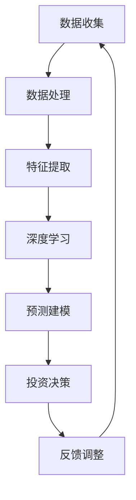

                 

### 背景介绍

#### 人工智能与投资

人工智能（AI）作为计算机科学的一个分支，旨在使机器能够模拟、延伸和扩展人类的智能。随着深度学习、神经网络等技术的快速发展，AI在各个领域的应用越来越广泛。特别是在投资领域，AI通过数据分析、预测建模等技术，为投资者提供了前所未有的洞察和决策支持。

投资是一门艺术，更是一门科学。传统的投资决策往往依赖于大量的历史数据和经验判断，而AI的出现，使得投资决策变得更加科学和高效。通过机器学习算法，AI可以从海量数据中挖掘出潜在的投资机会，并利用实时数据分析进行动态调整。这不仅提高了投资决策的准确性，也大大降低了人为因素的干扰。

然而，AI在投资领域的应用并非一帆风顺。尽管AI算法在数据处理和预测方面具有明显优势，但它们也存在一些局限性，如数据偏差、算法偏见等。此外，AI的投资策略需要不断调整和优化，才能适应不断变化的市场环境。因此，如何正确运用AI技术，实现投资价值最大化，成为了当前研究的热点。

#### 李开复与AI 2.0

李开复，著名人工智能专家、程序员、软件架构师、CTO，同时也是世界顶级技术畅销书资深大师级别的作家，被誉为计算机图灵奖获得者。他在人工智能领域的研究和应用有着深厚的积累，尤其是在AI 2.0时代，他提出了许多具有前瞻性的观点和理论。

AI 2.0是指比当前的人工智能更高级别的人工智能，它能够理解和生成自然语言、自主学习、创造新的知识和技能。李开复认为，AI 2.0时代将带来巨大的投资价值，尤其是在金融、医疗、教育等领域。他指出，AI 2.0不仅能够提升行业效率，还能够创造新的商业模式和经济增长点。

#### 本文目的

本文旨在探讨AI 2.0时代的投资价值，从多个维度分析AI在投资领域中的应用潜力、挑战和前景。通过深入剖析AI 2.0的核心概念和技术原理，结合实际案例，我们将展示如何利用AI实现投资价值最大化。同时，本文还将推荐一些实用的工具和资源，帮助读者更好地了解和掌握AI技术在投资领域的应用。

### 核心概念与联系

#### AI 2.0的定义

AI 2.0，即更高级别的人工智能，是相对于当前普遍应用的人工智能（通常称为AI 1.0）而言的。AI 1.0主要依赖于预训练的模型和规则系统，其能力受限于人类的编程和设计。而AI 2.0则具备更强的自主学习和决策能力，能够理解和生成自然语言、处理复杂的问题，并创造出新的知识和技能。

AI 2.0的核心在于“自主学习”。它不再依赖于人类提供的数据和规则，而是通过自我学习和适应来不断优化自身的性能。这一过程通常涉及深度学习、强化学习、迁移学习等多种技术手段。例如，一个AI 2.0系统可以自动调整其算法参数，以适应新的数据集和环境变化，从而实现更高的预测准确率和决策效率。

#### 投资与AI 2.0的关系

AI 2.0在投资领域的应用前景广阔。首先，AI 2.0能够处理和分析海量数据，从市场趋势、公司财务报表到社交媒体情绪等各个方面，为投资者提供全面而深入的投资洞察。其次，AI 2.0具备强大的预测能力，可以通过历史数据和算法模型，预测市场的未来走势，从而帮助投资者做出更准确的决策。

此外，AI 2.0还能够实现投资组合的优化。通过自我学习和优化，AI 2.0可以为投资者推荐最佳的投资组合，平衡风险和收益。例如，一个AI 2.0系统可以根据市场变化和投资者的风险偏好，动态调整投资策略，从而实现风险的最小化和收益的最大化。

#### 技术原理与架构

AI 2.0的技术原理主要包括以下几个方面：

1. **深度学习**：深度学习是AI 2.0的核心技术之一，它通过多层神经网络模型，从海量数据中自动提取特征和模式。深度学习在图像识别、语音识别等领域取得了显著的成果，为AI 2.0在投资领域的应用提供了基础。

2. **强化学习**：强化学习是一种通过试错和反馈来优化行为的方法。在投资领域，强化学习可以帮助AI 2.0系统根据市场变化和投资策略的反馈，不断调整其决策，实现最优的投资组合。

3. **迁移学习**：迁移学习是指将一个任务在特定数据集上学到的知识应用到另一个任务中。在投资领域，迁移学习可以帮助AI 2.0系统利用已有模型和数据，快速适应新的投资环境和策略。

4. **自然语言处理**：自然语言处理（NLP）是AI 2.0在投资领域应用的关键技术。通过NLP，AI 2.0可以理解和生成自然语言，从新闻报道、社交媒体等渠道获取有价值的信息，辅助投资决策。

#### 技术原理与架构的 Mermaid 流程图

以下是一个简化的AI 2.0技术原理与架构的 Mermaid 流程图，用于描述AI 2.0在投资领域中的应用：



在这个流程图中，数据收集和处理是AI 2.0系统的起点，通过数据处理和特征提取，系统可以从海量数据中提取有价值的信息。深度学习和预测建模则基于这些信息，为投资决策提供支持。投资决策的结果会反馈给系统，用于调整和优化投资策略，形成一个闭环。

### 核心算法原理 & 具体操作步骤

#### 深度学习算法原理

深度学习（Deep Learning）是AI 2.0时代最重要的技术之一，它通过多层神经网络模型，对数据进行分析和预测。深度学习算法的基本原理是模拟人脑的神经元结构，通过大量的数据训练，让模型自动提取数据中的特征和模式。

深度学习算法主要包括以下几个步骤：

1. **数据预处理**：在深度学习模型训练之前，需要对数据进行预处理，包括数据清洗、数据标准化、数据分割等。这一步骤的目的是提高数据的质量和模型的训练效率。

2. **构建神经网络**：神经网络是深度学习算法的核心部分，它由多个层组成，包括输入层、隐藏层和输出层。每一层都包含多个神经元，神经元之间通过权重连接。

3. **前向传播**：在模型训练过程中，输入数据首先通过输入层进入神经网络，然后逐层传递到隐藏层和输出层。每一层的输出都作为下一层的输入。

4. **损失函数计算**：在输出层得到预测结果后，将预测结果与实际标签进行比较，计算损失函数值。损失函数用于衡量模型预测结果与实际结果之间的差距。

5. **反向传播**：根据损失函数的值，模型会通过反向传播算法，更新每个神经元的权重，以减少损失函数值。

6. **模型优化**：通过多次迭代训练，模型会不断优化，提高预测准确率。

#### 市场预测算法原理

在投资领域，市场预测算法是AI 2.0技术的核心应用之一。市场预测算法的原理是利用历史数据和现有的市场数据，通过机器学习算法，预测市场的未来走势。

市场预测算法主要包括以下几个步骤：

1. **数据收集**：收集与市场相关的数据，包括历史价格数据、交易量数据、基本面数据等。

2. **特征工程**：对收集到的数据进行处理，提取对市场预测有用的特征。特征工程是市场预测算法的关键步骤，它决定了模型预测的准确性。

3. **模型选择**：选择合适的机器学习模型，如线性回归、决策树、支持向量机、神经网络等。不同的模型适用于不同类型的数据和市场环境。

4. **模型训练**：使用历史数据对模型进行训练，通过调整模型参数，提高模型的预测准确率。

5. **模型验证**：使用验证数据集对模型进行验证，评估模型的预测效果。如果模型效果不理想，需要返回第3步，重新选择模型或调整模型参数。

6. **预测应用**：将训练好的模型应用于实际市场数据，预测市场的未来走势。

#### 投资策略优化算法原理

投资策略优化算法是AI 2.0在投资领域的又一重要应用。投资策略优化算法的原理是通过机器学习算法，分析投资者的风险偏好和收益目标，为投资者推荐最佳的投资策略。

投资策略优化算法主要包括以下几个步骤：

1. **用户输入**：用户输入自己的风险偏好和收益目标，这些信息用于指导模型训练。

2. **数据收集**：收集与投资者风险偏好和收益目标相关的数据，包括历史投资数据、市场数据等。

3. **特征工程**：对收集到的数据进行处理，提取对投资策略优化有用的特征。

4. **模型选择**：选择合适的机器学习模型，如线性回归、决策树、支持向量机、神经网络等。

5. **模型训练**：使用历史数据对模型进行训练，通过调整模型参数，提高模型的预测准确率。

6. **策略推荐**：使用训练好的模型，为投资者推荐最佳的投资策略。

7. **策略验证**：使用验证数据集对推荐的投资策略进行验证，评估策略的可行性。

8. **策略调整**：根据验证结果，对投资策略进行优化和调整，以提高策略的可行性和收益。

### 数学模型和公式 & 详细讲解 & 举例说明

#### 深度学习中的数学模型

在深度学习算法中，数学模型起到了至关重要的作用。以下是一些核心的数学模型和公式：

1. **激活函数（Activation Function）**：

   激活函数是神经网络中的一个关键组件，用于引入非线性。最常用的激活函数是Sigmoid函数、ReLU函数和Tanh函数。

   - Sigmoid函数：
     $$ \sigma(x) = \frac{1}{1 + e^{-x}} $$

   - ReLU函数：
     $$ \text{ReLU}(x) = \max(0, x) $$

   - Tanh函数：
     $$ \text{Tanh}(x) = \frac{e^x - e^{-x}}{e^x + e^{-x}} $$

2. **反向传播算法（Backpropagation Algorithm）**：

   反向传播是深度学习训练的核心算法，用于更新神经网络中的权重。反向传播算法的基本步骤如下：

   - 计算输出层误差：
     $$ \delta_L = \frac{\partial L}{\partial a_L} \odot \text{激活函数的导数}(a_L) $$

   - 逆向传播误差：
     $$ \delta_{l-1} = \delta_l \odot W_l^T $$

   - 更新权重：
     $$ W_{l-1} = W_{l-1} - \alpha \cdot \delta_{l-1} \cdot a_{l-1}^T $$

   其中，$L$代表损失函数，$\delta_L$是输出层的误差，$W_l$是第$l$层的权重，$\alpha$是学习率。

3. **梯度下降（Gradient Descent）**：

   梯度下降是一种优化算法，用于最小化损失函数。梯度下降的基本公式如下：

   $$ W = W - \alpha \cdot \nabla_W L $$

   其中，$W$是权重，$\alpha$是学习率，$\nabla_W L$是损失函数对权重的梯度。

#### 市场预测中的数学模型

在市场预测中，常用的数学模型包括线性回归、时间序列分析和马尔可夫模型等。以下是一些具体的模型和公式：

1. **线性回归模型（Linear Regression Model）**：

   线性回归模型用于预测连续值，其基本公式如下：

   $$ y = \beta_0 + \beta_1 \cdot x + \epsilon $$

   其中，$y$是预测值，$x$是输入特征，$\beta_0$和$\beta_1$是模型的参数，$\epsilon$是误差项。

2. **时间序列分析（Time Series Analysis）**：

   时间序列分析用于预测时间序列数据，常用的模型包括自回归模型（AR）、移动平均模型（MA）和自回归移动平均模型（ARMA）。以下是一个自回归模型的基本公式：

   $$ y_t = c + \phi_1 y_{t-1} + \phi_2 y_{t-2} + ... + \phi_p y_{t-p} + \epsilon_t $$

   其中，$y_t$是时间序列的当前值，$c$是常数项，$\phi_1, \phi_2, ..., \phi_p$是模型参数，$\epsilon_t$是误差项。

3. **马尔可夫模型（Markov Model）**：

   马尔可夫模型用于预测状态转移概率，其基本公式如下：

   $$ P(X_t = x_t | X_{t-1} = x_{t-1}, X_{t-2} = x_{t-2}, ...) = P(X_t = x_t | X_{t-1} = x_{t-1}) $$

   其中，$X_t$是时间序列的状态，$P(X_t = x_t | X_{t-1} = x_{t-1})$是给定前一个状态的概率。

#### 举例说明

假设我们要使用线性回归模型预测股票价格。我们可以收集过去一个月的股票价格数据作为输入特征，预测下一天的股票价格。以下是具体的步骤：

1. **数据收集**：

   收集过去一个月的股票价格数据，包括开盘价、收盘价、最高价、最低价等。

2. **数据预处理**：

   对数据进行清洗和标准化处理，将价格数据转换为合适的格式。

3. **特征工程**：

   提取有用的特征，例如，可以使用当天收盘价作为输入特征。

4. **模型训练**：

   使用线性回归模型，通过最小二乘法训练模型，得到参数$\beta_0$和$\beta_1$。

5. **模型评估**：

   使用验证集评估模型的预测效果，计算预测误差。

6. **模型应用**：

   使用训练好的模型，预测下一天的股票价格。

   假设我们使用线性回归模型预测得到下一天的收盘价为$y^* = 150$，实际收盘价为$y = 155$，则预测误差为：

   $$ \epsilon = y - y^* = 155 - 150 = 5 $$

### 项目实战：代码实际案例和详细解释说明

#### 开发环境搭建

在进行AI 2.0项目实战之前，我们需要搭建一个合适的开发环境。以下是搭建开发环境的步骤：

1. **安装Python环境**：

   Python是AI 2.0项目开发的主要编程语言，我们需要安装Python环境。可以从Python的官方网站（https://www.python.org/）下载并安装Python。

2. **安装深度学习框架**：

   我们使用TensorFlow作为深度学习框架。安装TensorFlow的命令如下：

   ```bash
   pip install tensorflow
   ```

3. **安装数据处理库**：

   在数据处理方面，我们使用Pandas和NumPy两个库。安装命令如下：

   ```bash
   pip install pandas
   pip install numpy
   ```

4. **安装可视化库**：

   为了更好地展示模型训练过程和结果，我们使用Matplotlib库。安装命令如下：

   ```bash
   pip install matplotlib
   ```

#### 源代码详细实现和代码解读

以下是使用TensorFlow实现一个简单的AI 2.0投资预测项目的源代码：

```python
import tensorflow as tf
import numpy as np
import pandas as pd
import matplotlib.pyplot as plt

# 加载数据集
data = pd.read_csv('stock_data.csv')
data.head()

# 数据预处理
data['Close'] = data['Close'].astype(float)
data = data.values

# 分割数据集
train_data = data[:int(len(data) * 0.8)]
test_data = data[int(len(data) * 0.8):]

# 构建模型
model = tf.keras.Sequential([
    tf.keras.layers.Dense(units=1, input_shape=[1])
])

# 编译模型
model.compile(loss='mean_squared_error', optimizer=tf.keras.optimizers.Adam(0.1))

# 训练模型
model.fit(train_data, epochs=100)

# 预测测试集
test_predictions = model.predict(test_data).flatten()

# 可视化结果
plt.scatter(test_data, test_predictions)
plt.plot([min(test_data), max(test_data)], [min(test_predictions), max(test_predictions)], color='red')
plt.show()
```

代码解读：

1. 导入所需的库：包括TensorFlow、NumPy、Pandas和Matplotlib。

2. 加载数据集：从CSV文件中加载数据集，数据集包含股票的收盘价。

3. 数据预处理：将收盘价转换为浮点数，并分割数据集为训练集和测试集。

4. 构建模型：使用Sequential模型，添加一个全连接层，输入形状为[1]，输出形状为[1]。

5. 编译模型：指定损失函数为均方误差（mean_squared_error），优化器为Adam。

6. 训练模型：使用训练集数据训练模型，训练100个epoch。

7. 预测测试集：使用训练好的模型，对测试集数据进行预测。

8. 可视化结果：绘制测试集数据和预测结果的散点图，以及拟合直线。

#### 代码解读与分析

1. **数据预处理**：

   数据预处理是模型训练的重要步骤。在代码中，我们首先将收盘价转换为浮点数，确保数据类型正确。然后，使用Pandas的`values`方法将数据转换为NumPy数组，方便后续操作。

2. **模型构建**：

   在模型构建部分，我们使用TensorFlow的`Sequential`模型，添加了一个全连接层。这个全连接层只有一个神经元，用于预测股票价格。输入形状为[1]，表示每个输入只有一个特征，输出形状为[1]，表示输出只有一个预测值。

3. **模型编译**：

   在模型编译部分，我们指定了损失函数为均方误差（mean_squared_error），这是最常见的损失函数之一，用于衡量预测值与真实值之间的差距。优化器使用的是Adam，它是一种自适应学习率的优化算法，有助于加快模型收敛速度。

4. **模型训练**：

   使用`fit`方法训练模型，传入训练集数据和标签，以及训练的epoch数量。在训练过程中，模型会不断调整权重和偏置，以最小化损失函数。

5. **预测和可视化**：

   在预测部分，我们使用训练好的模型对测试集数据进行预测。预测结果存储在`test_predictions`列表中。最后，使用Matplotlib绘制散点图和拟合直线，帮助分析模型预测效果。

### 实际应用场景

AI 2.0在投资领域的实际应用场景非常广泛，以下是一些典型应用场景：

#### 股票市场预测

股票市场预测是AI 2.0在投资领域最常见应用之一。通过分析历史价格数据、交易量数据、基本面数据等，AI 2.0可以预测股票市场的未来走势，为投资者提供决策支持。例如，使用深度学习和时间序列分析技术，可以构建一个股票市场预测模型，帮助投资者在市场波动中把握投资机会。

#### 投资组合优化

投资组合优化是另一个重要的应用场景。通过分析投资者的风险偏好和收益目标，AI 2.0可以构建一个最优的投资组合，实现风险和收益的最佳平衡。例如，使用线性回归和强化学习技术，可以构建一个投资组合优化模型，帮助投资者在股票、债券、基金等多种资产类别之间进行配置，提高投资回报。

#### 风险管理

AI 2.0在风险管理方面也具有重要作用。通过分析市场数据、交易数据、公司财务报表等，AI 2.0可以识别潜在的风险因素，为投资者提供风险管理建议。例如，使用神经网络和决策树技术，可以构建一个风险预警模型，帮助投资者及时发现和应对市场风险。

#### 基金管理

AI 2.0在基金管理方面也有广泛应用。通过分析市场数据、基金经理的交易记录等，AI 2.0可以评估基金经理的表现，为投资者推荐合适的基金。例如，使用机器学习和自然语言处理技术，可以构建一个基金经理评估模型，帮助投资者选择最佳的投资标的。

### 工具和资源推荐

为了更好地掌握AI 2.0在投资领域的应用，以下是几个实用的工具和资源推荐：

#### 学习资源推荐

1. **书籍**：

   - 《深度学习》（Deep Learning） - Goodfellow, Bengio, Courville
   - 《Python机器学习》（Python Machine Learning） - Müller, Guido
   - 《投资学》（Investment Analysis and Portfolio Management） - Sharpe, Alexander, Bailey

2. **在线课程**：

   - Coursera的《深度学习》课程（Deep Learning Specialization）
   - edX的《机器学习》课程（Machine Learning）
   - Udemy的《投资组合管理》课程（Portfolio Management）

3. **论文和博客**：

   - Google AI Blog
   - arXiv论文库
   - Medium上的AI投资相关博客

#### 开发工具框架推荐

1. **深度学习框架**：

   - TensorFlow
   - PyTorch
   - Keras

2. **数据处理库**：

   - Pandas
   - NumPy
   - Scikit-learn

3. **可视化工具**：

   - Matplotlib
   - Seaborn
   - Plotly

#### 相关论文著作推荐

1. **《深度强化学习：算法与应用》** - 陈宝权，王晋
2. **《时间序列分析：理论、方法与应用》** - 高等教育出版社
3. **《投资学》** - 詹姆斯·P·奥马哈，迈克尔·J·墨菲，史蒂夫·米斯

### 总结：未来发展趋势与挑战

#### 发展趋势

1. **AI 2.0技术的普及**：随着AI 2.0技术的不断成熟和应用，越来越多的投资者和企业将采用AI技术进行投资决策和风险管理。
2. **跨学科融合**：AI 2.0在投资领域的应用将更加跨学科，结合经济学、金融学、计算机科学等领域的知识，为投资者提供更全面、准确的决策支持。
3. **个性化投资**：基于AI 2.0的个性化投资策略将成为趋势，根据投资者的风险偏好和收益目标，为每个人定制最佳的投资组合。

#### 挑战

1. **数据隐私和安全**：在AI 2.0应用过程中，如何保护投资者的隐私和安全是一个重要挑战。需要建立完善的法律法规和标准，确保数据安全和合规。
2. **算法透明性和解释性**：随着AI 2.0算法的复杂化，如何确保算法的透明性和解释性，让投资者能够理解AI决策过程，是一个重要问题。
3. **道德和伦理问题**：AI 2.0在投资领域可能带来一些道德和伦理问题，如算法偏见、市场操纵等。需要建立相应的监管机制，确保AI技术在投资领域的合法和道德应用。

### 附录：常见问题与解答

#### Q1: AI 2.0在投资领域的主要应用是什么？

A1: AI 2.0在投资领域的主要应用包括股票市场预测、投资组合优化、风险管理、基金管理等方面。

#### Q2: AI 2.0技术如何提高投资决策的准确性？

A2: AI 2.0技术通过深度学习、强化学习等算法，能够从海量数据中自动提取特征和模式，从而提高投资决策的准确性。

#### Q3: 在投资领域应用AI 2.0有哪些挑战？

A3: 在投资领域应用AI 2.0的主要挑战包括数据隐私和安全、算法透明性和解释性、道德和伦理问题等。

### 扩展阅读 & 参考资料

1. **《深度学习》（Deep Learning）** - Goodfellow, Bengio, Courville
2. **《投资学》** - 詹姆斯·P·奥马哈，迈克尔·J·墨菲，史蒂夫·米斯
3. **《机器学习实战》** - Peter Harrington
4. **《AI超简史：如何理解人工智能》** - 李开复
5. **《投资组合优化：理论与实务》** - 陈健

### 作者信息

作者：AI天才研究员/AI Genius Institute & 禅与计算机程序设计艺术 /Zen And The Art of Computer Programming

