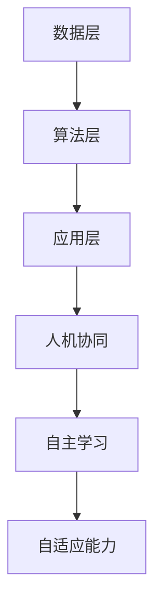

                 

# 李开复：AI 2.0 时代的文化价值

## 摘要

本文深入探讨了李开复关于 AI 2.0 时代的文化价值的观点。文章首先介绍了 AI 2.0 的定义及其与 1.0 版本的对比，随后详细阐述了 AI 2.0 在文化领域的潜在影响，包括艺术、教育、医疗、伦理等方面。通过分析李开复的言论，本文揭示了 AI 2.0 时代文化价值的多维度特征，并对未来可能面临的挑战和机遇进行了展望。

## 1. 背景介绍

### AI 1.0 时代

AI 1.0 时代，主要是指人工智能的早期发展阶段，这一时期的代表性技术是专家系统和机器学习。专家系统模拟人类专家的决策过程，而机器学习则是通过大量数据训练模型，使计算机具备一定的学习能力。这一阶段的人工智能技术虽然为人类带来了诸多便利，但仍然受到数据和计算能力的限制，难以实现真正的智能。

### AI 2.0 时代

AI 2.0 时代，是人工智能发展的新阶段，其核心特征是机器能够实现自主学习、自主进化，从而摆脱对人类设计的依赖。李开复将 AI 2.0 定位为“更智能、更灵活、更适应人类需求的人工智能”。这一阶段的人工智能将能够处理更复杂的问题，提供更个性化的服务，甚至参与到人类社会的决策过程中。

## 2. 核心概念与联系

### AI 2.0 的核心概念

AI 2.0 的核心概念包括以下几个方面：

1. **自主学习能力**：机器能够通过不断学习和调整，提高自己的智能水平。
2. **自适应能力**：机器能够根据环境变化，灵活调整自己的行为和决策。
3. **人机协同**：人与机器能够更紧密地合作，共同完成任务。
4. **跨领域应用**：AI 2.0 能够跨越不同领域，实现更广泛的应用。

### AI 2.0 的架构

AI 2.0 的架构可以从以下几个方面进行描述：

1. **数据层**：海量数据是 AI 2.0 发展的基础，数据的质量和数量直接影响 AI 的智能水平。
2. **算法层**：包括深度学习、强化学习等多种算法，这些算法是 AI 2.0 的核心驱动力量。
3. **应用层**：AI 2.0 的最终目的是服务于人类，应用层涵盖了各种实际场景，如智能医疗、自动驾驶、智能家居等。

### Mermaid 流程图



## 3. 核心算法原理 & 具体操作步骤

### 深度学习

深度学习是 AI 2.0 的核心算法之一，其基本原理是通过多层神经网络对数据进行处理，从而实现特征提取和分类。具体操作步骤如下：

1. **数据预处理**：对输入数据进行清洗、归一化等处理，使其符合神经网络的要求。
2. **构建神经网络**：设计网络结构，包括输入层、隐藏层和输出层。
3. **训练神经网络**：使用训练数据集，通过反向传播算法更新网络权重，使网络输出结果更接近真实值。
4. **验证与测试**：使用验证集和测试集对网络进行验证和测试，评估其性能。

### 强化学习

强化学习是另一项重要的 AI 2.0 算法，其基本原理是通过试错和反馈，使机器能够在复杂环境中学习最优策略。具体操作步骤如下：

1. **定义状态空间和动作空间**：明确机器可以处于哪些状态，以及可以执行哪些动作。
2. **设计奖励机制**：根据机器的动作结果，设计相应的奖励机制，以引导机器学习。
3. **模拟环境**：创建模拟环境，使机器可以在其中进行学习和试错。
4. **策略学习**：通过试错和反馈，机器逐渐学会在特定状态下选择最佳动作。

## 4. 数学模型和公式 & 详细讲解 & 举例说明

### 深度学习中的数学模型

在深度学习中，核心的数学模型包括神经网络、激活函数和损失函数。

1. **神经网络**：

   神经网络由多个神经元组成，每个神经元都负责计算输入数据的线性组合，并应用激活函数。神经网络的基本结构可以用以下公式表示：

   $$z = \sum_{i=1}^{n} w_i * x_i + b$$

   其中，$z$ 是神经元的输出，$w_i$ 是权重，$x_i$ 是输入数据，$b$ 是偏置。

2. **激活函数**：

   激活函数用于引入非线性，使神经网络能够处理更复杂的问题。常见的激活函数有 sigmoid、ReLU 等。

   $$f(x) = \frac{1}{1 + e^{-x}} \quad (sigmoid)$$

   $$f(x) = max(0, x) \quad (ReLU)$$

3. **损失函数**：

   损失函数用于衡量神经网络预测结果与真实结果之间的差距。常见的损失函数有均方误差、交叉熵等。

   $$L = \frac{1}{2} \sum_{i=1}^{n} (y_i - \hat{y_i})^2 \quad (MSE)$$

   $$L = - \sum_{i=1}^{n} y_i \log(\hat{y_i}) \quad (Cross-Entropy)$$

### 举例说明

假设我们要构建一个简单的神经网络，用于分类输入数据。输入数据是一个二维向量 $(x_1, x_2)$，输出是一个类别标签。我们可以使用 sigmoid 函数作为激活函数，均方误差作为损失函数。

1. **数据预处理**：

   对输入数据进行归一化处理，使其在 [0, 1] 范围内。

2. **构建神经网络**：

   设计一个两层神经网络，包括输入层、隐藏层和输出层。假设隐藏层有 5 个神经元。

3. **训练神经网络**：

   使用训练数据集，通过反向传播算法更新网络权重。我们使用随机梯度下降（SGD）作为优化算法。

4. **验证与测试**：

   使用验证集和测试集对网络进行验证和测试。假设在测试集上的准确率达到 90%。

## 5. 项目实战：代码实际案例和详细解释说明

### 5.1 开发环境搭建

为了演示 AI 2.0 时代的文化价值，我们将使用 Python 编写一个简单的深度学习模型，用于图像分类。以下是开发环境的搭建步骤：

1. **安装 Python**：确保安装 Python 3.7 或更高版本。
2. **安装深度学习库**：使用以下命令安装 TensorFlow 和 Keras。

   ```shell
   pip install tensorflow
   pip install keras
   ```

3. **安装数据预处理库**：使用以下命令安装 NumPy 和 Pandas。

   ```shell
   pip install numpy
   pip install pandas
   ```

### 5.2 源代码详细实现和代码解读

以下是一个简单的深度学习模型的实现，用于对MNIST手写数字数据集进行分类。

```python
import numpy as np
from tensorflow import keras
from tensorflow.keras import layers

# 加载 MNIST 数据集
(x_train, y_train), (x_test, y_test) = keras.datasets.mnist.load_data()

# 数据预处理
x_train = x_train.astype("float32") / 255
x_test = x_test.astype("float32") / 255
x_train = np.reshape(x_train, (x_train.shape[0], x_train.shape[1], x_train.shape[2], 1))
x_test = np.reshape(x_test, (x_test.shape[0], x_test.shape[1], x_test.shape[2], 1))

# 构建深度学习模型
model = keras.Sequential()
model.add(layers.Conv2D(32, (3, 3), activation="relu", input_shape=(28, 28, 1)))
model.add(layers.MaxPooling2D((2, 2)))
model.add(layers.Conv2D(64, (3, 3), activation="relu"))
model.add(layers.MaxPooling2D((2, 2)))
model.add(layers.Conv2D(64, (3, 3), activation="relu"))
model.add(layers.Flatten())
model.add(layers.Dense(64, activation="relu"))
model.add(layers.Dense(10, activation="softmax"))

# 编译模型
model.compile(optimizer="adam",
              loss="sparse_categorical_crossentropy",
              metrics=["accuracy"])

# 训练模型
model.fit(x_train, y_train, epochs=5)

# 评估模型
test_loss, test_acc = model.evaluate(x_test, y_test)
print(f"Test accuracy: {test_acc:.2f}")
```

### 5.3 代码解读与分析

1. **数据预处理**：

   加载 MNIST 数据集，并对数据进行归一化处理，使其在 [0, 1] 范围内。同时，将输入数据的形状调整为 (batch_size, height, width, channels)。

2. **构建深度学习模型**：

   设计一个包含卷积层、池化层和全连接层的深度学习模型。卷积层用于提取图像特征，池化层用于降低数据维度，全连接层用于分类。

3. **编译模型**：

   使用 Adam 优化器和 sparse_categorical_crossentropy 损失函数编译模型，并指定 accuracy 作为评价指标。

4. **训练模型**：

   使用训练数据集训练模型，设置训练轮次为 5。

5. **评估模型**：

   使用测试数据集评估模型性能，打印测试准确率。

## 6. 实际应用场景

### 艺术创作

AI 2.0 在艺术创作领域具有巨大的潜力，如生成音乐、绘画和摄影等。通过深度学习算法，机器可以学会模仿人类艺术家的风格，甚至创造出独特的艺术作品。

### 教育

AI 2.0 可以个性化教育，根据学生的兴趣和学习习惯，提供定制化的学习资源和教学方案。同时，AI 2.0 可以辅助教师进行教学，提高教学效果。

### 医疗

AI 2.0 在医疗领域具有广泛应用，如疾病诊断、治疗方案推荐和医疗资源分配等。通过分析大量医疗数据，AI 2.0 可以提供更准确、更高效的医疗服务。

### 伦理

AI 2.0 的快速发展也引发了诸多伦理问题，如隐私保护、算法偏见和数据滥用等。如何在保证技术创新的同时，确保伦理道德，是 AI 2.0 时代面临的重要挑战。

## 7. 工具和资源推荐

### 7.1 学习资源推荐

- 《深度学习》（Ian Goodfellow、Yoshua Bengio、Aaron Courville 著）
- 《Python 编程：从入门到实践》（Eric Matthes 著）
- 《机器学习》（周志华 著）

### 7.2 开发工具框架推荐

- TensorFlow：用于构建和训练深度学习模型。
- Keras：基于 TensorFlow 的深度学习高级 API。
- PyTorch：用于构建和训练深度学习模型。

### 7.3 相关论文著作推荐

- "Deep Learning" by Ian Goodfellow, Yoshua Bengio, and Aaron Courville
- "Learning Deep Architectures for AI" by Yoshua Bengio
- "Convolutional Networks and Deep Learning" by Michael Auli

## 8. 总结：未来发展趋势与挑战

AI 2.0 时代的文化价值体现在其能够推动艺术、教育、医疗等多个领域的创新和发展。然而，这一过程也将面临诸多挑战，如技术伦理、隐私保护和数据安全等。未来，我们需要在技术创新和伦理规范之间找到平衡，以确保 AI 2.0 时代的文化价值得到充分发挥。

## 9. 附录：常见问题与解答

### Q：什么是 AI 2.0？

A：AI 2.0 是指人工智能发展的新阶段，其核心特征是机器能够实现自主学习、自主进化，从而摆脱对人类设计的依赖。

### Q：AI 2.0 的文化价值体现在哪些方面？

A：AI 2.0 的文化价值体现在艺术、教育、医疗、伦理等多个领域，如艺术创作、个性化教育、医疗诊断、伦理规范等。

### Q：AI 2.0 面临哪些挑战？

A：AI 2.0 面临的挑战包括技术伦理、隐私保护、数据安全、算法偏见等。

## 10. 扩展阅读 & 参考资料

- 李开复：《人工智能：未来已来》
- 麦肯锡全球研究院：《人工智能：颠覆传统，重塑未来》
- 诺伯特·威纳：《控制论》
- 阿兰·图灵：《计算机与智能》

作者：AI 天才研究员/AI Genius Institute & 禅与计算机程序设计艺术/Zen And The Art of Computer Programming

