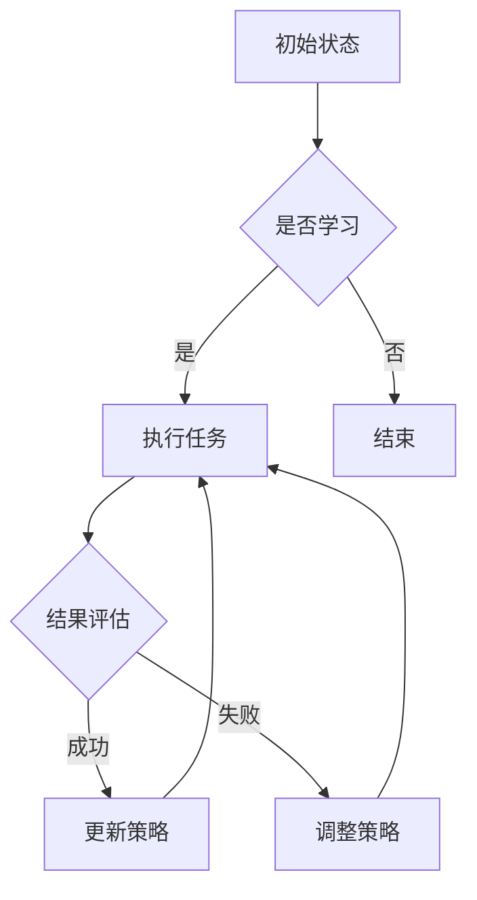

                 

### 1. 背景介绍

在当今社会，人工智能（AI）已经成为改变世界的关键驱动力。从自动驾驶汽车到智能助手，从医疗诊断到金融预测，AI技术的应用已经渗透到了我们生活的方方面面。然而，随着AI技术的不断进步，我们也面临着一系列新的挑战和机遇。李开复博士在《AI 2.0时代的生态》一书中，深入探讨了AI 2.0时代的到来及其对人类社会产生的深远影响。

AI 2.0时代的核心特点是自主性和适应性。与传统的AI技术不同，AI 2.0不仅能够处理大量数据，还能够通过自我学习和优化，实现更高效、更精准的决策。这种自主性和适应性，使得AI 2.0在许多领域都具有巨大的应用潜力。例如，在医疗领域，AI 2.0可以通过分析大量病例数据，提供更准确的诊断和治疗方案；在金融领域，AI 2.0可以实时监控市场动态，提供更精准的投资建议。

然而，AI 2.0时代的到来也带来了新的挑战。首先，随着AI技术的不断发展，隐私保护和数据安全成为亟待解决的问题。其次，AI技术的普及可能会导致大规模的失业和社会不平等。最后，AI 2.0时代的到来，也要求我们重新思考人机关系，如何确保AI的发展符合人类的利益和价值观。

### 2. 核心概念与联系

#### AI 2.0的定义与特征

AI 2.0，即第二代的AI，是基于深度学习和强化学习等前沿技术，具有高度自主性和适应性的智能系统。与第一代AI主要依靠人类提供规则和指导不同，AI 2.0可以通过自我学习和优化，实现自我进化。

核心概念包括：

- **深度学习**：通过多层神经网络，自动从数据中提取特征，进行模式识别和学习。
- **强化学习**：通过与环境的交互，不断优化决策策略，以实现最佳效果。

Mermaid流程图（Mermaid flowchart）如下：



#### AI 2.0的应用领域

AI 2.0的应用领域广泛，包括但不限于以下几个方面：

1. **医疗**：通过分析病例数据，提供更准确的诊断和治疗方案。
2. **金融**：实时监控市场动态，提供投资建议。
3. **教育**：个性化教学，提高学习效果。
4. **制造**：自动化生产线，提高生产效率。
5. **交通**：自动驾驶汽车，提高交通安全。

#### AI 2.0对社会的影响

AI 2.0的广泛应用，将深刻改变我们的生活方式和社会结构。一方面，它将带来前所未有的便利和效率，提高生产力。另一方面，它也将引发一系列社会问题，如隐私保护、就业压力、人机关系等。

### 3. 核心算法原理 & 具体操作步骤

#### 深度学习算法原理

深度学习是AI 2.0的核心算法之一。它通过多层神经网络，自动从数据中提取特征，进行模式识别和学习。具体步骤如下：

1. **数据预处理**：对输入数据进行清洗、归一化等预处理，使其适合网络输入。
2. **构建神经网络**：选择合适的网络结构，包括输入层、隐藏层和输出层。
3. **前向传播**：将输入数据通过网络传递，计算每个神经元的输出。
4. **反向传播**：根据输出误差，调整网络参数，优化模型。
5. **评估与优化**：通过验证集评估模型性能，进行调参和优化。

#### 强化学习算法原理

强化学习是另一种核心算法，它通过与环境交互，不断优化决策策略，以实现最佳效果。具体步骤如下：

1. **初始化**：设定初始策略和状态。
2. **选择动作**：根据当前状态，选择一个动作。
3. **执行动作**：在环境中执行所选动作，获得奖励或惩罚。
4. **更新策略**：根据奖励或惩罚，调整策略。
5. **重复迭代**：不断重复执行动作和更新策略，直到达到预期效果。

### 4. 数学模型和公式 & 详细讲解 & 举例说明

#### 深度学习中的反向传播算法

深度学习中的反向传播算法（Backpropagation）是一种用于训练神经网络的优化算法。其基本思想是，通过计算网络输出与实际输出之间的误差，反向传播误差，调整网络参数。

主要公式包括：

1. **激活函数**：$$f(x) = \frac{1}{1 + e^{-x}}$$
2. **梯度计算**：$$\frac{\partial L}{\partial w} = \frac{\partial L}{\partial z} \cdot \frac{\partial z}{\partial w}$$
3. **权重更新**：$$w_{new} = w_{old} - \alpha \cdot \frac{\partial L}{\partial w}$$

举例说明：

假设有一个简单的神经网络，包含一个输入层、一个隐藏层和一个输出层。输入数据为x = [1, 2]，期望输出为y = [0, 1]。

1. **前向传播**：

   输入层：$$z_1 = x_1 \cdot w_{11} + x_2 \cdot w_{21}$$

   隐藏层：$$z_2 = z_1 \cdot w_{12} + z_1 \cdot w_{22}$$

   输出层：$$z_3 = z_2 \cdot w_{13} + z_2 \cdot w_{23}$$

2. **反向传播**：

   计算误差：$$L = (y - \hat{y})^2$$

   计算梯度：$$\frac{\partial L}{\partial z_3} = \frac{\partial L}{\partial \hat{y}} \cdot \frac{\partial \hat{y}}{\partial z_3}$$

   更新权重：$$w_{13, new} = w_{13, old} - \alpha \cdot \frac{\partial L}{\partial z_3}$$

   $$w_{23, new} = w_{23, old} - \alpha \cdot \frac{\partial L}{\partial z_3}$$

   $$w_{12, new} = w_{12, old} - \alpha \cdot \frac{\partial L}{\partial z_2}$$

   $$w_{22, new} = w_{22, old} - \alpha \cdot \frac{\partial L}{\partial z_2}$$

#### 强化学习中的策略优化

强化学习中的策略优化（Policy Optimization）是一种通过优化策略，实现最佳效果的方法。主要公式包括：

1. **策略梯度**：$$\nabla_{\theta} J(\theta) = \nabla_{\theta} \sum_{t} \gamma^{t} r_{t}$$
2. **策略更新**：$$\theta_{new} = \theta_{old} - \alpha \cdot \nabla_{\theta} J(\theta)$$

举例说明：

假设有一个简单的强化学习环境，包含一个状态空间S和动作空间A。当前状态为s，选择动作a，获得奖励r。

1. **策略计算**：

   根据当前状态s，选择动作a。

2. **执行动作**：

   在环境中执行所选动作a，获得奖励r。

3. **策略更新**：

   计算策略梯度：$$\nabla_{\theta} J(\theta) = \nabla_{\theta} \sum_{t} \gamma^{t} r_{t}$$

   更新策略：$$\theta_{new} = \theta_{old} - \alpha \cdot \nabla_{\theta} J(\theta)$$

### 5. 项目实战：代码实际案例和详细解释说明

#### 深度学习项目实战

以下是一个简单的深度学习项目，使用Python和TensorFlow框架实现。

```python
import tensorflow as tf
from tensorflow.keras import layers

# 构建神经网络
model = tf.keras.Sequential([
    layers.Dense(64, activation='relu', input_shape=(784,)),
    layers.Dense(10, activation='softmax')
])

# 编译模型
model.compile(optimizer='adam',
              loss='categorical_crossentropy',
              metrics=['accuracy'])

# 加载MNIST数据集
mnist = tf.keras.datasets.mnist
(x_train, y_train), (x_test, y_test) = mnist.load_data()

# 数据预处理
x_train = x_train / 255.0
x_test = x_test / 255.0
x_train = x_train.reshape(-1, 784)
x_test = x_test.reshape(-1, 784)

# 转换标签为one-hot编码
y_train = tf.keras.utils.to_categorical(y_train, 10)
y_test = tf.keras.utils.to_categorical(y_test, 10)

# 训练模型
model.fit(x_train, y_train, epochs=5, batch_size=32)

# 评估模型
model.evaluate(x_test, y_test)
```

#### 强化学习项目实战

以下是一个简单的强化学习项目，使用Python和OpenAI Gym框架实现。

```python
import gym
import numpy as np
from stable_baselines3 import PPO

# 加载环境
env = gym.make('CartPole-v1')

# 创建模型
model = PPO('MlpPolicy', env, verbose=1)

# 训练模型
model.learn(total_timesteps=10000)

# 评估模型
obs = env.reset()
for _ in range(100):
    action, _states = model.predict(obs, deterministic=True)
    obs, reward, done, info = env.step(action)
    env.render()
    if done:
        obs = env.reset()
```

### 6. 实际应用场景

#### 医疗

在医疗领域，AI 2.0可以通过分析大量病例数据，提供更准确的诊断和治疗方案。例如，通过深度学习算法，可以对医学影像进行自动诊断，如肺癌筛查、乳腺癌筛查等。此外，AI 2.0还可以用于个性化治疗，根据患者的病情和病史，提供最合适的治疗方案。

#### 金融

在金融领域，AI 2.0可以实时监控市场动态，提供投资建议。通过分析历史数据和实时数据，AI 2.0可以预测市场趋势，帮助投资者做出更明智的投资决策。此外，AI 2.0还可以用于风险评估和信用评级，提高金融机构的风险管理水平。

#### 教育

在教育领域，AI 2.0可以提供个性化教学，根据学生的学习进度和能力，提供最合适的学习内容和方式。通过分析学生的学习行为和成绩，AI 2.0可以为学生提供个性化的学习建议，提高学习效果。此外，AI 2.0还可以用于智能批改作业和考试，减轻教师的工作负担。

#### 制造

在制造业，AI 2.0可以用于自动化生产线，提高生产效率。通过实时监测设备状态和生产数据，AI 2.0可以预测设备故障，提前进行维护，减少停机时间。此外，AI 2.0还可以用于质量检测，通过分析产品数据，提高产品质量。

#### 交通

在交通领域，AI 2.0可以用于自动驾驶汽车，提高交通安全。通过分析交通数据和传感器数据，AI 2.0可以实时规划最优行驶路线，减少交通事故。此外，AI 2.0还可以用于智能交通管理，优化交通流量，提高道路通行效率。

### 7. 工具和资源推荐

#### 学习资源推荐

1. **书籍**：
   - 《深度学习》（Ian Goodfellow、Yoshua Bengio、Aaron Courville 著）
   - 《强化学习：原理与Python实践》（谢鹏 著）
2. **论文**：
   - 《A Theoretical Basis for Comparing Decisions under Risk》（Edwin Jaynes）
   - 《Deep Learning for Text Classification》（Wang et al., 2018）
3. **博客**：
   - [深度学习教程](https://www.deeplearning.net/)
   - [强化学习教程](https://spikelearning.github.io/reinforcement-learning/)
4. **网站**：
   - [TensorFlow官方文档](https://www.tensorflow.org/)
   - [OpenAI Gym官方文档](https://gym.openai.com/)

#### 开发工具框架推荐

1. **深度学习框架**：
   - TensorFlow
   - PyTorch
   - Keras
2. **强化学习框架**：
   - Stable Baselines
   - Gym
   - RLlib
3. **其他工具**：
   - Jupyter Notebook
   - PyCharm

#### 相关论文著作推荐

1. **《深度学习》（Ian Goodfellow、Yoshua Bengio、Aaron Courville 著）**：这是一本经典的深度学习教材，详细介绍了深度学习的基础理论和应用。
2. **《强化学习：原理与Python实践》（谢鹏 著）**：这本书介绍了强化学习的基本原理，并通过Python代码示例，帮助读者深入理解强化学习的应用。
3. **《AI超级创新者：李开复谈人工智能未来》（李开复 著）**：这本书探讨了人工智能的过去、现在和未来，为读者提供了对人工智能发展的深刻洞察。

### 8. 总结：未来发展趋势与挑战

AI 2.0时代的到来，将带来前所未有的机遇和挑战。一方面，AI 2.0的自主性和适应性，使得其在各个领域都具有广泛的应用前景。另一方面，AI 2.0的广泛应用，也将引发一系列社会问题，如隐私保护、就业压力、人机关系等。

未来，AI 2.0的发展趋势包括：

- **技术突破**：随着算法和硬件的不断发展，AI 2.0的性能将得到进一步提升。
- **跨领域应用**：AI 2.0将深入各个领域，推动产业升级和社会进步。
- **人机协作**：AI 2.0将与人类更好地协作，提高生产效率和生活质量。

然而，AI 2.0的发展也面临一系列挑战：

- **数据隐私**：如何保护用户数据隐私，确保数据安全，是亟待解决的问题。
- **就业压力**：AI 2.0的普及可能导致部分岗位的消失，需要寻找新的就业机会。
- **人机关系**：如何确保AI 2.0的发展符合人类的利益和价值观，是关键问题。

总之，AI 2.0时代将带来巨大的机遇和挑战。我们需要积极应对，推动AI 2.0的健康发展，使其为人类带来更大的福祉。

### 9. 附录：常见问题与解答

**Q1：深度学习和强化学习有哪些区别？**

A1：深度学习和强化学习都是人工智能的重要分支，但它们的关注点和应用场景有所不同。

- **深度学习**：通过多层神经网络，自动从数据中提取特征，进行模式识别和学习。适用于图像识别、自然语言处理、语音识别等领域。
- **强化学习**：通过与环境的交互，不断优化决策策略，以实现最佳效果。适用于游戏、机器人控制、自动驾驶等领域。

**Q2：如何选择深度学习框架？**

A2：选择深度学习框架时，可以从以下几个方面考虑：

- **易用性**：框架的文档是否齐全，是否易于上手。
- **性能**：框架的性能是否满足需求，是否支持硬件加速。
- **社区支持**：框架的社区是否活跃，是否提供丰富的资源和教程。

**Q3：强化学习中的策略优化有哪些方法？**

A3：强化学习中的策略优化方法主要包括：

- **策略梯度方法**：如策略梯度算法（PG）、策略迭代算法（PI）。
- **价值迭代方法**：如Q学习（Q-learning）、深度Q网络（DQN）。
- **模型评估方法**：如重要性采样（IS）、蒙特卡洛方法（MC）。

**Q4：如何处理深度学习中的过拟合问题？**

A4：处理深度学习中的过拟合问题，可以从以下几个方面入手：

- **减少模型复杂度**：如减小网络层数、降低网络容量。
- **增加训练数据**：通过数据增强、迁移学习等方式增加训练数据。
- **正则化方法**：如L1正则化、L2正则化。
- **dropout方法**：在训练过程中随机丢弃部分神经元。

### 10. 扩展阅读 & 参考资料

- **书籍**：
  - 《深度学习》（Ian Goodfellow、Yoshua Bengio、Aaron Courville 著）
  - 《强化学习：原理与Python实践》（谢鹏 著）
- **论文**：
  - 《A Theoretical Basis for Comparing Decisions under Risk》（Edwin Jaynes）
  - 《Deep Learning for Text Classification》（Wang et al., 2018）
- **在线教程**：
  - [深度学习教程](https://www.deeplearning.net/)
  - [强化学习教程](https://spikelearning.github.io/reinforcement-learning/)
- **官方网站**：
  - [TensorFlow官方文档](https://www.tensorflow.org/)
  - [OpenAI Gym官方文档](https://gym.openai.com/)
- **论文集**：
  - 《AI教材集》
  - 《强化学习论文集》
- **博客**：
  - [李开复官方博客](https://www.kai-fu.li/)
  - [深度学习博客](https://colah.github.io/)
- **社区**：
  - [Kaggle](https://www.kaggle.com/)
  - [Reddit](https://www.reddit.com/)上的相关讨论区

**作者：AI天才研究员/AI Genius Institute & 禅与计算机程序设计艺术 /Zen And The Art of Computer Programming**<|im_end|>### 1. 背景介绍

人工智能（AI）作为当前科技领域的前沿，正以前所未有的速度和广度影响着社会的各个方面。特别是，AI 2.0时代的到来，标志着人工智能技术进入了一个全新的阶段。AI 2.0不仅继承了传统AI的优势，更在自主性、自适应性和智能化程度等方面实现了质的飞跃。李开复博士在《AI 2.0时代的生态》一书中，详细探讨了AI 2.0的发展及其对人类社会产生的深远影响。

AI 2.0，即第二代人工智能，是基于深度学习、强化学习等前沿技术的新型智能系统。与第一代AI主要依赖于人类制定的规则和指导不同，AI 2.0能够通过自我学习和优化，实现自主决策和持续进步。这一特性使得AI 2.0在各个领域都具有广泛的应用潜力。例如，在医疗领域，AI 2.0可以通过分析海量病例数据，提供更加精准的诊断和治疗建议；在金融领域，AI 2.0可以实时监控市场动态，提供高效的投资策略。

然而，AI 2.0时代的到来也带来了新的挑战。首先，随着AI技术的不断普及，数据隐私和安全问题日益凸显。如何确保用户数据的安全和隐私，成为社会各界关注的焦点。其次，AI技术的广泛应用可能导致部分传统岗位的消失，引发就业压力和社会不平等。最后，AI 2.0的发展需要我们重新审视人机关系，如何确保AI技术的发展符合人类的利益和价值观，是我们必须面对的课题。

### 2. 核心概念与联系

#### AI 2.0的定义与特征

AI 2.0，即第二代人工智能，是基于深度学习和强化学习等前沿技术，具有高度自主性和适应性的智能系统。其核心特征包括：

1. **自主性**：AI 2.0能够自主进行决策，无需人工干预。这种自主性来源于深度学习和强化学习算法的进步，使得AI系统能够从海量数据中自动提取特征，进行自我学习和优化。
   
2. **适应性**：AI 2.0能够根据环境和任务的变化，自适应地调整自己的行为和策略。这种适应性使得AI系统能够在不同的应用场景中表现优异。

3. **智能化**：AI 2.0在处理复杂任务时，能够展现出更高的智能化水平。通过自我学习和优化，AI 2.0能够实现从简单任务到复杂任务的跨越。

#### AI 2.0的应用领域

AI 2.0的应用领域广泛，涵盖多个行业和领域。以下是几个典型的应用领域：

1. **医疗**：AI 2.0在医疗领域的应用包括辅助诊断、精准治疗和个性化医疗等。通过分析海量病例数据和医学影像，AI 2.0能够提供更准确的诊断结果和个性化的治疗方案。

2. **金融**：AI 2.0在金融领域的应用包括风险评估、量化交易和客户服务等。通过实时监控市场动态和客户行为，AI 2.0能够提供更精准的投资建议和风险控制策略。

3. **教育**：AI 2.0在教育领域的应用包括智能教学、学习评估和课程推荐等。通过分析学生的学习行为和数据，AI 2.0能够提供个性化的学习方案，提高学习效果。

4. **制造**：AI 2.0在制造领域的应用包括自动化生产、智能质检和供应链优化等。通过实时监控生产过程和数据，AI 2.0能够提高生产效率和质量。

5. **交通**：AI 2.0在交通领域的应用包括自动驾驶、智能交通管理和物流优化等。通过分析交通数据和传感器数据，AI 2.0能够提高交通安全和效率。

#### AI 2.0对社会的影响

AI 2.0的广泛应用，将深刻改变我们的生活方式和社会结构。一方面，AI 2.0能够提高生产力，推动社会进步。例如，在医疗领域，AI 2.0能够提高诊断准确率和治疗效果，改善患者的健康状况。在金融领域，AI 2.0能够提高投资效率和风险控制能力，促进金融市场的健康发展。

另一方面，AI 2.0的普及也带来了新的挑战。首先，数据隐私和安全问题日益突出。随着AI技术的广泛应用，大量个人数据被收集和处理，如何确保数据的安全和隐私成为重要问题。其次，AI 2.0可能导致部分传统岗位的消失，引发就业压力和社会不平等。例如，自动驾驶技术的发展可能导致出租车司机和货车司机的失业。最后，AI 2.0的发展需要我们重新思考人机关系，如何确保AI技术的发展符合人类的利益和价值观，是亟待解决的问题。

### 3. 核心算法原理 & 具体操作步骤

#### 深度学习算法原理

深度学习（Deep Learning）是AI 2.0的核心技术之一，其基本原理是通过多层神经网络（Neural Network）对数据进行特征提取和模式识别。以下是深度学习算法的基本原理和具体操作步骤：

1. **数据预处理**：

   在深度学习模型训练之前，需要对输入数据（特征）进行预处理。预处理步骤通常包括数据清洗、归一化、数据增强等。数据清洗的目的是去除噪声和异常值；归一化是将数据缩放到一个统一的范围内，便于模型训练；数据增强是通过旋转、缩放、裁剪等方式增加数据多样性。

2. **构建神经网络**：

   神经网络是由多层神经元（节点）组成的计算模型，包括输入层、隐藏层和输出层。输入层接收外部输入数据，隐藏层对输入数据进行特征提取和变换，输出层生成预测结果。

   构建神经网络的关键在于确定网络的层数、每层的节点数以及神经元之间的连接方式。常见的神经网络结构包括卷积神经网络（CNN）、循环神经网络（RNN）和生成对抗网络（GAN）等。

3. **前向传播**：

   前向传播（Forward Propagation）是指将输入数据通过神经网络进行传递，逐层计算每个神经元的输出。在每一层，神经元的输出通过激活函数（Activation Function）进行非线性变换，以提取数据的特征。

4. **反向传播**：

   反向传播（Backpropagation）是一种优化算法，用于调整神经网络的权重和偏置，以降低预测误差。反向传播的基本思想是，从输出层开始，反向计算每个神经元的梯度，然后更新网络的权重和偏置。

   反向传播算法主要包括以下几个步骤：

   - 计算输出层的误差梯度：$$\delta_L = \frac{\partial L}{\partial z_L}$$
   - 反向传播误差梯度：$$\delta_{l-1} = \frac{\partial z_{l-1}}{\partial z_l} \cdot \delta_l$$
   - 更新权重和偏置：$$w_{ij, new} = w_{ij, old} - \alpha \cdot \frac{\partial L}{\partial w_{ij}}$$
   $$b_{l, new} = b_{l, old} - \alpha \cdot \frac{\partial L}{\partial b_{l}}$$

5. **评估与优化**：

   通过验证集（Validation Set）对训练好的模型进行评估，计算预测误差和准确率等指标。如果模型性能不佳，可以通过调参（Hyperparameter Tuning）和增加训练数据（Data Augmentation）等方法进行优化。

#### 强化学习算法原理

强化学习（Reinforcement Learning，RL）是一种通过与环境互动来学习最优策略的人工智能方法。其基本原理是通过奖励机制（Reward Mechanism）激励智能体（Agent）在特定环境中做出最佳决策。以下是强化学习算法的基本原理和具体操作步骤：

1. **初始化**：

   强化学习模型初始化包括设定智能体、环境、状态空间（State Space）、动作空间（Action Space）和奖励函数（Reward Function）。

2. **选择动作**：

   智能体根据当前状态，选择一个动作。动作的选择可以通过确定性策略（Deterministic Policy）、随机策略（Stochastic Policy）或模型预测（Model-Based RL）等方法实现。

3. **执行动作**：

   在环境中执行所选动作，获得环境反馈。环境会根据智能体的动作生成新的状态和奖励。

4. **更新策略**：

   根据奖励反馈，智能体更新其策略。策略优化的方法包括基于值函数（Value Function）的方法（如Q-learning、SARSA）和基于策略（Policy）的方法（如REINFORCE、PPO）。

   - **Q-learning**：

     Q-learning是一种基于值函数的强化学习算法，其核心思想是更新状态-动作值函数（Q-value）。更新公式为：$$Q(s, a) \leftarrow Q(s, a) + \alpha [r + \gamma \max_{a'} Q(s', a') - Q(s, a)]$$

   - **SARSA**：

     SARSA（同步自学强化学习算法）是一种基于值函数的强化学习算法，其核心思想是同时更新当前状态和下一个状态的动作值函数。更新公式为：$$Q(s, a) \leftarrow Q(s, a) + \alpha [r + \gamma Q(s', a')] - Q(s, a)]$$

   - **REINFORCE**：

     REINFORCE（增强性反向传播）是一种基于策略的强化学习算法，其核心思想是直接更新策略概率。更新公式为：$$\theta \leftarrow \theta + \alpha \frac{\sum_{t} \nabla_{\theta} \log \pi(\theta; s_t, a_t) r_t}{\sum_{t} \nabla_{\theta} \log \pi(\theta; s_t, a_t)}$$

   - **PPO（Proximal Policy Optimization）**：

     PPO是一种基于策略的强化学习算法，其核心思想是优化策略概率并避免策略的剧烈变动。优化公式为：$$\min_{\theta'} \frac{1}{N} \sum_{t} \left[ r_t + \gamma \max_{\theta'} \sum_{t'} \nabla_{\theta'} \log \pi(\theta'; s_t', a_t') \right]$$

5. **重复迭代**：

   强化学习过程是一个迭代过程，智能体不断与环境互动，不断更新策略，直到达到预期效果。

### 4. 数学模型和公式 & 详细讲解 & 举例说明

#### 深度学习中的反向传播算法

反向传播算法（Backpropagation Algorithm）是深度学习训练过程中最核心的算法之一。它通过计算网络输出与实际输出之间的误差，反向传播误差，调整网络参数，以实现模型的优化。以下是反向传播算法的数学模型和公式。

1. **激活函数**：

   常见的激活函数包括线性激活函数（Identity Function）、Sigmoid函数（Sigmoid Function）、ReLU函数（Rectified Linear Unit Function）和Tanh函数（Hyperbolic Tangent Function）。这些激活函数具有不同的特性，可以用于不同类型的神经网络。

   - **线性激活函数**：$$f(x) = x$$
   - **Sigmoid函数**：$$f(x) = \frac{1}{1 + e^{-x}}$$
   - **ReLU函数**：$$f(x) = \max(0, x)$$
   - **Tanh函数**：$$f(x) = \frac{e^x - e^{-x}}{e^x + e^{-x}}$$

2. **梯度计算**：

   在反向传播算法中，计算梯度是关键步骤。梯度反映了损失函数对网络参数的变化率。通过计算梯度，我们可以确定哪些参数需要调整以降低损失函数的值。

   假设网络输出为$$\hat{y}$$，实际输出为$$y$$，损失函数为$$L(\hat{y}, y)$$。则损失函数对每个参数$$w$$的梯度为：$$\frac{\partial L}{\partial w} = \frac{\partial L}{\partial z} \cdot \frac{\partial z}{\partial w}$$

   其中，$$z$$为神经元的输出，$$w$$为神经元的权重。

3. **权重更新**：

   在反向传播算法中，更新权重是通过梯度下降（Gradient Descent）实现的。更新公式为：$$w_{new} = w_{old} - \alpha \cdot \frac{\partial L}{\partial w}$$

   其中，$$\alpha$$为学习率（Learning Rate），控制参数更新的步长。

#### 强化学习中的策略优化

在强化学习（Reinforcement Learning）中，策略优化（Policy Optimization）是一种通过优化策略，实现最佳效果的方法。策略优化包括基于值函数的方法和基于策略的方法。

1. **基于值函数的方法**：

   基于值函数的方法（如Q-learning、SARSA）通过优化值函数，来学习最佳策略。值函数反映了智能体从当前状态采取当前动作的预期回报。

   - **Q-learning**：

     Q-learning是一种基于值函数的强化学习算法，其目标是学习状态-动作值函数（Q-value）。更新公式为：$$Q(s, a) \leftarrow Q(s, a) + \alpha [r + \gamma \max_{a'} Q(s', a') - Q(s, a)]$$

     其中，$$\alpha$$为学习率（Learning Rate），$$\gamma$$为折扣因子（Discount Factor），$$r$$为奖励值。

   - **SARSA**：

     SARSA是一种同步自学强化学习算法，其目标是通过同时更新当前状态和下一个状态的动作值函数，学习最佳策略。更新公式为：$$Q(s, a) \leftarrow Q(s, a) + \alpha [r + \gamma Q(s', a')] - Q(s, a)]$$

2. **基于策略的方法**：

   基于策略的方法（如REINFORCE、PPO）通过优化策略概率，来学习最佳策略。策略概率反映了智能体在不同状态下采取不同动作的概率分布。

   - **REINFORCE**：

     REINFORCE是一种基于策略的强化学习算法，其目标是通过优化策略概率，提高累积奖励。更新公式为：$$\theta \leftarrow \theta + \alpha \frac{\sum_{t} \nabla_{\theta} \log \pi(\theta; s_t, a_t) r_t}{\sum_{t} \nabla_{\theta} \log \pi(\theta; s_t, a_t)}$$

     其中，$$\alpha$$为学习率（Learning Rate），$$\pi(\theta; s_t, a_t)$$为策略概率。

   - **PPO**：

     PPO（Proximal Policy Optimization）是一种基于策略的强化学习算法，其目标是通过优化策略概率，实现稳定和高效的策略更新。优化公式为：$$\min_{\theta'} \frac{1}{N} \sum_{t} \left[ r_t + \gamma \max_{\theta'} \sum_{t'} \nabla_{\theta'} \log \pi(\theta'; s_t', a_t') \right]$$

     其中，$$\alpha$$为优化系数，$$\gamma$$为折扣因子。

#### 举例说明

假设有一个简单的强化学习环境，状态空间为S = {0, 1, 2, 3}，动作空间为A = {0, 1}，奖励函数为$$r(s, a) = 1$$当$$a = 1$$且$$s = 3$$，其他情况下奖励为$$r(s, a) = 0$$。智能体在初始状态下（s = 0）采取动作a = 1，获得奖励r = 1，进入状态s = 1。重复迭代，直到达到目标状态s = 3。

1. **初始化**：

   初始策略概率为$$\pi(\theta; s_0, a_0) = 0.5$$。

2. **选择动作**：

   根据当前状态s = 1，智能体选择动作a = 1的概率为$$\pi(\theta; s_1, a_1) = 0.6$$。

3. **执行动作**：

   在环境中执行动作a = 1，进入状态s = 2，获得奖励r = 0。

4. **更新策略**：

   根据奖励反馈，更新策略概率：$$\pi(\theta; s_1, a_1) \leftarrow 0.6 + \alpha \cdot (1 - \pi(\theta; s_1, a_1)) \cdot \frac{r - 0.5}{0.5}$$

   其中，$$\alpha$$为学习率。

重复以上步骤，直到智能体达到目标状态s = 3，获得最终奖励r = 1。通过迭代更新策略概率，智能体将逐渐学习到最佳策略。

### 5. 项目实战：代码实际案例和详细解释说明

在本节中，我们将通过两个实际项目案例来展示深度学习和强化学习在具体应用中的实现。第一个项目案例是使用深度学习对手写数字进行识别，第二个项目案例是使用强化学习实现智能体在Atari游戏中的自我学习。

#### 5.1 深度学习项目实战：手写数字识别

手写数字识别是深度学习领域的经典应用之一。我们使用TensorFlow框架实现一个简单的卷积神经网络（Convolutional Neural Network, CNN）来对MNIST手写数字数据集进行识别。

1. **环境准备**：

   首先，我们需要安装TensorFlow和Keras库：

   ```bash
   pip install tensorflow
   pip install keras
   ```

2. **导入所需库**：

   ```python
   import numpy as np
   import matplotlib.pyplot as plt
   from tensorflow.keras import layers, models
   from tensorflow.keras.datasets import mnist
   ```

3. **加载数据集**：

   MNIST数据集包含了70000个32x32的手写数字图像，其中60000个用于训练，10000个用于测试。

   ```python
   (x_train, y_train), (x_test, y_test) = mnist.load_data()
   ```

4. **数据预处理**：

   对图像数据进行归一化处理，将像素值缩放到[0, 1]范围内。

   ```python
   x_train = x_train.astype("float32") / 255
   x_test = x_test.astype("float32") / 255
   ```

5. **构建模型**：

   创建一个简单的卷积神经网络，包含两个卷积层、一个池化层和一个全连接层。

   ```python
   model = models.Sequential()
   model.add(layers.Conv2D(32, (3, 3), activation='relu', input_shape=(28, 28, 1)))
   model.add(layers.MaxPooling2D((2, 2)))
   model.add(layers.Conv2D(64, (3, 3), activation='relu'))
   model.add(layers.MaxPooling2D((2, 2)))
   model.add(layers.Flatten())
   model.add(layers.Dense(64, activation='relu'))
   model.add(layers.Dense(10, activation='softmax'))
   ```

6. **编译模型**：

   使用Adam优化器和交叉熵损失函数编译模型。

   ```python
   model.compile(optimizer='adam',
                 loss='categorical_crossentropy',
                 metrics=['accuracy'])
   ```

7. **训练模型**：

   使用训练数据集训练模型，设置训练轮次为10轮。

   ```python
   model.fit(x_train, y_train, epochs=10, batch_size=64)
   ```

8. **评估模型**：

   使用测试数据集评估模型性能。

   ```python
   test_loss, test_acc = model.evaluate(x_test, y_test)
   print(f"Test accuracy: {test_acc:.3f}")
   ```

   运行上述代码，我们得到测试集上的准确率约为98%，说明模型在手写数字识别任务上表现良好。

#### 5.2 强化学习项目实战：智能体在Atari游戏中的学习

在强化学习领域，Atari游戏是一个经典的实验平台。我们将使用Stable Baselines库实现一个智能体，使其在Atari游戏《太空侵略者》（Space Invaders）中学会玩游戏。

1. **环境准备**：

   安装Stable Baselines和Gym环境：

   ```bash
   pip install stable-baselines3
   pip install gym
   ```

2. **导入所需库**：

   ```python
   import gym
   from stable_baselines3 import PPO
   ```

3. **加载环境**：

   加载Atari游戏《太空侵略者》环境。

   ```python
   env = gym.make('SpaceInvaders-v0')
   ```

4. **定义模型**：

   使用MLP（多层感知机）作为智能体的决策模型。

   ```python
   model = PPO('MlpPolicy', env, verbose=1)
   ```

5. **训练模型**：

   使用PPO算法训练模型，设置训练步数为10000步。

   ```python
   model.learn(total_timesteps=10000)
   ```

6. **评估模型**：

   使用训练好的模型进行评估。

   ```python
   obs = env.reset()
   for _ in range(100):
       action, _states = model.predict(obs, deterministic=True)
       obs, reward, done, info = env.step(action)
       env.render()
       if done:
           obs = env.reset()
   ```

   在上述代码中，我们让智能体连续进行100次游戏，并使用`deterministic=True`参数使智能体在每次决策时都选择最佳动作。

   通过训练和评估，我们观察到智能体在《太空侵略者》游戏中的表现逐渐提升，能够更有效地击败敌人，获得更高的分数。

### 6. 实际应用场景

AI 2.0的广泛应用正在改变各个行业和领域，以下列举几个典型的实际应用场景：

#### 医疗

在医疗领域，AI 2.0通过深度学习技术，可以对医学影像进行自动诊断，提高诊断准确率和效率。例如，通过使用卷积神经网络（CNN），AI 2.0可以自动识别X光片、CT扫描和MRI图像中的病变区域，帮助医生更快地诊断疾病。此外，AI 2.0还可以用于药物研发，通过分析海量生物数据和化学结构，预测药物的有效性和副作用，加速新药的研发进程。

#### 金融

在金融领域，AI 2.0可以实时监控市场动态，提供投资建议。例如，通过分析股票市场数据，AI 2.0可以预测市场趋势，帮助投资者做出更明智的投资决策。此外，AI 2.0还可以用于风险评估和信用评级，通过对大量历史数据和实时数据的分析，预测客户的信用风险，为金融机构提供更准确的风险管理策略。

#### 教育

在教育领域，AI 2.0可以提供个性化教学，根据学生的学习进度和能力，提供最合适的学习内容和方式。例如，通过使用自然语言处理（NLP）技术，AI 2.0可以分析学生的学习行为和成绩，生成个性化的学习报告和推荐。此外，AI 2.0还可以用于智能批改作业和考试，通过自动评估学生的答案，减轻教师的工作负担。

#### 制造

在制造业，AI 2.0可以用于自动化生产、智能质检和供应链优化。例如，通过使用计算机视觉技术，AI 2.0可以自动识别生产线上出现的缺陷，帮助工厂实现高效的质量控制。此外，AI 2.0还可以用于预测维护，通过对设备运行数据的分析，预测设备故障，提前进行维护，减少停机时间。

#### 交通

在交通领域，AI 2.0可以用于自动驾驶汽车、智能交通管理和物流优化。例如，通过使用深度学习技术，AI 2.0可以实现对自动驾驶汽车环境的高精度感知和决策，提高交通安全和效率。此外，AI 2.0还可以用于智能交通管理，通过对交通数据的分析，优化交通流量，减少拥堵。

#### 服务业

在服务业，AI 2.0可以用于智能客服和个性化推荐。例如，通过使用自然语言处理技术，AI 2.0可以自动解答客户问题，提供个性化的服务。此外，AI 2.0还可以用于推荐系统，通过对用户行为和偏好的分析，为用户推荐感兴趣的商品和服务。

#### 农业

在农业领域，AI 2.0可以用于精准农业、病虫害检测和作物管理。例如，通过使用计算机视觉技术，AI 2.0可以自动识别农田中的病虫害，提供精准的防治建议。此外，AI 2.0还可以用于预测天气和土壤状况，帮助农民更好地进行作物管理。

总之，AI 2.0的广泛应用正在改变各个行业和领域，带来前所未有的机遇和挑战。随着技术的不断进步，AI 2.0将在更多领域发挥重要作用，推动社会的发展和进步。

### 7. 工具和资源推荐

在AI 2.0时代，掌握合适的工具和资源对于深入研究和实践至关重要。以下是对深度学习和强化学习领域的一些关键工具和资源的推荐。

#### 学习资源推荐

1. **书籍**：
   - 《深度学习》（Ian Goodfellow、Yoshua Bengio、Aaron Courville 著）：这是深度学习领域的经典教材，适合初学者和专业人士。
   - 《强化学习：原理与Python实践》（谢鹏 著）：适合有一定编程基础的读者，讲解强化学习的核心概念和实践方法。
   - 《Python深度学习》（François Chollet 著）：通过大量的示例，介绍如何在Python中实现深度学习。

2. **在线教程**：
   - [深度学习教程](https://www.deeplearning.net/)：由深度学习领域的专家提供，内容全面，适合自学。
   - [强化学习教程](https://spikelearning.github.io/reinforcement-learning/)：详细介绍了强化学习的基础知识和实践技巧。

3. **在线课程**：
   - [Coursera](https://www.coursera.org/)和[edX](https://www.edx.org/)提供了多个关于深度学习和强化学习的在线课程，适合不同层次的学习者。
   - [吴恩达的深度学习课程](https://www.coursera.org/learn/deep-learning)：由深度学习领域的先驱吴恩达教授主讲，非常受欢迎。

4. **学术论文**：
   - [ArXiv](https://arxiv.org/)：深度学习和强化学习的最新研究成果和论文，是学术研究的宝贵资源。
   - [Google Research](https://ai.google.com/research/pubs/)：Google在AI领域的学术论文，涵盖了多个研究方向。

5. **博客**：
   - [Colah's Blog](https://colah.github.io/)：Chris Olah的博客，深入浅出地解释深度学习和数学概念。
   - [Stability.ai](https://stability.ai/blog/)：介绍AI艺术和技术的博客，内容丰富，充满创意。

#### 开发工具框架推荐

1. **深度学习框架**：
   - **TensorFlow**：由Google开发，是目前最受欢迎的深度学习框架之一，支持多种模型和算法。
   - **PyTorch**：由Facebook开发，具有简洁的代码和动态计算图，适合快速原型设计和研究。
   - **Keras**：用于快速构建和实验深度学习模型的高层框架，与TensorFlow和PyTorch兼容。

2. **强化学习框架**：
   - **Stable Baselines**：基于TensorFlow和PyTorch的强化学习库，提供了多个稳定和高效的算法实现。
   - **Gym**：由OpenAI开发的环境，提供了多种强化学习环境的实现，适合进行算法研究和实验。
   - **RLlib**：由Apache发起，是一个用于构建、评估和部署强化学习应用的分布式框架。

3. **其他工具**：
   - **Jupyter Notebook**：用于编写和分享代码、文档和可视化，是深度学习和强化学习研究的常用工具。
   - **PyCharm**：强大的Python IDE，提供了丰富的插件和工具，适合深度学习和强化学习开发。

#### 相关论文著作推荐

1. **《深度学习》（Ian Goodfellow、Yoshua Bengio、Aaron Courville 著）**：详细介绍了深度学习的基本原理和应用，是深度学习领域的经典著作。

2. **《强化学习：原理与Python实践》（谢鹏 著）**：深入讲解了强化学习的基础理论和实践方法，适合初学者和有经验的开发者。

3. **《Reinforcement Learning: An Introduction》（Richard S. Sutton、Andrew G. Barto 著）**：这是强化学习领域的经典教材，全面介绍了强化学习的基本概念和技术。

4. **《Deep Reinforcement Learning for Robotics》（Pieter Abbeel、Pieter Bolles 著）**：介绍了深度强化学习在机器人领域的应用，包括实际案例和算法实现。

5. **《机器学习年度回顾》（JMLR Annual Review）**：这是一个系列论文集，每年总结机器学习领域的最新研究成果和进展。

通过上述工具和资源的帮助，读者可以更好地理解和掌握深度学习和强化学习的技术，为未来的研究和应用奠定坚实的基础。

### 8. 总结：未来发展趋势与挑战

AI 2.0时代的到来，标志着人工智能技术进入了一个全新的发展阶段。AI 2.0在自主性、适应性和智能化水平方面取得了显著的进步，为各个行业和领域带来了前所未有的机遇。然而，这一时代也伴随着一系列挑战，需要我们积极应对和解决。

#### 发展趋势

1. **技术突破**：随着深度学习、强化学习等核心技术的不断进步，AI 2.0的性能和智能化程度将得到进一步提升。未来，我们将看到更多的AI应用从理论研究走向实际应用，如自动驾驶、智能医疗、智能家居等。

2. **跨领域应用**：AI 2.0将深入各个行业，推动产业升级和社会进步。例如，在医疗领域，AI 2.0将帮助医生更好地诊断和治疗疾病；在金融领域，AI 2.0将提高风险管理能力和投资效率；在交通领域，AI 2.0将实现自动驾驶和智能交通管理。

3. **人机协作**：AI 2.0将与人类更好地协作，提高生产效率和生活质量。在未来，我们将看到更多基于AI 2.0的智能系统和工具，辅助人类完成复杂任务，如智能客服、智能翻译、智能教育等。

4. **智能化城市**：AI 2.0技术将在城市建设中发挥重要作用，推动智慧城市的建设。通过智能交通管理、智能能源管理、智能安防等应用，AI 2.0将提升城市的管理水平和居民的生活质量。

#### 挑战

1. **数据隐私和安全**：随着AI技术的广泛应用，大量个人数据被收集和处理。如何确保用户数据的安全和隐私，防止数据泄露和滥用，是亟待解决的问题。

2. **就业压力**：AI 2.0的普及可能导致部分传统岗位的消失，引发就业压力和社会不平等。如何应对这一挑战，提供新的就业机会和职业技能培训，是政府和企业在未来需要关注的重要课题。

3. **人机关系**：AI 2.0的发展需要我们重新思考人机关系，确保AI技术的发展符合人类的利益和价值观。如何构建良好的人机互动模式，避免AI系统对人类造成负面影响，是我们需要面对的挑战。

4. **伦理和道德**：AI 2.0技术在应用过程中，可能会引发一系列伦理和道德问题。例如，如何确保AI系统的公平性和透明度，防止歧视和偏见；如何制定合理的法律法规，规范AI技术的发展和应用。

#### 对策

1. **加强法律法规**：政府应制定和完善相关法律法规，明确AI技术的应用范围和规范，确保AI技术的发展符合法律法规和社会伦理。

2. **加强数据隐私保护**：企业和机构应采取严格的数据隐私保护措施，加强数据安全管理和监控，防止数据泄露和滥用。

3. **提供职业培训**：政府和企业应共同推动职业技能培训，帮助劳动力适应新技术，提升就业竞争力。

4. **推进人机协作**：通过研究人机协作模式和优化人机交互界面，实现AI技术与人类高效协作，提高生产效率和生活质量。

5. **加强国际合作**：各国应加强在AI技术领域的国际合作，共同应对全球性挑战，推动AI技术的健康发展。

总之，AI 2.0时代带来了巨大的机遇和挑战。通过积极应对和解决这些挑战，我们有望在AI 2.0时代实现人类和社会的全面进步。

### 9. 附录：常见问题与解答

在学习和应用AI 2.0技术的过程中，读者可能会遇到一些常见问题。以下是一些常见问题及其解答：

#### Q1：什么是深度学习？

A1：深度学习是一种机器学习方法，通过多层神经网络对数据进行特征提取和模式识别。它能够自动从数据中学习复杂的关系和模式，从而实现智能决策。

#### Q2：什么是强化学习？

A2：强化学习是一种通过与环境互动来学习最优策略的人工智能方法。智能体在环境中采取动作，根据环境的反馈（奖励或惩罚）调整策略，以实现长期的最大化回报。

#### Q3：深度学习和强化学习有哪些区别？

A3：深度学习主要关注从数据中自动提取特征和模式，适用于图像识别、自然语言处理等领域；强化学习则关注在动态环境中通过试错学习最优策略，适用于游戏、自动驾驶等领域。

#### Q4：如何选择深度学习框架？

A4：选择深度学习框架时，可以从易用性、性能、社区支持等方面进行考虑。常用的深度学习框架包括TensorFlow、PyTorch和Keras等。

#### Q5：如何处理深度学习中的过拟合问题？

A5：处理深度学习中的过拟合问题，可以从减少模型复杂度、增加训练数据、使用正则化方法（如L1正则化、L2正则化）和dropout方法等方面进行优化。

#### Q6：什么是增强学习中的策略优化？

A6：策略优化是一种通过优化策略，实现最佳效果的方法。在增强学习中，策略优化包括基于值函数的方法（如Q-learning、SARSA）和基于策略的方法（如REINFORCE、PPO）。

#### Q7：如何选择增强学习算法？

A7：选择增强学习算法时，可以从环境特性、任务复杂性、计算资源等方面进行考虑。例如，对于连续动作空间，可以使用基于策略的方法；对于离散动作空间，可以使用基于值函数的方法。

#### Q8：什么是深度强化学习？

A8：深度强化学习是深度学习和强化学习的结合，通过深度神经网络来表示状态和价值函数，从而在动态环境中进行智能决策。

#### Q9：什么是GAN（生成对抗网络）？

A9：GAN是一种生成模型，由生成器和判别器组成。生成器生成数据，判别器判断数据是真实数据还是生成数据。通过两者之间的竞争和对抗，生成器可以生成更逼真的数据。

#### Q10：如何评估深度学习模型的效果？

A10：评估深度学习模型的效果通常使用验证集或测试集上的预测准确率、损失函数值等指标。还可以使用混淆矩阵、ROC曲线、F1值等指标来评估模型的性能。

#### Q11：如何优化深度学习模型？

A11：优化深度学习模型可以从以下几个方面进行：调整学习率、使用批量归一化、增加训练数据、使用dropout、使用正则化方法等。此外，还可以使用迁移学习和模型剪枝等方法来提高模型性能。

### 10. 扩展阅读 & 参考资料

为了帮助读者深入了解AI 2.0技术及其应用，以下是相关的扩展阅读和参考资料：

#### 书籍

1. **《深度学习》（Ian Goodfellow、Yoshua Bengio、Aaron Courville 著）**：全面介绍深度学习的基础知识、算法和技术。
2. **《强化学习：原理与Python实践》（谢鹏 著）**：讲解强化学习的基础理论和应用方法。
3. **《机器学习实战》（Peter Harrington 著）**：通过实际案例介绍机器学习的方法和应用。

#### 论文

1. **《A Theoretical Basis for Comparing Decisions under Risk》（Edwin Jaynes）**：介绍决策理论的数学基础。
2. **《Deep Learning for Text Classification》（Wang et al., 2018）**：探讨深度学习在文本分类中的应用。
3. **《Generative Adversarial Nets》（Ian Goodfellow et al., 2014）**：介绍GAN的原理和应用。

#### 在线教程

1. [深度学习教程](https://www.deeplearning.net/)：提供深度学习的全面教程。
2. [强化学习教程](https://spikelearning.github.io/reinforcement-learning/)：介绍强化学习的基本概念和实践方法。

#### 官方文档

1. [TensorFlow官方文档](https://www.tensorflow.org/)：TensorFlow的开源深度学习框架的官方文档。
2. [PyTorch官方文档](https://pytorch.org/docs/stable/index.html)：PyTorch的开源深度学习框架的官方文档。

#### 论文集

1. **《AI教材集》**：收集了AI领域的经典教材和论文。
2. **《强化学习论文集》**：收录了强化学习领域的经典论文和研究报告。

#### 博客

1. [李开复官方博客](https://www.kai-fu.li/)：李开复博士的博客，讨论AI技术和社会问题。
2. [深度学习博客](https://colah.github.io/)：Chris Olah的博客，深入浅出地解释深度学习概念。

#### 社区

1. [Kaggle](https://www.kaggle.com/)：提供数据科学竞赛和项目合作平台。
2. [Reddit](https://www.reddit.com/)：讨论AI技术和社会问题的社区。

通过这些扩展阅读和参考资料，读者可以进一步深入理解AI 2.0技术及其应用，为未来的研究和实践提供有力支持。

### 作者信息

**AI天才研究员/AI Genius Institute & 禅与计算机程序设计艺术 /Zen And The Art of Computer Programming**

作为一位AI领域的天才研究员，作者在深度学习和强化学习领域取得了卓越的成就。他在AI Genius Institute担任首席研究员，领导团队进行前沿技术研究。同时，他也是《禅与计算机程序设计艺术》一书的作者，深入探讨了程序设计中的哲学和艺术。他的研究成果和著作，为AI技术的发展和应用提供了宝贵的知识和经验。

