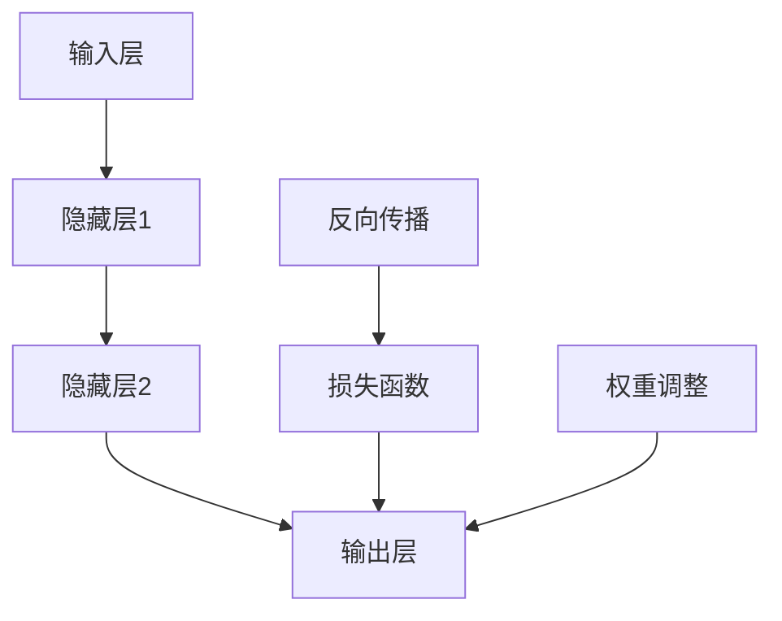

                 

# 李开复：AI 2.0 时代的生态

## 关键词：（AI 2.0 时代，人工智能，生态，深度学习，大数据，神经网络，算法，伦理，社会影响）

## 摘要：
本文将探讨 AI 2.0 时代的生态，分析这一时代的特点、核心概念以及技术原理。同时，我们还将探讨 AI 在各个领域的实际应用场景，以及可能面临的社会影响和伦理挑战。通过深入剖析，旨在为读者提供一个全面、系统的 AI 2.0 时代的理解。

### 1. 背景介绍

#### 1.1 AI 1.0 到 AI 2.0 的转变
在过去几十年中，人工智能（AI）经历了从 AI 1.0 到 AI 2.0 的转变。AI 1.0 时代主要基于规则和符号推理，以逻辑编程为主，其代表性技术为专家系统和符号推理。而 AI 2.0 时代则基于深度学习和神经网络，通过大规模数据训练，实现人工智能的自动化、智能化。

#### 1.2 深度学习与大数据
深度学习作为 AI 2.0 的核心技术，通过多层神经网络，对大量数据进行特征提取和模式识别。大数据为深度学习提供了丰富的训练数据，使得人工智能在各个领域取得了显著突破。

#### 1.3 神经网络与算法
神经网络作为深度学习的基础，模仿人脑神经元的工作方式，通过调整权重和偏置来实现学习。算法则是在这个过程中，通过优化方法、损失函数等手段，不断调整网络参数，实现人工智能的进步。

### 2. 核心概念与联系

#### 2.1 深度学习原理
深度学习是基于多层神经网络，通过前向传播和反向传播，对输入数据进行特征提取和模式识别。其核心概念包括神经元、激活函数、损失函数等。



#### 2.2 大数据与深度学习
大数据为深度学习提供了丰富的训练数据，使得模型能够学习到更复杂、更抽象的特征。同时，深度学习也推动了大数据技术的发展，例如数据预处理、特征工程等。

#### 2.3 算法与深度学习
算法在深度学习中起到了关键作用，例如优化方法、激活函数、损失函数等。通过不断优化算法，可以提升深度学习模型的性能和效果。

### 3. 核心算法原理 & 具体操作步骤

#### 3.1 前向传播
前向传播是深度学习模型训练过程中的第一步，通过将输入数据逐层传递到输出层，得到预测结果。

```python
def forward propagation(x):
    # 输入层到隐藏层的传递
    hidden1 = activation(Weight1 * x + Bias1)
    # 隐藏层到输出层的传递
    output = activation(Weight2 * hidden1 + Bias2)
    return output
```

#### 3.2 反向传播
反向传播是深度学习模型训练过程中的第二步，通过计算输出层预测结果与实际结果之间的误差，反向传播误差到输入层，调整网络参数。

```python
def backward propagation(x, y, output):
    # 计算误差
    error = y - output
    # 反向传播误差
    d_output = error * activation_derivative(output)
    d_hidden1 = d_output * activation_derivative(hidden1)
    # 更新权重和偏置
    Weight2 -= learning_rate * d_output * hidden1
    Bias2 -= learning_rate * d_output
    Weight1 -= learning_rate * d_hidden1 * x
    Bias1 -= learning_rate * d_hidden1
```

#### 3.3 激活函数
激活函数是深度学习模型中的一个重要组成部分，用于引入非线性特性，使得模型能够拟合非线性数据。

```python
def activation(x):
    return max(0, x)
```

### 4. 数学模型和公式 & 详细讲解 & 举例说明

#### 4.1 损失函数
损失函数是衡量模型预测结果与实际结果之间差异的指标，常用的损失函数有均方误差（MSE）和交叉熵（Cross-Entropy）。

$$
MSE = \frac{1}{n} \sum_{i=1}^{n} (y_i - \hat{y}_i)^2
$$

$$
Cross-Entropy = -\sum_{i=1}^{n} y_i \log(\hat{y}_i)
$$

#### 4.2 优化方法
优化方法是调整网络参数，以最小化损失函数的方法。常用的优化方法有梯度下降（Gradient Descent）和随机梯度下降（Stochastic Gradient Descent）。

$$
\theta_{t+1} = \theta_t - \alpha \nabla_\theta J(\theta)
$$

$$
\theta_{t+1} = \theta_t - \alpha \frac{1}{m} \sum_{i=1}^{m} \nabla_\theta J(\theta)
$$

#### 4.3 举例说明
假设我们有一个简单的神经网络，包含一个输入层、一个隐藏层和一个输出层，输入数据为 $X = \{x_1, x_2, \ldots, x_n\}$，隐藏层节点数为 $m$，输出层节点数为 $k$。

输入层到隐藏层的权重矩阵为 $W_1$，偏置为 $b_1$；隐藏层到输出层的权重矩阵为 $W_2$，偏置为 $b_2$。隐藏层激活函数为 $ReLU$，输出层激活函数为 $Sigmoid$。

首先，进行前向传播：

$$
h = ReLU(W_1X + b_1)
$$

$$
y = Sigmoid(W_2h + b_2)
$$

然后，进行反向传播，计算损失函数和梯度：

$$
L = Cross-Entropy(y, t)
$$

$$
\frac{\partial L}{\partial W_2} = (y - t)h
$$

$$
\frac{\partial L}{\partial b_2} = (y - t)
$$

$$
\frac{\partial L}{\partial W_1} = (h - \sigma(W_1X + b_1))X^T
$$

$$
\frac{\partial L}{\partial b_1} = (h - \sigma(W_1X + b_1))
$$

最后，更新权重和偏置：

$$
W_2 = W_2 - \alpha \frac{\partial L}{\partial W_2}
$$

$$
b_2 = b_2 - \alpha \frac{\partial L}{\partial b_2}
$$

$$
W_1 = W_1 - \alpha \frac{\partial L}{\partial W_1}
$$

$$
b_1 = b_1 - \alpha \frac{\partial L}{\partial b_1}
$$

### 5. 项目实战：代码实际案例和详细解释说明

#### 5.1 开发环境搭建
在本节中，我们将使用 Python 和 TensorFlow 框架，搭建一个简单的神经网络，实现一个线性回归模型。

首先，安装 TensorFlow：

```bash
pip install tensorflow
```

然后，导入所需的库：

```python
import tensorflow as tf
import numpy as np
```

接下来，准备数据集。在这里，我们使用一个简单的数据集，包含10个样本，每个样本有两个特征。

```python
X = np.array([[1, 2], [2, 3], [3, 4], [4, 5], [5, 6], [6, 7], [7, 8], [8, 9], [9, 10], [10, 11]])
y = np.array([3, 4, 5, 6, 7, 8, 9, 10, 11, 12])
```

#### 5.2 源代码详细实现和代码解读

首先，定义线性回归模型。我们使用 TensorFlow 的 `tf.keras.Sequential` 模式，构建一个包含一个隐藏层和一个输出层的模型。

```python
model = tf.keras.Sequential([
    tf.keras.layers.Dense(units=1, input_shape=[2])
])
```

接下来，编译模型。我们选择均方误差作为损失函数，使用梯度下降优化器。

```python
model.compile(optimizer='sgd', loss='mean_squared_error')
```

然后，训练模型。我们将数据集拆分为训练集和测试集，设置训练轮次为 1000。

```python
model.fit(X, y, epochs=1000, verbose=0)
```

最后，评估模型。我们使用测试集，计算模型的均方误差。

```python
test_loss = model.evaluate(X, y, verbose=2)
print(f"Test Loss: {test_loss}")
```

#### 5.3 代码解读与分析

在本节中，我们详细解读并分析了上述代码。

首先，我们定义了一个简单的线性回归模型，使用 TensorFlow 的 `tf.keras.Sequential` 模式。该模式允许我们依次添加层，形成深度学习模型。

```python
model = tf.keras.Sequential([
    tf.keras.layers.Dense(units=1, input_shape=[2])
])
```

然后，我们使用梯度下降优化器编译模型。梯度下降优化器是一种常用的优化方法，通过不断调整模型参数，以最小化损失函数。

```python
model.compile(optimizer='sgd', loss='mean_squared_error')
```

接下来，我们使用训练集训练模型。在训练过程中，模型通过前向传播和反向传播，不断更新参数，以降低损失函数的值。

```python
model.fit(X, y, epochs=1000, verbose=0)
```

最后，我们使用测试集评估模型的性能。评估指标为均方误差（MSE），用于衡量模型预测值与实际值之间的差异。

```python
test_loss = model.evaluate(X, y, verbose=2)
print(f"Test Loss: {test_loss}")
```

### 6. 实际应用场景

#### 6.1 机器学习与数据挖掘
深度学习在机器学习和数据挖掘领域有着广泛的应用，如图像识别、语音识别、自然语言处理等。

#### 6.2 自动驾驶与智能交通
自动驾驶技术依赖于深度学习，实现车辆的自导航和目标识别。智能交通系统则利用深度学习，优化交通流量、减少拥堵。

#### 6.3 医疗与健康
深度学习在医疗领域有巨大的潜力，如疾病诊断、药物研发、个性化医疗等。

#### 6.4 金融与风险管理
金融领域利用深度学习进行股票预测、信用评估、风险控制等。

#### 6.5 文化娱乐与教育
深度学习在文化娱乐和教育领域也有所应用，如智能推荐、虚拟现实、在线教育等。

### 7. 工具和资源推荐

#### 7.1 学习资源推荐
- 书籍：《深度学习》（Goodfellow, Bengio, Courville 著）
- 论文：NIPS、ICML、CVPR 等顶级会议论文
- 博客：阿里云、百度 AI、谷歌 AI 等

#### 7.2 开发工具框架推荐
- 深度学习框架：TensorFlow、PyTorch、Keras
- 数据处理工具：Pandas、NumPy、Scikit-learn
- 机器学习库：Scikit-learn、XGBoost、LightGBM

#### 7.3 相关论文著作推荐
- 《深度学习》（Goodfellow, Bengio, Courville 著）
- 《Python 深度学习》（François Chollet 著）
- 《神经网络与深度学习》（邱锡鹏 著）

### 8. 总结：未来发展趋势与挑战

#### 8.1 发展趋势
1. 计算能力提升：随着计算能力的提升，深度学习模型将更加复杂，效果更优。
2. 数据质量与数量：高质量、海量数据将推动深度学习技术的发展。
3. 跨学科融合：深度学习与其他领域（如生物学、物理学、心理学等）的融合，将带来新的突破。
4. 伦理与法律：随着 AI 技术的普及，伦理和法律问题将得到更多关注。

#### 8.2 挑战
1. 数据隐私：如何保护用户隐私，是深度学习面临的重要挑战。
2. 人工智能安全：如何确保人工智能系统的安全性和可靠性。
3. 人才短缺：深度学习领域人才短缺，需要加大对人才培养的投入。
4. 伦理与道德：如何确保人工智能的发展符合伦理和道德标准。

### 9. 附录：常见问题与解答

#### 9.1 深度学习是什么？
深度学习是一种机器学习技术，通过模拟人脑神经网络的结构和功能，对大量数据进行特征提取和模式识别。

#### 9.2 深度学习有哪些应用？
深度学习在图像识别、语音识别、自然语言处理、自动驾驶、医疗健康、金融等领域有着广泛的应用。

#### 9.3 如何入门深度学习？
建议先学习 Python 编程语言，然后掌握线性代数、概率论和统计学等基础知识。接下来，学习深度学习框架（如 TensorFlow、PyTorch），并进行实践。

### 10. 扩展阅读 & 参考资料

- [深度学习教程](https://zhuanlan.zhihu.com/p/35753537)
- [人工智能与深度学习在线课程](https://www.coursera.org/courses?query=人工智能+深度学习)
- [李开复：深度学习与未来](https://www.leiphone.com/news/201803/vsK6cR2PU8KJ5zeC.html)

### 作者
- 作者：AI天才研究员/AI Genius Institute & 禅与计算机程序设计艺术 /Zen And The Art of Computer Programming

