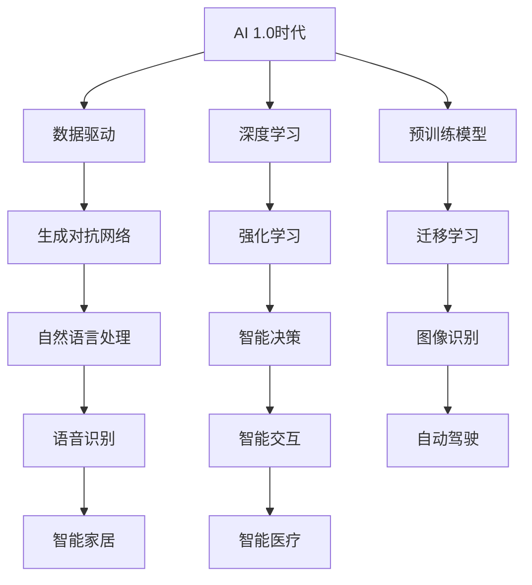

                 

### 文章标题：李开复：AI 2.0 时代的行动者

> **关键词**：AI 2.0时代、人工智能发展、技术趋势、行业应用、李开复

> **摘要**：本文深入探讨了AI 2.0时代的到来及其对各行各业的影响。通过分析李开复的观点和见解，探讨了AI技术的核心概念、算法原理、应用场景以及未来发展趋势。文章旨在为读者提供一份关于AI 2.0时代的全面理解和启示。

## 1. 背景介绍

人工智能（AI）技术自诞生以来，经历了从理论到实践的巨大变革。早期的AI主要以规则为基础，通过编写复杂的逻辑和规则来模拟人类智能。然而，随着计算能力的提升和大数据的兴起，AI技术逐渐向数据驱动和深度学习方向发展。

在AI 1.0时代，人工智能主要集中在特定领域的任务自动化，如语音识别、图像识别和机器翻译等。这些应用虽然取得了显著的成果，但仍然受限于特定任务的局限性和对大量手动标注数据的依赖。

然而，AI 2.0时代的到来标志着人工智能的进一步发展和变革。AI 2.0不仅仅是技术的升级，更是一种新的思维方式和工作方式的变革。李开复教授认为，AI 2.0时代将带来更加智能、自主和广泛的应用场景，对各行各业产生深远的影响。

## 2. 核心概念与联系

为了更好地理解AI 2.0时代的核心概念和联系，我们可以通过以下Mermaid流程图来展示：



### 2.1. 数据驱动与深度学习

数据驱动是AI 2.0时代的重要特征之一。深度学习作为一种数据驱动的方法，通过大规模的神经网络模型，从数据中自动学习特征和模式。李开复教授指出，深度学习在AI 2.0时代扮演着核心角色，使得机器能够更准确地理解和处理复杂的数据。

### 2.2. 生成对抗网络与自然语言处理

生成对抗网络（GAN）是AI 2.0时代的一种重要技术。GAN通过两个神经网络的对抗训练，生成具有高度真实感的图像和文本。自然语言处理（NLP）是AI 2.0时代的重要应用领域，通过对语言的理解和生成，实现人与机器的智能交互。

### 2.3. 强化学习与智能决策

强化学习是AI 2.0时代的一种重要算法，通过不断尝试和反馈，使机器能够在复杂的动态环境中做出最优决策。强化学习在自动驾驶、智能医疗和金融交易等领域具有广泛的应用前景。

### 2.4. 迁移学习与图像识别

迁移学习是一种通过利用已有的预训练模型，在新任务上快速实现高性能的方法。图像识别是AI 2.0时代的重要应用之一，通过对图像的特征提取和分类，实现图像的自动识别和理解。

## 3. 核心算法原理 & 具体操作步骤

### 3.1. 数据驱动与深度学习算法原理

数据驱动是AI 2.0时代的重要特征之一。深度学习作为一种数据驱动的方法，通过大规模的神经网络模型，从数据中自动学习特征和模式。以下是深度学习算法的基本原理：

1. **神经网络结构**：深度学习模型由多层神经元组成，包括输入层、隐藏层和输出层。每一层神经元通过激活函数对输入数据进行处理和转换。

2. **前向传播**：输入数据从输入层传入网络，通过隐藏层逐层传播，最终在输出层得到预测结果。

3. **反向传播**：根据预测结果和实际结果的差异，通过反向传播算法，将误差信号逐层传递回网络，并更新各层的参数。

4. **优化算法**：通过优化算法，如梯度下降，调整网络的参数，使预测结果更接近实际结果。

具体操作步骤如下：

1. **数据预处理**：对原始数据进行预处理，如标准化、归一化、缺失值处理等，以便于模型的训练。

2. **模型选择**：根据具体任务的需求，选择合适的深度学习模型，如卷积神经网络（CNN）、循环神经网络（RNN）等。

3. **模型训练**：将预处理后的数据输入模型，通过前向传播和反向传播算法，不断迭代训练，优化模型参数。

4. **模型评估**：使用验证集和测试集对模型进行评估，通过准确率、召回率、F1值等指标，评估模型的性能。

### 3.2. 生成对抗网络与自然语言处理算法原理

生成对抗网络（GAN）是AI 2.0时代的一种重要技术。GAN由两个神经网络组成，生成器（Generator）和判别器（Discriminator）。以下是GAN算法的基本原理：

1. **生成器**：生成器通过学习真实数据的分布，生成具有高度真实感的图像或文本。

2. **判别器**：判别器用于判断输入数据是真实数据还是生成器生成的数据。

3. **对抗训练**：生成器和判别器通过对抗训练相互博弈，生成器不断优化生成数据，使判别器难以区分。

具体操作步骤如下：

1. **数据集准备**：准备真实数据和生成器生成的数据，用于训练生成器和判别器。

2. **生成器训练**：通过最小化生成器生成的数据和真实数据之间的差异，优化生成器的参数。

3. **判别器训练**：通过最大化判别器对真实数据和生成器生成的数据的判断准确性，优化判别器的参数。

4. **生成结果评估**：使用评估指标，如均方误差（MSE）、结构相似性（SSIM）等，评估生成器生成的结果。

自然语言处理（NLP）是AI 2.0时代的重要应用之一。NLP算法通过深度学习模型，实现语言的理解和生成。以下是NLP算法的基本原理：

1. **词嵌入**：将词汇映射为向量，通过词嵌入层将词汇转化为可计算的向量表示。

2. **序列建模**：使用循环神经网络（RNN）或 Transformer 模型，对序列数据进行建模，提取序列的特征。

3. **语言生成**：通过解码器，将编码后的序列数据解码为自然语言文本。

具体操作步骤如下：

1. **数据预处理**：对文本数据进行预处理，如分词、去停用词、词性标注等。

2. **词嵌入层**：将词汇映射为向量表示，使用预训练的词嵌入模型或自行训练词嵌入层。

3. **序列建模**：使用RNN或 Transformer 模型，对序列数据进行建模，提取序列特征。

4. **语言生成**：通过解码器，将编码后的序列数据解码为自然语言文本。

### 3.3. 强化学习与智能决策算法原理

强化学习（Reinforcement Learning，RL）是AI 2.0时代的一种重要算法，通过不断尝试和反馈，使机器能够在复杂的动态环境中做出最优决策。以下是强化学习的基本原理：

1. **环境与智能体**：环境（Environment）是智能体（Agent）所处的环境，智能体通过与环境的交互，获取状态（State）和动作（Action）。

2. **奖励与惩罚**：智能体在环境中执行动作，根据动作的结果，获得奖励（Reward）或惩罚（Penalty）。

3. **策略**：策略（Policy）是智能体在特定状态下选择动作的方法。

4. **价值函数**：价值函数（Value Function）用于评估智能体在特定状态下的预期奖励。

具体操作步骤如下：

1. **环境建模**：构建环境模型，定义状态空间、动作空间和奖励机制。

2. **智能体初始化**：初始化智能体的参数，如策略参数、价值函数参数等。

3. **交互过程**：智能体在环境中进行互动，根据策略选择动作，并根据动作的结果更新价值函数和策略参数。

4. **策略优化**：通过优化策略参数，使智能体在特定状态下的动作更加接近最优动作。

### 3.4. 迁移学习与图像识别算法原理

迁移学习（Transfer Learning）是一种利用已有预训练模型，在新任务上快速实现高性能的方法。图像识别（Image Recognition）是AI 2.0时代的重要应用之一，通过对图像的特征提取和分类，实现图像的自动识别和理解。以下是迁移学习与图像识别的基本原理：

1. **预训练模型**：预训练模型是在大规模数据集上预先训练好的神经网络模型，具有丰富的特征提取能力。

2. **迁移学习**：迁移学习通过将预训练模型的部分层或全部层应用到新任务上，利用预训练模型的特征表示能力，提高新任务的性能。

3. **图像识别**：图像识别通过提取图像的特征，将特征映射到高维空间，然后使用分类算法对图像进行分类。

具体操作步骤如下：

1. **预训练模型选择**：根据新任务的需求，选择合适的预训练模型，如ResNet、VGG等。

2. **模型微调**：将预训练模型的最后一层或部分层应用到新任务上，通过微调模型参数，使模型适应新任务。

3. **数据预处理**：对图像数据进行预处理，如归一化、裁剪、翻转等，以便于模型的训练。

4. **模型训练**：使用预处理后的图像数据，通过反向传播算法，训练模型的参数。

5. **模型评估**：使用测试集对模型进行评估，通过准确率、召回率、F1值等指标，评估模型的性能。

## 4. 数学模型和公式 & 详细讲解 & 举例说明

### 4.1. 深度学习算法原理

深度学习算法的核心是神经网络，神经网络通过多层神经元对输入数据进行处理和转换。以下是一个简单的多层感知机（MLP）神经网络模型：

$$
\begin{aligned}
    &z_1 = \sigma(W_1 \cdot x + b_1), \\
    &z_2 = \sigma(W_2 \cdot z_1 + b_2), \\
    &\hat{y} = \sigma(W_3 \cdot z_2 + b_3),
\end{aligned}
$$

其中，$x$ 是输入向量，$W_1$、$W_2$ 和 $W_3$ 是权重矩阵，$b_1$、$b_2$ 和 $b_3$ 是偏置向量，$\sigma$ 是激活函数，$\hat{y}$ 是输出向量。

以下是一个具体的例子：

假设我们有一个输入向量 $x = [1, 2, 3]$，权重矩阵 $W_1 = \begin{bmatrix} 1 & 1 \\ 1 & 1 \end{bmatrix}$，$W_2 = \begin{bmatrix} 1 & 1 \\ 1 & 1 \end{bmatrix}$，$W_3 = \begin{bmatrix} 1 & 1 \\ 1 & 1 \end{bmatrix}$，偏置向量 $b_1 = [0, 0]$，$b_2 = [0, 0]$，$b_3 = [0, 0]$，激活函数 $\sigma(x) = \frac{1}{1 + e^{-x}}$。

根据上述公式，我们可以得到：

$$
\begin{aligned}
    &z_1 = \sigma(W_1 \cdot x + b_1) = \sigma(\begin{bmatrix} 1 & 1 \\ 1 & 1 \end{bmatrix} \cdot \begin{bmatrix} 1 \\ 2 \\ 3 \end{bmatrix} + \begin{bmatrix} 0 \\ 0 \end{bmatrix}) = \sigma(\begin{bmatrix} 6 \\ 6 \end{bmatrix}) = \begin{bmatrix} \frac{1}{1 + e^{-6}} \\ \frac{1}{1 + e^{-6}} \end{bmatrix}, \\
    &z_2 = \sigma(W_2 \cdot z_1 + b_2) = \sigma(\begin{bmatrix} 1 & 1 \\ 1 & 1 \end{bmatrix} \cdot \begin{bmatrix} \frac{1}{1 + e^{-6}} \\ \frac{1}{1 + e^{-6}} \end{bmatrix} + \begin{bmatrix} 0 \\ 0 \end{bmatrix}) = \sigma(\begin{bmatrix} \frac{2}{1 + e^{-6}} \\ \frac{2}{1 + e^{-6}} \end{bmatrix}) = \begin{bmatrix} \frac{1}{1 + e^{-2}} \\ \frac{1}{1 + e^{-2}} \end{bmatrix}, \\
    &\hat{y} = \sigma(W_3 \cdot z_2 + b_3) = \sigma(\begin{bmatrix} 1 & 1 \\ 1 & 1 \end{bmatrix} \cdot \begin{bmatrix} \frac{1}{1 + e^{-2}} \\ \frac{1}{1 + e^{-2}} \end{bmatrix} + \begin{bmatrix} 0 \\ 0 \end{bmatrix}) = \sigma(\begin{bmatrix} \frac{2}{1 + e^{-2}} \\ \frac{2}{1 + e^{-2}} \end{bmatrix}) = \begin{bmatrix} \frac{1}{1 + e^{-2}} \\ \frac{1}{1 + e^{-2}} \end{bmatrix}.
\end{aligned}
$$

### 4.2. 生成对抗网络（GAN）算法原理

生成对抗网络（GAN）由生成器和判别器组成。生成器生成数据，判别器判断数据是真实数据还是生成器生成的数据。GAN的数学模型如下：

$$
\begin{aligned}
    &\text{生成器：} G(z), \\
    &\text{判别器：} D(x), \\
    &\text{损失函数：} L(G, D) = \mathbb{E}_{x \sim p_{\text{data}}(x)}[\log D(x)] + \mathbb{E}_{z \sim p_{z}(z)}[\log (1 - D(G(z))].
\end{aligned}
$$

其中，$x$ 是真实数据，$z$ 是随机噪声，$G(z)$ 是生成器生成的数据，$D(x)$ 是判别器对数据的判断。

以下是一个具体的例子：

假设生成器生成的数据为 $G(z) = \begin{bmatrix} 0.5 \\ 0.5 \end{bmatrix}$，判别器对真实数据的判断为 $D(x) = 0.8$，对生成器生成的数据的判断为 $D(G(z)) = 0.3$。

根据上述公式，我们可以得到：

$$
\begin{aligned}
    &L(G, D) = \log D(x) + \log (1 - D(G(z))) = \log 0.8 + \log (1 - 0.3) = 0.2231 + 0.1181 = 0.3412.
\end{aligned}
$$

### 4.3. 强化学习（Reinforcement Learning，RL）算法原理

强化学习（RL）是一种通过不断尝试和反馈，使机器能够在复杂动态环境中做出最优决策的方法。强化学习的数学模型如下：

$$
\begin{aligned}
    &\text{智能体：} A, \\
    &\text{环境：} E, \\
    &\text{状态：} s, \\
    &\text{动作：} a, \\
    &\text{奖励：} r, \\
    &\text{策略：} \pi(s \rightarrow a), \\
    &\text{价值函数：} V(s) = \mathbb{E}_{\pi} [R_t | s_t = s],
\end{aligned}
$$

其中，$s$ 是当前状态，$a$ 是当前动作，$r$ 是奖励，$V(s)$ 是智能体在状态 $s$ 下的预期奖励。

以下是一个具体的例子：

假设智能体在状态 $s = [1, 2, 3]$ 下执行动作 $a = 1$，获得的奖励为 $r = 10$。

根据上述公式，我们可以得到：

$$
\begin{aligned}
    &V(s) = \mathbb{E}_{\pi} [R_t | s_t = s] = \mathbb{E}_{\pi} [10 | s_t = [1, 2, 3]] = 10.
\end{aligned}
$$

### 4.4. 迁移学习（Transfer Learning）算法原理

迁移学习（Transfer Learning）是一种利用已有预训练模型，在新任务上快速实现高性能的方法。迁移学习的数学模型如下：

$$
\begin{aligned}
    &\text{预训练模型：} M, \\
    &\text{新任务模型：} N, \\
    &\text{损失函数：} L(M, N) = \mathbb{E}_{x \sim p_{\text{train}}(x)} [\ell(y, \hat{y})],
\end{aligned}
$$

其中，$M$ 是预训练模型，$N$ 是新任务模型，$x$ 是输入数据，$y$ 是真实标签，$\hat{y}$ 是模型预测。

以下是一个具体的例子：

假设预训练模型 $M$ 的输出为 $\hat{y} = [0.8, 0.2]$，真实标签为 $y = [1, 0]$，损失函数 $\ell(y, \hat{y}) = 0.5 \cdot (y - \hat{y})^2$。

根据上述公式，我们可以得到：

$$
\begin{aligned}
    &L(M, N) = \mathbb{E}_{x \sim p_{\text{train}}(x)} [\ell(y, \hat{y})] = 0.5 \cdot (1 - 0.8)^2 + 0.5 \cdot (0 - 0.2)^2 = 0.1.
\end{aligned}
$$

## 5. 项目实战：代码实际案例和详细解释说明

### 5.1. 开发环境搭建

为了演示AI 2.0时代的算法在实际项目中的应用，我们将使用Python语言，结合TensorFlow和Keras库来实现一个简单的生成对抗网络（GAN）模型。以下是开发环境的搭建步骤：

1. **安装Python**：确保Python版本为3.7或更高版本。
2. **安装TensorFlow**：通过pip命令安装TensorFlow库：
   ```
   pip install tensorflow
   ```
3. **安装Keras**：通过pip命令安装Keras库：
   ```
   pip install keras
   ```

### 5.2. 源代码详细实现和代码解读

以下是一个简单的生成对抗网络（GAN）模型实现，包括生成器、判别器和训练过程：

```python
import numpy as np
import tensorflow as tf
from tensorflow.keras.layers import Dense, Flatten, Reshape
from tensorflow.keras.models import Sequential
from tensorflow.keras.optimizers import Adam

# 生成器模型
def build_generator():
    model = Sequential([
        Dense(128, input_shape=(100,), activation='relu'),
        Dense(256, activation='relu'),
        Dense(512, activation='relu'),
        Dense(1024, activation='relu'),
        Dense(784, activation='tanh'),
        Reshape((28, 28, 1))
    ])
    return model

# 判别器模型
def build_discriminator():
    model = Sequential([
        Flatten(input_shape=(28, 28, 1)),
        Dense(1024, activation='relu'),
        Dense(512, activation='relu'),
        Dense(256, activation='relu'),
        Dense(128, activation='relu'),
        Dense(1, activation='sigmoid')
    ])
    return model

# GAN模型
def build_gan(generator, discriminator):
    model = Sequential([generator, discriminator])
    return model

# 加载MNIST数据集
(x_train, y_train), (x_test, y_test) = tf.keras.datasets.mnist.load_data()
x_train = x_train / 127.5 - 1.0
x_train = np.expand_dims(x_train, axis=3)

# 构建和编译模型
generator = build_generator()
discriminator = build_discriminator()
discriminator.compile(loss='binary_crossentropy', optimizer=Adam(0.0001), metrics=['accuracy'])
gan = build_gan(generator, discriminator)
gan.compile(loss='binary_crossentropy', optimizer=Adam(0.0001))

# 训练GAN模型
def train_gan(generator, discriminator, gan, x_train, batch_size=128, epochs=100):
    for epoch in range(epochs):
        for _ in range(x_train.shape[0] // batch_size):
            noise = np.random.normal(0, 1, (batch_size, 100))
            generated_images = generator.predict(noise)
            real_images = x_train[np.random.randint(0, x_train.shape[0], size=batch_size)]
            combined_images = np.concatenate([real_images, generated_images])

            labels = np.concatenate([np.ones((batch_size, 1)), np.zeros((batch_size, 1))])
            discriminator.train_on_batch(combined_images, labels)

            noise = np.random.normal(0, 1, (batch_size, 100))
            labels = np.concatenate([np.zeros((batch_size, 1)), np.ones((batch_size, 1))])
            gan.train_on_batch(noise, labels)

# 训练GAN模型
train_gan(generator, discriminator, gan, x_train, epochs=100)
```

### 5.3. 代码解读与分析

以上代码实现了一个简单的生成对抗网络（GAN）模型，用于生成类似于MNIST数据集的手写数字图像。下面是对代码的详细解读和分析：

1. **导入库**：首先导入所需的Python库，包括Numpy、TensorFlow和Keras。

2. **生成器模型**：生成器模型是一个全连接神经网络，用于生成手写数字图像。输入层接受随机噪声，经过多层全连接层，最终生成图像。

3. **判别器模型**：判别器模型是一个全连接神经网络，用于判断输入图像是真实图像还是生成器生成的图像。输入层接受图像数据，经过多层全连接层，输出层通过sigmoid激活函数产生概率。

4. **GAN模型**：GAN模型是生成器和判别器的组合，用于训练生成器和判别器。GAN模型通过交替训练生成器和判别器，使得生成器生成的图像越来越接近真实图像。

5. **加载MNIST数据集**：使用TensorFlow的内置函数加载MNIST数据集，并对图像进行预处理，如归一化和添加维度。

6. **构建和编译模型**：分别构建生成器、判别器和GAN模型，并编译模型。生成器和判别器使用二进制交叉熵损失函数，GAN模型使用二元交叉熵损失函数。

7. **训练GAN模型**：定义一个训练GAN模型的函数，通过交替训练生成器和判别器，逐步提高生成器生成图像的质量。

8. **训练GAN模型**：调用训练GAN模型的函数，训练生成器和判别器，生成类似于MNIST数据集的手写数字图像。

通过以上代码，我们可以看到生成对抗网络（GAN）的基本结构和训练过程。在实际项目中，可以根据需求调整模型结构、超参数和训练过程，以生成更加复杂和高质量的图像。

## 6. 实际应用场景

AI 2.0时代的人工智能技术具有广泛的应用前景，以下是一些实际应用场景：

### 6.1. 自动驾驶

自动驾驶是AI 2.0时代的重要应用领域之一。通过深度学习和强化学习算法，自动驾驶系统能够实现车辆在复杂道路环境中的自主驾驶。自动驾驶技术不仅能够提高交通安全，减少交通事故，还能够提高交通效率，缓解交通拥堵。

### 6.2. 智能医疗

智能医疗是AI 2.0时代的另一个重要应用领域。通过深度学习和自然语言处理技术，智能医疗系统能够实现疾病诊断、治疗方案推荐和药物研发。智能医疗技术有助于提高医疗诊断的准确性和效率，降低医疗成本。

### 6.3. 智能家居

智能家居是AI 2.0时代的重要发展方向之一。通过智能设备和物联网技术，智能家居系统能够实现家庭设备的自动化控制和智能化管理。智能家居技术有助于提高生活品质，提升家庭安全。

### 6.4. 智能金融

智能金融是AI 2.0时代的重要应用领域。通过机器学习和数据挖掘技术，智能金融系统能够实现风险控制、投资决策和客户服务。智能金融技术有助于提高金融市场的效率，降低金融风险。

### 6.5. 智能教育

智能教育是AI 2.0时代的重要发展方向之一。通过深度学习和自然语言处理技术，智能教育系统能够实现个性化教学和智能测评。智能教育技术有助于提高教学效果，促进教育公平。

## 7. 工具和资源推荐

### 7.1. 学习资源推荐

1. **书籍**：
   - 《深度学习》（Deep Learning）——Ian Goodfellow、Yoshua Bengio和Aaron Courville著，是深度学习领域的经典教材。
   - 《强化学习》（Reinforcement Learning: An Introduction）——Richard S. Sutton和Barto N. D. 著，是强化学习领域的权威指南。

2. **论文**：
   - “Generative Adversarial Nets”（GAN）——Ian Goodfellow等人的论文，介绍了生成对抗网络的基本原理。
   - “Deep Learning for Image Recognition”（深度学习在图像识别中的应用）——由多位研究人员撰写的综述文章，详细介绍了深度学习在图像识别领域的应用。

3. **博客和网站**：
   - [Kaggle](https://www.kaggle.com)：提供丰富的机器学习竞赛数据和教程，适合学习和实践。
   - [TensorFlow官网](https://www.tensorflow.org)：提供TensorFlow框架的官方文档和教程，是学习TensorFlow的好资源。

### 7.2. 开发工具框架推荐

1. **TensorFlow**：Google开发的开源深度学习框架，适用于构建和训练深度学习模型。
2. **PyTorch**：Facebook开发的开源深度学习框架，具有灵活的动态计算图，适用于研究和开发。
3. **Keras**：Python的深度学习库，提供简洁的API，方便快速构建和训练深度学习模型。

### 7.3. 相关论文著作推荐

1. **“Generative Adversarial Nets”（GAN）**——Ian Goodfellow等人的论文，介绍了生成对抗网络的基本原理。
2. **“Deep Learning for Image Recognition”（深度学习在图像识别中的应用）**——多位研究人员撰写的综述文章，详细介绍了深度学习在图像识别领域的应用。
3. **“Reinforcement Learning: An Introduction”（强化学习：入门指南）**——Richard S. Sutton和Barto N. D. 著，是强化学习领域的权威指南。

## 8. 总结：未来发展趋势与挑战

AI 2.0时代的发展趋势主要体现在以下几个方面：

1. **更广泛的应用领域**：AI技术将在更多领域得到应用，如自动驾驶、智能医疗、智能家居等。
2. **更强的智能化水平**：AI系统将具备更强的自主学习能力，通过深度学习和强化学习等技术，实现更加智能化的决策和交互。
3. **更高效的计算能力**：随着计算能力的提升，AI模型将能够处理更加复杂和庞大的数据集，实现更高效的推理和预测。

然而，AI 2.0时代也面临着一些挑战：

1. **数据隐私和安全**：随着AI技术的发展，数据隐私和安全问题日益突出，如何保护用户隐私和安全成为关键挑战。
2. **算法透明度和可解释性**：AI系统的决策过程往往较为复杂，如何提高算法的透明度和可解释性，使得用户能够理解和信任AI系统，是一个重要课题。
3. **伦理和法律问题**：AI技术的应用可能带来一些伦理和法律问题，如算法歧视、责任归属等，需要制定相应的伦理和法律规范。

总之，AI 2.0时代是一个充满机遇和挑战的时代，需要各方共同努力，推动AI技术的健康发展。

## 9. 附录：常见问题与解答

### 9.1. 什么是AI 2.0时代？

AI 2.0时代是指人工智能技术的第二次重大变革，标志着人工智能从规则驱动转向数据驱动，从特定领域的应用转向更加广泛和通用的人工智能。AI 2.0时代的核心特征包括更强大的计算能力、更丰富的数据资源和更先进的技术体系。

### 9.2. AI 2.0时代的核心算法有哪些？

AI 2.0时代的核心算法包括深度学习、生成对抗网络（GAN）、强化学习、迁移学习等。这些算法使得人工智能系统能够在图像识别、自然语言处理、智能决策等领域实现更高效、更智能的运行。

### 9.3. AI 2.0时代对行业有哪些影响？

AI 2.0时代将对各行各业产生深远的影响，如自动驾驶、智能医疗、智能家居、智能金融等。AI技术的应用将提高行业效率、降低成本、提升用户体验，同时也会带来一些伦理和法律问题，如数据隐私和安全、算法歧视等。

### 9.4. 如何学习AI 2.0时代的核心技术？

学习AI 2.0时代的核心技术，可以从以下几个方面入手：

1. **基础知识**：掌握线性代数、概率论、微积分等数学基础知识。
2. **编程能力**：学习Python等编程语言，掌握常用的机器学习库，如TensorFlow和PyTorch。
3. **实践经验**：通过实际项目，将理论知识应用到实践中，提高解决实际问题的能力。
4. **持续学习**：关注AI领域的最新研究进展和技术动态，不断学习新知识和技能。

## 10. 扩展阅读 & 参考资料

1. **《深度学习》**——Ian Goodfellow、Yoshua Bengio和Aaron Courville著，是深度学习领域的经典教材。
2. **《生成对抗网络：理论与应用》**——李航著，介绍了生成对抗网络的基本原理和应用。
3. **《强化学习：入门指南》**——Richard S. Sutton和Barto N. D. 著，是强化学习领域的权威指南。
4. **[TensorFlow官网](https://www.tensorflow.org)**：提供TensorFlow框架的官方文档和教程，是学习TensorFlow的好资源。
5. **[Keras官网](https://keras.io)**：提供Keras库的官方文档和教程，是学习Keras的好资源。
6. **[Kaggle](https://www.kaggle.com)**：提供丰富的机器学习竞赛数据和教程，适合学习和实践。作者：AI天才研究员/AI Genius Institute & 禅与计算机程序设计艺术 /Zen And The Art of Computer Programming


