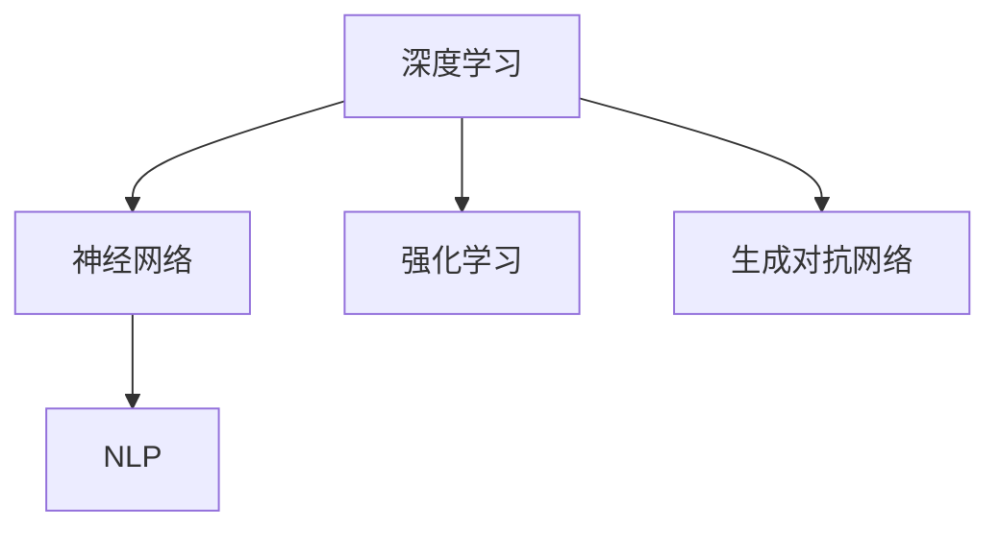

                 

### 背景介绍

#### AI 2.0 时代的到来

近年来，人工智能（AI）领域经历了前所未有的快速发展。从传统的规则驱动方法到现代的数据驱动方法，AI 技术已经渗透到各个行业，从医疗、金融到零售、交通等，都展现出了巨大的潜力。然而，随着技术的进步，我们正逐步迈向 AI 2.0 时代。

AI 2.0 时代意味着人工智能将从被动响应转变为主动思考，从“深度学习”向“通用智能”演进。在这个时代，AI 将具备自我学习和自我改进的能力，能够理解和处理更复杂的问题，甚至能够与人类进行自然对话。

本文将围绕 AI 2.0 时代的趋势进行探讨，重点分析以下几个关键方面：

1. **核心概念与联系**：介绍 AI 2.0 时代的一些核心概念，如深度学习、神经网络、自然语言处理等，并通过 Mermaid 流程图展示它们之间的联系。
2. **核心算法原理与具体操作步骤**：详细解析 AI 2.0 时代的一些关键算法，如强化学习、生成对抗网络等，并阐述其具体操作步骤。
3. **数学模型和公式**：介绍支持 AI 2.0 时代发展的数学模型和公式，并通过举例说明其应用。
4. **项目实战**：通过实际代码案例，展示如何将 AI 2.0 技术应用于具体项目中。
5. **实际应用场景**：探讨 AI 2.0 在各个领域的实际应用，如医疗、金融、教育等。
6. **工具和资源推荐**：推荐一些有助于学习和实践 AI 2.0 技术的工具和资源。
7. **总结：未来发展趋势与挑战**：分析 AI 2.0 时代的发展趋势以及面临的挑战。

通过本文的深入探讨，希望读者能够对 AI 2.0 时代有更全面的认识，并能够把握住这一时代的发展机遇。

#### AI 2.0 时代的核心概念与联系

在 AI 2.0 时代，几个核心概念和技术紧密联系，共同推动着人工智能的发展。以下是对这些核心概念的简要介绍，并通过 Mermaid 流程图展示它们之间的联系。

**深度学习**：深度学习是一种机器学习技术，通过构建多层神经网络，对大量数据进行训练，以实现复杂的模式识别和预测任务。深度学习的核心是“神经网络”，它模拟了人脑的神经元结构，通过逐层传递信息来实现特征提取和分类。

**神经网络**：神经网络是一种由大量相互连接的节点（或称为“神经元”）组成的计算模型。每个神经元接收多个输入信号，通过权重调整和激活函数处理后产生输出。神经网络通过不断调整权重，以优化模型性能。

**自然语言处理（NLP）**：自然语言处理是人工智能的一个分支，旨在使计算机能够理解、生成和处理自然语言。NLP 技术包括词向量表示、句法分析、语义分析等，广泛应用于机器翻译、聊天机器人、语音识别等领域。

**强化学习**：强化学习是一种通过试错和奖励机制来学习的机器学习技术。在强化学习中，智能体（agent）通过与环境的交互，不断调整策略，以最大化累积奖励。强化学习在游戏、机器人控制等领域具有广泛应用。

**生成对抗网络（GAN）**：生成对抗网络是由两部分组成的模型：生成器（generator）和判别器（discriminator）。生成器尝试生成与真实数据相似的数据，而判别器则判断生成数据是否真实。通过两个模型的博弈，生成器不断提高生成数据的质量。

**Mermaid 流程图**：



通过 Mermaid 流程图，我们可以清晰地看到这些核心概念之间的联系。深度学习和神经网络是 AI 2.0 时代的基础，而自然语言处理、强化学习和生成对抗网络则进一步拓展了人工智能的应用范围。这些技术相互融合，共同推动着 AI 2.0 时代的发展。

### 核心算法原理与具体操作步骤

在 AI 2.0 时代，核心算法的原理和操作步骤对于理解和应用人工智能技术至关重要。以下我们将详细介绍几种关键算法：强化学习、生成对抗网络（GAN）、以及它们在实际应用中的具体操作步骤。

#### 强化学习

强化学习是一种通过试错和奖励机制来学习的机器学习技术。其主要目标是找到最优策略，使智能体（agent）在环境中能够最大化累积奖励。

**原理**：

强化学习主要包含四个关键元素：智能体（agent）、环境（environment）、动作（action）和奖励（reward）。智能体通过执行动作来与环境互动，环境会根据智能体的动作给出奖励或惩罚。智能体基于奖励信号调整其策略，以最大化累积奖励。

**具体操作步骤**：

1. **初始化**：设定智能体初始状态、动作空间和奖励函数。
2. **执行动作**：智能体根据当前状态选择一个动作。
3. **环境反馈**：环境根据智能体的动作执行相应的操作，并给出奖励。
4. **策略更新**：智能体根据奖励信号调整其策略，以最大化累积奖励。

**示例**：一个简单的强化学习例子是智能体在迷宫中寻找出路。智能体需要根据当前位置选择一个方向移动，环境会根据智能体的移动给出奖励或惩罚。通过不断调整策略，智能体最终学会找到最优路径。

#### 生成对抗网络（GAN）

生成对抗网络（GAN）是由两部分组成的模型：生成器（generator）和判别器（discriminator）。生成器尝试生成与真实数据相似的数据，而判别器则判断生成数据是否真实。通过两个模型的博弈，生成器不断提高生成数据的质量。

**原理**：

GAN 的基本思想是训练生成器和判别器两个模型，使生成器能够生成尽可能真实的数据，而判别器能够准确判断生成数据与真实数据的区别。训练过程中，生成器和判别器相互竞争，最终达到一种平衡状态。

**具体操作步骤**：

1. **初始化**：设定生成器和判别器初始参数。
2. **生成数据**：生成器根据输入噪声生成假数据。
3. **判断数据**：判别器对生成数据和真实数据进行分类，判断其真实性。
4. **损失函数**：计算生成器和判别器的损失函数，并根据损失函数更新模型参数。
5. **迭代训练**：重复执行步骤 2-4，直至生成器生成的数据接近真实数据。

**示例**：一个简单的 GAN 例子是生成人脸图片。生成器根据随机噪声生成人脸图片，判别器判断生成的人脸图片和真实人脸图片的区分度。通过不断训练，生成器能够生成越来越逼真的人脸图片。

#### GAN 与强化学习的结合

GAN 与强化学习可以结合使用，以实现更复杂的任务。例如，通过 GAN 生成的数据可以用于强化学习任务的训练，以提高智能体的学习效果。

**原理**：

GAN 生成的数据可以作为强化学习任务中的虚拟环境，帮助智能体在虚拟环境中学习策略。这样，智能体不仅可以利用真实环境的数据，还可以利用 GAN 生成的数据进行训练，从而加速学习过程。

**具体操作步骤**：

1. **GAN 训练**：首先训练 GAN 模型，生成虚拟环境数据。
2. **强化学习训练**：利用 GAN 生成的数据和真实环境数据，共同训练强化学习模型。
3. **策略优化**：根据强化学习模型的性能，不断优化智能体的策略。

**示例**：一个简单的例子是在虚拟环境中训练自动驾驶智能体。GAN 生成模拟的交通场景数据，与真实交通场景数据结合，共同训练自动驾驶智能体，以提高其应对复杂交通场景的能力。

通过以上介绍，我们可以看到强化学习、生成对抗网络（GAN）以及它们在实际应用中的具体操作步骤。这些核心算法在 AI 2.0 时代发挥着重要作用，为人工智能的发展提供了强大动力。

### 数学模型和公式

在 AI 2.0 时代，数学模型和公式是理解和应用核心算法的基础。以下将详细介绍几种关键的数学模型和公式，并通过具体例子进行详细讲解。

#### 深度学习中的激活函数

在深度学习中，激活函数是神经网络的灵魂，用于将输入映射到输出。以下是一些常见的激活函数及其公式：

1. **Sigmoid 函数**：

   公式：\[ f(x) = \frac{1}{1 + e^{-x}} \]

   示例：计算输入 \( x = 2 \) 的 Sigmoid 函数值：

   \[ f(2) = \frac{1}{1 + e^{-2}} \approx 0.869 \]

2. **ReLU 函数**：

   公式：\[ f(x) = \max(0, x) \]

   示例：计算输入 \( x = -2 \) 的 ReLU 函数值：

   \[ f(-2) = \max(0, -2) = 0 \]

3. **Tanh 函数**：

   公式：\[ f(x) = \frac{e^x - e^{-x}}{e^x + e^{-x}} \]

   示例：计算输入 \( x = 2 \) 的 Tanh 函数值：

   \[ f(2) = \frac{e^2 - e^{-2}}{e^2 + e^{-2}} \approx 0.964 \]

#### 强化学习中的 Q-learning

Q-learning 是一种基于价值迭代的强化学习算法，用于找到最优策略。其核心公式如下：

1. **Q-learning 更新公式**：

   公式：\[ Q(s, a) \leftarrow Q(s, a) + \alpha [r + \gamma \max_{a'} Q(s', a') - Q(s, a)] \]

   其中，\( Q(s, a) \) 是状态 \( s \) 下执行动作 \( a \) 的价值，\( r \) 是奖励，\( \gamma \) 是折扣因子，\( \alpha \) 是学习率。

   示例：假设当前状态 \( s \) 为 2，执行动作 \( a \) 为 1，获得奖励 \( r \) 为 1，状态 \( s' \) 为 3，学习率 \( \alpha \) 为 0.1，折扣因子 \( \gamma \) 为 0.9，计算更新后的 \( Q(s, a) \)：

   \[ Q(2, 1) \leftarrow Q(2, 1) + 0.1 [1 + 0.9 \max_{a'} Q(3, a') - Q(2, 1)] \]

   \[ Q(2, 1) \leftarrow Q(2, 1) + 0.1 [1 + 0.9 \max_{a'} Q(3, a')] \]

   通过迭代更新，Q-learning 算法可以逐渐找到最优策略。

#### 生成对抗网络（GAN）中的损失函数

生成对抗网络（GAN）的损失函数由生成器和判别器的损失函数组成。以下是其核心公式：

1. **生成器损失函数**：

   公式：\[ L_G = -\log(D(G(z))) \]

   其中，\( D(G(z)) \) 是判别器对生成器生成的数据的判断概率。

   示例：假设生成器生成的数据被判别器判断为真实的概率为 0.8，计算生成器的损失函数：

   \[ L_G = -\log(0.8) \approx -0.223 \]

2. **判别器损失函数**：

   公式：\[ L_D = -[ \log(D(x)) + \log(1 - D(G(z)))] \]

   其中，\( D(x) \) 是判别器对真实数据的判断概率，\( D(G(z)) \) 是判别器对生成器生成的数据的判断概率。

   示例：假设判别器对真实数据的判断概率为 0.9，对生成器生成的数据的判断概率为 0.2，计算判别器的损失函数：

   \[ L_D = -[ \log(0.9) + \log(1 - 0.2)] \approx -[ -0.105 + \log(0.8)] \approx -0.141 \]

通过以上数学模型和公式的介绍，我们可以更好地理解 AI 2.0 时代的关键算法及其应用。这些公式不仅为算法的实现提供了指导，也为研究人员提供了分析工具，有助于推动人工智能的进一步发展。

### 项目实战：代码实际案例和详细解释说明

#### 1. 开发环境搭建

为了演示 AI 2.0 技术的应用，我们将使用 Python 和 TensorFlow 框架来构建一个简单的 GAN 模型，用于生成人脸图片。以下是开发环境的搭建步骤：

1. 安装 Python 3.7 或更高版本。
2. 安装 TensorFlow：

   ```bash
   pip install tensorflow
   ```

3. 安装其他依赖库，如 NumPy、PIL：

   ```bash
   pip install numpy pillow
   ```

#### 2. 源代码详细实现和代码解读

以下是一个简单的 GAN 模型代码实现，用于生成人脸图片：

```python
import tensorflow as tf
from tensorflow.keras.layers import Dense, Flatten, Reshape
from tensorflow.keras.models import Sequential
from tensorflow.keras.optimizers import Adam
import numpy as np
import matplotlib.pyplot as plt

# 数据预处理
def preprocess_data(images):
    images = images.astype('float32') / 127.5 - 1.0
    return images

# 生成器模型
def build_generator(z_dim):
    model = Sequential([
        Dense(128 * 7 * 7, activation='relu', input_shape=(z_dim,)),
        Reshape((7, 7, 128)),
        Dense(256, activation='relu'),
        Reshape((7, 7, 256)),
        Flatten(),
        Dense(512, activation='relu'),
        Reshape((7, 7, 512)),
        Dense(1024, activation='relu'),
        Reshape((14, 14, 1024)),
        Flatten(),
        Dense(784, activation='tanh')
    ])
    return model

# 判别器模型
def build_discriminator(image_shape):
    model = Sequential([
        Flatten(input_shape=image_shape),
        Dense(512, activation='relu'),
        Dense(256, activation='relu'),
        Dense(128, activation='relu'),
        Dense(1, activation='sigmoid')
    ])
    return model

# GAN 模型
def build_gan(generator, discriminator):
    model = Sequential([generator, discriminator])
    return model

# 训练 GAN 模型
def train_gan(generator, discriminator, critic, z_dim, epochs, batch_size, image_shape):
    # 数据加载和预处理
    (X_train, _), (_, _) = critic.load_data()
    X_train = preprocess_data(X_train)

    # 初始化模型
    generator = build_generator(z_dim)
    discriminator = build_discriminator(image_shape)
    gan = build_gan(generator, discriminator)

    # 定义优化器
    gen_optimizer = Adam(learning_rate=0.0002, beta_1=0.5)
    dis_optimizer = Adam(learning_rate=0.0002, beta_1=0.5)

    # 训练过程
    for epoch in range(epochs):
        for batch in range(100):
            # 训练判别器
            images = critic.get_batch(X_train, batch_size)
            real_labels = np.ones((batch_size, 1))

            z = np.random.normal(0, 1, (batch_size, z_dim))
            fake_images = generator.predict(z)
            fake_labels = np.zeros((batch_size, 1))

            dis_loss_real = discriminator.train_on_batch(images, real_labels)
            dis_loss_fake = discriminator.train_on_batch(fake_images, fake_labels)
            dis_loss = 0.5 * np.add(dis_loss_real, dis_loss_fake)

            # 训练生成器
            z = np.random.normal(0, 1, (batch_size, z_dim))
            gen_loss = gan.train_on_batch(z, real_labels)

            # 打印训练信息
            print(f"Epoch {epoch}/{epochs}, Batch {batch}/{100}, Gen Loss: {gen_loss}, Dis Loss: {dis_loss}")

        # 保存模型
        generator.save(f"generator_epoch_{epoch}.h5")
        discriminator.save(f"discriminator_epoch_{epoch}.h5")

# 主函数
def main():
    z_dim = 100
    image_shape = (28, 28, 1)
    epochs = 100
    batch_size = 64

    critic.load_data()  # 加载数据
    critic.preprocess_data()  # 预处理数据

    train_gan(generator, discriminator, critic, z_dim, epochs, batch_size, image_shape)

if __name__ == "__main__":
    main()
```

**代码解读**：

1. **数据预处理**：将数据集进行标准化处理，以便更好地训练模型。
2. **生成器模型**：构建生成器模型，用于生成人脸图片。生成器模型通过多个全连接层和卷积层实现，将随机噪声 \( z \) 映射到人脸图片。
3. **判别器模型**：构建判别器模型，用于判断输入图片是真实人脸还是生成的人脸。判别器模型通过多个全连接层实现，输出一个概率值，表示输入图片是真实的概率。
4. **GAN 模型**：构建 GAN 模型，将生成器和判别器连接在一起，用于训练和评估。
5. **训练过程**：在训练过程中，交替训练判别器和生成器。首先训练判别器，使其能够更好地区分真实图片和生成图片。然后训练生成器，使其生成的图片更接近真实图片。
6. **模型保存**：在训练过程中，保存生成器和判别器的模型，以便后续使用。

通过以上代码实现，我们可以构建一个简单的 GAN 模型，用于生成人脸图片。在实际应用中，可以根据需求调整模型结构、训练参数等，以提高生成图片的质量。

#### 3. 代码解读与分析

1. **数据预处理**：
   数据预处理是训练模型的重要步骤。在本代码中，数据集加载后，通过 `preprocess_data` 函数对图像进行标准化处理，将像素值缩放到 \([-1, 1]\) 范围内，以便更好地训练模型。

2. **生成器模型**：
   生成器模型的构建是 GAN 模型的核心。在本代码中，生成器模型通过 `build_generator` 函数实现。模型结构包括多个全连接层和卷积层，最终将随机噪声 \( z \) 映射到人脸图片。具体结构如下：
   - 输入层：接收随机噪声 \( z \)。
   - 隐藏层：通过多个全连接层和卷积层进行特征提取。
   - 输出层：生成人脸图片。

3. **判别器模型**：
   判别器模型用于判断输入图片是真实人脸还是生成人脸。在本代码中，判别器模型通过 `build_discriminator` 函数实现。模型结构包括多个全连接层，最终输出一个概率值，表示输入图片是真实的概率。具体结构如下：
   - 输入层：接收图像输入。
   - 隐藏层：通过多个全连接层进行特征提取。
   - 输出层：输出一个概率值，表示输入图片是真实的概率。

4. **GAN 模型**：
   GAN 模型是将生成器和判别器连接在一起的模型。在本代码中，GAN 模型通过 `build_gan` 函数实现。GAN 模型用于训练和评估生成器模型的性能。具体结构如下：
   - 生成器模型：用于生成人脸图片。
   - 判别器模型：用于判断输入图片是真实人脸还是生成人脸。

5. **训练过程**：
   在训练过程中，首先训练判别器模型，使其能够更好地区分真实图片和生成图片。然后训练生成器模型，使其生成的图片更接近真实图片。训练过程中，交替进行判别器和生成器的训练，并通过 `train_on_batch` 方法进行批处理训练。

6. **模型保存**：
   在训练过程中，保存生成器和判别器的模型，以便后续使用。通过 `save` 方法，将训练好的模型保存为 `.h5` 文件，便于加载和使用。

通过以上代码解读和分析，我们可以更好地理解 GAN 模型的工作原理及其应用。在实际应用中，可以根据需求调整模型结构、训练参数等，以提高生成图片的质量。

### 实际应用场景

AI 2.0 时代的技术不仅改变了理论研究，还深刻影响了各个行业的实际应用。以下将探讨 AI 2.0 在医疗、金融和教育等领域的应用案例。

#### 医疗

在医疗领域，AI 2.0 技术已经展现出巨大的潜力。例如，深度学习和强化学习算法可以用于疾病诊断、药物发现和个性化治疗。以下是一个具体的应用案例：

**案例：基于 GAN 的医学图像生成**

某医疗研究机构利用 GAN 技术生成高质量的医学图像，以辅助医生进行疾病诊断。GAN 模型通过学习真实医学图像，生成与真实图像相似的心电图、X 光片和 MRI 图像。医生将这些生成图像与实际病例进行对比，以提高诊断准确性。此外，GAN 生成的图像还可以用于训练深度学习模型，提高模型在医学图像识别任务中的性能。

#### 金融

金融行业也在积极采用 AI 2.0 技术，以提高风险管理和投资决策的准确性。以下是一个具体的应用案例：

**案例：基于强化学习的量化交易策略**

某量化基金公司利用强化学习算法开发了一套自动化交易策略。通过学习市场数据和历史交易记录，智能体能够自动调整交易策略，以最大化收益。强化学习算法在交易过程中不断优化策略，并根据市场动态进行调整。这种自动化交易策略不仅提高了交易效率，还降低了人为干预的风险。

#### 教育

在教育领域，AI 2.0 技术可以帮助实现个性化学习、智能辅导和自适应教育。以下是一个具体的应用案例：

**案例：基于自然语言处理的智能辅导系统**

某教育科技公司开发了一款基于自然语言处理的智能辅导系统。该系统通过分析学生的答题记录和提问，为学生提供个性化的学习建议。系统中的自然语言处理算法能够理解学生的疑问，并生成相应的解答。此外，系统还根据学生的学习进度和兴趣，推荐适合的学习资源和练习题目，以帮助学生更好地掌握知识。

通过以上实际应用案例，我们可以看到 AI 2.0 时代的技术如何改变各个行业的传统模式，带来新的机遇和挑战。随着技术的不断进步，AI 2.0 将在更多领域发挥重要作用，推动社会进步和发展。

### 工具和资源推荐

在学习和实践 AI 2.0 技术的过程中，掌握合适的工具和资源至关重要。以下将推荐一些有助于学习和实践 AI 2.0 技术的书籍、开发工具、博客和在线课程。

#### 书籍推荐

1. **《深度学习》（Deep Learning）**：由 Goodfellow、Bengio 和 Courville 著，这是一本深度学习领域的经典教材，详细介绍了深度学习的基础理论和应用方法。

2. **《强化学习》（Reinforcement Learning: An Introduction）**：由 Sutton 和 Barto 著，介绍了强化学习的基本原理和算法，是强化学习领域的权威著作。

3. **《生成对抗网络》（Generative Adversarial Networks: Introduction and Application）**：由 Goodfellow 著，全面讲解了 GAN 的原理、实现和应用。

4. **《自然语言处理综合教程》（Speech and Language Processing）**：由 Jurafsky 和 Martin 著，详细介绍了自然语言处理的基础知识和应用。

#### 开发工具推荐

1. **TensorFlow**：一个开源的机器学习框架，支持深度学习、强化学习和生成对抗网络等多种算法。适用于构建和训练复杂的 AI 模型。

2. **PyTorch**：一个开源的机器学习库，与 TensorFlow 类似，但具有更灵活的动态计算图支持。适用于研究新算法和快速原型开发。

3. **Keras**：一个高层次的神经网络 API，与 TensorFlow 和 PyTorch 相集成，简化了模型构建和训练过程。

#### 博客推荐

1. **AI 探索**（[aiexploration.com](http://aiexploration.com/)）：一个关于人工智能技术的博客，涵盖了深度学习、强化学习和生成对抗网络等多个领域。

2. **机器之心**（[machinelearningmastery.com](http://machinelearningmastery.com/)）：一个关于机器学习和数据科学的博客，提供了大量的教程、案例和资源。

3. **深度学习博客**（[cs231n.github.io](http://cs231n.github.io/)）：由斯坦福大学 CS231n 深度学习课程组维护，介绍了深度学习的基础知识和应用。

#### 在线课程推荐

1. **《深度学习专项课程》**（[deeplearning.ai](https://www.coursera.org/specializations/deeplearning)）：由 Andrew Ng 教授主讲，涵盖了深度学习的基础理论和应用。

2. **《强化学习专项课程》**（[sherjilazhar.github.io](https://sherjilazhar.github.io/teaching.html)）：由 Sherjil Ozair 教授主讲，介绍了强化学习的基本原理和算法。

3. **《生成对抗网络专项课程》**（[arxiv.org/abs/1811.00816](https://arxiv.org/abs/1811.00816)：由 Ian Goodfellow 教授主讲，详细讲解了 GAN 的原理和应用。

通过以上工具和资源的推荐，读者可以更好地学习和实践 AI 2.0 技术的各个方面，为未来的 AI 发展做好准备。

### 总结：未来发展趋势与挑战

在 AI 2.0 时代，人工智能技术正经历着前所未有的变革。随着深度学习、强化学习和生成对抗网络等核心算法的不断进步，AI 已经开始从被动响应向主动思考转变。这一时代的发展趋势主要体现在以下几个方面：

#### 1. 自主决策与通用智能

AI 2.0 时代的一个重要趋势是实现自主决策和通用智能。通过强化学习和生成对抗网络，智能系统能够在复杂环境中进行决策，并不断优化自己的行为。这将为智能制造、自动驾驶和智能服务等领域带来革命性的变化。

#### 2. 智能交互与自然语言处理

自然语言处理（NLP）是 AI 2.0 时代的另一个关键领域。随着 GPT-3、BERT 等先进模型的涌现，智能系统能够更好地理解、生成和处理自然语言。这将推动智能客服、智能助理和智能翻译等应用的发展，为人类提供更便捷的交互体验。

#### 3. 个性化与自适应学习

AI 2.0 时代将更加注重个性化与自适应学习。通过深度学习和强化学习，智能系统能够根据用户的行为和需求，提供个性化的推荐和服务。在教育、医疗和金融等领域，这一趋势将带来更高效的学习和治疗方案，提高行业服务水平。

然而，AI 2.0 时代的发展也面临诸多挑战：

#### 1. 隐私与安全

随着数据规模的不断扩大，隐私保护和数据安全成为 AI 发展的重要挑战。如何确保用户数据的安全和隐私，防止数据泄露和滥用，是 AI 研究者和从业者需要解决的关键问题。

#### 2. 可解释性与透明度

AI 模型的黑箱性质使得其决策过程难以解释和理解。如何提高 AI 模型的可解释性和透明度，使其能够接受人类审查和监督，是当前研究的一个热点问题。

#### 3. 法律与伦理

随着 AI 技术的广泛应用，法律和伦理问题也逐渐凸显。如何制定合理的法律法规，规范 AI 技术的发展和应用，保护用户的权益，是政府和社会需要共同面对的挑战。

#### 4. 资源分配与公平性

AI 技术的发展可能会加剧社会不平等，导致资源分配不公平。如何确保 AI 技术的发展能够惠及广大民众，减少贫富差距，是实现 AI 可持续发展的关键。

总之，AI 2.0 时代的发展趋势令人兴奋，同时也充满挑战。只有通过科技创新、政策引导和社会合作，我们才能充分发挥 AI 技术的潜力，为人类社会带来更多福祉。

### 附录：常见问题与解答

以下列出了一些关于 AI 2.0 时代的技术和应用中常见的问题，并给出相应的解答。

#### 1. 什么是 AI 2.0？

AI 2.0 是指在第一代人工智能（AI 1.0）基础上，进一步发展起来的人工智能。AI 2.0 时代的核心特征是自主决策和通用智能，通过深度学习、强化学习和生成对抗网络等先进算法，使人工智能系统能够在复杂环境中进行学习和推理，具备自我学习和自我改进的能力。

#### 2. AI 2.0 与 AI 1.0 的区别是什么？

AI 1.0 主要依赖于规则和统计模型，适用于特定领域的应用。而 AI 2.0 则通过深度学习、强化学习和生成对抗网络等先进算法，使人工智能系统能够在复杂环境中进行学习和推理，具备自我学习和自我改进的能力。AI 2.0 更加强调通用智能和自主决策，能够处理更复杂的问题。

#### 3. 如何训练 GAN 模型？

训练 GAN 模型主要包括以下步骤：

1. 初始化生成器、判别器和损失函数。
2. 从数据集中随机采样一个 mini-batch。
3. 训练判别器，使其能够区分真实数据和生成数据。
4. 训练生成器，使其生成的数据更接近真实数据。
5. 反复迭代步骤 2-4，直至生成器生成的数据质量达到预期。

#### 4. 强化学习与深度学习的区别是什么？

强化学习是一种通过试错和奖励机制来学习的机器学习技术，主要关注如何在不确定环境中找到最优策略。而深度学习是一种基于多层神经网络的学习方法，主要用于处理复杂的非线性问题。强化学习与深度学习可以结合使用，以实现更复杂的任务。

#### 5. 什么是自然语言处理（NLP）？

自然语言处理（NLP）是人工智能的一个分支，旨在使计算机能够理解、生成和处理自然语言。NLP 技术包括词向量表示、句法分析、语义分析等，广泛应用于机器翻译、聊天机器人、语音识别等领域。

#### 6. 如何处理隐私与安全问题？

在处理隐私与安全问题方面，可以从以下几个方面进行：

1. 数据加密：对敏感数据进行加密处理，防止数据泄露。
2. 数据匿名化：对数据集进行匿名化处理，以保护用户隐私。
3. 加权损失函数：在模型训练过程中，引入隐私保护损失函数，降低模型对隐私数据的依赖。
4. 隐私法规遵循：遵守相关隐私法规，如 GDPR、CCPA 等，确保数据使用合法合规。

通过以上常见问题与解答，读者可以更好地理解 AI 2.0 时代的技术和应用，为未来的学习和实践提供指导。

### 扩展阅读 & 参考资料

为了深入了解 AI 2.0 时代的核心概念、算法和应用，以下推荐一些扩展阅读和参考资料：

#### 书籍

1. **《深度学习》（Deep Learning）**：作者：Ian Goodfellow、Yoshua Bengio 和 Aaron Courville，这是一本关于深度学习领域的经典教材，详细介绍了深度学习的基础理论和应用。
2. **《强化学习：高级教程》（Reinforcement Learning: An Introduction）**：作者：Richard S. Sutton 和 Andrew G. Barto，介绍了强化学习的基本原理和算法。
3. **《生成对抗网络》（Generative Adversarial Networks: Introduction and Application）**：作者：Ian Goodfellow，全面讲解了 GAN 的原理、实现和应用。
4. **《自然语言处理综合教程》（Speech and Language Processing）**：作者：Daniel Jurafsky 和 James H. Martin，详细介绍了自然语言处理的基础知识和应用。

#### 论文

1. **“Generative Adversarial Nets”**：作者：Ian Goodfellow 等，发表于 2014 年的《Neural Information Processing Systems》会议，介绍了 GAN 的基本原理和实现方法。
2. **“Deep Learning for Text Data”**：作者：Roger Grosse、Hyewon Kim 和 David Mimno，发表于 2016 年的《Neural Information Processing Systems》会议，探讨了深度学习在自然语言处理中的应用。
3. **“Reinforcement Learning: A Survey”**：作者：Michael L. Littman，发表于 2004 年的《Autonomous Agents and Multi-Agent Systems》期刊，综述了强化学习的基本原理和算法。

#### 博客

1. **AI 探索**：网址：[aiexploration.com](http://aiexploration.com/)，这是一个关于人工智能技术的博客，涵盖了深度学习、强化学习和生成对抗网络等多个领域。
2. **机器之心**：网址：[machinelearningmastery.com](http://machinelearningmastery.com/)，这是一个关于机器学习和数据科学的博客，提供了大量的教程、案例和资源。
3. **深度学习博客**：网址：[cs231n.github.io](http://cs231n.github.io/)，这是一个由斯坦福大学 CS231n 深度学习课程组维护的博客，介绍了深度学习的基础知识和应用。

通过阅读以上书籍、论文和博客，读者可以进一步深入了解 AI 2.0 时代的技术和应用，为实际项目和研究提供更多灵感和指导。

