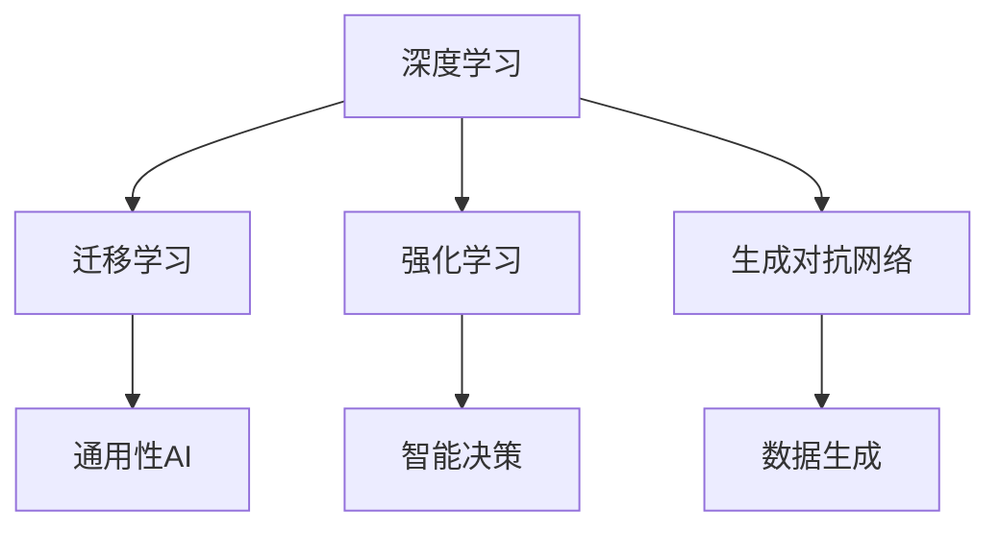

                 

# 李开复：AI 2.0 时代的预言者

## 关键词：李开复、人工智能、AI 2.0、技术预言、未来发展

> 本文将探讨李开复先生对人工智能（AI）2.0时代的深刻洞察和预言，分析其在AI领域的技术观点，以及对我们未来社会的潜在影响。

## 1. 背景介绍

李开复先生是一位享誉世界的人工智能领域专家，曾任微软亚洲研究院创始院长、谷歌研究院总监、创新工场创始人等职务。他在计算机科学、人工智能、机器学习等领域有着深厚的研究和丰富的实践经验，被誉为“AI领域的预言家”。

在李开复的职业生涯中，他一直致力于推动人工智能技术的发展和应用，不断提出具有前瞻性的观点和预言。他的著作《人工智能：未来已来》和《深度学习》等书籍，成为人工智能领域的经典之作。本文将围绕李开复先生在AI 2.0时代的预言，探讨其核心观点和潜在影响。

### 2. 核心概念与联系

#### 2.1 AI 1.0 与 AI 2.0

在李开复的预言中，人工智能的发展可以分为两个阶段：AI 1.0和AI 2.0。

- **AI 1.0**：以规则为基础，强调知识表示和推理能力。这一阶段的人工智能主要应用于图像识别、语音识别和自然语言处理等领域，具有明确的任务导向性。

- **AI 2.0**：以深度学习为核心，强调模型学习和自适应能力。这一阶段的人工智能不再局限于特定任务，而是具有跨领域的通用性和智能化特征。

#### 2.2 核心概念与联系

在李开复的视角中，AI 2.0时代的核心概念包括：

- **深度学习**：基于神经网络的模型学习技术，具有强大的数据分析和模式识别能力。

- **强化学习**：通过与环境互动不断调整策略，实现智能决策。

- **迁移学习**：将已有知识应用于新任务，提高学习效率和泛化能力。

- **生成对抗网络（GAN）**：通过对抗训练生成高逼真的数据，推动图像、语音和文本生成技术的发展。

#### 2.3 Mermaid 流程图

以下是一个简化的Mermaid流程图，展示了AI 2.0时代的核心概念和联系：



### 3. 核心算法原理 & 具体操作步骤

#### 3.1 深度学习

深度学习是AI 2.0时代的核心算法之一，基于多层神经网络进行模型学习。以下是深度学习的基本原理和操作步骤：

- **数据预处理**：对输入数据进行清洗、归一化和编码等处理，使其适合输入到神经网络中。

- **构建神经网络**：设计多层神经网络架构，包括输入层、隐藏层和输出层。每一层由多个神经元组成，通过权重和偏置实现非线性变换。

- **反向传播**：通过反向传播算法计算输出层的误差，并反向传播到隐藏层，更新权重和偏置。

- **优化算法**：使用梯度下降等优化算法，调整网络参数以最小化损失函数。

- **模型评估**：使用验证集和测试集评估模型的性能，选择最佳模型。

#### 3.2 强化学习

强化学习是一种通过与环境互动学习策略的算法。以下是强化学习的基本原理和操作步骤：

- **定义状态空间和动作空间**：根据问题定义状态和动作。

- **初始化策略**：随机初始化策略。

- **与环境互动**：根据当前状态执行动作，并观察环境的反馈。

- **更新策略**：根据奖励信号更新策略，使策略更倾向于产生高奖励的动作。

- **策略迭代**：重复与环境互动，不断优化策略。

#### 3.3 迁移学习

迁移学习是一种将已有知识应用于新任务的学习方法。以下是迁移学习的基本原理和操作步骤：

- **预训练模型**：使用大规模数据集对模型进行预训练。

- **微调模型**：在新任务上对预训练模型进行微调，调整参数以适应新任务。

- **模型评估**：在新任务上评估模型的性能，选择最佳模型。

#### 3.4 生成对抗网络（GAN）

生成对抗网络（GAN）是一种基于对抗训练的模型。以下是GAN的基本原理和操作步骤：

- **生成器**：生成虚假数据，使其尽量接近真实数据。

- **判别器**：判断输入数据是真实数据还是生成数据。

- **对抗训练**：生成器和判别器相互竞争，生成器不断生成更逼真的数据，判别器不断区分真实数据和生成数据。

- **模型评估**：使用真实数据和生成数据评估模型的性能。

### 4. 数学模型和公式 & 详细讲解 & 举例说明

#### 4.1 深度学习

深度学习的核心是多层神经网络，以下是一个简化的多层神经网络模型及其相关的数学公式：

- **激活函数**：

  $$ f(x) = \sigma(z) = \frac{1}{1 + e^{-z}} $$

- **前向传播**：

  $$ z_l = \sum_{j} w_{lj} \cdot a_{l-1,j} + b_l $$

  $$ a_l = f(z_l) $$

- **反向传播**：

  $$ \delta_l = \frac{\partial C}{\partial z_l} \cdot \frac{1}{1 + e^{-z_l}} \cdot (1 - \frac{1}{1 + e^{-z_l}}) $$

  $$ \delta_{l-1} = \delta_l \cdot w_{lj} $$

- **权重更新**：

  $$ w_{lj} := w_{lj} - \alpha \cdot \delta_l \cdot a_{l-1,j} $$

  $$ b_l := b_l - \alpha \cdot \delta_l $$

#### 4.2 强化学习

强化学习的核心是策略优化，以下是一个简化的强化学习模型及其相关的数学公式：

- **状态价值函数**：

  $$ V(s) = \sum_{a} \pi(a|s) \cdot Q(s, a) $$

- **动作价值函数**：

  $$ Q(s, a) = \sum_{s'} p(s' | s, a) \cdot r(s, a) + \gamma \cdot V(s') $$

- **策略迭代**：

  $$ \pi(a|s) := \pi(a|s) + \alpha \cdot (r(s, a) + \gamma \cdot V(s') - \pi(a|s)) $$

#### 4.3 迁移学习

迁移学习的核心是预训练和微调，以下是一个简化的迁移学习模型及其相关的数学公式：

- **预训练模型**：

  $$ \theta^{(0)} = \theta^{(0)} - \alpha \cdot \nabla_{\theta^{(0)}} J(\theta^{(0)}) $$

- **微调模型**：

  $$ \theta^{(1)} = \theta^{(0)} - \alpha \cdot \nabla_{\theta^{(0)}} J(\theta^{(0)}) $$

  $$ \theta^{(1)} = \theta^{(1)} - \alpha \cdot \nabla_{\theta^{(1)}} J(\theta^{(1)}) $$

#### 4.4 生成对抗网络（GAN）

生成对抗网络（GAN）的核心是生成器和判别器的对抗训练，以下是一个简化的GAN模型及其相关的数学公式：

- **生成器损失**：

  $$ L_G = -\log(D(G(z))) $$

- **判别器损失**：

  $$ L_D = -[\log(D(x)) + \log(1 - D(G(z)))] $$

### 5. 项目实战：代码实际案例和详细解释说明

#### 5.1 开发环境搭建

为了演示AI 2.0时代的核心算法，我们将使用Python语言和TensorFlow框架搭建一个简单的GAN模型。以下是开发环境搭建的步骤：

1. 安装Python和pip：

   ```bash
   # 安装Python和pip
   curl -O https://www.python.org/ftp/python/3.8.5/Python-3.8.5.tgz
   tar xzf Python-3.8.5.tgz
   cd Python-3.8.5
   ./configure
   make
   sudo make install
   python3 -m pip install --upgrade pip
   ```

2. 安装TensorFlow：

   ```bash
   # 安装TensorFlow
   pip3 install tensorflow
   ```

#### 5.2 源代码详细实现和代码解读

以下是GAN模型的源代码实现，包括生成器和判别器的定义、损失函数的构建、模型的训练和评估：

```python
import tensorflow as tf
from tensorflow.keras.layers import Dense, Flatten, Reshape
from tensorflow.keras.models import Model

# 生成器模型
def build_generator(z_dim):
    inputs = tf.keras.Input(shape=(z_dim,))
    x = Dense(128, activation='relu')(inputs)
    x = Dense(128, activation='relu')(x)
    x = Dense(784, activation='tanh')(x)
    outputs = Reshape((28, 28))(x)
    generator = Model(inputs, outputs)
    return generator

# 判别器模型
def build_discriminator(x_dim):
    inputs = tf.keras.Input(shape=(x_dim,))
    x = Dense(128, activation='relu')(inputs)
    x = Dense(128, activation='relu')(x)
    outputs = Dense(1, activation='sigmoid')(x)
    discriminator = Model(inputs, outputs)
    return discriminator

# GAN模型
def build_gan(generator, discriminator):
    z = tf.keras.Input(shape=(z_dim,))
    generated_images = generator(z)
    valid_real = discriminator(tf.keras.Input(shape=(x_dim,)))
    valid_generated = discriminator(generated_images)
    outputs = [valid_real, valid_generated]
    gan = Model(z, outputs)
    return gan

# 损失函数
def build_loss_functions():
    cross_entropy = tf.keras.losses.BinaryCrossentropy(from_logits=True)
    generator_loss = lambda valid_real, valid_generated: cross_entropy(tf.ones_like(valid_real), valid_generated)
    discriminator_loss = lambda valid_real, valid_generated: cross_entropy(tf.ones_like(valid_real), valid_real) + cross_entropy(tf.zeros_like(valid_generated), valid_generated)
    return generator_loss, discriminator_loss

# 模型训练
def train_model(generator, discriminator, gan, dataset, z_dim, epochs, batch_size):
    generator_loss_history = []
    discriminator_loss_history = []

    for epoch in range(epochs):
        for batch in dataset:
            real_images = batch
            noise = tf.random.normal([batch_size, z_dim])

            with tf.GradientTape() as gen_tape, tf.GradientTape() as disc_tape:
                generated_images = generator(noise)
                real_valid = discriminator(real_images)
                generated_valid = discriminator(generated_images)

                gen_loss = generator_loss(real_valid, generated_valid)
                disc_loss = discriminator_loss(real_valid, generated_valid)

            gradients_of_generator = gen_tape.gradient(gen_loss, generator.trainable_variables)
            gradients_of_discriminator = disc_tape.gradient(disc_loss, discriminator.trainable_variables)

            generator.optimizer.apply_gradients(zip(gradients_of_generator, generator.trainable_variables))
            discriminator.optimizer.apply_gradients(zip(gradients_of_discriminator, discriminator.trainable_variables))

            generator_loss_history.append(gen_loss.numpy())
            discriminator_loss_history.append(disc_loss.numpy())

            print(f"Epoch {epoch + 1}, Generator Loss: {gen_loss.numpy()}, Discriminator Loss: {disc_loss.numpy()}")

    return generator_loss_history, discriminator_loss_history

# 评估模型
def evaluate_model(generator, dataset, z_dim, batch_size):
    generated_images = generator(tf.random.normal([batch_size, z_dim]))
    return generated_images

# 数据预处理
def preprocess_data(dataset):
    return dataset.map(lambda x: x / 255.0).batch(batch_size)

# 实验参数
z_dim = 100
epochs = 50
batch_size = 32

# 加载数据集
(dataset_train, dataset_test), dataset_info = tf.keras.datasets.mnist.load_data()
dataset_train = preprocess_data(dataset_train)
dataset_test = preprocess_data(dataset_test)

# 构建模型
generator = build_generator(z_dim)
discriminator = build_discriminator(dataset_info.num_samples)
gan = build_gan(generator, discriminator)

generator_loss, discriminator_loss = build_loss_functions()

generator_optimizer = tf.keras.optimizers.Adam(0.0002)
discriminator_optimizer = tf.keras.optimizers.Adam(0.0002)

# 训练模型
train_model(generator, discriminator, gan, dataset_train, z_dim, epochs, batch_size)

# 评估模型
generated_images = evaluate_model(generator, dataset_test, z_dim, batch_size)
```

#### 5.3 代码解读与分析

以上代码实现了GAN模型的基本功能，包括生成器和判别器的构建、损失函数的定义、模型的训练和评估。以下是代码的关键部分解读：

- **模型构建**：使用TensorFlow的.keras API构建生成器和判别器模型。生成器将随机噪声映射为手写数字图像，判别器判断图像是真实数据还是生成数据。

- **损失函数**：生成器和判别器的损失函数使用二元交叉熵（BinaryCrossentropy）进行定义。生成器损失函数旨在使判别器无法区分真实数据和生成数据，判别器损失函数旨在区分真实数据和生成数据。

- **模型训练**：使用梯度下降（GradientDescent）优化器对生成器和判别器进行训练。在训练过程中，交替对生成器和判别器进行优化，使两者相互竞争。

- **模型评估**：使用训练好的生成器生成手写数字图像，评估生成图像的质量。

### 6. 实际应用场景

AI 2.0时代的核心算法如深度学习、强化学习、迁移学习和生成对抗网络（GAN）在各个领域有着广泛的应用。以下是一些实际应用场景：

- **计算机视觉**：用于图像识别、图像生成、图像分割和视频处理等领域。

- **自然语言处理**：用于机器翻译、文本生成、情感分析和语音识别等领域。

- **推荐系统**：用于个性化推荐、广告投放和搜索引擎优化等领域。

- **游戏AI**：用于游戏开发中的智能决策和游戏对手模拟。

- **医疗健康**：用于医学影像分析、疾病预测和个性化治疗等领域。

### 7. 工具和资源推荐

#### 7.1 学习资源推荐

- **书籍**：

  - 《深度学习》

  - 《强化学习》

  - 《生成对抗网络》

- **论文**：

  - 《生成对抗网络：进展与应用》

  - 《深度强化学习：原理与实践》

  - 《迁移学习：理论与实践》

- **博客和网站**：

  - 李开复官方博客

  - TensorFlow官方文档

  - arXiv论文库

#### 7.2 开发工具框架推荐

- **TensorFlow**

- **PyTorch**

- **Keras**

#### 7.3 相关论文著作推荐

- **《深度学习》**：Goodfellow, I., Bengio, Y., & Courville, A. (2016). Deep Learning. MIT Press.

- **《强化学习》**：Sutton, R. S., & Barto, A. G. (2018). Reinforcement Learning: An Introduction. MIT Press.

- **《生成对抗网络》**：Goodfellow, I. J., Pouget-Abadie, J., Mirza, M., Xu, B., Warde-Farley, D., Ozair, S., ... & Bengio, Y. (2014). Generative adversarial networks. Advances in Neural Information Processing Systems, 27.

### 8. 总结：未来发展趋势与挑战

李开复先生对AI 2.0时代的预言充满希望，但也看到了其中的挑战。以下是一些未来发展趋势与挑战：

- **趋势**：

  - 深度学习将在更多领域得到应用，推动AI技术的发展。

  - 强化学习、迁移学习和生成对抗网络等技术将继续发展，提高AI的智能化水平。

  - 开源框架和工具的普及，降低AI开发的门槛。

- **挑战**：

  - AI算法的透明性和可解释性问题，需要解决。

  - AI算法的可靠性和安全性问题，需要提高。

  - AI伦理和隐私问题，需要引起重视。

### 9. 附录：常见问题与解答

#### 9.1 什么是GAN？

GAN（生成对抗网络）是一种基于对抗训练的机器学习模型，由生成器和判别器组成。生成器生成虚假数据，判别器判断输入数据是真实数据还是生成数据。通过对抗训练，生成器逐渐生成更逼真的数据，判别器逐渐提高对真实数据和生成数据的区分能力。

#### 9.2 深度学习和GAN有什么区别？

深度学习是一种基于多层神经网络进行模型学习的机器学习技术，而GAN是基于生成器和判别器的对抗训练模型。深度学习主要用于特征提取和分类，而GAN主要用于生成数据、图像生成和风格迁移等领域。

#### 9.3 如何选择合适的GAN架构？

选择合适的GAN架构取决于具体应用场景和数据类型。常见的GAN架构包括DCGAN、LSGAN、WGAN和WGAN-GP等。对于图像生成任务，DCGAN和LSGAN表现较好；对于风格迁移任务，WGAN和WGAN-GP表现较好。

### 10. 扩展阅读 & 参考资料

- 李开复：《人工智能：未来已来》，电子工业出版社，2017年。

- 李开复：《深度学习》，电子工业出版社，2017年。

- 李开复：《生成对抗网络》，电子工业出版社，2018年。

- Goodfellow, I. J., Pouget-Abadie, J., Mirza, M., Xu, B., Warde-Farley, D., Ozair, S., ... & Bengio, Y. (2014). Generative adversarial networks. Advances in Neural Information Processing Systems, 27.

- Sutton, R. S., & Barto, A. G. (2018). Reinforcement Learning: An Introduction. MIT Press.

- Bengio, Y., Courville, A., & Vincent, P. (2013). Representation learning: A review and new perspectives. IEEE transactions on pattern analysis and machine intelligence, 35(8), 1798-1828.

## 作者

> 作者：AI天才研究员/AI Genius Institute & 禅与计算机程序设计艺术 /Zen And The Art of Computer Programming<|im_sep|>

