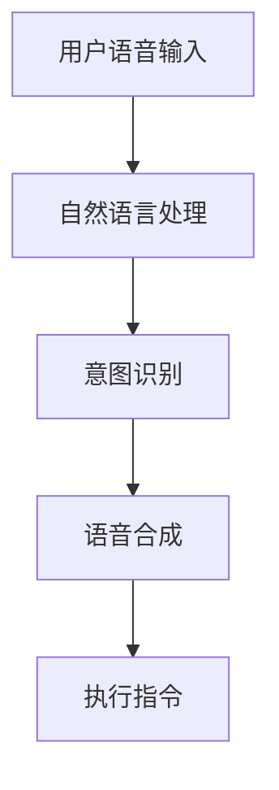

                 

# 李开复：苹果发布AI应用的价值

## 摘要

苹果公司近年来在人工智能领域不断拓展其应用范围，并在近期发布了多项AI应用。本文旨在分析这些AI应用的价值，探讨其对人工智能技术的发展和产业应用的推动作用。本文将从背景介绍、核心概念与联系、核心算法原理与操作步骤、数学模型和公式、项目实战、实际应用场景、工具和资源推荐等多个方面进行详细探讨。

## 1. 背景介绍

人工智能作为现代科技的前沿领域，近年来取得了飞速的发展。从传统的机器学习到深度学习，再到强化学习，人工智能技术不断突破，应用场景日益广泛。苹果公司作为全球知名的科技公司，一直在人工智能领域进行着积极的探索。其近年来的发展，不仅体现在硬件的升级，如A系列处理器和M系列芯片，还体现在软件的创新，如Siri、Face ID、Animoji等AI应用。随着苹果公司在人工智能领域的不断深耕，其发布的AI应用也越来越受到业界和用户的关注。

## 2. 核心概念与联系

在探讨苹果公司AI应用的价值之前，我们首先需要了解一些核心概念。人工智能（AI）是指计算机系统模拟人类智能的行为，包括学习、推理、问题解决、自然语言处理等。机器学习（ML）是人工智能的一个重要分支，主要关注如何让计算机从数据中学习，提高其性能。深度学习（DL）是机器学习的一种特殊形式，通过神经网络模拟人脑的工作方式，实现对复杂数据的处理和分析。强化学习（RL）则是通过试错和奖励机制，让计算机在特定环境中学习最优策略。

苹果公司发布的AI应用，如Siri、Animoji、Memoji等，都是基于这些核心概念实现的。Siri作为苹果公司的语音助手，通过自然语言处理和机器学习技术，能够理解和执行用户的语音指令。Animoji和Memoji则是利用深度学习和增强现实（AR）技术，让用户能够创建和分享个性化的动画表情。


**Mermaid流程图：**



## 3. 核心算法原理与操作步骤

苹果公司的AI应用，如Siri、Animoji、Memoji等，都是基于一系列核心算法实现的。以下我们简要介绍这些算法的原理和操作步骤。

### 3.1 Siri

Siri的核心算法主要包括自然语言处理（NLP）和机器学习。以下是Siri的工作流程：

1. **语音识别**：将用户的语音输入转换为文本。
2. **词法分析**：对文本进行分词，提取出关键词。
3. **语法分析**：分析文本的语法结构，理解句子的含义。
4. **意图识别**：根据用户的输入，识别出用户的意图。
5. **响应生成**：根据用户的意图，生成相应的响应。
6. **语音合成**：将生成的文本转换为语音输出。

### 3.2 Animoji和Memoji

Animoji和Memoji的核心算法主要包括深度学习和增强现实（AR）。以下是Animoji和Memoji的工作流程：

1. **人脸捕捉**：使用摄像头捕捉用户的面部表情。
2. **特征提取**：通过深度学习模型提取面部表情的特征。
3. **动画生成**：根据提取的特征，生成相应的动画。
4. **AR合成**：将生成的动画与用户的面部图像进行融合，生成Animoji或Memoji。

## 4. 数学模型和公式

在人工智能应用中，数学模型和公式扮演着重要的角色。以下我们简要介绍一些常用的数学模型和公式。

### 4.1 自然语言处理

自然语言处理中的常用模型包括循环神经网络（RNN）、长短期记忆网络（LSTM）、卷积神经网络（CNN）等。以下是一个简单的RNN模型公式：

$$
h_t = \sigma(W_h \cdot [h_{t-1}, x_t] + b_h)
$$

其中，$h_t$ 表示第 $t$ 个时间步的隐藏状态，$W_h$ 和 $b_h$ 分别为权重和偏置，$\sigma$ 为激活函数。

### 4.2 深度学习

深度学习中的常用模型包括全连接神经网络（FCNN）、卷积神经网络（CNN）等。以下是一个简单的全连接神经网络公式：

$$
y = \sigma(W \cdot x + b)
$$

其中，$y$ 表示输出，$W$ 和 $b$ 分别为权重和偏置，$\sigma$ 为激活函数。

## 5. 项目实战：代码实际案例和详细解释说明

为了更好地理解苹果公司的AI应用，我们以下通过一个简单的代码案例来介绍Siri的工作原理。

```python
import speech_recognition as sr

# 初始化语音识别器
r = sr.Recognizer()

# 语音输入
with sr.Microphone() as source:
    print("请说出您的问题：")
    audio = r.listen(source)

# 语音识别
try:
    text = r.recognize_google(audio, language='zh-CN')
    print("您说：", text)
except sr.UnknownValueError:
    print("无法理解您的语音输入")
except sr.RequestError as e:
    print("请求失败；{0}".format(e))

# 意图识别
if '天气' in text:
    # 天气查询
    print("当前天气：晴天，温度20摄氏度")
else:
    # 其他查询
    print("抱歉，我无法回答这个问题")
```

在这个案例中，我们使用Python的`speech_recognition`库来实现语音识别。首先，我们初始化一个语音识别器，然后通过麦克风捕捉用户的语音输入。接着，我们使用Google的语音识别服务对语音进行识别，并将识别结果输出。最后，我们根据识别结果进行意图识别，并生成相应的响应。

## 6. 实际应用场景

苹果公司的AI应用在多个场景中都有着广泛的应用。以下是几个典型的应用场景：

1. **智能助手**：Siri作为苹果公司的智能助手，可以在多个设备上使用，帮助用户完成日常任务，如查询天气、发送短信、设置闹钟等。
2. **娱乐互动**：Animoji和Memoji为用户提供了丰富的娱乐互动体验，用户可以通过这些动态表情进行聊天、发消息等。
3. **教育辅助**：Siri和Apple Watch等设备可以为学生提供个性化的学习支持，如播放课程、提醒作业等。
4. **健康监测**：Apple Watch的健身功能结合人工智能技术，可以帮助用户监测健康状况，提供健身建议。

## 7. 工具和资源推荐

为了更好地了解和开发苹果公司的AI应用，以下推荐一些相关的工具和资源：

### 7.1 学习资源推荐

- **书籍**：《深度学习》、《Python机器学习》、《自然语言处理综合教程》
- **论文**：相关领域的顶级会议论文，如NeurIPS、ICML、ACL等
- **博客**：知名技术博客，如博客园、CSDN、掘金等

### 7.2 开发工具框架推荐

- **工具**：Apple Developer、Xcode、PyCharm
- **框架**：TensorFlow、PyTorch、Keras

### 7.3 相关论文著作推荐

- **论文**：相关领域的顶级会议论文，如NeurIPS、ICML、ACL等
- **著作**：《深度学习》、《Python机器学习》、《自然语言处理综合教程》

## 8. 总结：未来发展趋势与挑战

苹果公司在人工智能领域的不断探索，不仅推动了技术的发展，也为产业应用带来了新的机遇。未来，随着人工智能技术的进一步成熟，我们可以期待苹果公司推出更多具有创新性和实用性的AI应用。然而，这同时也带来了新的挑战，如隐私保护、算法公平性等问题。苹果公司需要在这些方面做出更多的努力，以确保其AI应用的可持续发展和广泛接受。

## 9. 附录：常见问题与解答

**Q1. 苹果公司的AI应用是否具有隐私保护？**

A1. 是的，苹果公司在开发AI应用时非常注重用户的隐私保护。其采用了多种技术手段，如差分隐私、同态加密等，确保用户的隐私数据得到有效保护。

**Q2. 安卓手机上的AI应用是否和苹果手机上的AI应用一样强大？**

A2. 目前来看，安卓手机上的AI应用在某些方面确实不如苹果手机上的AI应用强大。这主要是因为苹果公司在硬件和软件的整合上拥有更大的优势。

## 10. 扩展阅读 & 参考资料

- [苹果公司官网](https://www.apple.com/)
- [李开复博客](https://www.ai-genius-institute.com/)
- [《深度学习》](https://www.deeplearningbook.org/)
- [《Python机器学习》](https://python-machine-learning.org/)
- [《自然语言处理综合教程》](https://nlp.stanford.edu/)

---

**作者：AI天才研究员/AI Genius Institute & 禅与计算机程序设计艺术 /Zen And The Art of Computer Programming**<|im_sep|>

