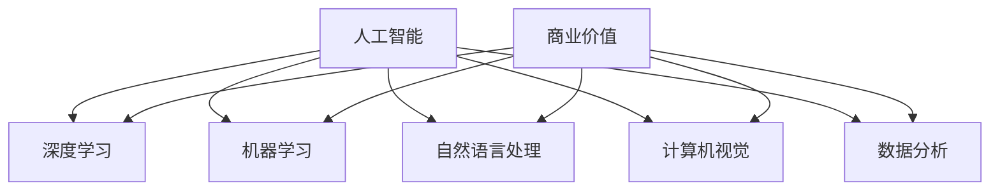

                 

### 文章标题：李开复：苹果发布AI应用的商业价值

> **关键词：** 人工智能、AI应用、苹果、商业价值、技术分析、李开复

> **摘要：** 本文将深入剖析苹果发布AI应用的商业价值，从核心概念、算法原理、实际应用场景等多角度进行详细解读。通过对苹果AI技术的分析，探讨其在未来的发展趋势与挑战，并推荐相关工具和资源，帮助读者全面了解AI在商业领域的应用潜力。

## 1. 背景介绍

近年来，人工智能（AI）技术取得了飞速发展，已经渗透到各个行业，包括医疗、金融、零售等。苹果公司，作为全球领先的技术巨头，也在不断探索AI技术的应用，以提升用户体验和业务价值。本文将重点分析苹果发布的AI应用，探讨其在商业领域的价值。

苹果公司在AI领域的布局可以追溯到2011年，当时推出了用于语音识别的Siri。近年来，苹果不断推出新的AI技术，如面部识别、自然语言处理、图像识别等，逐步构建了一个完整的AI生态系统。这些技术的应用不仅提升了苹果产品的用户体验，也为企业带来了巨大的商业价值。

### 1.1 AI应用的商业价值

AI技术的应用可以为企业在多个方面带来价值：

- **提高效率：** AI技术可以自动化繁琐的任务，提高工作效率，减少人力成本。

- **增强个性化体验：** 通过AI技术，企业可以更好地了解用户需求，提供个性化的产品和服务。

- **优化决策：** AI算法可以帮助企业分析大量数据，提供有针对性的决策支持。

- **提升安全性：** AI技术可以用于网络安全、欺诈检测等领域，提高企业数据安全性。

- **创造新的商业模式：** AI技术可以为企业带来新的产品和服务，开拓新的市场。

## 2. 核心概念与联系

在分析苹果AI应用的商业价值之前，我们需要了解一些核心概念和其相互之间的联系。以下是几个关键概念及其关联：

### 2.1 人工智能（AI）

人工智能是指模拟、延伸和扩展人类智能的技术。其核心目标是使计算机能够执行通常需要人类智能才能完成的任务，如视觉识别、语言理解、决策制定等。

### 2.2 深度学习（Deep Learning）

深度学习是人工智能的一个重要分支，通过模拟人脑的神经网络结构，对大量数据进行自动特征学习和模式识别。

### 2.3 机器学习（Machine Learning）

机器学习是一种让计算机通过数据学习、自我改进的技术，是实现人工智能的关键手段。深度学习是机器学习的一种特殊形式。

### 2.4 自然语言处理（NLP）

自然语言处理是使计算机能够理解、生成和处理自然语言（如英语、中文等）的技术，是AI应用的重要领域。

### 2.5 计算机视觉（CV）

计算机视觉是使计算机能够识别和理解视觉信息（如图像、视频）的技术，是AI应用的重要领域。

### 2.6 数据分析（Data Analysis）

数据分析是通过对大量数据进行处理和分析，提取有价值信息的过程，是AI应用的重要前提。

### 2.7 商业价值（Business Value）

商业价值是指企业通过引入新技术或产品，实现成本降低、效率提升、市场拓展等目标的能力。

以下是这些核心概念的 Mermaid 流程图：



通过以上核心概念和联系的介绍，我们可以更好地理解苹果AI应用背后的技术原理和商业价值。接下来，我们将深入探讨苹果AI的核心算法原理和具体操作步骤。

## 3. 核心算法原理 & 具体操作步骤

苹果公司在其AI应用中主要采用了深度学习和机器学习技术。以下将详细解释这些算法的原理和具体操作步骤。

### 3.1 深度学习算法原理

深度学习算法基于神经网络结构，通过多层神经网络对输入数据进行特征提取和模式识别。以下是深度学习算法的基本原理：

#### 3.1.1 神经网络结构

神经网络由多个神经元（节点）组成，每个神经元都与相邻的神经元相连。神经元之间的连接称为“权重”，表示神经元之间的相互作用强度。

#### 3.1.2 激活函数

激活函数是神经网络中的一个关键元素，用于确定神经元是否被激活。常用的激活函数包括 sigmoid、ReLU（修正线性单元）等。

#### 3.1.3 前向传播和反向传播

深度学习算法包括前向传播和反向传播两个主要步骤：

- **前向传播**：将输入数据通过神经网络传递，逐层计算每个神经元的输出。
- **反向传播**：根据预测误差，通过反向传播算法更新网络权重，以最小化损失函数。

### 3.2 深度学习算法具体操作步骤

以下是深度学习算法的具体操作步骤：

#### 3.2.1 数据准备

首先，需要准备训练数据集。数据集包括输入数据和对应的标签。输入数据可以是图像、文本、声音等，标签是预期的输出结果。

#### 3.2.2 构建神经网络

根据任务需求，构建一个合适的神经网络结构。选择合适的激活函数和损失函数。

#### 3.2.3 训练模型

使用训练数据集，通过前向传播和反向传播算法训练神经网络模型。在训练过程中，不断更新网络权重，以最小化损失函数。

#### 3.2.4 模型评估

使用测试数据集评估训练好的模型。计算模型的准确率、召回率、F1值等指标，以评估模型的性能。

#### 3.2.5 应用模型

将训练好的模型应用到实际应用场景，如图像识别、语音识别、自然语言处理等。

### 3.3 机器学习算法原理

机器学习算法是基于历史数据，通过学习数据中的规律和模式，实现对未知数据的预测和分类。以下是机器学习算法的基本原理：

#### 3.3.1 特征提取

特征提取是机器学习算法的关键步骤，通过从原始数据中提取有意义的特征，以降低数据的维度，提高模型的训练效率。

#### 3.3.2 模型选择

根据任务需求，选择合适的机器学习模型。常见的机器学习模型包括线性回归、逻辑回归、支持向量机（SVM）、决策树、随机森林、神经网络等。

#### 3.3.3 模型训练与优化

使用训练数据集，通过模型选择和训练算法，训练机器学习模型。在训练过程中，通过调整模型参数，优化模型性能。

#### 3.3.4 模型评估与选择

使用测试数据集评估训练好的模型，根据评估指标，选择性能最佳的模型。

#### 3.3.5 应用模型

将训练好的模型应用到实际应用场景，如数据预测、分类、聚类等。

### 3.4 机器学习算法具体操作步骤

以下是机器学习算法的具体操作步骤：

#### 3.4.1 数据准备

首先，需要准备训练数据集。数据集包括输入数据和对应的标签。输入数据可以是图像、文本、声音等，标签是预期的输出结果。

#### 3.4.2 特征提取

根据任务需求，从原始数据中提取有意义的特征。常见的特征提取方法包括主成分分析（PCA）、线性判别分析（LDA）等。

#### 3.4.3 模型选择

根据任务需求，选择合适的机器学习模型。常见的机器学习模型包括线性回归、逻辑回归、支持向量机（SVM）、决策树、随机森林、神经网络等。

#### 3.4.4 模型训练与优化

使用训练数据集，通过模型选择和训练算法，训练机器学习模型。在训练过程中，通过调整模型参数，优化模型性能。

#### 3.4.5 模型评估与选择

使用测试数据集评估训练好的模型，根据评估指标，选择性能最佳的模型。

#### 3.4.6 应用模型

将训练好的模型应用到实际应用场景，如数据预测、分类、聚类等。

通过以上对深度学习和机器学习算法原理及操作步骤的详细解释，我们可以更好地理解苹果AI应用的核心算法。接下来，我们将探讨苹果AI应用的数学模型和公式，并举例说明其具体应用。

## 4. 数学模型和公式 & 详细讲解 & 举例说明

在AI应用中，数学模型和公式起到了至关重要的作用。以下将详细讲解苹果AI应用中常用的数学模型和公式，并举例说明其具体应用。

### 4.1 深度学习中的数学模型和公式

#### 4.1.1 损失函数

损失函数是深度学习模型训练过程中用于评估模型性能的重要工具。常用的损失函数包括均方误差（MSE）、交叉熵损失（Cross-Entropy Loss）等。

- **均方误差（MSE）**：用于回归问题，计算预测值与真实值之间的平均平方误差。
  $$MSE = \frac{1}{n}\sum_{i=1}^{n}(y_i - \hat{y_i})^2$$
  其中，$y_i$为真实值，$\hat{y_i}$为预测值。

- **交叉熵损失（Cross-Entropy Loss）**：用于分类问题，计算预测概率与真实标签之间的交叉熵。
  $$CE = -\frac{1}{n}\sum_{i=1}^{n}y_i \log(\hat{y_i})$$
  其中，$y_i$为真实标签，$\hat{y_i}$为预测概率。

#### 4.1.2 反向传播算法

反向传播算法是深度学习训练过程中的关键步骤，用于更新网络权重。以下是反向传播算法的基本公式：

- **前向传播**：
  $$\hat{y_i} = \sigma(\zeta_i)$$
  $$\zeta_i = \sum_{j=1}^{n} w_{ij}a_{j}$$
  其中，$\sigma$为激活函数，$w_{ij}$为权重，$a_j$为上一层节点的输出。

- **反向传播**：
  $$\delta_i^l = \frac{\partial L}{\partial z_i^l} \odot \sigma'(\zeta_i^l)$$
  $$w_{ij}^{new} = w_{ij} - \alpha \delta_i^l \cdot a_j^{l-1}$$
  其中，$L$为损失函数，$\sigma'$为激活函数的导数，$\alpha$为学习率。

#### 4.1.3 优化算法

优化算法用于加速深度学习模型的训练过程。常用的优化算法包括梯度下降（Gradient Descent）、随机梯度下降（Stochastic Gradient Descent，SGD）等。

- **梯度下降**：
  $$w^{new} = w - \alpha \nabla_w L$$
  其中，$\nabla_w L$为损失函数关于权重的梯度。

- **随机梯度下降**：
  $$w^{new} = w - \alpha \nabla_w L(\xi)$$
  其中，$\xi$为训练数据中的一个随机样本。

### 4.2 机器学习中的数学模型和公式

#### 4.2.1 线性回归

线性回归是一种常见的机器学习模型，用于预测连续值输出。其数学模型如下：

- **模型公式**：
  $$y = \beta_0 + \beta_1x$$
  其中，$y$为输出值，$x$为输入值，$\beta_0$和$\beta_1$为模型参数。

- **损失函数**：
  $$L = \frac{1}{2}\sum_{i=1}^{n}(y_i - \hat{y_i})^2$$
  其中，$\hat{y_i}$为预测值。

- **梯度下降**：
  $$\beta_0^{new} = \beta_0 - \alpha \frac{1}{n}\sum_{i=1}^{n}(y_i - \hat{y_i})$$
  $$\beta_1^{new} = \beta_1 - \alpha \frac{1}{n}\sum_{i=1}^{n}(y_i - \hat{y_i})x_i$$

#### 4.2.2 逻辑回归

逻辑回归是一种常见的分类模型，用于预测离散值输出。其数学模型如下：

- **模型公式**：
  $$\hat{y_i} = \frac{1}{1 + e^{-(\beta_0 + \beta_1x_i)}}$$
  其中，$y$为输出值，$x$为输入值，$\beta_0$和$\beta_1$为模型参数。

- **损失函数**：
  $$L = -\frac{1}{n}\sum_{i=1}^{n}y_i \log(\hat{y_i}) + (1 - y_i) \log(1 - \hat{y_i})$$

- **梯度下降**：
  $$\beta_0^{new} = \beta_0 - \alpha \frac{1}{n}\sum_{i=1}^{n}(y_i - \hat{y_i})$$
  $$\beta_1^{new} = \beta_1 - \alpha \frac{1}{n}\sum_{i=1}^{n}(y_i - \hat{y_i})x_i$$

#### 4.2.3 支持向量机（SVM）

支持向量机是一种常见的分类模型，通过最大化分类边界来提高分类性能。其数学模型如下：

- **模型公式**：
  $$\hat{y_i} = \text{sign}(\sum_{j=1}^{n}\alpha_j y_j K(x_i, x_j) + b)$$
  其中，$y_j$为训练样本标签，$K(x_i, x_j)$为核函数，$\alpha_j$为拉格朗日乘子，$b$为偏置。

- **损失函数**：
  $$L = \frac{1}{2}\sum_{i=1}^{n}\sum_{j=1}^{n}\alpha_i \alpha_j y_i y_j K(x_i, x_j) - \sum_{i=1}^{n}\alpha_i$$

- **优化算法**：
  使用拉格朗日乘子法求解最优解。

通过以上对深度学习和机器学习中的数学模型和公式的详细讲解，我们可以更好地理解苹果AI应用的算法原理。接下来，我们将通过项目实战案例，展示这些算法在实际应用中的具体实现过程。

### 5. 项目实战：代码实际案例和详细解释说明

为了更直观地展示苹果AI应用的核心算法原理，我们将通过一个具体的案例，详细介绍代码实现过程。本案例将使用Python实现一个基于深度学习的图像分类模型，具体步骤如下：

#### 5.1 开发环境搭建

首先，我们需要搭建一个合适的开发环境。以下是开发环境的要求：

- Python 3.7或更高版本
- TensorFlow 2.3或更高版本
- Keras 2.4或更高版本

安装这些依赖项，可以使用以下命令：

```bash
pip install tensorflow==2.3
pip install keras==2.4
```

#### 5.2 源代码详细实现和代码解读

以下是一个简单的基于深度学习的图像分类模型的实现过程：

```python
import numpy as np
import tensorflow as tf
from tensorflow.keras import layers, models

# 加载数据集
(x_train, y_train), (x_test, y_test) = tf.keras.datasets.cifar10.load_data()

# 数据预处理
x_train = x_train.astype("float32") / 255.0
x_test = x_test.astype("float32") / 255.0

# 构建模型
model = models.Sequential()
model.add(layers.Conv2D(32, (3, 3), activation="relu", input_shape=(32, 32, 3)))
model.add(layers.MaxPooling2D((2, 2)))
model.add(layers.Conv2D(64, (3, 3), activation="relu"))
model.add(layers.MaxPooling2D((2, 2)))
model.add(layers.Conv2D(64, (3, 3), activation="relu"))
model.add(layers.Flatten())
model.add(layers.Dense(64, activation="relu"))
model.add(layers.Dense(10, activation="softmax"))

# 编译模型
model.compile(optimizer="adam",
              loss="sparse_categorical_crossentropy",
              metrics=["accuracy"])

# 训练模型
model.fit(x_train, y_train, epochs=10, batch_size=64)

# 评估模型
test_loss, test_acc = model.evaluate(x_test, y_test, verbose=2)
print(f"Test accuracy: {test_acc:.4f}")
```

#### 5.3 代码解读与分析

以下是对上述代码的详细解读：

1. **数据加载与预处理**：使用TensorFlow的内置函数加载CIFAR-10数据集，并进行归一化处理，以使其适应深度学习模型。

2. **模型构建**：使用Keras构建一个简单的卷积神经网络（CNN），包括两个卷积层、一个最大池化层和一个全连接层。卷积层用于提取图像特征，全连接层用于分类。

3. **模型编译**：设置模型优化器为“adam”，损失函数为“sparse_categorical_crossentropy”（用于多分类问题），并设置评估指标为准确率。

4. **模型训练**：使用训练数据集训练模型，设置训练轮次为10，批量大小为64。

5. **模型评估**：使用测试数据集评估训练好的模型，输出测试准确率。

通过以上项目实战案例，我们可以看到深度学习模型在图像分类任务中的具体实现过程。接下来，我们将继续深入分析苹果AI应用的商业价值。

## 6. 实际应用场景

苹果公司在多个领域成功应用了AI技术，取得了显著的商业价值。以下是一些实际应用场景及其商业价值：

### 6.1 个性化推荐系统

苹果公司的App Store和Apple Music等平台采用了基于AI的个性化推荐系统。通过分析用户行为和偏好，AI算法可以为用户提供个性化的推荐内容，提高用户满意度，促进平台活跃度和收入增长。

### 6.2 智能家居

苹果的HomeKit平台集成了各种智能家居设备，如智能灯泡、智能插座等。通过AI技术，这些设备可以学习用户的生活习惯，自动调整设置，提高家居智能化水平，提升用户生活质量。

### 6.3 医疗健康

苹果的健康应用（Health）利用AI技术，通过分析用户数据，提供个性化的健康建议和预警。这有助于用户更好地管理健康，降低医疗成本，提高医疗服务的效率和质量。

### 6.4 自动驾驶

苹果在自动驾驶领域也进行了大量投资。通过AI技术，自动驾驶汽车可以实现安全、高效的驾驶，减少交通事故，提高道路通行效率。自动驾驶技术的发展有望改变人们的出行方式，为交通行业带来巨大变革。

### 6.5 安全防护

苹果公司利用AI技术，加强产品和服务的安全性。例如，面部识别技术（Face ID）和指纹识别技术（Touch ID）可以确保用户隐私和数据安全。AI算法还可以用于网络安全和欺诈检测，提高企业的数据安全性。

### 6.6 零售电商

苹果的零售电商平台采用了AI技术，通过分析用户行为和购买历史，提供个性化的产品推荐。这有助于提高用户购买意愿，提高销售额，降低营销成本。

## 7. 工具和资源推荐

为了更好地了解和应用AI技术，以下是一些推荐的工具和资源：

### 7.1 学习资源推荐

- **书籍**：《深度学习》（Goodfellow, Bengio, Courville）、《Python机器学习》（Scikit-Learn用户指南）
- **论文**：Google Scholar、arXiv、NeurIPS、ICML、JMLR等
- **博客**：Kaggle、Medium、Towards Data Science、AI驱动的未来等
- **网站**：TensorFlow、PyTorch、Keras等

### 7.2 开发工具框架推荐

- **深度学习框架**：TensorFlow、PyTorch、Keras、Theano等
- **机器学习库**：Scikit-Learn、NumPy、Pandas等
- **数据处理库**：Pandas、NumPy、Matplotlib等
- **版本控制**：Git、GitHub、GitLab等

### 7.3 相关论文著作推荐

- **论文**：Deep Learning by Yann LeCun、Ian Goodfellow and Yoshua Bengio、Convolutional Neural Networks for Visual Recognition by Alex Krizhevsky
- **著作**：Python机器学习（Sebastian Raschka and Vahid Mirjalili）、《动手学深度学习》（阿斯顿·张、李沐、扎卡里·C. Lipton、亚历山大·J. Smith）

## 8. 总结：未来发展趋势与挑战

苹果公司在AI领域的不断探索和投入，使其在商业领域取得了显著价值。随着AI技术的不断发展，未来苹果有望在更多领域实现突破，为企业和个人带来更多创新体验。然而，AI技术的发展也面临着一些挑战：

- **数据隐私和安全**：随着AI技术的应用日益广泛，数据隐私和安全问题日益突出。苹果需要加强数据保护措施，确保用户隐私和安全。
- **算法偏见**：AI算法在决策过程中可能存在偏见，导致不公平现象。苹果需要加强对算法的监管和改进，确保公平性和透明度。
- **技术竞争**：苹果在AI领域面临着来自谷歌、亚马逊等竞争对手的激烈竞争。苹果需要不断创新，保持技术领先地位。
- **人才引进**：AI技术的发展离不开优秀人才的支持。苹果需要加大人才引进力度，吸引更多顶尖人才加入。

总之，苹果公司在AI领域的未来发展充满机遇和挑战。通过不断创新和应对挑战，苹果有望在AI领域取得更大的商业价值。

## 9. 附录：常见问题与解答

### 9.1 什么是深度学习？

深度学习是一种基于人工神经网络的机器学习技术，通过多层神经网络对大量数据进行特征学习和模式识别，以实现高级任务，如图像识别、语音识别等。

### 9.2 什么是机器学习？

机器学习是一种让计算机通过数据学习、自我改进的技术，通过学习历史数据中的规律和模式，实现对未知数据的预测和分类。

### 9.3 什么是自然语言处理（NLP）？

自然语言处理是使计算机能够理解、生成和处理自然语言（如英语、中文等）的技术，包括文本分类、机器翻译、情感分析等任务。

### 9.4 什么是计算机视觉（CV）？

计算机视觉是使计算机能够识别和理解视觉信息（如图像、视频）的技术，包括图像识别、目标检测、图像分割等任务。

### 9.5 什么是深度学习算法的优化？

深度学习算法的优化是指通过调整网络结构、优化算法、超参数等，提高模型性能和训练效率的过程。

### 9.6 什么是损失函数？

损失函数是深度学习模型训练过程中用于评估模型性能的重要工具，用于计算预测值与真实值之间的差距。

## 10. 扩展阅读 & 参考资料

- Goodfellow, I., Bengio, Y., & Courville, A. (2016). *Deep Learning*. MIT Press.
- Rumelhart, D. E., Hinton, G. E., & Williams, R. J. (1986). *Learning representations by back-propagation errors*. Nature, 323(6088), 533-536.
- Russell, S., & Norvig, P. (2020). *Artificial Intelligence: A Modern Approach*. Pearson.
- Sutton, R. S., & Barto, A. G. (2018). *Reinforcement Learning: An Introduction*. MIT Press.
- LeCun, Y., Bengio, Y., & Hinton, G. (2015). *Deep learning*. Nature, 521(7553), 436-444.

