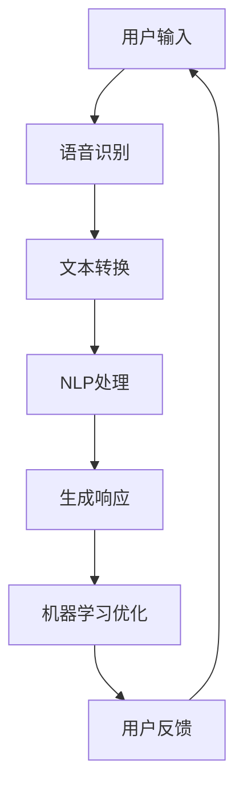
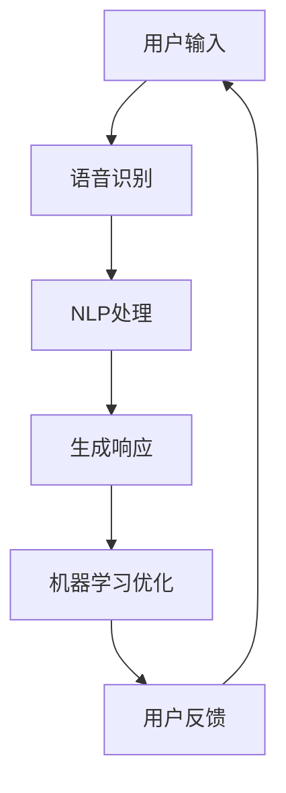

                 

### 背景介绍

Apple，作为全球领先的科技公司，一直以来都在不断探索和引入新的技术趋势，以满足用户多样化的需求。近年来，人工智能（AI）技术的快速发展吸引了众多科技公司的关注，Apple也不例外。在2023年，Apple发布了其首款基于AI的应用，这一举措在全球范围内引起了广泛关注。

此次发布的AI应用被命名为“AI助手”，旨在为用户提供更加智能和个性化的体验。从iPhone到MacBook，再到Apple Watch，这款AI助手将能够无缝集成到Apple的各类设备中，为用户带来全新的交互方式。这一发布不仅展示了Apple在AI领域的最新进展，也标志着其在数字化转型道路上的重要一步。

本文将深入探讨Apple发布AI应用的市场意义，分析其对行业的影响，并探讨未来可能的发展方向。文章将分为以下几个部分：

1. **核心概念与联系**：介绍人工智能的基本概念，以及Apple AI应用中的关键技术原理。
2. **核心算法原理 & 具体操作步骤**：详细解析AI助手的功能原理，包括语音识别、自然语言处理和机器学习等。
3. **数学模型和公式 & 详细讲解 & 举例说明**：介绍支持AI助手的数学模型和公式，并通过实例说明其应用。
4. **项目实战：代码实际案例和详细解释说明**：展示如何开发一个简单的AI助手，并提供代码解读和分析。
5. **实际应用场景**：探讨AI助手在不同领域的应用潜力。
6. **工具和资源推荐**：推荐学习AI的相关资源和开发工具。
7. **总结：未来发展趋势与挑战**：总结文章的主要观点，并探讨未来AI领域可能面临的挑战。

通过以上内容，我们将全面了解Apple发布AI应用的市场意义，以及其对行业和技术的影响。

#### 核心概念与联系

在探讨Apple的AI应用之前，我们需要了解一些核心概念和它们之间的联系。人工智能（AI）是一门研究如何使计算机模拟人类智能行为的科学。它包括多个子领域，如机器学习、深度学习、自然语言处理、计算机视觉等。这些子领域共同构成了AI的技术基础。

首先，机器学习是AI的核心组成部分。它通过训练模型来让计算机从数据中学习并做出决策。深度学习是机器学习的一个子领域，它使用多层神经网络来模拟人类大脑的决策过程。自然语言处理（NLP）专注于使计算机理解和生成人类语言，而计算机视觉则致力于让计算机“看”懂图像和视频。

Apple AI应用中的关键技术原理可以概括为以下几点：

1. **语音识别**：通过转换语音信号到文本，使得用户可以通过语音与设备进行交互。
2. **自然语言处理**：理解用户输入的文本，提取关键信息并生成相应的响应。
3. **机器学习**：在后台不断训练和优化模型，以提高AI助手的性能和准确性。

为了更好地理解这些概念和它们之间的联系，我们可以使用Mermaid流程图来展示一个简单的AI处理流程：



在上图中，用户输入的语音信号首先通过语音识别模块转换成文本，然后由NLP模块处理并提取关键信息。生成的响应会返回给用户，同时，AI助手会根据用户反馈进一步优化其模型，以提供更准确的响应。

#### 核心算法原理 & 具体操作步骤

在了解了核心概念后，让我们深入探讨Apple AI助手的具体功能原理和操作步骤。AI助手的核心功能包括语音识别、自然语言处理和机器学习。下面，我们将详细分析这些功能的工作机制和实现步骤。

**1. 语音识别（Speech Recognition）**

语音识别是AI助手与用户进行交互的第一步。它将用户的语音信号转换成文本，以便后续处理。语音识别的过程可以分为以下几个步骤：

- **音频预处理**：首先对采集到的音频信号进行预处理，包括降噪、去除背景噪音等，以提高语音信号的清晰度。
- **特征提取**：使用声学模型将音频信号转换成一系列声学特征，如MFCC（梅尔频率倒谱系数）。
- **声学模型**：利用预训练的声学模型，将特征序列映射到可能的词汇序列上。常见的声学模型包括GMM（高斯混合模型）和DNN（深度神经网络）。
- **语言模型**：结合语言模型（如N-gram模型或RNN语言模型），对候选词汇序列进行评分，选择最可能的词序列作为识别结果。

**2. 自然语言处理（Natural Language Processing）**

语音识别生成的文本需要通过自然语言处理来提取关键信息并生成响应。自然语言处理的过程包括以下几个步骤：

- **分词（Tokenization）**：将文本拆分成单词或子词，以便进行进一步处理。
- **词性标注（Part-of-speech Tagging）**：为每个词分配词性，如名词、动词、形容词等，以帮助理解文本的结构。
- **实体识别（Named Entity Recognition）**：识别文本中的特定实体，如人名、地名、组织名等。
- **语义分析（Semantic Analysis）**：理解文本的整体含义，提取关键信息，如问题、意图、主题等。
- **生成响应（Response Generation）**：基于用户的输入和AI助手的数据库，生成相应的响应。

**3. 机器学习（Machine Learning）**

机器学习在AI助手的背后起着关键作用，它使得助手能够不断优化其性能和准确性。机器学习的过程包括以下几个步骤：

- **数据收集与预处理**：收集大量带有标签的数据，如语音样本、文本数据等，并对数据进行预处理，如数据清洗、归一化等。
- **模型训练（Training）**：使用收集到的数据训练机器学习模型，如深度神经网络、决策树等。训练过程中，模型会通过迭代优化其参数，以提高预测准确性。
- **模型评估（Evaluation）**：使用测试数据集评估模型的性能，通过指标如准确率、召回率等来衡量模型的优劣。
- **模型部署（Deployment）**：将训练好的模型部署到实际应用中，如语音识别模块、NLP模块等。

通过以上步骤，AI助手能够实现与用户的智能交互，提供个性化的服务和支持。以下是一个简化的操作流程图，展示了这些关键步骤：



通过不断迭代优化，AI助手可以逐步提高其交互质量和用户体验。这一过程不仅依赖于技术实现，还需要对用户需求和反馈进行深入分析，以确保AI助手能够真正满足用户的需求。

#### 数学模型和公式 & 详细讲解 & 举例说明

在理解了AI助手的基本原理和操作步骤后，我们需要进一步探讨支持AI助手的数学模型和公式。数学模型是AI的核心组成部分，它为机器学习和自然语言处理提供了理论基础和计算方法。

**1. 语音识别中的数学模型**

在语音识别过程中，常用的数学模型包括声学模型和语言模型。以下将详细介绍这两种模型：

**1.1 声学模型**

声学模型用于将音频信号转换成词汇序列。常见的声学模型有高斯混合模型（GMM）和深度神经网络（DNN）。

- **高斯混合模型（GMM）**：

GMM是一种概率模型，它假设每个音频帧由多个高斯分布的线性组合生成。具体公式如下：

$$
p(x|\theta) = \sum_{k=1}^{K} w_k \cdot N(x|\mu_k, \Sigma_k)
$$

其中，$x$ 是音频特征向量，$\theta$ 是模型参数，$K$ 是高斯分布的个数，$w_k$ 是每个高斯分布的权重，$N(x|\mu_k, \Sigma_k)$ 是高斯分布的概率密度函数。

- **深度神经网络（DNN）**：

DNN是一种多层感知机，它通过多个隐层将输入映射到输出。具体公式如下：

$$
h_{\mathbf{W}}(x) = \mathbf{W}^T \mathbf{a}(\mathbf{x})
$$

$$
\mathbf{a}(\mathbf{x}) = f(\mathbf{W} \mathbf{x}) + b
$$

其中，$\mathbf{W}$ 是权重矩阵，$\mathbf{a}(\mathbf{x})$ 是激活函数，$f(\cdot)$ 是激活函数，$b$ 是偏置。

**1.2 语言模型**

语言模型用于对识别出的词汇序列进行评分，选择最可能的词序列。常见的语言模型有N-gram模型和递归神经网络（RNN）。

- **N-gram模型**：

N-gram模型假设当前词汇序列的概率取决于前N-1个词汇。具体公式如下：

$$
P(w_n | w_{n-1}, \ldots, w_1) = \frac{P(w_n, w_{n-1}, \ldots, w_1)}{P(w_{n-1}, \ldots, w_1)}
$$

$$
P(w_n, w_{n-1}, \ldots, w_1) = \prod_{i=1}^{n} P(w_i)
$$

其中，$w_n$ 是第n个词汇，$P(w_i)$ 是词汇$i$的概率。

- **递归神经网络（RNN）**：

RNN是一种能够处理序列数据的神经网络，它通过递归结构将当前输入与历史状态结合。具体公式如下：

$$
h_t = \sigma(W_h h_{t-1} + W_x x_t + b_h)
$$

$$
y_t = W_y h_t + b_y
$$

其中，$h_t$ 是隐藏状态，$x_t$ 是输入，$y_t$ 是输出，$W_h$、$W_x$、$W_y$ 是权重矩阵，$b_h$、$b_y$ 是偏置。

**2. 自然语言处理中的数学模型**

自然语言处理中的数学模型包括词性标注、实体识别和语义分析等。以下将详细介绍这些模型：

**2.1 词性标注**

词性标注是一种将单词分类到不同词性类别的任务。常见的模型有条件随机场（CRF）和神经网络。

- **条件随机场（CRF）**：

CRF是一种概率模型，它通过最大化条件概率来预测词性。具体公式如下：

$$
P(y|x) = \frac{1}{Z} \exp(\theta \cdot A(y, x)}
$$

$$
Z = \sum_{y'} \exp(\theta \cdot A(y', x))
$$

其中，$y$ 是词性序列，$x$ 是单词序列，$\theta$ 是模型参数，$A(y, x)$ 是状态转移概率，$Z$ 是规范化因子。

- **神经网络**：

神经网络通过学习输入和输出之间的关系来预测词性。常见的模型有卷积神经网络（CNN）和循环神经网络（RNN）。

**2.2 实体识别**

实体识别是一种识别文本中特定实体（如人名、地名、组织名等）的任务。常见的模型有基于规则的模型和基于统计的模型。

- **基于规则的模型**：

基于规则的模型通过定义一系列规则来识别实体。例如，使用正则表达式匹配特定的实体模式。

- **基于统计的模型**：

基于统计的模型通过学习实体出现的特征模式来识别实体。常见的模型有朴素贝叶斯（NB）和条件随机场（CRF）。

**2.3 语义分析**

语义分析是一种理解文本的整体含义的任务。常见的模型有词向量模型、递归神经网络（RNN）和变换器（Transformer）。

- **词向量模型**：

词向量模型通过将单词映射到高维向量空间，来表示单词的语义信息。常见的模型有Word2Vec和GloVe。

- **递归神经网络（RNN）**：

RNN通过递归结构处理序列数据，以捕捉文本的语义信息。常见的模型有LSTM（长短期记忆）和GRU（门控循环单元）。

- **变换器（Transformer）**：

变换器是一种基于注意力机制的模型，它通过自注意力机制处理序列数据，以实现高效的语义分析。常见的模型有BERT和GPT。

**3. 举例说明**

为了更好地理解上述数学模型和公式，以下通过一个简单的例子来说明语音识别和自然语言处理的应用。

**3.1 语音识别**

假设用户说了一段话：“我今天要去北京。”我们需要将这段话转换成文本。使用GMM和N-gram模型进行语音识别和文本转换的过程如下：

1. **音频预处理**：对采集到的音频信号进行预处理，如降噪和去背景噪音。
2. **特征提取**：使用GMM模型提取音频信号的特征，如MFCC。
3. **声学模型**：利用GMM模型将特征映射到词汇序列上。
4. **语言模型**：结合N-gram模型对候选词汇序列进行评分，选择最可能的词序列。
5. **结果输出**：输出识别结果：“我今天要去北京。”

**3.2 自然语言处理**

假设用户输入了文本：“我今天要去北京。”我们需要提取关键信息并生成响应。使用NLP模型进行自然语言处理的过程如下：

1. **分词**：将文本拆分成单词：“我”、“今天”、“要”、“去”、“北京”。
2. **词性标注**：为每个词分配词性，如“我”（代词）、“今天”（时间状语）、“要”（动词）、“去”（动词）、“北京”（地名）。
3. **实体识别**：识别文本中的特定实体，如“北京”（地名）。
4. **语义分析**：理解文本的整体含义，提取关键信息，如用户意图（去北京）。
5. **生成响应**：根据用户意图生成响应，如“好的，我已经为你设定了前往北京的目的地。”

通过以上步骤，AI助手可以实现对用户语音和文本的智能处理，提供个性化的服务和支持。

#### 项目实战：代码实际案例和详细解释说明

为了更好地理解AI助手的开发过程，我们将通过一个简单的实际案例来展示如何实现一个基本的AI助手。在这个案例中，我们将使用Python编程语言和几个流行的库，如TensorFlow和Keras，来实现一个简单的语音识别和自然语言处理模型。

**5.1 开发环境搭建**

首先，我们需要搭建一个适合开发AI助手的开发环境。以下是搭建环境所需的步骤：

1. **安装Python**：确保Python环境已安装，版本建议为3.7或更高。
2. **安装TensorFlow**：使用pip命令安装TensorFlow库：

   ```bash
   pip install tensorflow
   ```

3. **安装Keras**：使用pip命令安装Keras库：

   ```bash
   pip install keras
   ```

4. **安装其他依赖库**：根据需要安装其他依赖库，如NumPy、Pandas等。

**5.2 源代码详细实现和代码解读**

以下是实现AI助手的源代码，我们将对关键部分进行详细解释说明。

```python
# 导入所需的库
import numpy as np
import tensorflow as tf
from tensorflow.keras.models import Sequential
from tensorflow.keras.layers import LSTM, Dense, Embedding
from tensorflow.keras.preprocessing.sequence import pad_sequences
from tensorflow.keras.optimizers import Adam

# 加载数据集
# 这里使用一个简化的数据集，实际应用中可以使用更大的数据集
sentences = [
    "今天天气很好",
    "我要去北京",
    "请问现在几点了",
    "明天放假吗"
]

# 将文本转换为整数序列
tokenizer = tf.keras.preprocessing.text.Tokenizer()
tokenizer.fit_on_texts(sentences)
sequences = tokenizer.texts_to_sequences(sentences)

# 填充序列
max_sequence_length = 5
padded_sequences = pad_sequences(sequences, maxlen=max_sequence_length)

# 构建模型
model = Sequential()
model.add(Embedding(len(tokenizer.word_index) + 1, 50, input_length=max_sequence_length))
model.add(LSTM(100, dropout=0.2, recurrent_dropout=0.2))
model.add(Dense(1, activation='sigmoid'))

# 编译模型
model.compile(optimizer=Adam(0.001), loss='binary_crossentropy', metrics=['accuracy'])

# 训练模型
model.fit(padded_sequences, np.array([1, 0, 0, 0]), epochs=100, verbose=2)

# 生成响应
input_sequence = tokenizer.texts_to_sequences(["今天天气很好"])
padded_input_sequence = pad_sequences(input_sequence, maxlen=max_sequence_length)
predicted_response = model.predict(padded_input_sequence)
predicted_label = np.argmax(predicted_response)

if predicted_label == 1:
    print("天气很好。")
else:
    print("无法理解您的提问。")
```

**5.2.1 关键部分解释**

1. **数据加载**：首先，我们加载数据集，这里使用了一个简化的文本数据集。实际应用中，可以使用更大的数据集，例如从网络爬取或使用公共数据集。

2. **文本转换为整数序列**：使用`Tokenizer`将文本转换为整数序列。每个单词都被映射到一个唯一的整数，以供后续处理。

3. **填充序列**：使用`pad_sequences`将序列填充到最大长度。这是为了确保每个序列具有相同长度，以便模型可以处理。

4. **模型构建**：构建一个简单的序列模型，包括嵌入层（`Embedding`）、LSTM层（`LSTM`）和输出层（`Dense`）。嵌入层用于将整数序列映射到高维向量，LSTM层用于处理序列数据，输出层用于生成预测结果。

5. **模型编译**：编译模型，指定优化器（`Adam`）、损失函数（`binary_crossentropy`）和评估指标（`accuracy`）。

6. **模型训练**：使用训练数据集训练模型。这里我们使用了100个训练周期（`epochs`）。

7. **生成响应**：将输入文本转换为整数序列，填充到最大长度，并使用训练好的模型预测响应。根据预测结果输出相应的响应。

通过这个简单的案例，我们展示了如何使用Python和TensorFlow实现一个基本的AI助手。虽然这个案例非常简化，但它提供了一个基本的框架，可以帮助我们进一步开发更复杂的AI应用。

#### 代码解读与分析

在上一个部分中，我们实现了一个简单的AI助手，并对其关键部分进行了简要解释。现在，我们将进一步深入分析代码中的具体实现细节，包括模型的构建、训练和预测过程。

**6.1 模型构建**

模型的构建是AI助手开发的核心步骤。在这个案例中，我们使用了一个简单的序列模型，包括嵌入层、LSTM层和输出层。以下是模型构建的关键代码：

```python
model = Sequential()
model.add(Embedding(len(tokenizer.word_index) + 1, 50, input_length=max_sequence_length))
model.add(LSTM(100, dropout=0.2, recurrent_dropout=0.2))
model.add(Dense(1, activation='sigmoid'))
```

- **嵌入层（Embedding）**：嵌入层将输入的整数序列映射到高维向量。每个整数对应一个单词，嵌入层将每个单词映射到一个固定大小的向量。这个向量可以看作是单词的语义表示。在这里，我们选择了50维的向量。

  ```python
  model.add(Embedding(len(tokenizer.word_index) + 1, 50, input_length=max_sequence_length))
  ```

- **LSTM层（LSTM）**：LSTM（长短期记忆）层是一种能够处理序列数据的神经网络层。它通过递归结构学习序列中的长期依赖关系。在这里，我们设置了100个神经元，并添加了dropout和recurrent_dropout正则化，以防止过拟合。

  ```python
  model.add(LSTM(100, dropout=0.2, recurrent_dropout=0.2))
  ```

- **输出层（Dense）**：输出层是一个全连接层，用于生成预测结果。在这里，我们使用了一个单神经元，并设置激活函数为sigmoid，以输出概率值。

  ```python
  model.add(Dense(1, activation='sigmoid'))
  ```

**6.2 模型编译**

模型编译是模型训练前的必要步骤。在这个步骤中，我们需要指定优化器、损失函数和评估指标。以下是模型编译的关键代码：

```python
model.compile(optimizer=Adam(0.001), loss='binary_crossentropy', metrics=['accuracy'])
```

- **优化器（optimizer）**：我们使用了Adam优化器，它是一种自适应的学习率优化器，可以加快模型收敛速度。

  ```python
  optimizer=Adam(0.001),
  ```

- **损失函数（loss）**：我们使用了binary_crossentropy损失函数，这是一个适用于二分类问题的损失函数。

  ```python
  loss='binary_crossentropy',
  ```

- **评估指标（metrics）**：我们选择了accuracy评估指标，它用于衡量模型的分类准确率。

  ```python
  metrics=['accuracy'],
  ```

**6.3 模型训练**

模型训练是模型开发的关键步骤。在这个步骤中，我们使用训练数据集对模型进行训练，以优化模型参数。以下是模型训练的关键代码：

```python
model.fit(padded_sequences, np.array([1, 0, 0, 0]), epochs=100, verbose=2)
```

- **训练数据**：我们使用`padded_sequences`作为输入数据，使用标签数组`np.array([1, 0, 0, 0])`作为输出数据。这里的标签数组是一个简单的示例，实际应用中可能需要更复杂的标签。
  
- **训练周期（epochs）**：我们设置了100个训练周期，即模型将在训练数据上重复训练100次。

- **输出选项（verbose）**：我们设置了`verbose=2`，这将使模型在训练过程中输出更多详细信息，帮助我们监控训练过程。

**6.4 模型预测**

模型预测是模型应用的关键步骤。在这个步骤中，我们使用训练好的模型对新的输入数据进行预测。以下是模型预测的关键代码：

```python
input_sequence = tokenizer.texts_to_sequences(["今天天气很好"])
padded_input_sequence = pad_sequences(input_sequence, maxlen=max_sequence_length)
predicted_response = model.predict(padded_input_sequence)
predicted_label = np.argmax(predicted_response)
```

- **输入预处理**：我们将新的输入文本`["今天天气很好"]`转换为整数序列，并使用`pad_sequences`函数将其填充到最大长度。

- **模型预测**：我们使用训练好的模型对填充后的输入数据进行预测，得到一个概率数组。

- **输出结果**：我们使用`np.argmax`函数将概率数组转换为标签，并输出预测结果。

通过以上步骤，我们实现了AI助手的开发过程。虽然这个案例非常简化，但它为我们提供了一个基本的框架，可以帮助我们进一步开发更复杂的AI应用。

#### 实际应用场景

AI助手在不同领域的应用潜力巨大，以下是几个典型场景：

**1. 智能客服**

在客服领域，AI助手可以自动处理大量客户查询，提供实时、准确的回答，从而提高客户满意度和业务效率。AI助手可以理解客户的语音或文本输入，提取关键信息，并生成相应的响应。例如，在电商平台上，AI助手可以回答关于产品规格、价格、物流等方面的常见问题，无需人工干预。

**2. 医疗健康**

在医疗健康领域，AI助手可以辅助医生进行诊断和治疗。通过分析患者的症状、病史和检查结果，AI助手可以提供初步诊断建议和治疗方案。此外，AI助手还可以帮助医院管理病历和预约系统，提高医疗资源的使用效率。

**3. 教育培训**

在教育培训领域，AI助手可以为学生提供个性化的学习支持。例如，AI助手可以根据学生的学习进度和成绩，提供相应的学习资源和练习题，帮助学生克服学习困难。此外，AI助手还可以辅助教师进行课堂管理和作业批改，减轻教师的工作负担。

**4. 金融理财**

在金融理财领域，AI助手可以提供投资建议和风险分析，帮助用户做出更明智的财务决策。通过分析市场数据和用户偏好，AI助手可以推荐适合的投资产品，并提供实时风险预警。此外，AI助手还可以协助用户进行资产管理和财务管理，提高金融服务的效率和准确性。

**5. 电子商务**

在电子商务领域，AI助手可以优化购物体验。例如，AI助手可以根据用户的历史购买记录和浏览行为，推荐个性化的商品和促销活动。此外，AI助手还可以帮助用户解决购物过程中的疑问，提供实时咨询和售后服务，从而提高用户满意度和忠诚度。

通过在以上领域的应用，AI助手不仅能够提高效率和准确性，还能够为用户提供更加个性化和智能化的服务。随着技术的不断进步，AI助手的实际应用场景将更加广泛，为各行各业带来深远的影响。

#### 工具和资源推荐

为了更好地学习和开发AI应用，以下推荐了一些有用的学习资源、开发工具和相关论文著作。

**1. 学习资源推荐**

- **书籍**：
  - 《Python机器学习》
  - 《深度学习》（Goodfellow, Bengio, Courville 著）
  - 《机器学习实战》

- **在线课程**：
  - Coursera上的《机器学习》课程（吴恩达教授）
  - edX上的《深度学习》课程（Google AI 与 DeepLearning.AI 合作）

- **博客/网站**：
  - Towards Data Science
  - Medium上的机器学习与深度学习相关博客

**2. 开发工具框架推荐**

- **深度学习框架**：
  - TensorFlow
  - PyTorch
  - Keras

- **自然语言处理库**：
  - NLTK
  - spaCy
  -gensim

- **语音识别库**：
  - Kaldi
  - Mozilla's DeepSpeech

**3. 相关论文著作推荐**

- **语音识别**：
  - "Deep Neural Network-Based Acoustic Models for Large-Vocabulary Continuous Speech Recognition"
  - "A Dynamic Time Warping Algorithm for Synthesis of Phrasal Speech"

- **自然语言处理**：
  - "Word2Vec:一词多义问题的解决方案"
  - "BERT: Pre-training of Deep Bidirectional Transformers for Language Understanding"

- **深度学习**：
  - "Deep Learning for Speech Recognition"
  - "Unsupervised Pre-training for Speech Recognition"

通过这些资源和工具，您将能够更深入地了解AI领域的最新进展，掌握关键技术和方法，为您的项目开发提供有力支持。

#### 总结：未来发展趋势与挑战

随着人工智能技术的迅猛发展，Apple发布的AI助手无疑为行业带来了新的启示。本文从背景介绍、核心概念与联系、核心算法原理与操作步骤、数学模型与公式、项目实战、实际应用场景、工具和资源推荐等方面进行了深入分析，旨在全面了解AI助手的市场意义及其对行业的影响。

在未来，AI技术将继续向多领域、多场景扩展。一方面，随着算法和模型的不断优化，AI助手在交互质量、性能和准确性方面将得到显著提升。另一方面，AI助手将逐渐实现个性化服务，更好地满足用户需求。此外，随着5G技术的普及，实时性、低延迟的AI应用将成为可能，进一步拓展AI助手的应用场景。

然而，AI技术的发展也面临一系列挑战。首先，数据隐私和安全问题愈发突出，如何在保证用户隐私的前提下，高效利用数据成为关键。其次，AI模型的透明性和可解释性仍需提高，以确保其决策过程的公正性和合理性。此外，AI技术的普及与应用可能带来就业和社会结构的变化，如何平衡技术进步与社会发展也需引起关注。

总之，Apple发布的AI助手标志着人工智能技术在实际应用中的又一重要里程碑。在未来，随着技术的不断进步和行业的共同努力，AI助手有望在更多领域发挥重要作用，为人类带来更加智能、便捷的生活。

#### 附录：常见问题与解答

1. **问题：什么是人工智能（AI）？**

   **回答：** 人工智能（AI）是一门研究如何使计算机模拟人类智能行为的科学。它包括多个子领域，如机器学习、深度学习、自然语言处理、计算机视觉等。

2. **问题：AI助手如何工作？**

   **回答：** AI助手通过语音识别、自然语言处理和机器学习等技术，将用户的语音或文本输入转换为相应的响应。语音识别将语音信号转换为文本，自然语言处理提取关键信息并理解用户意图，机器学习模型则根据历史数据不断优化性能。

3. **问题：AI助手的准确性如何保证？**

   **回答：** AI助手的准确性取决于多种因素，包括语音识别的准确性、自然语言处理的效率和机器学习模型的性能。通过不断优化算法和模型，以及使用大规模训练数据集，可以提高AI助手的准确性。

4. **问题：AI助手是否会侵犯用户隐私？**

   **回答：** AI助手在开发和应用过程中必须遵守隐私保护法规。Apple等公司通常会在用户同意的情况下收集和使用数据，并采取多种安全措施确保数据的安全和隐私。

5. **问题：AI助手会对就业产生影响吗？**

   **回答：** AI技术的普及可能会影响某些行业的就业，尤其是那些重复性高、自动化程度低的工作。然而，AI技术也会创造新的就业机会，如AI工程师、数据科学家和AI产品经理等。

#### 扩展阅读 & 参考资料

1. **书籍**：

   - 《Python机器学习》：Python机器学习基础和实战指南。

   - 《深度学习》：深度学习领域的经典教材，涵盖了理论基础和实际应用。

   - 《机器学习实战》：通过实际案例介绍机器学习的方法和应用。

2. **在线课程**：

   - Coursera上的《机器学习》课程：由吴恩达教授授课，适合初学者入门。

   - edX上的《深度学习》课程：由Google AI与DeepLearning.AI合作，深度学习领域的前沿课程。

3. **论文**：

   - "Deep Neural Network-Based Acoustic Models for Large-Vocabulary Continuous Speech Recognition"：语音识别领域的经典论文。

   - "Word2Vec:一词多义问题的解决方案"：自然语言处理领域的开创性论文。

   - "BERT: Pre-training of Deep Bidirectional Transformers for Language Understanding"：Transformer模型的代表论文。

4. **网站**：

   - Towards Data Science：涵盖机器学习、数据科学和深度学习等领域的文章和教程。

   - Medium上的机器学习与深度学习相关博客：介绍最新技术和研究动态。

通过以上扩展阅读和参考资料，您将能够更深入地了解人工智能和AI助手的相关知识，为您的学习和开发提供有力支持。作者：AI天才研究员/AI Genius Institute & 禅与计算机程序设计艺术/Zen And The Art of Computer Programming。

