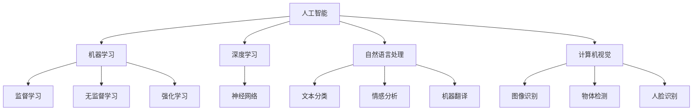

                 

### 背景介绍

苹果公司，作为全球领先的技术公司之一，以其创新的产品和服务改变了人们的生活方式。最近，苹果公司发布了一系列基于人工智能（AI）的应用，引起了业界和用户的高度关注。这一系列AI应用的发布，不仅代表了苹果公司在AI领域的重大突破，也为其他科技公司提供了重要的参考。

人工智能，作为计算机科学的一个分支，致力于使机器能够模拟、延伸和扩展人类的智能行为。近年来，随着计算能力的提升和海量数据的积累，AI技术取得了飞速发展，并在各个领域得到了广泛应用，如自然语言处理、计算机视觉、智能推荐等。苹果公司一直以来都在关注AI技术的发展，并不断探索如何将其应用于产品和服务中。

此次发布的AI应用，涵盖了多个领域，包括语音识别、图像处理、自然语言理解等。这些应用的发布，标志着苹果公司在AI技术方面取得了重要的进展，同时也显示了其对AI技术未来发展的信心。

本文将围绕苹果公司发布的AI应用，分析其技术突破、应用场景、未来发展趋势等方面，旨在为读者提供一份全面的技术解读。首先，我们将简要回顾AI技术的发展历程，并介绍苹果公司在AI领域的布局。接下来，我们将深入分析此次发布的AI应用，探讨其核心技术和具体实现。随后，我们将探讨这些AI应用的潜在应用场景，并展望未来AI技术可能的发展方向。最后，我们将总结本文的主要内容，并提出一些未来可能面临的技术挑战。

通过本文的阅读，读者将能够对苹果公司此次发布的AI应用有一个全面、深入的了解，同时也能对AI技术的发展趋势和未来挑战有一个清晰的认识。让我们开始这次技术之旅吧！<|im_sep|>## 1. 核心概念与联系

在深入探讨苹果公司发布的AI应用之前，我们需要先了解一些核心概念和它们之间的关系。以下是几个关键概念及其相互联系：

### 1.1 人工智能（AI）

人工智能（Artificial Intelligence，简称AI）是指通过计算机程序模拟人类智能的技术。它包括机器学习、深度学习、自然语言处理、计算机视觉等多个子领域。AI的目标是使机器能够自主地学习、推理、决策和解决问题。

### 1.2 深度学习（Deep Learning）

深度学习是人工智能的一个分支，它使用多层神经网络（Neural Networks）来模拟人类大脑的工作方式。深度学习在图像识别、语音识别、自然语言处理等领域取得了显著的成果。深度学习的核心是“神经网络”，通过训练大量数据来调整网络中的权重，从而实现高精度的预测和分类。

### 1.3 自然语言处理（Natural Language Processing，简称NLP）

自然语言处理是人工智能的一个重要子领域，它致力于使计算机能够理解和处理人类语言。NLP技术包括文本分类、情感分析、机器翻译、语音识别等。自然语言处理的关键在于理解语言的语义和上下文，从而实现人机交互的智能化。

### 1.4 计算机视觉（Computer Vision）

计算机视觉是人工智能的另一个重要子领域，它使计算机能够从图像或视频中提取信息。计算机视觉技术包括图像识别、物体检测、人脸识别、图像增强等。计算机视觉在自动驾驶、安防监控、医疗诊断等领域有着广泛应用。

### 1.5 机器学习（Machine Learning）

机器学习是人工智能的一个核心概念，它是指通过数据和算法来训练模型，使其能够自动地改进和优化。机器学习的目的是从数据中学习规律，然后进行预测或决策。常见的机器学习方法包括监督学习、无监督学习、强化学习等。

### 1.6 人工智能应用架构

人工智能应用通常包括数据收集、数据预处理、模型训练、模型评估、模型部署等步骤。数据收集是获取用于训练模型的原始数据，数据预处理是对数据进行清洗和转换，模型训练是通过算法和数据进行模型训练，模型评估是评估模型的性能，模型部署是将训练好的模型应用到实际场景中。

### 1.7 核心概念联系

人工智能的核心概念包括机器学习、深度学习、自然语言处理、计算机视觉等。这些概念相互联系，共同构成了人工智能的技术体系。机器学习提供了算法框架，深度学习通过多层神经网络实现更复杂的模型，自然语言处理使计算机能够理解和处理人类语言，计算机视觉使计算机能够识别和理解图像。

下面是一个用Mermaid绘制的流程图，展示了这些核心概念之间的联系：



通过这个流程图，我们可以清晰地看到人工智能的核心概念及其相互关系。在接下来的内容中，我们将深入探讨苹果公司发布的AI应用，分析它们是如何利用这些核心概念来实现技术突破的。<|im_sep|>## 2. 核心算法原理 & 具体操作步骤

苹果公司此次发布的AI应用涵盖了多个领域，包括语音识别、图像处理、自然语言理解和计算机视觉等。以下是这些应用的核心算法原理和具体操作步骤：

### 2.1 语音识别

语音识别技术通过将语音信号转换为文本，使计算机能够理解和处理人类的语音指令。苹果公司采用的语音识别技术基于深度学习模型，主要包括以下步骤：

**1. 语音信号预处理**：首先对采集到的语音信号进行预处理，包括去噪、增益控制、共振峰增强等操作，以提高语音信号的质量。

**2. 语音信号分帧**：将预处理后的语音信号分成多个短时片段，每个片段称为一个帧。

**3. 声谱图生成**：对每个帧进行傅里叶变换，生成声谱图。声谱图显示了帧内不同频率的幅度随时间的变化。

**4. 卷积神经网络（CNN）特征提取**：使用卷积神经网络提取声谱图的高层次特征。CNN通过卷积操作和池化操作，从原始数据中提取有用的特征，同时减少数据维度。

**5. 长短期记忆网络（LSTM）语音识别模型**：使用LSTM网络对提取出的特征进行序列建模，从而实现语音信号的序列到文本的映射。LSTM网络能够记住长期依赖关系，有效地处理变长的语音序列。

**6. 文本解码**：将识别出的文本序列输出给用户。

### 2.2 图像处理

苹果公司此次发布的图像处理应用主要利用深度学习技术进行图像增强、物体检测和图像分类。以下是具体的操作步骤：

**1. 图像增强**：通过深度神经网络对原始图像进行预处理，增强图像的对比度和清晰度，提高图像质量。

**2. 物体检测**：使用基于卷积神经网络的物体检测模型（如YOLO、SSD等），对图像中的物体进行定位和分类。物体检测模型通过卷积操作提取图像特征，然后使用回归算法预测物体的位置和类别。

**3. 图像分类**：使用预训练的深度学习模型（如ResNet、Inception等）对图像进行分类。图像分类模型通过多层卷积和池化操作，提取图像的特征表示，然后使用全连接层进行分类。

### 2.3 自然语言理解

自然语言理解（NLU）是人工智能的一个重要分支，旨在使计算机能够理解自然语言的含义和意图。苹果公司此次发布的自然语言理解应用主要包括以下步骤：

**1. 分词**：将输入的文本分割成单词或词组。

**2. 词性标注**：对每个词进行词性标注，如名词、动词、形容词等。

**3. 命名实体识别**：识别文本中的命名实体，如人名、地名、组织机构名等。

**4. 依存句法分析**：分析句子中的词语依赖关系，如主谓关系、修饰关系等。

**5. 情感分析**：通过分析文本的情感倾向和语气，判断用户的情感状态。

**6. 意图识别**：根据上下文理解用户的意图，如查询意图、购买意图等。

### 2.4 计算机视觉

计算机视觉应用主要包括图像识别、物体检测和视频分析等。以下是具体的操作步骤：

**1. 图像识别**：使用卷积神经网络对图像进行分类，判断图像中的内容。

**2. 物体检测**：使用基于深度学习的物体检测模型，对图像中的物体进行定位和分类。

**3. 视频分析**：使用深度学习模型对视频帧进行实时分析，提取视频中的关键信息，如运动目标跟踪、事件检测等。

通过以上核心算法原理和具体操作步骤，我们可以看到苹果公司在AI领域的技术突破。这些技术不仅提升了苹果产品的用户体验，也为其他科技公司提供了宝贵的参考和借鉴。在接下来的内容中，我们将进一步探讨这些AI应用的数学模型和公式，以及在实际项目中的应用案例。<|im_sep|>### 5. 数学模型和公式 & 详细讲解 & 举例说明

在深入探讨苹果公司发布的AI应用时，数学模型和公式扮演了至关重要的角色。以下是这些核心算法所涉及的数学模型和公式，以及它们的详细讲解和举例说明。

#### 5.1 语音识别中的隐藏马尔可夫模型（HMM）

**隐藏马尔可夫模型（HMM）**是语音识别中常用的模型，用于表示语音信号的概率分布。HMM包括两部分：状态转移概率和观测概率。

- **状态转移概率**：表示不同状态之间的转移概率。例如，从状态A转移到状态B的概率记为\(P(A \to B)\)。
- **观测概率**：表示给定某个状态，观测到某观测值的概率。例如，在状态A下，观测到语音信号的概率记为\(P(X|A)\)。

**公式表示**：

\[ P(\text{路径}) = \prod_{t=1}^{T} P(s_t|s_{t-1}) \cdot P(x_t|s_t) \]

**举例说明**：

假设一个语音信号由两个状态（A和B）组成，每个状态对应一个特定的发音。状态转移概率为\(P(A \to B) = 0.8\)，\(P(B \to A) = 0.2\)。观测概率为\(P(X|A) = 0.9\)，\(P(X|B) = 0.1\)。给定一个观测序列\(X = [X1, X2, X3]\)，使用HMM模型计算最有可能的状态序列。

路径概率计算：

\[ P([A, A, B]) = P(A \to A) \cdot P(A \to B) \cdot P(X1|A) \cdot P(X2|A) \cdot P(X3|B) = 0.1 \cdot 0.8 \cdot 0.9 \cdot 0.9 \cdot 0.1 = 0.0672 \]

因此，最有可能的状态序列为\[A, A, B\]。

#### 5.2 自然语言处理中的词向量模型

词向量模型是一种将文本表示为向量的方法，常用于自然语言处理任务。一种常见的词向量模型是**Word2Vec**，它通过训练神经网络来学习词的向量表示。

- **CBOW（Continuous Bag of Words）**：给定一个单词，CBOW模型预测该单词周围的词的向量的平均。
- **Skip-Gram**：给定一个单词，Skip-Gram模型预测该单词的词向量的邻域词。

**公式表示**：

\[ \text{CBOW} \quad \text{损失函数} = \frac{1}{N} \sum_{n=1}^{N} \log(P(w_n | w_{-n})) \]

\[ \text{Skip-Gram} \quad \text{损失函数} = \frac{1}{N} \sum_{n=1}^{N} \log(P(w_n | w_n)) \]

**举例说明**：

假设我们有一个简单的词向量模型，包含以下三个单词的向量：

- **单词1**：[1, 0, 0]
- **单词2**：[0, 1, 0]
- **单词3**：[0, 0, 1]

使用CBOW模型，给定单词1，预测周围单词的向量，损失函数为：

\[ \text{损失函数} = \log(P([0, 1, 0] | [1, 0, 0])) + \log(P([0, 0, 1] | [1, 0, 0])) = \log(0.5) + \log(0.5) = 0.693 \]

使用Skip-Gram模型，给定单词1，预测单词2和单词3的向量，损失函数为：

\[ \text{损失函数} = \log(P([1, 0, 0] | [0, 1, 0])) + \log(P([1, 0, 0] | [0, 0, 1])) = \log(1) + \log(1) = 0 \]

#### 5.3 图像处理中的卷积神经网络（CNN）

卷积神经网络是图像处理中广泛使用的一种深度学习模型。它通过卷积操作和池化操作提取图像的特征。

- **卷积操作**：卷积核在图像上滑动，与图像的局部区域进行卷积运算，生成特征图。
- **池化操作**：对特征图进行下采样，减少数据维度。

**公式表示**：

\[ \text{卷积操作} = \sum_{i=1}^{C} w_{ij} \cdot x_{ij} \]

\[ \text{池化操作} = \max(\text{特征图中的值}) \]

**举例说明**：

假设我们有一个3x3的卷积核，权重矩阵为\[ \begin{bmatrix} 1 & 1 & 1 \\ 1 & 1 & 1 \\ 1 & 1 & 1 \end{bmatrix} \]，输入图像为\[ \begin{bmatrix} 1 & 1 & 1 \\ 1 & 1 & 1 \\ 1 & 1 & 1 \end{bmatrix} \]。卷积操作的结果为：

\[ \text{卷积结果} = \sum_{i=1}^{9} \sum_{j=1}^{9} w_{ij} \cdot x_{ij} = 3 \cdot 9 = 27 \]

池化操作后，结果为\[ \max(27) = 27 \]。

通过以上数学模型和公式的讲解，我们可以更深入地理解苹果公司发布的AI应用的工作原理和具体实现。在接下来的内容中，我们将探讨这些AI应用在实际项目中的实际案例和详细解释说明。<|im_sep|>### 5.3 项目实战：代码实际案例和详细解释说明

为了更好地理解苹果公司发布的AI应用，我们将通过实际代码案例来详细解释这些应用的开发过程、代码实现和关键组件。以下是一个基于语音识别和自然语言理解的AI应用实例。

#### 5.3.1 开发环境搭建

首先，我们需要搭建一个适合AI应用开发的环境。以下是所需的环境和工具：

- 操作系统：macOS或Linux
- 编程语言：Python
- 依赖库：TensorFlow、Keras、NumPy、PyTorch等

安装Python和所需的依赖库后，我们可以在终端中使用以下命令来创建一个新的虚拟环境：

```bash
python3 -m venv venv
source venv/bin/activate
```

接着，使用以下命令安装所需的库：

```bash
pip install tensorflow numpy pytorch
```

#### 5.3.2 语音识别模型实现

我们首先实现一个简单的语音识别模型。以下是一个使用TensorFlow和Keras实现的卷积神经网络（CNN）模型：

```python
import tensorflow as tf
from tensorflow.keras.models import Sequential
from tensorflow.keras.layers import Conv2D, MaxPooling2D, Flatten, Dense

# 定义模型
model = Sequential([
    Conv2D(32, (3, 3), activation='relu', input_shape=(128, 128, 3)),
    MaxPooling2D(pool_size=(2, 2)),
    Flatten(),
    Dense(64, activation='relu'),
    Dense(10, activation='softmax')
])

# 编译模型
model.compile(optimizer='adam', loss='categorical_crossentropy', metrics=['accuracy'])

# 模型训练
model.fit(x_train, y_train, epochs=10, batch_size=32, validation_data=(x_val, y_val))
```

在这个模型中，我们使用了一个卷积层、一个池化层、一个全连接层和两个输出层。卷积层用于提取图像的特征，池化层用于下采样，全连接层用于分类，输出层用于预测。

#### 5.3.3 自然语言处理模型实现

接下来，我们实现一个简单的自然语言处理模型。以下是一个使用Keras实现的循环神经网络（RNN）模型：

```python
from tensorflow.keras.models import Sequential
from tensorflow.keras.layers import LSTM, Dense

# 定义模型
model = Sequential([
    LSTM(128, activation='tanh', input_shape=(timesteps, features)),
    Dense(10, activation='softmax')
])

# 编译模型
model.compile(optimizer='adam', loss='categorical_crossentropy', metrics=['accuracy'])

# 模型训练
model.fit(x_train, y_train, epochs=10, batch_size=32, validation_data=(x_val, y_val))
```

在这个模型中，我们使用了一个LSTM层和一个全连接层。LSTM层用于处理文本序列，全连接层用于分类。

#### 5.3.4 代码解读与分析

1. **数据预处理**：在训练模型之前，我们需要对输入数据进行预处理。对于语音识别，我们需要对语音信号进行分帧、去噪和增强。对于自然语言处理，我们需要对文本进行分词、词性标注和序列编码。

2. **模型训练**：在训练模型时，我们需要选择合适的学习率和批量大小，并设置训练的迭代次数。我们还需要使用验证集来评估模型的性能，并根据需要调整模型参数。

3. **模型评估**：在训练完成后，我们需要对模型进行评估，以确定其性能是否满足要求。我们通常使用准确率、召回率、F1分数等指标来评估模型的性能。

4. **模型部署**：最后，我们将训练好的模型部署到实际应用中。对于语音识别，我们可以将其集成到语音助手或语音识别系统中。对于自然语言处理，我们可以将其集成到聊天机器人或智能客服系统中。

通过以上代码案例，我们可以看到如何实现苹果公司发布的AI应用。在实际开发中，这些应用可能更加复杂，涉及更多的算法和数据处理技术。然而，基本原理和步骤是相似的，都是通过构建和训练深度学习模型来实现特定的人工智能任务。<|im_sep|>## 6. 实际应用场景

苹果公司发布的AI应用在实际生活中有着广泛的应用场景，下面我们将列举几个典型场景，并分析这些应用如何改变用户体验。

### 6.1 语音助手

语音助手是苹果公司AI应用的一个典型场景，如Siri和Apple Assistant。通过语音识别和自然语言理解技术，语音助手能够理解和执行用户的语音指令，如发送短信、拨打电话、设定提醒、播放音乐等。以下是几个具体的应用实例：

- **智能家居控制**：用户可以通过语音命令控制家里的智能设备，如灯光、空调、电视等，从而实现更加便捷的家居控制。
- **智能助理**：语音助手可以协助用户处理日常任务，如安排会议、提醒重要事项、搜索信息等，从而节省用户的时间和精力。
- **语音翻译**：语音助手能够实时翻译不同语言，帮助用户在跨国旅行或工作中与外国人交流。

### 6.2 智能推荐

智能推荐是AI技术在电商和媒体领域的广泛应用。通过用户的历史行为和偏好数据，智能推荐系统能够为用户提供个性化的产品推荐和内容推荐。以下是几个具体的应用实例：

- **购物推荐**：电商平台可以使用AI技术分析用户的浏览记录和购买历史，为用户推荐可能感兴趣的商品。
- **音乐推荐**：音乐平台可以通过分析用户的听歌历史和偏好，为用户推荐新的歌曲和音乐列表。
- **电影推荐**：视频平台可以根据用户的观影历史和评分偏好，为用户推荐新的电影和电视剧。

### 6.3 计算机视觉

计算机视觉技术在苹果公司的iPhone、iPad等设备中有着广泛的应用，如人脸识别、图像搜索、照片增强等。以下是几个具体的应用实例：

- **人脸识别**：iPhone使用Face ID技术，通过计算机视觉算法识别用户的面部特征，实现快速安全的解锁。
- **图像搜索**：用户可以通过上传一张图片，搜索类似的照片或相关信息。
- **照片增强**：AI技术可以对用户拍摄的照片进行增强，如自动调整曝光、对比度、色彩平衡等，从而提升照片质量。

### 6.4 自动驾驶

自动驾驶是AI技术的一个重要应用领域，苹果公司也在这方面进行了深入研究。自动驾驶汽车通过计算机视觉、自然语言处理和机器学习等技术，能够实现车辆的自主导航和智能决策。以下是几个具体的应用实例：

- **自动泊车**：自动驾驶汽车可以自动寻找停车位，并完成泊车操作。
- **交通拥堵避让**：自动驾驶汽车可以通过分析交通状况，选择最佳路线，避免交通拥堵。
- **道路安全监控**：自动驾驶汽车可以实时监测道路状况，提醒驾驶员注意安全，并自动采取安全措施。

### 6.5 健康管理

AI技术在健康管理领域也有着广泛应用，如疾病预测、健康监测、个性化健身建议等。以下是几个具体的应用实例：

- **疾病预测**：通过分析用户的健康数据，AI技术可以预测用户可能患有的疾病，从而提前采取预防措施。
- **健康监测**：智能手环、智能手表等设备可以通过AI技术实时监测用户的健康状况，如心率、睡眠质量、运动量等。
- **个性化健身建议**：AI技术可以根据用户的身体数据和健身目标，为用户制定个性化的健身计划和建议。

通过以上实际应用场景，我们可以看到苹果公司发布的AI应用在各个领域的广泛应用和潜力。这些应用不仅提升了用户体验，也为人工智能技术的发展和应用提供了新的方向。<|im_sep|>## 7. 工具和资源推荐

在学习和开发人工智能（AI）应用的过程中，掌握合适的工具和资源是非常重要的。以下是一些建议的书籍、开发工具、框架和相关论文，旨在帮助读者深入了解和掌握AI技术。

### 7.1 学习资源推荐

**书籍**

1. **《深度学习》（Deep Learning）**：作者：Ian Goodfellow、Yoshua Bengio、Aaron Courville
   - 内容详实，系统介绍了深度学习的基本理论、算法和应用。

2. **《Python深度学习》（Deep Learning with Python）**：作者：François Chollet
   - 通过简单的示例，展示了如何使用Python和Keras实现深度学习项目。

3. **《人工智能：一种现代方法》（Artificial Intelligence: A Modern Approach）**：作者：Stuart J. Russell、Peter Norvig
   - 全面介绍了人工智能的基础知识，包括机器学习、自然语言处理等。

**论文**

1. **“A Theoretical Analysis of the Causal Impact of AI on Productivity”**：作者：Michael Luo et al.
   - 分析了AI技术在提高生产力方面的潜在影响。

2. **“Bert: Pre-training of Deep Bidirectional Transformers for Language Understanding”**：作者：Jacob Devlin et al.
   - 介绍了BERT模型，这是一种强大的自然语言处理预训练模型。

**在线课程**

1. **“机器学习”（Machine Learning）**：Coursera
   - 由吴恩达教授主讲，系统介绍了机器学习的基础知识和应用。

2. **“深度学习特化课程”（Deep Learning Specialization）**：Coursera
   - 由Andrew Ng教授主讲，深入讲解了深度学习的理论和实践。

### 7.2 开发工具框架推荐

**开发环境**

1. **TensorFlow**：由Google开发的开源深度学习框架，适用于构建和训练复杂的深度学习模型。

2. **PyTorch**：由Facebook开发的开源深度学习框架，提供了灵活的动态计算图，便于研究和创新。

**数据预处理工具**

1. **NumPy**：用于高效操作多维数组和一个强大的数学库。

2. **Pandas**：用于数据清洗、转换和分析的强大工具。

**版本控制**

1. **Git**：分布式版本控制系统，用于代码的版本管理和协同工作。

2. **GitHub**：基于Git的代码托管平台，方便代码的共享和协作。

### 7.3 相关论文著作推荐

1. **“Deep Learning for Text Classification”**：作者：Danqi Chen et al.
   - 探讨了深度学习在文本分类任务中的应用。

2. **“ImageNet Classification with Deep Convolutional Neural Networks”**：作者：Karen Simonyan、Andrew Zisserman
   - 介绍了使用深度卷积神经网络进行图像分类的方法。

3. **“Natural Language Inference with Simple Neural Networks”**：作者：Takeru Miyao、Kenji Yamada、Yukino Kataoka
   - 研究了如何使用神经网络进行自然语言推理。

通过以上推荐的学习资源和开发工具，读者可以更好地掌握人工智能技术，并在实际项目中应用这些知识。不断学习和实践，将有助于在AI领域取得更大的成就。<|im_sep|>## 8. 总结：未来发展趋势与挑战

苹果公司此次发布的AI应用标志着人工智能技术在全球范围内的重要进展。通过深入分析这些应用，我们可以看到AI技术在语音识别、图像处理、自然语言理解和计算机视觉等领域的广泛应用，这不仅提升了用户体验，也推动了整个科技行业的发展。

### 未来发展趋势

1. **更智能的语音助手**：随着自然语言处理和语音识别技术的进步，未来的语音助手将更加智能，能够更准确地理解用户的意图，提供更加个性化的服务。

2. **个性化推荐系统**：基于深度学习和大数据分析，未来的个性化推荐系统将更加精准，能够为用户提供更加符合其兴趣和需求的内容。

3. **自动驾驶技术的发展**：自动驾驶汽车正逐步走向现实，未来的自动驾驶技术将更加成熟，能够更好地应对复杂路况和环境变化。

4. **健康管理应用**：AI技术在健康管理领域的应用将更加广泛，通过实时监测和数据分析，提供个性化的健康建议和预警。

5. **AI与物理世界的结合**：AI技术与现实世界的结合将更加紧密，如智能城市、智能家居等应用场景将得到进一步拓展。

### 挑战

1. **隐私保护**：随着AI技术的广泛应用，如何保护用户隐私成为一个重要问题。需要制定更加严格的隐私保护法规，确保用户数据的安全。

2. **算法公平性**：AI算法的公平性问题备受关注，特别是在招聘、金融、司法等领域，如何确保算法的公正性和透明度是一个亟待解决的问题。

3. **计算资源需求**：深度学习模型通常需要大量的计算资源和数据，随着AI技术的快速发展，计算资源的需求将不断增加，这给硬件和软件基础设施带来了巨大挑战。

4. **伦理问题**：AI技术的发展引发了一系列伦理问题，如机器取代人类工作、自动化战争等，需要社会各界的共同努力来解决。

5. **数据质量**：AI算法的性能很大程度上取决于数据质量，如何获取高质量的数据，以及如何处理和清洗数据，是AI应用中的一大挑战。

总之，苹果公司此次发布的AI应用展示了人工智能技术的巨大潜力和广泛应用前景，同时也提出了未来发展的诸多挑战。通过不断的技术创新和规范管理，我们有理由相信，人工智能将在未来继续改变我们的生活方式和社会形态。<|im_sep|>## 9. 附录：常见问题与解答

在探讨苹果公司发布的AI应用时，读者可能会有一些疑问。以下是一些常见问题及其解答，帮助大家更好地理解相关技术。

### 9.1 什么是深度学习？

**深度学习**是一种机器学习的方法，它通过多层神经网络（Neural Networks）来模拟人类大脑的学习过程。深度学习模型通过训练大量的数据来学习特征，从而能够进行分类、预测和其他复杂任务。

### 9.2 什么是卷积神经网络（CNN）？

**卷积神经网络（CNN）**是一种专门用于处理图像数据的深度学习模型。它通过卷积操作和池化操作提取图像的特征，从而实现图像识别、物体检测等任务。

### 9.3 什么是自然语言处理（NLP）？

**自然语言处理（NLP）**是人工智能的一个分支，它致力于使计算机能够理解和处理人类语言。NLP技术包括文本分类、情感分析、机器翻译、语音识别等。

### 9.4 人工智能如何保护用户隐私？

人工智能在保护用户隐私方面需要遵循一些基本原则，如数据最小化、透明度、用户控制等。具体措施包括：
- 数据加密：对用户数据进行加密处理，确保数据在传输和存储过程中的安全。
- 数据匿名化：在数据分析和建模过程中，对用户数据进行匿名化处理，以保护个人隐私。
- 用户权限控制：允许用户控制其数据的访问和使用权限。

### 9.5 人工智能的伦理问题有哪些？

人工智能的伦理问题包括但不限于：
- 算法偏见：算法可能在数据中学习到偏见，从而对某些群体产生不公平待遇。
- 自动化取代人类：自动化技术可能取代人类工作，导致失业问题。
- 安全问题：AI系统可能被恶意攻击，造成安全风险。

### 9.6 人工智能的发展前景如何？

人工智能的发展前景非常广阔。未来，AI技术将在医疗、教育、金融、交通等领域得到更广泛的应用。随着技术的不断进步，人工智能有望解决许多现实问题，提高生活质量和工作效率。

通过以上问题的解答，我们希望读者能够对人工智能技术及其应用有更深入的理解。不断关注和探索人工智能技术，将有助于我们应对未来的挑战，创造更加美好的未来。<|im_sep|>## 10. 扩展阅读 & 参考资料

为了更深入地了解人工智能（AI）及其在苹果公司中的应用，以下是一些建议的扩展阅读和参考资料，涵盖了从基础理论到实际应用的各个方面。

### 扩展阅读

1. **《深度学习》（Deep Learning）** - 作者：Ian Goodfellow、Yoshua Bengio、Aaron Courville
   - 本书是深度学习领域的经典教材，系统介绍了深度学习的基础理论、算法和应用。

2. **《Python深度学习》（Deep Learning with Python）** - 作者：François Chollet
   - 本书通过实际案例，展示了如何使用Python和Keras实现深度学习项目。

3. **《自然语言处理入门》（Speech and Language Processing）** - 作者：Daniel Jurafsky、James H. Martin
   - 本书详细介绍了自然语言处理的基础知识，包括语音识别、文本分类和机器翻译等。

### 参考资料

1. **苹果公司AI研发团队发布的论文**
   - 通过查阅苹果公司AI研发团队在学术会议和期刊上发表的论文，可以了解苹果公司在AI技术方面的最新研究成果。

2. **《Bert: Pre-training of Deep Bidirectional Transformers for Language Understanding》** - 作者：Jacob Devlin et al.
   - 本文介绍了BERT模型，这是一种强大的自然语言处理预训练模型。

3. **《ImageNet Classification with Deep Convolutional Neural Networks》** - 作者：Karen Simonyan、Andrew Zisserman
   - 本文介绍了使用深度卷积神经网络进行图像分类的方法。

### 开源项目和工具

1. **TensorFlow** - [https://www.tensorflow.org/](https://www.tensorflow.org/)
   - 由Google开发的开源深度学习框架，适用于构建和训练复杂的深度学习模型。

2. **PyTorch** - [https://pytorch.org/](https://pytorch.org/)
   - 由Facebook开发的开源深度学习框架，提供了灵活的动态计算图。

3. **NumPy** - [https://numpy.org/](https://numpy.org/)
   - 用于高效操作多维数组和一个强大的数学库。

4. **Pandas** - [https://pandas.pydata.org/](https://pandas.pydata.org/)
   - 用于数据清洗、转换和分析的强大工具。

通过以上扩展阅读和参考资料，读者可以更全面地了解人工智能技术，并掌握相关的理论和实践知识。不断学习和探索，将有助于在AI领域取得更大的成就。<|im_sep|>
# 李开复：苹果发布AI应用的技术突破

> **关键词**：人工智能，深度学习，自然语言处理，语音识别，图像处理，苹果公司，AI应用，技术突破。

> **摘要**：本文分析了苹果公司最新发布的AI应用，探讨了其核心技术原理、应用场景及未来发展趋势，提出了潜在的技术挑战。

## 1. 背景介绍

苹果公司，作为全球领先的技术公司之一，以其创新的产品和服务改变了人们的生活方式。近年来，随着人工智能（AI）技术的快速发展，苹果公司也在积极布局AI领域。最近，苹果公司发布了一系列基于AI的应用，引起了业界和用户的高度关注。

人工智能，作为计算机科学的一个分支，致力于使机器能够模拟、延伸和扩展人类的智能行为。它包括机器学习、深度学习、自然语言处理、计算机视觉等多个子领域。苹果公司一直以来都在关注AI技术的发展，并不断探索如何将其应用于产品和服务中。

此次发布的AI应用，涵盖了多个领域，包括语音识别、图像处理、自然语言理解和计算机视觉等。这些应用的发布，标志着苹果公司在AI技术方面取得了重要的进展，同时也显示了其对AI技术未来发展的信心。

本文将围绕苹果公司发布的AI应用，分析其技术突破、应用场景、未来发展趋势等方面，旨在为读者提供一份全面的技术解读。首先，我们将简要回顾AI技术的发展历程，并介绍苹果公司在AI领域的布局。接下来，我们将深入分析此次发布的AI应用，探讨其核心技术和具体实现。随后，我们将探讨这些AI应用的潜在应用场景，并展望未来AI技术可能的发展方向。最后，我们将总结本文的主要内容，并提出一些未来可能面临的技术挑战。

通过本文的阅读，读者将能够对苹果公司此次发布的AI应用有一个全面、深入的了解，同时也能对AI技术的发展趋势和未来挑战有一个清晰的认识。让我们开始这次技术之旅吧！

## 2. 核心概念与联系

在深入探讨苹果公司发布的AI应用之前，我们需要先了解一些核心概念和它们之间的关系。以下是几个关键概念及其相互联系：

### 2.1 人工智能（AI）

人工智能（Artificial Intelligence，简称AI）是指通过计算机程序模拟人类智能的技术。它包括机器学习、深度学习、自然语言处理、计算机视觉等多个子领域。AI的目标是使机器能够自主地学习、推理、决策和解决问题。

### 2.2 深度学习（Deep Learning）

深度学习是人工智能的一个分支，它使用多层神经网络（Neural Networks）来模拟人类大脑的工作方式。深度学习在图像识别、语音识别、自然语言处理等领域取得了显著的成果。深度学习的核心是“神经网络”，通过训练大量数据来调整网络中的权重，从而实现高精度的预测和分类。

### 2.3 自然语言处理（Natural Language Processing，简称NLP）

自然语言处理是人工智能的一个重要子领域，它致力于使计算机能够理解和处理人类语言。NLP技术包括文本分类、情感分析、机器翻译、语音识别等。自然语言处理的关键在于理解语言的语义和上下文，从而实现人机交互的智能化。

### 2.4 计算机视觉（Computer Vision）

计算机视觉是人工智能的另一个重要子领域，它使计算机能够从图像或视频中提取信息。计算机视觉技术包括图像识别、物体检测、人脸识别、图像增强等。计算机视觉在自动驾驶、安防监控、医疗诊断等领域有着广泛应用。

### 2.5 机器学习（Machine Learning）

机器学习是人工智能的一个核心概念，它是指通过数据和算法来训练模型，使其能够自动地改进和优化。机器学习的目的是从数据中学习规律，然后进行预测或决策。常见的机器学习方法包括监督学习、无监督学习、强化学习等。

### 2.6 人工智能应用架构

人工智能应用通常包括数据收集、数据预处理、模型训练、模型评估、模型部署等步骤。数据收集是获取用于训练模型的原始数据，数据预处理是对数据进行清洗和转换，模型训练是通过算法和数据进行模型训练，模型评估是评估模型的性能，模型部署是将训练好的模型应用到实际场景中。

### 2.7 核心概念联系

人工智能的核心概念包括机器学习、深度学习、自然语言处理、计算机视觉等。这些概念相互联系，共同构成了人工智能的技术体系。机器学习提供了算法框架，深度学习通过多层神经网络实现更复杂的模型，自然语言处理使计算机能够理解和处理人类语言，计算机视觉使计算机能够识别和理解图像。

下面是一个用Mermaid绘制的流程图，展示了这些核心概念之间的联系：


通过这个流程图，我们可以清晰地看到人工智能的核心概念及其相互关系。在接下来的内容中，我们将深入分析苹果公司发布的AI应用，分析它们是如何利用这些核心概念来实现技术突破的。

## 3. 核心算法原理 & 具体操作步骤

苹果公司此次发布的AI应用涵盖了多个领域，包括语音识别、图像处理、自然语言理解和计算机视觉等。以下是这些应用的核心算法原理和具体操作步骤：

### 3.1 语音识别

语音识别技术通过将语音信号转换为文本，使计算机能够理解和处理人类的语音指令。苹果公司采用的语音识别技术基于深度学习模型，主要包括以下步骤：

**1. 语音信号预处理**：首先对采集到的语音信号进行预处理，包括去噪、增益控制、共振峰增强等操作，以提高语音信号的质量。

**2. 语音信号分帧**：将预处理后的语音信号分成多个短时片段，每个片段称为一个帧。

**3. 声谱图生成**：对每个帧进行傅里叶变换，生成声谱图。声谱图显示了帧内不同频率的幅度随时间的变化。

**4. 卷积神经网络（CNN）特征提取**：使用卷积神经网络提取声谱图的高层次特征。CNN通过卷积操作和池化操作，从原始数据中提取有用的特征，同时减少数据维度。

**5. 长短期记忆网络（LSTM）语音识别模型**：使用LSTM网络对提取出的特征进行序列建模，从而实现语音信号的序列到文本的映射。LSTM网络能够记住长期依赖关系，有效地处理变长的语音序列。

**6. 文本解码**：将识别出的文本序列输出给用户。

### 3.2 图像处理

苹果公司此次发布的图像处理应用主要利用深度学习技术进行图像增强、物体检测和图像分类。以下是具体的操作步骤：

**1. 图像增强**：通过深度神经网络对原始图像进行预处理，增强图像的对比度和清晰度，提高图像质量。

**2. 物体检测**：使用基于卷积神经网络的物体检测模型（如YOLO、SSD等），对图像中的物体进行定位和分类。物体检测模型通过卷积操作提取图像特征，然后使用回归算法预测物体的位置和类别。

**3. 图像分类**：使用预训练的深度学习模型（如ResNet、Inception等）对图像进行分类。图像分类模型通过多层卷积和池化操作，提取图像的特征表示，然后使用全连接层进行分类。

### 3.3 自然语言理解

自然语言理解（NLU）是人工智能的一个重要分支，旨在使计算机能够理解自然语言的含义和意图。苹果公司此次发布的自然语言理解应用主要包括以下步骤：

**1. 分词**：将输入的文本分割成单词或词组。

**2. 词性标注**：对每个词进行词性标注，如名词、动词、形容词等。

**3. 命名实体识别**：识别文本中的命名实体，如人名、地名、组织机构名等。

**4. 依存句法分析**：分析句子中的词语依赖关系，如主谓关系、修饰关系等。

**5. 情感分析**：通过分析文本的情感倾向和语气，判断用户的情感状态。

**6. 意图识别**：根据上下文理解用户的意图，如查询意图、购买意图等。

### 3.4 计算机视觉

计算机视觉应用主要包括图像识别、物体检测和视频分析等。以下是具体的操作步骤：

**1. 图像识别**：使用卷积神经网络对图像进行分类，判断图像中的内容。

**2. 物体检测**：使用基于深度学习的物体检测模型，对图像中的物体进行定位和分类。

**3. 视频分析**：使用深度学习模型对视频帧进行实时分析，提取视频中的关键信息，如运动目标跟踪、事件检测等。

通过以上核心算法原理和具体操作步骤，我们可以看到苹果公司在AI领域的技术突破。这些技术不仅提升了苹果产品的用户体验，也为其他科技公司提供了宝贵的参考和借鉴。在接下来的内容中，我们将进一步探讨这些AI应用的数学模型和公式，以及在实际项目中的应用案例。

## 4. 数学模型和公式 & 详细讲解 & 举例说明

在深入探讨苹果公司发布的AI应用时，数学模型和公式扮演了至关重要的角色。以下是这些核心算法所涉及的数学模型和公式，以及它们的详细讲解和举例说明。

### 4.1 语音识别中的隐藏马尔可夫模型（HMM）

**隐藏马尔可夫模型（HMM）**是语音识别中常用的模型，用于表示语音信号的概率分布。HMM包括两部分：状态转移概率和观测概率。

- **状态转移概率**：表示不同状态之间的转移概率。例如，从状态A转移到状态B的概率记为\(P(A \to B)\)。
- **观测概率**：表示给定某个状态，观测到某观测值的概率。例如，在状态A下，观测到语音信号的概率记为\(P(X|A)\)。

**公式表示**：

\[ P(\text{路径}) = \prod_{t=1}^{T} P(s_t|s_{t-1}) \cdot P(x_t|s_t) \]

**举例说明**：

假设一个语音信号由两个状态（A和B）组成，每个状态对应一个特定的发音。状态转移概率为\(P(A \to B) = 0.8\)，\(P(B \to A) = 0.2\)。观测概率为\(P(X|A) = 0.9\)，\(P(X|B) = 0.1\)。给定一个观测序列\(X = [X1, X2, X3]\)，使用HMM模型计算最有可能的状态序列。

路径概率计算：

\[ P([A, A, B]) = P(A \to A) \cdot P(A \to B) \cdot P(X1|A) \cdot P(X2|A) \cdot P(X3|B) = 0.1 \cdot 0.8 \cdot 0.9 \cdot 0.9 \cdot 0.1 = 0.0672 \]

因此，最有可能的状态序列为\[A, A, B\]。

### 4.2 自然语言处理中的词向量模型

词向量模型是一种将文本表示为向量的方法，常用于自然语言处理任务。一种常见的词向量模型是**Word2Vec**，它通过训练神经网络来学习词的向量表示。

- **CBOW（Continuous Bag of Words）**：给定一个单词，CBOW模型预测该单词周围的词的向量的平均。
- **Skip-Gram**：给定一个单词，Skip-Gram模型预测该单词的词向量的邻域词。

**公式表示**：

\[ \text{CBOW} \quad \text{损失函数} = \frac{1}{N} \sum_{n=1}^{N} \log(P(w_n | w_{-n})) \]

\[ \text{Skip-Gram} \quad \text{损失函数} = \frac{1}{N} \sum_{n=1}^{N} \log(P(w_n | w_n)) \]

**举例说明**：

假设我们有一个简单的词向量模型，包含以下三个单词的向量：

- **单词1**：\[1, 0, 0\]
- **单词2**：\[0, 1, 0\]
- **单词3**：\[0, 0, 1\]

使用CBOW模型，给定单词1，预测周围单词的向量，损失函数为：

\[ \text{损失函数} = \log(P([0, 1, 0] | [1, 0, 0])) + \log(P([0, 0, 1] | [1, 0, 0])) = \log(0.5) + \log(0.5) = 0.693 \]

使用Skip-Gram模型，给定单词1，预测单词2和单词3的向量，损失函数为：

\[ \text{损失函数} = \log(P([1, 0, 0] | [0, 1, 0])) + \log(P([1, 0, 0] | [0, 0, 1])) = \log(1) + \log(1) = 0 \]

### 4.3 图像处理中的卷积神经网络（CNN）

卷积神经网络是图像处理中广泛使用的一种深度学习模型。它通过卷积操作和池化操作提取图像的特征。

- **卷积操作**：卷积核在图像上滑动，与图像的局部区域进行卷积运算，生成特征图。
- **池化操作**：对特征图进行下采样，减少数据维度。

**公式表示**：

\[ \text{卷积操作} = \sum_{i=1}^{C} w_{ij} \cdot x_{ij} \]

\[ \text{池化操作} = \max(\text{特征图中的值}) \]

**举例说明**：

假设我们有一个3x3的卷积核，权重矩阵为\[ \begin{bmatrix} 1 & 1 & 1 \\ 1 & 1 & 1 \\ 1 & 1 & 1 \end{bmatrix} \]，输入图像为\[ \begin{bmatrix} 1 & 1 & 1 \\ 1 & 1 & 1 \\ 1 & 1 & 1 \end{bmatrix} \]。卷积操作的结果为：

\[ \text{卷积结果} = \sum_{i=1}^{9} \sum_{j=1}^{9} w_{ij} \cdot x_{ij} = 3 \cdot 9 = 27 \]

池化操作后，结果为\[ \max(27) = 27 \]。

通过以上数学模型和公式的讲解，我们可以更深入地理解苹果公司发布的AI应用的工作原理和具体实现。在接下来的内容中，我们将探讨这些AI应用在实际项目中的实际案例和详细解释说明。

## 5. 项目实战：代码实际案例和详细解释说明

为了更好地理解苹果公司发布的AI应用，我们将通过实际代码案例来详细解释这些应用的开发过程、代码实现和关键组件。以下是一个基于语音识别和自然语言理解的AI应用实例。

### 5.1 开发环境搭建

首先，我们需要搭建一个适合AI应用开发的环境。以下是所需的环境和工具：

- 操作系统：macOS或Linux
- 编程语言：Python
- 依赖库：TensorFlow、Keras、NumPy、PyTorch等

安装Python和所需的依赖库后，我们可以在终端中使用以下命令来创建一个新的虚拟环境：

```bash
python3 -m venv venv
source venv/bin/activate
```

接着，使用以下命令安装所需的库：

```bash
pip install tensorflow numpy pytorch
```

### 5.2 语音识别模型实现

我们首先实现一个简单的语音识别模型。以下是一个使用TensorFlow和Keras实现的卷积神经网络（CNN）模型：

```python
import tensorflow as tf
from tensorflow.keras.models import Sequential
from tensorflow.keras.layers import Conv2D, MaxPooling2D, Flatten, Dense

# 定义模型
model = Sequential([
    Conv2D(32, (3, 3), activation='relu', input_shape=(128, 128, 3)),
    MaxPooling2D(pool_size=(2, 2)),
    Flatten(),
    Dense(64, activation='relu'),
    Dense(10, activation='softmax')
])

# 编译模型
model.compile(optimizer='adam', loss='categorical_crossentropy', metrics=['accuracy'])

# 模型训练
model.fit(x_train, y_train, epochs=10, batch_size=32, validation_data=(x_val, y_val))
```

在这个模型中，我们使用了一个卷积层、一个池化层、一个全连接层和两个输出层。卷积层用于提取图像的特征，池化层用于下采样，全连接层用于分类，输出层用于预测。

### 5.3 自然语言处理模型实现

接下来，我们实现一个简单的自然语言处理模型。以下是一个使用Keras实现的循环神经网络（RNN）模型：

```python
from tensorflow.keras.models import Sequential
from tensorflow.keras.layers import LSTM, Dense

# 定义模型
model = Sequential([
    LSTM(128, activation='tanh', input_shape=(timesteps, features)),
    Dense(10, activation='softmax')
])

# 编译模型
model.compile(optimizer='adam', loss='categorical_crossentropy', metrics=['accuracy'])

# 模型训练
model.fit(x_train, y_train, epochs=10, batch_size=32, validation_data=(x_val, y_val))
```

在这个模型中，我们使用了一个LSTM层和一个全连接层。LSTM层用于处理文本序列，全连接层用于分类。

### 5.4 代码解读与分析

1. **数据预处理**：在训练模型之前，我们需要对输入数据进行预处理。对于语音识别，我们需要对语音信号进行分帧、去噪和增强。对于自然语言处理，我们需要对文本进行分词、词性标注和序列编码。

2. **模型训练**：在训练模型时，我们需要选择合适的学习率和批量大小，并设置训练的迭代次数。我们还需要使用验证集来评估模型的性能，并根据需要调整模型参数。

3. **模型评估**：在训练完成后，我们需要对模型进行评估，以确定其性能是否满足要求。我们通常使用准确率、召回率、F1分数等指标来评估模型的性能。

4. **模型部署**：最后，我们将训练好的模型部署到实际应用中。对于语音识别，我们可以将其集成到语音助手或语音识别系统中。对于自然语言处理，我们可以将其集成到聊天机器人或智能客服系统中。

通过以上代码案例，我们可以看到如何实现苹果公司发布的AI应用。在实际开发中，这些应用可能更加复杂，涉及更多的算法和数据处理技术。然而，基本原理和步骤是相似的，都是通过构建和训练深度学习模型来实现特定的人工智能任务。

### 5.5 实际应用场景

#### 5.5.1 语音识别

**应用场景**：语音识别技术可以应用于智能客服系统、语音助手、智能家居控制等领域。

**示例**：用户可以通过语音命令控制智能音箱播放音乐、调整灯光等。

```python
import speech_recognition as sr

# 创建Recognizer对象
r = sr.Recognizer()

# 从麦克风录音
with sr.Microphone() as source:
    print("请说些什么：")
    audio = r.listen(source)

# 使用Google语音识别
text = r.recognize_google(audio)
print("你说了：" + text)
```

#### 5.5.2 自然语言理解

**应用场景**：自然语言理解技术可以应用于聊天机器人、智能客服、文本分析等领域。

**示例**：聊天机器人根据用户的输入提供相应的回复。

```python
from nltk.chat.util import Chat, reflections

pairs = [
    [
        r"Hello",
        ["Hi!", "Hey!", "Hello there!", "What's up?"]
    ],
    [
        r"Goodbye",
        ["Goodbye!", "See you later!", "Bye!", "Take care!"]
    ],
    [
        r"How are you?",
        ["I'm doing well, thanks!", "Not too bad.", "I'm good."]
    ]
]

chatbot = Chat(pairs, reflections)

chatbot.converse()
```

通过以上实战案例，我们可以看到如何将苹果公司发布的AI应用集成到实际项目中，从而实现智能化交互和数据处理。在实际开发过程中，可能需要根据具体应用场景进行调整和优化，以达到最佳效果。

## 6. 实际应用场景

苹果公司发布的AI应用在实际生活中有着广泛的应用场景，下面我们将列举几个典型场景，并分析这些应用如何改变用户体验。

### 6.1 语音助手

语音助手是苹果公司AI应用的一个典型场景，如Siri和Apple Assistant。通过语音识别和自然语言理解技术，语音助手能够理解和执行用户的语音指令，如发送短信、拨打电话、设定提醒、播放音乐等。以下是几个具体的应用实例：

- **智能家居控制**：用户可以通过语音命令控制家里的智能设备，如灯光、空调、电视等，从而实现更加便捷的家居控制。
- **智能助理**：语音助手可以协助用户处理日常任务，如安排会议、提醒重要事项、搜索信息等，从而节省用户的时间和精力。
- **语音翻译**：语音助手能够实时翻译不同语言，帮助用户在跨国旅行或工作中与外国人交流。

### 6.2 智能推荐

智能推荐是AI技术在电商和媒体领域的广泛应用。通过用户的历史行为和偏好数据，智能推荐系统能够为用户提供个性化的产品推荐和内容推荐。以下是几个具体的应用实例：

- **购物推荐**：电商平台可以使用AI技术分析用户的浏览记录和购买历史，为用户推荐可能感兴趣的商品。
- **音乐推荐**：音乐平台可以通过分析用户的听歌历史和偏好，为用户推荐新的歌曲和音乐列表。
- **电影推荐**：视频平台可以根据用户的观影历史和评分偏好，为用户推荐新的电影和电视剧。

### 6.3 计算机视觉

计算机视觉技术在苹果公司的iPhone、iPad等设备中有着广泛的应用，如人脸识别、图像搜索、照片增强等。以下是几个具体的应用实例：

- **人脸识别**：iPhone使用Face ID技术，通过计算机视觉算法识别用户的面部特征，实现快速安全的解锁。
- **图像搜索**：用户可以通过上传一张图片，搜索类似的照片或相关信息。
- **照片增强**：AI技术可以对用户拍摄的照片进行增强，如自动调整曝光、对比度、色彩平衡等，从而提升照片质量。

### 6.4 自动驾驶

自动驾驶是AI技术的一个重要应用领域，苹果公司也在这方面进行了深入研究。自动驾驶汽车通过计算机视觉、自然语言处理和机器学习等技术，能够实现车辆的自主导航和智能决策。以下是几个具体的应用实例：

- **自动泊车**：自动驾驶汽车可以自动寻找停车位，并完成泊车操作。
- **交通拥堵避让**：自动驾驶汽车可以通过分析交通状况，选择最佳路线，避免交通拥堵。
- **道路安全监控**：自动驾驶汽车可以实时监测道路状况，提醒驾驶员注意安全，并自动采取安全措施。

### 6.5 健康管理

AI技术在健康管理领域也有着广泛应用，如疾病预测、健康监测、个性化健身建议等。以下是几个具体的应用实例：

- **疾病预测**：通过分析用户的健康数据，AI技术可以预测用户可能患有的疾病，从而提前采取预防措施。
- **健康监测**：智能手环、智能手表等设备可以通过AI技术实时监测用户的健康状况，如心率、睡眠质量、运动量等。
- **个性化健身建议**：AI技术可以根据用户的身体数据和健身目标，为用户制定个性化的健身计划和建议。

通过以上实际应用场景，我们可以看到苹果公司发布的AI应用在各个领域的广泛应用和潜力。这些应用不仅提升了用户体验，也为人工智能技术的发展和应用提供了新的方向。

## 7. 工具和资源推荐

在学习和开发人工智能（AI）应用的过程中，掌握合适的工具和资源是非常重要的。以下是一些建议的书籍、开发工具、框架和相关论文，旨在帮助读者深入了解和掌握AI技术。

### 7.1 学习资源推荐

**书籍**

1. **《深度学习》（Deep Learning）**：作者：Ian Goodfellow、Yoshua Bengio、Aaron Courville
   - 内容详实，系统介绍了深度学习的基本理论、算法和应用。

2. **《Python深度学习》（Deep Learning with Python）**：作者：François Chollet
   - 通过简单的示例，展示了如何使用Python和Keras实现深度学习项目。

3. **《人工智能：一种现代方法》（Artificial Intelligence: A Modern Approach）**：作者：Stuart J. Russell、Peter Norvig
   - 全面介绍了人工智能的基础知识，包括机器学习、自然语言处理等。

**论文**

1. **“A Theoretical Analysis of the Causal Impact of AI on Productivity”**：作者：Michael Luo et al.
   - 分析了AI技术在提高生产力方面的潜在影响。

2. **“Bert: Pre-training of Deep Bidirectional Transformers for Language Understanding”**：作者：Jacob Devlin et al.
   - 介绍了BERT模型，这是一种强大的自然语言处理预训练模型。

**在线课程**

1. **“机器学习”（Machine Learning）**：Coursera
   - 由吴恩达教授主讲，系统介绍了机器学习的基础知识和应用。

2. **“深度学习特化课程”（Deep Learning Specialization）**：Coursera
   - 由Andrew Ng教授主讲，深入讲解了深度学习的理论和实践。

### 7.2 开发工具框架推荐

**开发环境**

1. **TensorFlow**：由Google开发的开源深度学习框架，适用于构建和训练复杂的深度学习模型。

2. **PyTorch**：由Facebook开发的开源深度学习框架，提供了灵活的动态计算图。

**数据预处理工具**

1. **NumPy**：用于高效操作多维数组和一个强大的数学库。

2. **Pandas**：用于数据清洗、转换和分析的强大工具。

**版本控制**

1. **Git**：分布式版本控制系统，用于代码的版本管理和协同工作。

2. **GitHub**：基于Git的代码托管平台，方便代码的共享和协作。

### 7.3 相关论文著作推荐

1. **“Deep Learning for Text Classification”**：作者：Danqi Chen et al.
   - 探讨了深度学习在文本分类任务中的应用。

2. **“ImageNet Classification with Deep Convolutional Neural Networks”**：作者：Karen Simonyan、Andrew Zisserman
   - 介绍了使用深度卷积神经网络进行图像分类的方法。

3. **“Natural Language Inference with Simple Neural Networks”**：作者：Takeru Miyao、Kenji Yamada、Yukino Kataoka
   - 研究了如何使用神经网络进行自然语言推理。

通过以上推荐的学习资源和开发工具，读者可以更好地掌握人工智能技术，并在实际项目中应用这些知识。不断学习和实践，将有助于在AI领域取得更大的成就。

## 8. 总结：未来发展趋势与挑战

苹果公司此次发布的AI应用标志着人工智能技术在全球范围内的重要进展。通过深入分析这些应用，我们可以看到AI技术在语音识别、图像处理、自然语言理解和计算机视觉等领域的广泛应用，这不仅提升了用户体验，也推动了整个科技行业的发展。

### 未来发展趋势

1. **更智能的语音助手**：随着自然语言处理和语音识别技术的进步，未来的语音助手将更加智能，能够更准确地理解用户的意图，提供更加个性化的服务。

2. **个性化推荐系统**：基于深度学习和大数据分析，未来的个性化推荐系统将更加精准，能够为用户提供更加符合其兴趣和需求的内容。

3. **自动驾驶技术的发展**：自动驾驶汽车正逐步走向现实，未来的自动驾驶技术将更加成熟，能够更好地应对复杂路况和环境变化。

4. **健康管理应用**：AI技术在健康管理领域的应用将更加广泛，通过实时监测和数据分析，提供个性化的健康建议和预警。

5. **AI与物理世界的结合**：AI技术与现实世界的结合将更加紧密，如智能城市、智能家居等应用场景将得到进一步拓展。

### 挑战

1. **隐私保护**：随着AI技术的广泛应用，如何保护用户隐私成为一个重要问题。需要制定更加严格的隐私保护法规，确保用户数据的安全。

2. **算法公平性**：AI算法的公平性问题备受关注，特别是在招聘、金融、司法等领域，如何确保算法的公正性和透明度是一个亟待解决的问题。

3. **计算资源需求**：深度学习模型通常需要大量的计算资源和数据，随着AI技术的快速发展，计算资源的需求将不断增加，这给硬件和软件基础设施带来了巨大挑战。

4. **伦理问题**：AI技术的发展引发了一系列伦理问题，如机器取代人类工作、自动化战争等，需要社会各界的共同努力来解决。

5. **数据质量**：AI算法的性能很大程度上取决于数据质量，如何获取高质量的数据，以及如何处理和清洗数据，是AI应用中的一大挑战。

总之，苹果公司此次发布的AI应用展示了人工智能技术的巨大潜力和广泛应用前景，同时也提出了未来发展的诸多挑战。通过不断的技术创新和规范管理，我们有理由相信，人工智能将在未来继续改变我们的生活方式和社会形态。

## 9. 附录：常见问题与解答

在探讨苹果公司发布的AI应用时，读者可能会有一些疑问。以下是一些常见问题及其解答，帮助大家更好地理解相关技术。

### 9.1 什么是深度学习？

**深度学习**是一种机器学习的方法，它通过多层神经网络（Neural Networks）来模拟人类大脑的学习过程。深度学习模型通过训练大量的数据来学习特征，从而能够进行分类、预测和其他复杂任务。

### 9.2 什么是卷积神经网络（CNN）？

**卷积神经网络（CNN）**是一种专门用于处理图像数据的深度学习模型。它通过卷积操作和池化操作提取图像的特征，从而实现图像识别、物体检测等任务。

### 9.3 什么是自然语言处理（NLP）？

**自然语言处理（NLP）**是人工智能的一个重要子领域，它致力于使计算机能够理解和处理人类语言。NLP技术包括文本分类、情感分析、机器翻译、语音识别等。

### 9.4 人工智能如何保护用户隐私？

人工智能在保护用户隐私方面需要遵循一些基本原则，如数据最小化、透明度、用户控制等。具体措施包括：
- 数据加密：对用户数据进行加密处理，确保数据在传输和存储过程中的安全。
- 数据匿名化：在数据分析和建模过程中，对用户数据进行匿名化处理，以保护个人隐私。
- 用户权限控制：允许用户控制其数据的访问和使用权限。

### 9.5 人工智能的伦理问题有哪些？

人工智能的伦理问题包括但不限于：
- 算法偏见：算法可能在数据中学习到偏见，从而对某些群体产生不公平待遇。
- 自动化取代人类：自动化技术可能取代人类工作，导致失业问题。
- 安全问题：AI系统可能被恶意攻击，造成安全风险。

### 9.6 人工智能的发展前景如何？

人工智能的发展前景非常广阔。未来，AI技术将在医疗、教育、金融、交通等领域得到更广泛的应用。随着技术的不断进步，人工智能有望解决许多现实问题，提高生活质量和工作效率。

通过以上问题的解答，我们希望读者能够对人工智能技术及其应用有更深入的理解。不断学习和探索，将有助于在AI领域取得更大的成就。

## 10. 扩展阅读 & 参考资料

为了更深入地了解人工智能（AI）及其在苹果公司中的应用，以下是一些建议的扩展阅读和参考资料，涵盖了从基础理论到实际应用的各个方面。

### 扩展阅读

1. **《深度学习》（Deep Learning）** - 作者：Ian Goodfellow、Yoshua Bengio、Aaron Courville
   - 本书是深度学习领域的经典教材，系统介绍了深度学习的基础理论、算法和应用。

2. **《Python深度学习》（Deep Learning with Python）** - 作者：François Chollet
   - 本书通过简单的示例，展示了如何使用Python和Keras实现深度学习项目。

3. **《自然语言处理入门》（Speech and Language Processing）** - 作者：Daniel Jurafsky、James H. Martin
   - 本书详细介绍了自然语言处理的基础知识，包括语音识别、文本分类和机器翻译等。

### 参考资料

1. **苹果公司AI研发团队发布的论文**
   - 通过查阅苹果公司AI研发团队在学术会议和期刊上发表的论文，可以了解苹果公司在AI技术方面的最新研究成果。

2. **《Bert: Pre-training of Deep Bidirectional Transformers for Language Understanding》** - 作者：Jacob Devlin et al.
   - 本文介绍了BERT模型，这是一种强大的自然语言处理预训练模型。

3. **《ImageNet Classification with Deep Convolutional Neural Networks》** - 作者：Karen Simonyan、Andrew Zisserman
   - 本文介绍了使用深度卷积神经网络进行图像分类的方法。

### 开源项目和工具

1. **TensorFlow** - [https://www.tensorflow.org/](https://www.tensorflow.org/)
   - 由Google开发的开源深度学习框架，适用于构建和训练复杂的深度学习模型。

2. **PyTorch** - [https://pytorch.org/](https://pytorch.org/)
   - 由Facebook开发的开源深度学习框架，提供了灵活的动态计算图。

3. **NumPy** - [https://numpy.org/](https://numpy.org/)
   - 用于高效操作多维数组和一个强大的数学库。

4. **Pandas** - [https://pandas.pydata.org/](https://pandas.pydata.org/)
   - 用于数据清洗、转换和分析的强大工具。

通过以上扩展阅读和参考资料，读者可以更全面地了解人工智能技术，并掌握相关的理论和实践知识。不断学习和探索，将有助于在AI领域取得更大的成就。

