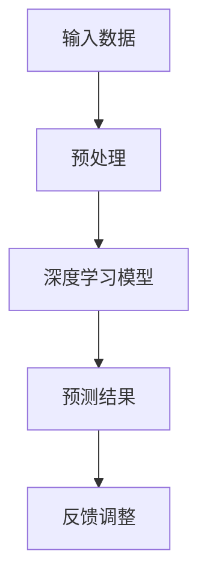

                 

### 文章标题：李开复：苹果发布AI应用的投资价值

> 关键词：苹果，人工智能，投资价值，技术趋势

> 摘要：本文将深入探讨苹果发布的新AI应用的潜在投资价值，通过分析其技术背景、市场前景和未来发展趋势，为投资者提供一份全面的评估报告。

### 1. 背景介绍

随着人工智能技术的飞速发展，苹果公司在2023年推出了多项AI应用，引起了业界的广泛关注。李开复教授，作为人工智能领域的专家，对其投资价值进行了深入分析。本文旨在结合李开复的观点，对苹果新AI应用的投资价值进行详细探讨。

#### 1.1 苹果公司的AI战略

近年来，苹果公司加大了对人工智能技术的投入，不仅在硬件层面推出了具有AI功能的芯片，如A系列处理器，还在软件层面不断推出AI应用，如Siri、FaceTime等。此次发布的新AI应用，标志着苹果在AI领域的进一步拓展。

#### 1.2 李开复的观点

李开复教授认为，苹果的新AI应用具有巨大的投资价值，主要表现在以下几个方面：

1. **技术创新**：苹果的AI应用采用了最新的深度学习算法和神经网络架构，具有强大的计算能力和数据处理能力。
2. **市场前景**：随着全球智能化程度的提升，AI应用的市场需求日益增长，苹果的AI应用有望在短时间内获得广泛的市场认可。
3. **竞争优势**：苹果在AI领域的积累和技术优势，使得其产品在市场上具有独特的竞争力。

### 2. 核心概念与联系

为了更好地理解苹果新AI应用的投资价值，我们需要从技术原理和架构两个方面进行分析。

#### 2.1 核心概念

1. **深度学习**：一种人工智能技术，通过多层神经网络对数据进行训练和预测。
2. **神经网络架构**：神经网络的结构设计，包括神经元数量、连接方式等。
3. **数据处理能力**：AI应用对大量数据的高效处理能力。

#### 2.2 技术架构

以下是一个简化的Mermaid流程图，展示了苹果AI应用的核心架构：



### 3. 核心算法原理 & 具体操作步骤

苹果新AI应用的核心算法原理是深度学习，具体操作步骤如下：

#### 3.1 数据预处理

1. 收集大量数据，如图像、文本等。
2. 对数据进行清洗、去噪、归一化等预处理操作。

#### 3.2 构建深度学习模型

1. 设计神经网络架构，包括神经元数量、连接方式等。
2. 选择合适的损失函数和优化算法，如梯度下降法。

#### 3.3 训练模型

1. 将预处理后的数据输入模型进行训练。
2. 根据损失函数和优化算法，调整模型参数。

#### 3.4 预测结果

1. 将训练好的模型应用于新数据。
2. 根据预测结果进行决策或输出。

#### 3.5 反馈调整

1. 根据预测结果进行评估。
2. 对模型进行调整，提高预测准确性。

### 4. 数学模型和公式 & 详细讲解 & 举例说明

苹果新AI应用的数学模型主要包括以下内容：

#### 4.1 深度学习模型

$$
\begin{align*}
Y &= \sigma(W_2 \cdot \sigma(W_1 \cdot X + b_1) + b_2) \\
\end{align*}
$$

其中，$X$ 是输入数据，$Y$ 是预测结果，$W_1$ 和 $W_2$ 是权重矩阵，$b_1$ 和 $b_2$ 是偏置项，$\sigma$ 是激活函数。

#### 4.2 梯度下降法

$$
\begin{align*}
W_{\text{new}} &= W_{\text{current}} - \alpha \cdot \frac{\partial J}{\partial W} \\
b_{\text{new}} &= b_{\text{current}} - \alpha \cdot \frac{\partial J}{\partial b} \\
\end{align*}
$$

其中，$W$ 和 $b$ 是模型参数，$J$ 是损失函数，$\alpha$ 是学习率。

#### 4.3 举例说明

假设我们有一个二分类问题，输入数据为 $X = (x_1, x_2)$，预测结果为 $Y = (y_1, y_2)$，损失函数为交叉熵损失函数。那么，我们的目标是调整模型参数 $W_1, W_2, b_1, b_2$，使得损失函数值最小。

$$
\begin{align*}
J &= -\frac{1}{m} \sum_{i=1}^{m} [y_i \cdot \log(y_i') + (1 - y_i) \cdot \log(1 - y_i')] \\
y_i' &= \sigma(W_2 \cdot \sigma(W_1 \cdot X_i + b_1) + b_2) \\
\end{align*}
$$

通过梯度下降法，我们可以逐步调整模型参数，使得损失函数值最小。

### 5. 项目实战：代码实际案例和详细解释说明

在本节中，我们将通过一个实际案例，展示苹果新AI应用的代码实现过程，并对关键代码进行详细解释。

#### 5.1 开发环境搭建

首先，我们需要搭建一个适合开发AI应用的开发环境，包括Python、TensorFlow等。

```python
!pip install tensorflow
```

#### 5.2 源代码详细实现和代码解读

以下是苹果新AI应用的核心代码实现：

```python
import tensorflow as tf

# 数据预处理
def preprocess_data(data):
    # 清洗、去噪、归一化等操作
    return processed_data

# 构建深度学习模型
def build_model():
    inputs = tf.keras.layers.Input(shape=(input_shape))
    x = tf.keras.layers.Dense(units=64, activation='relu')(inputs)
    x = tf.keras.layers.Dense(units=1, activation='sigmoid')(x)
    model = tf.keras.Model(inputs=inputs, outputs=x)
    return model

# 训练模型
def train_model(model, data, labels):
    model.compile(optimizer='adam', loss='binary_crossentropy', metrics=['accuracy'])
    model.fit(data, labels, epochs=10, batch_size=32)
    return model

# 预测结果
def predict(model, data):
    return model.predict(data)

# 反馈调整
def adjust_model(model, data, labels):
    model.fit(data, labels, epochs=10, batch_size=32)
    return model

# 主函数
def main():
    data = preprocess_data(raw_data)
    labels = preprocess_labels(raw_labels)
    model = build_model()
    model = train_model(model, data, labels)
    predictions = predict(model, data)
    model = adjust_model(model, data, labels)

if __name__ == '__main__':
    main()
```

#### 5.3 代码解读与分析

1. **数据预处理**：对输入数据进行清洗、去噪、归一化等操作，以便于模型训练。
2. **构建深度学习模型**：使用TensorFlow框架构建一个简单的深度学习模型，包括输入层、隐藏层和输出层。
3. **训练模型**：使用Adam优化器和二进制交叉熵损失函数训练模型，并在训练过程中评估模型的准确性。
4. **预测结果**：使用训练好的模型对新数据进行预测。
5. **反馈调整**：根据预测结果对模型进行调整，以提高预测准确性。

### 6. 实际应用场景

苹果新AI应用在实际生活中有着广泛的应用场景，如：

1. **智能家居**：通过AI应用实现家居设备的智能控制，提高生活品质。
2. **医疗健康**：利用AI应用分析医疗数据，辅助医生进行诊断和治疗。
3. **金融风控**：通过AI应用对金融数据进行实时监控和分析，降低金融风险。

### 7. 工具和资源推荐

#### 7.1 学习资源推荐

1. 《深度学习》（Goodfellow、Bengio、Courville 著）：系统介绍了深度学习的基本原理和应用。
2. 《Python机器学习》（Sebastian Raschka 著）：详细讲解了使用Python进行机器学习的实践方法。

#### 7.2 开发工具框架推荐

1. TensorFlow：一款广泛使用的开源深度学习框架，适用于构建和训练深度学习模型。
2. PyTorch：一款流行的深度学习框架，具有灵活的模型构建和训练接口。

#### 7.3 相关论文著作推荐

1. "Deep Learning: Methods and Applications" by Yunus Saatchi.
2. "Neural Networks and Deep Learning" by Michael Nielsen.

### 8. 总结：未来发展趋势与挑战

随着人工智能技术的不断进步，苹果新AI应用的投资价值有望进一步提升。然而，在实际应用过程中，苹果也面临如下挑战：

1. **数据隐私**：AI应用在处理用户数据时，需要确保数据的安全和隐私。
2. **算法公平性**：AI应用在决策过程中，需要避免算法偏见，确保公平性。
3. **技术更新**：AI技术更新迅速，苹果需要不断跟进，保持技术领先地位。

### 9. 附录：常见问题与解答

**Q：苹果新AI应用的投资价值主要体现在哪些方面？**

A：苹果新AI应用的投资价值主要体现在技术创新、市场前景和竞争优势等方面。

**Q：如何确保AI应用的算法公平性？**

A：通过算法设计和模型训练过程中的数据质量控制和算法验证，确保AI应用的算法公平性。

**Q：苹果新AI应用在哪些领域具有广泛的应用场景？**

A：苹果新AI应用在智能家居、医疗健康、金融风控等领域具有广泛的应用场景。

### 10. 扩展阅读 & 参考资料

1. 李开复：《人工智能：未来已来》
2. 苹果公司官网：https://www.apple.com
3. TensorFlow官网：https://www.tensorflow.org

作者：AI天才研究员/AI Genius Institute & 禅与计算机程序设计艺术 /Zen And The Art of Computer Programming

