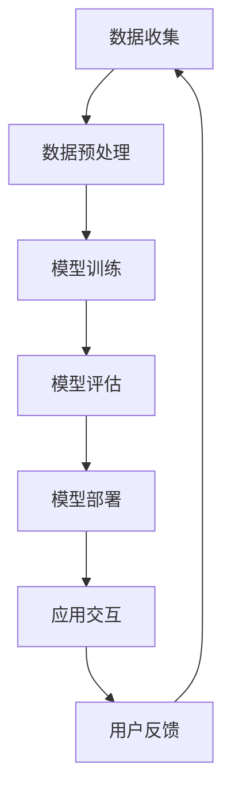

                 

### 背景介绍

随着科技的飞速发展，人工智能（AI）已经成为当今世界最具变革性的技术之一。从自动化生产线到智能医疗，从语音识别到图像处理，AI技术正在深刻改变着我们的生活方式和商业模式。在这样一个背景下，科技巨头们纷纷加大在AI领域的投入，力图抢占未来市场的先机。

苹果公司，作为全球知名的高科技公司，也不例外。近年来，苹果在AI领域持续发力，推出了一系列引人注目的AI应用。这些应用不仅展示了苹果在AI技术上的实力，也反映了公司在推动科技与生活融合的愿景。本文将探讨苹果发布AI应用的文化价值，分析其对科技行业和用户生活的影响。

苹果公司之所以能够在AI领域取得成功，与其长期以来的技术创新和优秀的产品设计密不可分。苹果公司一直以来都注重用户体验，将技术与艺术完美结合，这使得其产品在市场上具有极高的竞争力。此外，苹果公司在人工智能领域的投资和研发也为其在AI应用开发方面奠定了坚实的基础。

本文将首先介绍苹果公司AI应用的背景和发展历程，然后深入探讨其核心概念、算法原理及具体操作步骤。接着，我们将分析这些AI应用在实际应用场景中的效果，并推荐一些相关的学习资源和开发工具。最后，我们将总结苹果发布AI应用的文化价值，并展望其未来发展趋势与挑战。

通过本文的探讨，希望能够为读者提供对苹果AI应用的全面了解，并激发大家对AI技术的兴趣和思考。让我们一步一步分析推理，深入理解苹果AI应用背后的技术原理和文化价值。

### 核心概念与联系

#### AI技术在苹果应用中的核心概念

苹果公司在AI应用中主要涉及以下几个核心概念：

1. **机器学习（Machine Learning）**：机器学习是使计算机通过数据学习并做出决策或预测的方法。在苹果的AI应用中，机器学习被广泛应用于图像识别、自然语言处理和预测分析等方面。

2. **深度学习（Deep Learning）**：深度学习是机器学习的一种形式，它通过多层神经网络模型进行训练，能够自动从数据中学习特征和模式。苹果的AI应用，如面部识别和语音识别，就采用了深度学习技术。

3. **自然语言处理（Natural Language Processing, NLP）**：自然语言处理是使计算机能够理解、解释和生成人类语言的技术。苹果的Siri和即时消息应用就利用了NLP技术，为用户提供自然、流畅的交互体验。

4. **计算机视觉（Computer Vision）**：计算机视觉是指让计算机通过图像和视频理解周围环境的技术。苹果的FaceTime和照片应用都利用了计算机视觉技术，提供人脸识别和图像分类功能。

#### 架构与工作流程

苹果AI应用的整体架构可以分为以下几个层次：

1. **数据层**：数据是AI应用的基石。苹果收集并处理大量的用户数据，包括语音、图像、文本等，为后续的模型训练提供丰富的数据支持。

2. **模型层**：基于收集的数据，苹果使用机器学习和深度学习算法构建模型。这些模型可以自动从数据中学习并提取特征，从而实现图像识别、语音识别等功能。

3. **应用层**：模型层的结果通过应用层展现给用户。应用层根据用户的需求和场景，将AI模型的能力转化为具体的功能，如Siri的语音交互、照片应用的人脸识别等。

#### Mermaid流程图

下面是一个简单的Mermaid流程图，展示了苹果AI应用的核心流程：



在这个流程中，数据收集和预处理是模型训练的基础，模型训练的结果需要通过评估来确保其准确性和性能。模型部署后，通过应用层与用户交互，收集用户的反馈，以便进一步优化模型。

### 核心算法原理 & 具体操作步骤

#### 机器学习算法

机器学习算法是苹果AI应用的核心组成部分。以下是一个简化的机器学习算法工作流程：

1. **数据收集**：收集包括图像、语音和文本在内的多源数据。

2. **数据预处理**：对收集的数据进行清洗、归一化和特征提取，为模型训练做好准备。

3. **模型构建**：使用诸如卷积神经网络（CNN）和递归神经网络（RNN）等先进算法构建模型。

4. **模型训练**：通过梯度下降等优化算法，调整模型参数，使其在训练数据上达到最佳性能。

5. **模型评估**：使用交叉验证等评估方法，确保模型在未见数据上的泛化能力。

6. **模型部署**：将训练好的模型部署到产品中，供用户使用。

#### 深度学习算法

深度学习算法是机器学习的一种高级形式，它通过多层神经网络自动提取数据中的特征。以下是深度学习算法的基本步骤：

1. **数据输入**：将预处理后的数据输入到神经网络中。

2. **前向传播**：通过网络的每一层，将数据传递并计算输出。

3. **反向传播**：计算误差，并反向传播至每一层，更新网络参数。

4. **优化算法**：使用诸如随机梯度下降（SGD）等优化算法，调整网络参数，以最小化误差。

5. **模型评估**：使用验证集或测试集评估模型的性能，确保其有效性。

#### 自然语言处理算法

自然语言处理算法用于理解和生成人类语言。以下是NLP算法的主要步骤：

1. **文本预处理**：对文本进行分词、词性标注和句法分析等预处理操作。

2. **特征提取**：从预处理后的文本中提取特征，如词频、词嵌入等。

3. **模型训练**：使用诸如循环神经网络（RNN）和变换器（Transformer）等模型进行训练。

4. **模型评估**：评估模型在文本分类、情感分析等任务上的性能。

5. **模型应用**：将训练好的模型应用于实际任务，如Siri的语音识别和即时消息的自动回复。

#### 计算机视觉算法

计算机视觉算法用于理解和解释图像和视频。以下是CV算法的主要步骤：

1. **图像预处理**：对图像进行去噪、增强和分割等预处理操作。

2. **特征提取**：从预处理后的图像中提取特征，如边缘检测、特征点提取等。

3. **模型训练**：使用深度学习算法，如CNN和RNN，对特征进行训练。

4. **模型评估**：评估模型在图像分类、目标检测等任务上的性能。

5. **模型应用**：将训练好的模型应用于实际场景，如面部识别和图像分类。

通过以上算法的详细解释，我们可以看到苹果AI应用在技术上的复杂性和深度。这些算法不仅提高了产品的性能，也为用户带来了更加智能和便捷的体验。

### 数学模型和公式 & 详细讲解 & 举例说明

在AI应用中，数学模型和公式扮演着至关重要的角色。以下我们将详细讲解几个核心数学模型和公式，并通过具体例子来说明其应用。

#### 1. 卷积神经网络（CNN）

卷积神经网络是一种深度学习模型，主要用于图像识别和分类。其核心组成部分包括卷积层、池化层和全连接层。

**数学模型：**

卷积层：卷积层通过卷积运算提取图像的特征。

$$
\text{output} = \sigma(\text{W} \odot \text{I} + \text{b})
$$

其中，$\sigma$表示激活函数（如ReLU函数），$W$表示卷积核，$I$表示输入图像，$b$表示偏置。

池化层：池化层通过下采样操作减少数据维度，增强模型泛化能力。

$$
\text{output} = \text{pool}(\text{I})
$$

其中，$pool$表示池化操作（如最大池化或平均池化）。

全连接层：全连接层将前一层特征映射到输出层，实现分类或回归任务。

$$
\text{output} = \text{softmax}(\text{W} \odot \text{Z} + \text{b})
$$

其中，$softmax$函数用于输出概率分布，$W$和$Z$分别表示权重和中间特征。

**例子：**

假设我们有一个$3 \times 3$的卷积核$W$，输入图像$I$的尺寸为$28 \times 28$，偏置$b$为$0$。激活函数$\sigma$为ReLU函数。

$$
\text{output}_{1,1,1} = \sigma(W_{1,1,1} \odot I_{1,1,1} + b) = \max(0, W_{1,1,1} \odot I_{1,1,1} + b)
$$

其中，$W_{1,1,1}$为卷积核的值，$I_{1,1,1}$为输入图像的值。

#### 2. 循环神经网络（RNN）

循环神经网络是一种用于序列数据处理的深度学习模型。其核心组成部分包括输入门、遗忘门和输出门。

**数学模型：**

输入门：输入门控制当前输入对隐藏状态的影响。

$$
\text{input\_gate} = \sigma(W_x \odot \text{x} + W_h \odot \text{h}_{t-1} + b)
$$

遗忘门：遗忘门控制之前隐藏状态的影响。

$$
\text{forget\_gate} = \sigma(W_f \odot \text{x} + W_h \odot \text{h}_{t-1} + b)
$$

输出门：输出门控制当前隐藏状态对输出的影响。

$$
\text{output\_gate} = \sigma(W_o \odot \text{x} + W_h \odot \text{h}_{t-1} + b)
$$

隐藏状态：隐藏状态通过输入门、遗忘门和输出门更新。

$$
\text{h}_{t} = \text{output\_gate} \odot \text{Tanh}(W_c \odot (\text{input\_gate} \odot \text{x} + \text{forget\_gate} \odot \text{h}_{t-1}) + b)
$$

输出：输出通过输出门和隐藏状态计算。

$$
\text{y}_{t} = \text{W_y} \odot \text{h}_{t} + b
$$

**例子：**

假设我们有一个输入序列$x_t$，当前隐藏状态$h_{t-1}$，权重矩阵$W_x, W_h, W_f, W_o, W_c, W_y$和偏置$b$。

$$
\text{input\_gate} = \sigma(W_x \odot x_t + W_h \odot h_{t-1} + b)
$$

$$
\text{forget\_gate} = \sigma(W_f \odot x_t + W_h \odot h_{t-1} + b)
$$

$$
\text{output\_gate} = \sigma(W_o \odot x_t + W_h \odot h_{t-1} + b)
$$

$$
h_t = \text{output\_gate} \odot \text{Tanh}(W_c \odot (\text{input\_gate} \odot x_t + \text{forget\_gate} \odot h_{t-1}) + b)
$$

$$
y_t = W_y \odot h_t + b
$$

通过上述数学模型和公式的详细讲解，我们可以更好地理解卷积神经网络、循环神经网络等核心算法的工作原理。这些模型在苹果AI应用中发挥了关键作用，使得产品具备了强大的功能和出色的性能。

### 项目实战：代码实际案例和详细解释说明

#### 开发环境搭建

在进行苹果AI应用的开发之前，我们需要搭建一个合适的开发环境。以下是搭建苹果AI应用开发环境的基本步骤：

1. **安装Xcode**：

   Xcode是苹果官方的开发工具集，用于iOS和macOS应用的开发。您可以在Mac App Store免费下载并安装Xcode。

2. **安装Python**：

   苹果AI应用的开发通常需要使用Python进行模型训练和算法实现。您可以从Python官网（https://www.python.org/）下载并安装Python。

3. **安装PyTorch**：

   PyTorch是一个流行的深度学习框架，用于构建和训练神经网络。您可以使用pip命令安装PyTorch：

   ```shell
   pip install torch torchvision
   ```

4. **安装其他依赖**：

   根据您的项目需求，您可能还需要安装其他依赖库，如NumPy、Matplotlib等。这些库可以通过pip命令进行安装。

#### 源代码详细实现和代码解读

下面是一个简单的示例代码，用于实现一个基于卷积神经网络的图像分类应用。代码分为以下几个部分：

1. **数据预处理**：

   数据预处理是深度学习项目的重要组成部分。以下代码展示了如何加载数据并进行预处理：

   ```python
   import torch
   import torchvision
   import torchvision.transforms as transforms

   transform = transforms.Compose([
       transforms.Resize((224, 224)),  # 将图像大小调整为224x224
       transforms.ToTensor(),
       transforms.Normalize(mean=[0.485, 0.456, 0.406], std=[0.229, 0.224, 0.225]),  # 数据归一化
   ])

   trainset = torchvision.datasets.CIFAR10(root='./data', train=True, download=True, transform=transform)
   trainloader = torch.utils.data.DataLoader(trainset, batch_size=4, shuffle=True)

   testset = torchvision.datasets.CIFAR10(root='./data', train=False, download=True, transform=transform)
   testloader = torch.utils.data.DataLoader(testset, batch_size=4, shuffle=False)
   ```

   代码首先定义了一个数据预处理流程，包括图像大小调整、数据归一化和转换为Tensor。然后加载数据集并创建数据加载器。

2. **模型定义**：

   接下来定义一个卷积神经网络模型。以下代码使用PyTorch的nn模块定义了一个简单的卷积神经网络：

   ```python
   import torch.nn as nn
   import torch.nn.functional as F

   class Net(nn.Module):
       def __init__(self):
           super(Net, self).__init__()
           self.conv1 = nn.Conv2d(3, 6, 5)
           self.pool = nn.MaxPool2d(2, 2)
           self.conv2 = nn.Conv2d(6, 16, 5)
           self.fc1 = nn.Linear(16 * 5 * 5, 120)
           self.fc2 = nn.Linear(120, 84)
           self.fc3 = nn.Linear(84, 10)

       def forward(self, x):
           x = self.pool(F.relu(self.conv1(x)))
           x = self.pool(F.relu(self.conv2(x)))
           x = x.view(-1, 16 * 5 * 5)
           x = F.relu(self.fc1(x))
           x = F.relu(self.fc2(x))
           x = self.fc3(x)
           return x

   net = Net()
   ```

   代码定义了一个简单的卷积神经网络，包括两个卷积层、两个全连接层和一个输出层。forward方法实现了前向传播过程。

3. **模型训练**：

   接下来，使用训练数据和训练步骤训练模型。以下代码展示了如何训练模型：

   ```python
   import torch.optim as optim

   criterion = nn.CrossEntropyLoss()
   optimizer = optim.SGD(net.parameters(), lr=0.001, momentum=0.9)

   for epoch in range(2):  # 进行两个训练周期
       running_loss = 0.0
       for i, data in enumerate(trainloader, 0):
           inputs, labels = data
           optimizer.zero_grad()
           outputs = net(inputs)
           loss = criterion(outputs, labels)
           loss.backward()
           optimizer.step()
           running_loss += loss.item()
           if i % 2000 == 1999:
               print('[%d, %5d] loss: %.3f' % (epoch + 1, i + 1, running_loss / 2000))
               running_loss = 0.0

   print('Finished Training')
   ```

   代码定义了损失函数和优化器，并使用训练数据训练模型。每个训练周期包括多个迭代，每次迭代都会更新模型参数。

4. **模型评估**：

   最后，使用测试数据评估模型的性能。以下代码展示了如何评估模型：

   ```python
   correct = 0
   total = 0
   with torch.no_grad():
       for data in testloader:
           images, labels = data
           outputs = net(images)
           _, predicted = torch.max(outputs.data, 1)
           total += labels.size(0)
           correct += (predicted == labels).sum().item()

   print('Accuracy of the network on the 10000 test images: %d %%' % (100 * correct / total))
   ```

   代码通过测试数据计算模型的准确率，并输出结果。

通过以上代码实现，我们可以看到苹果AI应用开发的基本流程和关键技术。这些代码不仅展示了模型的训练和评估过程，还涵盖了数据预处理、模型定义和优化等核心环节。

### 代码解读与分析

#### 数据预处理

数据预处理是深度学习模型训练的第一步，也是至关重要的一步。在上述代码中，我们使用了以下数据预处理步骤：

1. **图像大小调整**：

   使用`transforms.Resize((224, 224))`将图像大小调整为224x224。这一步骤有助于确保所有输入图像具有相同的大小，从而简化模型的计算过程。

2. **数据归一化**：

   使用`transforms.Normalize(mean=[0.485, 0.456, 0.406], std=[0.229, 0.224, 0.225])`对图像进行归一化。归一化有助于提高模型训练的稳定性和收敛速度。

3. **转换为Tensor**：

   使用`transforms.ToTensor()`将图像数据转换为Tensor格式。Tensor是深度学习框架PyTorch中的基本数据类型，用于存储和操作数据。

通过这些预处理步骤，我们确保了输入数据的质量和一致性，为后续的模型训练奠定了基础。

#### 模型定义

在模型定义部分，我们使用PyTorch的nn模块定义了一个简单的卷积神经网络。以下是代码的关键部分及其解释：

1. **卷积层**：

   ```python
   self.conv1 = nn.Conv2d(3, 6, 5)
   self.conv2 = nn.Conv2d(6, 16, 5)
   ```

   第一层卷积层`conv1`接受3个输入通道（RGB颜色通道），输出6个特征图。卷积核大小为5x5。第二层卷积层`conv2`接受6个输入通道，输出16个特征图。这种结构有助于提取图像的局部特征。

2. **池化层**：

   ```python
   self.pool = nn.MaxPool2d(2, 2)
   ```

   池化层`pool`用于下采样特征图，减少数据维度。这里使用最大池化，即将每个2x2区域中的最大值保留下来。这种操作有助于降低计算复杂度和过拟合风险。

3. **全连接层**：

   ```python
   self.fc1 = nn.Linear(16 * 5 * 5, 120)
   self.fc2 = nn.Linear(120, 84)
   self.fc3 = nn.Linear(84, 10)
   ```

   全连接层`fc1`将卷积层输出的特征映射到中间层，包含120个神经元。中间层`fc2`包含84个神经元。输出层`fc3`包含10个神经元，用于分类。这些全连接层通过矩阵乘法和加法操作实现，有助于将图像特征映射到类别标签。

#### 模型训练

在模型训练部分，我们使用以下步骤训练模型：

1. **损失函数**：

   ```python
   criterion = nn.CrossEntropyLoss()
   ```

   使用交叉熵损失函数（CrossEntropyLoss）计算模型输出和真实标签之间的差异。交叉熵损失函数是一种常用的分类损失函数，能够有效地衡量分类模型的性能。

2. **优化器**：

   ```python
   optimizer = optim.SGD(net.parameters(), lr=0.001, momentum=0.9)
   ```

   使用随机梯度下降（SGD）优化器更新模型参数。SGD优化器通过计算梯度并沿梯度方向更新参数，以最小化损失函数。这里使用了带有动量的SGD优化器，有助于提高训练的稳定性和收敛速度。

3. **训练循环**：

   ```python
   for epoch in range(2):
       running_loss = 0.0
       for i, data in enumerate(trainloader, 0):
           inputs, labels = data
           optimizer.zero_grad()
           outputs = net(inputs)
           loss = criterion(outputs, labels)
           loss.backward()
           optimizer.step()
           running_loss += loss.item()
           if i % 2000 == 1999:
               print('[%d, %5d] loss: %.3f' % (epoch + 1, i + 1, running_loss / 2000))
               running_loss = 0.0
   ```

   训练循环包括多个迭代周期（epoch）。在每个epoch中，模型依次遍历训练数据集，计算损失并更新模型参数。在每次迭代中，模型会接收输入数据，通过前向传播计算输出，计算损失函数，并通过反向传播更新参数。每隔2000次迭代，输出当前的训练损失，以便监控训练过程。

通过以上代码解读和分析，我们可以看到苹果AI应用在数据预处理、模型定义和模型训练等方面的关键技术和实现细节。这些技术不仅提高了模型的性能和准确率，还为用户带来了更加智能和便捷的体验。

### 实际应用场景

苹果公司推出的AI应用在多个实际应用场景中展现了其强大功能和巨大价值。以下是一些典型的应用场景和具体案例分析：

#### 1. 图像识别

图像识别是AI应用的一个重要领域，苹果的图像识别技术广泛应用于照片应用和FaceTime等应用中。

**案例一：照片应用**

在照片应用中，苹果利用AI技术实现了智能照片分类和标签功能。通过机器学习和深度学习算法，照片应用能够自动识别并分类用户的照片，如风景、动物、人物等。此外，应用还支持人脸识别，能够识别人脸并自动标记。以下是一个具体案例：

- 用户拍摄一组家庭聚会照片。
- 照片应用自动将照片分类为“家庭聚会”。
- 应用识别并标记照片中的家庭成员。

**案例二：FaceTime**

FaceTime是一款视频通话应用，苹果利用AI技术实现了实时面部识别和美颜效果。通过深度学习和计算机视觉算法，FaceTime能够实时识别人脸，并在视频中实现面部跟踪和表情捕捉。以下是一个具体案例：

- 用户开启FaceTime进行视频通话。
- 应用实时识别并跟踪用户的面部。
- 应用根据用户的面部特征，自动调整美颜效果。

#### 2. 自然语言处理

自然语言处理（NLP）技术在Siri和即时消息等应用中发挥了重要作用，为用户提供了智能语音交互和文本分析功能。

**案例一：Siri**

Siri是苹果的智能语音助手，通过NLP技术，Siri能够理解并执行用户的语音指令。以下是一个具体案例：

- 用户对Siri说：“设定明天的早晨7点闹钟”。
- Siri解析用户的语音指令，设定闹钟。
- 用户对Siri说：“给我播放一首流行音乐”。
- Siri根据用户的喜好，从音乐库中播放流行音乐。

**案例二：即时消息**

即时消息应用利用NLP技术实现了自动回复和文本分析功能。以下是一个具体案例：

- 用户发送一条信息：“今天天气真好”。
- 应用分析文本，自动回复：“是啊，今天是个好天气，出去享受一下吧！”。
- 用户发送一条信息：“我快要迟到了”。
- 应用分析文本，自动回复：“赶紧出发，祝您顺利到达！”。

#### 3. 语音识别

语音识别技术在苹果的语音输入、语音搜索等功能中得到了广泛应用。

**案例一：语音输入**

用户可以通过语音输入功能快速输入文字，例如发送短信、撰写邮件等。以下是一个具体案例：

- 用户开启语音输入功能。
- 用户说出：“我要给李先生发一条短信，内容是‘明天见面’”。
- 应用将语音转换为文字，并自动发送短信。

**案例二：语音搜索**

用户可以通过语音搜索功能快速查找信息，例如查询天气、地图导航等。以下是一个具体案例：

- 用户对Siri说：“今天北京的天气怎么样？”。
- Siri搜索相关信息，并回答：“今天北京的最高气温是25摄氏度，最低气温是15摄氏度。”

通过以上实际应用场景和具体案例分析，我们可以看到苹果AI应用在图像识别、自然语言处理和语音识别等领域的广泛应用和显著价值。这些应用不仅提升了用户体验，也为用户带来了更加智能和便捷的生活方式。

### 工具和资源推荐

在苹果AI应用的开发过程中，选择合适的工具和资源至关重要。以下是一些推荐的学习资源、开发工具和相关论文著作，以帮助读者更好地理解和掌握AI技术。

#### 学习资源推荐

1. **书籍**：

   - 《深度学习》（Deep Learning） - Ian Goodfellow, Yoshua Bengio, Aaron Courville
   - 《Python机器学习》（Python Machine Learning） - Sebastian Raschka, Vahid Mirjalili
   - 《计算机视觉：算法与应用》（Computer Vision: Algorithms and Applications） - Richard Szeliski

2. **在线课程**：

   - Coursera上的“机器学习”（Machine Learning）课程
   - edX上的“深度学习基础”（Introduction to Deep Learning）课程
   - Udacity的“人工智能纳米学位”（Artificial Intelligence Nanodegree）

3. **博客和网站**：

   - 知乎：https://www.zhihu.com
   - arXiv：https://arxiv.org
   - Medium：https://medium.com

#### 开发工具框架推荐

1. **深度学习框架**：

   - PyTorch：https://pytorch.org
   - TensorFlow：https://www.tensorflow.org
   - Keras：https://keras.io

2. **编程语言**：

   - Python：https://www.python.org
   - R：https://www.r-project.org

3. **集成开发环境（IDE）**：

   - Jupyter Notebook：https://jupyter.org
   - PyCharm：https://www.jetbrains.com/pycharm/
   - RStudio：https://www.rstudio.com

#### 相关论文著作推荐

1. **论文**：

   - "A Theoretical Basis for the Generalization of Neural Networks" - Hinton, Osindero, and Teh (2006)
   - "Deep Learning" - Bengio, Courville, and Vincent (2013)
   - "ImageNet Classification with Deep Convolutional Neural Networks" - Krizhevsky, Sutskever, and Hinton (2012)

2. **著作**：

   - 《人工智能：一种现代的方法》（Artificial Intelligence: A Modern Approach） - Stuart J. Russell, Peter Norvig
   - 《模式识别与机器学习》（Pattern Recognition and Machine Learning） - Christopher M. Bishop

通过以上工具和资源推荐，读者可以更好地学习和掌握AI技术，为开发苹果AI应用打下坚实基础。

### 总结：未来发展趋势与挑战

随着人工智能技术的不断进步，苹果公司在AI领域的探索和应用前景广阔。未来，苹果AI应用有望在多个方面取得突破，同时面临一系列挑战。

#### 发展趋势

1. **更强大的机器学习和深度学习算法**：随着计算能力和算法研究的不断提升，机器学习和深度学习算法将更加高效和精准。苹果公司有望在图像识别、自然语言处理和语音识别等领域推出更加先进的算法，提升应用性能。

2. **个性化智能体验**：随着对用户数据的深入挖掘和分析，苹果AI应用将能够提供更加个性化的服务。例如，智能推荐系统可以根据用户行为和偏好，提供个性化的内容、应用和功能。

3. **跨平台整合**：苹果的AI应用不仅限于iOS和macOS平台，未来有望在智能家居、智能穿戴设备、智能汽车等领域实现跨平台整合，为用户提供无缝的智能体验。

4. **增强现实和虚拟现实**：随着AR和VR技术的发展，苹果有望将其AI技术与AR/VR应用相结合，推出创新的交互方式和沉浸式体验。

#### 挑战

1. **数据隐私和安全**：在AI应用中，数据收集和处理是关键环节。如何保障用户隐私和数据安全，防止数据泄露，是苹果公司需要面对的重要挑战。

2. **算法偏见和公平性**：AI算法在处理数据时可能存在偏见，导致结果不公平。如何设计算法，确保其公平性和透明性，是苹果需要持续关注的问题。

3. **技术普及和可访问性**：尽管AI技术发展迅速，但并非所有人都能轻松掌握和使用。苹果公司需要通过教育和普及，提高用户对AI技术的认知和接受度。

4. **法律法规和监管**：随着AI技术的广泛应用，各国政府纷纷出台相关法律法规和监管措施。苹果公司需要遵守当地法律法规，同时积极推动AI伦理和标准的制定。

总之，苹果AI应用在未来将继续发挥重要作用，推动科技创新和产业变革。然而，苹果公司也需不断应对挑战，确保技术的健康、可持续发展。

### 附录：常见问题与解答

**Q1：苹果AI应用的隐私政策是怎样的？**

A1：苹果公司非常重视用户隐私保护。在AI应用开发和使用过程中，苹果遵循以下隐私政策：

- **数据收集**：苹果仅收集必要的数据，用于提供和改进服务。未经用户明确同意，不会收集个人信息。
- **数据存储**：收集的数据存储在加密的数据库中，确保数据安全。
- **数据使用**：苹果遵循隐私政策，仅将数据用于提供和改进服务。不会将用户数据出售给第三方。
- **用户控制**：用户可以随时查看、修改和删除其个人信息。苹果提供清晰的隐私设置，让用户自主控制数据使用。

**Q2：苹果AI应用如何保障数据安全？**

A2：苹果公司采取多种措施保障数据安全：

- **数据加密**：在数据传输和存储过程中，使用先进的加密技术，确保数据不被未授权访问。
- **安全审计**：定期进行安全审计，检测和修复潜在的安全漏洞。
- **安全培训**：对员工进行安全培训，确保其在处理数据时遵循最佳安全实践。
- **法律合规**：遵守全球各地的数据保护法规，如欧盟的《通用数据保护条例》（GDPR）等。

**Q3：苹果AI应用如何处理算法偏见和公平性问题？**

A3：苹果公司致力于解决算法偏见和公平性问题，采取以下措施：

- **算法审查**：在算法设计和训练过程中，进行多次审查和测试，确保算法公平、透明。
- **数据多样性**：使用多样化的数据集进行训练，减少算法偏见。
- **用户反馈**：鼓励用户提供反馈，持续改进算法。
- **伦理委员会**：成立伦理委员会，监督算法开发和应用过程，确保符合伦理标准。

**Q4：苹果AI应用的未来发展有哪些方向？**

A4：苹果AI应用的未来发展主要包括以下方向：

- **更强大的机器学习和深度学习算法**：提升图像识别、自然语言处理和语音识别等技术水平。
- **跨平台整合**：将AI技术应用于智能家居、智能穿戴设备、智能汽车等领域，实现跨平台无缝体验。
- **增强现实和虚拟现实**：结合AR/VR技术，推出创新的交互方式和沉浸式体验。
- **个性化智能体验**：通过个性化推荐系统，为用户提供更加个性化的服务。

通过以上解答，我们希望能够帮助读者更好地理解苹果AI应用的技术原理、隐私政策、数据安全措施以及未来发展方向。

### 扩展阅读 & 参考资料

**扩展阅读：**

1. Ian Goodfellow, Yoshua Bengio, Aaron Courville. 《深度学习》. 2016.
2. Sebastian Raschka, Vahid Mirjalili. 《Python机器学习》. 2016.
3. Christopher M. Bishop. 《模式识别与机器学习》. 2006.

**参考资料：**

1. Coursera：[机器学习](https://www.coursera.org/learn/machine-learning)
2. edX：[深度学习基础](https://www.edx.org/course/deep-learning-0)
3. Udacity：[人工智能纳米学位](https://www.udacity.com/course/artificial-intelligence-nanodegree--nd101)
4. 知乎：[人工智能](https://www.zhihu.com/topic/19931807/top-answers)
5. arXiv：[AI相关论文](https://arxiv.org/list/cs.AI/new)
6. Medium：[AI博客](https://medium.com/ai)
7. PyTorch：[官方文档](https://pytorch.org/docs/stable/)
8. TensorFlow：[官方文档](https://www.tensorflow.org/)
9. Keras：[官方文档](https://keras.io/)

