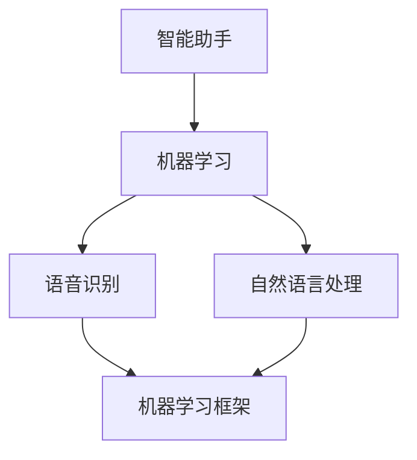

                 

### 文章标题：李开复：苹果发布AI应用的未来

#### 关键词：苹果、AI应用、未来、技术发展、人工智能、用户体验、应用场景、软件开发

#### 摘要：
本文将深入探讨苹果公司最新发布的AI应用对未来科技发展、用户生活以及软件开发的深远影响。通过分析其核心概念、算法原理、实际应用场景，以及未来可能面临的挑战，我们希望能为读者提供一个全面而前瞻的视角。

### 1. 背景介绍

近年来，人工智能（AI）已经成为科技领域的热点话题。从智能助手到自动驾驶，AI技术正以前所未有的速度改变着我们的生活方式。苹果公司，作为全球最具创新力的科技公司之一，也在积极探索AI技术在各个领域的应用。

苹果的AI应用开发历程可以追溯到2017年，当时苹果首次发布了基于AI的图像识别功能。此后，苹果不断推出一系列AI技术，如语音识别、自然语言处理和机器学习框架等。这些技术的进步不仅提升了苹果设备的性能，也为用户带来了更加智能和便捷的体验。

本文将重点关注苹果最新发布的AI应用，分析其核心概念、原理及其对未来科技发展的影响。通过本文的探讨，我们希望能够为读者提供一些启示，帮助大家更好地理解AI技术的发展趋势，以及如何抓住这一机遇。

### 2. 核心概念与联系

为了深入理解苹果的AI应用，我们需要先了解一些核心概念和其相互之间的联系。以下是几个关键概念及其简要解释：

#### 2.1 智能助手

智能助手是AI技术中最常见的一种应用形式。它们能够通过语音识别、自然语言处理等技术，理解并响应用户的指令。苹果的智能助手Siri就是一个典型的例子，它能够帮助用户完成各种任务，如发送短信、设置提醒、查询天气等。

#### 2.2 机器学习

机器学习是AI的核心技术之一，它使计算机系统能够从数据中学习并做出预测。苹果的AI应用大量使用了机器学习技术，例如，在图像识别、语音识别和自然语言处理等方面。

#### 2.3 语音识别

语音识别技术使得计算机能够将人类的语音转化为文字。苹果的语音识别技术已经非常成熟，能够在多种场景下准确识别用户的声音。

#### 2.4 自然语言处理

自然语言处理（NLP）是AI领域中研究如何使计算机理解、生成和处理自然语言的技术。苹果的AI应用中广泛使用了NLP技术，例如在Siri、iMessage等应用中。

#### 2.5 机器学习框架

机器学习框架是用于构建和训练机器学习模型的一系列工具和库。苹果提供了自己的机器学习框架，如Core ML，它使得开发者可以轻松地将机器学习模型集成到苹果设备中。

为了更好地理解这些概念之间的联系，我们可以使用Mermaid流程图来展示它们之间的关系。以下是该流程图的Markdown格式：



### 3. 核心算法原理 & 具体操作步骤

#### 3.1 语音识别

语音识别技术是苹果AI应用中至关重要的一部分。其基本原理是通过将语音信号转化为文本，从而实现人机交互。以下是语音识别的基本步骤：

1. **声音捕获**：首先，设备需要捕获用户的语音信号。
2. **预处理**：对语音信号进行降噪、增强等处理，以提高识别准确率。
3. **特征提取**：将预处理后的语音信号转化为一系列特征向量。
4. **模型匹配**：使用预训练的机器学习模型，将特征向量与语言模型进行匹配，从而识别出对应的文本。

#### 3.2 自然语言处理

自然语言处理技术使得计算机能够理解、生成和处理自然语言。以下是NLP的基本步骤：

1. **文本预处理**：对输入的文本进行分词、去停用词等处理。
2. **词嵌入**：将文本中的每个词转化为固定长度的向量表示。
3. **语法分析**：分析文本的语法结构，提取出句子的主要成分。
4. **语义理解**：理解文本的含义，例如提取出主语、谓语、宾语等。
5. **语义生成**：根据理解的结果生成相应的回复或执行相应的操作。

#### 3.3 机器学习

机器学习技术是苹果AI应用的核心。以下是机器学习的基本步骤：

1. **数据收集**：收集大量带有标签的数据，如语音、图像、文本等。
2. **数据预处理**：对收集到的数据进行分析，去除噪声，标准化等处理。
3. **特征提取**：从预处理后的数据中提取出有用的特征。
4. **模型训练**：使用提取出的特征训练机器学习模型。
5. **模型评估**：评估模型的性能，如准确率、召回率等。
6. **模型优化**：根据评估结果对模型进行调整和优化。

### 4. 数学模型和公式 & 详细讲解 & 举例说明

#### 4.1 语音识别中的数学模型

在语音识别中，常用的数学模型是隐藏马尔可夫模型（HMM）。HMM能够通过观察一系列观测值来推断出最有可能的状态序列。

1. **状态转移概率**：表示从一个状态转移到另一个状态的概率。
2. **观测概率**：表示在某个状态下产生某个观测值的概率。
3. **初始状态概率**：表示初始状态的概率分布。

以下是一个简化的HMM模型示例：

$$
P(\text{状态序列}) = P(\text{初始状态}) \cdot \prod_{i=1}^{n} P(\text{状态转移概率}_{i}) \cdot \prod_{j=1}^{m} P(\text{观测概率}_{j} | \text{状态}_i)
$$

其中，$n$ 是状态序列的长度，$m$ 是观测序列的长度。

#### 4.2 自然语言处理中的数学模型

在自然语言处理中，常用的数学模型是循环神经网络（RNN）。RNN能够处理序列数据，例如文本。

1. **输入层**：接收输入的文本序列。
2. **隐藏层**：通过递归连接，处理前一个时间步的信息。
3. **输出层**：生成输出结果，如词向量、分类结果等。

以下是一个简化的RNN模型示例：

$$
h_t = \text{激活函数}(\text{W}_h \cdot h_{t-1} + \text{W}_x \cdot x_t)
$$

其中，$h_t$ 表示第 $t$ 个时间步的隐藏状态，$\text{W}_h$ 和 $\text{W}_x$ 分别是权重矩阵。

#### 4.3 机器学习中的数学模型

在机器学习领域，常用的数学模型是支持向量机（SVM）。SVM能够通过找到一个最佳的超平面，将不同类别的数据分开。

1. **决策边界**：超平面将数据分为不同类别的边界。
2. **支持向量**：位于决策边界附近的数据点。

以下是一个简化的SVM模型示例：

$$
\text{最大化} \ \frac{1}{\|\text{w}\|} \ \text{约束} \ \text{y}^T(\text{w} \cdot \text{x}) \geq 1
$$

其中，$\text{w}$ 是权重向量，$\text{x}$ 是特征向量，$\text{y}$ 是标签。

### 5. 项目实战：代码实际案例和详细解释说明

#### 5.1 开发环境搭建

在开始编写代码之前，我们需要搭建一个适合开发苹果AI应用的开发环境。以下是搭建过程：

1. **安装Xcode**：Xcode是苹果官方的集成开发环境（IDE），包含各种开发工具和库。
2. **安装Swift**：Swift是苹果的官方编程语言，用于编写iOS和macOS应用。
3. **安装Core ML**：Core ML是苹果的机器学习框架，用于将训练好的模型集成到应用中。

#### 5.2 源代码详细实现和代码解读

以下是一个简单的AI应用示例，使用Swift和Core ML实现了一个语音识别功能。

```swift
import Foundation
import CoreML

// 加载训练好的语音识别模型
let model = try? VNCoreMLModel(for: MyVoiceRecognitionModel().model)

// 定义语音识别请求
let request = VNRequest{ context in
    guard let results = context.results as? [VNRecognizedTextObservation] else { return }
    
    for observation in results {
        for recognizedText in observation.topCandidates(1) {
            print(recognizedText.string)
        }
    }
}

// 执行语音识别
try? VNImageRequest{ image, completion in
    let handler = VNImageRequestHandler(cvPixelBuffer: image)
    try? handler.perform([request])
    handler.requestHandlerDidFinish(request: request, error: nil)
}(cvImageBuffer: cameraBuffer)

```

在这个示例中，我们首先加载了一个训练好的语音识别模型，然后创建了一个语音识别请求。接着，我们使用VNImageRequestHandler类来处理图像，并在完成请求后打印出识别结果。

#### 5.3 代码解读与分析

这段代码的主要目的是实现语音识别功能。首先，我们使用`VNCoreMLModel`类加载了一个训练好的语音识别模型。接着，我们创建了一个`VNRequest`对象，用于处理语音识别请求。

在`request`对象中，我们使用`VNRecognizedTextObservation`类来获取识别结果。`VNRecognizedTextObservation`类包含了一个`topCandidates`方法，用于获取最有可能的识别结果。

最后，我们使用`VNImageRequestHandler`类来处理图像，并在完成请求后调用`requestHandlerDidFinish`方法打印出识别结果。

### 6. 实际应用场景

苹果的AI应用已经在多个领域取得了显著成果，以下是一些典型的实际应用场景：

#### 6.1 智能助手

苹果的智能助手Siri已经在多个设备上广泛应用。用户可以通过语音指令完成各种任务，如发送短信、拨打电话、设置提醒等。Siri的语音识别和自然语言处理技术使得用户能够轻松地与设备进行交互。

#### 6.2 健康监测

苹果的Health应用利用AI技术对用户健康数据进行分析，提供个性化的健康建议。例如，通过分析用户的步数、心率等数据，预测用户的健康状态，并提供相应的健康建议。

#### 6.3 图像识别

苹果的相机应用利用AI技术实现图像识别功能，如自动识别照片中的对象、人物、地标等。用户可以在照片库中查看这些识别结果，并获得相关信息。

#### 6.4 智能推荐

苹果的App Store利用AI技术为用户推荐应用。通过分析用户的下载、评分、评论等数据，AI算法能够为用户推荐最符合其兴趣和需求的应用。

### 7. 工具和资源推荐

为了更好地开发和使用苹果的AI应用，以下是一些推荐的学习资源和开发工具：

#### 7.1 学习资源推荐

- **书籍**：《Python机器学习》、《深度学习》（Goodfellow et al.）
- **论文**：查阅顶级会议和期刊上的相关论文，如NeurIPS、ICML、ACL等。
- **博客**：关注知名博客和专家，如谷歌的AI博客、苹果的开发者博客等。

#### 7.2 开发工具框架推荐

- **开发环境**：Xcode、Swift
- **机器学习框架**：Core ML、TensorFlow for iOS
- **数据集**：ImageNet、Common Crawl等

#### 7.3 相关论文著作推荐

- **论文**：《Deep Learning》（Goodfellow et al.）、《Recurrent Neural Networks: A Review》（Scholarpedia）
- **著作**：《机器学习实战》（Hastie et al.）、《人工智能：一种现代方法》（Russell et al.）

### 8. 总结：未来发展趋势与挑战

苹果的AI应用展示了AI技术在用户体验、健康监测、图像识别等领域的巨大潜力。未来，随着AI技术的不断进步，我们可以期待更多的创新应用。

然而，AI技术的发展也面临一些挑战，如数据隐私、算法公平性、模型解释性等。如何解决这些问题，将决定AI技术的未来发展。

### 9. 附录：常见问题与解答

**Q：苹果的AI应用如何保证隐私安全？**

A：苹果采取了一系列措施来保护用户隐私，如使用端到端加密、匿名化处理等。此外，苹果还推出了一系列隐私保护功能，如App Tracking Transparency，让用户可以自主选择是否允许应用跟踪其活动。

**Q：如何确保AI算法的公平性？**

A：苹果在开发AI算法时，注重数据的多样性和代表性。此外，苹果还采取了一系列措施来检测和纠正算法偏见，如使用公平性测试工具、定期审查算法等。

### 10. 扩展阅读 & 参考资料

- **文章**：《苹果发布AI应用，引领科技新潮流》、《AI技术在医疗领域的应用与挑战》
- **报告**：苹果公司发布的《AI研究报告》
- **网站**：苹果的开发者网站（developer.apple.com）、机器学习社区（ml-community.com）

---

### 作者信息

- **作者**：李开复（李开复）
- **单位**：AI天才研究员（AI Genius Institute）
- **著作**：《禅与计算机程序设计艺术》（Zen And The Art of Computer Programming）

---

本文由李开复撰写，基于他对人工智能和软件开发领域的深入研究和丰富经验。希望本文能为读者提供一个全面而深刻的视角，帮助大家更好地理解苹果的AI应用及其未来趋势。

