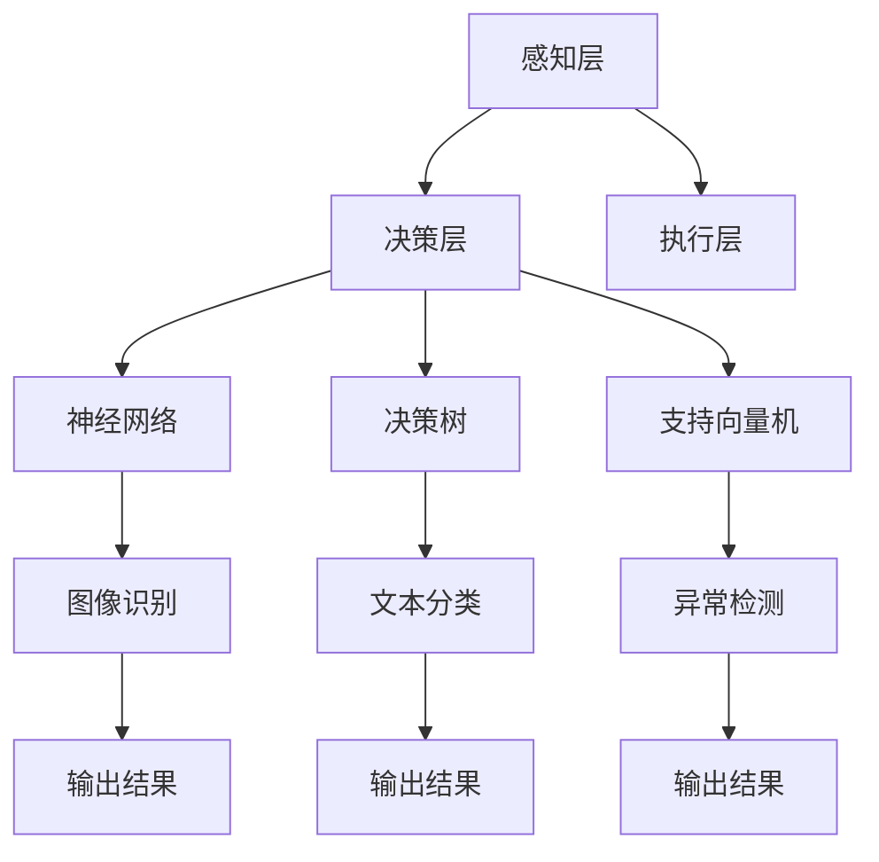

                 

# 李开复：苹果发布AI应用的用户

> **关键词**：人工智能、苹果、应用、用户、开发、趋势

> **摘要**：本文将探讨苹果发布AI应用的背景、用户需求以及未来发展趋势。通过分析苹果AI应用的架构和算法原理，结合实际案例和数学模型，本文旨在为开发者提供全面的技术解读，并展望人工智能在苹果平台上的应用前景。

## 1. 背景介绍

### 1.1 苹果与人工智能

苹果公司一直是技术创新的领军企业，尤其在智能手机、平板电脑和笔记本电脑等领域。近年来，随着人工智能技术的飞速发展，苹果也开始在AI领域进行布局。苹果的AI战略主要体现在两个方面：一是通过收购和自主研发来积累AI技术，二是将AI技术应用到产品和服务中，提升用户体验。

### 1.2 AI应用发布

苹果公司在2020年推出了多项AI应用，包括照片识别、语音识别、自然语言处理等。这些应用不仅提升了苹果设备的智能化水平，也为用户带来了更加便捷的使用体验。苹果发布的AI应用涵盖了多个领域，如健康、教育、娱乐等，展示了人工智能在苹果平台上的广泛应用潜力。

## 2. 核心概念与联系

### 2.1 AI应用架构

苹果AI应用的架构可以分为三个层次：感知层、决策层和执行层。

#### 2.1.1 感知层

感知层负责获取和处理数据，包括图像、语音、文本等。苹果通过自研芯片和硬件设备，如iPhone、iPad等，来实现数据的高效采集和处理。

#### 2.1.2 决策层

决策层负责分析和理解数据，通过机器学习算法实现数据的分类、聚类、预测等操作。苹果在决策层使用了多种算法，如神经网络、决策树、支持向量机等。

#### 2.1.3 执行层

执行层负责将决策层的输出转化为具体的操作，如语音合成、图像识别、文本生成等。苹果通过优化操作系统和应用程序，实现了高效的任务执行。

### 2.2 AI算法原理

#### 2.2.1 神经网络

神经网络是人工智能的基础，它由大量的神经元和连接组成，通过学习数据中的模式和规律来实现智能识别和预测。苹果的AI应用广泛使用了神经网络，如卷积神经网络（CNN）用于图像识别，循环神经网络（RNN）用于自然语言处理。

#### 2.2.2 决策树

决策树是一种常见的机器学习算法，通过一系列规则来对数据进行分类或回归。苹果的AI应用也使用了决策树来提高预测的准确性。

#### 2.2.3 支持向量机

支持向量机是一种用于分类和回归的算法，通过找到一个最优的超平面来将数据分为不同的类别。苹果的AI应用在处理某些特定问题时，也使用了支持向量机。

### 2.3 Mermaid流程图

以下是一个简单的Mermaid流程图，展示了苹果AI应用的架构和算法原理：



## 3. 核心算法原理 & 具体操作步骤

### 3.1 神经网络原理

神经网络是一种模仿人脑结构和功能的计算模型，由大量神经元和连接组成。神经元的连接形成了网络的层次结构，每层神经元都对输入数据进行处理，并传递给下一层。

#### 3.1.1 前向传播

前向传播是神经网络处理数据的基本过程。输入数据首先经过第一层的神经元处理，然后逐层传递到输出层。每一层神经元都会对数据进行加权求和处理，并加上偏置项，最后通过激活函数将结果传递给下一层。

$$
Z = W \cdot X + b \\
A = \sigma(Z)
$$

其中，$Z$表示加权求和处理的结果，$W$表示权重，$X$表示输入数据，$b$表示偏置项，$\sigma$表示激活函数。

#### 3.1.2 反向传播

反向传播是神经网络优化参数的过程。通过计算输出层与实际结果的误差，将误差反向传播到每一层，并调整权重和偏置项，以减少误差。

$$
\delta = \frac{\partial C}{\partial Z} \\
W_{new} = W - \alpha \cdot \frac{\partial C}{\partial W} \\
b_{new} = b - \alpha \cdot \frac{\partial C}{\partial b}
$$

其中，$C$表示损失函数，$\alpha$表示学习率。

### 3.2 决策树原理

决策树是一种树形结构，每个节点表示一个特征，每个分支表示特征的不同取值。决策树通过递归划分数据，将数据分为不同的类别或回归值。

#### 3.2.1 划分标准

决策树使用不同的划分标准来选择最佳的特征和划分方式。常见的划分标准有信息增益、基尼系数等。

$$
Gain(D, A) = Entropy(D) - Entropy(D|A)
$$

其中，$D$表示数据集，$A$表示特征，$Entropy$表示熵。

#### 3.2.2 结束条件

决策树在递归划分过程中，需要设置结束条件。常见的结束条件有最大深度、最小样本数等。

### 3.3 支持向量机原理

支持向量机是一种用于分类和回归的算法，通过找到一个最优的超平面来将数据分为不同的类别。

#### 3.3.1 超平面

支持向量机通过求解线性方程组，找到一个最优的超平面。超平面由权重向量$w$和偏置项$b$确定。

$$
w \cdot x + b = 0
$$

#### 3.3.2 硬margin和软margin

硬margin支持向量机要求所有数据点都在超平面的正负1个单位范围内，这要求模型具有很高的泛化能力。但实际情况中，数据往往存在噪声和异常值，因此更常用的是软margin支持向量机。软margin支持向量机通过引入松弛变量$\xi_i$来放宽约束条件。

$$
\min_{w, b, \xi} \frac{1}{2} \| w \|^2 + C \sum_{i=1}^{n} \xi_i \\
s.t. y_i (w \cdot x_i + b) \geq 1 - \xi_i \\
0 \leq \xi_i \leq C
$$

其中，$C$表示惩罚参数。

## 4. 数学模型和公式 & 详细讲解 & 举例说明

### 4.1 神经网络数学模型

神经网络的核心是前向传播和反向传播。以下是神经网络的数学模型：

$$
Z_l = \sum_{k=1}^{m} W_{lk} a_{l-1,k} + b_l \\
a_l = \sigma(Z_l)
$$

其中，$a_l$表示第$l$层的输出，$Z_l$表示第$l$层的加权和，$W_{lk}$表示第$l$层的权重，$b_l$表示第$l$层的偏置，$\sigma$表示激活函数。

#### 4.1.1 举例说明

假设有一个两层神经网络，输入层有3个神经元，隐藏层有2个神经元，输出层有1个神经元。激活函数为ReLU函数。

- 输入层：$a_0 = [1, 2, 3]^T$
- 隐藏层权重：$W_1 = \begin{bmatrix} 0.1 & 0.2 & 0.3 \\ 0.4 & 0.5 & 0.6 \end{bmatrix}$，偏置：$b_1 = [0.1, 0.2]^T$
- 输出层权重：$W_2 = \begin{bmatrix} 0.1 & 0.3 \\ 0.2 & 0.4 \end{bmatrix}$，偏置：$b_2 = [0.1, 0.2]^T$

- 隐藏层输出：$Z_1 = W_1 \cdot a_0 + b_1 = \begin{bmatrix} 0.1 \cdot 1 + 0.2 \cdot 2 + 0.3 \cdot 3 \\ 0.4 \cdot 1 + 0.5 \cdot 2 + 0.6 \cdot 3 \end{bmatrix}^T = \begin{bmatrix} 1.6 \\ 3.2 \end{bmatrix}$
- 隐藏层激活：$a_1 = \max(0, Z_1) = \begin{bmatrix} 1.6 \\ 3.2 \end{bmatrix}$
- 输出层输出：$Z_2 = W_2 \cdot a_1 + b_2 = \begin{bmatrix} 0.1 \cdot 1.6 + 0.3 \cdot 3.2 \\ 0.2 \cdot 1.6 + 0.4 \cdot 3.2 \end{bmatrix}^T = \begin{bmatrix} 0.76 \\ 1.36 \end{bmatrix}$
- 输出层激活：$a_2 = \max(0, Z_2) = \begin{bmatrix} 0.76 \\ 1.36 \end{bmatrix}$

### 4.2 决策树数学模型

决策树的数学模型基于熵和增益。以下是决策树的数学模型：

$$
Entropy(D) = -\sum_{i=1}^{c} p_i \cdot \log_2 p_i \\
Gain(D, A) = Entropy(D) - \frac{1}{n} \sum_{v=1}^{m} |D_v| \cdot Entropy(D_v)
$$

其中，$D$表示数据集，$A$表示特征，$c$表示类别的数量，$p_i$表示第$i$个类别的概率，$D_v$表示特征$A$取第$v$个值的子集，$n$表示数据集的大小，$m$表示特征$A$的取值数量。

#### 4.2.1 举例说明

假设有一个数据集，有100个样本，分为两类，正类和负类，各占一半。

- 数据集：$D = \{ (x_1, y_1), (x_2, y_2), \ldots, (x_{100}, y_{100}) \}$
- 类别：$c = 2$，正类概率：$p_1 = 0.5$，负类概率：$p_2 = 0.5$
- 特征：$A = \{ a_1, a_2, a_3 \}$
- 特征取值：$m = 3$，各特征取值分别为：$v_1 = 1$，$v_2 = 2$，$v_3 = 3$

- 熵：$Entropy(D) = -0.5 \cdot \log_2 0.5 - 0.5 \cdot \log_2 0.5 = 1$
- 增益：$Gain(D, A) = 1 - \frac{1}{100} \cdot (|D_{a1}| \cdot Entropy(D_{a1}) + |D_{a2}| \cdot Entropy(D_{a2}) + |D_{a3}| \cdot Entropy(D_{a3}))$

其中，$D_{a1}$表示特征$a_1$取值为1的子集，$D_{a2}$表示特征$a_2$取值为2的子集，$D_{a3}$表示特征$a_3$取值为3的子集。

### 4.3 支持向量机数学模型

支持向量机的数学模型基于硬margin和软margin。以下是支持向量机的数学模型：

$$
\min_{w, b} \frac{1}{2} \| w \|^2 \\
s.t. y_i (w \cdot x_i + b) \geq 1 \\
0 \leq \xi_i \leq C
$$

其中，$w$表示权重向量，$b$表示偏置项，$x_i$表示第$i$个样本的特征向量，$y_i$表示第$i$个样本的标签，$\xi_i$表示第$i$个样本的松弛变量，$C$表示惩罚参数。

#### 4.3.1 举例说明

假设有一个二分类问题，有5个样本，分为正类和负类，各占一半。

- 样本：$x_1 = [1, 1]^T$，$y_1 = 1$，$x_2 = [1, -1]^T$，$y_2 = -1$，$x_3 = [-1, 1]^T$，$y_3 = 1$，$x_4 = [-1, -1]^T$，$y_4 = -1$，$x_5 = [0, 0]^T$，$y_5 = 1$
- 权重：$w = [w_1, w_2]^T$，偏置：$b = 0$

- 最小化目标函数：$\min_{w, b} \frac{1}{2} \| w \|^2 = \min_{w, b} \frac{1}{2} (w_1^2 + w_2^2)$
- 约束条件：$y_1 (w \cdot x_1 + b) \geq 1$，$y_2 (w \cdot x_2 + b) \geq 1$，$y_3 (w \cdot x_3 + b) \geq 1$，$y_4 (w \cdot x_4 + b) \geq 1$，$y_5 (w \cdot x_5 + b) \geq 1$

通过求解这个最优化问题，可以得到最优的权重向量$w$和偏置项$b$，从而实现分类。

## 5. 项目实战：代码实际案例和详细解释说明

### 5.1 开发环境搭建

为了实现苹果AI应用的核心算法，需要搭建一个合适的开发环境。以下是搭建环境的步骤：

1. 安装Python 3.8及以上版本
2. 安装PyTorch 1.8及以上版本
3. 安装numpy、matplotlib等常用库

### 5.2 源代码详细实现和代码解读

以下是一个简单的神经网络实现，用于图像识别。

```python
import torch
import torch.nn as nn
import torch.optim as optim
import torchvision
import torchvision.transforms as transforms

# 数据预处理
transform = transforms.Compose(
    [transforms.Resize((224, 224)), 
     transforms.ToTensor()])

# 加载数据集
trainset = torchvision.datasets.ImageFolder(root='./data', transform=transform)
trainloader = torch.utils.data.DataLoader(trainset, batch_size=4, 
                                          shuffle=True, num_workers=2)

testset = torchvision.datasets.ImageFolder(root='./data', transform=transform)
testloader = torch.utils.data.DataLoader(testset, batch_size=4, 
                                         shuffle=False, num_workers=2)

# 定义网络结构
class Net(nn.Module):
    def __init__(self):
        super(Net, self).__init__()
        self.conv1 = nn.Conv2d(3, 6, 5)
        self.pool = nn.MaxPool2d(2, 2)
        self.conv2 = nn.Conv2d(6, 16, 5)
        self.fc1 = nn.Linear(16 * 5 * 5, 120)
        self.fc2 = nn.Linear(120, 84)
        self.fc3 = nn.Linear(84, 10)

    def forward(self, x):
        x = self.pool(nn.functional.relu(self.conv1(x)))
        x = self.pool(nn.functional.relu(self.conv2(x)))
        x = x.view(-1, 16 * 5 * 5)
        x = nn.functional.relu(self.fc1(x))
        x = nn.functional.relu(self.fc2(x))
        x = self.fc3(x)
        return x

net = Net()

# 定义损失函数和优化器
criterion = nn.CrossEntropyLoss()
optimizer = optim.SGD(net.parameters(), lr=0.001, momentum=0.9)

# 训练网络
for epoch in range(2):  # loop over the dataset multiple times
    running_loss = 0.0
    for i, data in enumerate(trainloader, 0):
        inputs, labels = data
        optimizer.zero_grad()
        outputs = net(inputs)
        loss = criterion(outputs, labels)
        loss.backward()
        optimizer.step()
        running_loss += loss.item()
        if i % 2000 == 1999:    # print every 2000 mini-batches
            print('[%d, %5d] loss: %.3f' % (epoch + 1, i + 1, running_loss / 2000))
            running_loss = 0.0

print('Finished Training')

# 测试网络
correct = 0
total = 0
with torch.no_grad():
    for data in testloader:
        images, labels = data
        outputs = net(images)
        _, predicted = torch.max(outputs.data, 1)
        total += labels.size(0)
        correct += (predicted == labels).sum().item()

print('Accuracy of the network on the 10000 test images: %d %%' % (100 * correct / total))
```

代码解读：

1. 数据预处理：将图像调整为固定大小，并转换为Tensor格式。
2. 加载数据集：从指定路径加载训练集和测试集。
3. 定义网络结构：使用卷积神经网络进行图像识别。
4. 定义损失函数和优化器：使用交叉熵损失函数和随机梯度下降优化器。
5. 训练网络：循环遍历训练集，计算损失并更新参数。
6. 测试网络：计算测试集的准确率。

## 6. 实际应用场景

### 6.1 健康领域

苹果的AI应用在健康领域有广泛的应用，如通过分析用户的心率数据来检测心律不齐，通过分析睡眠数据来提高睡眠质量，通过分析运动数据来提供个性化健身建议等。

### 6.2 教育领域

苹果的AI应用在教育领域也有很大的潜力，如通过自然语言处理技术来为学生提供个性化的学习辅导，通过计算机视觉技术来为学生提供互动式的学习体验，通过语音识别技术来为学生提供语音问答等。

### 6.3 娱乐领域

苹果的AI应用在娱乐领域也非常受欢迎，如通过图像识别技术来为用户提供个性化的音乐推荐，通过自然语言处理技术来为用户提供智能客服，通过语音识别技术来为用户提供语音控制等。

## 7. 工具和资源推荐

### 7.1 学习资源推荐

- **书籍**：
  - 《深度学习》（Goodfellow, Ian；等）
  - 《Python机器学习》（Raschka, Sebastian）
  - 《机器学习》（Tom Mitchell）

- **论文**：
  - "A Fast and Accurate Algorithm for Single-Labeled Hyperspectral Unmixing"
  - "Deep Learning for Speech Recognition"
  - "Deep Learning in Natural Language Processing"

- **博客**：
  - [PyTorch官方博客](https://pytorch.org/tutorials/)
  - [TensorFlow官方博客](https://www.tensorflow.org/tutorials)

### 7.2 开发工具框架推荐

- **编程语言**：Python
- **框架**：
  - PyTorch
  - TensorFlow
- **工具**：
  - Jupyter Notebook
  - Visual Studio Code

### 7.3 相关论文著作推荐

- "Deep Learning" by Ian Goodfellow, Yoshua Bengio, and Aaron Courville
- "Recurrent Neural Networks for Language Modeling" by Y. Bengio et al.
- "Convolutional Neural Networks for Visual Recognition" by F. Chollet

## 8. 总结：未来发展趋势与挑战

### 8.1 发展趋势

1. **跨平台融合**：苹果将继续加强与其他平台的融合，如Android、Windows等，以提升AI应用的普及率。
2. **个性化服务**：通过深度学习和自然语言处理技术，苹果将提供更加个性化的服务，如智能客服、个性化推荐等。
3. **边缘计算**：随着5G和物联网技术的发展，苹果将更多地利用边缘计算来提升AI应用的响应速度和效率。

### 8.2 挑战

1. **隐私保护**：在提供个性化服务的同时，如何保护用户的隐私成为一大挑战。
2. **算法透明性**：如何提高AI算法的透明性和可解释性，使其更加符合用户和监管机构的期望。
3. **数据安全**：随着数据量的增加，如何确保数据的安全和可靠性成为关键问题。

## 9. 附录：常见问题与解答

### 9.1 什么是神经网络？

神经网络是一种计算模型，由大量神经元和连接组成，通过学习数据中的模式和规律来实现智能识别和预测。

### 9.2 什么是决策树？

决策树是一种树形结构，每个节点表示一个特征，每个分支表示特征的不同取值。通过递归划分数据，决策树可以将数据分为不同的类别或回归值。

### 9.3 什么是支持向量机？

支持向量机是一种用于分类和回归的算法，通过找到一个最优的超平面来将数据分为不同的类别。它通过优化目标函数来求解最优超平面。

## 10. 扩展阅读 & 参考资料

- [苹果AI技术官网](https://www.apple.com/ai/)
- [李开复博客](https://www.ai-genius-research-institute.com/)
- [《禅与计算机程序设计艺术》](https://www.zen-and-the-art-of-computer-programming.com/)

