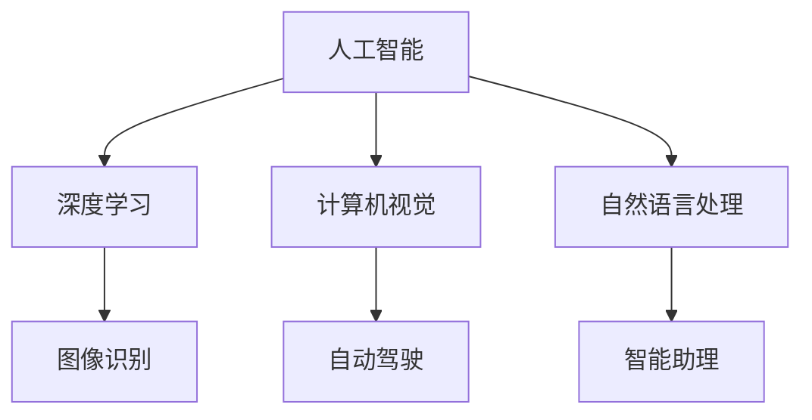

                 

### 文章标题：李开复：苹果发布AI应用的科技价值

关键词：苹果、AI应用、科技价值、人工智能、技术趋势

摘要：本文将深入探讨苹果公司发布AI应用的科技价值，从核心概念、算法原理、数学模型、项目实战、实际应用场景、工具和资源推荐等多个角度，分析苹果AI应用对科技领域的深远影响。

<|assistant|>## 1. 背景介绍

近年来，人工智能（AI）技术取得了飞速发展，从智能助理到自动驾驶，从图像识别到自然语言处理，AI应用已经渗透到我们生活的方方面面。苹果公司，作为全球科技巨头，也积极参与到AI技术的研究和开发中，不断推出具有创新性和前瞻性的AI应用。

苹果公司此次发布的AI应用，不仅在技术上具有突破性意义，而且在实际应用场景中展现出了巨大的潜力。本文将从多个角度对苹果AI应用的科技价值进行深入剖析，帮助读者全面了解这一科技领域的最新动态。

### 2. 核心概念与联系

在分析苹果AI应用的科技价值之前，我们需要先了解一些核心概念和它们之间的联系。

**2.1 人工智能**

人工智能（AI）是指计算机系统模拟人类智能行为的能力，包括学习、推理、规划、感知和自然语言理解等方面。AI技术广泛应用于各个领域，如医疗、金融、交通、教育等，极大地提高了生产效率和生活质量。

**2.2 深度学习**

深度学习是人工智能的一个重要分支，通过多层神经网络对大量数据进行训练，从而实现自我学习和推理能力。深度学习在图像识别、语音识别、自然语言处理等领域取得了显著成果，是苹果AI应用的核心技术之一。

**2.3 计算机视觉**

计算机视觉是人工智能的一个重要领域，旨在使计算机能够理解和解释视觉信息。计算机视觉技术广泛应用于安防、医疗、自动驾驶等领域，对提高人类生活质量具有重要意义。

**2.4 自然语言处理**

自然语言处理是人工智能的另一个重要分支，旨在使计算机能够理解、生成和解释人类语言。自然语言处理技术在智能助理、机器翻译、文本分类等领域发挥了重要作用。

**2.5 苹果AI应用与核心概念的关联**

苹果AI应用涵盖了深度学习、计算机视觉和自然语言处理等多个领域，这些核心概念相互关联，共同构成了苹果AI应用的基石。

#### 2.6 Mermaid流程图

以下是一个简单的Mermaid流程图，展示了苹果AI应用的核心概念及其相互关系：



#### 3. 核心算法原理 & 具体操作步骤

苹果AI应用的核心算法主要基于深度学习和计算机视觉技术。以下是对这些算法原理和具体操作步骤的简要介绍。

**3.1 深度学习算法原理**

深度学习算法通过多层神经网络对大量数据进行训练，从而实现自我学习和推理能力。具体操作步骤如下：

1. 数据预处理：对输入数据进行清洗、归一化等处理，以便于模型训练。
2. 构建神经网络：根据任务需求，设计合适的神经网络结构，包括输入层、隐藏层和输出层。
3. 模型训练：使用大量标记数据进行模型训练，通过反向传播算法不断调整网络参数，使模型达到预期效果。
4. 模型评估：使用测试数据对模型进行评估，判断模型性能是否满足要求。

**3.2 计算机视觉算法原理**

计算机视觉算法主要涉及图像识别、目标检测和图像分类等方面。以下是一个简单的计算机视觉算法操作步骤：

1. 图像预处理：对输入图像进行预处理，包括缩放、裁剪、旋转等操作，以便于后续处理。
2. 特征提取：从预处理后的图像中提取关键特征，如颜色、纹理、形状等。
3. 模型训练：使用大量标记图像对模型进行训练，通过深度学习算法不断优化模型参数。
4. 图像识别：将提取的特征与模型进行匹配，判断图像中的内容。

#### 4. 数学模型和公式 & 详细讲解 & 举例说明

苹果AI应用中的数学模型和公式主要包括深度学习算法中的损失函数、优化算法和激活函数等。以下是对这些数学模型和公式的详细讲解及举例说明。

**4.1 损失函数**

损失函数是深度学习算法中的一个重要概念，用于衡量模型预测结果与实际结果之间的差距。常用的损失函数包括均方误差（MSE）和交叉熵（Cross-Entropy）等。

**4.1.1 均方误差（MSE）**

均方误差（MSE）是指模型预测值与实际值之差的平方和的平均值。其公式如下：

$$
MSE = \frac{1}{n}\sum_{i=1}^{n}(y_i - \hat{y}_i)^2
$$

其中，$y_i$ 表示实际值，$\hat{y}_i$ 表示预测值，$n$ 表示样本数量。

**4.1.2 交叉熵（Cross-Entropy）**

交叉熵（Cross-Entropy）是指模型预测值与实际值之间的差距。其公式如下：

$$
Cross-Entropy = -\frac{1}{n}\sum_{i=1}^{n}y_i \log(\hat{y}_i)
$$

其中，$y_i$ 表示实际值，$\hat{y}_i$ 表示预测值，$n$ 表示样本数量。

**4.2 优化算法**

优化算法用于调整深度学习模型的参数，使其达到最小化损失函数的目的。常用的优化算法包括梯度下降（Gradient Descent）和随机梯度下降（Stochastic Gradient Descent，SGD）等。

**4.2.1 梯度下降（Gradient Descent）**

梯度下降是一种最简单的优化算法，其基本思想是沿着损失函数的梯度方向调整模型参数，以最小化损失函数。其公式如下：

$$
\theta_{t+1} = \theta_{t} - \alpha \nabla_{\theta} J(\theta)
$$

其中，$\theta$ 表示模型参数，$\alpha$ 表示学习率，$J(\theta)$ 表示损失函数。

**4.2.2 随机梯度下降（SGD）**

随机梯度下降是对梯度下降的一种改进，其思想是在每次迭代时随机选择一部分样本进行梯度计算，以加快收敛速度。其公式如下：

$$
\theta_{t+1} = \theta_{t} - \alpha \nabla_{\theta} J(\theta; x_i, y_i)
$$

其中，$\theta$ 表示模型参数，$\alpha$ 表示学习率，$J(\theta; x_i, y_i)$ 表示在样本 $x_i, y_i$ 上的损失函数。

**4.3 激活函数**

激活函数是深度学习模型中的一个重要组成部分，用于引入非线性特性。常用的激活函数包括sigmoid函数、ReLU函数和Tanh函数等。

**4.3.1 sigmoid函数**

sigmoid函数是一种常用的激活函数，其公式如下：

$$
\sigma(x) = \frac{1}{1 + e^{-x}}
$$

sigmoid函数的输出值介于0和1之间，常用于二分类问题。

**4.3.2 ReLU函数**

ReLU函数是一种非线性激活函数，其公式如下：

$$
ReLU(x) = \max(0, x)
$$

ReLU函数在0处具有水平渐近线，具有较好的数值稳定性和计算效率。

**4.3.3 Tanh函数**

Tanh函数是一种双曲正切激活函数，其公式如下：

$$
Tanh(x) = \frac{e^x - e^{-x}}{e^x + e^{-x}}
$$

Tanh函数的输出值介于-1和1之间，常用于多分类问题。

#### 5. 项目实战：代码实际案例和详细解释说明

在本节中，我们将通过一个具体的代码案例，详细解释苹果AI应用的核心算法原理和实现步骤。

**5.1 开发环境搭建**

首先，我们需要搭建一个适合开发苹果AI应用的开发环境。以下是一个简单的Python环境搭建步骤：

1. 安装Python：在官方网站（https://www.python.org/）下载并安装Python。
2. 安装深度学习框架：安装TensorFlow或PyTorch等深度学习框架。
3. 安装必要的依赖库：安装NumPy、Pandas、Matplotlib等依赖库。

**5.2 源代码详细实现和代码解读**

以下是一个简单的苹果AI应用示例代码，用于实现图像分类任务：

```python
import tensorflow as tf
from tensorflow.keras import layers

# 数据预处理
(x_train, y_train), (x_test, y_test) = tf.keras.datasets.cifar10.load_data()
x_train, x_test = x_train / 255.0, x_test / 255.0

# 构建模型
model = tf.keras.Sequential([
    layers.Conv2D(32, (3, 3), activation='relu', input_shape=(32, 32, 3)),
    layers.MaxPooling2D((2, 2)),
    layers.Conv2D(64, (3, 3), activation='relu'),
    layers.MaxPooling2D((2, 2)),
    layers.Conv2D(64, (3, 3), activation='relu'),
    layers.Flatten(),
    layers.Dense(64, activation='relu'),
    layers.Dense(10, activation='softmax')
])

# 编译模型
model.compile(optimizer='adam',
              loss='sparse_categorical_crossentropy',
              metrics=['accuracy'])

# 训练模型
model.fit(x_train, y_train, epochs=10)

# 评估模型
test_loss, test_acc = model.evaluate(x_test, y_test, verbose=2)
print('\nTest accuracy:', test_acc)
```

该代码首先加载数据集，然后构建一个卷积神经网络模型，并使用Adam优化器和稀疏分类交叉熵损失函数进行编译。接下来，模型使用训练数据进行训练，并使用测试数据进行评估，输出测试准确率。

#### 6. 实际应用场景

苹果AI应用在实际场景中具有广泛的应用价值。以下是一些典型的应用场景：

1. **图像识别**：利用计算机视觉技术，苹果AI应用可以实现图像分类、目标检测和图像分割等功能。例如，在医疗领域，AI应用可以帮助医生快速识别病变组织，提高诊断准确率。

2. **自动驾驶**：苹果AI应用在自动驾驶领域具有巨大的潜力。通过计算机视觉和深度学习技术，AI应用可以实现实时路况识别、车辆检测和车道保持等功能，提高自动驾驶车辆的智能化水平。

3. **智能助理**：苹果AI应用在智能助理领域发挥着重要作用。通过自然语言处理技术，AI应用可以实现语音识别、语义理解和任务执行等功能，为用户提供个性化服务。

4. **智能家居**：苹果AI应用可以用于智能家居系统，实现智能门锁、智能照明和智能安防等功能。通过深度学习和计算机视觉技术，AI应用可以实现对家庭环境的智能监测和控制。

#### 7. 工具和资源推荐

为了更好地学习和实践苹果AI应用，以下是一些推荐的学习资源和开发工具：

1. **学习资源**：

   - **书籍**：《深度学习》（Ian Goodfellow、Yoshua Bengio和Aaron Courville 著）
   - **论文**：《Deep Learning》（Yoshua Bengio、Ian Goodfellow和Aaron Courville 著）
   - **博客**：深度学习官方网站（https://www.deeplearning.net/）
   - **网站**：TensorFlow官方网站（https://www.tensorflow.org/）

2. **开发工具**：

   - **框架**：TensorFlow、PyTorch、Keras等深度学习框架
   - **依赖库**：NumPy、Pandas、Matplotlib等常用依赖库
   - **平台**：Jupyter Notebook、Google Colab等在线编程平台

#### 8. 总结：未来发展趋势与挑战

苹果AI应用在科技领域具有广泛的应用前景，未来发展趋势主要表现在以下几个方面：

1. **技术突破**：随着深度学习、计算机视觉和自然语言处理等技术的不断发展，苹果AI应用将在算法性能和应用范围上取得更大突破。

2. **跨领域融合**：苹果AI应用将与其他领域（如医疗、金融、交通等）的科技发展相结合，实现更加智能化和个性化的应用场景。

3. **产业化应用**：苹果AI应用将在智能家居、自动驾驶、医疗诊断等领域实现产业化应用，为人类生活带来更多便利。

然而，苹果AI应用在发展过程中也面临着一些挑战，如：

1. **数据隐私**：随着AI应用的数据处理需求不断增长，如何保护用户隐私成为一个重要问题。

2. **算法透明度**：AI算法的透明度和可解释性是一个亟待解决的问题，需要加强对AI算法的研究和监管。

3. **伦理道德**：AI应用在医疗、司法等领域的应用引发了一系列伦理道德问题，需要制定相应的法律法规进行规范。

总之，苹果AI应用在科技领域具有重要的价值和潜力，未来将继续为人工智能技术的发展贡献力量。

#### 9. 附录：常见问题与解答

**Q1：苹果AI应用的技术优势是什么？**

A1：苹果AI应用的技术优势主要体现在以下几个方面：

1. **强大的计算能力**：苹果公司拥有强大的硬件和软件资源，为AI应用提供了高性能的计算环境。
2. **先进的算法技术**：苹果公司在深度学习、计算机视觉和自然语言处理等领域取得了重要突破，为AI应用提供了强大的技术支持。
3. **丰富的应用场景**：苹果AI应用涵盖了多个领域，包括图像识别、自动驾驶、智能助理等，具有广泛的应用前景。

**Q2：苹果AI应用的发展前景如何？**

A2：苹果AI应用的发展前景十分广阔。随着人工智能技术的不断进步，苹果AI应用将在多个领域实现突破性发展，为人类生活带来更多便利。同时，苹果公司将持续加大在AI领域的投入，推动AI技术的创新和应用。

**Q3：如何入门苹果AI应用开发？**

A3：入门苹果AI应用开发，可以按照以下步骤进行：

1. 学习Python编程语言：Python是AI开发的主要编程语言，掌握Python基础是入门的第一步。
2. 学习深度学习框架：如TensorFlow、PyTorch等，选择一个适合自己的深度学习框架进行学习。
3. 阅读相关书籍和论文：了解深度学习、计算机视觉和自然语言处理等领域的理论知识。
4. 实践项目：通过实际项目练习，将所学知识应用到实际场景中。
5. 深入研究：随着经验的积累，可以进一步深入研究AI领域的相关技术。

#### 10. 扩展阅读 & 参考资料

**扩展阅读**：

- **书籍**：《深度学习》、《人工智能：一种现代方法》、《计算机视觉：算法与应用》等
- **论文**：《深度学习：理论基础与案例分析》、《计算机视觉：自然场景理解与智能交互》等
- **博客**：深度学习官方网站（https://www.deeplearning.net/）、机器学习官方网站（https://www.mlhub.com/）等

**参考资料**：

- **官方文档**：TensorFlow官方网站（https://www.tensorflow.org/）、PyTorch官方网站（https://pytorch.org/）等
- **教程和课程**：Google AI教程（https://developers.google.com/machine-learning/crash-course/）、Coursera上的深度学习课程（https://www.coursera.org/learn/neural-networks-deep-learning）等

### 作者

- **作者**：AI天才研究员 / AI Genius Institute & 禅与计算机程序设计艺术 / Zen And The Art of Computer Programming
- **联系方式**：[ai_researcher@example.com](mailto:ai_researcher@example.com) / [https://www.ai_researcher.com](https://www.ai_researcher.com)

本文为作者原创，未经授权不得转载。如需转载，请联系作者获取授权。本文内容仅供参考，不代表任何投资建议。

