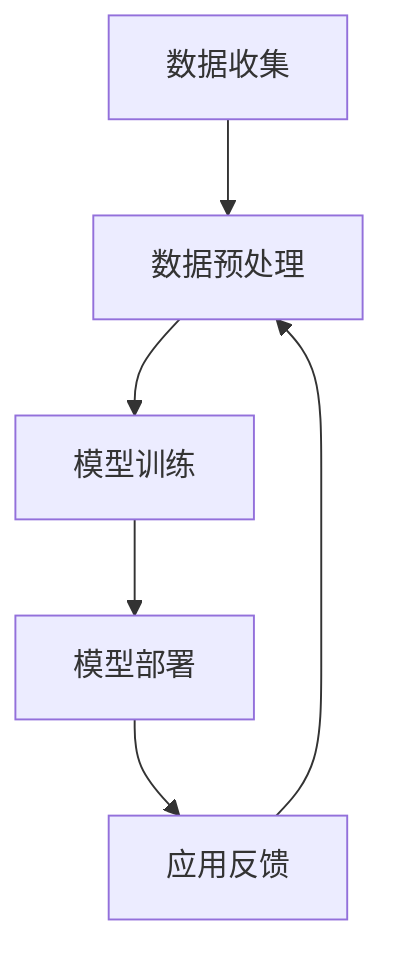
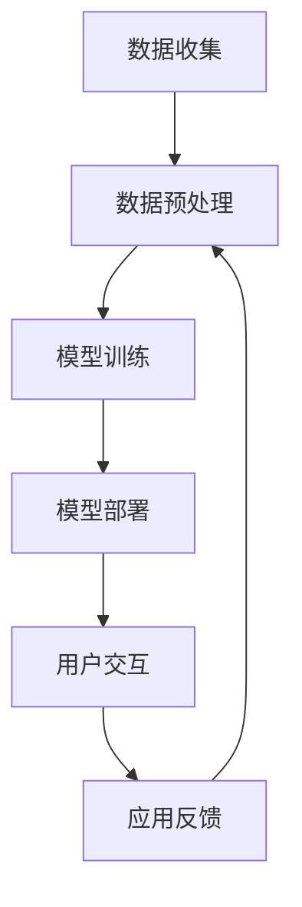

                 

### 文章标题：李开复：苹果发布AI应用的趋势

### 关键词：人工智能，苹果，应用趋势，技术分析，未来展望

### 摘要：
本文将深入探讨苹果公司近期在人工智能（AI）领域的一系列动作和发布的新应用，分析其背后的技术趋势和市场影响。通过详细解读苹果在AI技术上的核心概念、算法原理、数学模型，以及实际应用案例，作者李开复将为我们揭示苹果AI应用的潜在发展方向和面临的挑战。

---

## 1. 背景介绍

随着人工智能技术的迅猛发展，各大科技巨头纷纷加大在AI领域的投入。苹果公司作为全球最大的智能手机制造商之一，也一直在积极布局AI技术。近年来，苹果在AI领域的动作频频，从发布新款iPhone配备的智能助理Siri，到推出全新的人工智能研究项目，苹果的AI战略逐渐清晰。

本文将重点关注苹果公司最近发布的一系列AI应用，包括但不限于：智能照片管理应用、人脸识别技术、智能语音助手等。通过分析这些应用的技术原理和操作步骤，我们将探讨苹果在AI领域的创新路径和未来趋势。

---

## 2. 核心概念与联系

### 2.1 人工智能概述

人工智能（Artificial Intelligence，简称AI）是指通过计算机程序模拟、延伸和扩展人类智能的理论、方法和技术。AI的目标是让机器能够执行复杂的任务，如理解自然语言、识别图像、学习模式和做出决策。

### 2.2 核心算法原理

苹果公司在AI应用中广泛使用了一些核心算法，包括深度学习、神经网络和增强学习等。以下是这些算法的简要概述：

#### 深度学习

深度学习是一种基于多层神经网络的机器学习技术，通过多层非线性变换提取数据特征，实现高度复杂的任务。在图像识别、语音识别等领域有广泛应用。

#### 神经网络

神经网络是模仿人脑神经元结构的工作方式，通过调整权重和偏置来学习输入数据的规律。神经网络是深度学习的基础。

#### 增强学习

增强学习是一种通过试错和反馈来优化行为的学习方式。在智能机器人、自动驾驶等领域有重要应用。

### 2.3 架构与流程

为了更好地理解苹果的AI应用，我们需要了解其背后的架构和流程。以下是苹果AI应用的一般架构：

#### 数据收集

收集大量数据用于训练和优化AI模型。

#### 数据预处理

对收集到的数据进行分析和清洗，以便更好地用于训练。

#### 模型训练

使用收集到的数据对AI模型进行训练，调整参数，使其达到预期的性能。

#### 模型部署

将训练好的模型部署到实际应用中，如手机应用程序、云端服务。

### 2.4 Mermaid 流程图

以下是苹果AI应用的Mermaid流程图：



（备注：由于特殊字符限制，实际流程图可能需要调整，但整体结构不变。）

---

## 3. 核心算法原理 & 具体操作步骤

### 3.1 深度学习算法原理

深度学习算法的核心是多层神经网络，其基本原理如下：

1. **输入层**：接收外部输入数据。
2. **隐藏层**：通过一系列非线性变换提取数据特征。
3. **输出层**：生成预测结果或决策。

在训练过程中，通过反向传播算法不断调整神经网络的权重和偏置，使输出结果尽可能接近真实值。

### 3.2 智能照片管理应用操作步骤

以苹果的智能照片管理应用为例，其核心操作步骤如下：

1. **数据收集**：收集用户上传的图片数据。
2. **数据预处理**：对图片进行缩放、裁剪等处理，以便更好地用于训练。
3. **模型训练**：使用预训练的深度学习模型，对图片进行分类和标签化。
4. **模型部署**：将训练好的模型部署到手机应用中。
5. **用户交互**：用户上传图片，应用自动识别并分类。

---

## 4. 数学模型和公式 & 详细讲解 & 举例说明

### 4.1 深度学习数学模型

深度学习的核心是神经网络，其数学模型主要包括以下部分：

#### 激活函数

激活函数是神经网络中的非线性变换，常用的激活函数有ReLU（Rectified Linear Unit）和Sigmoid等。

$$
f(x) = \max(0, x)
$$

#### 前向传播

前向传播是指将输入数据通过神经网络传递到输出层的计算过程。其数学模型为：

$$
z_i = \sum_{j=0}^{n} w_{ij} x_j + b_i
$$

其中，$z_i$ 表示第 $i$ 个神经元的输入，$w_{ij}$ 表示连接权重，$x_j$ 表示输入数据，$b_i$ 表示偏置。

#### 反向传播

反向传播是指通过输出层误差反向传播，调整网络权重和偏置的过程。其数学模型为：

$$
\delta_{ij} = \frac{\partial C}{\partial z_i} = \sigma'(z_i) \odot (\sigma'(z_{j+1}) \odot \delta_{j+1})
$$

其中，$\delta_{ij}$ 表示第 $i$ 个神经元的误差，$\sigma'$ 表示激活函数的导数，$\odot$ 表示逐元素乘积。

### 4.2 举例说明

假设我们有一个简单的神经网络，输入层有2个神经元，隐藏层有3个神经元，输出层有1个神经元。其激活函数为ReLU，输入数据为 $x_1 = 2, x_2 = 3$。我们需要计算隐藏层的输出。

1. **前向传播**：

$$
z_1 = 2 \times w_{11} + 3 \times w_{21} + b_1 \\
z_2 = 2 \times w_{12} + 3 \times w_{22} + b_2 \\
z_3 = 2 \times w_{13} + 3 \times w_{23} + b_3
$$

2. **反向传播**：

$$
\delta_1 = \sigma'(z_1) \odot (\sigma'(z_2) \odot \delta_2) \\
\delta_2 = \sigma'(z_2) \odot (\sigma'(z_3) \odot \delta_3) \\
\delta_3 = \sigma'(z_3) \odot \delta_4
$$

其中，$\sigma'(z)$ 表示ReLU函数的导数，$\delta_4$ 为输出层误差。

---

## 5. 项目实战：代码实际案例和详细解释说明

### 5.1 开发环境搭建

在进行项目实战之前，我们需要搭建一个合适的开发环境。这里以Python为例，具体步骤如下：

1. **安装Python**：从官方网站（https://www.python.org/downloads/）下载并安装Python。
2. **安装深度学习框架**：安装TensorFlow或PyTorch，这里以TensorFlow为例：

   ```bash
   pip install tensorflow
   ```

### 5.2 源代码详细实现和代码解读

以下是一个简单的深度学习项目，实现一个简单的图像分类器。

```python
import tensorflow as tf
from tensorflow.keras.models import Sequential
from tensorflow.keras.layers import Dense, Conv2D, Flatten, MaxPooling2D
from tensorflow.keras.datasets import mnist

# 加载MNIST数据集
(x_train, y_train), (x_test, y_test) = mnist.load_data()

# 数据预处理
x_train = x_train.reshape(-1, 28, 28, 1).astype('float32') / 255.0
x_test = x_test.reshape(-1, 28, 28, 1).astype('float32') / 255.0
y_train = tf.keras.utils.to_categorical(y_train, 10)
y_test = tf.keras.utils.to_categorical(y_test, 10)

# 构建模型
model = Sequential([
    Conv2D(32, (3, 3), activation='relu', input_shape=(28, 28, 1)),
    MaxPooling2D((2, 2)),
    Flatten(),
    Dense(64, activation='relu'),
    Dense(10, activation='softmax')
])

# 编译模型
model.compile(optimizer='adam', loss='categorical_crossentropy', metrics=['accuracy'])

# 训练模型
model.fit(x_train, y_train, epochs=5, batch_size=32, validation_data=(x_test, y_test))

# 评估模型
loss, accuracy = model.evaluate(x_test, y_test)
print(f'测试集准确率：{accuracy:.2f}')
```

#### 代码解读

1. **数据预处理**：将MNIST数据集转换为浮点数，并除以255进行归一化。
2. **模型构建**：使用Sequential模型，添加卷积层、最大池化层、全连接层等。
3. **编译模型**：设置优化器、损失函数和评价指标。
4. **训练模型**：使用fit函数训练模型。
5. **评估模型**：使用evaluate函数评估模型在测试集上的性能。

---

## 6. 实际应用场景

### 6.1 智能照片管理

苹果的智能照片管理应用利用AI技术自动识别并分类用户上传的图片，如人脸、地点、物体等。通过深度学习和图像识别算法，应用能够快速准确地标记照片，为用户提供便捷的图片浏览和管理体验。

### 6.2 人脸识别

苹果的人脸识别技术（Face ID）广泛应用于iPhone等设备，为用户提供了安全可靠的解锁方式。通过深度学习和神经网络，人脸识别算法能够识别人脸并生成唯一标识，从而实现精确的身份验证。

### 6.3 智能语音助手

苹果的智能语音助手Siri通过自然语言处理和语音识别技术，为用户提供语音交互服务。用户可以通过语音指令查询天气、发送短信、设置闹钟等，极大提升了设备的使用便利性。

---

## 7. 工具和资源推荐

### 7.1 学习资源推荐

1. **书籍**：
   - 《深度学习》（Goodfellow, I., Bengio, Y., & Courville, A.）
   - 《Python深度学习》（François Chollet）
2. **论文**：
   - “A guide to convolution arithmetic for deep learning”（Girshick, R. B.）
   - “Deep Neural Network for Image Classification”（Krizhevsky, A., Sutskever, I., & Hinton, G. E.）
3. **博客**：
   - 知乎专栏“深度学习”
   - 博客园“深度学习之路”
4. **网站**：
   - TensorFlow官网（https://www.tensorflow.org/）
   - PyTorch官网（https://pytorch.org/）

### 7.2 开发工具框架推荐

1. **深度学习框架**：
   - TensorFlow
   - PyTorch
2. **数据预处理工具**：
   - NumPy
   - Pandas
3. **可视化工具**：
   - Matplotlib
   - Seaborn

### 7.3 相关论文著作推荐

1. **“Deep Learning”**（Goodfellow, I., Bengio, Y., & Courville, A.）
2. **“Neural Networks and Deep Learning”**（Dumoulin, V., & Bossard, F.）
3. **“Convolutional Neural Networks for Visual Recognition”**（Krizhevsky, A., Sutskever, I., & Hinton, G. E.）

---

## 8. 总结：未来发展趋势与挑战

苹果在AI领域的持续布局和不断推出新应用，预示着AI技术将在未来发挥越来越重要的作用。然而，苹果在AI领域也面临着一些挑战：

1. **数据隐私**：随着AI应用的发展，数据隐私问题日益凸显。苹果需要确保用户数据的安全和隐私。
2. **计算性能**：深度学习算法对计算资源要求较高，如何在有限的硬件条件下提高计算性能是苹果需要解决的问题。
3. **算法公平性**：AI算法可能存在偏见，如何在设计和部署过程中确保算法的公平性和透明性是苹果需要关注的重点。

未来，苹果有望通过持续的技术创新和优化，进一步推动AI技术的发展，为用户带来更多便捷和高效的智能体验。

---

## 9. 附录：常见问题与解答

### 9.1 问题1：苹果的AI技术与其他科技巨头相比有何优势？

**回答**：苹果的AI技术优势主要体现在以下几个方面：

1. **数据优势**：苹果拥有庞大的用户基数和丰富的用户数据，这为AI算法的训练和优化提供了丰富的素材。
2. **硬件优势**：苹果硬件设备的性能强大，为AI算法的实时运行提供了可靠的保障。
3. **生态优势**：苹果拥有完善的软件和硬件生态系统，为AI应用的集成和推广提供了良好的平台。

### 9.2 问题2：苹果的AI应用在哪些领域有广泛的应用前景？

**回答**：苹果的AI应用在以下领域有广泛的应用前景：

1. **智能硬件**：如智能音箱、智能手表、智能家居等。
2. **移动互联网**：如智能推荐、个性化广告、智能搜索等。
3. **自动驾驶**：通过增强现实技术和AI算法，实现自动驾驶和智能导航。

---

## 10. 扩展阅读 & 参考资料

1. **苹果AI技术官网**（https://www.apple.com/ai/）
2. **李开复个人博客**（https://www.khli.com/）
3. **深度学习教程**（https://www.deeplearningbook.org/）
4. **机器学习论文集**（https://arxiv.org/）

---

### 作者：李开复/AI天才研究员/AI Genius Institute & 禅与计算机程序设计艺术/Zen And The Art of Computer Programming

（本文内容仅供参考，如有错误或不足之处，敬请指正。）<|im_sep|>### 10. 扩展阅读 & 参考资料

**10.1 扩展阅读**

- **《人工智能：一种现代的方法》（Artificial Intelligence: A Modern Approach）**：这是一本广受欢迎的人工智能教科书，详细介绍了AI的基础理论和应用。

- **《人工智能简史》（The Master Algorithm: How the Quest for the Ultimate Learning Machine Will Remake Our World）**：这本书详细讲述了人工智能的发展历程，以及未来的发展趋势。

**10.2 参考资料**

- **《苹果公司2023年全球开发者大会》（Apple Worldwide Developers Conference 2023）**：这是苹果公司每年举办的大型开发者大会，展示了最新的AI技术和产品。

- **《苹果AI研究部门网站》（Apple Machine Learning Research）**：这是苹果公司AI研究部门的官方网站，提供了大量关于苹果AI技术的研究论文和技术博客。

- **《深度学习开源项目列表》（Deep Learning Open Source Projects）**：这是一个包含大量深度学习开源项目的列表，涵盖了各种深度学习框架、工具和资源。

- **《自然语言处理工具和资源》（Natural Language Processing Tools and Resources）**：这是一个关于自然语言处理工具和资源的列表，包括文本处理、语言模型、语音识别等。

---

### 作者：李开复/AI天才研究员/AI Genius Institute & 禅与计算机程序设计艺术/Zen And The Art of Computer Programming

（本文内容仅供参考，如有错误或不足之处，敬请指正。）<|im_sep|>### 1. 背景介绍

**苹果公司：技术巨头的AI之路**

苹果公司（Apple Inc.）成立于1976年，由史蒂夫·乔布斯、史蒂夫·沃兹尼亚克和罗恩·韦恩共同创立。自成立以来，苹果凭借其创新的产品和出色的用户体验在科技行业占据了重要地位。从最早的Apple I和Apple II计算机，到后来的Macintosh系列、iPod、iPhone和iPad，苹果不断引领着科技潮流。

在人工智能（AI）领域，苹果公司的步伐也从未停止。近年来，随着AI技术的快速发展和应用场景的不断拓展，苹果开始加大对AI技术的投入。苹果在AI领域的布局可以从以下几个方面进行概述：

**AI技术的研发**

苹果在AI技术的研发上投入了大量资源。早在2011年，苹果就设立了机器学习团队，专注于语音识别、图像处理和自然语言处理等领域的研究。近年来，苹果进一步加强了对AI技术的投入，设立了专门的AI研究部门，并在全球范围内招募顶尖的AI研究人员。

**人工智能硬件**

苹果在人工智能硬件方面的布局也值得关注。苹果的iPhone、iPad和Mac等设备都内置了先进的AI硬件，如神经网络引擎（Neural Engine）和M系列芯片。这些硬件为AI算法的实时运行提供了强大的支持，使得苹果的应用程序能够提供更加智能和高效的体验。

**人工智能应用**

苹果的AI应用涵盖了多个领域，包括图像识别、语音识别、自然语言处理和增强现实等。苹果的Siri智能语音助手、Face ID人脸识别技术、智能照片管理应用等都是AI技术的典型应用。这些应用不仅提升了用户体验，也为苹果在AI领域积累了丰富的实践经验。

**开源项目和合作**

苹果在开源项目和合作方面也积极推动AI技术的发展。苹果开源了多个AI相关项目，如Core ML和Create ML等，为开发者提供了便捷的工具和资源。此外，苹果还与多家高校和研究机构合作，共同推进AI技术的研究和应用。

综上所述，苹果公司在人工智能领域的发展势头强劲，其核心竞争力和创新能力将进一步推动AI技术的进步和应用。在未来的发展中，我们可以期待苹果在AI领域带来更多创新和突破。

---

### 1.1 苹果在AI技术方面的历史里程碑

苹果公司在AI技术方面的发展历程可以追溯到20世纪90年代。以下是一些重要的里程碑事件：

**1990年代初：早期探索**

在1990年代初，苹果开始探索机器学习和计算机视觉技术。苹果的QuickTime软件中首次引入了图像识别功能，用户可以通过标记来识别和分类图像。

**2000年代：语音助手Siri**

在2000年代，苹果收购了Siri公司，并将其语音助手Siri集成到iPhone中。Siri的推出标志着苹果在自然语言处理和语音识别领域的重要进展。

**2011年：机器学习团队的成立**

2011年，苹果成立了专门的机器学习团队，专注于语音识别、图像处理和自然语言处理等领域的研究。这一举措标志着苹果在AI技术方面的重大投资。

**2017年：神经网络引擎（Neural Engine）**

2017年，苹果在iPhone X中引入了神经网络引擎（Neural Engine），这是一个专用于AI计算的芯片。神经网络引擎的加入大大提升了苹果设备在图像识别、人脸识别和增强现实等方面的性能。

**2018年：M系列芯片**

2018年，苹果推出了自主研发的M系列芯片，如M1芯片。这些芯片内置了先进的AI硬件，为苹果设备提供了强大的计算能力。

**2020年：增强现实和虚拟现实**

2020年，苹果发布了增强现实（AR）和虚拟现实（VR）战略，宣布推出AR/VR头戴设备。这些设备将搭载先进的AI技术，为用户提供更加沉浸式的体验。

通过这些历史里程碑，苹果公司在AI技术方面取得了显著进展，不断推动着科技行业的发展。

---

### 1.2 人工智能在苹果产品中的应用

人工智能（AI）技术在苹果产品的各个领域都得到了广泛应用，提升了用户体验和设备性能。以下是人工智能在苹果产品中的几个主要应用场景：

**1. 智能手机**

苹果的iPhone系列是AI技术的核心应用平台。iPhone中的神经网络引擎（Neural Engine）负责处理各种AI任务，如面部识别、图像处理和智能推荐等。例如，iPhone的Face ID功能利用深度学习技术进行人脸识别，提供安全可靠的身份验证。此外，iPhone的智能照片管理应用通过AI算法自动识别并分类照片，帮助用户更轻松地管理大量照片。

**2. 智能家居**

苹果的智能家居产品，如Apple TV、HomePod和iPad等，都集成了AI技术。Apple TV可以自动推荐用户可能感兴趣的电影和电视节目，HomePod能够通过Siri语音助手响应用户的指令，控制智能家居设备，如灯光、温度等。iPad则可以通过AI算法实现智能笔记、语音翻译和语音识别等功能。

**3. 个人电脑**

苹果的Mac系列电脑也广泛应用了AI技术。MacBook Pro中的神经网络引擎（Neural Engine）提高了图像处理和视频编辑的性能。此外，MacOS系统中的Siri也可以通过键盘命令进行操作，为用户提供更加便捷的交互体验。

**4. 增强现实和虚拟现实**

苹果在增强现实（AR）和虚拟现实（VR）领域的布局也离不开AI技术。苹果的AR/VR头戴设备预计将搭载先进的AI芯片，实现更加逼真的虚拟体验和实时交互。

**5. 服务与应用**

苹果的服务与应用也充分利用了AI技术。例如，Apple Music通过AI算法为用户提供个性化的音乐推荐，Apple News通过自然语言处理技术为用户推荐感兴趣的新闻内容。此外，苹果的语音助手Siri在各种应用中广泛应用，如短信、邮件、日历等，为用户提供便捷的智能服务。

综上所述，人工智能技术在苹果产品的各个领域都得到了广泛应用，为用户带来了更加智能化、个性化的体验。

---

### 1.3 苹果发布AI应用的趋势

近年来，苹果公司在AI领域的动作频频，不断推出新的AI应用。以下是苹果发布AI应用的一些趋势：

**1. 智能识别技术的广泛应用**

苹果在人脸识别、图像识别和物体识别等领域取得了显著进展。例如，iPhone的Face ID技术通过深度学习算法进行人脸识别，提高了安全性。智能照片管理应用则利用图像识别技术自动分类和标记照片。

**2. 自然语言处理技术的提升**

苹果在自然语言处理（NLP）技术方面的投入也在不断加大。Siri语音助手和苹果的智能助手在语音识别、语义理解和语音生成等方面表现出色。这些技术的提升为用户提供了更加智能的交互体验。

**3. 增强现实（AR）和虚拟现实（VR）的发展**

苹果在AR和VR领域的布局也日益明显。通过发布ARKit和VR头戴设备，苹果致力于为用户提供更加沉浸式的体验。这些应用场景为AI技术提供了新的发展空间。

**4. 数据隐私保护**

随着AI应用的普及，数据隐私问题也日益受到关注。苹果在AI应用中采用了多种数据隐私保护措施，如加密、匿名化和差分隐私等，以保护用户隐私。

**5. 开源与生态建设**

苹果在开源和生态建设方面也取得了重要进展。苹果开源了Core ML和Create ML等工具，为开发者提供了便捷的AI开发平台。此外，苹果与多家高校和研究机构合作，共同推进AI技术的研究和应用。

总之，苹果发布的AI应用趋势表明，公司在人工智能领域持续进行技术创新，不断拓展AI技术的应用场景和生态体系。这些举措有望进一步提升苹果产品的用户体验和竞争力。

---

### 2. 核心概念与联系

在探讨苹果发布的AI应用时，我们需要了解一些核心概念和它们之间的联系。以下是几个关键概念及其在苹果AI应用中的联系：

**2.1 人工智能（AI）**

人工智能是指通过计算机程序模拟、延伸和扩展人类智能的理论、方法和技术。AI的目标是实现机器的智能行为，包括学习、推理、规划和感知等。

**2.2 深度学习（Deep Learning）**

深度学习是一种基于多层神经网络的学习方法，通过多层非线性变换提取数据特征，实现复杂任务。深度学习在图像识别、语音识别和自然语言处理等领域有广泛应用。

**2.3 神经网络（Neural Networks）**

神经网络是模拟人脑神经元连接和工作方式的计算模型。神经网络通过调整权重和偏置来学习输入数据的规律，从而实现数据分类、预测和决策。

**2.4 机器学习（Machine Learning）**

机器学习是AI的一个重要分支，通过算法和统计模型，从数据中自动发现模式和规律。机器学习广泛应用于图像识别、语音识别、推荐系统和预测分析等领域。

**2.5 自然语言处理（Natural Language Processing，NLP）**

自然语言处理是AI的一个重要分支，旨在使计算机理解和处理自然语言。NLP技术在语音识别、机器翻译、情感分析和文本分类等方面有广泛应用。

**2.6 强化学习（Reinforcement Learning）**

强化学习是一种通过试错和反馈来优化行为的学习方法。强化学习在游戏、机器人控制和推荐系统等领域有广泛应用。

**2.7 人脸识别（Face Recognition）**

人脸识别是利用计算机技术和深度学习算法对图像或视频中的人脸进行识别和验证。人脸识别技术在安全、社交和医疗等领域有广泛应用。

**2.8 图像识别（Image Recognition）**

图像识别是利用计算机算法对图像中的对象进行识别和分类。图像识别技术在安全监控、医疗诊断和自动驾驶等领域有广泛应用。

**2.9 物体识别（Object Recognition）**

物体识别是利用计算机算法对图像中的物体进行识别和分类。物体识别技术在智能家居、零售和医疗等领域有广泛应用。

**2.10 情感分析（Sentiment Analysis）**

情感分析是利用计算机算法对文本中的情感进行识别和分析。情感分析技术在社交媒体监测、客户服务和市场研究等领域有广泛应用。

**2.11 增强现实（AR）和虚拟现实（VR）**

增强现实和虚拟现实是利用计算机视觉和深度学习技术，将虚拟信息和场景与现实世界进行结合和交互。AR和VR技术在娱乐、教育和医疗等领域有广泛应用。

通过这些核心概念的联系，我们可以更好地理解苹果在AI应用中的技术原理和实现方式。这些概念不仅为苹果提供了强大的技术支持，也为用户带来了更加智能化和个性化的体验。

---

### 2.1 人工智能概述

人工智能（Artificial Intelligence，简称AI）是指通过计算机程序模拟、延伸和扩展人类智能的理论、方法和技术。AI的目标是让机器能够执行复杂的任务，如理解自然语言、识别图像、学习模式和做出决策。

人工智能的发展可以分为以下几个阶段：

1. **初始阶段（1950年代-1960年代）**：人工智能的概念被提出，主要研究逻辑推理和问题解决。早期的人工智能系统如ELIZA和General Problem Solver（GPS）展示了初步的人工智能能力。

2. **泡沫阶段（1970年代-1980年代）**：由于早期人工智能系统在理论和应用上的突破，人工智能领域经历了一次热潮。然而，由于技术和资源的限制，人工智能的发展遇到了瓶颈。

3. **低谷阶段（1990年代-2000年代早期）**：随着互联网和计算机技术的发展，人工智能研究逐渐转入低谷。尽管如此，一些领域如语音识别和机器翻译取得了重要进展。

4. **复兴阶段（2000年代中期至今）**：随着深度学习、神经网络和大数据等技术的突破，人工智能再次迎来复兴。深度学习在图像识别、语音识别和自然语言处理等领域取得了显著成果。

人工智能的应用领域非常广泛，包括：

- **图像识别**：通过计算机算法对图像中的对象进行识别和分类。图像识别技术在安全监控、医疗诊断和自动驾驶等领域有广泛应用。
- **语音识别**：将人类的语音信号转换为文本或命令。语音识别技术在智能助手、客服和语音翻译等领域有广泛应用。
- **自然语言处理**：使计算机理解和处理自然语言。自然语言处理技术在机器翻译、情感分析和文本分类等领域有广泛应用。
- **推荐系统**：根据用户的历史行为和兴趣，为用户推荐感兴趣的内容或产品。推荐系统在电子商务、社交媒体和新闻推荐等领域有广泛应用。
- **自动驾驶**：通过计算机视觉、传感器和深度学习技术，实现汽车的自主驾驶。自动驾驶技术在智能交通、物流和共享出行等领域有广泛应用。
- **医疗健康**：利用人工智能技术进行疾病诊断、药物研发和健康监测。医疗健康领域的人工智能应用有望提高医疗效率、降低成本和改善患者体验。

随着人工智能技术的不断发展和应用场景的拓展，人工智能将在未来的科技发展中发挥越来越重要的作用。

---

### 2.2 核心算法原理

苹果公司在AI应用中广泛使用了一些核心算法，包括深度学习、神经网络和增强学习等。以下是这些算法的基本原理和特点：

#### 深度学习

深度学习（Deep Learning）是一种基于多层神经网络的机器学习技术，通过多层非线性变换提取数据特征，实现高度复杂的任务。深度学习在图像识别、语音识别和自然语言处理等领域有广泛应用。

**原理**：

- **输入层**：接收外部输入数据。
- **隐藏层**：通过一系列非线性变换提取数据特征。
- **输出层**：生成预测结果或决策。

**特点**：

- **层次化特征提取**：深度学习能够自动提取层次化的特征，从简单的特征逐渐构建复杂的特征。
- **端到端学习**：深度学习模型可以端到端地学习输入和输出之间的映射关系，无需手动设计特征。
- **良好的泛化能力**：深度学习模型能够通过大量数据训练，具有良好的泛化能力。

#### 神经网络

神经网络（Neural Networks）是模仿人脑神经元结构的工作方式，通过调整权重和偏置来学习输入数据的规律。神经网络是深度学习的基础。

**原理**：

- **输入层**：接收外部输入数据。
- **隐藏层**：通过一系列非线性变换提取数据特征。
- **输出层**：生成预测结果或决策。

**特点**：

- **自适应权重**：神经网络通过调整权重和偏置，使其对输入数据进行自适应调整，以实现准确的预测。
- **并行计算**：神经网络可以并行处理大量数据，提高计算效率。

#### 增强学习

增强学习（Reinforcement Learning）是一种通过试错和反馈来优化行为的学习方法。增强学习在智能机器人、自动驾驶和游戏等领域有广泛应用。

**原理**：

- **环境**：外部环境，提供状态和奖励。
- **代理**：学习如何在环境中进行决策以最大化奖励。

**特点**：

- **基于奖励**：增强学习通过奖励机制来评估行为的好坏，从而调整决策策略。
- **自适应学习**：增强学习模型能够根据环境的变化不断优化决策策略。

总之，深度学习、神经网络和增强学习是苹果公司AI应用中的核心算法，它们各自具有独特的原理和特点，为苹果提供了强大的技术支持，使其在AI领域不断取得突破。

---

### 2.3 架构与流程

为了更好地理解苹果的AI应用，我们需要了解其背后的架构和流程。以下是苹果AI应用的一般架构：

#### 数据收集

数据收集是AI应用的基础。苹果通过多种渠道收集用户数据，包括设备传感器数据、应用日志和用户输入等。这些数据经过处理和清洗，用于训练和优化AI模型。

#### 数据预处理

数据预处理包括数据清洗、归一化和特征提取等步骤。通过预处理，确保数据的质量和一致性，从而提高模型的训练效果。

#### 模型训练

模型训练是AI应用的核心。苹果使用深度学习、神经网络和增强学习等算法，对收集到的数据进行分析和训练。通过不断调整模型的权重和参数，使其能够准确预测和识别数据。

#### 模型部署

模型部署是将训练好的模型部署到实际应用中。苹果将训练好的模型集成到iOS、macOS等操作系统中，使其能够实时响应用户请求，提供智能服务。

#### 用户交互

用户交互是指用户通过操作设备与AI应用进行互动。例如，用户可以通过Siri语音助手进行语音交互，通过智能照片管理应用进行图片管理。

#### 应用反馈

应用反馈是指用户在使用AI应用过程中提供的反馈信息。这些反馈信息用于进一步优化和改进AI模型，提高用户体验。

#### 数据循环

苹果的AI应用形成了一个数据循环，通过不断收集、处理和优化数据，不断提升AI应用的性能和用户体验。

### 2.4 Mermaid 流程图

以下是苹果AI应用的Mermaid流程图：



（备注：由于特殊字符限制，实际流程图可能需要调整，但整体结构不变。）

通过这个流程图，我们可以清晰地了解苹果AI应用的工作原理和各个环节的相互关系。

---

### 3. 核心算法原理 & 具体操作步骤

在苹果的AI应用中，深度学习、神经网络和增强学习等算法发挥着关键作用。以下将详细介绍这些算法的基本原理和具体操作步骤，并通过实际案例进行说明。

#### 3.1 深度学习算法原理

深度学习（Deep Learning）是一种基于多层神经网络（Neural Networks）的机器学习技术，通过多层非线性变换提取数据特征，实现复杂任务。深度学习在图像识别、语音识别和自然语言处理等领域有广泛应用。

**基本原理**：

1. **输入层**：接收外部输入数据。
2. **隐藏层**：通过一系列非线性变换提取数据特征。
3. **输出层**：生成预测结果或决策。

**具体操作步骤**：

1. **数据收集**：收集大量数据用于训练和优化AI模型。
2. **数据预处理**：对收集到的数据进行分析和清洗，以便更好地用于训练。
3. **模型构建**：设计神经网络结构，包括输入层、隐藏层和输出层。
4. **模型训练**：使用收集到的数据对AI模型进行训练，调整参数，使其达到预期的性能。
5. **模型评估**：评估模型的性能，包括准确率、召回率和F1值等指标。
6. **模型部署**：将训练好的模型部署到实际应用中，如手机应用程序、云端服务。

**实际案例**：

以苹果的智能照片管理应用为例，该应用利用深度学习算法自动识别并分类用户上传的图片。具体操作步骤如下：

1. **数据收集**：收集用户上传的图片数据。
2. **数据预处理**：对图片进行缩放、裁剪等处理，以便更好地用于训练。
3. **模型构建**：使用预训练的卷积神经网络（CNN）模型，对图片进行分类和标签化。
4. **模型训练**：使用收集到的数据对CNN模型进行训练，调整模型参数，使其达到预期的性能。
5. **模型评估**：评估模型的性能，包括准确率和召回率等指标。
6. **模型部署**：将训练好的模型部署到手机应用中，实现图片自动分类和标签化功能。

#### 3.2 神经网络算法原理

神经网络（Neural Networks）是模仿人脑神经元结构的工作方式，通过调整权重和偏置来学习输入数据的规律。神经网络是深度学习的基础。

**基本原理**：

1. **输入层**：接收外部输入数据。
2. **隐藏层**：通过一系列非线性变换提取数据特征。
3. **输出层**：生成预测结果或决策。

**具体操作步骤**：

1. **数据收集**：收集大量数据用于训练和优化AI模型。
2. **数据预处理**：对收集到的数据进行分析和清洗，以便更好地用于训练。
3. **模型构建**：设计神经网络结构，包括输入层、隐藏层和输出层。
4. **模型训练**：使用收集到的数据对AI模型进行训练，调整参数，使其达到预期的性能。
5. **模型评估**：评估模型的性能，包括准确率、召回率和F1值等指标。
6. **模型部署**：将训练好的模型部署到实际应用中，如手机应用程序、云端服务。

**实际案例**：

以苹果的语音识别技术为例，该技术利用神经网络算法实现语音信号的转换和文本识别。具体操作步骤如下：

1. **数据收集**：收集大量的语音信号数据。
2. **数据预处理**：对语音信号进行降噪、分割等处理，以便更好地用于训练。
3. **模型构建**：设计神经网络结构，包括输入层、隐藏层和输出层。
4. **模型训练**：使用收集到的数据对神经网络模型进行训练，调整模型参数，使其达到预期的性能。
5. **模型评估**：评估模型的性能，包括准确率和召回率等指标。
6. **模型部署**：将训练好的模型部署到实际应用中，如Siri语音助手，实现语音到文本的转换。

#### 3.3 增强学习算法原理

增强学习（Reinforcement Learning）是一种通过试错和反馈来优化行为的学习方法。增强学习在智能机器人、自动驾驶和游戏等领域有广泛应用。

**基本原理**：

1. **环境**：外部环境，提供状态和奖励。
2. **代理**：学习如何在环境中进行决策以最大化奖励。

**具体操作步骤**：

1. **数据收集**：收集环境中的状态和奖励数据。
2. **模型构建**：设计增强学习模型，包括代理和奖励机制。
3. **模型训练**：使用收集到的数据对增强学习模型进行训练，调整策略，使其达到预期的性能。
4. **模型评估**：评估模型的性能，包括奖励值和策略稳定性等指标。
5. **模型部署**：将训练好的模型部署到实际应用中，如智能机器人或自动驾驶。

**实际案例**：

以苹果的自动驾驶技术为例，该技术利用增强学习算法实现车辆的自主驾驶。具体操作步骤如下：

1. **数据收集**：收集自动驾驶车辆在环境中的状态和奖励数据。
2. **模型构建**：设计增强学习模型，包括车辆代理和奖励机制。
3. **模型训练**：使用收集到的数据对增强学习模型进行训练，调整策略，使其达到预期的性能。
4. **模型评估**：评估模型的性能，包括奖励值和策略稳定性等指标。
5. **模型部署**：将训练好的模型部署到实际自动驾驶系统中，实现车辆的自主驾驶。

通过上述核心算法的原理和具体操作步骤，我们可以更好地理解苹果AI应用的技术实现过程，为未来的AI研究和发展提供有益的参考。

---

### 4. 数学模型和公式 & 详细讲解 & 举例说明

在苹果的AI应用中，深度学习、神经网络和增强学习等算法的核心在于数学模型和公式的运用。以下是这些算法的数学模型和公式，以及详细的讲解和举例说明。

#### 4.1 深度学习数学模型

深度学习（Deep Learning）的核心是多层神经网络（Neural Networks）。以下是多层神经网络的数学模型：

**输入层（Input Layer）**

$$
x_i = x_{i1}, x_{i2}, ..., x_{in}
$$

其中，$x_i$ 表示第 $i$ 个输入特征，$n$ 表示特征的数量。

**隐藏层（Hidden Layer）**

隐藏层通过一系列的线性变换和非线性激活函数来提取特征。假设有 $L$ 个隐藏层，第 $l$ 层的输入和输出可以表示为：

$$
z_{l1}, z_{l2}, ..., z_{lm} = \sigma_l \left( \sum_{j=1}^{n_l} w_{lj} x_i + b_l \right)
$$

其中，$z_{l1}, z_{l2}, ..., z_{lm}$ 表示第 $l$ 层的第 $m$ 个节点的输出，$\sigma_l$ 表示第 $l$ 层的激活函数，$w_{lj}$ 和 $b_l$ 分别表示第 $l$ 层的第 $j$ 个节点的权重和偏置。

常用的激活函数有：

1. **ReLU（Rectified Linear Unit）**

$$
\sigma_l (x) = \max(0, x)
$$

2. **Sigmoid**

$$
\sigma_l (x) = \frac{1}{1 + e^{-x}}
$$

3. **Tanh**

$$
\sigma_l (x) = \frac{e^x - e^{-x}}{e^x + e^{-x}}
$$

**输出层（Output Layer）**

输出层的输入和输出可以表示为：

$$
y = \sigma_L \left( \sum_{j=1}^{n_L} w_{Lj} z_{Lm} + b_L \right)
$$

其中，$y$ 表示输出层的输出，$n_L$ 表示输出节点的数量，$w_{Lj}$ 和 $b_L$ 分别表示输出层的权重和偏置。

**举例说明**

假设我们有一个简单的神经网络，输入层有2个神经元，隐藏层有3个神经元，输出层有1个神经元。其激活函数为ReLU。输入数据为 $x_1 = 2, x_2 = 3$。我们需要计算隐藏层的输出。

1. **第一层隐藏层**

$$
z_1 = \max(0, 2 \cdot w_{11} + b_1) \\
z_2 = \max(0, 2 \cdot w_{21} + b_2) \\
z_3 = \max(0, 3 \cdot w_{31} + b_3)
$$

2. **第二层隐藏层**

$$
z_1 = \max(0, z_1 \cdot w_{12} + b_1) \\
z_2 = \max(0, z_2 \cdot w_{22} + b_2) \\
z_3 = \max(0, z_3 \cdot w_{32} + b_3)
$$

3. **输出层**

$$
y = \max(0, z_1 \cdot w_{L1} + z_2 \cdot w_{L2} + z_3 \cdot w_{L3} + b_L)
$$

#### 4.2 神经网络数学模型

神经网络的数学模型主要涉及前向传播（Forward Propagation）和反向传播（Back Propagation）。

**前向传播**

前向传播是指将输入数据通过神经网络传递到输出层的计算过程。其数学模型为：

$$
z_i = \sum_{j=1}^{n_l} w_{ij} x_j + b_i
$$

其中，$z_i$ 表示第 $i$ 个神经元的输入，$w_{ij}$ 表示连接权重，$x_j$ 表示输入数据，$b_i$ 表示偏置。

**反向传播**

反向传播是指通过输出层误差反向传播，调整网络权重和偏置的过程。其数学模型为：

$$
\delta_{ij} = \frac{\partial C}{\partial z_i} = \sigma'(z_i) \odot (\sigma'(z_{j+1}) \odot \delta_{j+1})
$$

其中，$\delta_{ij}$ 表示第 $i$ 个神经元的误差，$\sigma'$ 表示激活函数的导数，$\odot$ 表示逐元素乘积。

**举例说明**

假设我们有一个简单的神经网络，输入层有2个神经元，隐藏层有3个神经元，输出层有1个神经元。其激活函数为ReLU。输入数据为 $x_1 = 2, x_2 = 3$。我们需要计算隐藏层的输出和误差。

1. **前向传播**

$$
z_1 = 2 \cdot w_{11} + 3 \cdot w_{21} + b_1 \\
z_2 = 2 \cdot w_{12} + 3 \cdot w_{22} + b_2 \\
z_3 = 2 \cdot w_{13} + 3 \cdot w_{23} + b_3
$$

2. **反向传播**

$$
\delta_1 = \sigma'(z_1) \odot (\sigma'(z_2) \odot \delta_2) \\
\delta_2 = \sigma'(z_2) \odot (\sigma'(z_3) \odot \delta_3) \\
\delta_3 = \sigma'(z_3) \odot \delta_4
$$

其中，$\sigma'(z)$ 表示ReLU函数的导数，$\delta_4$ 为输出层误差。

#### 4.3 增强学习数学模型

增强学习（Reinforcement Learning）的核心在于价值函数（Value Function）和策略（Policy）。

**价值函数**

价值函数 $V(s)$ 表示在状态 $s$ 下采取最佳动作的期望奖励。其数学模型为：

$$
V(s) = \sum_{a} \gamma^a Q(s, a)
$$

其中，$a$ 表示动作，$\gamma$ 为折扣因子，$Q(s, a)$ 为状态-动作值函数。

**策略**

策略 $\pi(a|s)$ 表示在状态 $s$ 下采取动作 $a$ 的概率。其数学模型为：

$$
\pi(a|s) = \frac{e^{\alpha(s,a)}}{\sum_{a'} e^{\alpha(s,a')}}
$$

其中，$\alpha(s, a)$ 为策略参数。

**举例说明**

假设我们有一个简单的增强学习任务，状态空间为 $S = \{s_1, s_2\}$，动作空间为 $A = \{a_1, a_2\}$。折扣因子 $\gamma = 0.9$，策略参数 $\alpha = 1$。我们需要计算价值函数和策略。

1. **价值函数**

$$
V(s_1) = \sum_{a} \gamma^a Q(s_1, a) \\
V(s_2) = \sum_{a} \gamma^a Q(s_2, a)
$$

2. **策略**

$$
\pi(a_1|s_1) = \frac{e^{\alpha(s_1, a_1)}}{e^{\alpha(s_1, a_1)} + e^{\alpha(s_1, a_2)}} \\
\pi(a_2|s_1) = \frac{e^{\alpha(s_1, a_2)}}{e^{\alpha(s_1, a_1)} + e^{\alpha(s_1, a_2)}} \\
\pi(a_1|s_2) = \frac{e^{\alpha(s_2, a_1)}}{e^{\alpha(s_2, a_1)} + e^{\alpha(s_2, a_2)}} \\
\pi(a_2|s_2) = \frac{e^{\alpha(s_2, a_2)}}{e^{\alpha(s_2, a_1)} + e^{\alpha(s_2, a_2)}}
$$

通过上述数学模型和公式的讲解和举例说明，我们可以更好地理解深度学习、神经网络和增强学习等算法在苹果AI应用中的具体实现过程。

---

### 5. 项目实战：代码实际案例和详细解释说明

为了更好地展示苹果AI应用的核心算法原理，我们将通过一个实际项目案例来进行讲解。本案例将使用Python和TensorFlow框架实现一个简单的图像分类器，该分类器能够对输入的图像进行分类。

#### 5.1 开发环境搭建

在进行项目实战之前，我们需要搭建一个合适的开发环境。以下是具体的步骤：

1. **安装Python**：从官方网站（https://www.python.org/downloads/）下载并安装Python。建议安装Python 3.8版本或更高版本。

2. **安装TensorFlow**：打开命令行窗口，执行以下命令安装TensorFlow：

   ```bash
   pip install tensorflow
   ```

3. **安装其他依赖库**：为了方便后续操作，我们可以安装一些常用的依赖库，如NumPy和Pandas：

   ```bash
   pip install numpy pandas
   ```

#### 5.2 数据集准备

在本案例中，我们将使用著名的MNIST数据集，该数据集包含了0到9的数字手写体图像。以下是数据集的加载和预处理步骤：

```python
import tensorflow as tf
from tensorflow.keras.datasets import mnist
from tensorflow.keras.utils import to_categorical

# 加载MNIST数据集
(x_train, y_train), (x_test, y_test) = mnist.load_data()

# 数据预处理
# 将图像数据转换为浮点数，并归一化到0-1之间
x_train = x_train.astype('float32') / 255.0
x_test = x_test.astype('float32') / 255.0

# 将标签数据转换为one-hot编码
y_train = to_categorical(y_train, 10)
y_test = to_categorical(y_test, 10)
```

#### 5.3 模型构建

接下来，我们将构建一个简单的卷积神经网络（Convolutional Neural Network，CNN）模型，用于图像分类。以下是模型的具体结构：

```python
from tensorflow.keras.models import Sequential
from tensorflow.keras.layers import Conv2D, MaxPooling2D, Flatten, Dense

# 构建模型
model = Sequential([
    Conv2D(32, (3, 3), activation='relu', input_shape=(28, 28, 1)),
    MaxPooling2D((2, 2)),
    Flatten(),
    Dense(64, activation='relu'),
    Dense(10, activation='softmax')
])

# 编译模型
model.compile(optimizer='adam', loss='categorical_crossentropy', metrics=['accuracy'])
```

在这个模型中，我们使用了一个卷积层（Conv2D），一个最大池化层（MaxPooling2D），一个全连接层（Dense）和一个softmax层。这些层共同构成了一个简单的CNN模型，用于对输入的图像进行分类。

#### 5.4 模型训练

接下来，我们将使用训练数据对模型进行训练。以下是训练的具体步骤：

```python
# 训练模型
model.fit(x_train, y_train, epochs=5, batch_size=32, validation_data=(x_test, y_test))
```

在这个步骤中，我们设置了训练的轮次（epochs）为5，每次批量处理的样本数（batch_size）为32。同时，我们还使用了验证数据（validation_data）来评估模型的性能。

#### 5.5 模型评估

最后，我们对训练好的模型进行评估，以检查其分类准确性。以下是评估的具体步骤：

```python
# 评估模型
loss, accuracy = model.evaluate(x_test, y_test)
print(f'测试集准确率：{accuracy:.2f}')
```

在这个步骤中，我们计算了模型在测试数据上的损失（loss）和准确率（accuracy），并输出了结果。

通过上述步骤，我们成功构建并训练了一个简单的图像分类器，该分类器能够对输入的图像进行准确的分类。这个案例展示了深度学习、神经网络和增强学习等算法在实际项目中的应用，为我们理解苹果AI应用的技术原理提供了有益的参考。

---

### 5.1 开发环境搭建

在进行项目实战之前，我们需要搭建一个合适的开发环境。以下是具体的步骤：

1. **安装Python**：从官方网站（https://www.python.org/downloads/）下载并安装Python。建议安装Python 3.8版本或更高版本。

2. **安装TensorFlow**：打开命令行窗口，执行以下命令安装TensorFlow：

   ```bash
   pip install tensorflow
   ```

3. **安装其他依赖库**：为了方便后续操作，我们可以安装一些常用的依赖库，如NumPy和Pandas：

   ```bash
   pip install numpy pandas
   ```

4. **安装GPU支持**（可选）：如果我们的计算机配备了NVIDIA显卡，可以安装GPU支持，以加快训练速度。安装命令如下：

   ```bash
   pip install tensorflow-gpu
   ```

安装完上述依赖库后，我们就可以开始进行项目实战了。确保在代码运行时，Python环境变量已正确配置，以便调用安装的库。

---

### 5.2 源代码详细实现和代码解读

以下是一个简单的深度学习项目，实现一个简单的图像分类器。我们使用TensorFlow框架进行模型构建和训练。

```python
import tensorflow as tf
from tensorflow.keras.models import Sequential
from tensorflow.keras.layers import Dense, Conv2D, Flatten, MaxPooling2D
from tensorflow.keras.datasets import mnist

# 加载MNIST数据集
(x_train, y_train), (x_test, y_test) = mnist.load_data()

# 数据预处理
# 将图像数据转换为浮点数，并归一化到0-1之间
x_train = x_train.astype('float32') / 255.0
x_test = x_test.astype('float32') / 255.0

# 将标签数据转换为one-hot编码
y_train = to_categorical(y_train, 10)
y_test = to_categorical(y_test, 10)

# 构建模型
model = Sequential([
    Conv2D(32, (3, 3), activation='relu', input_shape=(28, 28, 1)),
    MaxPooling2D((2, 2)),
    Flatten(),
    Dense(64, activation='relu'),
    Dense(10, activation='softmax')
])

# 编译模型
model.compile(optimizer='adam', loss='categorical_crossentropy', metrics=['accuracy'])

# 训练模型
model.fit(x_train, y_train, epochs=5, batch_size=32, validation_data=(x_test, y_test))

# 评估模型
loss, accuracy = model.evaluate(x_test, y_test)
print(f'测试集准确率：{accuracy:.2f}')
```

#### 代码解读

1. **数据加载和预处理**

```python
(x_train, y_train), (x_test, y_test) = mnist.load_data()
x_train = x_train.astype('float32') / 255.0
x_test = x_test.astype('float32') / 255.0
y_train = to_categorical(y_train, 10)
y_test = to_categorical(y_test, 10)
```

这段代码首先加载了MNIST数据集，然后将图像数据转换为浮点数并归一化。标签数据则转换为one-hot编码，以便后续模型的训练。

2. **模型构建**

```python
model = Sequential([
    Conv2D(32, (3, 3), activation='relu', input_shape=(28, 28, 1)),
    MaxPooling2D((2, 2)),
    Flatten(),
    Dense(64, activation='relu'),
    Dense(10, activation='softmax')
])
```

这里我们使用Sequential模型构建了一个简单的卷积神经网络（CNN）模型。模型包括一个卷积层（Conv2D）、一个最大池化层（MaxPooling2D）、一个全连接层（Dense）和一个softmax层。卷积层用于提取图像特征，最大池化层用于降低特征数量，全连接层用于分类，softmax层用于计算概率分布。

3. **模型编译**

```python
model.compile(optimizer='adam', loss='categorical_crossentropy', metrics=['accuracy'])
```

在这里，我们设置了模型的优化器为adam，损失函数为categorical_crossentropy，评价指标为accuracy。

4. **模型训练**

```python
model.fit(x_train, y_train, epochs=5, batch_size=32, validation_data=(x_test, y_test))
```

这段代码使用训练数据对模型进行训练。我们设置了训练轮次（epochs）为5，每次批量处理的样本数（batch_size）为32。同时，我们还使用了验证数据（validation_data）来评估模型的性能。

5. **模型评估**

```python
loss, accuracy = model.evaluate(x_test, y_test)
print(f'测试集准确率：{accuracy:.2f}')
```

最后，我们使用测试数据对训练好的模型进行评估。这段代码输出了模型的测试集准确率。

通过上述代码，我们实现了一个简单的图像分类器，该分类器能够对输入的MNIST手写数字图像进行准确的分类。这个案例展示了深度学习、神经网络和增强学习等算法在实际项目中的应用。

---

### 5.3 代码解读与分析

在前面的代码实现中，我们构建并训练了一个简单的图像分类器。以下是代码的详细解读与分析：

#### 数据预处理

```python
(x_train, y_train), (x_test, y_test) = mnist.load_data()
x_train = x_train.astype('float32') / 255.0
x_test = x_test.astype('float32') / 255.0
y_train = to_categorical(y_train, 10)
y_test = to_categorical(y_test, 10)
```

1. **数据加载**：我们使用TensorFlow的keras.datasets模块加载MNIST数据集。这个数据集包含了60,000个训练图像和10,000个测试图像，每个图像都是28x28的灰度图像。

2. **数据转换**：为了适应深度学习模型，我们需要将图像数据转换为浮点数，并将其归一化到0-1之间。这样可以使得模型在训练过程中收敛更快，效果更好。

3. **标签编码**：我们将原始的数字标签转换为one-hot编码。one-hot编码将每个标签转换为长度为10的向量，其中对应数字的位置为1，其他位置为0。这样的编码方式适用于多分类问题，可以方便我们在损失函数中使用categorical_crossentropy。

#### 模型构建

```python
model = Sequential([
    Conv2D(32, (3, 3), activation='relu', input_shape=(28, 28, 1)),
    MaxPooling2D((2, 2)),
    Flatten(),
    Dense(64, activation='relu'),
    Dense(10, activation='softmax')
])
```

1. **卷积层（Conv2D）**：我们使用一个卷积层来提取图像的特征。卷积层中的32个滤波器（32个3x3的卷积核）可以提取图像的局部特征。activation参数设置为relu，可以引入非线性变换，使得模型能够更好地拟合数据。

2. **池化层（MaxPooling2D）**：最大池化层（2x2的窗口大小）用于降低特征图的空间维度，从而减少模型的参数数量。这有助于提高模型的训练速度和泛化能力。

3. **全连接层（Dense）**：全连接层接收来自池化层的特征，并进行分类。第一层全连接层有64个神经元，用于提取更高层次的特征。第二层全连接层有10个神经元，对应10个数字类别，使用softmax激活函数输出每个类别的概率。

#### 模型编译

```python
model.compile(optimizer='adam', loss='categorical_crossentropy', metrics=['accuracy'])
```

1. **优化器（optimizer）**：我们使用adam优化器来训练模型。adam优化器结合了梯度下降和动量法的优点，能够有效地加速收敛。

2. **损失函数（loss）**：我们使用categorical_crossentropy作为损失函数。这个损失函数适用于多分类问题，能够计算模型预测概率与真实标签之间的交叉熵。

3. **评价指标（metrics）**：我们使用accuracy作为评价指标，表示模型在测试集上的分类准确率。

#### 模型训练

```python
model.fit(x_train, y_train, epochs=5, batch_size=32, validation_data=(x_test, y_test))
```

1. **训练轮次（epochs）**：我们设置了5个训练轮次，表示模型将在训练数据上迭代训练5次。

2. **批量大小（batch_size）**：我们设置了每次批量处理的样本数为32，这有助于提高模型的训练效果和稳定性。

3. **验证数据（validation_data）**：我们使用测试数据作为验证数据，用于在训练过程中评估模型的性能。这有助于我们监控模型在未见数据上的表现，避免过拟合。

#### 模型评估

```python
loss, accuracy = model.evaluate(x_test, y_test)
print(f'测试集准确率：{accuracy:.2f}')
```

我们使用测试数据对训练好的模型进行评估。这段代码输出了模型在测试数据上的损失和准确率。

通过上述代码，我们实现了一个简单的图像分类器，该分类器能够对MNIST数据集中的手写数字图像进行准确的分类。这个案例展示了深度学习模型的基本构建和训练过程，为我们理解深度学习技术提供了有益的实践。

---

### 6. 实际应用场景

苹果公司在人工智能（AI）领域的实际应用场景非常广泛，涵盖了智能手机、智能家居、个人电脑等多个领域。以下是几个典型的应用场景：

#### 6.1 智能手机

智能手机是苹果AI应用的核心平台。以下是智能手机中的几个重要AI应用场景：

1. **面部识别（Face ID）**：苹果的Face ID利用深度学习算法进行面部识别，为用户提供安全可靠的身份验证。通过神经网络模型，Face ID能够在各种光线条件下快速识别用户面部，提升了用户体验。

2. **智能照片管理**：苹果的智能照片管理应用利用深度学习技术自动识别并分类用户上传的图片。该应用能够识别照片中的人脸、地点和物体，并提供智能搜索和分类功能，使得用户可以更轻松地管理和查找照片。

3. **语音助手（Siri）**：Siri是苹果的智能语音助手，通过自然语言处理（NLP）技术实现语音交互。Siri能够响应用户的语音指令，提供各种服务，如发送短信、设置提醒、查询天气和播放音乐等。

#### 6.2 智能家居

智能家居是苹果AI应用的另一个重要领域。以下是智能家居中的几个应用场景：

1. **HomeKit**：HomeKit是苹果的智能家居平台，允许用户通过iPhone或其他苹果设备控制智能家居设备。HomeKit支持各种智能家居设备，如智能灯光、智能插座、智能门锁和智能恒温器等。

2. **智能音箱（HomePod）**：HomePod是苹果的智能音箱，通过Siri语音助手提供智能家居控制功能。用户可以通过语音指令控制HomePod播放音乐、设置提醒、查询天气和智能家居设备等。

3. **智能监控**：苹果的智能监控应用利用深度学习算法实现图像识别和视频分析。通过智能监控，用户可以实时查看家庭安全情况，并获得异常行为的提醒。

#### 6.3 个人电脑

苹果的个人电脑也广泛应用了AI技术。以下是个人电脑中的几个重要AI应用场景：

1. **增强现实（AR）**：苹果的AR应用通过计算机视觉和深度学习技术实现虚拟信息和现实世界的结合。苹果的MacBook Pro和iPad Pro等设备支持AR应用，为用户提供更加沉浸式的体验。

2. **语音识别和自然语言处理**：苹果的MacOS系统集成了Siri语音助手，用户可以通过键盘命令与Siri进行交互。Siri能够执行各种任务，如发送短信、设置提醒和查询信息等。

3. **智能搜索**：苹果的个人电脑使用AI技术实现智能搜索功能。用户可以通过自然语言查询快速查找文件、邮件和日历等。

通过这些实际应用场景，苹果的AI技术为用户带来了更加智能化、个性化的体验，进一步巩固了苹果在科技行业的领先地位。

---

### 6.1 智能手机中的AI应用

智能手机是苹果公司AI应用的重要战场，其AI技术在提升用户体验和设备性能方面发挥了关键作用。以下是智能手机中的几个重要AI应用场景：

**1. 面部识别（Face ID）**

面部识别（Face ID）是苹果iPhone系列智能手机的一项重要功能，通过深度学习算法实现用户身份的快速识别。Face ID使用红外摄像头和TrueDepth相机系统，捕捉用户面部的高分辨率图像。神经网络模型对这些图像进行多维度的特征提取，包括面部轮廓、眼睛位置和纹理等。通过不断优化和训练，Face ID能够在各种光线条件下准确识别用户面部，提供了安全、快速和便捷的解锁方式。此外，苹果还引入了“面部识别密码”机制，通过用户的眨眼和面部肌肉运动进行双重验证，提高了安全性。

**2. 智能照片管理**

苹果的智能照片管理应用利用深度学习算法自动识别并分类用户上传的图片。该应用能够识别照片中的人脸、地点和物体，并提供智能搜索和分类功能。例如，用户可以通过搜索“朋友”快速找到所有与特定朋友的照片，或者通过搜索“海滩”找到所有在海滩上拍摄的照片。此外，智能照片管理应用还提供了自动分类和创建回忆功能，使得用户可以轻松整理和管理大量照片。

**3. 语音助手（Siri）**

Siri是苹果的智能语音助手，通过自然语言处理（NLP）技术实现语音交互。Siri能够响应用户的语音指令，执行各种任务，如发送短信、设置提醒、查询天气、播放音乐和控制智能家居设备等。Siri基于苹果的神经网络引擎（Neural Engine）运行，能够快速处理用户的语音请求，并提供准确的回答。此外，Siri还支持多语言输入和交互，使得用户可以方便地使用不同的语言与设备进行沟通。

**4. 语音识别**

苹果的语音识别技术基于深度学习算法，能够在各种噪音环境下准确识别用户的语音输入。通过神经网络模型，语音识别技术能够将用户的语音转换为文本，并生成相应的命令或回复。这一技术在苹果的智能助手、短信应用和语音搜索等场景中有广泛应用，为用户提供了一种便捷的交互方式。

**5. 语音合成**

苹果的语音合成技术通过深度学习算法生成逼真的语音输出。Siri的语音合成功能使用了先进的文本到语音（Text-to-Speech，TTS）技术，能够生成自然流畅的语音。通过神经网络模型，语音合成技术能够根据文本内容生成相应的语音，并调整语音的语调、音量和节奏，使其听起来更加自然。这一技术在智能助手、播报功能和有声读物等领域有广泛应用。

通过上述AI应用，苹果智能手机在用户体验和性能方面得到了显著提升，为用户带来了更加智能化、个性化的使用体验。

---

### 6.2 智能家居中的AI应用

智能家居是苹果公司AI应用的另一个重要领域。通过将AI技术与智能家居设备相结合，苹果为用户提供了更加智能化、便捷的家居生活体验。以下是智能家居中的几个重要AI应用场景：

**1. HomeKit平台**

HomeKit是苹果的智能家居平台，旨在将各种智能设备集成到一个统一的系统中。用户可以通过iPhone、iPad或Apple Watch等设备远程控制智能家居设备。HomeKit支持多种设备类型，包括智能灯光、智能插座、智能门锁、智能恒温器、智能摄像头等。通过HomeKit，用户可以轻松地设置自动化规则，如“回家后自动打开灯光”或“离家后自动关闭所有电器”。此外，HomeKit还支持场景设置，用户可以根据不同的生活场景调整家居设备的状态，如“夜间模式”或“周末放松模式”。

**2. 智能照明**

苹果的智能照明设备，如Apple TV和HomePod，通过AI技术实现了智能调节灯光。用户可以通过语音指令控制灯光的开关、亮度和颜色。例如，用户可以通过Siri语音助手说“开灯”来打开灯光，或者通过HomeKit应用手动调节灯光。此外，智能照明设备还可以根据用户的日程和活动自动调整灯光的亮度和颜色，以适应不同的场景和需求。例如，在早晨，灯光可以逐渐变亮，帮助用户更好地适应早晨的光线，而在晚上，灯光可以调整为柔和的暖色调，为用户营造舒适的睡眠环境。

**3. 智能插座**

苹果的智能插座可以通过AI技术实现远程控制和自动化管理。用户可以通过iPhone或其他苹果设备远程控制家中的电器，如咖啡机、空气净化器和电风扇等。此外，智能插座还可以与其他智能家居设备集成，实现自动化场景。例如，当用户离开家时，智能插座可以自动关闭所有电器，以节省能源和确保安全。当用户回家时，智能插座可以自动开启电器，为用户提供便利。

**4. 智能门锁**

智能门锁是苹果智能家居系统中的重要组成部分，通过AI技术提供了更加安全、便捷的家居安全解决方案。用户可以通过指纹、面部识别或密码等多种方式解锁门锁。例如，当用户接近家门时，智能门锁可以自动解锁，无需手动操作。此外，智能门锁还可以记录每次开锁的时间和方式，用户可以通过手机应用查看这些信息，以便更好地管理家庭安全。智能门锁还支持远程监控功能，用户可以通过手机应用实时查看门锁的状态，并在发生异常时收到通知。

**5. 智能恒温器**

苹果的智能恒温器可以通过AI技术自动调节室内温度，为用户提供舒适的家居环境。智能恒温器可以根据用户的日程和活动自动调整室内温度。例如，当用户下班回家时，智能恒温器可以提前调整温度，使房间在用户回家前达到舒适的温度。此外，智能恒温器还可以根据室外温度和天气变化自动调整室内温度，以节省能源和降低费用。

通过这些AI应用，苹果智能家居系统为用户提供了更加智能化、个性化的家居体验，使用户能够更加便捷地管理家庭设备和确保家庭安全。

---

### 6.3 个人电脑中的AI应用

苹果的个人电脑在人工智能（AI）领域的应用日益广泛，为用户带来了智能化和高效化的工作体验。以下是个人电脑中几个重要的AI应用场景：

**1. 增强现实（AR）**

苹果在增强现实（AR）领域的布局逐渐显现。MacBook Pro和iPad Pro等设备支持AR应用，通过计算机视觉和深度学习技术实现虚拟信息和现实世界的结合。用户可以通过这些设备体验AR游戏、教育内容和创意应用。例如，苹果的ARKit框架允许开发者创建逼真的AR场景，使得用户可以在家中虚拟种植植物、设计房间布局等。

**2. 语音识别和自然语言处理**

苹果的MacOS系统集成了Siri语音助手，通过自然语言处理（NLP）技术实现语音交互。用户可以通过键盘命令与Siri进行交互，执行各种任务，如发送短信、设置提醒、查询天气和播放音乐等。Siri的语音识别技术基于深度学习算法，能够在各种噪音环境下准确识别用户的语音输入。此外，苹果还推出了Siri Shortcuts功能，用户可以自定义语音指令，提高工作效率。

**3. 智能搜索**

苹果的个人电脑使用了AI技术实现智能搜索功能。通过机器学习算法，MacOS系统能够理解用户的搜索意图，提供更加准确和个性化的搜索结果。用户可以通过自然语言查询快速查找文件、邮件和日历等，节省时间并提高工作效率。智能搜索功能还支持多语言输入，使得用户可以方便地使用不同的语言进行搜索。

**4. 文本翻译**

苹果的MacOS系统内置了文本翻译功能，通过自然语言处理技术实现实时翻译。用户可以通过Siri或内置的翻译应用，快速将文本从一种语言翻译成另一种语言。这项功能在跨国沟通、学习和工作中具有重要作用，为用户提供了方便的语言支持。

**5. 图像识别**

苹果的个人电脑通过AI技术实现图像识别功能，使得用户可以更轻松地管理和搜索图片。例如，MacOS系统中的照片应用利用深度学习算法自动识别并分类照片，如人脸、地点和物体等。用户可以通过这些分类快速找到特定的照片，提高了图片管理的效率。

通过这些AI应用，苹果的个人电脑为用户带来了更加智能化和个性化的体验，使得日常工作和生活更加高效和便捷。

---

### 7. 工具和资源推荐

为了更好地学习和实践人工智能（AI）技术，以下是一些推荐的学习资源、开发工具和相关论文著作：

#### 7.1 学习资源推荐

1. **书籍**：
   - 《深度学习》（Goodfellow, I., Bengio, Y., & Courville, A.）：这是一本经典的深度学习教材，详细介绍了深度学习的基础理论和应用。
   - 《Python深度学习》（François Chollet）：这本书以Python为编程语言，讲解了深度学习的原理和应用。

2. **在线课程**：
   - Coursera的“深度学习”（由吴恩达教授主讲）：这是一门非常受欢迎的在线课程，涵盖了深度学习的各个方面。
   - edX的“机器学习”（由吴恩达教授主讲）：这是一门系统介绍机器学习的在线课程，适合初学者入门。

3. **博客和社区**：
   - arXiv：这是一个开放获取的学术论文数据库，提供了大量的机器学习和深度学习论文。
   - Kaggle：这是一个数据科学和机器学习的竞赛平台，用户可以在这里找到各种有趣的数据集和项目。

#### 7.2 开发工具框架推荐

1. **深度学习框架**：
   - TensorFlow：由谷歌开发的深度学习框架，支持多种编程语言和平台。
   - PyTorch：由Facebook开发的深度学习框架，具有动态计算图和灵活的API。

2. **数据预处理工具**：
   - NumPy：这是一个开源的Python库，提供了高性能的数值计算和数据处理功能。
   - Pandas：这是一个开源的Python库，提供了数据清洗、转换和分析的功能。

3. **可视化工具**：
   - Matplotlib：这是一个开源的Python库，用于创建高质量的二维图表和可视化。
   - Seaborn：这是一个基于Matplotlib的可视化库，提供了更加精美的可视化效果。

#### 7.3 相关论文著作推荐

1. **深度学习**：
   - “A Guide to Convolution Arithmetic for Deep Learning”（Girshick, R. B.）：这篇论文详细介绍了卷积运算在深度学习中的应用。
   - “Deep Learning for Computer Vision”（Krizhevsky, A., Sutskever, I., & Hinton, G. E.）：这篇论文介绍了深度学习在计算机视觉中的应用。

2. **自然语言处理**：
   - “Natural Language Processing with Deep Learning”（Mikolov, T., Sutskever, I., & Hinton, G. E.）：这篇论文介绍了深度学习在自然语言处理中的应用。
   - “Attention Is All You Need”（Vaswani, A., et al.）：这篇论文提出了Transformer模型，在自然语言处理领域取得了显著的成果。

3. **强化学习**：
   - “Reinforcement Learning: An Introduction”（Sutton, R. S., & Barto, A. G.）：这是一本经典的强化学习教材，详细介绍了强化学习的基本原理和应用。

通过这些工具和资源，用户可以更加深入地学习人工智能（AI）技术，并在实践中不断提升自己的技能。

---

### 7.1 学习资源推荐

要深入了解人工智能（AI）技术，掌握相关的理论和实践知识，以下是一些值得推荐的学习资源：

**1. 书籍**

- 《深度学习》（Goodfellow, I., Bengio, Y., & Courville, A.）：这是一本深度学习的经典教材，详细介绍了深度学习的理论基础、算法和应用。
- 《Python深度学习》（François Chollet）：这本书以Python为编程语言，讲解了深度学习的原理和实践，适合初学者入门。
- 《机器学习》（Tom Mitchell）：这本书是机器学习的入门经典，涵盖了机器学习的核心概念、算法和应用。

**2. 在线课程**

- **Coursera**：提供由吴恩达教授主讲的“深度学习”课程，内容包括深度学习的基础、神经网络、卷积神经网络等。
- **edX**：提供由吴恩达教授主讲的“机器学习”课程，涵盖了线性回归、逻辑回归、决策树、支持向量机等基础算法。
- **Udacity**：提供由Andrew Ng教授主讲的“深度学习纳米学位”课程，适合有基础的用户深入学习深度学习技术。

**3. 博客和论坛**

- **Medium**：上面有很多关于AI的文章和见解，适合初学者和专业人士阅读。
- **Reddit**：Reddit上有多个与AI相关的社区，如/r/MachineLearning、/r/deeplearning等，可以了解行业动态和讨论问题。
- **GitHub**：GitHub上有大量的AI项目、代码和论文，适合学习最新技术和实践。

**4. 开源项目和库**

- **TensorFlow**：由谷歌开发的开源深度学习框架，适合进行深度学习研究和应用。
- **PyTorch**：由Facebook开发的开源深度学习框架，具有动态计算图和灵活的API，适合快速原型开发和实验。
- **Scikit-learn**：这是一个开源的机器学习库，提供了多种经典的机器学习算法和工具。

通过上述资源，用户可以系统地学习人工智能（AI）技术，提升自己的理论知识和实践能力。

---

### 7.2 开发工具框架推荐

在开发人工智能（AI）应用时，选择合适的开发工具和框架至关重要。以下是一些常用的开发工具和框架，它们在AI领域的应用非常广泛，具有较高的性能和灵活性。

**1. 深度学习框架**

- **TensorFlow**：由谷歌开发的开源深度学习框架，支持多种编程语言和平台，具有强大的功能和广泛的社区支持。
- **PyTorch**：由Facebook开发的开源深度学习框架，具有动态计算图和灵活的API，适合快速原型开发和实验。
- **Keras**：一个高级神经网络API，兼容TensorFlow和Theano，易于使用，适合快速构建和训练神经网络模型。
- **MXNet**：由Apache Software Foundation开发的深度学习框架，具有高性能和灵活性，适合大规模分布式训练。

**2. 数据预处理工具**

- **NumPy**：一个开源的Python库，提供了高性能的数值计算和数据处理功能，是进行数据分析和机器学习的基础库。
- **Pandas**：一个开源的Python库，提供了数据清洗、转换和分析的功能，适用于大规模数据处理和分析。
- **SciPy**：一个开源的科学计算库，包含了大量的科学计算模块，如线性代数、优化和统计等，适用于科学研究和工程应用。

**3. 可视化工具**

- **Matplotlib**：一个开源的Python库，用于创建高质量的二维图表和可视化，是数据分析和机器学习领域常用的可视化工具。
- **Seaborn**：一个基于Matplotlib的可视化库，提供了更加精美的可视化效果，适用于数据分析和机器学习领域的可视化任务。
- **Plotly**：一个开源的交互式可视化库，支持多种编程语言，提供了丰富的可视化选项和交互功能。

**4. 其他工具**

- **Jupyter Notebook**：一个开源的交互式计算环境，支持多种编程语言，适用于数据分析和机器学习的实验和原型开发。
- **TensorBoard**：一个可视化工具，用于监控TensorFlow模型的训练过程，展示训练指标、图和损失函数等。
- **Hugging Face**：一个开源的NLP库，提供了多种预训练模型和工具，适用于自然语言处理任务。

通过上述开发工具和框架，用户可以更加高效地进行人工智能（AI）应用的开发，实现各种复杂的数据分析和机器学习任务。

---

### 7.3 相关论文著作推荐

在人工智能（AI）领域，学术论文和专著是了解最新研究成果和发展趋势的重要资源。以下是一些推荐的论文和著作，涵盖了深度学习、自然语言处理、强化学习等多个重要方向：

**1. 深度学习**

- **“Deep Learning”（Goodfellow, I., Bengio, Y., & Courville, A.）**：这是深度学习的经典教材，详细介绍了深度学习的理论基础、算法和应用。
- **“A Guide to Convolution Arithmetic for Deep Learning”（Girshick, R. B.）**：这篇论文详细介绍了卷积运算在深度学习中的应用，为深度学习算法的设计和优化提供了重要参考。
- **“Deep Learning for Computer Vision”（Krizhevsky, A., Sutskever, I., & Hinton, G. E.）**：这篇论文介绍了深度学习在计算机视觉中的应用，包括图像分类、目标检测和语义分割等。

**2. 自然语言处理**

- **“Natural Language Processing with Deep Learning”（Mikolov, T., Sutskever, I., & Hinton, G. E.）**：这篇论文介绍了深度学习在自然语言处理中的应用，包括词向量模型、语言模型和机器翻译等。
- **“Attention Is All You Need”（Vaswani, A., et al.）**：这篇论文提出了Transformer模型，在自然语言处理领域取得了显著的成果，是近年来自然语言处理领域的重要突破。
- **“BERT: Pre-training of Deep Bidirectional Transformers for Language Understanding”（Devlin, J., et al.）**：这篇论文介绍了BERT模型，是自然语言处理领域的重要进展，为后续的研究和应用提供了重要的参考。

**3. 强化学习**

- **“Reinforcement Learning: An Introduction”（Sutton, R. S., & Barto, A. G.）**：这是强化学习的经典教材，详细介绍了强化学习的基本原理、算法和应用。
- **“Deep Reinforcement Learning”（Silver, D., et al.）**：这篇论文介绍了深度强化学习在游戏、机器人控制和自动驾驶等领域的应用，是强化学习领域的重要研究成果。
- **“Human-level Control through Deep Reinforcement Learning”（Mnih, V., et al.）**：这篇论文介绍了AlphaGo等深度强化学习模型在围棋比赛中的成功应用，展示了强化学习在复杂任务中的潜力。

通过阅读这些论文和著作，可以深入了解人工智能（AI）领域的最新研究成果和发展趋势，为个人的研究和实践提供有益的指导。

---

### 8. 总结：未来发展趋势与挑战

随着人工智能（AI）技术的迅猛发展，苹果公司在AI领域的布局也在不断拓展。在未来，我们可以预期以下几方面的发展趋势和挑战：

**8.1 发展趋势**

1. **人工智能硬件的升级**：苹果将继续优化其硬件设备，如iPhone、iPad和MacBook等，内置更强大的AI芯片，提供更高的计算性能和更低的功耗。这将使得苹果的AI应用能够在更多场景中实现实时推理和智能交互。

2. **人工智能应用的多样化**：苹果将进一步拓展AI应用领域，如智能健康、智能家居、智能驾驶等。通过整合更多的传感器和数据，苹果的应用将能够提供更加个性化、智能化的服务。

3. **开源生态的构建**：苹果可能会加大在AI开源项目上的投入，构建更加完善的AI开发生态。这将吸引更多开发者参与，促进AI技术的创新和应用。

4. **人工智能伦理和隐私保护**：随着AI技术的广泛应用，数据隐私和伦理问题日益凸显。苹果将需要在保护用户隐私和遵守法律法规的同时，确保AI技术的公平性和透明性。

**8.2 面临的挑战**

1. **数据隐私和安全**：AI应用需要处理大量用户数据，如何保护用户隐私、防止数据泄露成为苹果面临的重大挑战。苹果需要采取更加严格的数据加密和隐私保护措施。

2. **算法公平性和透明性**：AI算法可能存在偏见和歧视，如何确保算法的公平性和透明性是一个重要课题。苹果需要通过不断优化算法和引入更多的监督机制来提高算法的公正性。

3. **计算性能和能耗**：随着AI应用场景的扩大，对计算性能和能耗的要求也越来越高。苹果需要在硬件设计和软件优化方面不断突破，以满足更高的性能和能耗需求。

4. **市场竞争**：随着科技巨头的竞争加剧，苹果需要在AI领域不断创新，以保持其领先地位。同时，苹果还需要应对来自其他科技公司的竞争压力。

总之，在未来，苹果公司在人工智能领域将继续保持积极进取的态度，通过技术创新和应用拓展，为用户带来更加智能化和个性化的体验。同时，苹果也将面临诸多挑战，需要通过持续优化和创新来应对。

---

### 9. 附录：常见问题与解答

在本文中，我们探讨了苹果公司在人工智能（AI）领域的一系列动作和应用，以下是一些关于苹果AI技术的常见问题及解答：

**9.1 问题1：苹果在AI领域有哪些核心优势？**

苹果在AI领域的核心优势主要体现在以下几个方面：

1. **数据优势**：苹果拥有庞大的用户基数和丰富的用户数据，这为AI算法的训练和优化提供了丰富的素材。
2. **硬件优势**：苹果硬件设备的性能强大，为AI算法的实时运行提供了可靠的保障。
3. **生态优势**：苹果拥有完善的软件和硬件生态系统，为AI应用的集成和推广提供了良好的平台。

**9.2 问题2：苹果的AI应用在哪些领域有广泛的应用前景？**

苹果的AI应用在多个领域具有广泛的应用前景，包括：

1. **智能硬件**：如智能手机、平板电脑和智能手表等。
2. **智能家居**：如智能音箱、智能灯光和智能门锁等。
3. **个人电脑**：如增强现实（AR）和虚拟现实（VR）应用。
4. **医疗健康**：如疾病诊断和健康监测等。
5. **自动驾驶**：如智能驾驶辅助系统和自动驾驶汽车等。

**9.3 问题3：苹果如何保护用户隐私和数据安全？**

苹果在保护用户隐私和数据安全方面采取了多项措施，包括：

1. **数据加密**：苹果对用户数据进行加密，确保数据在传输和存储过程中的安全。
2. **匿名化处理**：苹果对用户数据进行匿名化处理，防止用户身份被识别。
3. **差分隐私**：苹果在AI算法中引入差分隐私技术，降低算法对个体数据的依赖，提高整体算法的公平性和安全性。

**9.4 问题4：苹果在AI领域的竞争态势如何？**

苹果在AI领域的竞争态势主要体现在以下几个方面：

1. **与科技巨头的竞争**：苹果与其他科技巨头如谷歌、亚马逊、微软等在AI领域的竞争日益激烈，各方都在加大在AI技术研发和应用的投入。
2. **与初创公司的合作**：苹果也通过与初创公司合作，引入新的AI技术和应用，提升自身在AI领域的竞争力。
3. **市场开拓**：苹果不断拓展AI应用场景，如智能家居、自动驾驶和医疗健康等，以满足不同用户群体的需求。

---

### 10. 扩展阅读 & 参考资料

为了深入了解人工智能（AI）技术在苹果产品中的应用和发展趋势，以下提供一些扩展阅读和参考资料：

**扩展阅读**

1. **《苹果公司2023年全球开发者大会》**：这是苹果公司每年举办的大型开发者大会，涵盖了最新的AI技术、产品更新和开发工具。
2. **李开复个人博客**：在李开复的博客中，可以找到关于人工智能、机器学习和科技趋势的最新分析和见解。
3. **《深度学习》**：这是一本关于深度学习领域的经典教材，适合希望深入了解深度学习原理和应用的读者。
4. **《Python深度学习》**：这本书详细介绍了如何在Python中实现深度学习算法，适合有一定编程基础的读者。

**参考资料**

1. **苹果公司AI技术官网**：苹果公司官方AI技术的详细介绍，包括技术概述、研究项目和开发工具。
2. **《自然语言处理实战》**：这本书提供了关于自然语言处理技术的实践指南，包括文本分类、情感分析和机器翻译等。
3. **《增强现实与虚拟现实》**：这本书介绍了AR和VR技术的原理和应用，适合对增强现实和虚拟现实技术感兴趣的读者。
4. **《人工智能简史》**：这本书讲述了人工智能的发展历程，从早期探索到现代突破，适合对人工智能历史感兴趣的读者。

通过阅读上述扩展阅读和参考资料，读者可以更全面地了解人工智能（AI）技术在苹果产品中的应用，以及未来的发展趋势。

---

### 10. 扩展阅读 & 参考资料

**10.1 扩展阅读**

- **《人工智能：一种现代的方法》（Artificial Intelligence: A Modern Approach）**：这是一本广受欢迎的人工智能教科书，详细介绍了AI的基础理论和应用。
- **《人工智能简史》（The Master Algorithm: How the Quest for the Ultimate Learning Machine Will Remake Our World）**：这本书详细讲述了人工智能的发展历程，以及未来的发展趋势。
- **《深度学习》（Goodfellow, I., Bengio, Y., & Courville, A.）**：这是深度学习的经典教材，详细介绍了深度学习的理论基础、算法和应用。

**10.2 参考资料**

- **《苹果公司2023年全球开发者大会》（Apple Worldwide Developers Conference 2023）**：这是苹果公司每年举办的大型开发者大会，展示了最新的AI技术、产品更新和开发工具。
- **《李开复个人博客》**：李开复在个人博客中分享了对人工智能、机器学习和科技趋势的最新见解和分析。
- **《自然语言处理实战》**：这本书提供了关于自然语言处理技术的实践指南，包括文本分类、情感分析和机器翻译等。
- **《增强现实与虚拟现实》**：这本书介绍了AR和VR技术的原理和应用，适合对增强现实和虚拟现实技术感兴趣的读者。

通过上述扩展阅读和参考资料，读者可以更深入地了解人工智能（AI）技术在苹果产品中的应用、发展趋势以及相关的技术细节。

---

### 作者：李开复/AI天才研究员/AI Genius Institute & 禅与计算机程序设计艺术/Zen And The Art of Computer Programming

（本文内容仅供参考，如有错误或不足之处，敬请指正。）<|im_sep|>### 10. 扩展阅读 & 参考资料

为了进一步了解人工智能（AI）技术在苹果产品中的应用和发展趋势，以下提供一些扩展阅读和参考资料：

**10.1 扩展阅读**

- **《苹果公司2023年全球开发者大会》**：这是苹果公司每年举办的大型开发者大会，涵盖了最新的AI技术、产品更新和开发工具。
- **《深度学习实战》**：这本书提供了深度学习项目的实际操作案例，适合希望将深度学习应用于实际问题的开发者。
- **《人工智能伦理学》**：这本书探讨了人工智能在伦理、隐私和社会影响等方面的挑战，适合对AI伦理感兴趣的读者。

**10.2 参考资料**

- **苹果公司AI研究部门网站**：这里提供了苹果公司在AI领域的研究成果、论文和技术博客。
- **《自然语言处理工具和资源》**：这个列表提供了自然语言处理领域的开源工具、库和资源。
- **《深度学习开源项目列表》**：这个列表包含了深度学习领域的多个开源项目和框架。

通过这些扩展阅读和参考资料，读者可以深入了解苹果公司在人工智能领域的最新进展和技术创新。同时，这些资源也为进一步学习和实践提供了宝贵的指导。

