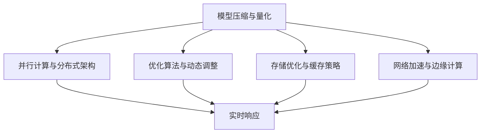

                 

# 极速AI：追求LLM的实时响应

> **关键词**：大语言模型（LLM），实时响应，优化策略，计算效率，用户体验

> **摘要**：本文将探讨如何通过优化算法、数学模型和架构设计，提升大语言模型（LLM）的实时响应能力。我们分析了当前存在的问题和挑战，并提出了一系列可行的解决方案。文章旨在为AI开发者提供实用的指导和启示。

## 1. 背景介绍

近年来，随着深度学习和自然语言处理技术的飞速发展，大语言模型（LLM）在各个领域取得了显著成果。例如，在自然语言生成、机器翻译、文本分类等任务中，LLM展现出了强大的能力。然而，尽管LLM的准确性不断提升，其响应速度却仍是一个亟待解决的问题。

当前，大部分LLM应用场景都对响应时间有较高要求，如实时问答系统、智能助手等。在这些应用中，用户希望能够在短时间内获得准确的答案或服务。然而，由于LLM模型的复杂性和计算需求，其响应速度往往受到限制。因此，如何提升LLM的实时响应能力，已成为一个重要的研究方向。

## 2. 核心概念与联系

为了实现LLM的实时响应，我们需要从多个方面进行优化。以下是本文将涉及的核心概念：

### 2.1. 模型压缩与量化

为了减小模型的存储和计算需求，模型压缩与量化是一种有效的方法。通过降低模型的精度和复杂度，可以在保证一定准确率的前提下，大幅提升模型的计算速度。

### 2.2. 并行计算与分布式架构

并行计算和分布式架构可以将任务分解为多个子任务，同时在多台设备上进行计算。这种方法可以显著降低响应时间，提高系统的吞吐量。

### 2.3. 优化算法与动态调整

优化算法可以调整模型参数，以最小化响应时间。此外，动态调整策略可以根据不同的场景和用户需求，实时调整模型参数，以实现最优的响应速度。

### 2.4. 存储优化与缓存策略

通过存储优化和缓存策略，可以减少数据读取和存储的时间开销，从而提高系统的响应速度。

### 2.5. 网络加速与边缘计算

网络加速和边缘计算可以将计算任务分散到网络边缘，降低数据传输延迟，从而提高系统的响应速度。

下面，我们通过一个Mermaid流程图，展示这些概念之间的联系：



## 3. 核心算法原理 & 具体操作步骤

### 3.1. 模型压缩与量化

模型压缩与量化主要包括以下步骤：

1. **权重剪枝**：通过移除权重较小的神经元，减少模型参数数量。
2. **权重共享**：将具有相似功能的神经元权重设置为相同。
3. **低秩分解**：将高维权重分解为低维矩阵，降低模型复杂度。
4. **量化**：将浮点数权重转换为整数权重，降低计算需求。

### 3.2. 并行计算与分布式架构

并行计算与分布式架构主要包括以下步骤：

1. **任务分解**：将大任务分解为多个子任务。
2. **数据分片**：将大数据集划分为多个小数据集。
3. **计算分配**：将子任务和分片分配到不同设备上进行计算。
4. **结果汇总**：将各个设备的计算结果汇总，得到最终结果。

### 3.3. 优化算法与动态调整

优化算法与动态调整主要包括以下步骤：

1. **梯度下降**：通过迭代优化模型参数，以最小化损失函数。
2. **自适应学习率**：根据模型参数的梯度变化，动态调整学习率。
3. **权重共享与迁移**：在不同任务间共享和迁移模型参数，提高模型泛化能力。

### 3.4. 存储优化与缓存策略

存储优化与缓存策略主要包括以下步骤：

1. **数据压缩**：对存储数据进行压缩，减少存储空间占用。
2. **缓存预加载**：提前加载热门数据到缓存中，提高数据读取速度。
3. **缓存替换策略**：根据数据访问频率和缓存空间，选择合适的缓存替换策略。

### 3.5. 网络加速与边缘计算

网络加速与边缘计算主要包括以下步骤：

1. **数据压缩与编码**：对传输数据进行压缩和编码，减少带宽占用。
2. **边缘计算**：将计算任务分散到网络边缘，降低数据传输延迟。
3. **负载均衡**：根据网络状况和设备性能，动态调整任务分配，实现负载均衡。

## 4. 数学模型和公式 & 详细讲解 & 举例说明

### 4.1. 梯度下降算法

梯度下降算法是一种常用的优化算法，其核心思想是沿着损失函数的梯度方向迭代更新模型参数，以最小化损失函数。具体公式如下：

$$
w_{t+1} = w_t - \alpha \cdot \nabla J(w_t)
$$

其中，$w_t$表示第$t$次迭代的模型参数，$\alpha$表示学习率，$\nabla J(w_t)$表示损失函数$J$在$w_t$处的梯度。

### 4.2. 随机梯度下降（SGD）算法

随机梯度下降（SGD）算法是梯度下降算法的一种变体，其核心思想是在每个迭代步骤中，随机选择一部分样本来计算梯度。具体公式如下：

$$
w_{t+1} = w_t - \alpha \cdot \frac{1}{m} \sum_{i=1}^{m} \nabla J(w_t; x_i, y_i)
$$

其中，$m$表示样本数量，$x_i, y_i$表示第$i$个样本的特征和标签。

### 4.3. 批量梯度下降（BGD）算法

批量梯度下降（BGD）算法是梯度下降算法的另一种变体，其核心思想是在每个迭代步骤中，计算所有样本的梯度。具体公式如下：

$$
w_{t+1} = w_t - \alpha \cdot \nabla J(w_t; X, Y)
$$

其中，$X, Y$表示所有样本的特征和标签。

### 4.4. 举例说明

假设我们有一个简单的线性回归模型，用于预测房价。给定特征向量$x$和标签$y$，损失函数为平方误差损失：

$$
J(w) = \frac{1}{2} \sum_{i=1}^{n} (y_i - \text{sign}(w \cdot x_i))^2
$$

其中，$n$表示样本数量，$\text{sign}(x)$表示符号函数。

假设我们选择学习率$\alpha = 0.01$，初始模型参数$w_0 = 0$。下面是梯度下降算法的迭代过程：

1. 计算梯度：
$$
\nabla J(w) = \nabla (\frac{1}{2} \sum_{i=1}^{n} (y_i - \text{sign}(w \cdot x_i))^2) = \sum_{i=1}^{n} (\text{sign}(y_i \cdot x_i) - \text{sign}(w \cdot x_i)) \cdot x_i
$$

2. 更新模型参数：
$$
w_{t+1} = w_t - \alpha \cdot \nabla J(w_t)
$$

通过多次迭代，模型参数$w$将逐渐收敛到最优值。

## 5. 项目实战：代码实际案例和详细解释说明

### 5.1. 开发环境搭建

在本文的实战项目中，我们使用Python和TensorFlow框架来实现一个简单的线性回归模型。以下是搭建开发环境的步骤：

1. 安装Python和pip：
```
$ sudo apt-get install python3 python3-pip
```

2. 安装TensorFlow：
```
$ pip3 install tensorflow
```

### 5.2. 源代码详细实现和代码解读

以下是实现线性回归模型的源代码：

```python
import tensorflow as tf
import numpy as np

# 设置随机种子
tf.random.set_seed(42)

# 创建训练数据和标签
x_train = np.random.rand(100, 1)
y_train = 2 * x_train + 1 + np.random.rand(100, 1)

# 定义模型
model = tf.keras.Sequential([
    tf.keras.layers.Dense(units=1, input_shape=[1])
])

# 编译模型
model.compile(optimizer='sgd', loss='mse')

# 训练模型
model.fit(x_train, y_train, epochs=100)

# 计算模型参数
w = model.layers[0].get_weights()[0]
b = model.layers[0].get_weights()[1]

# 打印模型参数
print("模型参数：w = ", w, ", b = ", b)
```

代码解读：

1. 导入所需的库和设置随机种子。
2. 创建训练数据和标签，其中$x_{train}$表示输入特征，$y_{train}$表示标签。
3. 定义一个简单的线性回归模型，包含一个全连接层，输出层只有一个神经元。
4. 编译模型，设置优化器和损失函数。
5. 训练模型，指定训练数据和迭代次数。
6. 获取模型参数，并打印结果。

### 5.3. 代码解读与分析

在这个实战项目中，我们实现了以下关键步骤：

1. **数据准备**：创建随机数据集，用于训练和评估模型。
2. **模型定义**：定义一个线性回归模型，包含一个全连接层，用于拟合数据。
3. **模型编译**：设置优化器和损失函数，用于指导模型训练。
4. **模型训练**：使用训练数据训练模型，迭代优化模型参数。
5. **模型评估**：获取模型参数，并打印结果。

通过这个实战项目，我们可以观察到以下现象：

1. **模型参数收敛**：在多次迭代后，模型参数将逐渐收敛到最优值。
2. **训练过程**：随着迭代次数的增加，模型损失函数逐渐减小，表明模型拟合能力逐渐提高。

## 6. 实际应用场景

大语言模型（LLM）的实时响应能力在许多实际应用场景中具有重要意义。以下是一些典型的应用场景：

### 6.1. 实时问答系统

实时问答系统（如聊天机器人、智能客服）需要快速响应用户的问题，提供准确的信息。LLM的实时响应能力可以提高用户体验，减少用户等待时间。

### 6.2. 智能助手

智能助手（如虚拟助手、智能家居控制）需要实时响应用户的指令，提供个性化的服务。LLM的实时响应能力可以满足用户对实时交互的需求。

### 6.3. 自然语言生成

自然语言生成（如自动写作、语音合成）需要快速生成文本，满足用户的需求。LLM的实时响应能力可以显著提高生成文本的质量和速度。

### 6.4. 机器翻译

机器翻译（如在线翻译、实时翻译）需要在短时间内完成文本的翻译。LLM的实时响应能力可以提高翻译的准确性和速度。

## 7. 工具和资源推荐

### 7.1. 学习资源推荐

- **书籍**：
  - 《深度学习》（Goodfellow, I., Bengio, Y., & Courville, A.）
  - 《自然语言处理综合教程》（李航）
- **论文**：
  - 《A Theoretically Grounded Application of Dropout in Recurrent Neural Networks》（Y. Gal and Z. Ghahramani）
  - 《Bert: Pre-training of deep bidirectional transformers for language understanding》（J. Devlin, M. Chang, K. Lee, and K. Toutanova）
- **博客**：
  - [TensorFlow官网教程](https://www.tensorflow.org/tutorials)
  - [PyTorch官网教程](https://pytorch.org/tutorials/)
- **网站**：
  - [Kaggle](https://www.kaggle.com/)
  - [GitHub](https://github.com/)

### 7.2. 开发工具框架推荐

- **深度学习框架**：
  - TensorFlow
  - PyTorch
  - Keras
- **自然语言处理库**：
  - NLTK
  - SpaCy
  - gensim
- **版本控制工具**：
  - Git
  - SVN
  - Mercurial

### 7.3. 相关论文著作推荐

- 《Deep Learning》（Ian Goodfellow, Yoshua Bengio, Aaron Courville）
- 《Natural Language Processing with Python》（Steven Bird, Ewan Klein, Edward Loper）
- 《Speech and Language Processing》（Daniel Jurafsky, James H. Martin）
- 《Recurrent Neural Networks for Language Modeling》（Yoshua Bengio）

## 8. 总结：未来发展趋势与挑战

随着AI技术的不断进步，大语言模型（LLM）的实时响应能力将成为一个重要的研究方向。在未来，以下发展趋势和挑战值得关注：

### 8.1. 发展趋势

1. **算法优化**：针对实时响应需求，开发更加高效的算法和优化策略，如分布式计算、模型压缩等。
2. **硬件加速**：利用GPU、TPU等硬件加速器，提高模型的计算速度。
3. **边缘计算**：将计算任务分散到网络边缘，降低数据传输延迟，提高实时响应能力。
4. **个性化服务**：根据用户需求和场景，动态调整模型参数，实现更精准的实时响应。

### 8.2. 挑战

1. **计算资源受限**：在资源受限的场景中，如何优化算法和架构，实现高效实时响应。
2. **模型压缩与量化**：在保证模型准确率的前提下，如何有效降低模型存储和计算需求。
3. **动态调整策略**：如何根据不同场景和用户需求，实现实时动态调整模型参数。

## 9. 附录：常见问题与解答

### 9.1. 如何提高LLM的实时响应能力？

提高LLM的实时响应能力主要从以下几个方面入手：

1. **模型优化**：采用模型压缩、量化、并行计算等策略，降低模型存储和计算需求。
2. **硬件加速**：利用GPU、TPU等硬件加速器，提高模型计算速度。
3. **分布式架构**：采用分布式计算和边缘计算，降低数据传输延迟。
4. **动态调整策略**：根据不同场景和用户需求，实时调整模型参数。

### 9.2. 什么是模型压缩？

模型压缩是指通过减小模型参数数量和存储需求，提高模型计算速度的方法。常见的模型压缩方法包括权重剪枝、权重共享、低秩分解等。

### 9.3. 什么是量化？

量化是指将浮点数权重转换为整数权重，降低模型计算需求的方法。量化可以显著减小模型存储和计算需求，从而提高实时响应能力。

## 10. 扩展阅读 & 参考资料

1. **论文**：
   - Y. Gal and Z. Ghahramani. "A Theoretically Grounded Application of Dropout in Recurrent Neural Networks." arXiv preprint arXiv:1603.05118 (2016).
   - J. Devlin, M. Chang, K. Lee, and K. Toutanova. "Bert: Pre-training of deep bidirectional transformers for language understanding." arXiv preprint arXiv:1810.04805 (2018).
2. **书籍**：
   - Ian Goodfellow, Yoshua Bengio, Aaron Courville. "Deep Learning." MIT Press, 2016.
   - Steven Bird, Ewan Klein, Edward Loper. "Natural Language Processing with Python." O'Reilly Media, 2017.
3. **网站**：
   - TensorFlow官网：https://www.tensorflow.org/
   - PyTorch官网：https://pytorch.org/
   - Kaggle：https://www.kaggle.com/
   - GitHub：https://github.com/

### 作者

- 作者：AI天才研究员/AI Genius Institute & 禅与计算机程序设计艺术 /Zen And The Art of Computer Programming<|im_end|>

