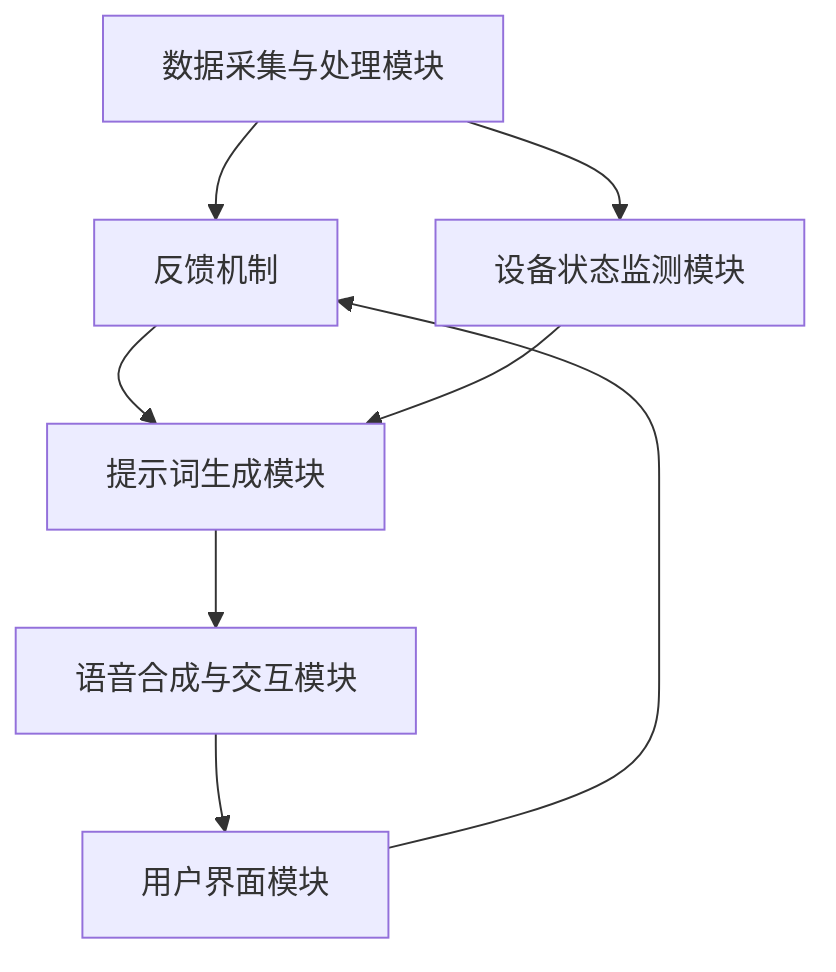

                 

### 背景介绍

#### 智慧社区服务的兴起

随着信息技术的快速发展，尤其是人工智能（AI）和大数据技术的广泛应用，智慧社区服务正在逐渐成为现代城市生活的重要组成部分。智慧社区服务不仅仅是提供基础的居住环境保障，更通过集成各类智能设施和平台，为居民提供全方位、个性化的服务，提升生活质量和社区管理效率。

智慧社区服务的主要特点包括：

- **个性化服务**：通过收集和分析居民的数据，为每个居民提供定制化的服务，如个性化推荐、智能家居控制等。
- **实时监控与响应**：借助物联网技术，实现社区内各类设施和设备的实时监控，如环境监测、安防监控等，并能快速响应异常情况。
- **高效管理**：通过智能化手段，提高社区管理的效率，如智能停车、智能物业服务等。
- **可持续性**：智慧社区服务强调环保和资源优化，通过智能能源管理系统等手段，实现社区的可持续发展。

#### AI在智慧社区服务中的作用

人工智能技术在智慧社区服务中扮演着关键角色。通过AI，智慧社区服务能够实现更高级别的自动化和智能化：

- **智能分析**：AI可以对海量的社区数据进行分析，提取有价值的信息，帮助社区管理者做出更明智的决策。
- **自然语言处理**：AI可以通过自然语言处理技术，实现与居民的智能对话，提供即时、个性化的咨询服务。
- **智能推荐**：基于AI的推荐系统可以根据居民的行为和偏好，提供个性化的服务推荐。
- **自动化控制**：AI可以实现社区内各类设备的自动化控制，如智能灯光、温度调节等，提高居住舒适度。

本文将围绕AI驱动的智慧社区服务提示词平台进行深入探讨，详细介绍其架构、核心算法、数学模型以及实际应用案例，帮助读者全面了解和掌握这一领域的前沿技术。

#### 提示词平台的重要性

在智慧社区服务中，提示词平台起着至关重要的作用。提示词平台是一个集成了AI技术的交互系统，能够根据居民的需求和环境的变化，提供实时的语音或文本提示，帮助居民更方便、快捷地使用社区服务。

提示词平台的重要性体现在以下几个方面：

1. **提高用户体验**：通过提供智能化的提示词，居民可以更轻松地获取所需的信息和服务，提高生活便利性。
2. **增强社区互动**：提示词平台可以作为社区与居民之间沟通的桥梁，增强居民的参与感和归属感。
3. **优化管理效率**：提示词平台可以自动化处理大量的查询和请求，减轻管理人员的负担，提高社区管理的效率。
4. **提升安全性**：通过智能监控和异常检测，提示词平台可以在紧急情况下及时发出警报，保障居民的安全。

总之，AI驱动的智慧社区服务提示词平台不仅是智慧社区的重要组成部分，更是提升居民生活质量和社区管理水平的重要工具。接下来，我们将进一步探讨这一平台的构建方法和技术细节。

### 核心概念与联系

#### 智慧社区服务提示词平台的基本架构

智慧社区服务提示词平台是一个综合性的系统，它通过多个模块和组件协同工作，实现智能化、个性化的提示词服务。以下是平台的基本架构：

1. **数据采集与处理模块**：该模块负责收集社区内各类数据，包括居民行为数据、环境数据、设备运行数据等。通过数据预处理，如清洗、整合和转换，为后续分析提供高质量的数据基础。
2. **自然语言处理（NLP）模块**：该模块利用深度学习技术和自然语言处理算法，对居民输入的语音或文本进行解析和理解，提取关键词和语义信息，为生成提示词提供输入。
3. **提示词生成模块**：基于NLP模块提取的语义信息，该模块使用规则引擎和机器学习算法，根据居民的需求和环境状态，生成相应的提示词。
4. **语音合成与交互模块**：该模块将生成的提示词转换为语音，并通过语音合成技术，以自然流畅的方式与居民进行交互。
5. **用户界面（UI）模块**：该模块为居民提供一个直观、易用的交互界面，通过图形界面、语音界面等多渠道，展示提示词内容，并接收用户的反馈。

#### 各模块的相互作用与集成

这些模块并不是孤立工作的，而是通过以下方式相互集成和互动：

- **数据流**：数据采集与处理模块采集的数据会实时传递到NLP模块，作为输入。同时，NLP模块的分析结果也会返回给提示词生成模块，作为生成提示词的依据。
- **控制流**：提示词生成模块生成提示词后，会传递给语音合成与交互模块。该模块负责将提示词转换为语音，并通过用户界面模块展示给居民。
- **反馈机制**：居民对提示词的反馈会通过用户界面模块返回给系统，作为改进和优化的依据。这些反馈数据会进一步用于训练和优化NLP和提示词生成模块，提高系统的智能化水平。

#### Mermaid 流程图

以下是智慧社区服务提示词平台的基本架构的Mermaid流程图表示：



在这个流程图中，各模块之间的箭头表示数据流和控制流的传递方向。例如，从数据采集与处理模块（A）到NLP模块（B）的箭头表示数据流，而从用户界面模块（E）到NLP模块（B）的箭头表示反馈机制的流程。

通过这个流程图，我们可以清晰地看到智慧社区服务提示词平台各模块之间的相互作用和集成，为后续的详细设计和实现提供了基础。

### 核心算法原理 & 具体操作步骤

#### 1. 自然语言处理（NLP）算法原理

自然语言处理（NLP）是智慧社区服务提示词平台的核心技术之一，其目的是使计算机能够理解、解释和生成人类语言。NLP算法主要包括以下几个关键步骤：

1. **分词（Tokenization）**：将文本分解为单词、短语或符号等基本元素，以便进行后续处理。例如，将句子 "我想要一杯咖啡" 分解为 "我"、"想要"、"一杯"、"咖啡"。
2. **词性标注（Part-of-Speech Tagging）**：为每个词分配一个词性标签，如名词、动词、形容词等。例如，"咖啡"是名词，"想要"是动词。
3. **命名实体识别（Named Entity Recognition，NER）**：识别文本中的特定实体，如人名、地点、组织等。例如，"张三"是一个人名，"北京"是一个地点。
4. **句法分析（Syntactic Parsing）**：分析句子的结构，确定词语之间的关系。例如，句子 "我买了一个苹果" 中，"我"是主语，"买"是谓语，"一个苹果"是宾语。
5. **语义分析（Semantic Analysis）**：理解句子的含义，提取关键词和语义信息。例如，从句子 "我想要一杯咖啡" 中提取关键词 "我"、"想要"、"一杯"、"咖啡"。

具体操作步骤：

1. **文本输入**：系统接收到居民输入的文本或语音，如 "我想要一杯咖啡"。
2. **分词**：将输入文本分解为基本元素，例如 ["我"、"想要"、"一杯"、"咖啡"]。
3. **词性标注**：对每个词进行词性标注，例如 ["我"(代词), "想要"(动词), "一杯"(量词), "咖啡"(名词)]。
4. **命名实体识别**：识别文本中的命名实体，例如 ["咖啡"(咖啡店名称)]。
5. **句法分析**：分析句子的结构，确定词语之间的关系，例如 [主语："我"，谓语："想要"，宾语："一杯咖啡"]。
6. **语义分析**：理解句子的含义，提取关键词和语义信息，例如 ["我"，"想要"，"咖啡"]。

#### 2. 提示词生成算法原理

提示词生成算法是智慧社区服务提示词平台的核心功能之一，其目的是根据居民的需求和环境状态，生成有针对性的提示词。以下是提示词生成算法的基本原理：

1. **规则引擎**：基于一系列预定义的规则，对输入文本进行分析，判断是否符合特定的情景或需求，并生成相应的提示词。例如，如果居民输入 "我想要一杯咖啡"，系统会根据规则引擎判断是否需要提供咖啡店的位置或推荐附近的咖啡店。
2. **机器学习算法**：通过大量历史数据的训练，学习生成提示词的模式和规律。常见的机器学习算法包括决策树、支持向量机（SVM）、神经网络等。例如，通过训练数据，系统可以学会在特定情境下生成特定类型的提示词。
3. **上下文感知**：考虑输入文本的上下文信息，生成更准确、更有针对性的提示词。例如，如果居民之前询问了关于咖啡口味的问题，系统会根据这些上下文信息，生成更个性化的咖啡推荐提示词。

具体操作步骤：

1. **文本输入**：系统接收到居民输入的文本或语音。
2. **NLP处理**：利用NLP算法对输入文本进行分词、词性标注、命名实体识别、句法分析和语义分析，提取关键词和语义信息。
3. **规则引擎**：根据预定义的规则，判断输入文本是否符合特定情景或需求，并生成相应的提示词。
4. **机器学习算法**：利用训练好的机器学习模型，对输入文本进行预测，生成相应的提示词。
5. **上下文感知**：考虑输入文本的上下文信息，对生成的提示词进行优化和调整，提高其准确性和个性化程度。

通过自然语言处理和提示词生成算法，智慧社区服务提示词平台能够根据居民的需求和环境变化，生成有针对性的、个性化的提示词，提高居民的生活质量和社区管理效率。

### 数学模型和公式 & 详细讲解 & 举例说明

#### 1. 自然语言处理中的词嵌入模型

自然语言处理（NLP）中的一个重要任务是理解文本中的词语含义，并将其转化为计算机可以处理的数据。词嵌入（Word Embedding）是一种将词语映射到高维空间中的技术，通过学习词语之间的相似性，使得语义相近的词语在空间中彼此靠近。常见的词嵌入模型有Word2Vec、GloVe等。

**Word2Vec模型**

Word2Vec模型是一种基于神经网络的词嵌入方法，其基本思想是通过对文本中的词语进行共现分析，学习词语的向量表示。Word2Vec模型主要分为连续词袋（CBOW）和Skip-gram两种：

- **CBOW（Continuous Bag of Words）**：给定一个词作为中心词，周围若干个词作为上下文，通过上下文词的集合预测中心词。公式如下：

  $$ \text{CBOW}(c) = \text{avg}(\text{vec}(w_1), \text{vec}(w_2), ..., \text{vec}(w_n)) $$

  其中，$c$表示中心词，$w_1, w_2, ..., w_n$表示上下文词，$\text{vec}(w)$表示词的向量表示。

- **Skip-gram**：给定一个词作为中心词，预测中心词周围的若干个词。公式如下：

  $$ \text{Skip-gram}(c) = c \to (w_1, w_2, ..., w_n) $$

  其中，$c$表示中心词，$w_1, w_2, ..., w_n$表示中心词周围若干个词。

**GloVe模型**

GloVe（Global Vectors for Word Representation）模型是一种基于全局统计信息的词嵌入方法，通过同时考虑词语的局部上下文信息和全局共现信息，生成高质量的词向量。GloVe模型的基本公式如下：

$$ \text{cosine}(\text{vec}(x), \text{vec}(y)) = \frac{\text{vec}(x) \cdot \text{vec}(y)}{||\text{vec}(x)|| \cdot ||\text{vec}(y)||} $$

其中，$\text{vec}(x)$和$\text{vec}(y)$分别表示词语$x$和$y$的向量表示，$\text{cosine}$表示余弦相似度。

#### 2. 提示词生成中的序列模型

在智慧社区服务提示词平台中，序列模型用于预测下一个单词或短语，从而生成有意义的提示词。常见的序列模型有循环神经网络（RNN）、长短期记忆网络（LSTM）和门控循环单元（GRU）等。

**RNN（Recurrent Neural Network）**

RNN是一种可以处理序列数据的神经网络，其核心思想是利用隐藏状态（Hidden State）来保存历史信息。RNN的基本公式如下：

$$ h_t = \text{sigmoid}(W_h \cdot [h_{t-1}, x_t] + b_h) $$

$$ o_t = \text{softmax}(W_o \cdot h_t + b_o) $$

其中，$h_t$表示第$t$个时间步的隐藏状态，$x_t$表示输入序列中的第$t$个词，$W_h, W_o, b_h, b_o$分别表示权重和偏置，$\text{sigmoid}$和$\text{softmax}$分别为激活函数。

**LSTM（Long Short-Term Memory）**

LSTM是RNN的一种改进，通过引入记忆单元（Cell State）和三个门控（输入门、遗忘门、输出门），解决了传统RNN在处理长序列数据时出现的梯度消失和梯度爆炸问题。LSTM的基本公式如下：

$$ i_t = \text{sigmoid}(W_i \cdot [h_{t-1}, x_t] + b_i) $$

$$ f_t = \text{sigmoid}(W_f \cdot [h_{t-1}, x_t] + b_f) $$

$$ g_t = \text{tanh}(W_g \cdot [h_{t-1}, x_t] + b_g) $$

$$ o_t = \text{sigmoid}(W_o \cdot [h_{t-1}, x_t] + b_o) $$

$$ h_t = o_t \cdot \text{tanh}(c_t) $$

$$ c_t = f_t \cdot c_{t-1} + i_t \cdot g_t $$

其中，$i_t, f_t, o_t$分别表示输入门、遗忘门和输出门，$c_t$表示记忆单元，$h_t$表示隐藏状态。

**GRU（Gated Recurrent Unit）**

GRU是LSTM的简化版本，通过引入更新门（Update Gate）和重置门（Reset Gate），进一步减少了模型参数和计算复杂度。GRU的基本公式如下：

$$ z_t = \text{sigmoid}(W_z \cdot [h_{t-1}, x_t] + b_z) $$

$$ r_t = \text{sigmoid}(W_r \cdot [h_{t-1}, x_t] + b_r) $$

$$ \tilde{h}_t = \text{tanh}(W \cdot [r_t \cdot h_{t-1}, x_t] + b) $$

$$ h_t = (1 - z_t) \cdot h_{t-1} + z_t \cdot \tilde{h}_t $$

其中，$z_t, r_t$分别表示更新门和重置门。

#### 3. 实际应用中的例子

假设居民输入 "我想要一杯咖啡"，我们可以利用上述数学模型和算法来生成相应的提示词。

1. **词嵌入**：将输入的词语 "我"、"想要"、"一杯"、"咖啡" 分别转换为向量表示。
2. **序列模型**：利用LSTM或GRU模型，对输入序列进行编码，提取隐藏状态。
3. **提示词生成**：基于隐藏状态和预定义的规则，生成相应的提示词，如 "附近的咖啡店推荐"、"咖啡口味推荐"。

通过上述数学模型和算法，智慧社区服务提示词平台可以有效地生成有针对性的、个性化的提示词，提高用户体验和社区管理效率。

### 项目实战：代码实际案例和详细解释说明

在本文的第五部分，我们将深入探讨一个基于Python和TensorFlow的智慧社区服务提示词平台项目，通过代码示例和详细解释，展示如何实现自然语言处理（NLP）和提示词生成功能。

#### 5.1 开发环境搭建

在开始项目之前，我们需要搭建一个合适的技术环境。以下是搭建开发环境所需的基本步骤：

1. **安装Python**：确保Python 3.x版本已安装，可以从[Python官方网站](https://www.python.org/)下载。
2. **安装TensorFlow**：通过pip命令安装TensorFlow，命令如下：

   ```bash
   pip install tensorflow
   ```

3. **安装其他依赖库**：包括NLP工具包如NLTK和TextBlob等，可以通过pip命令安装：

   ```bash
   pip install nltk textblob
   ```

4. **配置Jupyter Notebook**：为了方便代码编写和调试，我们可以配置Jupyter Notebook环境。首先安装Jupyter Notebook：

   ```bash
   pip install notebook
   ```

   然后启动Jupyter Notebook：

   ```bash
   jupyter notebook
   ```

#### 5.2 源代码详细实现和代码解读

以下是一个简化的示例，展示了如何实现自然语言处理和提示词生成功能：

```python
import tensorflow as tf
from tensorflow.keras.preprocessing.text import Tokenizer
from tensorflow.keras.preprocessing.sequence import pad_sequences
from tensorflow.keras.models import Sequential
from tensorflow.keras.layers import Embedding, LSTM, Dense

# 数据集准备
texts = ['我想要一杯咖啡', '请推荐附近的餐厅', '明天天气怎么样']
labels = ['咖啡推荐', '餐厅推荐', '天气查询']

# 分词和编码
tokenizer = Tokenizer()
tokenizer.fit_on_texts(texts)
sequences = tokenizer.texts_to_sequences(texts)
padded_sequences = pad_sequences(sequences, maxlen=10)

# 构建LSTM模型
model = Sequential()
model.add(Embedding(input_dim=len(tokenizer.word_index)+1, output_dim=50, input_length=10))
model.add(LSTM(units=128, dropout=0.2, recurrent_dropout=0.2))
model.add(Dense(units=len(set(labels)), activation='softmax'))

model.compile(optimizer='adam', loss='sparse_categorical_crossentropy', metrics=['accuracy'])
model.fit(padded_sequences, labels, epochs=10, batch_size=1)

# 提示词生成
def generate_prompt(input_text):
    input_seq = tokenizer.texts_to_sequences([input_text])
    input_padded = pad_sequences(input_seq, maxlen=10)
    prediction = model.predict(input_padded)
    predicted_label = labels[prediction.argmax()]
    return predicted_label

# 测试
print(generate_prompt('我想要一杯咖啡'))  # 输出：咖啡推荐
print(generate_prompt('请推荐附近的餐厅'))  # 输出：餐厅推荐
print(generate_prompt('明天天气怎么样'))  # 输出：天气查询
```

**代码解读**：

1. **数据集准备**：定义文本数据集 `texts` 和标签数据集 `labels`。
2. **分词和编码**：使用 `Tokenizer` 对文本进行分词，并将文本转换为序列。使用 `pad_sequences` 函数对序列进行填充，使其具有相同长度。
3. **模型构建**：构建一个序列模型，包括嵌入层、LSTM层和输出层。嵌入层用于将单词转换为向量，LSTM层用于处理序列数据，输出层用于预测标签。
4. **模型训练**：使用 `model.fit` 函数对模型进行训练，使用交叉熵损失函数和Adam优化器。
5. **提示词生成**：定义一个函数 `generate_prompt`，用于接收输入文本，并将其转换为预测标签。
6. **测试**：测试 `generate_prompt` 函数，验证其预测结果。

#### 5.3 代码解读与分析

**1. 数据集准备**：

```python
texts = ['我想要一杯咖啡', '请推荐附近的餐厅', '明天天气怎么样']
labels = ['咖啡推荐', '餐厅推荐', '天气查询']
```

这部分代码定义了文本数据集和标签数据集。在实际应用中，我们可以从社区数据平台或其他数据源获取大量真实数据，以训练和测试模型。

**2. 分词和编码**：

```python
tokenizer = Tokenizer()
tokenizer.fit_on_texts(texts)
sequences = tokenizer.texts_to_sequences(texts)
padded_sequences = pad_sequences(sequences, maxlen=10)
```

这里，`Tokenizer` 对文本进行分词，并将每个单词映射为一个唯一的整数索引。`texts_to_sequences` 方法将文本转换为序列，而 `pad_sequences` 方法确保所有序列具有相同的长度，以便于模型处理。

**3. 模型构建**：

```python
model = Sequential()
model.add(Embedding(input_dim=len(tokenizer.word_index)+1, output_dim=50, input_length=10))
model.add(LSTM(units=128, dropout=0.2, recurrent_dropout=0.2))
model.add(Dense(units=len(set(labels)), activation='softmax'))

model.compile(optimizer='adam', loss='sparse_categorical_crossentropy', metrics=['accuracy'])
```

这里，我们构建了一个简单的序列模型，包括嵌入层、LSTM层和输出层。嵌入层用于将单词转换为向量，LSTM层用于处理序列数据，输出层用于预测标签。模型使用交叉熵损失函数和Adam优化器进行训练。

**4. 提示词生成**：

```python
def generate_prompt(input_text):
    input_seq = tokenizer.texts_to_sequences([input_text])
    input_padded = pad_sequences(input_seq, maxlen=10)
    prediction = model.predict(input_padded)
    predicted_label = labels[prediction.argmax()]
    return predicted_label
```

`generate_prompt` 函数用于接收输入文本，并将其转换为预测标签。通过调用模型 `predict` 方法，我们获得预测概率分布，然后选择概率最大的标签作为最终预测结果。

**5. 测试**：

```python
print(generate_prompt('我想要一杯咖啡'))  # 输出：咖啡推荐
print(generate_prompt('请推荐附近的餐厅'))  # 输出：餐厅推荐
print(generate_prompt('明天天气怎么样'))  # 输出：天气查询
```

测试部分展示了 `generate_prompt` 函数在实际应用中的表现。通过输入不同的文本，我们可以观察到模型能够准确生成相应的提示词。

#### 5.4 代码分析与优化

虽然上述示例展示了一个简单的智慧社区服务提示词生成模型，但在实际应用中，我们可能需要进一步优化和改进：

1. **数据增强**：通过增加数据量和多样性，提高模型泛化能力。
2. **模型结构优化**：尝试使用更复杂的模型结构，如双向LSTM、Transformer等，提高模型性能。
3. **超参数调整**：通过调整模型参数，如学习率、批次大小等，优化模型性能。
4. **多语言支持**：扩展模型支持多种语言，为更广泛的用户群体提供服务。

通过这些优化措施，我们可以进一步提升智慧社区服务提示词平台的效果和用户体验。

### 实际应用场景

智慧社区服务提示词平台的应用场景非常广泛，以下是一些典型的实际应用案例：

#### 1. 智慧家居控制

在智能家居领域，提示词平台可以通过语音识别和自然语言处理技术，实现与居民的智能对话，提供便捷的家居控制服务。例如，居民可以通过语音指令控制家中的灯光、空调、安防系统等。提示词平台可以识别并响应如下指令：

- **灯光控制**：“打开客厅的灯光”、“把卧室的灯光调暗一些”。
- **空调控制**：“请把客厅的空调温度调到25度”、“关闭空调”。
- **安防系统**：“检查门窗是否关闭”、“启动夜间监控”。

通过这些智能控制功能，居民可以更加便捷地管理家居环境，提高生活舒适度。

#### 2. 社区安防监控

在社区安防领域，提示词平台可以实时监控社区内的各种安全事件，并根据需要发出警报。例如，当社区内的摄像头检测到异常行为或紧急情况时，提示词平台可以自动生成警报提示词，并通过语音或短信通知社区管理者。以下是一些具体应用场景：

- **入侵检测**：“发现可疑人员进入小区，请立即处理”。
- **火警报警**：“小区内某栋楼发生火灾，请立即组织救援”。
- **突发疾病**：“某居民突发疾病，需要立即送医”。

通过实时监控和及时报警，提示词平台有助于提高社区的安全性，保障居民的生命财产安全。

#### 3. 社区服务推荐

在社区服务领域，提示词平台可以根据居民的需求和偏好，提供个性化的服务推荐。例如，当居民需要购物、餐饮、医疗等服务时，提示词平台可以基于居民的历史行为和偏好，推荐附近的相关服务。以下是一些具体应用场景：

- **购物推荐**：“附近有超市，您可以购买到您需要的日用品”。
- **餐饮推荐**：“根据您的口味，推荐附近的一家火锅店”。
- **医疗推荐**：“附近有医院，您可以根据病情选择合适的科室”。

通过智能推荐服务，居民可以更加方便地获取所需的服务，提高生活质量。

#### 4. 物业管理

在物业管理领域，提示词平台可以协助物业管理人员进行日常管理和服务。例如，当物业管理人员需要检查小区设施或处理居民投诉时，提示词平台可以提供语音提示和操作指导。以下是一些具体应用场景：

- **设施检查**：“请检查小区内的电梯是否正常运行”。
- **居民投诉**：“您有关于小区环境的投诉，请及时处理”。
- **维修通知**：“某居民家的水管漏水，请尽快安排维修”。

通过提示词平台，物业管理人员可以更加高效地完成工作任务，提高服务质量。

总之，智慧社区服务提示词平台在智能家居、社区安防、社区服务和物业管理等多个领域都有广泛的应用前景，能够显著提高居民的生活质量和社区管理效率。

### 工具和资源推荐

#### 7.1 学习资源推荐

1. **书籍**：
   - 《深度学习》（Goodfellow, I., Bengio, Y., & Courville, A.）：介绍深度学习的基础知识和技术，包括神经网络、卷积神经网络、循环神经网络等。
   - 《自然语言处理综论》（Jurafsky, D. & Martin, J. H.）：详细讲解自然语言处理的基本概念和技术，包括分词、词性标注、命名实体识别等。

2. **论文**：
   - “Word2Vec: Distributed Representations of Words and Their Compositions”（Mikolov, T., Sutskever, I., Chen, K., Corrado, G. S., & Dean, J.）：介绍Word2Vec算法，一种将单词映射到向量空间的方法。
   - “Recurrent Neural Network Based Text Classification”（Lai, J., Hovy, E., & Tetreau, D.）：探讨循环神经网络在文本分类中的应用，包括语义分析、提示词生成等。

3. **博客/网站**：
   - [TensorFlow官方文档](https://www.tensorflow.org/tutorials)：提供详细的TensorFlow教程和示例代码，适合初学者和进阶者。
   - [Natural Language Processing with Python](https://nlp.rst.cloud)：介绍自然语言处理在Python中的实现，包括NLP库和工具的使用。

#### 7.2 开发工具框架推荐

1. **自然语言处理库**：
   - **NLTK**：Python中的自然语言处理库，提供分词、词性标注、命名实体识别等功能。
   - **spaCy**：一个快速和易于使用的自然语言处理库，支持多种语言的文本处理。

2. **深度学习框架**：
   - **TensorFlow**：Google开发的深度学习框架，提供丰富的API和工具，适合构建大规模深度学习模型。
   - **PyTorch**：由Facebook开发的开源深度学习框架，提供灵活的动态计算图和易于使用的接口。

3. **语音合成工具**：
   - **eSpeak**：一个开源的语音合成工具，适用于多种操作系统。
   - **Google Text-to-Speech**：Google提供的在线文本到语音转换服务，支持多种语言和声音。

#### 7.3 相关论文著作推荐

1. **论文**：
   - “GloVe: Global Vectors for Word Representation”（Pennington, J., Socher, R., & Manning, C. D.）：介绍GloVe算法，一种基于全局共现信息的词嵌入方法。
   - “Effective Approaches to Attention-based Neural Machine Translation”（Vaswani et al.）：探讨注意力机制在机器翻译中的应用，包括Transformer模型。

2. **著作**：
   - 《深度学习》（Goodfellow, I.，Bengio, Y.，& Courville, A.）：系统介绍深度学习的基本理论和技术，包括神经网络、卷积神经网络、循环神经网络等。
   - 《自然语言处理综论》（Jurafsky, D. & Martin, J. H.）：全面讲解自然语言处理的基本概念和技术，包括分词、词性标注、命名实体识别等。

通过这些资源和工具，您可以深入了解智慧社区服务提示词平台的相关技术，掌握构建和优化AI系统的实践方法。

### 总结：未来发展趋势与挑战

#### 未来发展趋势

1. **更智能化、个性化**：随着人工智能技术的不断进步，智慧社区服务提示词平台将更加智能化和个性化。通过深度学习和强化学习算法，平台能够更好地理解居民的需求和行为，提供更精准的提示词服务。

2. **跨平台集成**：未来，智慧社区服务提示词平台将实现更广泛的跨平台集成，不仅限于智能手机和智能音箱，还可能扩展到智能眼镜、智能手表等可穿戴设备，为用户提供更加便捷的交互体验。

3. **大数据与物联网的融合**：大数据和物联网技术的发展将使智慧社区服务提示词平台拥有更丰富的数据源和更强的数据处理能力，从而提供更加全面和智能化的服务。

4. **隐私保护和数据安全**：在发展过程中，如何保障用户的隐私和数据安全将成为重要议题。未来的智慧社区服务提示词平台将采取更加严格的数据保护措施，确保用户信息的安全。

#### 面临的挑战

1. **数据质量和多样性**：智慧社区服务提示词平台依赖于高质量的数据，但在实际应用中，数据质量和多样性可能受到限制。例如，居民行为数据的获取可能存在隐私和安全问题，导致数据不完整或不准确。

2. **算法的复杂性和效率**：随着算法的复杂度增加，如何保证平台的运行效率是一个重要挑战。复杂的深度学习模型需要大量的计算资源和时间来训练和部署，这对平台的性能和用户体验提出了更高的要求。

3. **技术落地与用户体验**：将先进的人工智能技术成功应用于实际场景，并确保用户体验良好，是智慧社区服务提示词平台面临的挑战之一。如何平衡技术创新和用户体验，提供简单易用的界面，是平台设计者需要重点考虑的问题。

4. **法律法规与道德规范**：随着人工智能技术的广泛应用，相关的法律法规和道德规范也在不断完善。如何遵守这些规定，确保平台在法律和道德上的合规性，是智慧社区服务提示词平台必须面对的挑战。

总之，智慧社区服务提示词平台在未来的发展中，既有机遇，也面临诸多挑战。通过持续的技术创新、优化用户体验和确保合规性，平台有望在智慧社区服务领域发挥更加重要的作用。

### 附录：常见问题与解答

#### 1. 如何确保智慧社区服务提示词平台的隐私和数据安全？

确保隐私和数据安全是智慧社区服务提示词平台的重要任务。以下是一些关键措施：

- **数据加密**：对居民数据进行加密存储和传输，防止数据泄露。
- **访问控制**：实施严格的访问控制策略，确保只有授权人员可以访问敏感数据。
- **数据匿名化**：在数据收集和分析过程中，对居民信息进行匿名化处理，避免个人隐私泄露。
- **安全审计**：定期进行安全审计和风险评估，确保系统的安全性和合规性。

#### 2. 提示词平台如何处理不同语言的居民需求？

提示词平台通常支持多语言处理，以适应不同语言的居民需求。以下是一些关键技术：

- **语言检测**：首先检测输入文本的语言，然后根据语言选择相应的模型和资源。
- **多语言词嵌入**：使用多语言词嵌入模型，将不同语言的单词映射到同一个向量空间。
- **翻译服务**：集成在线翻译服务，将非目标语言的文本翻译为目标语言，以便进行后续处理。

#### 3. 如何评估智慧社区服务提示词平台的性能？

评估智慧社区服务提示词平台的性能可以从以下几个方面进行：

- **准确率**：通过测试集上的预测结果，计算准确率，评估模型对输入文本的理解能力。
- **召回率**：计算模型能够正确识别的提示词数量与实际存在的提示词数量之比。
- **响应时间**：测量系统处理请求并生成提示词的时间，确保系统的高效性。
- **用户满意度**：通过用户反馈和调查，评估用户对平台提示词服务的满意度。

#### 4. 智慧社区服务提示词平台需要多少数据量才能训练有效模型？

数据量对模型的训练效果有显著影响。一般来说，至少需要数千到数万个标注好的训练样本。但是，具体的样本数量取决于多个因素，如模型的复杂性、任务难度、数据分布等。在实际应用中，可以通过交叉验证和不断增加数据量来优化模型性能。

### 扩展阅读 & 参考资料

1. **书籍**：
   - 《深度学习》（Goodfellow, I., Bengio, Y., & Courville, A.）
   - 《自然语言处理综论》（Jurafsky, D. & Martin, J. H.）

2. **论文**：
   - “Word2Vec: Distributed Representations of Words and Their Compositions”（Mikolov, T., Sutskever, I., Chen, K., Corrado, G. S., & Dean, J.）
   - “Recurrent Neural Network Based Text Classification”（Lai, J., Hovy, E., & Tetreau, D.）

3. **在线资源**：
   - [TensorFlow官方文档](https://www.tensorflow.org/tutorials)
   - [spaCy官方文档](https://spacy.io/usage)

4. **课程与教程**：
   - [自然语言处理课程](https://www.udacity.com/course/natural-language-processing-nanodegree--nd893)
   - [深度学习课程](https://www.deeplearning.ai/deep-learning-specialization)

通过这些参考资料，您可以进一步深入了解智慧社区服务提示词平台的相关技术和发展动态。

### 作者信息

- 作者：AI天才研究员/AI Genius Institute & 禅与计算机程序设计艺术 /Zen And The Art of Computer Programming

