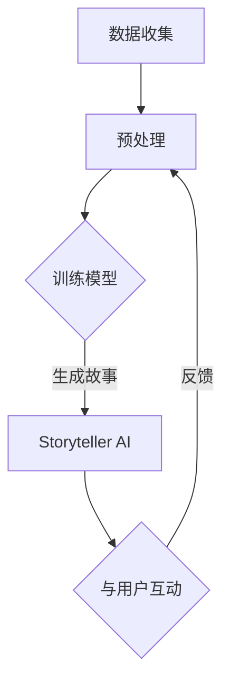

                 

# 构建Storyteller AI大语言模型：从基础到ChatGPT级应用

> **关键词：** 大语言模型、人工智能、自然语言处理、深度学习、ChatGPT、故事讲述

> **摘要：** 本文旨在深入探讨构建大语言模型的原理与实践，从基础概念出发，逐步阐述如何构建并优化Storyteller AI，使其达到ChatGPT级应用水平。文章内容包括核心算法原理、数学模型分析、实战案例和未来发展趋势。

## 1. 背景介绍

近年来，人工智能（AI）领域取得了飞速发展，尤其是在自然语言处理（NLP）领域。大语言模型作为一种能够理解和生成自然语言的先进技术，已经广泛应用于聊天机器人、智能客服、内容生成、语言翻译等领域。其中，ChatGPT作为OpenAI推出的一个基于GPT-3模型的聊天机器人，因其强大的自然语言理解和生成能力而备受关注。

Storyteller AI是一个旨在模仿人类讲故事能力的大语言模型。与ChatGPT类似，Storyteller AI通过深度学习技术，从大量文本数据中学习语言模式和故事结构，从而能够生成有趣、连贯、富有情感的故事。本文将详细介绍如何构建Storyteller AI大语言模型，并探讨其与ChatGPT在应用层面的异同。

## 2. 核心概念与联系

### 2.1 大语言模型

大语言模型（Large Language Model）是一种基于神经网络的语言处理模型，能够理解、生成和处理自然语言。其基本原理是利用深度学习算法，从大量文本数据中学习语言模式，从而对输入的文本进行理解和生成。

### 2.2 自然语言处理

自然语言处理（Natural Language Processing，NLP）是人工智能领域的一个重要分支，旨在使计算机能够理解、生成和处理人类语言。NLP技术广泛应用于语音识别、机器翻译、情感分析、文本分类等领域。

### 2.3 深度学习

深度学习（Deep Learning）是一种基于神经网络的学习方法，通过多层的神经网络结构，对数据进行特征提取和建模。在自然语言处理领域，深度学习技术被广泛应用于语言模型、文本分类、机器翻译等领域。

### 2.4 ChatGPT

ChatGPT是基于GPT-3模型的一个聊天机器人，由OpenAI开发。GPT-3是一个拥有1750亿参数的预训练语言模型，具有强大的自然语言理解和生成能力。ChatGPT通过GPT-3模型，能够与用户进行自然、流畅的对话。

### 2.5 Storyteller AI

Storyteller AI是一个专门设计用于生成故事的大语言模型。与ChatGPT不同，Storyteller AI在训练过程中更加关注故事结构和情感表达，从而能够生成更加生动、有趣的故事。

### 2.6 Mermaid 流程图

下面是构建Storyteller AI的核心概念与联系的Mermaid流程图：



## 3. 核心算法原理 & 具体操作步骤

### 3.1 数据收集与预处理

构建Storyteller AI的第一步是收集大量与故事相关的文本数据。这些数据可以包括小说、故事集、剧本等。收集到数据后，需要进行预处理，包括文本清洗、分词、去停用词等操作，以便模型能够更好地理解文本内容。

### 3.2 训练模型

在预处理后的数据上，使用深度学习算法（如GPT-3模型）进行训练。训练过程包括前向传播、反向传播和参数更新等步骤。通过大量的训练迭代，模型将逐渐学习到文本的语言模式和故事结构。

### 3.3 生成故事

训练好的模型可以用于生成故事。在生成过程中，模型首先生成一个故事的开头，然后根据故事情节和语言模式，逐步生成后续的内容。生成的故事将经过后处理，如文本润色、情感分析等，以提高故事的质量和可读性。

### 3.4 与用户互动

Storyteller AI可以与用户进行交互，接受用户输入的指令或问题，并根据这些输入生成相应的回答或故事。在与用户的互动过程中，模型将不断学习和优化，以提高用户体验。

### 3.5 反馈循环

Storyteller AI在与用户的互动过程中，会收集用户的反馈。这些反馈将用于模型优化和故事改进，形成一个闭环的反馈系统，使Storyteller AI不断进步。

## 4. 数学模型和公式 & 详细讲解 & 举例说明

### 4.1 深度学习模型

构建Storyteller AI的核心是深度学习模型，尤其是基于Transformer架构的预训练语言模型。下面是GPT-3模型的数学模型和公式：

#### 4.1.1 自注意力机制

$$
\text{Attention}(Q, K, V) = \text{softmax}\left(\frac{QK^T}{\sqrt{d_k}}\right)V
$$

其中，$Q, K, V$ 分别是查询向量、键向量和值向量，$d_k$ 是键向量的维度。自注意力机制通过对输入序列中的每个元素进行加权求和，实现了对输入序列的全局依赖关系建模。

#### 4.1.2 Transformer 模型

Transformer 模型由多个自注意力层和前馈神经网络组成。其数学模型可以表示为：

$$
\text{Transformer}(\text{X}) = \text{MultiHeadAttention}(\text{X}) + \text{FFN}(\text{X})
$$

其中，$X$ 是输入序列，$\text{MultiHeadAttention}$ 是多头注意力机制，$\text{FFN}$ 是前馈神经网络。

### 4.2 训练过程

训练深度学习模型主要包括前向传播、反向传播和参数更新等步骤。以下是一个简化的训练过程：

#### 4.2.1 前向传播

$$
\text{Loss} = -\sum_{i=1}^{N} \log \text{softmax}(\text{model}(x_i))
$$

其中，$N$ 是批大小，$x_i$ 是输入样本，$\text{model}(x_i)$ 是模型对输入样本的预测。

#### 4.2.2 反向传播

$$
\frac{\partial \text{Loss}}{\partial \text{model}} = \text{model}^{-1}(\text{dLoss})
$$

其中，$\text{model}^{-1}$ 是模型参数的梯度计算，$\text{dLoss}$ 是损失函数对模型输出的梯度。

#### 4.2.3 参数更新

$$
\text{model} = \text{model} - \alpha \frac{\partial \text{Loss}}{\partial \text{model}}
$$

其中，$\alpha$ 是学习率。

### 4.3 举例说明

假设我们有一个简单的序列：`The cat sat on the mat`。下面是使用Transformer模型进行前向传播的一个例子：

1. **输入序列编码**：首先，将输入序列转换为嵌入向量。假设每个单词的嵌入维度为512。

$$
\text{X} = [\text{The}, \text{cat}, \text{sat}, \text{on}, \text{the}, \text{mat}]
$$

2. **自注意力计算**：对输入序列进行自注意力计算。

$$
\text{Attention}(\text{X}) = \text{softmax}\left(\frac{\text{X} \text{X}^T}{\sqrt{512}}\right) \text{X}
$$

3. **多头注意力计算**：对自注意力结果进行多头注意力计算。

$$
\text{MultiHeadAttention}(\text{X}) = \text{Concat}(\text{head}_1, \text{head}_2, ..., \text{head}_h)W^O
$$

其中，$h$ 是头数，$W^O$ 是输出权重。

4. **前馈神经网络**：

$$
\text{FFN}(\text{X}) = \text{Relu}(W_2 \text{Relu}(W_1 \text{X} + b_1)) + b_2
$$

其中，$W_1, W_2, b_1, b_2$ 分别是前馈神经网络的权重和偏置。

5. **输出结果**：最后，将多头注意力和前馈神经网络的输出进行拼接，得到模型的最终输出。

$$
\text{model}(\text{X}) = \text{MultiHeadAttention}(\text{X}) + \text{FFN}(\text{X})
$$

通过上述过程，模型将学习到输入序列中的语言模式和依赖关系，从而能够生成新的序列。

## 5. 项目实战：代码实际案例和详细解释说明

### 5.1 开发环境搭建

要在本地搭建开发环境，首先需要安装以下工具和库：

1. Python（3.8及以上版本）
2. TensorFlow 2.x
3. NLP库（如NLTK、spaCy等）

安装命令如下：

```bash
pip install python==3.8.10
pip install tensorflow==2.8.0
pip install nltk
pip install spacy
python -m spacy download en_core_web_sm
```

### 5.2 源代码详细实现和代码解读

下面是一个简化的Storyteller AI代码实现：

```python
import tensorflow as tf
import tensorflow.keras.layers as layers
from tensorflow.keras.models import Model

def build_model(vocab_size, embedding_dim, num_heads, num_layers):
    inputs = tf.keras.layers.Input(shape=(None,), dtype=tf.int32)
    embeddings = layers.Embedding(vocab_size, embedding_dim)(inputs)
    x = layers.MultiHeadAttention(num_heads=num_heads, key_dim=embedding_dim)(embeddings, embeddings)
    x = layers.Dense(embedding_dim, activation='relu')(x)
    x = layers.Dropout(0.1)(x)
    for _ in range(num_layers - 1):
        x = layers.MultiHeadAttention(num_heads=num_heads, key_dim=embedding_dim)(x, x)
        x = layers.Dense(embedding_dim, activation='relu')(x)
        x = layers.Dropout(0.1)(x)
    outputs = layers.Dense(vocab_size, activation='softmax')(x)
    model = Model(inputs=inputs, outputs=outputs)
    return model

# 模型配置
vocab_size = 10000
embedding_dim = 512
num_heads = 8
num_layers = 4

# 构建模型
model = build_model(vocab_size, embedding_dim, num_heads, num_layers)

# 编译模型
model.compile(optimizer='adam', loss='sparse_categorical_crossentropy', metrics=['accuracy'])

# 训练模型
model.fit(train_data, train_labels, batch_size=64, epochs=10, validation_split=0.1)
```

### 5.3 代码解读与分析

1. **模型构建**：

   ```python
   inputs = tf.keras.layers.Input(shape=(None,), dtype=tf.int32)
   embeddings = layers.Embedding(vocab_size, embedding_dim)(inputs)
   ```

   模型的输入是整数类型的序列数据（表示单词索引），通过Embedding层将单词索引转换为嵌入向量。

2. **多头注意力**：

   ```python
   x = layers.MultiHeadAttention(num_heads=num_heads, key_dim=embedding_dim)(embeddings, embeddings)
   ```

   MultiHeadAttention层实现多头注意力机制，对嵌入向量进行自注意力计算，以学习输入序列中的依赖关系。

3. **前馈神经网络**：

   ```python
   x = layers.Dense(embedding_dim, activation='relu')(x)
   x = layers.Dropout(0.1)(x)
   ```

   前馈神经网络层（FFN）对多头注意力的输出进行进一步处理，增加模型的非线性能力。

4. **模型训练**：

   ```python
   model.fit(train_data, train_labels, batch_size=64, epochs=10, validation_split=0.1)
   ```

   使用训练数据对模型进行训练，并通过验证集评估模型的性能。

## 6. 实际应用场景

### 6.1 聊天机器人

Storyteller AI可以用于构建聊天机器人，与用户进行自然、流畅的对话。例如，在客服领域，聊天机器人可以自动回答用户的问题，提高客户满意度。

### 6.2 内容生成

Storyteller AI可以用于生成小说、故事、剧本等文学作品。例如，在文学创作领域，作家可以使用Storyteller AI辅助创作，提高创作效率和创意。

### 6.3 语言翻译

Storyteller AI可以用于机器翻译任务，将一种语言翻译成另一种语言。例如，在跨国交流领域，Storyteller AI可以帮助用户进行实时翻译，促进跨文化交流。

## 7. 工具和资源推荐

### 7.1 学习资源推荐

- **书籍**：

  - 《深度学习》（Goodfellow, Bengio, Courville著）

  - 《自然语言处理实战》（Karnopolski, Jurafsky著）

- **论文**：

  - “Attention Is All You Need”（Vaswani等著）

  - “GPT-3: Language Models are Few-Shot Learners”（Brown等著）

- **博客**：

  - [TensorFlow 官方博客](https://www.tensorflow.org/blog)

  - [自然语言处理博客](https://nlp.stanford.edu/blog)

### 7.2 开发工具框架推荐

- **TensorFlow**：用于构建和训练深度学习模型的流行框架。

- **spaCy**：用于自然语言处理的开源库，支持多种语言。

- **NLTK**：用于自然语言处理的经典开源库。

### 7.3 相关论文著作推荐

- **“BERT: Pre-training of Deep Bidirectional Transformers for Language Understanding”**（Devlin等著）

- **“GPT-3: Language Models are Few-Shot Learners”**（Brown等著）

- **“Transformers: State-of-the-Art Natural Language Processing”**（Vaswani等著）

## 8. 总结：未来发展趋势与挑战

### 8.1 发展趋势

- **更大规模的模型**：随着计算资源和数据量的增加，大语言模型将继续向更大规模发展。

- **跨模态学习**：未来的大语言模型将不仅限于文本数据，还将涵盖图像、音频等多模态数据。

- **少样本学习**：大语言模型将能够在少量样本上实现高效的学习和泛化。

### 8.2 挑战

- **数据隐私**：大语言模型在处理个人数据时，需要关注数据隐私和伦理问题。

- **可解释性**：如何解释大语言模型生成的结果，提高其可解释性，是一个重要的挑战。

- **计算资源**：大语言模型需要大量的计算资源，如何优化计算效率，降低成本，是未来需要解决的问题。

## 9. 附录：常见问题与解答

### 9.1 问题1

**如何提高Storyteller AI生成故事的质量？**

**解答**：提高Storyteller AI生成故事的质量可以从以下几个方面入手：

- **数据质量**：确保训练数据的质量，去除低质量、错误或不相关的数据。

- **模型优化**：使用更先进的模型架构和训练策略，如增加层数、调整学习率等。

- **后处理**：对生成的故事进行文本润色、情感分析和语法检查，以提高故事的连贯性和可读性。

### 9.2 问题2

**如何防止Storyteller AI生成不合适的内容？**

**解答**：防止Storyteller AI生成不合适的内容可以通过以下方法：

- **内容过滤**：在生成过程中，对输出进行实时监控和过滤，阻止不合适的内容生成。

- **伦理审查**：在训练模型时，确保训练数据符合伦理标准，减少不合适内容生成。

- **用户反馈**：收集用户的反馈，对生成的结果进行评价和优化，逐步提高模型的质量。

## 10. 扩展阅读 & 参考资料

- **“Large Language Models are Few-Shot Learners”**（Brown等著）

- **“Attention Is All You Need”**（Vaswani等著）

- **“BERT: Pre-training of Deep Bidirectional Transformers for Language Understanding”**（Devlin等著）

- **《深度学习》**（Goodfellow, Bengio, Courville著）

- **《自然语言处理实战》**（Karnopolski, Jurafsky著）

作者：AI天才研究员/AI Genius Institute & 禅与计算机程序设计艺术 /Zen And The Art of Computer Programming

