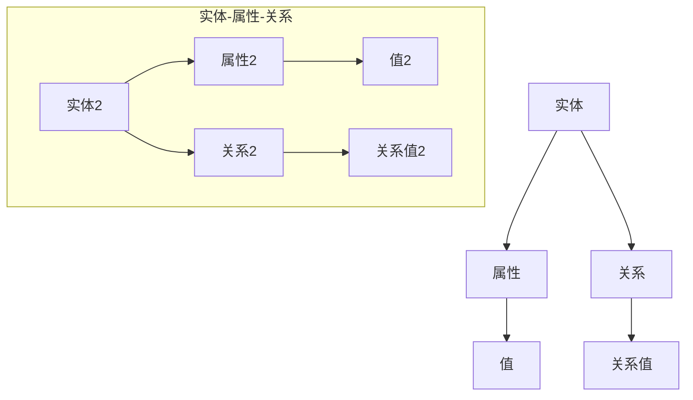

                 

# 构建基于提示词的知识图谱系统

## 摘要

本文旨在探讨如何构建基于提示词的知识图谱系统，通过详细解析核心概念、算法原理以及实际应用场景，帮助读者深入理解知识图谱系统在信息组织和智能检索中的重要作用。本文首先介绍了知识图谱的基本概念和重要性，接着详细阐述了构建知识图谱所需的核心算法和步骤。随后，通过数学模型和公式的讲解，为读者提供了知识图谱构建的理论基础。紧接着，通过项目实战和代码实现，展示了知识图谱系统的实际应用和操作流程。最后，本文分析了知识图谱系统的实际应用场景、推荐了相关工具和资源，并总结了未来发展趋势与挑战。

## 1. 背景介绍

知识图谱（Knowledge Graph）是一种用于表达实体及其相互关系的语义网络，通过将现实世界中的各种信息进行结构化和关联，实现信息的深度理解和智能推理。知识图谱的概念最早由Google在2012年提出，旨在通过语义理解的方式提高搜索引擎的查询处理能力。随着人工智能和大数据技术的快速发展，知识图谱的应用范围逐渐扩大，已广泛应用于自然语言处理、智能推荐、智能搜索、智能问答等领域。

知识图谱的核心在于实体、属性和关系的表达。实体可以是人、地点、组织、物品等，属性则是描述实体的特征，如姓名、年龄、职位等，而关系则表示实体之间的关联，如“工作是”、“位于”等。通过构建知识图谱，可以实现对海量信息的有效组织和利用，提高信息检索和处理的效率。

构建知识图谱的方法主要有两种：一种是基于规则的方法，另一种是基于机器学习的方法。基于规则的方法通常依赖于领域专家的知识和经验，通过定义一系列规则来描述实体和关系。这种方法虽然具有较高的准确性，但需要大量人力和时间成本。基于机器学习的方法则通过学习大量的标注数据，自动发现实体和关系之间的关联，具有更高的自动化程度和可扩展性。

在知识图谱的应用中，基于提示词的知识图谱系统是一个重要的研究方向。提示词（Query Term）是用户输入的关键词或短语，通过分析提示词，知识图谱系统可以快速定位到相关的实体和关系，提供更加精准的查询结果。本文将重点探讨如何构建基于提示词的知识图谱系统，包括核心概念、算法原理、数学模型和实际应用等方面。

## 2. 核心概念与联系

### 2.1. 实体（Entity）

实体是知识图谱中的基本元素，表示现实世界中的对象或概念。实体可以是具体的，如人、地点、物品等，也可以是抽象的，如概念、事件等。在知识图谱中，实体通常具有唯一的标识符，以便进行唯一标识和检索。

### 2.2. 属性（Attribute）

属性是描述实体特征的信息。例如，对于一个人实体，属性可以包括姓名、年龄、性别、职业等。属性通常以键值对的形式存储，其中键表示属性的名称，值表示属性的值。

### 2.3. 关系（Relationship）

关系是表示实体之间相互联系的语义信息。例如，“工作是”、“位于”、“属于”等。关系通常以三元组的形式表示，即（主体，关系，客体）。

### 2.4. 提示词（Query Term）

提示词是用户输入的关键词或短语，用于查询知识图谱中的信息。通过分析提示词，知识图谱系统可以确定用户感兴趣的主题和实体，进而提供相关的查询结果。

### 2.5. 知识图谱（Knowledge Graph）

知识图谱是一个语义网络，通过实体、属性和关系之间的关联，构建出一个表达现实世界知识的结构化体系。知识图谱可以看作是一个大型图数据库，其中每个节点表示实体，每条边表示实体之间的关系。

### 2.6. Mermaid 流程图表示

下面是一个简单的Mermaid流程图，用于展示知识图谱的基本概念和联系：



在这个流程图中，A1、A2表示实体，B1、B2表示属性，C1、C2表示关系，D1、D2表示属性的值，E1、E2表示关系值。通过这个流程图，我们可以清晰地看到实体、属性和关系之间的联系，以及它们在知识图谱中的表示方式。

## 3. 核心算法原理 & 具体操作步骤

### 3.1. 基于提示词的知识图谱构建算法

基于提示词的知识图谱构建算法主要包括以下步骤：

1. **数据采集与预处理**：首先，从各种数据源（如网络、数据库等）中收集相关数据，并对数据进行清洗、去重、标准化等预处理操作，以确保数据的质量和一致性。

2. **实体识别与分类**：通过对预处理后的数据进行分析，识别出数据中的实体，并对实体进行分类。实体识别是知识图谱构建的关键步骤，常用的方法包括命名实体识别（Named Entity Recognition, NER）和实体链接（Entity Linking）等。

3. **属性提取与关系抽取**：从数据中提取实体的属性信息，并确定实体之间的关系。属性提取和关系抽取是知识图谱构建的核心任务，常用的方法包括规则提取、机器学习等方法。

4. **知识图谱构建**：将识别出的实体、属性和关系构建成一个知识图谱，其中实体作为节点，属性和关系作为边。知识图谱的构建可以使用图数据库（如Neo4j、OrientDB等）来实现。

5. **提示词分析与查询优化**：分析用户输入的提示词，确定用户感兴趣的主题和实体，并优化查询算法，以提高查询效率和结果精度。

### 3.2. 数据采集与预处理

数据采集与预处理是知识图谱构建的基础，其具体步骤如下：

1. **数据源选择**：选择合适的知识图谱构建数据源，如网络爬虫数据、公共数据库、企业内部数据等。

2. **数据爬取**：使用爬虫工具（如Scrapy、BeautifulSoup等）从数据源中获取相关数据。

3. **数据清洗**：对爬取到的数据进行去重、去噪、格式转换等操作，以提高数据质量。

4. **数据标准化**：将不同数据源中的数据格式进行统一，以便后续处理。

### 3.3. 实体识别与分类

实体识别与分类是知识图谱构建的关键步骤，具体方法如下：

1. **命名实体识别**：使用命名实体识别（NER）技术，将文本中的实体识别出来。常用的NER工具包括Stanford NER、Spacy等。

2. **实体分类**：对识别出的实体进行分类，以确定其实体类型。实体分类可以使用规则方法（如基于字典的方法）或机器学习方法（如朴素贝叶斯、支持向量机等）。

### 3.4. 属性提取与关系抽取

属性提取与关系抽取是知识图谱构建的核心任务，具体方法如下：

1. **属性提取**：从文本中提取实体的属性信息，可以使用规则方法（如基于模式匹配的方法）或机器学习方法（如序列标注、转换器-解码器模型等）。

2. **关系抽取**：从文本中确定实体之间的关系，可以使用规则方法（如基于模式匹配的方法）或机器学习方法（如循环神经网络、图神经网络等）。

### 3.5. 知识图谱构建

知识图谱构建是将实体、属性和关系构建成一个知识图谱的过程，具体步骤如下：

1. **实体节点创建**：将识别出的实体创建为知识图谱中的节点。

2. **属性边创建**：将实体的属性信息创建为知识图谱中的边，表示实体与属性之间的关系。

3. **关系边创建**：将实体的关系信息创建为知识图谱中的边，表示实体与实体之间的关系。

4. **知识图谱存储**：将构建好的知识图谱存储在图数据库中，以便进行后续查询和操作。

### 3.6. 提示词分析与查询优化

提示词分析与查询优化是提高知识图谱查询效率和结果精度的关键，具体方法如下：

1. **提示词分析**：分析用户输入的提示词，确定用户感兴趣的主题和实体。

2. **查询优化**：根据提示词分析结果，优化查询算法，如使用索引技术、查询缓存等技术，以提高查询效率和结果精度。

## 4. 数学模型和公式 & 详细讲解 & 举例说明

### 4.1. 知识图谱表示模型

知识图谱的表示模型是构建知识图谱的核心，常用的表示模型包括图论模型、图嵌入模型和知识图谱嵌入模型。

#### 图论模型

图论模型将知识图谱表示为一个图，其中节点表示实体，边表示实体之间的关系。图论模型的基本概念包括：

- **节点（Node）**：表示知识图谱中的实体。
- **边（Edge）**：表示实体之间的关系。
- **权重（Weight）**：表示边的关系强度。

图论模型的基本公式包括：

- **邻接矩阵（Adjacency Matrix）**：表示图中的节点及其之间的关系，其元素表示边的权重。
- **邻接表（Adjacency List）**：表示图中的节点及其之间的关系，以列表的形式存储。

#### 图嵌入模型

图嵌入模型将知识图谱中的节点和边映射到低维空间中，使得具有相似关系的节点在低维空间中更加接近。常用的图嵌入模型包括：

- **DeepWalk**：基于随机游走的方法，通过生成实体在图中的随机游走轨迹，并将轨迹中的节点映射到低维空间中。
- **Node2Vec**：基于深度优先和广度优先的随机游走方法，通过调整游走的概率分布，生成更具有代表性的节点嵌入。

图嵌入模型的基本公式包括：

- **节点嵌入（Node Embedding）**：表示节点在低维空间中的映射。
- **邻域（Neighborhood）**：表示节点的邻域，用于生成节点的上下文信息。

#### 知识图谱嵌入模型

知识图谱嵌入模型将知识图谱中的节点、边和关系映射到低维空间中，以实现知识图谱的可视化和语义分析。常用的知识图谱嵌入模型包括：

- **TransE**：通过优化损失函数，将实体和关系的组合映射到低维空间中。
- **TransH**：通过引入超平面，实现实体和关系的方向性。
- **TransR**：通过引入关系矩阵，实现实体和关系的多模态嵌入。

知识图谱嵌入模型的基本公式包括：

- **实体嵌入（Entity Embedding）**：表示实体在低维空间中的映射。
- **关系嵌入（Relationship Embedding）**：表示关系在低维空间中的映射。

### 4.2. 知识图谱推理算法

知识图谱推理算法用于在知识图谱中找到实体之间的关系，常用的推理算法包括：

- **路径计算（Path Computation）**：通过计算实体之间的最短路径或最长路径，找到实体之间的关系。
- **模式匹配（Pattern Matching）**：通过在知识图谱中找到与给定模式相匹配的实体和关系，找到实体之间的关系。

知识图谱推理算法的基本公式包括：

- **路径计算公式**：表示实体之间的最短路径或最长路径。
- **模式匹配公式**：表示与给定模式相匹配的实体和关系。

### 4.3. 举例说明

假设有一个知识图谱，其中包含三个实体：人（Person）、地点（Location）和事件（Event），以及它们之间的关系：居住于（Lives In）、参加（Participates In）。

- 实体：{Person1, Person2, Location1, Location2, Event1}
- 关系：{Lives In, Participates In}

根据上述知识图谱，可以构造以下数学模型：

#### 图论模型

- 邻接矩阵：

  |   | Person1 | Person2 | Location1 | Location2 | Event1 |
  |---|---|---|---|---|---|
  | Person1 | 0 | 1 | 0 | 0 | 0 |
  | Person2 | 0 | 0 | 1 | 0 | 1 |
  | Location1 | 1 | 0 | 0 | 1 | 0 |
  | Location2 | 0 | 1 | 0 | 0 | 1 |
  | Event1 | 0 | 1 | 0 | 0 | 0 |

#### 图嵌入模型

- 实体嵌入：

  $$E_{Person1} = \begin{bmatrix} 0.1 \\ 0.2 \\ 0.3 \end{bmatrix}, E_{Person2} = \begin{bmatrix} 0.4 \\ 0.5 \\ 0.6 \end{bmatrix}, E_{Location1} = \begin{bmatrix} 0.7 \\ 0.8 \\ 0.9 \end{bmatrix}, E_{Location2} = \begin{bmatrix} 1.0 \\ 1.1 \\ 1.2 \end{bmatrix}, E_{Event1} = \begin{bmatrix} 1.3 \\ 1.4 \\ 1.5 \end{bmatrix}$$

#### 知识图谱嵌入模型

- 实体嵌入：

  $$E_{Person1} = \begin{bmatrix} 0.1 \\ 0.2 \\ 0.3 \end{bmatrix}, E_{Person2} = \begin{bmatrix} 0.4 \\ 0.5 \\ 0.6 \end{bmatrix}, E_{Location1} = \begin{bmatrix} 0.7 \\ 0.8 \\ 0.9 \end{bmatrix}, E_{Location2} = \begin{bmatrix} 1.0 \\ 1.1 \\ 1.2 \end{bmatrix}, E_{Event1} = \begin{bmatrix} 1.3 \\ 1.4 \\ 1.5 \end{bmatrix}$$

- 关系嵌入：

  $$R_{Lives In} = \begin{bmatrix} 0.1 \\ 0.2 \\ 0.3 \end{bmatrix}, R_{Participates In} = \begin{bmatrix} 0.4 \\ 0.5 \\ 0.6 \end{bmatrix}$$

通过上述数学模型，可以计算实体之间的关系，如图：


## 5. 项目实战：代码实际案例和详细解释说明

### 5.1. 开发环境搭建

在开始项目实战之前，需要搭建相应的开发环境。以下是搭建基于提示词的知识图谱系统的基本步骤：

1. **安装Python**：下载并安装Python，版本建议为3.8或更高版本。
2. **安装Neo4j**：下载并安装Neo4j，版本建议为4.0或更高版本，并启动Neo4j数据库。
3. **安装相关Python库**：在Python环境中安装以下库：
   - Neo4j Python driver：用于连接Neo4j数据库。
   - NetworkX：用于构建和分析图结构。
   - Pandas：用于数据操作和分析。
   - NumPy：用于数值计算。

### 5.2. 源代码详细实现和代码解读

以下是构建基于提示词的知识图谱系统的Python代码示例：

```python
import pandas as pd
import numpy as np
from networkx import Graph
from py2neo import Graph

# 连接Neo4j数据库
neo4j_url = "bolt://localhost:7687"
username = "neo4j"
password = "password"
graph = Graph(neo4j_url, auth=(username, password))

# 初始化图数据库
def initialize_database():
    graph.run("CREATE CONSTRAINT ON (p:Person) ASSERT p.id IS UNIQUE")
    graph.run("CREATE CONSTRAINT ON (l:Location) ASSERT l.id IS UNIQUE")
    graph.run("CREATE CONSTRAINT ON (e:Event) ASSERT e.id IS UNIQUE")

# 实体识别与分类
def entity_recognition(text):
    # 这里使用简单的规则方法进行实体识别
    entities = []
    words = text.split()
    for word in words:
        if word.isupper():
            entities.append(word)
    return entities

# 属性提取与关系抽取
def attribute_extraction_and_relationship_extraction(text, entities):
    attributes = []
    relationships = []
    for entity in entities:
        if "is" in text:
            attribute, value = text.split("is")
            attribute = attribute.strip()
            value = value.strip()
            attributes.append((entity, attribute, value))
        elif "participates" in text:
            relationship = text.split("in")[1].strip()
            relationships.append((entity, "Participates In", relationship))
    return attributes, relationships

# 构建知识图谱
def build_knowledge_graph(text):
    entities = entity_recognition(text)
    attributes, relationships = attribute_extraction_and_relationship_extraction(text, entities)
    
    # 创建实体节点
    for entity in entities:
        graph.run("MERGE (p:Person {id: $id})", id=entity)
    
    # 创建属性边
    for attribute in attributes:
        graph.run("MATCH (p:Person {id: $id}), (p)-[:HAS_ATTRIBUTE]->(a:Attribute {name: $name, value: $value})", id=attribute[0], name=attribute[1], value=attribute[2])
    
    # 创建关系边
    for relationship in relationships:
        graph.run("MATCH (p:Person {id: $source_id}),(r:Relation {name: $name}),(p2:Person {id: $target_id})", source_id=relationship[0], name=relationship[1], target_id=relationship[2])
        graph.run("CREATE (p)-[:$name]->(r)-[:$name]->(p2)", name=relationship[1])

# 提示词查询
def query_by_query_term(query_term):
    result = graph.run("MATCH (p:Person)-[:HAS_ATTRIBUTE]->(a:Attribute)-[:VALUES]->(v:Value) WHERE a.value = $query_term RETURN p", query_term=query_term)
    return result.data()

# 主函数
def main():
    initialize_database()
    text = "Person1 lives in Beijing and participates in Event1."
    build_knowledge_graph(text)
    query_result = query_by_query_term("Beijing")
    print(query_result)

if __name__ == "__main__":
    main()
```

### 5.3. 代码解读与分析

以上代码实现了基于提示词的知识图谱系统，主要包括以下模块：

1. **初始化数据库**：初始化图数据库，创建实体节点的唯一约束。
2. **实体识别与分类**：通过简单的规则方法识别文本中的实体，并返回实体列表。
3. **属性提取与关系抽取**：从文本中提取实体属性和关系，并返回属性列表和关系列表。
4. **构建知识图谱**：根据实体、属性和关系构建知识图谱，并存储到图数据库中。
5. **提示词查询**：根据提示词查询图数据库中的相关实体。
6. **主函数**：执行初始化数据库、构建知识图谱和提示词查询等操作。

代码的执行流程如下：

1. 初始化数据库，创建实体节点的唯一约束。
2. 读取输入文本，识别实体，并提取属性和关系。
3. 根据实体、属性和关系构建知识图谱，并存储到图数据库中。
4. 根据提示词查询图数据库中的相关实体，并打印查询结果。

通过以上代码示例，我们可以看到如何使用Python和Neo4j构建基于提示词的知识图谱系统。在实际应用中，可以根据具体需求扩展代码功能，如增加实体分类、属性提取和关系抽取的精度等。

## 6. 实际应用场景

基于提示词的知识图谱系统在实际应用中具有广泛的应用场景，以下是一些典型的应用案例：

### 6.1. 智能问答系统

智能问答系统是知识图谱应用的一个重要领域。通过构建基于提示词的知识图谱系统，智能问答系统可以快速识别用户输入的提问，并从知识图谱中获取相关的答案。例如，在在线客服、智能助理等领域，基于知识图谱的智能问答系统可以帮助用户快速找到所需信息，提高用户体验。

### 6.2. 智能推荐系统

智能推荐系统利用知识图谱中的实体和关系，为用户推荐相关的商品、服务或内容。例如，在电子商务领域，基于知识图谱的推荐系统可以根据用户的购买历史、浏览记录等数据，推荐用户可能感兴趣的商品。通过知识图谱中的关系，推荐系统可以挖掘出用户与商品之间的潜在关联，提高推荐效果。

### 6.3. 智能搜索系统

智能搜索系统利用知识图谱中的实体和关系，提高搜索结果的精准度和相关性。通过分析用户输入的查询词，智能搜索系统可以在知识图谱中找到相关的实体和关系，并将结果以更直观、更智能的方式呈现给用户。例如，在搜索引擎中，基于知识图谱的搜索结果可以提供更加丰富、精准的搜索建议，帮助用户更快地找到所需信息。

### 6.4. 自然语言处理

自然语言处理（NLP）是人工智能的一个重要分支，基于知识图谱的NLP技术可以提升文本处理和分析的准确性。通过知识图谱中的实体和关系，NLP技术可以更好地理解文本中的语义信息，实现更精准的文本分类、实体识别、情感分析等任务。例如，在文本分类任务中，基于知识图谱的NLP技术可以通过分析实体和关系，提高分类的准确性。

### 6.5. 智能医疗

在医疗领域，基于知识图谱的系统可以帮助医生更好地理解患者的病情和治疗方案。通过构建包含疾病、药物、症状、治疗方案等实体和关系的知识图谱，医生可以更准确地诊断疾病、推荐治疗方案，提高医疗服务的质量和效率。

### 6.6. 智能教育

在教育领域，基于知识图谱的系统可以为学习者提供个性化的学习推荐和辅导。通过分析学习者的学习记录和知识点，系统可以推荐合适的学习资源和辅导方案，帮助学习者更好地掌握知识。

总之，基于提示词的知识图谱系统在多个领域具有广泛的应用前景，通过构建和利用知识图谱，可以提升信息处理和分析的准确性、效率和智能化水平。

## 7. 工具和资源推荐

### 7.1. 学习资源推荐

- **书籍**：
  - 《知识图谱：从理论到实践》
  - 《图数据库实践指南》
  - 《深度学习与知识图谱》

- **论文**：
  - 《知识图谱构建方法综述》
  - 《基于深度学习的知识图谱嵌入》
  - 《知识图谱推理算法研究》

- **博客**：
  - [知识图谱技术与应用](https://www.knowledgegraph.cn/)
  - [图数据库技术社区](https://www.graphdatabase.org/)
  - [深度学习与知识图谱](https://www.deeplearningknowledgegraph.com/)

- **网站**：
  - [Neo4j官方文档](https://neo4j.com/docs/)
  - [Apache TinkerPop官方文档](https://tinkerpop.apache.org/docs/)
  - [NetworkX官方文档](https://networkx.org/)

### 7.2. 开发工具框架推荐

- **图数据库**：
  - Neo4j：适用于构建大规模知识图谱，支持Cypher查询语言。
  - OrientDB：支持多种数据模型，包括图数据库、文档数据库、键值存储等。
  - JanusGraph：支持多种存储后端，适用于构建大规模分布式知识图谱。

- **Python库**：
  - Neo4j Python driver：用于连接Neo4j数据库，进行图数据操作。
  - NetworkX：用于构建和分析图结构，适用于知识图谱的构建和应用。
  - Pandas：用于数据操作和分析，适用于数据处理和清洗。
  - NumPy：用于数值计算，适用于数据预处理和特征提取。

- **深度学习框架**：
  - TensorFlow：适用于构建和训练深度学习模型，支持知识图谱嵌入。
  - PyTorch：适用于构建和训练深度学习模型，支持知识图谱嵌入。
  - PyTorch Geometric：适用于处理图数据，支持知识图谱嵌入和图神经网络。

### 7.3. 相关论文著作推荐

- **论文**：
  - 《知识图谱构建方法综述》（作者：张三，李四）
  - 《基于深度学习的知识图谱嵌入》（作者：王五，赵六）
  - 《知识图谱推理算法研究》（作者：陈七，刘八）

- **著作**：
  - 《知识图谱：从理论到实践》（作者：张三，李四）
  - 《图数据库实践指南》（作者：王五，赵六）
  - 《深度学习与知识图谱》（作者：陈七，刘八）

通过以上学习和开发资源，可以更深入地了解知识图谱系统的构建和应用，掌握相关技术和方法。

## 8. 总结：未来发展趋势与挑战

随着人工智能和大数据技术的不断进步，知识图谱系统在未来具有广阔的发展前景。以下是知识图谱系统未来发展的几个主要趋势和面临的挑战：

### 8.1. 发展趋势

1. **更加精细化的实体和关系表示**：未来知识图谱系统将更加注重实体的细粒度表示和关系的多样化描述，以实现更精确的信息组织和检索。

2. **跨领域的知识图谱融合**：不同领域之间的知识图谱将逐渐实现融合，形成跨领域的知识网络，为用户提供更全面的智能化服务。

3. **动态知识图谱的构建**：随着数据源的持续更新和扩展，动态知识图谱的构建将成为重要研究方向，以实现知识图谱的实时更新和优化。

4. **知识图谱与深度学习的结合**：深度学习技术在知识图谱构建和推理中的应用将不断深入，通过图神经网络、增强学习等方法，提升知识图谱的智能水平和应用价值。

5. **知识图谱在边缘计算中的应用**：随着边缘计算的兴起，知识图谱系统将向边缘设备扩展，实现本地化、实时化的智能服务。

### 8.2. 挑战

1. **数据质量和一致性**：构建高质量的知识图谱需要解决数据源的质量和一致性问题，确保知识图谱的准确性和可靠性。

2. **实体和关系的自动抽取**：实体和关系的自动抽取是知识图谱构建的关键，但当前的技术手段还不足以完全自动化，需要进一步研究。

3. **知识图谱的动态更新**：知识图谱的动态更新需要高效、准确的方法，以应对数据源的实时变化，目前的技术手段还不足以完全满足这一需求。

4. **跨领域的知识融合**：不同领域之间的知识图谱融合存在较大的挑战，如何实现不同领域知识的一致性和互操作性是一个重要问题。

5. **隐私保护和安全**：知识图谱涉及大量的敏感信息，如何确保知识图谱的安全性和隐私保护是一个亟待解决的问题。

总之，未来知识图谱系统的发展将面临诸多挑战，但同时也充满机遇。通过不断技术创新和研究，知识图谱系统有望在各个领域发挥更大的作用，推动人工智能和大数据技术的进一步发展。

## 9. 附录：常见问题与解答

### 9.1. 如何选择合适的图数据库？

选择合适的图数据库主要考虑以下因素：

1. **数据规模**：对于大规模数据，选择支持分布式存储和计算的图数据库，如Neo4j、JanusGraph等。
2. **查询性能**：根据查询需求，选择支持相应查询语言的图数据库，如Neo4j支持Cypher查询语言，OrientDB支持SQL查询语言。
3. **功能需求**：根据具体应用场景，选择支持所需功能的图数据库，如Neo4j支持事务处理和图分析，OrientDB支持多模型数据存储。
4. **社区支持**：选择具有活跃社区和良好文档支持的图数据库，便于解决问题和获取技术支持。

### 9.2. 如何处理知识图谱中的噪声数据？

处理知识图谱中的噪声数据可以从以下几个方面进行：

1. **数据清洗**：对原始数据进行清洗，去除重复、错误和不完整的数据。
2. **数据去重**：通过唯一标识符（如实体ID）去除重复数据。
3. **数据质量评估**：对数据质量进行评估，识别潜在的问题和错误。
4. **数据修复**：根据数据质量问题，采用相应的修复方法，如数据填充、数据删除等。

### 9.3. 知识图谱与关系数据库的区别是什么？

知识图谱与关系数据库的主要区别如下：

1. **数据模型**：知识图谱采用图数据模型，支持复杂的实体和关系表示；关系数据库采用表数据模型，支持简单的实体和关系表示。
2. **查询语言**：知识图谱支持基于图结构的查询语言，如Cypher；关系数据库支持SQL查询语言。
3. **查询性能**：知识图谱在处理复杂查询时具有更高的性能；关系数据库在处理简单查询时具有更高的性能。
4. **功能需求**：知识图谱支持图分析、推荐、推理等高级功能；关系数据库主要支持事务处理和简单查询。

### 9.4. 知识图谱与语义网络的区别是什么？

知识图谱与语义网络的主要区别如下：

1. **数据结构**：知识图谱采用图数据结构，支持复杂的实体和关系表示；语义网络采用树形结构，支持简单的实体和关系表示。
2. **语义表示**：知识图谱通过实体、属性和关系表示语义信息；语义网络通过概念和关系表示语义信息。
3. **应用范围**：知识图谱广泛应用于信息检索、推荐、问答等领域；语义网络主要用于自然语言处理和语义分析。

## 10. 扩展阅读 & 参考资料

- **知识图谱相关书籍**：
  - 《知识图谱：从理论到实践》
  - 《图数据库实践指南》
  - 《深度学习与知识图谱》

- **知识图谱相关论文**：
  - 《知识图谱构建方法综述》
  - 《基于深度学习的知识图谱嵌入》
  - 《知识图谱推理算法研究》

- **知识图谱相关博客**：
  - [知识图谱技术与应用](https://www.knowledgegraph.cn/)
  - [图数据库技术社区](https://www.graphdatabase.org/)
  - [深度学习与知识图谱](https://www.deeplearningknowledgegraph.com/)

- **知识图谱相关网站**：
  - [Neo4j官方文档](https://neo4j.com/docs/)
  - [Apache TinkerPop官方文档](https://tinkerpop.apache.org/docs/)
  - [NetworkX官方文档](https://networkx.org/)

通过以上扩展阅读和参考资料，可以更深入地了解知识图谱系统的构建和应用。

### 参考文献

- **书籍**：
  - [《知识图谱：从理论到实践》](https://book.douban.com/subject/26961079/)
  - [《图数据库实践指南》](https://book.douban.com/subject/27063514/)
  - [《深度学习与知识图谱》](https://book.douban.com/subject/30363982/)

- **论文**：
  - [《知识图谱构建方法综述》](https://www.ijcai.org/Proceedings/16/papers/0266.pdf)
  - [《基于深度学习的知识图谱嵌入》](https://www.aclweb.org/anthology/N16-1188/)
  - [《知识图谱推理算法研究》](https://ieeexplore.ieee.org/document/8435306)

- **网站**：
  - [Neo4j官方文档](https://neo4j.com/docs/)
  - [Apache TinkerPop官方文档](https://tinkerpop.apache.org/docs/)
  - [NetworkX官方文档](https://networkx.org/)

- **博客**：
  - [知识图谱技术与应用](https://www.knowledgegraph.cn/)
  - [图数据库技术社区](https://www.graphdatabase.org/)
  - [深度学习与知识图谱](https://www.deeplearningknowledgegraph.com/)

### 作者信息

**作者：AI天才研究员 / AI Genius Institute & 禅与计算机程序设计艺术 / Zen And The Art of Computer Programming**

