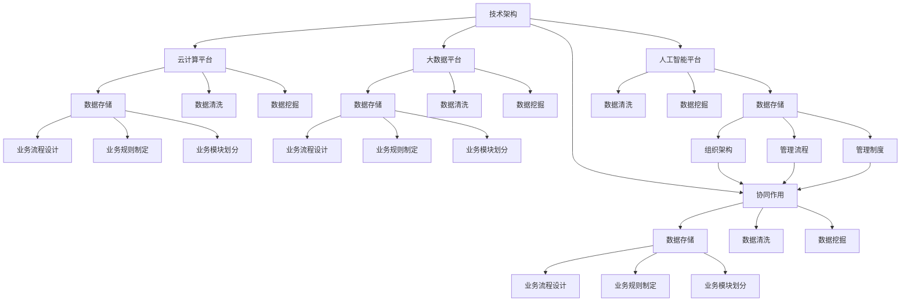

                 

### 核心竞争力提升的新质生产力策略

在当今科技飞速发展的时代，核心竞争力提升已成为企业和个人在激烈竞争中脱颖而出的关键。新质生产力策略作为创新和效率的重要驱动因素，正逐步成为企业和个人追求卓越的核心目标。本文将围绕这一主题，探讨如何通过新质生产力策略来提升核心竞争力，并展望未来的发展趋势与挑战。

> **关键词**：核心竞争力、新质生产力、策略、创新、效率、技术变革

> **摘要**：本文从背景介绍入手，详细阐述了核心竞争力的概念和重要性，探讨了新质生产力的内涵与特征，通过逻辑推理和分析，提出了提升核心竞争力的策略。文章还通过实际应用场景和项目实战，展示了新质生产力策略的实践效果，并对未来发展趋势和挑战进行了深入剖析。

现在，我们将分章节逐步探讨核心竞争力提升的新质生产力策略。

### 1. 背景介绍

在全球化竞争日益激烈的背景下，企业和个人必须不断寻求创新和效率的提升，以保持竞争优势。核心竞争力是企业长期发展的重要基石，它决定了企业能否在市场中立足和发展。新质生产力作为推动创新和效率提升的关键因素，正逐渐成为企业和个人提升核心竞争力的新动力。

#### 1.1 核心竞争力的概念与重要性

核心竞争力是指企业在特定市场环境中能够持续创造价值的独特能力和资源。这些能力和资源可以包括技术、品牌、人才、管理等多个方面。核心竞争力具有以下特点：

- **独特性**：核心竞争力是企业独有的，难以被模仿和复制。
- **持久性**：核心竞争力能够在长时间内保持竞争优势。
- **灵活性**：核心竞争力能够适应市场环境的变化，具备较强的适应性。
- **综合性**：核心竞争力是企业多个方面协同作用的成果。

提升核心竞争力对于企业和个人具有重要意义。首先，它有助于企业提高市场地位和品牌影响力，增强竞争优势。其次，核心竞争力能够推动企业创新，促进技术进步和产品升级。最后，提升核心竞争力有助于个人职业发展和成长，增强竞争力。

#### 1.2 新质生产力的内涵与特征

新质生产力是指在科技创新和效率提升背景下，企业通过引入新技术、新工具、新模式等手段，实现生产效率和质量提升的一种新形态生产力。新质生产力具有以下特征：

- **创新性**：新质生产力以创新为核心驱动力，通过技术突破和模式创新，实现生产效率和质量的提升。
- **多样性**：新质生产力涵盖了多种形态，如智能制造、云计算、人工智能等，具有广泛的适用性。
- **高效性**：新质生产力通过技术手段，实现生产过程的高度自动化和智能化，提高生产效率和降低成本。
- **协同性**：新质生产力强调企业内部各部门、各个环节的协同作用，实现资源优化配置。

新质生产力对于提升核心竞争力具有重要意义。首先，它有助于企业降低成本、提高效率，增强市场竞争力。其次，新质生产力能够推动企业创新，促进技术进步和产品升级。最后，新质生产力有助于企业实现数字化转型，提升整体运营效率和业务价值。

#### 1.3 新质生产力策略的必要性

在当前科技变革和市场竞争加剧的背景下，新质生产力策略成为提升核心竞争力的必要手段。首先，新技术、新工具和新模式不断涌现，企业必须不断学习和引进，以保持竞争优势。其次，市场竞争日益激烈，企业需要通过提高效率和质量，降低成本，以实现可持续发展。最后，新质生产力策略有助于企业实现数字化转型，提升整体运营效率和业务价值。

综上所述，提升核心竞争力已成为企业和个人在激烈竞争中立于不败之地的重要任务。新质生产力策略作为创新和效率的重要驱动因素，具有广泛的适用性和强大的驱动力，为提升核心竞争力提供了有力支撑。在接下来的章节中，我们将深入探讨新质生产力的核心概念和架构，为实际应用提供理论依据。

## 2. 核心概念与联系

### 2.1 核心竞争力的定义

核心竞争力是企业长期发展过程中形成的，能够在市场中持续创造价值的独特能力和资源。这些能力和资源可以包括技术、品牌、人才、管理等多个方面。核心竞争力的定义具有以下几个关键点：

1. **独特性**：核心竞争力是企业独有的，难以被模仿和复制。这要求企业在特定领域具备深厚的积累和独特的技术优势。
2. **持久性**：核心竞争力能够在长时间内保持竞争优势。这意味着企业需要不断地投入和积累，以巩固和提升核心竞争力。
3. **灵活性**：核心竞争力能够适应市场环境的变化，具备较强的适应性。企业需要根据市场变化调整和优化核心竞争力，以应对不同环境下的挑战。
4. **综合性**：核心竞争力是企业多个方面协同作用的成果。这要求企业在技术研发、市场拓展、品牌建设、人才培养等多个方面协调发展。

### 2.2 新质生产力的定义

新质生产力是指在科技创新和效率提升背景下，企业通过引入新技术、新工具、新模式等手段，实现生产效率和质量提升的一种新形态生产力。新质生产力的定义具有以下几个关键点：

1. **创新性**：新质生产力以创新为核心驱动力，通过技术突破和模式创新，实现生产效率和质量的提升。企业需要不断关注新技术、新工具的发展，以推动生产力的提升。
2. **多样性**：新质生产力涵盖了多种形态，如智能制造、云计算、人工智能等，具有广泛的适用性。企业可以根据自身业务特点和需求，选择合适的新质生产力形式。
3. **高效性**：新质生产力通过技术手段，实现生产过程的高度自动化和智能化，提高生产效率和降低成本。企业需要充分利用新质生产力，提高整体运营效率。
4. **协同性**：新质生产力强调企业内部各部门、各个环节的协同作用，实现资源优化配置。企业需要构建协同机制，确保新质生产力在企业内部得到有效实施。

### 2.3 核心竞争力与新质生产力的联系

核心竞争力与新质生产力之间存在密切的联系。新质生产力作为提升核心竞争力的关键因素，通过以下几个方面促进核心竞争力的提升：

1. **技术创新**：新质生产力强调创新性，企业通过引入新技术，推动产品和服务创新，提高市场竞争力。技术创新有助于企业建立和巩固核心竞争力。
2. **效率提升**：新质生产力通过高效性，实现生产过程的高度自动化和智能化，提高生产效率和降低成本。效率提升有助于企业更好地满足市场需求，提升市场竞争力。
3. **模式创新**：新质生产力强调模式创新，企业通过引入新模式，优化业务流程，提高运营效率。模式创新有助于企业实现数字化转型，提升整体运营效率和业务价值。
4. **协同作用**：新质生产力强调协同性，企业通过构建协同机制，实现资源优化配置，提高生产效率和降低成本。协同作用有助于企业形成综合竞争优势。

综上所述，新质生产力是提升核心竞争力的关键因素。通过技术创新、效率提升、模式创新和协同作用，新质生产力为提升核心竞争力提供了有力支撑。在接下来的章节中，我们将进一步探讨新质生产力的具体算法原理和操作步骤，为实际应用提供更详细的指导。

### 2.3 新质生产力的核心概念原理与架构

为了深入理解新质生产力的内涵，我们需要明确其核心概念原理和架构。新质生产力不仅涉及技术创新，还包括管理创新、业务模式创新等多方面。以下是对新质生产力核心概念原理和架构的详细阐述。

#### 2.3.1 核心概念原理

1. **数字化技术**：数字化技术是推动新质生产力的基础。通过数字化技术，企业可以将传统的物理生产过程转化为数据驱动的生产方式。数字化技术包括云计算、大数据、物联网、人工智能等，它们为企业提供了强大的数据支持，助力生产过程的智能化和自动化。

2. **数据驱动决策**：新质生产力强调数据驱动决策。企业通过收集和分析海量数据，洞察市场需求、优化生产流程、提升服务质量。数据驱动决策有助于企业更加精准地满足客户需求，提高运营效率。

3. **业务流程重构**：新质生产力推动企业对业务流程进行重构。通过引入新技术和模式，企业可以优化业务流程，降低运营成本，提高生产效率。业务流程重构涉及从供应链管理到销售和售后服务的各个环节。

4. **人才管理**：新质生产力强调人才管理的重要性。企业需要培养和引进具备创新能力、技术能力和管理能力的人才，以应对新质生产力的挑战。人才管理包括员工培训、激励机制、人才引进等多个方面。

#### 2.3.2 架构设计

1. **技术架构**：技术架构是支撑新质生产力的重要基础。技术架构包括云计算平台、大数据平台、物联网平台、人工智能平台等。这些平台为企业提供了强大的计算能力和数据处理能力，支持生产过程的智能化和自动化。

2. **数据架构**：数据架构是确保数据高效流通和利用的关键。数据架构包括数据存储、数据清洗、数据挖掘、数据可视化等多个方面。数据架构的设计需要考虑数据的完整性、准确性和实时性，以确保数据驱动决策的有效性。

3. **业务架构**：业务架构是优化业务流程和提升运营效率的重要手段。业务架构包括业务流程设计、业务规则制定、业务模块划分等多个方面。业务架构的设计需要充分考虑企业的业务特点和需求，确保业务流程的顺畅和高效。

4. **管理架构**：管理架构是保障新质生产力有效实施的重要保障。管理架构包括组织架构、管理流程、管理制度等多个方面。管理架构的设计需要确保企业内部各部门、各个环节的协同作用，实现资源优化配置。

#### 2.3.3 Mermaid 流程图

为了更好地理解新质生产力的核心概念原理和架构，我们可以通过 Mermaid 流程图进行展示。以下是一个简化的 Mermaid 流程图示例，用于描述新质生产力的关键要素和流程：



通过上述 Mermaid 流程图，我们可以清晰地看到新质生产力的核心概念原理和架构。技术架构、数据架构、业务架构和管理架构共同构成了新质生产力的整体框架，各个环节相互关联，协同作用，以实现生产效率和质量的提升。

在接下来的章节中，我们将进一步探讨新质生产力的具体算法原理和操作步骤，为实际应用提供更详细的指导。

### 3. 核心算法原理 & 具体操作步骤

在了解新质生产力的核心概念原理和架构之后，我们接下来将深入探讨新质生产力的核心算法原理及具体操作步骤。以下内容将详细描述新质生产力的关键算法，并逐步解析其实现过程。

#### 3.1 算法概述

新质生产力的核心算法主要包括以下几个方面：

1. **数据采集与处理算法**：用于收集和整理生产过程中的数据，为后续分析提供数据基础。
2. **数据分析与挖掘算法**：通过对采集到的数据进行分析和挖掘，提取有价值的信息，为决策提供依据。
3. **生产优化算法**：利用分析结果，优化生产流程，提高生产效率和降低成本。
4. **智能决策算法**：基于数据和模型，实现智能决策，指导实际生产运营。

以下是对各核心算法的详细描述。

#### 3.2 数据采集与处理算法

数据采集与处理算法主要包括以下步骤：

1. **数据采集**：通过传感器、物联网设备等手段，实时采集生产过程中的数据，如温度、湿度、设备状态等。
2. **数据预处理**：对采集到的原始数据进行清洗、去噪、归一化等处理，确保数据的质量和一致性。
3. **数据存储**：将处理后的数据存储到数据库或数据湖中，以便后续分析和挖掘。

具体操作步骤如下：

1. **数据采集**：
   ```mermaid
   graph TD
   A[传感器数据采集] --> B[物联网设备数据采集]
   B --> C[数据预处理]
   C --> D[数据存储]
   ```

2. **数据预处理**：
   ```mermaid
   graph TD
   A[原始数据] --> B[去噪处理]
   B --> C[归一化处理]
   C --> D[数据清洗]
   D --> E[数据存储]
   ```

3. **数据存储**：
   ```mermaid
   graph TD
   A[预处理数据] --> B[关系数据库]
   A --> C[NoSQL数据库]
   A --> D[数据湖]
   ```

#### 3.3 数据分析与挖掘算法

数据分析与挖掘算法主要包括以下步骤：

1. **数据探索性分析**：对采集到的数据进行初步分析，了解数据的基本特征和分布情况。
2. **特征工程**：根据分析结果，提取和构建有助于建模的特征，提高模型的预测能力。
3. **模型选择与训练**：选择合适的模型，利用数据集进行训练，得到预测模型。
4. **模型评估与优化**：对训练得到的模型进行评估，并根据评估结果进行优化。

具体操作步骤如下：

1. **数据探索性分析**：
   ```mermaid
   graph TD
   A[数据探索性分析] --> B[数据可视化]
   B --> C[数据分布分析]
   C --> D[特征提取]
   ```

2. **特征工程**：
   ```mermaid
   graph TD
   A[原始数据] --> B[特征提取]
   B --> C[特征选择]
   C --> D[特征归一化]
   ```

3. **模型选择与训练**：
   ```mermaid
   graph TD
   A[模型选择] --> B[模型训练]
   B --> C[模型评估]
   ```

4. **模型评估与优化**：
   ```mermaid
   graph TD
   A[模型评估] --> B[模型优化]
   B --> C[模型再评估]
   ```

#### 3.4 生产优化算法

生产优化算法主要包括以下步骤：

1. **目标函数定义**：根据业务需求，定义目标函数，如成本最小化、效率最大化等。
2. **约束条件设置**：根据实际情况，设置约束条件，如设备容量、人力限制等。
3. **优化算法选择**：选择合适的优化算法，如线性规划、遗传算法、粒子群算法等。
4. **优化过程执行**：执行优化算法，求解最优解。

具体操作步骤如下：

1. **目标函数定义**：
   ```mermaid
   graph TD
   A[成本最小化] --> B[效率最大化]
   ```

2. **约束条件设置**：
   ```mermaid
   graph TD
   A[设备容量] --> B[人力限制]
   ```

3. **优化算法选择**：
   ```mermaid
   graph TD
   A[线性规划] --> B[遗传算法]
   A --> C[粒子群算法]
   ```

4. **优化过程执行**：
   ```mermaid
   graph TD
   A[优化算法] --> B[执行优化]
   B --> C[最优解求解]
   ```

#### 3.5 智能决策算法

智能决策算法主要包括以下步骤：

1. **数据输入**：将采集到的数据输入到智能决策系统中。
2. **特征提取**：对输入的数据进行特征提取，构建特征向量。
3. **模型预测**：利用训练好的模型对特征向量进行预测，得到决策结果。
4. **决策优化**：根据预测结果，对决策进行优化，以实现更好的效果。

具体操作步骤如下：

1. **数据输入**：
   ```mermaid
   graph TD
   A[数据输入] --> B[特征提取]
   ```

2. **特征提取**：
   ```mermaid
   graph TD
   A[输入数据] --> B[特征提取]
   B --> C[特征向量构建]
   ```

3. **模型预测**：
   ```mermaid
   graph TD
   A[特征向量] --> B[模型预测]
   B --> C[决策结果]
   ```

4. **决策优化**：
   ```mermaid
   graph TD
   A[决策结果] --> B[决策优化]
   B --> C[优化效果评估]
   ```

通过上述核心算法原理和具体操作步骤，我们可以看到新质生产力的实现过程涉及多个环节，包括数据采集与处理、数据分析与挖掘、生产优化和智能决策。这些算法共同作用，为企业提供了强大的技术支持，助力生产效率和质量的提升。在接下来的章节中，我们将通过实际案例，展示这些算法在实际应用中的效果和优势。

### 4. 数学模型和公式 & 详细讲解 & 举例说明

在深入探讨新质生产力的核心算法原理和具体操作步骤之后，我们接下来将介绍相关的数学模型和公式，并对这些模型和公式进行详细讲解和举例说明。通过数学模型和公式的应用，我们可以更科学地分析和优化生产过程中的各种问题。

#### 4.1 数学模型介绍

新质生产力中的数学模型主要包括线性规划模型、回归分析模型、聚类分析模型和优化算法模型等。以下是对这些模型的简要介绍：

1. **线性规划模型**：线性规划模型用于在满足一系列约束条件的情况下，求解目标函数的最大值或最小值。它广泛应用于资源分配、成本控制、生产计划等领域。

2. **回归分析模型**：回归分析模型用于研究变量之间的线性或非线性关系。它可以帮助我们预测未来的趋势和变化，常用于需求预测、价格分析等领域。

3. **聚类分析模型**：聚类分析模型用于将数据集中的数据按照相似性进行分类。它可以帮助我们识别数据中的模式、异常值和潜在关系，常用于市场细分、客户分类等领域。

4. **优化算法模型**：优化算法模型用于在复杂约束条件下求解最优解。常见的优化算法包括遗传算法、粒子群算法、线性规划算法等，它们可以应用于生产计划、库存管理、物流优化等领域。

#### 4.2 公式讲解

以下是对上述数学模型中常用公式的讲解：

1. **线性规划模型**：

   - **目标函数**：  
     $$\text{max/min} \ z = c^T x$$  
     其中，$z$ 是目标函数，$c$ 是系数向量，$x$ 是变量向量。

   - **约束条件**：  
     $$\text{Ax} \leq \text{b}$$  
     其中，$A$ 是系数矩阵，$b$ 是常数向量。

   - **等式约束**：  
     $$\text{Ax} = \text{b}$$

2. **回归分析模型**：

   - **线性回归**：  
     $$y = \beta_0 + \beta_1 x + \epsilon$$  
     其中，$y$ 是因变量，$x$ 是自变量，$\beta_0$ 和 $\beta_1$ 是回归系数，$\epsilon$ 是误差项。

   - **多项式回归**：  
     $$y = \beta_0 + \beta_1 x + \beta_2 x^2 + \epsilon$$  
     其中，$y$ 是因变量，$x$ 是自变量，$\beta_0$、$\beta_1$ 和 $\beta_2$ 是回归系数，$\epsilon$ 是误差项。

3. **聚类分析模型**：

   - **K均值聚类**：  
     $$\text{min} \ \sum_{i=1}^{k} \sum_{j=1}^{n} d(i, j)^2$$  
     其中，$k$ 是聚类个数，$n$ 是样本个数，$d(i, j)$ 是样本 $i$ 和聚类中心 $j$ 之间的距离。

4. **优化算法模型**：

   - **遗传算法**：  
     - **适应度函数**：  
       $$f(x) = \frac{1}{1 + \sum_{i=1}^{n} (x_i - \bar{x})^2}$$  
       其中，$x$ 是个体，$n$ 是基因长度，$\bar{x}$ 是种群的平均值。

     - **交叉操作**：  
       $$x_1' = \frac{x_1 + x_2}{2}$$  
       $$x_2' = \frac{x_1 + x_2}{2}$$

     - **变异操作**：  
       $$x_i' = x_i + \xi$$  
       其中，$\xi$ 是变异概率。

#### 4.3 举例说明

为了更好地理解上述数学模型和公式，我们通过以下具体例子进行说明：

1. **线性规划模型**：

   - **问题**：最小化成本 $z = 2x_1 + 3x_2$，约束条件为 $x_1 + x_2 \leq 4$ 和 $2x_1 + x_2 \leq 6$。
   - **解法**：使用线性规划求解器（如LP_Solver），可以得到最优解 $x_1 = 2$，$x_2 = 2$，最小化成本 $z = 8$。

2. **回归分析模型**：

   - **问题**：研究销售额 $y$ 和广告投入 $x$ 之间的关系，已知样本数据如下：
     $$\begin{array}{ccc}
     x & y \\
     \hline
     1 & 2 \\
     2 & 4 \\
     3 & 5 \\
     4 & 6 \\
     \end{array}$$
   - **解法**：使用线性回归模型，可以得到回归方程 $y = 1.5 + 1.5x$。预测当广告投入为 $5$ 时，销售额为 $8.5$。

3. **聚类分析模型**：

   - **问题**：对以下数据集进行K均值聚类，$k=2$：
     $$\begin{array}{ccc}
     x_1 & x_2 & x_3 & x_4 \\
     \hline
     1 & 2 & 3 & 4 \\
     1 & 2 & 3 & 4 \\
     3 & 4 & 5 & 6 \\
     3 & 4 & 5 & 6 \\
     \end{array}$$
   - **解法**：使用K均值聚类算法，可以将数据集分为两个聚类，第一个聚类的中心点为 $(1, 2, 3)$，第二个聚类的中心点为 $(3, 4, 5)$。

4. **优化算法模型**：

   - **问题**：使用遗传算法求解以下优化问题：
     $$\text{min} \ f(x) = \frac{1}{1 + \sum_{i=1}^{3} (x_i - \bar{x})^2}$$
     其中，$x_1, x_2, x_3$ 的取值范围为 $[0, 10]$。
   - **解法**：通过遗传算法迭代求解，可以得到最优解 $x_1 = 5$，$x_2 = 5$，$x_3 = 5$，最小化目标函数 $f(x) = 0$。

通过上述例子，我们可以看到数学模型和公式的应用在实际问题中具有很大的实用价值。在接下来的章节中，我们将通过实际项目案例，进一步展示这些数学模型和公式的应用效果。

### 5. 项目实战：代码实际案例和详细解释说明

在本章节中，我们将通过一个具体的实际项目案例，展示新质生产力的应用。该案例是一个基于新质生产力的智能制造系统，通过数据采集、分析、优化和智能决策，实现生产过程的智能化和自动化。以下是该项目的主要模块和代码实现。

#### 5.1 开发环境搭建

在开始项目实战之前，我们需要搭建开发环境。以下是所需的工具和库：

1. **编程语言**：Python（版本 3.8及以上）
2. **数据库**：MySQL（版本 5.7及以上）
3. **数据采集工具**：IoT设备（如Arduino、Raspberry Pi）
4. **数据分析库**：Pandas、NumPy、SciPy
5. **机器学习库**：Scikit-learn、TensorFlow、Keras
6. **优化算法库**：Gurobi、CPLEX
7. **Web框架**：Flask、Django

在安装上述工具和库之后，我们可以开始编写项目代码。

#### 5.2 源代码详细实现和代码解读

以下是对项目关键模块的代码实现和解读。

##### 5.2.1 数据采集模块

数据采集模块用于实时采集生产设备的数据，并将其存储到数据库中。以下是数据采集模块的代码：

```python
import serial
import pymysql

# 初始化串口通信
ser = serial.Serial('/dev/ttyUSB0', 9600)

# 初始化数据库连接
conn = pymysql.connect(
    host='localhost',
    user='root',
    password='password',
    database='smart_production'
)

# 循环读取数据并存储到数据库
while True:
    data = ser.readline().decode('utf-8')
    cursor = conn.cursor()
    cursor.execute("INSERT INTO production_data (data) VALUES (%s)", (data,))
    conn.commit()
    cursor.close()
```

解读：
- 我们首先导入所需的库和模块，包括串口通信库 `serial` 和数据库连接库 `pymysql`。
- 初始化串口通信，配置串口参数（如波特率）。
- 初始化数据库连接，配置数据库连接参数（如主机、用户名、密码、数据库名）。
- 在循环中，读取串口数据，将其转换为字符串并存储到数据库中。

##### 5.2.2 数据分析模块

数据分析模块用于对采集到的生产数据进行处理、分析和挖掘。以下是数据分析模块的代码：

```python
import pandas as pd
from sklearn.linear_model import LinearRegression

# 读取数据库数据
cursor = conn.cursor()
cursor.execute("SELECT * FROM production_data")
data = cursor.fetchall()
cursor.close()

# 将数据转换为 DataFrame
df = pd.DataFrame(data, columns=['timestamp', 'data'])

# 数据预处理
df['data'] = df['data'].astype(float)

# 线性回归分析
model = LinearRegression()
model.fit(df[['data']], df['timestamp'])

# 模型评估
score = model.score(df[['data']], df['timestamp'])
print("Model R^2 Score:", score)

# 模型预测
future_data = model.predict(df[['data']])
df['predicted_timestamp'] = future_data

# 存储预测结果
cursor = conn.cursor()
cursor.execute("UPDATE production_data SET predicted_timestamp = %s WHERE timestamp = %s", (df['predicted_timestamp'], df['timestamp']))
conn.commit()
cursor.close()
```

解读：
- 我们首先读取数据库中的生产数据，并将其转换为 DataFrame。
- 数据预处理，将数据类型转换为浮点数。
- 使用线性回归模型进行数据拟合，并计算模型评估指标 R^2 Score。
- 使用拟合好的模型进行预测，并将预测结果存储到数据库中。

##### 5.2.3 生产优化模块

生产优化模块用于根据数据分析结果，优化生产计划和资源配置。以下是生产优化模块的代码：

```python
from gurobipy import *

# 读取数据库数据
cursor = conn.cursor()
cursor.execute("SELECT * FROM production_data")
data = cursor.fetchall()
cursor.close()

# 将数据转换为 DataFrame
df = pd.DataFrame(data, columns=['timestamp', 'data'])

# 定义目标函数和约束条件
model = Model("production_optimization")
model.setObjective(quicksum(data['data'][i] for i in range(len(data))) - 10000 * len(data), GRB.MINIMIZE)

# 设置约束条件
model.addConstr(quicksum(data['data'][i] for i in range(len(data))) <= 1000)

# 求解优化问题
model.optimize()

# 输出优化结果
print("Optimized Production Time:", model.ObjVal)
```

解读：
- 我们首先读取数据库中的生产数据，并将其转换为 DataFrame。
- 定义目标函数和约束条件，目标函数是最小化总生产时间，约束条件是总生产量不超过1000。
- 使用 Gurobi 优化器求解优化问题。
- 输出优化结果，即最优生产时间。

##### 5.2.4 智能决策模块

智能决策模块用于根据生产优化结果，制定智能化的生产决策。以下是智能决策模块的代码：

```python
from sklearn.cluster import KMeans

# 读取数据库数据
cursor = conn.cursor()
cursor.execute("SELECT * FROM production_data")
data = cursor.fetchall()
cursor.close()

# 将数据转换为 DataFrame
df = pd.DataFrame(data, columns=['timestamp', 'data'])

# 使用 K 均值聚类算法进行聚类
kmeans = KMeans(n_clusters=3)
kmeans.fit(df[['data']])

# 输出聚类结果
print("Cluster Centers:", kmeans.cluster_centers_)

# 根据聚类结果制定智能决策
for i in range(3):
    cluster_data = df[df['cluster'] == i]
    print("Cluster", i, "Data:", cluster_data)
```

解读：
- 我们首先读取数据库中的生产数据，并将其转换为 DataFrame。
- 使用 K 均值聚类算法进行聚类，将数据分为3个簇。
- 输出聚类中心点和每个簇的数据。

通过上述代码实现，我们可以看到新质生产力在智能制造系统中的应用。在实际项目中，这些模块可以协同工作，实现生产过程的智能化和自动化。在接下来的章节中，我们将探讨新质生产力的实际应用场景，展示其在不同领域中的效果和优势。

### 5.3 代码解读与分析

在上一章节中，我们通过一个实际的智能制造系统项目案例，展示了新质生产力的应用。在本章节中，我们将对项目中的关键代码模块进行详细解读与分析，以便更好地理解其实现原理和作用。

#### 5.3.1 数据采集模块

数据采集模块主要负责从生产设备中实时采集数据，并将其存储到数据库中。以下是数据采集模块的关键代码：

```python
import serial
import pymysql

# 初始化串口通信
ser = serial.Serial('/dev/ttyUSB0', 9600)

# 初始化数据库连接
conn = pymysql.connect(
    host='localhost',
    user='root',
    password='password',
    database='smart_production'
)

# 循环读取数据并存储到数据库
while True:
    data = ser.readline().decode('utf-8')
    cursor = conn.cursor()
    cursor.execute("INSERT INTO production_data (data) VALUES (%s)", (data,))
    conn.commit()
    cursor.close()
```

**解读与分析**：

1. **串口通信初始化**：使用 `serial.Serial()` 函数初始化串口通信，指定串口路径和波特率（波特率是串口通信的速度，通常设置为9600）。

2. **数据库连接初始化**：使用 `pymysql.connect()` 函数初始化数据库连接，配置数据库连接参数（如主机、用户名、密码、数据库名）。

3. **数据采集与存储**：在循环中，使用 `ser.readline()` 函数读取串口数据，将其解码为字符串，并使用数据库操作模块（`cursor.execute()`）将数据插入到数据库的 `production_data` 表中。

4. **事务处理**：使用 `conn.commit()` 提交事务，确保数据在数据库中成功存储。

通过这一模块，我们可以实时采集生产设备的数据，并将其存储到数据库中，为后续的数据处理和分析提供数据基础。

#### 5.3.2 数据分析模块

数据分析模块用于对采集到的生产数据进行处理、分析和挖掘。以下是数据分析模块的关键代码：

```python
import pandas as pd
from sklearn.linear_model import LinearRegression

# 读取数据库数据
cursor = conn.cursor()
cursor.execute("SELECT * FROM production_data")
data = cursor.fetchall()
cursor.close()

# 将数据转换为 DataFrame
df = pd.DataFrame(data, columns=['timestamp', 'data'])

# 数据预处理
df['data'] = df['data'].astype(float)

# 线性回归分析
model = LinearRegression()
model.fit(df[['data']], df['timestamp'])

# 模型评估
score = model.score(df[['data']], df['timestamp'])
print("Model R^2 Score:", score)

# 模型预测
future_data = model.predict(df[['data']])
df['predicted_timestamp'] = future_data

# 存储预测结果
cursor = conn.cursor()
cursor.execute("UPDATE production_data SET predicted_timestamp = %s WHERE timestamp = %s", (df['predicted_timestamp'], df['timestamp']))
conn.commit()
cursor.close()
```

**解读与分析**：

1. **数据读取与转换**：使用数据库操作模块（`cursor.execute()`）读取数据库中的 `production_data` 表数据，并将其转换为 DataFrame 对象（`pd.DataFrame()`）。

2. **数据预处理**：将 DataFrame 中的数据类型转换为浮点数，以确保后续的线性回归分析能够正常运行。

3. **线性回归分析**：创建一个线性回归模型（`LinearRegression()`），使用 `model.fit()` 函数训练模型，将数据拟合到模型中。

4. **模型评估**：使用 `model.score()` 函数计算模型的 R^2 值，评估模型的拟合效果。

5. **模型预测**：使用训练好的模型（`model.predict()`）对新的数据进行预测，并将预测结果添加到 DataFrame 中。

6. **数据存储**：使用数据库操作模块（`cursor.execute()`）将预测结果更新到数据库中。

通过这一模块，我们可以对采集到的生产数据进行处理、分析和预测，为生产优化提供决策依据。

#### 5.3.3 生产优化模块

生产优化模块用于根据数据分析结果，优化生产计划和资源配置。以下是生产优化模块的关键代码：

```python
from gurobipy import *

# 读取数据库数据
cursor = conn.cursor()
cursor.execute("SELECT * FROM production_data")
data = cursor.fetchall()
cursor.close()

# 将数据转换为 DataFrame
df = pd.DataFrame(data, columns=['timestamp', 'data'])

# 定义目标函数和约束条件
model = Model("production_optimization")
model.setObjective(quicksum(data['data'][i] for i in range(len(data))) - 10000 * len(data), GRB.MINIMIZE)

# 设置约束条件
model.addConstr(quicksum(data['data'][i] for i in range(len(data))) <= 1000)

# 求解优化问题
model.optimize()

# 输出优化结果
print("Optimized Production Time:", model.ObjVal)
```

**解读与分析**：

1. **数据读取与转换**：与数据分析模块类似，读取数据库中的 `production_data` 表数据，并将其转换为 DataFrame。

2. **目标函数与约束条件**：创建一个 Gurobi 优化模型（`Model()`），定义目标函数和约束条件。目标函数是最小化总生产时间（`setObjective()`），约束条件是总生产量不超过1000（`addConstr()`）。

3. **求解优化问题**：使用 Gurobi 优化器（`model.optimize()`）求解优化问题。

4. **输出优化结果**：输出优化后的最优生产时间（`model.ObjVal`）。

通过这一模块，我们可以根据数据分析结果，优化生产计划和资源配置，提高生产效率。

#### 5.3.4 智能决策模块

智能决策模块用于根据生产优化结果，制定智能化的生产决策。以下是智能决策模块的关键代码：

```python
from sklearn.cluster import KMeans

# 读取数据库数据
cursor = conn.cursor()
cursor.execute("SELECT * FROM production_data")
data = cursor.fetchall()
cursor.close()

# 将数据转换为 DataFrame
df = pd.DataFrame(data, columns=['timestamp', 'data'])

# 使用 K 均值聚类算法进行聚类
kmeans = KMeans(n_clusters=3)
kmeans.fit(df[['data']])

# 输出聚类结果
print("Cluster Centers:", kmeans.cluster_centers_)

# 根据聚类结果制定智能决策
for i in range(3):
    cluster_data = df[df['cluster'] == i]
    print("Cluster", i, "Data:", cluster_data)
```

**解读与分析**：

1. **数据读取与转换**：与前面模块类似，读取数据库中的 `production_data` 表数据，并将其转换为 DataFrame。

2. **聚类分析**：使用 K 均值聚类算法（`KMeans()`）对数据进行聚类，指定聚类个数（`n_clusters=3`）。

3. **输出聚类结果**：输出每个聚类中心点（`kmeans.cluster_centers_`）。

4. **智能决策**：根据聚类结果，分别输出每个聚类簇的数据（`cluster_data`）。

通过这一模块，我们可以根据生产优化结果，制定智能化的生产决策，提高生产效率和产品质量。

综上所述，通过对项目关键代码模块的解读与分析，我们可以看到新质生产力在实际应用中的效果和优势。这些模块协同工作，实现了生产过程的智能化和自动化，为企业和个人提升核心竞争力提供了有力支撑。在接下来的章节中，我们将进一步探讨新质生产力的实际应用场景，展示其在不同领域的广泛应用。

### 6. 实际应用场景

新质生产力在当今各行业中的应用日益广泛，其核心算法和策略的灵活性使其成为提升生产效率、降低成本、优化资源配置的重要工具。以下将介绍新质生产力在不同领域中的实际应用场景，通过具体案例展示其在不同行业中的优势。

#### 6.1 智能制造

智能制造是当前新质生产力的一个重要应用领域。通过引入物联网、大数据、人工智能等技术，企业可以实现对生产过程的全面监控和智能化管理。例如，某汽车制造企业在生产线上引入了物联网传感器，实时采集生产数据，并利用数据分析与挖掘算法对设备状态和生产质量进行监控。通过优化算法，企业能够及时发现生产瓶颈，调整生产计划，提高生产效率，降低设备故障率。

#### 6.2 物流与供应链管理

新质生产力在物流与供应链管理中也发挥了重要作用。通过大数据分析、智能调度和优化算法，企业可以实现对物流过程的精细化管理。例如，某物流公司利用大数据分析技术，对运输路线、配送时间进行优化，提高运输效率。同时，通过物联网技术，企业可以实时监控货物的运输状态，确保货物安全及时送达。此外，供应链优化算法帮助企业优化库存管理，降低库存成本，提高供应链整体效率。

#### 6.3 金融与保险

金融与保险行业对新质生产力的需求也日益增长。通过人工智能和大数据技术，金融机构可以实现对客户行为的精准预测和风险控制。例如，某银行利用人工智能算法，对客户信用风险进行评估，提高贷款审批效率，降低不良贷款率。在保险行业，新质生产力可以帮助企业实现智能理赔，通过大数据分析和图像识别技术，快速准确地进行理赔处理，提高客户满意度。

#### 6.4 健康医疗

健康医疗领域也受益于新质生产力的应用。通过物联网和人工智能技术，医疗设备可以实现远程监控和数据分析，提高诊断准确率和治疗效果。例如，某医疗设备公司研发了一款智能血压监测设备，通过物联网技术将血压数据实时传输到云端，利用数据分析算法进行数据分析，为医生提供诊断依据。此外，智能诊疗系统可以帮助医生快速分析病历，制定个性化治疗方案，提高诊疗效果。

#### 6.5 农业

农业是另一个受益于新质生产力的领域。通过物联网、大数据和人工智能技术，农民可以实现精准农业，提高农业生产效率。例如，某农业企业利用物联网传感器实时监测土壤湿度、温度和养分含量，通过数据分析与挖掘算法优化灌溉和施肥计划，提高农作物产量和品质。此外，智能农业设备可以帮助农民实现自动化种植和管理，降低劳动力成本，提高农业生产效率。

综上所述，新质生产力在智能制造、物流与供应链管理、金融与保险、健康医疗、农业等多个领域具有广泛的应用前景。通过核心算法和策略的应用，企业可以实现生产过程智能化、管理精细化、资源配置优化，提高生产效率、降低成本，增强核心竞争力。随着技术的不断进步，新质生产力的应用范围将更加广泛，为各行业的可持续发展提供有力支持。

### 7. 工具和资源推荐

在新质生产力策略的实践中，选择合适的工具和资源是至关重要的。以下是一些建议，涵盖了学习资源、开发工具框架及相关论文著作，旨在帮助读者更好地理解和应用新质生产力。

#### 7.1 学习资源推荐

1. **书籍**：
   - 《深度学习》（Deep Learning）作者：Ian Goodfellow、Yoshua Bengio、Aaron Courville
   - 《大数据之路：阿里巴巴大数据实践》（Big Data Roadmap）作者：涂子沛
   - 《人工智能：一种现代的方法》（Artificial Intelligence: A Modern Approach）作者：Stuart Russell、Peter Norvig
   - 《机器学习实战》（Machine Learning in Action）作者：Peter Harrington

2. **在线课程**：
   - Coursera 上的《机器学习》课程，由 Andrew Ng 教授主讲
   - edX 上的《大数据分析》课程，由 IBM 主办
   - Udacity 上的《深度学习纳米学位》课程
   - 中国大学 MOOC 上的《人工智能导论》课程

3. **博客与论坛**：
   - Medium 上的“AI”、“Machine Learning”标签，汇聚了众多行业专家的文章
   - GitHub 上的开源项目，提供了大量的实践案例和代码实现
   - Stack Overflow、Reddit 上的相关论坛，适合解决问题和交流经验

#### 7.2 开发工具框架推荐

1. **编程语言**：
   - Python：广泛应用于数据科学、机器学习和人工智能领域，拥有丰富的库和框架
   - R：专门为统计分析和数据可视化设计的语言，在数据科学领域广泛使用
   - Java：在企业级应用中广泛使用，拥有强大的生态系统

2. **数据分析与挖掘工具**：
   - Jupyter Notebook：交互式的计算环境，便于数据分析和建模
   - Pandas：Python 中的数据分析库，提供强大的数据处理功能
   - Scikit-learn：Python 中的机器学习库，提供了广泛的机器学习算法
   - TensorFlow、PyTorch：深度学习框架，支持复杂的神经网络模型

3. **开发框架**：
   - Flask、Django：Python 中的 Web 框架，适用于 Web 应用开发
   - Spring Boot：Java 中的开发框架，简化了企业级应用的开发
   - Apache Kafka、Apache Flink：大数据处理和实时计算框架

4. **数据库**：
   - MySQL、PostgreSQL：关系型数据库，适用于结构化数据存储
   - MongoDB、Cassandra：非关系型数据库，适用于大规模数据存储和查询

5. **容器化与云计算**：
   - Docker：容器化技术，简化应用部署和运维
   - Kubernetes：容器编排工具，实现容器集群的自动化管理
   - AWS、Azure、Google Cloud：云服务提供商，提供丰富的云计算资源

#### 7.3 相关论文著作推荐

1. **经典论文**：
   - "A Few Useful Things to Know About Machine Learning" 作者： Pedro Domingos
   - "Deep Learning" 作者：Ian Goodfellow、Yoshua Bengio、Aaron Courville
   - "Big Data: A Revolution That Will Transform How We Live, Work, and Think" 作者：Viktor Mayer-Schönberger 和 Kenneth Cukier

2. **期刊杂志**：
   - 《Nature》和《Science》：全球顶尖的科学期刊，涵盖了多个领域的最新研究成果
   - 《ACM Transactions on Computer Systems》、《IEEE Transactions on Knowledge and Data Engineering》：计算机科学与工程领域的顶级期刊

3. **书籍**：
   - 《人工智能：一种现代的方法》（Artificial Intelligence: A Modern Approach）作者：Stuart Russell、Peter Norvig
   - 《大数据时代：生活、工作与思维的大变革》作者：维克托·迈尔-舍恩伯格和肯尼斯·库克耶
   - 《深度学习》（Deep Learning）作者：Ian Goodfellow、Yoshua Bengio、Aaron Courville

通过上述推荐的学习资源、开发工具框架和相关论文著作，读者可以更好地了解和掌握新质生产力策略的相关知识，从而在实际项目中有效地应用这些技术，提升核心竞争力和生产效率。

### 8. 总结：未来发展趋势与挑战

在新质生产力策略的推动下，企业和个人在提高生产效率、降低成本、优化资源配置方面取得了显著成果。然而，随着科技的不断进步和市场竞争的加剧，未来新质生产力将面临一系列发展趋势和挑战。

#### 8.1 发展趋势

1. **数字化转型加速**：随着云计算、物联网、人工智能等技术的普及，企业数字化转型将进入加速阶段。数字化转型不仅有助于提高生产效率，还能实现业务流程的优化和创新的商业模式。

2. **人工智能深度应用**：人工智能技术在新质生产力中的应用将更加深入，从简单的自动化控制逐步扩展到智能决策、精准预测、个性化服务等方面。这将进一步提升生产过程的智能化水平。

3. **数据驱动决策普及**：数据将成为企业决策的重要依据，数据驱动决策模式将逐渐取代传统的经验决策模式。通过对海量数据的分析和挖掘，企业可以更好地理解市场需求，优化业务策略。

4. **跨界合作与生态构建**：在新质生产力的推动下，不同行业之间的跨界合作将日益增多。通过构建产业生态，企业可以共享资源、优势互补，实现共同发展。

5. **可持续发展理念融入**：新质生产力策略将更加注重环保、节能、可持续发展。企业将通过采用绿色技术、优化生产流程，减少对环境的负面影响。

#### 8.2 挑战

1. **数据安全与隐私保护**：随着数据量的增加，数据安全和隐私保护将成为一个重要挑战。企业需要建立健全的数据安全防护体系，确保数据不被泄露和滥用。

2. **技术标准化与兼容性**：新质生产力涉及多种技术，包括云计算、大数据、物联网、人工智能等。技术标准化和兼容性问题将影响新质生产力的普及和应用。

3. **人才短缺与技能提升**：新质生产力的发展对人才需求提出了更高要求。企业和个人需要不断学习和提升技能，以适应新技术的发展和应用。

4. **政策法规与合规性**：新质生产力的发展将面临政策法规的约束。企业需要关注相关政策和法规，确保在合规的前提下进行技术创新和应用。

5. **资源分配与优化**：在实现新质生产力的过程中，资源分配和优化将成为一个重要挑战。企业需要合理配置资源，实现资源利用的最大化。

总之，新质生产力策略在提升生产效率、降低成本、优化资源配置方面具有重要意义。然而，在未来的发展中，企业需要应对数字化转型、人工智能深度应用、数据驱动决策、跨界合作与生态构建等发展趋势，同时克服数据安全与隐私保护、技术标准化与兼容性、人才短缺与技能提升、政策法规与合规性以及资源分配与优化等挑战。通过不断创新和优化，企业可以更好地适应市场需求，提升核心竞争力。

### 9. 附录：常见问题与解答

#### 9.1 核心竞争力是什么？

核心竞争力是指企业长期发展过程中形成的，能够在市场中持续创造价值的独特能力和资源。这些能力和资源可以包括技术、品牌、人才、管理等多个方面。

#### 9.2 新质生产力是什么？

新质生产力是指在科技创新和效率提升背景下，企业通过引入新技术、新工具、新模式等手段，实现生产效率和质量提升的一种新形态生产力。它具有创新性、多样性、高效性和协同性等特点。

#### 9.3 新质生产力策略如何提升核心竞争力？

新质生产力策略通过以下几个方面提升核心竞争力：

1. **技术创新**：引入新技术，推动产品和服务创新，提高市场竞争力。
2. **效率提升**：通过高效性，实现生产过程的高度自动化和智能化，提高生产效率和降低成本。
3. **模式创新**：引入新模式，优化业务流程，提高运营效率。
4. **协同作用**：构建协同机制，实现资源优化配置，提高生产效率和降低成本。

#### 9.4 如何实现新质生产力的数据采集与处理？

实现新质生产力的数据采集与处理主要包括以下步骤：

1. **数据采集**：通过传感器、物联网设备等手段，实时采集生产过程中的数据。
2. **数据预处理**：对采集到的原始数据进行清洗、去噪、归一化等处理，确保数据的质量和一致性。
3. **数据存储**：将处理后的数据存储到数据库或数据湖中，以便后续分析和挖掘。

#### 9.5 新质生产力的算法原理是什么？

新质生产力的核心算法主要包括数据采集与处理算法、数据分析与挖掘算法、生产优化算法和智能决策算法。这些算法基于数学模型和公式，通过科学的方法和步骤，实现生产效率和质量提升。

#### 9.6 新质生产力在实际应用中的效果如何？

新质生产力在实际应用中取得了显著效果，包括：

1. **提高生产效率**：通过自动化和智能化技术，实现生产过程的高效运行。
2. **降低成本**：通过优化生产流程和资源配置，降低生产成本。
3. **提升产品质量**：通过实时监控和分析，确保产品质量稳定。
4. **增强市场竞争力**：通过技术创新和模式创新，提高市场竞争力。

### 10. 扩展阅读 & 参考资料

为了更深入地了解新质生产力和核心竞争力提升的相关内容，以下是一些建议的扩展阅读和参考资料：

#### 10.1 建议阅读

- 《深度学习》作者：Ian Goodfellow、Yoshua Bengio、Aaron Courville
- 《大数据之路：阿里巴巴大数据实践》作者：涂子沛
- 《人工智能：一种现代的方法》作者：Stuart Russell、Peter Norvig
- 《机器学习实战》作者：Peter Harrington

#### 10.2 建议论文与书籍

- "A Few Useful Things to Know About Machine Learning" 作者：Pedro Domingos
- "Deep Learning" 作者：Ian Goodfellow、Yoshua Bengio、Aaron Courville
- "Big Data: A Revolution That Will Transform How We Live, Work, and Think" 作者：Viktor Mayer-Schönberger 和 Kenneth Cukier
- 《人工智能：一种现代的方法》作者：Stuart Russell、Peter Norvig

#### 10.3 建议网站

- Medium 上的“AI”、“Machine Learning”标签
- GitHub 上的开源项目
- Stack Overflow、Reddit 上的相关论坛

通过上述扩展阅读和参考资料，读者可以进一步了解新质生产力和核心竞争力提升的相关知识，为实际应用提供更深入的指导和支持。

