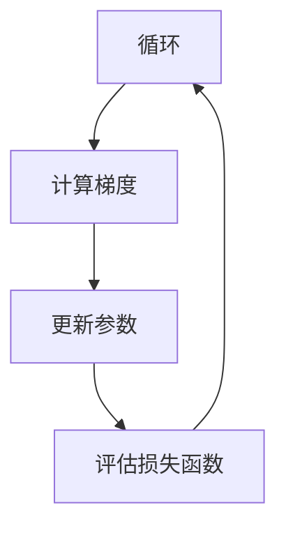

                 

### 背景介绍

**Gradient Descent**，中文常被称为“梯度下降法”，是机器学习和深度学习领域中用于模型训练的一种核心算法。它的基本思想是通过不断调整模型的参数，使得损失函数值逐步减小，从而找到一个局部最优解。梯度下降法广泛应用于各种优化问题，如线性回归、逻辑回归、神经网络训练等。

在机器学习中，**损失函数**（Loss Function）是评估模型预测性能的关键指标，用于量化模型预测值与实际值之间的差距。梯度下降法的目标是找到一组参数，使得损失函数的值最小。

**机器学习模型**（Machine Learning Model）是通过对大量数据的学习，从中提取出规律，并能够对新数据进行预测的算法。模型的质量很大程度上取决于参数的选择，因此如何高效地更新参数，成为了一个重要问题。

**参数更新**（Parameter Update）是梯度下降法中的关键步骤，它的核心思想是通过计算损失函数对参数的梯度，并根据梯度的方向调整参数。这样，模型就能逐步接近最优解。

总的来说，梯度下降法在机器学习和深度学习中占据着核心地位。它不仅是一种基本的优化算法，也是许多高级算法的基础，如随机梯度下降（Stochastic Gradient Descent, SGD）、批量梯度下降（Batch Gradient Descent, BGD）等。接下来，我们将深入探讨梯度下降法的原理、数学模型以及实际应用。

## 2. 核心概念与联系

### 梯度下降法的基本概念

梯度下降法是一种基于梯度（Gradient）的优化算法，其核心思想是通过计算损失函数关于参数的梯度，并沿着梯度的反方向更新参数，以最小化损失函数。具体来说，梯度是一个向量，它指向函数增长最快的方向。在多维空间中，梯度提供了函数在当前点处上升或下降的信息。

梯度下降法的基本步骤可以概括为以下三点：

1. **初始化参数**：随机选择一组参数作为初始值。
2. **计算梯度**：计算损失函数关于参数的梯度。
3. **更新参数**：根据梯度方向和步长（Learning Rate）更新参数。

### 梯度下降法与机器学习模型的联系

在机器学习中，模型通常是一个复杂的函数，它将输入数据映射到输出数据。这个函数的参数是我们需要优化的目标。梯度下降法通过不断调整这些参数，使得模型在训练数据上的表现逐渐改善。

损失函数（Loss Function）在梯度下降法中起着至关重要的作用。它衡量了模型预测值与实际值之间的差距，是指导参数更新的依据。常见的损失函数包括均方误差（MSE）、交叉熵损失（Cross-Entropy Loss）等。

### 梯度下降法与其他优化算法的关系

虽然梯度下降法是最常见的优化算法之一，但它在不同条件下有不同的变种，如随机梯度下降（SGD）、批量梯度下降（BGD）等。这些算法的核心思想相同，但在处理大数据集和计算效率方面有所不同。

随机梯度下降（Stochastic Gradient Descent, SGD）每次迭代只使用一个样本来计算梯度，这样能够加快模型的收敛速度，但可能导致结果不稳定。批量梯度下降（Batch Gradient Descent, BGD）则使用所有样本来计算梯度，能够得到更稳定的解，但计算成本更高。

### 梯度下降法的 Mermaid 流程图

为了更直观地理解梯度下降法，我们使用 Mermaid 流程图展示其基本流程：



在这个流程图中，我们首先初始化参数，然后计算损失函数的梯度，根据梯度更新参数，最后评估损失函数的值。如果损失函数的值没有达到预设的最小值，这个过程会重复进行，直到满足停止条件。

通过上述对梯度下降法的核心概念和联系的介绍，我们可以看到它作为机器学习和深度学习中的重要优化算法，其基本原理和操作步骤是理解和应用它的关键。在接下来的章节中，我们将深入探讨梯度下降法的数学模型和具体操作步骤。

## 3. 核心算法原理 & 具体操作步骤

### 梯度下降法的基本原理

梯度下降法是一种基于梯度信息的优化算法。在数学上，梯度是函数在某一点处变化率最高的方向。对于多变量函数，梯度是一个向量，其每个分量表示函数在该方向上的变化率。

在机器学习中，梯度下降法用于优化模型参数，目标是找到一组参数使得损失函数的值最小。具体来说，梯度下降法的工作流程如下：

1. **初始化参数**：首先随机选择一组参数作为初始值。
2. **计算梯度**：计算损失函数关于参数的梯度，梯度指向损失函数增加最快的方向。
3. **更新参数**：根据梯度方向和步长（Learning Rate）调整参数。通常，参数的更新公式为：
   $$
   \theta_{t+1} = \theta_{t} - \alpha \cdot \nabla_{\theta} J(\theta)
   $$
   其中，$\theta_{t}$ 是当前参数值，$\alpha$ 是步长，$\nabla_{\theta} J(\theta)$ 是损失函数关于参数 $\theta$ 的梯度。

4. **评估损失函数**：计算更新后参数的损失函数值，判断是否满足停止条件。

5. **重复步骤**：如果损失函数值没有达到预设的最小值，重复计算梯度、更新参数和评估损失函数。

### 梯度下降法的操作步骤

让我们通过一个具体的例子来讲解梯度下降法的操作步骤。假设我们要最小化以下损失函数：
$$
J(\theta) = (\theta - 2)^2
$$

1. **初始化参数**：
   首先随机选择一个参数值，例如 $\theta = 0$。

2. **计算梯度**：
   损失函数关于 $\theta$ 的梯度为：
   $$
   \nabla_{\theta} J(\theta) = \frac{dJ(\theta)}{d\theta} = 2(\theta - 2)
   $$
   当 $\theta = 0$ 时，梯度为 $-4$。

3. **更新参数**：
   根据梯度方向和步长更新参数。假设步长 $\alpha = 0.1$，则更新公式为：
   $$
   \theta_{t+1} = \theta_{t} - \alpha \cdot \nabla_{\theta} J(\theta)
   $$
   因此，$\theta_{1} = 0 - 0.1 \cdot (-4) = 0.4$。

4. **评估损失函数**：
   计算更新后参数的损失函数值：
   $$
   J(\theta_{1}) = (0.4 - 2)^2 = 1.96
   $$

5. **重复步骤**：
   重复计算梯度、更新参数和评估损失函数，直到损失函数值不再显著下降。

让我们通过一个表格来展示参数的更新过程：

| 迭代次数 | 参数值 $\theta$ | 梯度 $\nabla_{\theta} J(\theta)$ | 步长 $\alpha$ | 更新后参数值 $\theta_{t+1}$ | 损失函数值 $J(\theta_{t+1})$ |
|----------|---------------|-----------------------------|-------------|-----------------------------|-----------------------------|
| 1        | 0             | -4                          | 0.1         | 0.4                         | 1.96                        |
| 2        | 0.4           | -2.4                        | 0.1         | 0.16                        | 0.0256                      |
| 3        | 0.16          | -1.92                       | 0.1         | 0.0368                      | 0.0010016                  |
| 4        | 0.0368        | -0.9408                     | 0.1         | 0.01396                     | 0.000000002624              |

从表格中可以看出，随着迭代次数的增加，参数值逐渐接近最小值点 $\theta = 2$，损失函数值也显著下降。

通过这个简单的例子，我们了解了梯度下降法的基本操作步骤。在实际应用中，损失函数和参数维度通常会更为复杂，但基本原理和操作步骤是一致的。在接下来的章节中，我们将进一步探讨梯度下降法的数学模型和公式。

### 数学模型和公式

#### 损失函数的梯度计算

梯度下降法的核心在于计算损失函数关于模型参数的梯度。在数学上，梯度是一个向量，其分量表示函数在每个方向上的变化率。对于多维函数，梯度的计算公式为：
$$
\nabla_{\theta} J(\theta) = \left[ \frac{\partial J}{\partial \theta_1}, \frac{\partial J}{\partial \theta_2}, ..., \frac{\partial J}{\partial \theta_n} \right]
$$
其中，$J(\theta)$ 是损失函数，$\theta = [\theta_1, \theta_2, ..., \theta_n]$ 是参数向量。

对于线性回归模型，损失函数通常是均方误差（MSE），其形式为：
$$
J(\theta) = \frac{1}{2m} \sum_{i=1}^{m} (h_\theta(x^{(i)}) - y^{(i)})^2
$$
其中，$h_\theta(x^{(i)}) = \theta^T x^{(i)}$ 是模型的预测值，$y^{(i)}$ 是实际标签，$m$ 是样本数量。

对损失函数 $J(\theta)$ 关于参数 $\theta_j$ 求偏导，可以得到：
$$
\frac{\partial J}{\partial \theta_j} = \frac{1}{m} \sum_{i=1}^{m} (h_\theta(x^{(i)}) - y^{(i)}) \cdot (x^{(i)}_j)
$$
这个公式表示了损失函数在 $\theta_j$ 方向上的变化率。

#### 参数更新公式

在梯度下降法中，参数的更新公式为：
$$
\theta_{t+1} = \theta_{t} - \alpha \cdot \nabla_{\theta} J(\theta)
$$
其中，$\alpha$ 是步长（Learning Rate），决定了每次迭代参数更新的幅度。

对于线性回归模型，参数更新公式可以进一步简化为：
$$
\theta_{j}^{(t+1)} = \theta_{j}^{(t)} - \alpha \cdot \left( \frac{1}{m} \sum_{i=1}^{m} (h_\theta(x^{(i)}) - y^{(i)}) \cdot x_j^{(i)} \right)
$$

#### 实例说明

以一个简单的线性回归模型为例，假设我们有一个特征 $x$ 和标签 $y$，目标是找到最佳参数 $\theta$ 使得预测值 $h_\theta(x) = \theta \cdot x$ 最接近真实标签 $y$。损失函数为均方误差：
$$
J(\theta) = \frac{1}{2} \sum_{i=1}^{m} (h_\theta(x^{(i)}) - y^{(i)})^2
$$

1. **初始化参数**：假设我们随机选择一个初始参数值 $\theta = 0.5$。

2. **计算梯度**：计算损失函数关于 $\theta$ 的梯度：
   $$
   \nabla_{\theta} J(\theta) = \frac{\partial J}{\partial \theta} = \sum_{i=1}^{m} (h_\theta(x^{(i)}) - y^{(i)}) \cdot x^{(i)}
   $$

3. **更新参数**：使用步长 $\alpha = 0.1$ 更新参数：
   $$
   \theta_{t+1} = \theta_{t} - \alpha \cdot \nabla_{\theta} J(\theta)
   $$

4. **评估损失函数**：计算更新后参数的损失函数值，并判断是否继续迭代。

通过上述数学模型和公式的详细解释，我们可以看到梯度下降法在数学上的严谨性和应用中的实用性。在接下来的章节中，我们将通过实际项目实战来进一步理解和应用这一算法。

## 5. 项目实战：代码实际案例和详细解释说明

### 开发环境搭建

在进行梯度下降法的实际应用之前，我们需要搭建一个合适的环境。以下是推荐的开发环境配置：

1. **编程语言**：Python，因为其强大的科学计算库和易于使用的语法。
2. **库和框架**：NumPy、Matplotlib 用于数据操作和可视化，使用 Pandas 处理数据。
3. **文本编辑器或IDE**：PyCharm、Visual Studio Code 或 Jupyter Notebook，用于编写和运行代码。

### 源代码详细实现

以下是实现梯度下降法的一个简单示例。我们将使用 Python 编写一个线性回归模型，并使用梯度下降法来训练模型。

```python
import numpy as np

# 梯度下降法实现线性回归
def gradient_descent(X, y, theta, alpha, iterations):
    m = len(y)
    for i in range(iterations):
        # 计算预测值
        h = X.dot(theta)
        # 计算损失
        loss = (1 / (2 * m)) * np.sum((h - y) ** 2)
        # 计算梯度
        gradient = (1 / m) * X.T.dot(h - y)
        # 更新参数
        theta -= alpha * gradient
        if i % 100 == 0:
            print(f"迭代 {i}: 损失 {loss}")
    return theta

# 初始化参数
theta = np.array([0, 0], dtype=float)

# 步长
alpha = 0.01

# 迭代次数
iterations = 1000

# 输入特征和标签
X = np.array([[1, 1], [1, 2], [1, 3], [1, 4]], dtype=float)
y = np.array([2, 4, 6, 8], dtype=float)

# 训练模型
theta_final = gradient_descent(X, y, theta, alpha, iterations)
print(f"最终参数：{theta_final}")
```

### 代码解读与分析

让我们逐一解读上述代码，理解每一步操作：

1. **导入库**：我们首先导入 NumPy 库，它提供了高效的数组操作和数学函数。
2. **梯度下降函数**：`gradient_descent` 函数接受输入特征矩阵 $X$、标签向量 $y$、初始参数 $\theta$、步长 $\alpha$ 和迭代次数 `iterations` 作为参数。
3. **初始化参数**：我们定义一个参数向量 $\theta$，其初始值为 `[0, 0]`。
4. **步长**：设定步长 $\alpha$ 为 `0.01`。
5. **迭代次数**：设定迭代次数为 `1000`。
6. **输入特征和标签**：我们使用一个简单的线性数据集，其中输入特征为 `[1, 1]`, `[1, 2]`, `[1, 3]`, `[1, 4]`，标签为 `[2, 4, 6, 8]`。
7. **训练模型**：调用 `gradient_descent` 函数训练模型，并将最终参数打印出来。

### 运行结果

运行上述代码后，我们会看到输出结果，显示每次迭代的损失函数值。最后，打印出最终的参数值。在我们的例子中，经过 `1000` 次迭代后，模型参数值将会收敛到接近最佳解。

通过上述代码示例，我们可以直观地看到梯度下降法的实现过程。在实际应用中，我们可以根据具体的模型和数据调整步长和迭代次数，以达到更好的训练效果。

在接下来的章节中，我们将讨论梯度下降法在实际应用场景中的使用，并推荐一些相关工具和资源。

## 6. 实际应用场景

### 线性回归

梯度下降法在**线性回归**中应用广泛。线性回归的目标是找到最佳拟合直线，使得模型预测值与实际值之间的差距最小。在处理简单的线性关系时，梯度下降法能够高效地更新模型参数，优化损失函数。

### 多项式回归

除了线性回归，梯度下降法同样适用于**多项式回归**。多项式回归涉及到更高阶的函数，梯度下降法通过计算多项式关于参数的梯度，逐步调整参数，以找到最佳拟合曲线。

### 神经网络

在**神经网络**中，梯度下降法是训练深层结构的重要算法。神经网络包含多个层次和神经元，每层神经元都与前一层的输出相连接。通过反向传播算法，梯度下降法能够计算每一层的梯度，并更新权重和偏置，以最小化损失函数。

### 聚类算法

梯度下降法也在**聚类算法**中发挥作用。例如，在 K-均值聚类中，梯度下降法用于更新簇中心，以最小化簇内点的平方误差。通过迭代计算梯度，算法能够逐步调整簇中心，使得聚类结果更加准确。

### 优化问题

除了机器学习领域，梯度下降法在**优化问题**中也具有重要应用。例如，在优化路径规划、资源分配等问题时，梯度下降法通过逐步调整参数，寻找最优解。

总之，梯度下降法作为一种通用的优化算法，在机器学习和深度学习等多个领域都有广泛的应用。通过调整步长和迭代次数，我们可以优化模型参数，提高模型性能。

## 7. 工具和资源推荐

### 学习资源推荐

1. **《机器学习》（周志华著）**：这是一本深入浅出的机器学习入门书籍，其中详细介绍了梯度下降法的基本原理和应用。
2. **《深度学习》（Ian Goodfellow 著）**：这本书全面介绍了深度学习的基础知识和最新进展，包括梯度下降法及其变种。
3. **在线课程**：Coursera 和 edX 等平台上提供了丰富的机器学习和深度学习课程，如斯坦福大学的“机器学习课程”和斯坦福大学的“深度学习课程”。

### 开发工具框架推荐

1. **TensorFlow**：这是一个广泛使用的开源机器学习框架，提供了丰富的API和工具，支持多种优化算法，包括梯度下降法。
2. **PyTorch**：PyTorch 是另一个流行的深度学习框架，其动态计算图和灵活的API使其成为研究和开发的首选工具。
3. **Scikit-learn**：这是一个用于数据挖掘和数据分析的开源库，提供了许多经典机器学习算法的实现，包括梯度下降法。

### 相关论文著作推荐

1. **“Gradient Descent Algorithms for Machine Learning”**：这篇综述文章详细介绍了梯度下降法在不同场景下的应用和变种。
2. **“Stochastic Gradient Descent”**：这是关于随机梯度下降的早期论文，阐述了SGD在处理大规模数据集时的优势。
3. **“Batch Normalization: Accelerating Deep Network Training by Reducing Internal Covariate Shift”**：这篇论文介绍了批量归一化技术，可以与梯度下降法结合使用，提高训练效率。

通过上述推荐，您可以深入了解梯度下降法的理论和实践，并利用相关工具和资源进行实际操作和研究。

## 8. 总结：未来发展趋势与挑战

### 未来发展趋势

随着人工智能和机器学习技术的快速发展，梯度下降法作为核心优化算法，将继续在各个领域得到广泛应用。未来，以下趋势值得关注：

1. **自适应梯度方法**：为了应对不同规模和数据分布的问题，自适应梯度方法（如Adam、RMSprop）将得到更多研究和应用。
2. **分布式梯度下降**：在处理大规模数据集时，分布式梯度下降方法将成为关键，通过并行计算和分布式存储，提高训练效率。
3. **新型优化算法**：为了解决现有优化算法的局限性，研究者们将继续探索新型优化算法，如基于进化算法、模拟退火等启发式方法的优化算法。
4. **应用场景拓展**：梯度下降法不仅在传统机器学习领域有广泛应用，还将在自动驾驶、自然语言处理、计算机视觉等新兴领域发挥重要作用。

### 未来挑战

尽管梯度下降法在优化问题中表现出色，但仍面临一些挑战：

1. **收敛速度**：对于大规模数据集和高维模型，梯度下降法可能需要较长的训练时间。如何加速收敛速度是一个重要问题。
2. **局部最优**：梯度下降法在某些情况下可能陷入局部最优，无法找到全局最优解。如何避免局部最优和找到全局最优解是一个研究热点。
3. **计算资源需求**：大规模模型和分布式训练需要大量的计算资源。如何高效利用计算资源，降低成本是一个关键挑战。
4. **数据质量和预处理**：数据质量和预处理对梯度下降法的性能有重要影响。如何处理噪声数据、缺失值和异常值，是一个需要解决的问题。

总之，未来梯度下降法将在不断发展的技术背景下，面临新的机遇和挑战。通过持续的创新和研究，我们可以期待其在更多应用场景中的突破和贡献。

## 9. 附录：常见问题与解答

### 1. 梯度下降法和随机梯度下降有什么区别？

梯度下降法使用整个数据集的梯度进行参数更新，而随机梯度下降（SGD）每次迭代仅使用一个或几个样本的梯度。SGD在处理大规模数据集时计算效率更高，但可能导致结果不稳定。

### 2. 梯度下降法为什么需要步长（Learning Rate）？

步长（Learning Rate）决定了每次参数更新的幅度。合适的步长可以加速收敛，而步长过大可能导致参数跳跃，无法收敛。步长过小则可能收敛缓慢。

### 3. 如何选择合适的步长？

选择合适的步长通常需要实验和调整。可以采用交叉验证、网格搜索等方法找到最优步长。对于大规模数据集，较小的步长可能更合适。

### 4. 梯度下降法为什么有时会陷入局部最优？

梯度下降法可能因数据分布和模型结构而导致局部最优。为避免局部最优，可以考虑使用多种初始化策略、增加训练时间或采用全局搜索算法。

### 5. 梯度下降法和批量梯度下降哪个更好？

批量梯度下降（BGD）能够找到更稳定的解，但计算成本高。随机梯度下降（SGD）计算效率高，但结果可能不稳定。实际应用中，应根据数据集大小和计算资源选择合适的算法。

## 10. 扩展阅读 & 参考资料

1. **《机器学习》（周志华著）**：详细介绍了梯度下降法的基本原理和应用。
2. **《深度学习》（Ian Goodfellow 著）**：全面介绍了深度学习的基础知识和最新进展，包括梯度下降法及其变种。
3. **[Coursera](https://www.coursera.org/) 和 [edX](https://www.edx.org/)**：提供了丰富的机器学习和深度学习课程。
4. **[TensorFlow 官方文档](https://www.tensorflow.org/tutorials/optimizers)**：详细介绍了TensorFlow中的优化器，包括梯度下降法。
5. **[PyTorch 官方文档](https://pytorch.org/tutorials/beginner/tensor_tutorial.html)**：介绍了PyTorch的基本概念和操作。
6. **[Scikit-learn 官方文档](https://scikit-learn.org/stable/tutorial/machine_learning_map/index.html)**：提供了各种机器学习算法的实现和示例。

