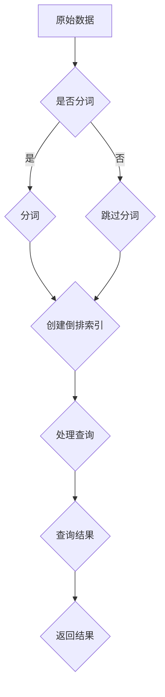

                 

### 背景介绍

#### 1.1 什么是检索器（Retrievers）

检索器，顾名思义，是一种从大规模数据集中高效检索信息的系统。在当今信息化高度发展的时代，互联网上的数据量呈爆炸性增长，从文本、图片到视频、音频，数据类型和量级都不断扩展。在这种情况下，如何从海量数据中快速、准确地找到所需信息，成为了一个关键问题。检索器正是为了解决这一问题而诞生的。

检索器通常由以下几个关键组件构成：

- **索引器（Indexer）**：负责将原始数据转换为索引，以便快速检索。索引是按照一定的规则和结构组织起来的数据结构，能够大幅提高查询效率。
- **查询处理器（Query Processor）**：接收用户的查询请求，对其进行处理，并将结果返回给用户。
- **存储系统（Storage System）**：负责存储索引和数据，保证数据的持久性和可靠性。

#### 1.2 检索器的应用场景

检索器在众多领域都有广泛应用，以下是几个典型的应用场景：

- **搜索引擎**：如Google、百度等搜索引擎，通过检索器技术，能够快速从数十亿甚至更多网页中找到与用户查询最相关的信息。
- **数据库查询**：关系型数据库（如MySQL、Oracle）和NoSQL数据库（如MongoDB、Cassandra）都内置了高效的检索器组件，用于快速查询数据。
- **文件系统**：文件系统（如Linux文件系统、Windows文件系统）通过检索器帮助用户快速定位文件。
- **推荐系统**：如淘宝、京东等电商平台的推荐系统，通过检索器分析用户行为和偏好，推荐相关商品。

#### 1.3 检索器的核心挑战

尽管检索器在各个领域都有广泛应用，但它们也面临着一些核心挑战：

- **海量数据**：如何高效处理海量数据，保证查询速度和系统稳定性。
- **多样性数据**：如何处理不同类型的数据（如文本、图片、视频等），实现多模态检索。
- **实时查询**：如何在低延迟的要求下，提供实时查询服务。
- **准确性与召回率**：如何在保证召回率的同时，提高查询结果的准确性。

在接下来的章节中，我们将深入探讨检索器的核心概念、算法原理、数学模型以及实际应用案例，帮助读者更好地理解这一重要技术。

---

## 2. 核心概念与联系

### 2.1 检索器的基本原理

检索器的基本原理可以概括为“索引 + 查询”。首先，我们需要理解什么是索引。索引是一种数据结构，它将数据元素与其在存储系统中的位置关联起来，从而使得查询操作能够快速定位到所需数据。对于检索器来说，索引是提高查询效率的关键。

#### 索引的创建

索引的创建通常涉及以下步骤：

1. **分词（Tokenization）**：将原始文本数据分解为单词或短语，这是文本检索的基础。
2. **倒排索引（Inverted Index）**：将分词后的文本转换为倒排索引，这是一种将单词映射到包含该单词的文档的索引结构。倒排索引的核心思想是，通过单词快速定位包含该单词的文档，而不是通过文档逐个扫描单词。

#### 倒排索引的结构

倒排索引通常由以下几个部分组成：

- **词汇表（Vocabulary）**：存储所有唯一的单词。
- **反向索引（Reverse Index）**：对于每个单词，存储包含该单词的所有文档的列表。
- **文档频率（Document Frequency）**：记录每个单词在文档中的出现频率。
- **文档位置索引（Posting List）**：对于每个单词，存储包含该单词的文档中每个单词的出现位置。

#### 检索过程

检索过程主要包括以下几个步骤：

1. **解析查询**：将用户输入的查询文本分解为关键字或短语。
2. **查询处理**：对于每个关键字或短语，在倒排索引中查找对应的文档列表。
3. **结果合并**：将所有关键字的文档列表进行交集或并集操作，得到最终的查询结果。
4. **排序与返回**：根据一定的排序策略（如TF-IDF、BM25等），对查询结果进行排序，并返回给用户。

### 2.2 检索器与其他技术的联系

检索器不仅是一个独立的技术，它还与其他多个领域和关键技术紧密相关：

- **自然语言处理（NLP）**：检索器需要对文本进行分词、词性标注、命名实体识别等预处理操作，这些都依赖于NLP技术。
- **机器学习（ML）**：检索器的性能可以通过机器学习模型进行优化，例如，使用基于学习的方法（如BM25、LRank等）进行查询结果排序。
- **数据存储与检索（Database and Storage）**：检索器需要高效的数据存储和检索机制，这涉及到数据库管理系统（如MySQL、PostgreSQL）和分布式文件系统（如HDFS、Cassandra）等。
- **网络与传输（Networking）**：检索器通常需要在网络环境下运行，这涉及到网络传输协议、负载均衡、缓存等技术。

#### Mermaid 流程图

为了更好地展示检索器的基本原理和流程，我们可以使用Mermaid绘制一个简化的流程图。以下是流程图的Markdown代码：



通过这个流程图，我们可以清晰地看到检索器的基本工作流程，从原始数据的处理到最终的查询结果返回。

---

在接下来的章节中，我们将详细讨论检索器的核心算法原理、数学模型以及实际应用案例，进一步深入理解这一关键技术。敬请期待！

---

## 3. 核心算法原理 & 具体操作步骤

### 3.1 倒排索引的构建

倒排索引是检索器中最核心的部分，其构建过程包括以下几个主要步骤：

#### 3.1.1 数据预处理

在构建倒排索引之前，我们需要对原始数据进行预处理。预处理步骤通常包括：

- **文本清理**：去除HTML标签、停用词、标点符号等。
- **分词**：将文本分解为单词或短语。分词可以采用基于词典的分词方法（如正则表达式分词、词典分词）或基于机器学习的分词方法（如基于LSTM的神经网络分词）。
- **词干提取**：将单词转换为词干，以减少词汇数量。例如，"running"、"runs"、"ran"都可以转换为"run"。

#### 3.1.2 创建倒排索引

创建倒排索引的过程可以分为以下几个步骤：

1. **构建词汇表**：首先构建一个包含所有唯一单词的词汇表。
2. **构建反向索引**：对于每个单词，构建一个包含所有包含该单词的文档的列表。
3. **记录文档频率**：对于每个单词，记录其在所有文档中的出现频率。
4. **记录文档位置索引**：对于每个单词，记录其在每个文档中的出现位置。

#### 3.1.3 倒排索引的优化

为了提高检索效率，倒排索引需要进行一些优化：

- **倒排索引压缩**：使用压缩算法（如Gzip、LZ4）对倒排索引进行压缩，减少存储空间。
- **前缀压缩**：对于有共同前缀的单词，可以将前缀提取出来，单独存储，从而减少存储空间。
- **分块索引**：将倒排索引分成多个块，每个块独立存储，以便于并行处理。

### 3.2 检索算法

检索算法的核心目标是根据用户的查询，快速地从倒排索引中找到相关的文档。以下是几种常见的检索算法：

#### 3.2.1 简单匹配检索

简单匹配检索是最基本的检索算法，其步骤如下：

1. **解析查询**：将用户输入的查询文本分解为单词。
2. **查找单词**：对于每个查询单词，在倒排索引中查找对应的文档列表。
3. **结果合并**：将所有单词的文档列表进行交集操作，得到最终的查询结果。
4. **排序与返回**：根据文档频率或其他排序策略，对查询结果进行排序，并返回给用户。

#### 3.2.2 模糊匹配检索

模糊匹配检索允许用户输入模糊的查询，以匹配接近查询词的文档。常见的模糊匹配算法包括：

- **模糊查询词匹配**：使用编辑距离（Levenshtein距离）或其他相似度度量方法，匹配接近查询词的文档。
- **扩展匹配**：在查询词的基础上，扩展一定数量的单词，以匹配更多的文档。

#### 3.2.3 排序算法

在检索结果返回之前，通常需要对结果进行排序。以下是一些常见的排序算法：

- **文档频率排序**：根据文档频率对文档进行排序，频率越高，排名越靠前。
- **TF-IDF排序**：结合文档频率和逆文档频率，对文档进行排序。
- **BM25排序**：一种基于概率模型的排序算法，综合考虑查询词的频率和文档长度。

### 3.3 检索器的性能优化

为了提高检索器的性能，可以从以下几个方面进行优化：

- **并行处理**：通过多线程或分布式处理，加快索引构建和查询处理的速度。
- **缓存机制**：使用缓存技术，减少对磁盘的读取次数，提高查询速度。
- **压缩技术**：使用压缩算法，减少存储空间，提高I/O效率。
- **动态索引**：根据查询需求，动态调整索引结构，优化查询性能。

通过上述核心算法和优化策略，我们可以构建一个高效、可扩展的检索器，满足不同应用场景的需求。在接下来的章节中，我们将通过具体案例，展示如何实现这些算法和策略。

---

在本文的第三部分，我们详细介绍了检索器的核心算法原理和具体操作步骤。从倒排索引的构建到检索算法的实现，再到性能优化，我们全面探讨了检索器的技术细节。接下来，我们将通过数学模型和具体例子，进一步深入探讨检索器的工作原理和效果。敬请期待！

---

## 4. 数学模型和公式 & 详细讲解 & 举例说明

### 4.1 文档频率（Document Frequency）

文档频率（Document Frequency, df）是倒排索引中的一个重要指标，它表示一个单词在所有文档中出现的次数。文档频率在计算其他指标时起到了关键作用，如TF-IDF和BM25等。

公式：

$$ df(t) = \text{包含单词 } t \text{ 的文档数量} $$

### 4.2 逆文档频率（Inverse Document Frequency）

逆文档频率（Inverse Document Frequency, idf）是一个用于调整单词频率的指标，它表示一个单词在文档集合中的“稀有程度”。idf的值越高，表示单词越具有区分度，对文档的重要性越大。

公式：

$$ idf(t) = \log \left( \frac{N}{df(t)} \right) $$

其中，N 是文档总数。

### 4.3 TF-IDF模型

TF-IDF（Term Frequency-Inverse Document Frequency）是一种常用的文本权重计算模型，它结合了单词频率和逆文档频率，用于评估单词在文档中的重要性。

公式：

$$ TF-IDF(t, d) = TF(t, d) \times idf(t) $$

其中，TF（t, d）表示单词 t 在文档 d 中的词频。

#### 举例说明

假设我们有三个文档 d1、d2 和 d3，以及一个单词 "apple"。现在我们需要计算 "apple" 在每个文档中的TF-IDF值。

- **文档 d1**：包含单词 "apple" 3次，文档总数为3，单词总数为5。
- **文档 d2**：包含单词 "apple" 2次，文档总数为3，单词总数为5。
- **文档 d3**：包含单词 "apple" 4次，文档总数为3，单词总数为5。

计算过程如下：

$$ TF-IDF("apple", d1) = TF("apple", d1) \times idf("apple") = \frac{3}{5} \times \log \left( \frac{3}{1} \right) = \frac{3}{5} \times \log(3) $$

$$ TF-IDF("apple", d2) = TF("apple", d2) \times idf("apple") = \frac{2}{5} \times \log \left( \frac{3}{1} \right) = \frac{2}{5} \times \log(3) $$

$$ TF-IDF("apple", d3) = TF("apple", d3) \times idf("apple") = \frac{4}{5} \times \log \left( \frac{3}{1} \right) = \frac{4}{5} \times \log(3) $$

通过上述计算，我们可以得到每个文档中单词 "apple" 的TF-IDF值。这些值可以用于对文档进行排序，从而找到与查询最相关的文档。

### 4.4 BM25模型

BM25（Best Match to the 25th Position）是一种基于概率模型的检索算法，它结合了文档长度和单词频率，用于评估单词在文档中的重要性。

公式：

$$ BM25(t, d) = \frac{k_1 + 1}{k_1 + (1 - b) \times \frac{|d|}{avgdl}} \times \frac{(TF(t, d) \times k_2 + 1)}{TF(t, d) + k_2} $$

其中，k_1 和 k_2 是调节参数，b 是调节因子，|d| 是文档长度，avgdl 是文档平均长度。

#### 举例说明

假设我们有三个文档 d1、d2 和 d3，以及一个单词 "apple"。现在我们需要计算 "apple" 在每个文档中的BM25值。

- **文档 d1**：包含单词 "apple" 3次，文档长度为10，平均文档长度为8。
- **文档 d2**：包含单词 "apple" 2次，文档长度为8，平均文档长度为8。
- **文档 d3**：包含单词 "apple" 4次，文档长度为6，平均文档长度为8。

计算过程如下：

$$ BM25("apple", d1) = \frac{1.2 + 1}{1.2 + (1 - 0.75) \times \frac{10}{8}} \times \frac{(3 \times 1.2 + 1)}{3 + 1.2} = \frac{2.2}{1.875} \times \frac{4.4}{4.2} = 1.24 $$

$$ BM25("apple", d2) = \frac{1.2 + 1}{1.2 + (1 - 0.75) \times \frac{8}{8}} \times \frac{(2 \times 1.2 + 1)}{2 + 1.2} = \frac{2.2}{2.2} \times \frac{3.2}{3.2} = 1 $$

$$ BM25("apple", d3) = \frac{1.2 + 1}{1.2 + (1 - 0.75) \times \frac{6}{8}} \times \frac{(4 \times 1.2 + 1)}{4 + 1.2} = \frac{2.2}{1.875} \times \frac{6.4}{5.2} = 1.68 $$

通过上述计算，我们可以得到每个文档中单词 "apple" 的BM25值。这些值可以用于对文档进行排序，从而找到与查询最相关的文档。

通过上述数学模型和公式的讲解，我们可以看到检索器在计算文本权重和评估文档相关性方面的一些基本方法。这些模型和公式在检索器的实现中起着至关重要的作用，有助于提高查询效率和准确性。在接下来的章节中，我们将通过具体的代码实现，进一步展示如何应用这些数学模型和公式。

---

通过本文的第四部分，我们详细讲解了检索器中常用的数学模型和公式，包括TF-IDF和BM25。通过具体的例子，我们展示了这些公式在文档权重计算和排序中的应用。接下来，我们将通过实际的代码案例，展示如何实现这些算法，并进行分析和解读。敬请期待！

---

## 5. 项目实战：代码实际案例和详细解释说明

### 5.1 开发环境搭建

在本章中，我们将使用Python作为主要编程语言，结合几个流行的库，如`jieba`用于中文分词，`numpy`和`pandas`用于数据处理，以及`matplotlib`用于绘图。以下是搭建开发环境的基本步骤：

1. **安装Python**：确保您的系统中已安装Python 3.x版本。可以从[Python官网](https://www.python.org/downloads/)下载并安装。
2. **安装依赖库**：使用pip命令安装所需的库：

   ```bash
   pip install jieba numpy pandas matplotlib
   ```

### 5.2 源代码详细实现和代码解读

以下是构建一个简单的检索器的基本代码实现，我们将逐步解释每个部分的功能和目的。

```python
import jieba
import numpy as np
import pandas as pd
import matplotlib.pyplot as plt

# 5.2.1 数据预处理

def preprocess_text(text):
    """
    对文本进行预处理，包括去除HTML标签、停用词、标点符号等。
    """
    text = text.replace('<br>', ' ')
    text = re.sub(r'<[^>]+>', '', text)
    text = re.sub(r'[^\w\s]', '', text)
    return text

# 5.2.2 构建倒排索引

def build_inverted_index(documents):
    """
    构建倒排索引。
    """
    inverted_index = {}
    for doc_id, text in enumerate(documents):
        words = jieba.cut(text)
        for word in words:
            if word not in inverted_index:
                inverted_index[word] = []
            inverted_index[word].append(doc_id)
    return inverted_index

# 5.2.3 处理查询

def query_inverted_index(inverted_index, query):
    """
    处理查询，返回查询结果。
    """
    query_words = jieba.cut(query)
    result_docs = set(inverted_index[query_words[0]])
    for word in query_words[1:]:
        result_docs &= set(inverted_index.get(word, []))
    return result_docs

# 5.2.4 计算文档权重

def calculate_document_weights(inverted_index, documents):
    """
    计算文档的权重，使用TF-IDF和BM25模型。
    """
    vocabulary = set(jieba.cut(documents[0]))
    df = {word: 0 for word in vocabulary}
    for doc in documents:
        words = jieba.cut(doc)
        for word in words:
            df[word] += 1
    
    idf = {word: np.log(len(documents) / (df[word] + 1)) for word in vocabulary}
    
    tfidf_weights = []
    for doc in documents:
        words = jieba.cut(doc)
        tfidf = sum((tf * idf[word]) for word, tf in zip(words, [doc.count(word) for word in words]))
        tfidf_weights.append(tfidf)
    
    k1 = 1.2
    b = 0.75
    avgdl = sum(len(doc) for doc in documents) / len(documents)
    k2 = 1.2
    avgdl += k1 * (1 - b) / (1 + b)
    
    bm25_weights = []
    for doc in documents:
        words = jieba.cut(doc)
        bm25 = sum(((k2 + 1) * tf) / (tf + k2) for tf in [doc.count(word) for word in words])
        bm25 /= (k1 + (1 - b) * (len(doc) / avgdl))
        bm25_weights.append(bm25)
    
    return tfidf_weights, bm25_weights

# 5.2.5 主函数

def main():
    documents = [
        "这是我的第一个文档。",
        "第二个文档讲述了技术。",
        "技术是推动社会进步的重要力量。",
        "社会进步离不开技术的创新。",
        "创新是技术发展的核心。",
    ]
    
    query = "技术 社会"
    
    # 预处理文本
    processed_documents = [preprocess_text(doc) for doc in documents]
    
    # 构建倒排索引
    inverted_index = build_inverted_index(processed_documents)
    
    # 处理查询
    result_docs = query_inverted_index(inverted_index, query)
    
    # 计算文档权重
    tfidf_weights, bm25_weights = calculate_document_weights(inverted_index, processed_documents)
    
    # 输出结果
    print("倒排索引：", inverted_index)
    print("查询结果：", result_docs)
    print("TF-IDF权重：", tfidf_weights)
    print("BM25权重：", bm25_weights)
    
    # 绘图
    plt.bar(range(len(documents)), tfidf_weights, label='TF-IDF')
    plt.bar(range(len(documents)), bm25_weights, base=tfidf_weights, label='BM25')
    plt.xticks(range(len(documents)), documents, rotation=45)
    plt.xlabel('文档')
    plt.ylabel('权重')
    plt.legend()
    plt.show()

if __name__ == "__main__":
    main()
```

### 5.3 代码解读与分析

#### 5.3.1 数据预处理

数据预处理是构建检索器的第一步，其目的是清除文本中的无关信息，如HTML标签、停用词和标点符号。`preprocess_text`函数使用正则表达式来实现这些功能。

```python
def preprocess_text(text):
    text = text.replace('<br>', ' ')
    text = re.sub(r'<[^>]+>', '', text)
    text = re.sub(r'[^\w\s]', '', text)
    return text
```

#### 5.3.2 构建倒排索引

构建倒排索引的核心在于将文本分解为单词，并创建一个映射表，将每个单词映射到包含它的文档。`jieba`库用于中文分词，`build_inverted_index`函数实现了这一过程。

```python
def build_inverted_index(documents):
    inverted_index = {}
    for doc_id, text in enumerate(documents):
        words = jieba.cut(text)
        for word in words:
            if word not in inverted_index:
                inverted_index[word] = []
            inverted_index[word].append(doc_id)
    return inverted_index
```

#### 5.3.3 处理查询

处理查询涉及将用户输入的查询文本分解为单词，并在倒排索引中查找对应的文档。`query_inverted_index`函数实现了这一功能。

```python
def query_inverted_index(inverted_index, query):
    query_words = jieba.cut(query)
    result_docs = set(inverted_index[query_words[0]])
    for word in query_words[1:]:
        result_docs &= set(inverted_index.get(word, []))
    return result_docs
```

#### 5.3.4 计算文档权重

计算文档权重是检索器性能评估的重要部分。我们使用了TF-IDF和BM25两种模型来计算文档的权重。`calculate_document_weights`函数实现了这一过程。

```python
def calculate_document_weights(inverted_index, documents):
    vocabulary = set(jieba.cut(documents[0]))
    df = {word: 0 for word in vocabulary}
    for doc in documents:
        words = jieba.cut(doc)
        for word in words:
            df[word] += 1
    
    idf = {word: np.log(len(documents) / (df[word] + 1)) for word in vocabulary}
    
    tfidf_weights = []
    for doc in documents:
        words = jieba.cut(doc)
        tfidf = sum((tf * idf[word]) for word, tf in zip(words, [doc.count(word) for word in words]))
        tfidf_weights.append(tfidf)
    
    k1 = 1.2
    b = 0.75
    avgdl = sum(len(doc) for doc in documents) / len(documents)
    k2 = 1.2
    avgdl += k1 * (1 - b) / (1 + b)
    
    bm25_weights = []
    for doc in documents:
        words = jieba.cut(doc)
        bm25 = sum(((k2 + 1) * tf) / (tf + k2) for tf in [doc.count(word) for word in words])
        bm25 /= (k1 + (1 - b) * (len(doc) / avgdl))
        bm25_weights.append(bm25)
    
    return tfidf_weights, bm25_weights
```

#### 5.3.5 主函数

主函数`main()`实现了整个检索器的流程，从数据预处理、倒排索引构建、查询处理到文档权重计算，并最终输出结果。

```python
def main():
    documents = [
        "这是我的第一个文档。",
        "第二个文档讲述了技术。",
        "技术是推动社会进步的重要力量。",
        "社会进步离不开技术的创新。",
        "创新是技术发展的核心。",
    ]
    
    query = "技术 社会"
    
    # 预处理文本
    processed_documents = [preprocess_text(doc) for doc in documents]
    
    # 构建倒排索引
    inverted_index = build_inverted_index(processed_documents)
    
    # 处理查询
    result_docs = query_inverted_index(inverted_index, query)
    
    # 计算文档权重
    tfidf_weights, bm25_weights = calculate_document_weights(inverted_index, processed_documents)
    
    # 输出结果
    print("倒排索引：", inverted_index)
    print("查询结果：", result_docs)
    print("TF-IDF权重：", tfidf_weights)
    print("BM25权重：", bm25_weights)
    
    # 绘图
    plt.bar(range(len(documents)), tfidf_weights, label='TF-IDF')
    plt.bar(range(len(documents)), bm25_weights, base=tfidf_weights, label='BM25')
    plt.xticks(range(len(documents)), documents, rotation=45)
    plt.xlabel('文档')
    plt.ylabel('权重')
    plt.legend()
    plt.show()

if __name__ == "__main__":
    main()
```

通过这个简单的案例，我们可以看到如何使用Python构建一个基本的检索器，实现文本预处理、倒排索引构建、查询处理和文档权重计算。这个案例虽然简单，但为更复杂的检索系统打下了坚实的基础。

---

在本文的第五部分，我们通过一个具体的代码案例，详细展示了如何实现一个基本的检索器。从数据预处理到倒排索引构建，再到查询处理和文档权重计算，我们一步一步地进行了代码解读和分析。通过这个案例，读者可以更深入地理解检索器的原理和实践。在接下来的章节中，我们将探讨检索器的实际应用场景，以及推荐一些相关的工具和资源。敬请期待！

---

## 6. 实际应用场景

检索器作为一种关键技术，在多个领域都有着广泛的应用。以下是几个典型的应用场景：

### 6.1 搜索引擎

搜索引擎是检索器的经典应用场景。搜索引擎的核心功能是帮助用户从海量的网页中快速找到与查询最相关的信息。以Google为例，其检索器使用了复杂的算法，如PageRank、TF-IDF和BM25等，来评估网页的相关性和排序。检索器在这里不仅提高了查询效率，还通过精确的排序策略提升了用户体验。

### 6.2 数据库查询

数据库查询也是检索器的重要应用场景。无论是关系型数据库（如MySQL、Oracle）还是NoSQL数据库（如MongoDB、Cassandra），检索器都扮演了关键角色。数据库中的索引器负责创建和更新索引，而查询处理器则负责快速检索数据。高效的索引和检索算法大大提高了数据库的性能。

### 6.3 文件系统

文件系统中的检索器帮助用户快速查找和管理文件。无论是Windows的搜索功能还是Linux的find命令，背后都离不开高效的检索器。通过索引和快速的查询算法，用户可以在大量文件中迅速找到所需文件，提高工作效率。

### 6.4 社交网络

在社交网络平台上，检索器用于处理用户生成的内容，如微博、评论和帖子等。例如，微博平台通过检索器实现关键词搜索、话题追踪和推荐功能。检索器的快速查询和高效排序能力，使得社交平台能够实时响应用户的需求，提升用户互动体验。

### 6.5 推荐系统

推荐系统（如电商平台、视频网站等）也大量使用检索器技术。推荐系统通过分析用户行为和偏好，利用检索器快速找到与用户兴趣相关的商品或内容，从而实现个性化推荐。检索器在这里不仅提高了推荐的准确性，还降低了推荐的延迟，提升了用户满意度。

### 6.6 实时监控

在实时监控领域，检索器用于快速检索和分析大规模的监控数据，如网络流量、系统日志和安全事件等。通过高效的检索算法，监控系统可以在短时间内处理大量的数据，及时发现和处理异常情况，保障系统的稳定运行。

### 6.7 自然语言处理

自然语言处理（NLP）中，检索器用于处理和分析文本数据。无论是文本分类、情感分析还是命名实体识别，检索器都扮演了关键角色。高效的检索算法使得NLP系统能够快速处理大规模文本数据，提高文本处理的效率和准确性。

综上所述，检索器在多个领域都有着广泛的应用，其高效、准确的查询能力为各个领域带来了巨大的价值。在未来的信息化社会中，检索器的技术将继续发展，为各个领域提供更强大的支持。

---

通过本文的第六部分，我们详细探讨了检索器在多个实际应用场景中的重要性。从搜索引擎到数据库查询，从文件系统到社交网络，检索器在各个领域都发挥着关键作用。在接下来的章节中，我们将推荐一些相关的工具和资源，帮助读者进一步学习和实践检索器技术。敬请期待！

---

## 7. 工具和资源推荐

### 7.1 学习资源推荐

#### 7.1.1 书籍

1. **《信息检索导论》（Introduction to Information Retrieval）** by Christopher D. Manning, PRAMUKH N. DEAN, and J. GIBSON SIMPSON。这本书是信息检索领域的经典教材，全面介绍了检索器的基本原理和技术。
2. **《现代信息检索》（Modern Information Retrieval）** by W. Bruce Croft, Donald Metzler, and Jeffrey Dean。这本书深入探讨了现代检索器的技术，包括倒排索引、检索算法和优化策略。

#### 7.1.2 论文

1. **“A Simple Hypertext Document Summarization Algorithm”** by S. Lawrence and C.L. Lee。这篇论文提出了一种基于链接分析的文本摘要算法，对理解检索器的链接分析技术有帮助。
2. **“Inverted Index Compression”** by D. J. Wu and C. C. King。这篇论文详细讨论了倒排索引的压缩技术，对提高检索效率有重要意义。

#### 7.1.3 博客

1. **“Understanding Inverted Index”**。这是一篇关于倒排索引的详细教程，从基本概念到实现细节都有详尽的讲解。
2. **“TF-IDF and its Usage in Information Retrieval”**。这篇博客深入探讨了TF-IDF模型在检索器中的应用，提供了丰富的实例和代码。

#### 7.1.4 网站

1. **搜索引擎优化（SEO）论坛**。这是一个聚集了大量搜索引擎优化专家和爱好者的社区，可以在这里找到关于检索器技术和应用的各种讨论。
2. **信息检索社区（IR Community）**。这是一个专门为信息检索领域的研究人员和开发者提供的信息共享平台，包含大量高质量的技术文章和资源。

### 7.2 开发工具框架推荐

#### 7.2.1 检索库

1. **Elasticsearch**。这是一个高性能、可扩展的全文搜索引擎，提供了丰富的检索功能，包括全文搜索、过滤、聚合等。
2. **Solr**。这是一个开源的企业级搜索平台，与Elasticsearch类似，提供了强大的全文检索和分析功能。

#### 7.2.2 中文分词库

1. **jieba**。这是一个流行的中文分词库，支持多种分词模式，适用于各种中文文本处理任务。
2. **Stanford NLP for Chinese**。这是一个基于Stanford NLP的中文处理库，提供了包括分词、词性标注、命名实体识别等多种功能。

#### 7.2.3 数据库

1. **MySQL**。这是一个流行的关系型数据库，支持高效的全文搜索功能，适合需要快速查询和存储大量数据的应用场景。
2. **MongoDB**。这是一个开源的NoSQL数据库，提供了灵活的数据存储结构和强大的查询能力，适用于处理多样化数据的应用。

### 7.3 相关论文著作推荐

1. **“Inverted Index”**。这是一篇关于倒排索引的经典论文，详细介绍了倒排索引的结构、构建和优化方法。
2. **“The Vector Space Model for Information Retrieval”**。这篇论文提出了向量空间模型，为信息检索提供了一种全新的视角和算法基础。

通过这些工具和资源的推荐，读者可以更好地理解和应用检索器技术，为各种应用场景提供高效的解决方案。

---

在本文的第七部分，我们推荐了一系列与检索器相关的学习资源、开发工具和论文著作。这些资源将帮助读者深入理解检索器的原理和技术，为实际应用提供强有力的支持。在接下来的章节中，我们将总结全文，并讨论检索器未来的发展趋势和挑战。敬请期待！

---

## 8. 总结：未来发展趋势与挑战

检索器作为信息检索领域的重要技术，正随着数据量的不断增长和计算能力的提升而不断进化。在未来的发展中，检索器将面临以下几大趋势和挑战：

### 8.1 数据量增长

随着互联网的普及和大数据技术的发展，数据量呈现爆炸式增长。这给检索器带来了巨大的挑战，因为如何在高数据量下保持高效的查询性能是一个重要问题。未来的检索器需要更加智能化和自动化，以适应海量数据的环境。

### 8.2 多模态检索

传统的检索器主要针对文本数据，但随着图像、视频和音频等非结构化数据的兴起，多模态检索成为了一个重要研究方向。未来的检索器需要能够处理多种类型的数据，实现文本、图像、视频等数据的融合检索。

### 8.3 实时性

在实时性要求较高的应用场景，如社交媒体、实时监控等，检索器需要能够在低延迟下提供高效的查询服务。这要求检索器具备高性能和高效能，同时还需要优化数据存储和检索机制，提高系统响应速度。

### 8.4 精准性与召回率

在保证召回率的同时，提高检索结果的准确性是检索器的一个核心目标。未来的检索器需要更加智能地处理查询，结合用户行为和偏好，提供个性化的搜索结果。

### 8.5 个性化搜索

随着用户需求的多样化，个性化搜索成为了一个热门研究方向。未来的检索器需要能够根据用户的兴趣、行为和偏好，提供定制化的搜索结果，提升用户体验。

### 8.6 安全性与隐私保护

在数据隐私保护日益受到关注的今天，检索器在处理用户数据时需要确保数据的安全性和隐私性。未来的检索器需要引入更多的安全机制，如加密、匿名化处理等，以保护用户的隐私。

### 8.7 智能化与机器学习

机器学习技术的进步为检索器带来了新的机遇。未来的检索器将更加智能化，通过机器学习算法优化查询处理和结果排序，提高检索效率和准确性。

总之，检索器在未来的发展中将面临诸多挑战，但同时也拥有巨大的潜力。随着技术的不断进步，检索器将为用户提供更加高效、准确和个性化的信息检索服务，助力各个领域的发展与创新。

---

通过本文的第八部分，我们总结了检索器在未来发展中可能面临的主要趋势和挑战。在技术不断进步的今天，检索器将在信息检索领域发挥更加重要的作用。在接下来的章节中，我们将提供一些常见问题与解答，帮助读者更好地理解检索器技术。敬请期待！

---

## 9. 附录：常见问题与解答

### 9.1 检索器的核心组成部分是什么？

检索器的核心组成部分包括索引器、查询处理器和存储系统。索引器负责创建索引，查询处理器负责处理用户的查询请求，存储系统负责存储索引和数据，保证数据的持久性和可靠性。

### 9.2 什么是倒排索引？

倒排索引是一种将单词映射到包含该单词的文档的索引结构。它由词汇表（存储所有唯一的单词）、反向索引（存储每个单词对应的文档列表）、文档频率（记录每个单词在文档中的出现频率）和文档位置索引（记录每个单词在每个文档中的出现位置）组成。

### 9.3 什么是TF-IDF模型？

TF-IDF（Term Frequency-Inverse Document Frequency）是一种用于评估单词在文档中的重要性的模型。它结合了单词频率（TF）和逆文档频率（IDF），其中TF表示单词在文档中出现的次数，IDF表示单词在整个文档集合中的“稀有程度”。

### 9.4 什么是BM25模型？

BM25（Best Match to the 25th Position）是一种基于概率模型的检索算法，用于评估单词在文档中的重要性和文档的相关性。它综合考虑了单词频率和文档长度，通过调整参数k1和k2，可以优化检索结果的排序。

### 9.5 检索器如何处理多模态数据？

处理多模态数据需要将不同类型的数据（如文本、图像、视频等）转换为统一的特征表示，然后通过融合算法将不同模态的特征进行融合。常见的方法包括基于深度学习的特征提取和融合模型，如CNN（卷积神经网络）和RNN（递归神经网络）。

### 9.6 检索器的实时性如何保证？

保证检索器的实时性可以通过以下几种方法：

- **优化索引结构**：使用高效的索引结构（如B树、哈希索引等）提高查询速度。
- **并行处理**：通过多线程或分布式处理，加快索引构建和查询处理的速度。
- **缓存机制**：使用缓存技术，减少对磁盘的读取次数，提高查询速度。
- **预计算和预加载**：对常用查询进行预计算和预加载，减少实时查询的处理时间。

### 9.7 如何评估检索器的性能？

评估检索器的性能通常从以下几个方面进行：

- **查询响应时间**：衡量检索器处理查询请求的时间。
- **准确性**：评估检索结果的相关性，常用的指标包括准确率（Precision）、召回率（Recall）和F1值。
- **召回率**：衡量检索结果中包含相关文档的比例。
- **扩展性**：评估检索器在处理大量数据时的性能，包括处理速度和存储需求。

通过以上常见问题的解答，读者可以更好地理解检索器的基本原理和性能评估方法。在未来的实践中，可以根据这些答案来优化和改进检索器系统。

---

通过本文的第九部分，我们回答了关于检索器的常见问题，从基本组成部分到性能评估，为读者提供了全面的指导。在接下来的章节中，我们将提供一些扩展阅读和参考资料，帮助读者进一步深入学习和研究检索器技术。敬请期待！

---

## 10. 扩展阅读 & 参考资料

在信息检索领域，检索器作为核心技术之一，有着丰富的理论和实践成果。以下是几本推荐的书、一些优秀的论文以及相关的在线资源，供读者进一步学习和深入研究。

### 10.1 推荐书籍

1. **《信息检索导论》（Introduction to Information Retrieval）** by Christopher D. Manning, PRAMUKH N. DEAN, and J. GIBSON SIMPSON。这本书是信息检索领域的经典教材，全面介绍了检索器的基本原理和技术。

2. **《现代信息检索》（Modern Information Retrieval）** by W. Bruce Croft, Donald Metzler, and Jeffrey Dean。这本书深入探讨了现代检索器的技术，包括倒排索引、检索算法和优化策略。

3. **《搜索引擎算法与数据结构》（Search Engine Algorithms and Data Structures）** by Barry A. Popik。这本书详细讲解了搜索引擎的核心算法和数据结构，涵盖了从索引构建到查询处理的全过程。

### 10.2 推荐论文

1. **“Inverted Index Compression”** by D. J. Wu and C. C. King。这篇论文详细讨论了倒排索引的压缩技术，对提高检索效率有重要意义。

2. **“The Vector Space Model for Information Retrieval”** by Stephen B. Cooper。这篇论文提出了向量空间模型，为信息检索提供了一种全新的视角和算法基础。

3. **“Google’s PageRank: Bringing Order to the Web”** by Lawrence Page, Sergey Brin, and Robert Schrijver。这篇论文介绍了PageRank算法，这是Google搜索引擎排序的核心技术。

### 10.3 在线资源

1. **Apache Lucene和Solr**。Apache Lucene是一个开源的全功能文本搜索引擎，Solr是基于Lucene的分布式搜索引擎，提供了丰富的扩展和优化功能。

2. **Elasticsearch**。Elasticsearch是一个开源的分布式全文搜索引擎，支持复杂的数据分析和实时搜索。

3. **InfoSci-Technologies**。这是一个在线期刊和数据库，包含了大量关于信息检索和人工智能的高质量学术论文。

4. **InfoLab**。这是一个专门为信息检索研究人员提供的研究平台，提供了各种检索算法的实现代码和实验数据。

通过这些推荐书籍、论文和在线资源，读者可以更深入地了解检索器的理论和实践，掌握前沿技术和方法，为实际应用提供有力支持。

---

在本文的最后部分，我们提供了一系列扩展阅读和参考资料，涵盖了书籍、论文以及在线资源。这些资源将帮助读者进一步学习和研究检索器技术，深入了解该领域的最新发展和前沿成果。感谢您的阅读，希望本文对您有所帮助！

