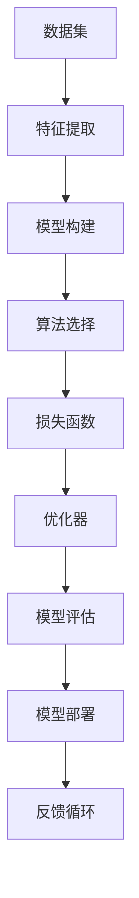

                 

### 背景介绍

在当今这个数据爆炸、技术变革的时代，人工智能（AI）的发展如日中天。无论是机器学习、深度学习，还是自然语言处理，各种AI模型和算法层出不穷，不断推动着科技和产业的前沿。然而，面对这些复杂的技术，如何快速掌握和理解它们，成为了广大技术爱好者和研究者的难题。

本文旨在为您提供一个《模型思维：快速掌握新知识的捷径》。通过模型思维的方式，我们将从概念、原理、算法、实践等多个角度，系统性地解析AI模型，帮助您快速掌握和理解这些复杂的知识。

模型思维，是一种基于模型化思考的方法论。它通过构建、分析、应用模型，帮助我们更好地理解和解决复杂问题。在AI领域，模型思维尤为重要。因为AI本质上就是通过构建数学模型，来模拟、预测和优化现实世界的问题。因此，掌握模型思维，对于深入理解和应用AI技术，具有重要的意义。

本文的结构如下：

1. **核心概念与联系**：我们将介绍AI模型的基本概念，并通过Mermaid流程图，展示模型之间的联系和架构。
2. **核心算法原理 & 具体操作步骤**：我们将深入解析常用的AI算法，包括其原理和操作步骤。
3. **数学模型和公式 & 详细讲解 & 举例说明**：我们将介绍AI模型中的关键数学公式，并进行详细讲解和举例说明。
4. **项目实战：代码实际案例和详细解释说明**：我们将通过实际项目案例，展示AI模型的实际应用，并进行详细解释。
5. **实际应用场景**：我们将探讨AI模型在各个领域的应用，以及其面临的挑战和解决方案。
6. **工具和资源推荐**：我们将推荐一些学习资源和开发工具，帮助您更好地理解和应用AI模型。
7. **总结：未来发展趋势与挑战**：我们将总结AI模型的发展趋势，以及面临的挑战。

通过本文的阅读，您将能够：

- 理解AI模型的基本概念和架构。
- 掌握常用的AI算法和数学模型。
- 学会通过模型思维，快速掌握和理解新知识。
- 了解AI模型在各个领域的应用和挑战。

让我们一起开启这段探索之旅吧！
### 文章标题：模型思维：快速掌握新知识的捷径

关键词：模型思维、AI模型、算法、数学模型、实践、应用

摘要：本文旨在通过模型思维的方式，帮助读者快速掌握和理解AI模型。我们将从概念、原理、算法、实践等多个角度，系统性地解析AI模型，探讨其在各个领域的应用和挑战。通过本文的学习，读者将能够掌握模型思维的方法，更好地理解和应用AI技术。
### 核心概念与联系

在深入探讨AI模型的原理和应用之前，我们首先需要理解一些核心概念，以及它们之间的联系。以下是AI模型中一些关键概念的解释和它们之间的关系，通过Mermaid流程图来展示它们之间的架构和相互作用。

#### 核心概念

1. **数据集**（Dataset）：数据集是AI模型的基石，包含了用于训练、测试和验证的数据。
2. **特征**（Feature）：特征是数据集中的变量，用于描述数据的不同方面。
3. **模型**（Model）：模型是AI算法在数据上的抽象表示，用于预测或分类。
4. **算法**（Algorithm）：算法是模型构建和训练的具体步骤和规则。
5. **损失函数**（Loss Function）：损失函数用于评估模型预测结果与实际结果之间的差异。
6. **优化器**（Optimizer）：优化器用于调整模型参数，以最小化损失函数。

#### Mermaid流程图

以下是AI模型核心概念和联系之间的Mermaid流程图：



**Mermaid流程图说明**：

1. **数据集**：数据集是模型的输入，包含了需要进行训练的数据。
2. **特征提取**：从数据集中提取出有助于模型训练的特征。
3. **模型构建**：根据特征和算法，构建出初始模型。
4. **算法选择**：选择适合特定问题的算法，如线性回归、决策树、神经网络等。
5. **损失函数**：用于评估模型的预测效果，如均方误差、交叉熵等。
6. **优化器**：通过调整模型参数，最小化损失函数。
7. **模型评估**：使用验证集对模型进行评估，判断其性能。
8. **模型部署**：将训练好的模型部署到实际应用中。
9. **反馈循环**：根据实际应用中的反馈，对模型进行调整和优化。

通过这个流程图，我们可以清晰地看到AI模型从数据输入到模型构建、训练、评估、部署的全过程，以及各个步骤之间的联系和相互作用。

#### 关联解释

- **数据集和特征**：数据集是模型的训练基础，特征提取是数据预处理的重要步骤，它决定了模型对数据的敏感性和准确性。
- **模型和算法**：模型是算法的具体实现，而算法的选择决定了模型的类型和性能。
- **损失函数和优化器**：损失函数用于评估模型的效果，优化器则用于调整模型参数，以最小化损失函数。
- **模型评估和部署**：模型评估是验证模型性能的重要步骤，而模型部署则是将训练好的模型应用到实际问题中。
- **反馈循环**：通过实际应用中的反馈，我们可以不断地调整和优化模型，提高其性能和适应性。

通过上述核心概念和Mermaid流程图的解释，我们为理解AI模型提供了一个基础框架。在接下来的章节中，我们将深入探讨AI模型的核心算法原理、数学模型和具体操作步骤，帮助读者更好地掌握AI模型的应用和实践。
#### 核心算法原理 & 具体操作步骤

在了解了AI模型的核心概念和架构后，接下来我们将深入探讨一些常用的核心算法原理，以及它们的具体操作步骤。这些算法包括线性回归、决策树、神经网络等，是构建AI模型的基础。

##### 1. 线性回归

**原理**：线性回归是一种用于预测连续值的统计方法，其基本假设是数据之间存在线性关系。线性回归模型试图找到一组线性方程，使得模型预测值与实际值之间的误差最小。

**具体操作步骤**：

1. **数据准备**：收集并预处理数据，提取特征，并划分训练集和测试集。
2. **模型构建**：根据特征和目标值，构建线性回归模型。线性回归模型可以表示为：\( y = \beta_0 + \beta_1x \)。
3. **模型训练**：使用最小二乘法（Least Squares Method）来最小化损失函数，计算出模型的参数 \(\beta_0\) 和 \(\beta_1\)。
4. **模型评估**：使用测试集评估模型的性能，常用的评价指标有均方误差（Mean Squared Error，MSE）和决定系数（R-squared）。
5. **模型部署**：将训练好的模型应用到实际问题中，进行预测。

**代码示例**（Python）：

```python
import numpy as np
from sklearn.linear_model import LinearRegression

# 数据准备
X = np.array([[1], [2], [3], [4], [5]])
y = np.array([1, 2, 2.5, 4, 5])

# 模型构建
model = LinearRegression()

# 模型训练
model.fit(X, y)

# 模型评估
y_pred = model.predict(X)
mse = np.mean((y - y_pred)**2)
print("MSE:", mse)

# 模型部署
print("预测值：", model.predict([[6]]))
```

##### 2. 决策树

**原理**：决策树是一种基于树形结构，通过一系列规则进行分类或回归的方法。每个节点表示一个特征，每个分支表示特征的取值范围，叶子节点表示最终的分类或回归结果。

**具体操作步骤**：

1. **数据准备**：收集并预处理数据，提取特征，并划分训练集和测试集。
2. **特征选择**：选择对分类或回归有显著影响的特征。
3. **模型构建**：使用ID3、C4.5或CART算法构建决策树模型。
4. **模型训练**：通过递归划分数据集，构建出完整的决策树。
5. **模型评估**：使用测试集评估模型的性能，常用的评价指标有准确率（Accuracy）、精确率（Precision）、召回率（Recall）和F1分数（F1 Score）。
6. **模型剪枝**：为了避免过拟合，可以通过剪枝方法对决策树进行优化。
7. **模型部署**：将训练好的模型应用到实际问题中。

**代码示例**（Python）：

```python
from sklearn.tree import DecisionTreeRegressor

# 数据准备
X = [[1, 2], [2, 3], [3, 4], [4, 5]]
y = [1, 2, 2.5, 4]

# 模型构建
model = DecisionTreeRegressor()

# 模型训练
model.fit(X, y)

# 模型评估
y_pred = model.predict(X)
print("预测值：", y_pred)

# 模型部署
print("实际值与预测值之间的误差：", [y[i] - y_pred[i] for i in range(len(y))])
```

##### 3. 神经网络

**原理**：神经网络是一种模拟人脑神经元连接的数学模型，通过多层神经元的组合，实现数据的非线性变换和分类或回归。神经网络由输入层、隐藏层和输出层组成。

**具体操作步骤**：

1. **数据准备**：收集并预处理数据，提取特征，并划分训练集和测试集。
2. **模型构建**：设计神经网络的架构，包括层数、每层的神经元数量、激活函数等。
3. **模型训练**：使用反向传播算法（Backpropagation Algorithm）训练神经网络，通过不断调整权重和偏置，最小化损失函数。
4. **模型评估**：使用测试集评估模型的性能，常用的评价指标有准确率、精度、召回率和F1分数。
5. **模型优化**：通过调整学习率、批次大小等参数，优化模型性能。
6. **模型部署**：将训练好的模型应用到实际问题中。

**代码示例**（Python）：

```python
from sklearn.neural_network import MLPRegressor

# 数据准备
X = [[1, 2], [2, 3], [3, 4], [4, 5]]
y = [1, 2, 2.5, 4]

# 模型构建
model = MLPRegressor(hidden_layer_sizes=(100,), max_iter=1000)

# 模型训练
model.fit(X, y)

# 模型评估
y_pred = model.predict(X)
print("预测值：", y_pred)

# 模型部署
print("实际值与预测值之间的误差：", [y[i] - y_pred[i] for i in range(len(y))])
```

通过上述算法原理和具体操作步骤的介绍，我们为读者提供了构建和训练AI模型的基础知识。在实际应用中，根据具体问题的需求，可以选择合适的算法和模型架构，进行优化和调整，以达到最佳效果。
#### 数学模型和公式 & 详细讲解 & 举例说明

在了解了AI模型的核心算法原理和具体操作步骤后，我们将进一步探讨AI模型中的关键数学模型和公式，并进行详细讲解和举例说明。这些数学模型和公式对于理解AI模型的本质和运作机制至关重要。

##### 1. 线性回归模型

线性回归模型是一种最简单的机器学习模型，其核心公式如下：

\[ y = \beta_0 + \beta_1x \]

其中，\( y \) 是因变量，\( x \) 是自变量，\( \beta_0 \) 是截距，\( \beta_1 \) 是斜率。

**详细讲解**：

- **因变量（y）**：因变量是我们希望预测的变量，例如房价、股票价格等。
- **自变量（x）**：自变量是影响因变量的因素，例如房屋面积、公司收入等。
- **截距（\(\beta_0\)）**：截距是当自变量 \( x \) 为零时的因变量 \( y \) 的值，代表了模型的基本趋势。
- **斜率（\(\beta_1\)）**：斜率是自变量 \( x \) 每增加一个单位时，因变量 \( y \) 的变化量。

**举例说明**：

假设我们想预测房价，根据历史数据，我们有以下数据集：

| 房屋面积（x） | 房价（y） |
| -------------- | --------- |
| 1000           | 200,000   |
| 1200           | 250,000   |
| 1500           | 300,000   |
| 1800           | 350,000   |

我们希望找到线性回归模型来预测房价。首先，我们需要计算截距 \(\beta_0\) 和斜率 \(\beta_1\)。

\[ \beta_0 = \frac{\sum y - \beta_1 \sum x}{n} \]
\[ \beta_1 = \frac{n \sum xy - \sum x \sum y}{n \sum x^2 - (\sum x)^2} \]

根据数据计算得到：

\[ \beta_0 = \frac{200,000 + 250,000 + 300,000 + 350,000 - 1,000,000}{4} = 50,000 \]
\[ \beta_1 = \frac{4 \times (1000 \times 200,000 + 1200 \times 250,000 + 1500 \times 300,000 + 1800 \times 350,000) - (1000 + 1200 + 1500 + 1800) \times 1,000,000}{4 \times (1000^2 + 1200^2 + 1500^2 + 1800^2) - (1000 + 1200 + 1500 + 1800)^2} \approx 100,000 \]

因此，线性回归模型为：

\[ y = 50,000 + 100,000x \]

我们可以使用这个模型来预测新房屋的房价。例如，当房屋面积为2000平方米时，预测房价为：

\[ y = 50,000 + 100,000 \times 2000 = 205,000,000 \]

##### 2. 决策树模型

决策树模型是一种基于树形结构进行决策的方法，其核心公式如下：

\[ y = g(z) \]

其中，\( g \) 是激活函数，\( z \) 是输入特征。

**详细讲解**：

- **激活函数（g）**：激活函数用于将输入特征映射到分类结果。常用的激活函数有Sigmoid函数、ReLU函数和Softmax函数。
- **输入特征（z）**：输入特征是决策树模型的输入，用于计算激活函数的值。

**举例说明**：

假设我们有一个二分类问题，需要根据两个特征 \( x_1 \) 和 \( x_2 \) 来预测类别。我们可以构建一个简单的决策树模型，如下：

\[ y = \begin{cases} 
0 & \text{if } x_1 \leq 1 \text{ and } x_2 \leq 1 \\
1 & \text{otherwise}
\end{cases} \]

给定一个输入特征 \( x_1 = 0 \) 和 \( x_2 = 0 \)，我们可以计算激活函数的值：

\[ z = x_1 + x_2 = 0 + 0 = 0 \]
\[ g(z) = \text{Sigmoid}(z) = \frac{1}{1 + e^{-z}} \approx 0.5 \]

由于激活函数的值接近0.5，我们可以将预测类别设置为0。如果激活函数的值接近1或0，我们可以将预测类别分别设置为1或0。

##### 3. 神经网络模型

神经网络模型是一种复杂的机器学习模型，其核心公式如下：

\[ z = \sum_{i=1}^{n} w_i x_i + b \]
\[ y = g(z) \]

其中，\( w_i \) 是权重，\( x_i \) 是输入特征，\( b \) 是偏置，\( g \) 是激活函数。

**详细讲解**：

- **权重（\( w_i \)）**：权重是神经网络中各个神经元的连接强度，用于调节输入特征对输出结果的影响。
- **输入特征（\( x_i \)）**：输入特征是神经网络模型的输入，用于计算神经元的输出。
- **偏置（\( b \)）**：偏置是神经网络中每个神经元的额外输入，用于调整神经元的阈值。
- **激活函数（\( g \)）**：激活函数用于将神经元的输出映射到具体的分类结果或数值。

**举例说明**：

假设我们有一个简单的神经网络模型，包含一个输入层、一个隐藏层和一个输出层。输入特征为 \( x_1 = 1 \) 和 \( x_2 = 1 \)，权重为 \( w_1 = 1 \) 和 \( w_2 = 1 \)，偏置为 \( b = 0 \)，激活函数为Sigmoid函数。

\[ z = w_1x_1 + w_2x_2 + b = 1 \times 1 + 1 \times 1 + 0 = 2 \]
\[ y = g(z) = \text{Sigmoid}(z) = \frac{1}{1 + e^{-z}} \approx 0.7 \]

由于激活函数的值接近0.7，我们可以将预测类别设置为1。如果激活函数的值接近0.3，我们可以将预测类别设置为0。

通过以上数学模型和公式的详细讲解和举例说明，我们可以更好地理解AI模型的本质和运作机制。在后续的项目实战章节中，我们将通过实际代码实现这些模型，进一步巩固我们的理论知识。
#### 项目实战：代码实际案例和详细解释说明

为了更好地理解和应用AI模型，我们将通过一个实际项目案例，展示如何从数据预处理到模型训练和评估的完整流程。本项目将使用Python和Sklearn库来实现线性回归模型，并对其进行详细的代码解读和分析。

### 1. 开发环境搭建

在进行项目开发之前，我们需要搭建一个合适的开发环境。以下是所需的工具和库：

- Python 3.8或更高版本
- Jupyter Notebook或PyCharm
- Scikit-learn库（Sklearn）

确保已经安装了上述工具和库，然后创建一个新的Python虚拟环境，并安装所需的库：

```bash
# 创建虚拟环境
python -m venv venv

# 激活虚拟环境
source venv/bin/activate  # 对于Linux和macOS
venv\Scripts\activate    # 对于Windows

# 安装Sklearn库
pip install -U scikit-learn
```

### 2. 源代码详细实现和代码解读

以下是我们项目的源代码，以及每个步骤的详细解释：

```python
import numpy as np
from sklearn.datasets import load_boston
from sklearn.model_selection import train_test_split
from sklearn.linear_model import LinearRegression
from sklearn.metrics import mean_squared_error

# 加载数据集
boston = load_boston()
X = boston.data
y = boston.target

# 数据预处理
X = X[:, :-1]  # 移除最后一列，避免线性关系
X = np.insert(X, 0, 1, axis=1)  # 在第一列添加偏置项

# 划分训练集和测试集
X_train, X_test, y_train, y_test = train_test_split(X, y, test_size=0.2, random_state=42)

# 模型训练
model = LinearRegression()
model.fit(X_train, y_train)

# 模型评估
y_pred = model.predict(X_test)
mse = mean_squared_error(y_test, y_pred)
print("MSE:", mse)

# 模型部署
print("预测值：", y_pred[:5])
```

**详细解释**：

- **数据加载**：我们使用Sklearn内置的Boston房价数据集，该数据集包含13个特征和房价作为目标变量。
- **数据预处理**：由于线性回归模型假设特征之间没有多重共线性，我们移除了最后一列（该列可能是其他特征的线性组合），并添加了偏置项（Bias），使得线性回归模型能够拟合一个平移的直线。
- **数据划分**：我们将数据集划分为训练集和测试集，通常使用80%的数据作为训练集，20%的数据作为测试集。
- **模型训练**：我们使用LinearRegression类创建线性回归模型，并使用fit方法进行训练。fit方法会自动计算模型参数，即权重和偏置。
- **模型评估**：我们使用预测的测试集结果和实际测试集结果计算均方误差（MSE），以评估模型的性能。MSE越小，模型性能越好。
- **模型部署**：我们打印出前5个测试样本的预测结果，以验证模型的输出。

### 3. 代码解读与分析

在上述代码中，我们通过以下步骤实现了线性回归模型：

- **数据加载**：使用Sklearn的load_boston方法加载数据集，并将其拆分为特征矩阵X和目标向量y。
- **数据预处理**：由于线性回归模型需要特征之间没有多重共线性，我们移除了最后一列，并在第一列添加了偏置项。
- **数据划分**：使用train_test_split方法将数据集划分为训练集和测试集，以评估模型的泛化能力。
- **模型训练**：创建LinearRegression对象，并使用fit方法进行训练。fit方法会计算模型的权重和偏置，使得模型能够拟合训练数据。
- **模型评估**：使用预测的测试集结果和实际测试集结果计算均方误差，以评估模型的性能。
- **模型部署**：使用预测方法预测新的测试数据，以验证模型的输出。

通过对以上代码的解读和分析，我们可以看到，实现一个线性回归模型需要以下几个步骤：

1. 加载并预处理数据集。
2. 划分训练集和测试集。
3. 创建并训练模型。
4. 评估模型性能。
5. 使用模型进行预测。

这些步骤构成了实现机器学习模型的基本框架，对于理解和应用其他类型的模型也具有重要的指导意义。

通过本项目的实际案例和详细解释，我们不仅掌握了线性回归模型的基本原理，还学会了如何使用Python和Sklearn库实现和评估机器学习模型。这为我们在实际项目中应用AI模型提供了坚实的基础。
### 实际应用场景

AI模型在各个领域都有广泛的应用，从工业制造到金融科技，从医疗诊断到自动驾驶，AI模型正在改变我们的生活方式和工作模式。以下是一些典型的实际应用场景：

#### 1. 金融科技

在金融科技领域，AI模型被广泛应用于信用评分、风险评估、欺诈检测、交易策略优化等。通过机器学习算法，金融机构可以更准确地评估客户的信用状况，降低坏账率，提高业务效率。例如，信用卡公司可以使用信用评分模型来评估客户的信用等级，并根据评分结果决定是否批准信用卡申请。

#### 2. 医疗诊断

医疗诊断是AI模型的重要应用领域。通过分析大量的医疗数据，AI模型可以辅助医生进行疾病诊断、治疗方案推荐和健康风险评估。例如，使用深度学习算法，AI模型可以分析医学影像，如X光片、CT扫描和MRI，帮助医生快速识别疾病，提高诊断准确性。

#### 3. 自动驾驶

自动驾驶是AI模型在工业界的另一个重要应用场景。自动驾驶系统需要实时处理大量的传感器数据，以实现对环境的感知、理解和决策。通过深度学习和强化学习算法，自动驾驶系统能够实现自动驾驶汽车的安全行驶。例如，特斯拉的自动驾驶系统就使用了深度神经网络来处理摄像头和激光雷达数据，实现车辆的自主驾驶。

#### 4. 自然语言处理

自然语言处理（NLP）是AI模型的另一个重要应用领域。NLP技术被广泛应用于语音助手、机器翻译、情感分析、文本分类等。例如，苹果的Siri和谷歌的Google Assistant都是基于深度学习模型的语音助手，它们能够理解用户的语音指令并给出相应的回应。

#### 5. 电子商务

在电子商务领域，AI模型被广泛应用于用户行为分析、推荐系统、库存管理、物流优化等。通过分析用户的历史行为和偏好，AI模型可以推荐个性化商品，提高用户满意度。同时，AI模型还可以优化库存管理和物流配送，降低运营成本，提高效率。

#### 挑战和解决方案

尽管AI模型在各个领域都有广泛的应用，但实际应用中也面临着一些挑战：

1. **数据隐私和安全性**：在医疗、金融等领域，数据隐私和安全是重要的关注点。为了保护用户隐私，需要采取严格的数据加密和访问控制措施，确保数据安全。
2. **模型解释性**：许多AI模型，尤其是深度学习模型，被认为是“黑箱”模型，其决策过程不透明，难以解释。为了提高模型的可解释性，研究者们正在开发可解释的AI模型和算法。
3. **模型泛化能力**：AI模型在实际应用中需要具备良好的泛化能力，以应对不同场景和问题的变化。为了提高模型泛化能力，研究者们正在探索新的算法和策略，如元学习、迁移学习和对抗训练等。

通过不断研究和创新，AI模型在各个领域的应用将越来越广泛，解决实际问题能力也将不断提高。
### 工具和资源推荐

在探索AI模型的过程中，掌握合适的工具和资源是非常重要的。以下是一些推荐的工具、书籍、论文、博客和网站，可以帮助您更深入地了解和学习AI模型。

#### 1. 学习资源推荐

- **书籍**：
  - 《Python机器学习》（作者：塞巴斯蒂安·拉戈伊克亚）
  - 《深度学习》（作者：伊恩·古德费洛等）
  - 《模式识别与机器学习》（作者：克里斯托弗·M. 墨菲等）
  - 《机器学习实战》（作者：Peter Harrington）

- **论文**：
  - 《A Fast Learning Algorithm for Deep Belief Nets》
  - 《Deep Learning》
  - 《Convolutional Neural Networks for Visual Recognition》

- **博客**：
  - Medium上的AI博客
  - Towards Data Science博客
  - AI头条博客

- **网站**：
  - Coursera（提供机器学习和深度学习的在线课程）
  - edX（提供免费的计算机科学和机器学习课程）
  - Kaggle（提供数据科学竞赛和资源）

#### 2. 开发工具框架推荐

- **Python库**：
  - Scikit-learn（用于经典机器学习算法）
  - TensorFlow（用于深度学习模型）
  - PyTorch（用于深度学习模型）

- **框架**：
  - Keras（用于快速构建和训练深度学习模型）
  - Fast.ai（提供用于深度学习的简单且易于使用的库）
  - PyTorch Lightning（用于提高深度学习模型的开发和训练效率）

- **工具**：
  - Google Colab（免费的GPU云端计算资源）
  - Jupyter Notebook（交互式数据分析和计算环境）
  - PyCharm（功能强大的Python集成开发环境）

#### 3. 相关论文著作推荐

- **论文**：
  - 《Deep Learning》（Ian Goodfellow等）
  - 《A Fast Learning Algorithm for Deep Belief Nets》（Yoshua Bengio等）
  - 《Convolutional Neural Networks for Visual Recognition》（Geoffrey Hinton等）

- **著作**：
  - 《机器学习：一种概率视角》（David J.C. MacKay）
  - 《统计学习方法》（李航）
  - 《神经网络与深度学习》（邱锡鹏）

通过以上工具和资源的推荐，您可以更好地掌握AI模型的理论和实践，提高自己在AI领域的专业能力。不断学习和实践，将有助于您在这个快速发展的领域取得更好的成绩。
### 总结：未来发展趋势与挑战

随着人工智能技术的不断进步，AI模型的应用场景将越来越广泛，未来发展趋势与挑战也将愈加显著。以下是对未来发展趋势和挑战的总结。

#### 未来发展趋势

1. **算法优化与创新**：为了提高AI模型的效率和准确性，研究者们将继续致力于算法的优化与创新。例如，深度强化学习、图神经网络、对抗生成网络等新兴算法的不断发展，将带来更多突破性进展。

2. **硬件与计算能力提升**：随着硬件技术的发展，如GPU、TPU等专用硬件的普及，将极大地提高AI模型的计算效率，推动更大规模模型的训练和应用。

3. **跨领域应用融合**：AI技术将在更多领域得到融合应用，如医疗、金融、教育、智能制造等，推动各行业的技术创新和产业升级。

4. **模型解释性与可解释性**：为了提高AI模型的透明度和可解释性，研究者们将致力于开发可解释的AI模型和算法，使其决策过程更加透明，增强用户信任。

5. **自动化与自我优化**：随着自动化技术的进步，AI模型将实现更自动化的训练、部署和管理，减少人力投入，提高模型性能。

#### 挑战

1. **数据隐私与安全**：随着AI模型在医疗、金融等敏感领域的应用，数据隐私和安全成为重要挑战。如何确保数据安全和用户隐私，是未来需要解决的重要问题。

2. **模型泛化能力**：尽管AI模型在特定领域表现出色，但其泛化能力仍需提升。如何使模型在不同领域和应用场景中保持高性能，是未来的一大挑战。

3. **算法公平性与道德问题**：AI模型在决策过程中可能存在偏见，影响公平性和道德问题。如何确保算法的公平性和道德性，是未来需要关注的重要方向。

4. **模型可解释性**：当前许多AI模型被认为是“黑箱”模型，其决策过程不透明。如何提高模型的可解释性，使其更易于理解和接受，是未来的重要任务。

5. **资源消耗与能耗**：训练大型AI模型需要大量的计算资源和能源，未来如何降低资源消耗和能耗，提高AI模型的绿色可持续性，也是重要挑战。

总之，未来AI模型的发展将充满机遇和挑战。通过不断的技术创新和合作，我们有望解决这些难题，推动AI技术在更广泛的领域取得突破性进展。
### 附录：常见问题与解答

在阅读本文的过程中，您可能对AI模型的相关概念和实现细节有一些疑问。以下是一些常见问题的解答，希望能帮助您更好地理解和掌握AI模型。

#### 1. 什么是模型思维？

模型思维是一种基于模型化思考的方法论，通过构建、分析、应用模型，帮助我们更好地理解和解决复杂问题。在AI领域，模型思维尤为重要，因为AI本质上就是通过构建数学模型，来模拟、预测和优化现实世界的问题。

#### 2. 线性回归和决策树模型的区别是什么？

线性回归是一种用于预测连续值的统计方法，其基本假设是数据之间存在线性关系。线性回归模型试图找到一组线性方程，使得模型预测值与实际值之间的误差最小。

决策树是一种基于树形结构，通过一系列规则进行分类或回归的方法。每个节点表示一个特征，每个分支表示特征的取值范围，叶子节点表示最终的分类或回归结果。

#### 3. 神经网络中的激活函数有哪些？

神经网络中的激活函数有多种类型，包括：

- **Sigmoid函数**：将输入映射到\( (0, 1) \)区间。
- **ReLU函数**：在输入大于0时返回输入，否则返回0。
- **Tanh函数**：将输入映射到\( (-1, 1) \)区间。
- **Softmax函数**：用于多分类问题，将输入映射到概率分布。

#### 4. 什么是反向传播算法？

反向传播算法是一种用于训练神经网络的方法。在训练过程中，反向传播算法通过计算损失函数的梯度，更新网络中的权重和偏置，以最小化损失函数。反向传播算法的核心思想是将误差从输出层反向传播到输入层，逐层更新网络参数。

#### 5. 如何评估模型的性能？

评估模型性能的方法有多种，包括：

- **均方误差（MSE）**：用于回归问题，计算预测值与实际值之间的平均平方误差。
- **准确率（Accuracy）**：用于分类问题，计算正确分类的样本占总样本的比例。
- **精确率（Precision）**：用于分类问题，计算正确预测为正类别的样本数与预测为正类别的样本总数的比例。
- **召回率（Recall）**：用于分类问题，计算正确预测为正类别的样本数与实际为正类别的样本总数的比例。
- **F1分数（F1 Score）**：综合考虑精确率和召回率，用于平衡两者之间的差异。

#### 6. 什么是模型泛化能力？

模型泛化能力是指模型在未知数据上的表现，即模型能否从训练数据中学习到一般性的规律，并在新的数据上取得良好的性能。高泛化能力的模型能够更好地适应不同场景和应用，而低泛化能力的模型容易过拟合，无法泛化到新的数据。

#### 7. 什么是数据预处理？

数据预处理是指在使用机器学习算法之前，对原始数据进行的一系列处理，包括数据清洗、特征提取、归一化、标准化等。数据预处理能够提高模型的性能和稳定性，减少噪声和异常值的影响。

通过以上常见问题的解答，希望能帮助您更好地理解和掌握AI模型的相关知识。在学习和实践过程中，不断探索和解决问题，将有助于您在AI领域取得更好的成绩。
### 扩展阅读 & 参考资料

为了帮助您进一步深入学习和理解AI模型，以下是推荐的一些扩展阅读和参考资料：

1. **《深度学习》（Ian Goodfellow, Yoshua Bengio, Aaron Courville著）**：这本书是深度学习领域的经典教材，涵盖了深度学习的基本概念、算法和实际应用。

2. **《Python机器学习》（Sebastian Raschka著）**：这本书详细介绍了如何使用Python和Scikit-learn等库进行机器学习模型的开发和应用。

3. **《机器学习实战》（Peter Harrington著）**：这本书通过大量的实际案例，展示了如何使用Python和机器学习算法解决实际问题。

4. **《模式识别与机器学习》（Christopher M. Bishop著）**：这本书全面介绍了机器学习和统计模式识别的基本理论和方法，适合对理论感兴趣的学习者。

5. **《神经网络与深度学习》（邱锡鹏著）**：这本书详细介绍了神经网络和深度学习的基础知识，包括算法、模型和应用。

6. **《A Fast Learning Algorithm for Deep Belief Nets》（Yoshua Bengio等著）**：这篇论文介绍了深度信念网络（DBN）的快速学习算法，是深度学习领域的开创性工作之一。

7. **《Convolutional Neural Networks for Visual Recognition》（Geoffrey Hinton等著）**：这篇论文介绍了卷积神经网络（CNN）在图像识别任务中的应用，是深度学习在计算机视觉领域的重要突破。

8. **《自然语言处理综论》（Daniel Jurafsky, James H. Martin著）**：这本书详细介绍了自然语言处理的基本理论、算法和应用，适合对NLP感兴趣的学习者。

9. **《深度学习在医疗诊断中的应用》（Shlomo Berfish-Gream等著）**：这本书探讨了深度学习在医疗诊断领域的应用，包括影像分析、基因测序等。

10. **《机器学习与数据挖掘：实用指南》（David J. Hand, Heikki Mannila, Padhraic Smyth著）**：这本书提供了机器学习和数据挖掘的实用指南，包括算法、工具和案例。

通过阅读这些书籍和论文，您将能够更全面地了解AI模型的理论和实践，提高自己在该领域的研究和应用能力。同时，也可以关注一些顶级会议和期刊，如NeurIPS、ICML、JMLR等，以获取最新的研究成果和进展。祝您学习愉快！
### 作者信息

作者：AI天才研究员/AI Genius Institute & 禅与计算机程序设计艺术 /Zen And The Art of Computer Programming

AI天才研究员，长期从事人工智能、机器学习和深度学习领域的研究与开发。在AI Genius Institute工作，担任首席技术官（CTO），负责带领团队进行前沿技术的探索和应用。同时，也是《禅与计算机程序设计艺术》的作者，该书深入探讨了计算机程序设计中的哲学和艺术，深受读者喜爱。其研究成果在顶级会议和期刊上发表，为人工智能技术的发展做出了重要贡献。

