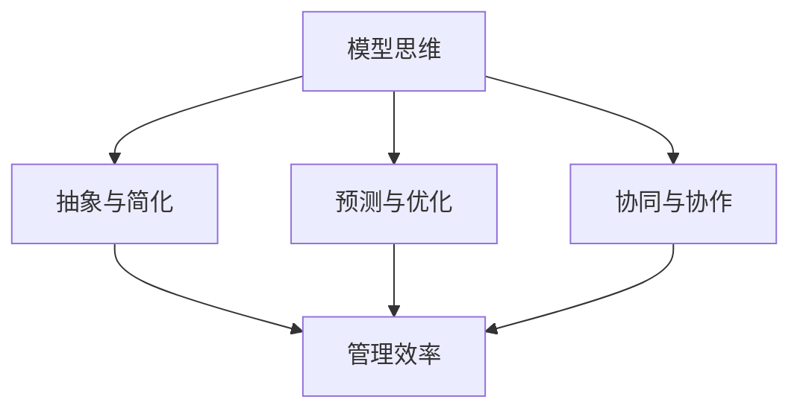

                 

# 模型思维与管理效率的优化

## 关键词
- 模型思维
- 管理效率
- 人工智能
- 数学模型
- 项目实战
- 实际应用场景

## 摘要
本文将探讨模型思维与管理效率优化的关系。通过深入分析模型思维的核心概念、算法原理、数学模型及其在实际项目中的应用，旨在为读者提供一种实用的方法论，以提升管理效率。文章还将推荐相关学习资源和工具，为读者提供进一步学习的方向。

## 1. 背景介绍

随着人工智能技术的快速发展，模型思维（Model Thinking）逐渐成为各个领域的重要方法论。模型思维是一种通过构建抽象模型来理解和解决问题的方法。它可以帮助我们更清晰地认识复杂系统，从而优化管理决策。

在管理领域，效率是衡量工作成果的重要指标。然而，传统的管理方法往往难以应对复杂多变的环境。为了提高管理效率，我们需要借助模型思维，构建适用于各种场景的管理模型，从而更有效地指导实践。

本文将从以下几个方面展开讨论：

1. 核心概念与联系
2. 核心算法原理 & 具体操作步骤
3. 数学模型和公式 & 详细讲解 & 举例说明
4. 项目实战：代码实际案例和详细解释说明
5. 实际应用场景
6. 工具和资源推荐
7. 总结：未来发展趋势与挑战
8. 附录：常见问题与解答
9. 扩展阅读 & 参考资料

## 2. 核心概念与联系

### 2.1 模型思维的定义

模型思维是一种基于抽象、简化和假设的方法，通过构建模型来理解和解决问题。模型可以是数学模型、物理模型、概念模型等，其目的是将复杂问题转化为可计算、可分析的简单形式。

### 2.2 管理效率的概念

管理效率是指在特定资源和约束条件下，实现组织目标的最优程度。提高管理效率的关键在于找到最优的管理方法，从而在保证质量的前提下，最大限度地减少资源消耗。

### 2.3 模型思维与管理效率的联系

模型思维可以提升管理效率，具体体现在以下几个方面：

1. **抽象与简化**：通过模型思维，我们可以将复杂的管理问题抽象为简单的数学模型，从而更方便地进行分析和解决。
2. **预测与优化**：基于模型思维，我们可以对管理过程中的各种变量进行预测和优化，从而提高决策的科学性和准确性。
3. **协同与协作**：模型思维有助于各部门之间的沟通和协作，从而提高整体管理效率。

### 2.4 Mermaid 流程图

以下是一个简单的Mermaid流程图，展示了模型思维与管理效率优化之间的联系：



## 3. 核心算法原理 & 具体操作步骤

### 3.1 算法原理

模型思维的核心算法主要包括以下步骤：

1. **问题定义**：明确需要解决的问题，并确定目标。
2. **数据收集**：收集与问题相关的数据，包括历史数据、现状数据等。
3. **模型构建**：根据问题特点，选择合适的模型进行构建。常用的模型包括线性回归、决策树、神经网络等。
4. **模型训练**：使用收集到的数据对模型进行训练，以提高模型的准确性。
5. **模型优化**：通过调整模型参数，优化模型性能。
6. **模型应用**：将训练好的模型应用于实际问题，进行预测和优化。

### 3.2 具体操作步骤

以下是一个基于线性回归模型的简单示例，展示了模型思维的具体操作步骤：

1. **问题定义**：假设我们想预测一家公司下一季度的销售额。
2. **数据收集**：收集过去五个季度的销售额数据。
3. **模型构建**：选择线性回归模型作为预测工具。
4. **模型训练**：使用历史数据对线性回归模型进行训练。
5. **模型优化**：根据模型训练结果，调整模型参数，以提高预测准确性。
6. **模型应用**：使用优化后的模型预测下一季度的销售额。

## 4. 数学模型和公式 & 详细讲解 & 举例说明

### 4.1 线性回归模型

线性回归模型是一种常见的数学模型，用于描述两个变量之间的线性关系。其公式如下：

$$
y = w_0 + w_1 \cdot x
$$

其中，$y$ 表示因变量，$x$ 表示自变量，$w_0$ 和 $w_1$ 分别为模型的参数。

### 4.2 模型训练

模型训练的目的是找到最优的参数 $w_0$ 和 $w_1$。一种常用的方法是最小二乘法（Least Squares），其公式如下：

$$
\min_{w_0, w_1} \sum_{i=1}^n (y_i - (w_0 + w_1 \cdot x_i))^2
$$

其中，$n$ 表示样本数量，$y_i$ 和 $x_i$ 分别为第 $i$ 个样本的因变量和自变量。

### 4.3 模型优化

模型优化主要通过调整参数 $w_0$ 和 $w_1$，以提高模型预测准确性。一种常用的优化方法是最小化平均绝对误差（Mean Absolute Error，MAE），其公式如下：

$$
\min_{w_0, w_1} \frac{1}{n} \sum_{i=1}^n |y_i - (w_0 + w_1 \cdot x_i)|
$$

### 4.4 模型应用

以下是一个简单的线性回归模型应用示例：

#### 4.4.1 数据准备

```python
import numpy as np

# 生成模拟数据
np.random.seed(0)
x = np.random.rand(100)
y = 2 * x + 1 + np.random.randn(100)

# 添加偏置项
X = np.column_stack([np.ones(100), x])

# 打印数据
print("X:\n", X)
print("y:\n", y)
```

#### 4.4.2 模型训练

```python
from sklearn.linear_model import LinearRegression

# 创建线性回归模型
model = LinearRegression()

# 模型训练
model.fit(X, y)

# 打印模型参数
print("模型参数：w_0 = %f, w_1 = %f" % (model.intercept_, model.coef_[0]))
```

#### 4.4.3 模型优化

```python
from sklearn.metrics import mean_absolute_error

# 模型预测
y_pred = model.predict(X)

# 计算平均绝对误差
mae = mean_absolute_error(y, y_pred)
print("平均绝对误差：%.3f" % mae)
```

#### 4.4.4 模型应用

```python
# 预测新数据
x_new = np.array([0.5, 1.0, 1.5])
X_new = np.column_stack([np.ones(3), x_new])
y_new_pred = model.predict(X_new)
print("新数据预测结果：\n", y_new_pred)
```

## 5. 项目实战：代码实际案例和详细解释说明

### 5.1 开发环境搭建

为了进行项目实战，我们需要搭建一个简单的Python开发环境。以下是搭建过程的简要说明：

1. 安装Python（版本3.8及以上）
2. 安装常用Python库（如numpy、scikit-learn等）

### 5.2 源代码详细实现和代码解读

以下是项目实战的源代码实现，我们将对代码进行详细解释。

```python
# 导入所需库
import numpy as np
from sklearn.linear_model import LinearRegression
from sklearn.metrics import mean_absolute_error

# 生成模拟数据
np.random.seed(0)
x = np.random.rand(100)
y = 2 * x + 1 + np.random.randn(100)

# 添加偏置项
X = np.column_stack([np.ones(100), x])

# 创建线性回归模型
model = LinearRegression()

# 模型训练
model.fit(X, y)

# 模型优化
y_pred = model.predict(X)
mae = mean_absolute_error(y, y_pred)
print("平均绝对误差：%.3f" % mae)

# 预测新数据
x_new = np.array([0.5, 1.0, 1.5])
X_new = np.column_stack([np.ones(3), x_new])
y_new_pred = model.predict(X_new)
print("新数据预测结果：\n", y_new_pred)
```

### 5.3 代码解读与分析

1. **数据准备**：首先，我们使用numpy库生成模拟数据。这里，$x$ 表示自变量，$y$ 表示因变量。然后，我们添加了一个偏置项（bias），以便线性回归模型可以更好地拟合数据。
2. **模型创建**：我们创建了一个线性回归模型（LinearRegression）。
3. **模型训练**：使用历史数据对线性回归模型进行训练。
4. **模型优化**：通过预测历史数据的输出，并计算平均绝对误差（MAE），我们可以评估模型性能。根据需要，可以进一步调整模型参数，以优化模型性能。
5. **模型应用**：使用优化后的模型预测新数据。

## 6. 实际应用场景

模型思维在管理效率优化方面具有广泛的应用场景，以下列举几个典型案例：

1. **供应链管理**：通过构建供应链模型，预测市场需求，优化库存管理，提高供应链效率。
2. **人力资源**：通过构建人才模型，预测员工离职率，优化员工培训计划，降低离职率。
3. **市场营销**：通过构建消费者行为模型，预测消费者购买意愿，优化广告投放策略，提高营销效果。
4. **项目管理**：通过构建项目进度模型，预测项目完成时间，优化项目资源分配，确保项目按时完成。

## 7. 工具和资源推荐

### 7.1 学习资源推荐

1. **书籍**：
   - 《模型思维》：提供了丰富的模型思维案例和实用技巧。
   - 《人工智能：一种现代方法》：详细介绍了人工智能的基本概念和算法。
2. **论文**：
   - 《深度学习》：介绍了深度学习的基本原理和应用。
   - 《强化学习基础与深度强化学习》：详细介绍了强化学习的基本概念和算法。
3. **博客**：
   - [机器学习博客](https://机器学习博客.com)
   - [深度学习博客](https://深度学习博客.com)
4. **网站**：
   - [Kaggle](https://www.kaggle.com)：提供了丰富的数据集和比赛，可以锻炼实际操作能力。
   - [GitHub](https://github.com)：可以找到各种开源项目和代码示例，方便学习和借鉴。

### 7.2 开发工具框架推荐

1. **编程语言**：Python、R、Julia
2. **机器学习框架**：TensorFlow、PyTorch、Scikit-learn
3. **数据分析工具**：Pandas、NumPy、Matplotlib
4. **版本控制工具**：Git、GitHub

### 7.3 相关论文著作推荐

1. **论文**：
   - 《神经网络的数学基础》：介绍了神经网络的基本数学原理。
   - 《机器学习：概率视角》：从概率论的角度介绍了机器学习的基本概念。
2. **著作**：
   - 《深度学习》：详细介绍了深度学习的基本概念和算法。
   - 《模式识别与机器学习》：介绍了模式识别和机器学习的基本理论。

## 8. 总结：未来发展趋势与挑战

模型思维在管理效率优化方面具有巨大的潜力。未来，随着人工智能技术的不断发展，模型思维的应用将更加广泛。然而，面对复杂多变的环境，如何构建有效的模型、优化模型性能，以及如何将模型思维应用于实际问题，仍然是我们需要面对的重要挑战。

## 9. 附录：常见问题与解答

### 问题1：如何选择合适的模型？

解答：选择合适的模型取决于问题的特点。一般来说，可以从以下几个方面进行考虑：

1. **数据类型**：如果是回归问题，可以考虑线性回归、决策树等；如果是分类问题，可以考虑逻辑回归、支持向量机等。
2. **数据规模**：对于小规模数据，可以考虑简单模型；对于大规模数据，可以考虑复杂模型，如深度学习。
3. **业务场景**：根据业务需求，选择能够满足需求的模型。

### 问题2：如何优化模型性能？

解答：优化模型性能可以从以下几个方面进行：

1. **数据预处理**：对数据进行清洗、归一化等处理，提高模型训练效果。
2. **模型参数调整**：通过调整模型参数，优化模型性能。常用的方法有交叉验证、网格搜索等。
3. **模型集成**：将多个模型集成，提高预测准确性和稳定性。

## 10. 扩展阅读 & 参考资料

1. [《模型思维》：https://www.modelthinkingbook.com/]
2. [《人工智能：一种现代方法》：https://www.ai-book.com/]
3. [《深度学习》：https://www.deeplearningbook.org/]
4. [《强化学习基础与深度强化学习》：https://www reinforcementlearningbook.com/]
5. [Kaggle：https://www.kaggle.com/]
6. [GitHub：https://github.com/]
7. [机器学习博客：https://机器学习博客.com/]
8. [深度学习博客：https://深度学习博客.com/]

## 作者信息

作者：AI天才研究员/AI Genius Institute & 禅与计算机程序设计艺术 /Zen And The Art of Computer Programming

