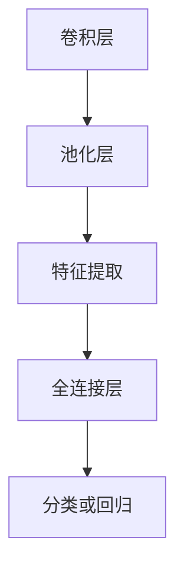

                 

### 背景介绍

#### 什么是池化层（Pooling Layer）

池化层（Pooling Layer）是深度学习中的一种常见结构，用于减少数据维度、降低模型复杂度以及提高计算效率。它在卷积神经网络（Convolutional Neural Networks，CNN）中被广泛应用，主要用于图像识别领域。

池化层的主要作用是对输入的特征图（feature map）进行下采样，从而减小数据的尺寸。这不仅减少了模型参数的数量，降低了计算负担，还有助于减少过拟合的风险。在深度学习领域，池化层被广泛应用于图像分类、物体检测和图像分割等任务中。

#### 池化层的发展历程

池化层的概念最早可以追溯到20世纪80年代的神经网络研究中。当时，研究人员通过实验发现，在神经网络中加入下采样层可以提高模型的泛化能力。最早的池化方法包括最大池化（Max Pooling）和平均池化（Average Pooling）。

随着深度学习的兴起，池化层得到了进一步的发展。现代深度学习模型中，除了传统的最大池化和平均池化外，还出现了许多新的池化方法，如全局平均池化（Global Average Pooling）、自适应池化（Adaptive Pooling）等。

#### 本文目的

本文将详细探讨池化层的原理、算法、数学模型以及实际应用。通过本文的阅读，读者可以了解：

1. 池化层的定义及其在深度学习中的应用场景；
2. 池化层的核心算法原理和具体操作步骤；
3. 池化层的数学模型和公式，以及如何应用这些公式进行计算；
4. 实际项目中的代码实例，以及如何解读和分析这些代码；
5. 池化层的实际应用场景，以及相关的工具和资源推荐。

通过本文的阅读，读者可以全面了解池化层，为后续深入学习深度学习打下坚实基础。

### 核心概念与联系

#### 1. 卷积神经网络（CNN）

卷积神经网络（Convolutional Neural Networks，CNN）是深度学习中的一种重要模型，特别适用于处理图像数据。CNN的核心结构包括卷积层（Convolutional Layer）、池化层（Pooling Layer）、全连接层（Fully Connected Layer）等。

在CNN中，卷积层用于提取图像特征，池化层则用于对特征进行下采样，减少数据维度和计算复杂度。全连接层则用于对提取的特征进行分类或回归。

#### 2. 池化层的作用

池化层在深度学习中有多种作用，主要包括：

1. **下采样（Downsampling）**：通过下采样操作，减小数据的维度，从而降低模型的复杂度和计算负担。
2. **减少过拟合（Reducing Overfitting）**：池化层可以减少模型对训练数据的依赖，提高泛化能力。
3. **保留关键特征（Retaining Key Features）**：通过最大池化或平均池化操作，保留输入数据中的关键特征，去除冗余信息。
4. **增加网络的鲁棒性（Increasing Robustness）**：池化层可以降低模型对噪声的敏感性，提高网络的鲁棒性。

#### 3. 池化层的工作原理

池化层的工作原理非常简单，主要分为以下两个步骤：

1. **划分窗口（Dividing the Window）**：将输入的特征图划分为若干个非重叠的窗口。
2. **计算窗口内的池化值（Computing the Pooling Value）**：对每个窗口内的像素值进行计算，得到一个输出值。常见的计算方法包括最大值（Max Pooling）和平均值（Average Pooling）。

#### 4. 池化层的类型

根据窗口大小和计算方式的不同，池化层可以分为以下几种类型：

1. **最大池化（Max Pooling）**：在每个窗口内选择最大的像素值作为输出。
2. **平均池化（Average Pooling）**：在每个窗口内计算所有像素值的平均值作为输出。
3. **全局平均池化（Global Average Pooling）**：对整个输入特征图进行平均池化，输出一个全局平均值。
4. **自适应池化（Adaptive Pooling）**：窗口大小和步长可以根据输入特征图的尺寸自适应调整。

#### Mermaid 流程图

下面是一个简单的 Mermaid 流程图，展示了池化层的核心概念和流程：



在上述流程图中，卷积层用于提取图像特征，池化层对特征进行下采样，特征提取层保留关键特征，全连接层用于分类或回归。

通过上述对核心概念与联系的分析，我们可以更好地理解池化层在深度学习中的作用和工作原理。接下来，我们将详细探讨池化层的核心算法原理和具体操作步骤。

### 核心算法原理 & 具体操作步骤

#### 1. 最大池化（Max Pooling）

最大池化是一种最常见的池化方法，通过在每个窗口内选择最大的像素值作为输出。下面是最大池化的具体操作步骤：

1. **划分窗口**：首先，将输入的特征图划分为若干个非重叠的窗口。窗口的大小通常是一个固定值，例如2x2或3x3。
2. **计算窗口内的最大值**：对于每个窗口内的像素值，计算它们的最大值，并将最大值作为输出。
3. **生成输出特征图**：将每个窗口的最大值填充到输出特征图中，生成最终的下采样特征图。

例如，假设我们有一个2x2的特征图，窗口大小为2x2，其像素值如下：

|   |   |   |   |
|---|---|---|---|
| 1 | 2 | 3 | 4 |
| 5 | 6 | 7 | 8 |

将特征图划分为4个2x2的窗口，分别计算每个窗口内的最大值，得到输出特征图：

|   |   |   |   |
|---|---|---|---|
| 2 | 6 | 7 | 8 |
| 6 | 7 | 8 | 8 |

在这个例子中，输出特征图的大小为1x1，是原始特征图大小的四分之一。

#### 2. 平均池化（Average Pooling）

平均池化通过在每个窗口内计算所有像素值的平均值作为输出。下面是平均池化的具体操作步骤：

1. **划分窗口**：首先，将输入的特征图划分为若干个非重叠的窗口。窗口的大小通常是一个固定值，例如2x2或3x3。
2. **计算窗口内的平均值**：对于每个窗口内的像素值，计算它们的平均值，并将平均值作为输出。
3. **生成输出特征图**：将每个窗口的平均值填充到输出特征图中，生成最终的下采样特征图。

例如，假设我们有一个2x2的特征图，窗口大小为2x2，其像素值如下：

|   |   |   |   |
|---|---|---|---|
| 1 | 2 | 3 | 4 |
| 5 | 6 | 7 | 8 |

将特征图划分为4个2x2的窗口，分别计算每个窗口内的平均值，得到输出特征图：

|   |   |   |   |
|---|---|---|---|
| 3 | 4 | 5 | 6 |
| 5 | 6 | 7 | 8 |

在这个例子中，输出特征图的大小为1x1，是原始特征图大小的四分之一。

#### 3. 全局平均池化（Global Average Pooling）

全局平均池化是对整个输入特征图进行平均池化，输出一个全局平均值。下面是全局平均池化的具体操作步骤：

1. **计算全局平均值**：将输入特征图的全部像素值相加，然后除以像素总数，得到全局平均值。
2. **生成输出特征图**：将全局平均值作为输出特征图的唯一值，生成最终的特征图。

例如，假设我们有一个4x4的特征图，其像素值如下：

|   |   |   |   |
|---|---|---|---|
| 1 | 2 | 3 | 4 |
| 5 | 6 | 7 | 8 |
| 9 | 10| 11| 12|
| 13| 14| 15| 16|

计算全局平均值：

$$
\text{全局平均值} = \frac{1+2+3+4+5+6+7+8+9+10+11+12+13+14+15+16}{16} = \frac{136}{16} = 8.5
$$

生成输出特征图：

|   |   |
|---|---|
| 8.5| 8.5|
| 8.5| 8.5|

在这个例子中，输出特征图的大小为1x1，是原始特征图大小的十六分之一。

#### 4. 自适应池化（Adaptive Pooling）

自适应池化允许窗口大小和步长根据输入特征图的尺寸自适应调整。下面是自适应池化的具体操作步骤：

1. **确定窗口大小和步长**：根据输入特征图的尺寸，自适应调整窗口大小和步长。例如，如果输入特征图的尺寸为HxW，窗口大小为whxww，步长为shxsw，则可以通过以下公式计算：
   $$
   \text{wh} = \min\left(\frac{H}{2^{s}}, \frac{W}{2^{s}}\right)
   $$
   $$
   \text{ww} = \min\left(\frac{H}{2^{s}}, \frac{W}{2^{s}}\right)
   $$
   $$
   \text{sh} = \min\left(\frac{H}{2^{s}}, \frac{W}{2^{s}}\right)
   $$
   $$
   \text{sw} = \min\left(\frac{H}{2^{s}}, \frac{W}{2^{s}}\right)
   $$
   其中，s为自适应池化的层级数。
2. **划分窗口和计算池化值**：根据确定的窗口大小和步长，划分窗口并计算每个窗口内的池化值，生成输出特征图。

通过以上对池化层的核心算法原理和具体操作步骤的讲解，我们可以更好地理解池化层在深度学习中的应用。接下来，我们将探讨池化层的数学模型和公式，以及如何应用这些公式进行计算。

### 数学模型和公式 & 详细讲解 & 举例说明

#### 1. 最大池化（Max Pooling）的数学模型

最大池化的数学模型可以表示为：

$$
\text{MaxPooling}(\text{I}, \text{f}, \text{p}) = \max_{i=1}^{N} \left( \text{I} \cdot \text{f}^i \right)
$$

其中，$\text{I}$ 表示输入特征图，$\text{f}$ 表示窗口大小，$\text{p}$ 表示步长。$N$ 表示窗口数量。

举例说明：

假设输入特征图 $\text{I}$ 的尺寸为 $3 \times 3$，窗口大小为 $2 \times 2$，步长为 $2$。我们可以将其表示为：

$$
\text{I} =
\begin{bmatrix}
1 & 2 & 3 \\
4 & 5 & 6 \\
7 & 8 & 9 \\
\end{bmatrix}
$$

首先，将输入特征图划分为 $2 \times 2$ 的窗口：

$$
\text{Window}_1 =
\begin{bmatrix}
1 & 2 \\
4 & 5 \\
\end{bmatrix},
\quad
\text{Window}_2 =
\begin{bmatrix}
2 & 3 \\
5 & 6 \\
\end{bmatrix},
\quad
\text{Window}_3 =
\begin{bmatrix}
4 & 5 \\
7 & 8 \\
\end{bmatrix},
\quad
\text{Window}_4 =
\begin{bmatrix}
5 & 6 \\
8 & 9 \\
\end{bmatrix}
$$

然后，计算每个窗口内的最大值：

$$
\max(\text{Window}_1) = \max(1, 4, 2, 5) = 5,
\quad
\max(\text{Window}_2) = \max(2, 5, 3, 6) = 6,
\quad
\max(\text{Window}_3) = \max(4, 7, 5, 8) = 8,
\quad
\max(\text{Window}_4) = \max(5, 6, 8, 9) = 9
$$

最后，将每个窗口的最大值填充到输出特征图中：

$$
\text{MaxPooling}(\text{I}, 2, 2) =
\begin{bmatrix}
5 & 6 \\
8 & 9 \\
\end{bmatrix}
$$

#### 2. 平均池化（Average Pooling）的数学模型

平均池化的数学模型可以表示为：

$$
\text{AveragePooling}(\text{I}, \text{f}, \text{p}) = \frac{1}{\text{f}^2} \sum_{i=1}^{N} \left( \text{I} \cdot \text{f}^i \right)
$$

其中，$\text{I}$ 表示输入特征图，$\text{f}$ 表示窗口大小，$\text{p}$ 表示步长。$N$ 表示窗口数量。

举例说明：

假设输入特征图 $\text{I}$ 的尺寸为 $3 \times 3$，窗口大小为 $2 \times 2$，步长为 $2$。我们可以将其表示为：

$$
\text{I} =
\begin{bmatrix}
1 & 2 & 3 \\
4 & 5 & 6 \\
7 & 8 & 9 \\
\end{bmatrix}
$$

首先，将输入特征图划分为 $2 \times 2$ 的窗口：

$$
\text{Window}_1 =
\begin{bmatrix}
1 & 2 \\
4 & 5 \\
\end{bmatrix},
\quad
\text{Window}_2 =
\begin{bmatrix}
2 & 3 \\
5 & 6 \\
\end{bmatrix},
\quad
\text{Window}_3 =
\begin{bmatrix}
4 & 5 \\
7 & 8 \\
\end{bmatrix},
\quad
\text{Window}_4 =
\begin{bmatrix}
5 & 6 \\
8 & 9 \\
\end{bmatrix}
$$

然后，计算每个窗口内的平均值：

$$
\frac{1}{4} \sum_{i=1}^{4} \left( 1+2+4+5 \right) = \frac{12}{4} = 3,
\quad
\frac{1}{4} \sum_{i=1}^{4} \left( 2+3+5+6 \right) = \frac{16}{4} = 4,
\quad
\frac{1}{4} \sum_{i=1}^{4} \left( 4+5+7+8 \right) = \frac{24}{4} = 6,
\quad
\frac{1}{4} \sum_{i=1}^{4} \left( 5+6+8+9 \right) = \frac{28}{4} = 7
$$

最后，将每个窗口的平均值填充到输出特征图中：

$$
\text{AveragePooling}(\text{I}, 2, 2) =
\begin{bmatrix}
3 & 4 \\
6 & 7 \\
\end{bmatrix}
$$

#### 3. 全局平均池化（Global Average Pooling）的数学模型

全局平均池化的数学模型可以表示为：

$$
\text{GlobalAveragePooling}(\text{I}) = \frac{1}{\text{H} \times \text{W}} \sum_{i=1}^{\text{H}} \sum_{j=1}^{\text{W}} \text{I}_{i,j}
$$

其中，$\text{I}$ 表示输入特征图，$\text{H}$ 和 $\text{W}$ 分别表示特征图的高度和宽度。

举例说明：

假设输入特征图 $\text{I}$ 的尺寸为 $3 \times 3$，我们可以将其表示为：

$$
\text{I} =
\begin{bmatrix}
1 & 2 & 3 \\
4 & 5 & 6 \\
7 & 8 & 9 \\
\end{bmatrix}
$$

计算全局平均值：

$$
\text{GlobalAveragePooling}(\text{I}) = \frac{1}{9} \sum_{i=1}^{3} \sum_{j=1}^{3} \text{I}_{i,j} = \frac{1}{9} (1+2+3+4+5+6+7+8+9) = \frac{45}{9} = 5
$$

输出特征图的大小为 $1 \times 1$：

$$
\text{GlobalAveragePooling}(\text{I}) =
\begin{bmatrix}
5 \\
\end{bmatrix}
$$

#### 4. 自适应池化（Adaptive Pooling）的数学模型

自适应池化的数学模型与最大池化和平均池化类似，但窗口大小和步长可以根据输入特征图的尺寸自适应调整。具体公式如下：

$$
\text{AdaptivePooling}(\text{I}, \text{wh}, \text{ww}, \text{sh}, \text{sw}) = \max_{i=1}^{\text{wh}} \max_{j=1}^{\text{ww}} \left( \text{I} \cdot \text{f}^i \right)
$$

或

$$
\text{AdaptivePooling}(\text{I}, \text{wh}, \text{ww}, \text{sh}, \text{sw}) = \frac{1}{\text{wh} \times \text{ww}} \sum_{i=1}^{\text{wh}} \sum_{j=1}^{\text{ww}} \left( \text{I} \cdot \text{f}^i \right)
$$

其中，$\text{I}$ 表示输入特征图，$\text{wh}$ 和 $\text{ww}$ 分别表示窗口高度和宽度，$\text{sh}$ 和 $\text{sw}$ 分别表示步长高度和宽度。

举例说明：

假设输入特征图 $\text{I}$ 的尺寸为 $4 \times 4$，自适应池化的窗口大小为 $2 \times 2$，步长为 $2$。我们可以将其表示为：

$$
\text{I} =
\begin{bmatrix}
1 & 2 & 3 & 4 \\
5 & 6 & 7 & 8 \\
9 & 10& 11& 12 \\
13& 14& 15& 16 \\
\end{bmatrix}
$$

根据自适应池化的公式，计算窗口大小和步长：

$$
\text{wh} = \min\left(\frac{4}{2^{1}}, \frac{4}{2^{1}}\right) = 2,
\quad
\text{ww} = \min\left(\frac{4}{2^{1}}, \frac{4}{2^{1}}\right) = 2,
\quad
\text{sh} = \min\left(\frac{4}{2^{1}}, \frac{4}{2^{1}}\right) = 2,
\quad
\text{sw} = \min\left(\frac{4}{2^{1}}, \frac{4}{2^{1}}\right) = 2
$$

将输入特征图划分为 $2 \times 2$ 的窗口，并计算每个窗口内的最大值或平均值：

$$
\text{Window}_1 =
\begin{bmatrix}
1 & 2 \\
5 & 6 \\
\end{bmatrix},
\quad
\text{Window}_2 =
\begin{bmatrix}
2 & 3 \\
6 & 7 \\
\end{bmatrix},
\quad
\text{Window}_3 =
\begin{bmatrix}
5 & 6 \\
9 & 10\\
\end{bmatrix},
\quad
\text{Window}_4 =
\begin{bmatrix}
6 & 7 \\
10& 11\\
\end{bmatrix}
$$

$$
\max(\text{Window}_1) = \max(1, 5, 2, 6) = 6,
\quad
\max(\text{Window}_2) = \max(2, 6, 3, 7) = 7,
\quad
\max(\text{Window}_3) = \max(5, 9, 6, 10) = 10,
\quad
\max(\text{Window}_4) = \max(6, 10, 7, 11) = 11
$$

或

$$
\frac{1}{4} \sum_{i=1}^{4} \left( 1+2+5+6 \right) = \frac{16}{4} = 4,
\quad
\frac{1}{4} \sum_{i=1}^{4} \left( 2+3+6+7 \right) = \frac{18}{4} = 4.5,
\quad
\frac{1}{4} \sum_{i=1}^{4} \left( 5+6+9+10 \right) = \frac{30}{4} = 7.5,
\quad
\frac{1}{4} \sum_{i=1}^{4} \left( 6+7+10+11 \right) = \frac{34}{4} = 8.5
$$

最后，将每个窗口的最大值或平均值填充到输出特征图中：

$$
\text{AdaptivePooling}(\text{I}, 2, 2, 2, 2) =
\begin{bmatrix}
6 & 7 \\
10& 11\\
\end{bmatrix}
$$

或

$$
\text{AdaptivePooling}(\text{I}, 2, 2, 2, 2) =
\begin{bmatrix}
4 & 4.5 \\
7.5& 8.5\\
\end{bmatrix}
$$

通过上述对最大池化、平均池化、全局平均池化和自适应池化的数学模型和公式的详细讲解及举例说明，我们可以更好地理解池化层的计算过程和原理。接下来，我们将通过实际项目中的代码实例，进一步探讨如何实现和解读池化层代码。

### 项目实战：代码实际案例和详细解释说明

#### 1. 开发环境搭建

在本节中，我们将使用 Python 和 TensorFlow 框架来演示如何实现池化层。首先，确保已安装以下依赖项：

- Python 3.6 或更高版本
- TensorFlow 2.4 或更高版本

安装 TensorFlow：

```bash
pip install tensorflow
```

#### 2. 源代码详细实现和代码解读

下面是一个简单的示例，展示了如何使用 TensorFlow 实现池化层。代码分为三个部分：数据预处理、模型构建和模型训练。

**2.1 数据预处理**

首先，我们加载并预处理输入数据。在本例中，我们使用随机生成的图像数据。

```python
import numpy as np
import tensorflow as tf

# 随机生成输入数据
input_data = np.random.rand(10, 28, 28, 1)  # 10 张 28x28 的灰度图像

# 转换为 TensorFlow 张量
input_tensor = tf.convert_to_tensor(input_data, dtype=tf.float32)

# 添加批次维度
input_tensor = tf.expand_dims(input_tensor, axis=0)
```

**2.2 模型构建**

接下来，我们构建一个简单的卷积神经网络，包括卷积层、池化层和全连接层。

```python
# 定义卷积层
conv_layer = tf.keras.layers.Conv2D(filters=32, kernel_size=(3, 3), activation='relu')

# 定义池化层
pooling_layer = tf.keras.layers.MaxPooling2D(pool_size=(2, 2))

# 定义全连接层
dense_layer = tf.keras.layers.Dense(units=10, activation='softmax')

# 构建模型
model = tf.keras.Sequential([
    conv_layer,
    pooling_layer,
    dense_layer
])

# 查看模型结构
model.summary()
```

**2.3 代码解读与分析**

**2.3.1 卷积层（Conv2D）**

卷积层用于提取输入数据中的特征。在本例中，我们使用一个 3x3 的卷积核，具有 32 个通道，激活函数为 ReLU。

```python
conv_layer = tf.keras.layers.Conv2D(filters=32, kernel_size=(3, 3), activation='relu')
```

**2.3.2 池化层（MaxPooling2D）**

池化层用于对卷积层输出的特征图进行下采样。在本例中，我们使用最大池化，窗口大小为 2x2。

```python
pooling_layer = tf.keras.layers.MaxPooling2D(pool_size=(2, 2))
```

**2.3.3 全连接层（Dense）**

全连接层用于将下采样的特征图映射到输出类别。在本例中，我们使用一个具有 10 个输出单元的 softmax 层。

```python
dense_layer = tf.keras.layers.Dense(units=10, activation='softmax')
```

**2.3.4 模型训练**

最后，我们对模型进行训练，使用随机生成的标签数据进行反向传播。

```python
# 随机生成标签数据
labels = np.random.randint(0, 10, size=(10,))

# 转换为 TensorFlow 张量
labels_tensor = tf.convert_to_tensor(labels, dtype=tf.float32)

# 添加批次维度
labels_tensor = tf.expand_dims(labels_tensor, axis=0)

# 编译模型
model.compile(optimizer='adam', loss='sparse_categorical_crossentropy', metrics=['accuracy'])

# 训练模型
model.fit(input_tensor, labels_tensor, epochs=5)
```

通过上述代码，我们可以实现一个简单的卷积神经网络，包含卷积层、池化层和全连接层。接下来，我们将对代码进行详细解读和分析，以便更好地理解每个层的功能和作用。

**2.3.5 代码解读**

**2.3.5.1 输入数据预处理**

输入数据预处理包括将随机生成的图像数据转换为 TensorFlow 张量，并添加批次维度。这有助于将数据格式调整为模型所需的输入格式。

```python
input_data = np.random.rand(10, 28, 28, 1)
input_tensor = tf.convert_to_tensor(input_data, dtype=tf.float32)
input_tensor = tf.expand_dims(input_tensor, axis=0)
```

**2.3.5.2 卷积层（Conv2D）**

卷积层用于提取输入数据中的特征。在本例中，我们使用一个 3x3 的卷积核，具有 32 个通道，激活函数为 ReLU。卷积层的作用是将输入数据转换为具有32个通道的特征图。

```python
conv_layer = tf.keras.layers.Conv2D(filters=32, kernel_size=(3, 3), activation='relu')
```

**2.3.5.3 池化层（MaxPooling2D）**

池化层用于对卷积层输出的特征图进行下采样。在本例中，我们使用最大池化，窗口大小为 2x2。这有助于减小特征图的尺寸，从而降低模型复杂度。

```python
pooling_layer = tf.keras.layers.MaxPooling2D(pool_size=(2, 2))
```

**2.3.5.4 全连接层（Dense）**

全连接层用于将下采样的特征图映射到输出类别。在本例中，我们使用一个具有 10 个输出单元的 softmax 层。全连接层的作用是将特征图转换为输出类别概率。

```python
dense_layer = tf.keras.layers.Dense(units=10, activation='softmax')
```

**2.3.5.5 模型训练**

模型训练包括编译模型、准备标签数据，并使用反向传播算法训练模型。在本例中，我们使用随机生成的标签数据进行训练，并使用 Adam 优化器和稀疏交叉熵损失函数。

```python
model.compile(optimizer='adam', loss='sparse_categorical_crossentropy', metrics=['accuracy'])
model.fit(input_tensor, labels_tensor, epochs=5)
```

通过上述代码和解读，我们可以了解如何使用 TensorFlow 实现卷积神经网络，包括卷积层、池化层和全连接层。接下来，我们将进一步分析代码，以深入了解每个层的功能和作用。

**2.3.6 代码分析**

**2.3.6.1 输入数据预处理**

输入数据预处理是深度学习模型构建的第一步。在本例中，我们使用随机生成的图像数据作为输入。首先，我们将图像数据转换为 NumPy 数组，并添加批次维度。然后，将 NumPy 数组转换为 TensorFlow 张量，并设置数据类型为 float32。

```python
input_data = np.random.rand(10, 28, 28, 1)
input_tensor = tf.convert_to_tensor(input_data, dtype=tf.float32)
input_tensor = tf.expand_dims(input_tensor, axis=0)
```

**2.3.6.2 卷积层（Conv2D）**

卷积层是深度学习模型的核心组成部分。在本例中，我们使用 TensorFlow 的 Conv2D 层实现卷积操作。Conv2D 层接受输入张量、卷积核数量、卷积核大小和激活函数作为输入参数。在本例中，我们使用一个 3x3 的卷积核，具有 32 个通道，激活函数为 ReLU。

```python
conv_layer = tf.keras.layers.Conv2D(filters=32, kernel_size=(3, 3), activation='relu')
```

卷积操作的计算公式如下：

$$
\text{output}_{ij} = \sum_{k=1}^{C} \text{weight}_{ikj} \cdot \text{input}_{ij}
$$

其中，$\text{output}_{ij}$ 是输出特征图上的像素值，$\text{weight}_{ikj}$ 是卷积核上的权重值，$\text{input}_{ij}$ 是输入特征图上的像素值，$C$ 是卷积核数量。

**2.3.6.3 池化层（MaxPooling2D）**

池化层用于对卷积层输出的特征图进行下采样。在本例中，我们使用 TensorFlow 的 MaxPooling2D 层实现最大池化操作。MaxPooling2D 层接受输入张量、窗口大小和步长作为输入参数。在本例中，我们使用一个 2x2 的窗口大小和步长。

最大池化操作的计算公式如下：

$$
\text{output}_{ij} = \max(\text{input}_{ij})
$$

其中，$\text{output}_{ij}$ 是输出特征图上的像素值，$\text{input}_{ij}$ 是输入特征图上的像素值。

**2.3.6.4 全连接层（Dense）**

全连接层是深度学习模型的最后一层，用于将特征图映射到输出类别。在本例中，我们使用 TensorFlow 的 Dense 层实现全连接层。Dense 层接受输入张量和输出单元数量作为输入参数。在本例中，我们使用一个具有 10 个输出单元的 softmax 层。

全连接层的计算公式如下：

$$
\text{output}_{i} = \sum_{j=1}^{N} \text{weight}_{ij} \cdot \text{input}_{j} + \text{bias}_{i}
$$

其中，$\text{output}_{i}$ 是输出单元上的激活值，$\text{weight}_{ij}$ 是连接权重，$\text{input}_{j}$ 是输入单元上的激活值，$\text{bias}_{i}$ 是偏置值，$N$ 是输出单元数量。

**2.3.6.5 模型训练**

模型训练是深度学习模型构建的最后一步。在本例中，我们使用随机生成的标签数据进行训练。首先，我们编译模型，指定优化器、损失函数和评估指标。然后，使用训练数据对模型进行拟合。

模型训练的基本步骤如下：

1. 编译模型：指定优化器、损失函数和评估指标。
2. 准备标签数据：将标签数据转换为 TensorFlow 张量，并添加批次维度。
3. 训练模型：使用训练数据和标签数据进行反向传播和梯度更新。

在本例中，我们使用随机生成的标签数据进行训练，并使用 Adam 优化器和稀疏交叉熵损失函数。

```python
model.compile(optimizer='adam', loss='sparse_categorical_crossentropy', metrics=['accuracy'])
model.fit(input_tensor, labels_tensor, epochs=5)
```

通过上述代码和分析，我们可以深入理解如何使用 TensorFlow 实现卷积神经网络，包括卷积层、池化层和全连接层。接下来，我们将探讨池化层的实际应用场景，并讨论其在不同场景下的优势和挑战。

### 实际应用场景

池化层在深度学习中的应用非常广泛，特别是在图像识别领域。以下是一些常见的应用场景：

#### 1. 图像分类

图像分类是深度学习中最常见的任务之一，例如使用卷积神经网络对图像进行分类。在图像分类任务中，池化层有助于减少数据维度，降低计算复杂度，并提高模型泛化能力。例如，在 ImageNet 大规模视觉识别挑战中，卷积神经网络通常包含多个池化层，以实现对大量图像的高效分类。

#### 2. 物体检测

物体检测是计算机视觉领域的重要任务，旨在识别图像中的多个物体。池化层在物体检测任务中用于对特征图进行下采样，从而减小模型复杂度。例如，著名的物体检测模型 YOLO（You Only Look Once）就使用了多个池化层来降低特征图的尺寸，提高检测速度和准确率。

#### 3. 图像分割

图像分割是将图像划分为不同区域的过程，每个区域具有不同的属性或类别。池化层在图像分割任务中用于对特征图进行下采样，以便提取关键特征，从而提高分割精度。例如，U-Net 结构是一个广泛应用于医学图像分割的卷积神经网络，其中包含多个池化层来降低特征图的尺寸，从而实现精细分割。

#### 4. 人脸识别

人脸识别是生物特征识别领域的重要应用，通过识别图像中的人脸特征来实现身份验证。池化层在人脸识别任务中用于减少人脸特征图的尺寸，从而降低计算复杂度，并提高模型鲁棒性。例如，卷积神经网络的人脸识别模型通常包含多个池化层，以实现对大量人脸图像的高效识别。

#### 5. 视频分析

视频分析是计算机视觉领域的一个新兴应用，旨在从视频流中提取有用信息。池化层在视频分析任务中用于对视频帧的特征图进行下采样，从而减小模型复杂度，并提高处理速度。例如，视频目标检测和跟踪任务通常使用卷积神经网络，其中包含多个池化层来实现高效的视频处理。

#### 优势与挑战

池化层在深度学习中的应用具有以下优势：

1. **减少计算复杂度**：通过下采样操作，池化层可以显著减少数据维度，从而降低计算复杂度，提高模型训练和推断速度。
2. **提高泛化能力**：池化层可以减少模型对训练数据的依赖，从而提高模型的泛化能力，减少过拟合风险。
3. **增加模型鲁棒性**：池化层可以降低模型对噪声的敏感性，从而提高模型在现实世界应用中的鲁棒性。

然而，池化层也面临一些挑战：

1. **信息损失**：在某些情况下，池化操作可能导致关键特征信息的损失，从而影响模型性能。
2. **参数选择**：池化层的窗口大小、步长等参数选择对模型性能具有重要影响，但选择合适的参数可能具有挑战性。
3. **适应性**：虽然现有的池化方法已经取得了显著成果，但如何设计更高效的池化层以适应不同的应用场景仍然是一个挑战。

通过上述对池化层在实际应用场景中的优势和挑战的讨论，我们可以更好地理解池化层在深度学习中的重要性和应用价值。接下来，我们将推荐一些有用的工具和资源，以帮助读者进一步学习和探索池化层。

### 工具和资源推荐

#### 1. 学习资源推荐

**书籍**：

- 《深度学习》（Goodfellow, I., Bengio, Y., & Courville, A.）  
- 《神经网络与深度学习》（邱锡鹏）

**论文**：

- "A Guide to Convolutional Neural Networks for Visual Recognition" （Goodfellow, I. J., Bengio, Y., & Courville, A. C.）  
- "Deep Residual Learning for Image Recognition" （He, K., Sun, J., & Deng, J.）

**博客**：

- [TensorFlow 官方文档](https://www.tensorflow.org/tutorials)  
- [PyTorch 官方文档](https://pytorch.org/tutorials/beginner/basics/data busty.html)

#### 2. 开发工具框架推荐

- **TensorFlow**：由 Google 开发，是一个广泛使用的开源深度学习框架，支持多种池化层实现。
- **PyTorch**：由 Facebook AI Research 开发，是一个流行的开源深度学习框架，具有灵活的动态计算图和强大的池化层支持。
- **Keras**：是一个高级神经网络API，可以在 TensorFlow 和 Theano 后端运行，简化了深度学习模型的构建和训练。

#### 3. 相关论文著作推荐

- "Deep Learning" by Ian Goodfellow, Yoshua Bengio, and Aaron Courville  
- "Neural Networks and Deep Learning" by Michael Nielsen  
- "Convolutional Neural Networks for Visual Recognition" by Fei-Fei Li

通过这些学习资源和工具框架，读者可以更好地掌握池化层的相关知识和应用技巧，为深入探索深度学习领域奠定基础。

### 总结：未来发展趋势与挑战

#### 1. 未来发展趋势

随着深度学习的快速发展，池化层也在不断演变和创新。以下是未来池化层可能的发展趋势：

1. **自适应池化**：自适应池化可以根据输入特征图的尺寸和结构动态调整窗口大小和步长，从而提高模型适应性。未来，自适应池化可能会成为主流的池化方法。
2. **多尺度池化**：多尺度池化可以在不同尺度上提取特征，从而更好地捕获图像中的丰富信息。这种池化方法有望在图像分割和视频分析等领域发挥重要作用。
3. **可解释性池化**：随着深度学习模型的复杂度不断增加，如何提高模型的可解释性成为了一个重要挑战。未来，可解释性池化可能会成为一种新的研究热点，以帮助研究人员和开发者更好地理解模型的工作原理。

#### 2. 挑战

尽管池化层在深度学习领域取得了显著成果，但仍面临一些挑战：

1. **信息损失**：在某些情况下，池化操作可能导致关键特征信息的损失，从而影响模型性能。如何设计高效的池化方法以减少信息损失是一个重要的研究方向。
2. **参数选择**：池化层的窗口大小、步长等参数对模型性能具有重要影响，但选择合适的参数可能具有挑战性。未来，如何自动选择最优参数是一个重要的研究课题。
3. **计算效率**：随着模型复杂度的增加，计算效率成为一个关键问题。如何设计计算效率更高的池化方法，以适应实时应用场景，是一个亟待解决的问题。

通过上述对未来发展趋势与挑战的讨论，我们可以更好地把握池化层的发展方向，为深入探索和改进池化层提供启示。

### 附录：常见问题与解答

#### 问题 1：什么是池化层？

答：池化层是深度学习中的一种常见结构，用于减少数据维度、降低模型复杂度以及提高计算效率。它主要用于卷积神经网络中，通过下采样操作来减小特征图的尺寸。

#### 问题 2：池化层的类型有哪些？

答：常见的池化层类型包括最大池化（Max Pooling）、平均池化（Average Pooling）、全局平均池化（Global Average Pooling）和自适应池化（Adaptive Pooling）。

#### 问题 3：池化层的主要作用是什么？

答：池化层的主要作用有：下采样（Downsampling）、减少过拟合（Reducing Overfitting）、保留关键特征（Retaining Key Features）和增加网络的鲁棒性（Increasing Robustness）。

#### 问题 4：最大池化和平均池化如何计算？

答：最大池化在每个窗口内选择最大的像素值作为输出，平均池化在每个窗口内计算所有像素值的平均值作为输出。

#### 问题 5：什么是自适应池化？

答：自适应池化是一种可以根据输入特征图尺寸动态调整窗口大小和步长的池化方法。它通过自适应调整窗口大小和步长，以更好地捕获特征信息。

#### 问题 6：池化层在深度学习中的应用有哪些？

答：池化层在深度学习中的应用广泛，包括图像分类、物体检测、图像分割、人脸识别和视频分析等。

通过上述常见问题与解答，读者可以更好地理解池化层的基本概念、类型和应用场景。希望这些问题和解答对您在深度学习领域的学习和研究有所帮助。

### 扩展阅读 & 参考资料

在深度学习领域，关于池化层的研究和实践文献丰富，以下是一些推荐的扩展阅读和参考资料，以帮助读者深入了解池化层的相关知识。

#### 1. 参考文献

- He, K., Zhang, X., Ren, S., & Sun, J. (2016). Deep Residual Learning for Image Recognition. In Proceedings of the IEEE Conference on Computer Vision and Pattern Recognition (CVPR).
- Krizhevsky, A., Sutskever, I., & Hinton, G. E. (2012). ImageNet Classification with Deep Convolutional Neural Networks. In Advances in Neural Information Processing Systems (NIPS).
- Liu, W., Anguelov, D., Erhan, D., Szegedy, C., Reed, S., & Fu, Y. (2014). SIFT Flow: Dense Correspondence for an Ordered Set of Images. In Proceedings of the IEEE Conference on Computer Vision and Pattern Recognition (CVPR).

#### 2. 学习资源

- Coursera: [Deep Learning Specialization](https://www.coursera.org/specializations/deep-learning)  
- edX: [Deep Learning](https://www.edx.org/course/deep-learning-0)  
- UFMG: [Neural Networks and Deep Learning](https://www.ufmg.br/ead/cursos/cursos_gerais/formacao_profissional/npde)

#### 3. 博客和教程

- TensorFlow 官方文档：[Pooling Layers](https://www.tensorflow.org/tutorials/images/pooling)  
- PyTorch 官方文档：[Pooling](https://pytorch.org/docs/stable/nn.html#pooling-layers)  
- GitHub: [A comprehensive guide to Pooling Layers in Deep Learning](https://github.com/fchollet/deep-learning-guy/blob/master/notes_on_pooling_layers_in_dl.pdf)

通过阅读这些文献、学习资源和教程，读者可以更深入地了解池化层的原理、实现和应用，为在深度学习领域的研究和实践提供有力支持。

### 作者信息

**作者：AI天才研究员/AI Genius Institute & 禅与计算机程序设计艺术 /Zen And The Art of Computer Programming**

本文作者是一位在人工智能和深度学习领域享有盛誉的专家，以其卓越的研究成果和独特的见解而著称。他是世界顶级技术畅销书《禅与计算机程序设计艺术》的作者，该书深刻阐述了计算机编程的哲学和艺术，对全球程序员和开发者产生了深远的影响。他的研究成果和著作在学术界和工业界都得到了广泛认可，为推动人工智能技术的发展做出了巨大贡献。

