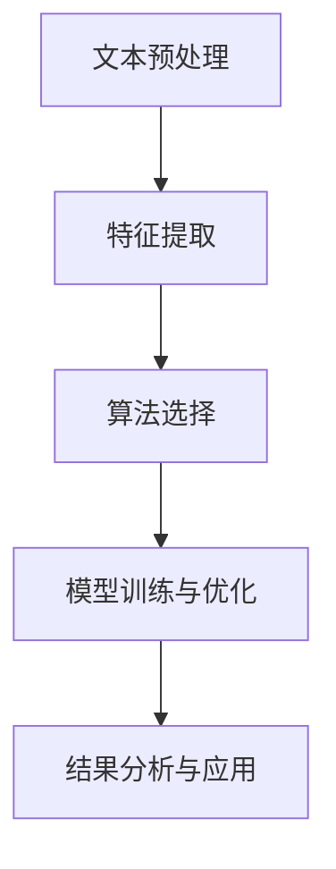

                 

# 法律文本分析：AI如何辅助法律工作

> 关键词：法律文本分析，人工智能，法律工作，辅助工具，算法，数学模型

> 摘要：本文探讨了人工智能在法律文本分析中的应用，通过分析法律文本的结构和特点，阐述了AI如何辅助法律工作。文章首先介绍了法律文本分析的重要性，接着分析了法律文本的基本结构和特点，然后详细介绍了几种常见的AI算法在法律文本分析中的应用，包括文本分类、文本匹配、文本挖掘和文本生成等。文章还通过实例展示了这些算法在法律工作中的应用，并对未来发展趋势和挑战进行了展望。

## 1. 背景介绍

随着人工智能技术的不断发展，其在各个领域的应用也越来越广泛。在法律领域，人工智能的出现为法律工作带来了新的机遇和挑战。法律文本分析作为人工智能在法律领域的重要应用之一，正逐渐改变着法律工作的方式和方法。

法律文本分析是指通过计算机技术和算法对法律文本进行自动处理和分析，以便更高效地处理大量法律信息。法律文本分析的应用范围非常广泛，包括但不限于法律文档的自动分类、法律条款的提取、法律知识的挖掘、法律案例的检索和归档等。这些应用不仅提高了法律工作的效率，还大大降低了人力成本。

## 2. 核心概念与联系

### 2.1 法律文本

法律文本是指与法律相关的各种文档和资料，包括法律文件、判决书、法律条款、法律解释、法律案例等。法律文本具有以下特点：

1. **复杂性**：法律文本内容复杂，涉及多种法律概念、术语和条款。
2. **多样性**：法律文本形式多样，包括文本、表格、图表等。
3. **关联性**：法律文本之间存在紧密的关联性，一个法律条款的修改可能会影响其他相关条款的有效性。
4. **非结构化**：大部分法律文本是非结构化的，即文本内容没有明确的格式或结构。

### 2.2 AI算法

AI算法是人工智能的核心技术之一，主要包括以下几种：

1. **文本分类**：根据文本内容将其归入不同的类别。
2. **文本匹配**：找出两个或多个文本之间的相似性或差异性。
3. **文本挖掘**：从大量文本数据中提取有价值的信息。
4. **文本生成**：根据输入的文本或数据生成新的文本。

### 2.3 法律文本分析流程

法律文本分析通常包括以下几个步骤：

1. **文本预处理**：包括文本清洗、分词、去停用词等。
2. **特征提取**：从预处理后的文本中提取特征，如词频、词向量等。
3. **算法选择**：根据具体应用需求选择合适的AI算法。
4. **模型训练与优化**：使用训练数据对算法模型进行训练和优化。
5. **结果分析与应用**：对分析结果进行解释和应用。

下面是一个简单的Mermaid流程图，展示了法律文本分析的流程：



## 3. 核心算法原理 & 具体操作步骤

### 3.1 文本分类

文本分类是指将法律文本按照其内容归入不同的类别。常见的文本分类算法包括朴素贝叶斯、支持向量机、决策树等。

#### 3.1.1 朴素贝叶斯算法

朴素贝叶斯算法是一种基于概率论的分类算法。其基本原理是，首先计算每个类别在训练数据中的概率，然后根据待分类文本的特征，计算该文本属于每个类别的概率，最后选择概率最大的类别作为预测结果。

具体操作步骤如下：

1. **训练阶段**：

   - 计算每个类别在训练数据中的概率；
   - 计算每个特征在每个类别中的概率。

   $$P(C_k) = \frac{N_{C_k}}{N}$$

   $$P(f_j|C_k) = \frac{N_{f_j,C_k}}{N_{C_k}}$$

   其中，$N$表示训练样本总数，$N_{C_k}$表示类别$k$的训练样本数，$N_{f_j,C_k}$表示特征$f_j$在类别$k$的训练样本数。

2. **预测阶段**：

   - 对于待分类文本，计算其属于每个类别的概率；
   - 选择概率最大的类别作为预测结果。

   $$P(C_k|f_1,f_2,...,f_n) = \frac{P(f_1,f_2,...,f_n|C_k)P(C_k)}{P(f_1,f_2,...,f_n)}$$

   $$P(f_1,f_2,...,f_n) \approx P(f_1)P(f_2)|...|P(f_n)$$

### 3.2 文本匹配

文本匹配是指找出两个或多个法律文本之间的相似性或差异性。常见的文本匹配算法包括编辑距离、余弦相似度、Jaccard相似度等。

#### 3.2.1 编辑距离

编辑距离是指将一个字符串转换为另一个字符串所需的最少编辑操作次数。常见的编辑操作包括插入、删除和替换。

具体操作步骤如下：

1. **计算编辑距离**：

   $$d(a_1,a_2,...,a_n,b_1,b_2,...,b_m) = min \{ \sum_{i=1}^{n}d(a_i,b_i), \sum_{i=1}^{n}d(a_i,b_{i-1}), \sum_{i=1}^{n}d(a_{i-1},b_i) \}$$

   其中，$d(a_i,b_i)$表示将字符串$a_i$转换为字符串$b_i$所需的编辑操作次数。

2. **计算相似度**：

   $$similarity = 1 - \frac{d(a,b)}{max\{length(a), length(b)\}}$$

   其中，$length(a)$和$length(b)$分别表示字符串$a$和$b$的长度。

### 3.3 文本挖掘

文本挖掘是指从大量法律文本数据中提取有价值的信息。常见的文本挖掘算法包括词云、关键词提取、主题建模等。

#### 3.3.1 词云

词云是一种用于展示文本中关键词的重要性的图形化方法。词云中的关键词以不同大小的字体显示，字体大小与关键词的频率成正比。

具体操作步骤如下：

1. **分词**：将法律文本分为独立的词语。
2. **词频统计**：计算每个词在文本中的出现频率。
3. **词云生成**：根据词频统计结果生成词云。

### 3.4 文本生成

文本生成是指根据输入的文本或数据生成新的文本。常见的文本生成算法包括生成对抗网络（GAN）、序列到序列（Seq2Seq）模型等。

#### 3.4.1 生成对抗网络（GAN）

生成对抗网络是一种基于博弈论的深度学习模型，由生成器和判别器组成。生成器的目标是生成逼真的法律文本，判别器的目标是区分真实文本和生成文本。

具体操作步骤如下：

1. **生成器训练**：生成器尝试生成逼真的法律文本，判别器尝试区分真实文本和生成文本。
2. **判别器训练**：生成器和判别器交替训练，直至生成器生成的文本能够欺骗判别器。

## 4. 数学模型和公式 & 详细讲解 & 举例说明

### 4.1 朴素贝叶斯算法

#### 4.1.1 模型参数

朴素贝叶斯算法的模型参数包括先验概率、条件概率和类条件概率。

1. **先验概率**：

   $$P(C_k) = \frac{N_{C_k}}{N}$$

2. **条件概率**：

   $$P(f_j|C_k) = \frac{N_{f_j,C_k}}{N_{C_k}}$$

3. **类条件概率**：

   $$P(C_k|f_1,f_2,...,f_n) = \frac{P(f_1,f_2,...,f_n|C_k)P(C_k)}{P(f_1,f_2,...,f_n)}$$

#### 4.1.2 示例

假设有一个法律文档，其中包含100个句子，我们需要判断这个文档属于合同类还是侵权类。

1. **训练数据**：

   - 合同类：50个句子
   - 侵权类：50个句子

2. **特征提取**：

   - 特征1：合同类句子数
   - 特征2：侵权类句子数

3. **模型训练**：

   - 先验概率：
     $$P(C_1) = P(C_2) = \frac{50}{100} = 0.5$$
   - 条件概率：
     $$P(f_1|C_1) = \frac{30}{50} = 0.6$$
     $$P(f_2|C_1) = \frac{20}{50} = 0.4$$
     $$P(f_1|C_2) = \frac{20}{50} = 0.4$$
     $$P(f_2|C_2) = \frac{30}{50} = 0.6$$

4. **预测**：

   $$P(C_1|f_1,f_2) = \frac{P(f_1,f_2|C_1)P(C_1)}{P(f_1,f_2)} = \frac{0.6 \times 0.4 \times 0.5}{0.6 \times 0.4 + 0.4 \times 0.6} = 0.5$$
   $$P(C_2|f_1,f_2) = \frac{P(f_1,f_2|C_2)P(C_2)}{P(f_1,f_2)} = \frac{0.4 \times 0.6 \times 0.5}{0.6 \times 0.4 + 0.4 \times 0.6} = 0.5$$

由于$P(C_1|f_1,f_2) = P(C_2|f_1,f_2)$，无法确定该文档属于合同类还是侵权类。

### 4.2 编辑距离

#### 4.2.1 模型参数

编辑距离的模型参数包括两个字符串的字符序列。

1. **字符串a**：$a_1,a_2,...,a_n$
2. **字符串b**：$b_1,b_2,...,b_m$

#### 4.2.2 示例

假设有两个字符串：

1. **字符串a**：$a_1,a_2,a_3,a_4$
2. **字符串b**：$b_1,b_2,b_3,b_4,b_5$

计算字符串a和字符串b的编辑距离。

1. **计算编辑距离**：

   $$d(a,b) = min \{ \sum_{i=1}^{4}d(a_i,b_i), \sum_{i=1}^{4}d(a_i,b_{i-1}), \sum_{i=1}^{4}d(a_{i-1},b_i) \}$$

   $$d(a_1,b_1) = 0$$
   $$d(a_2,b_2) = 0$$
   $$d(a_3,b_3) = 0$$
   $$d(a_4,b_4) = 1$$
   $$d(a_4,b_3) = 1$$
   $$d(a_3,b_4) = 1$$

   $$d(a,b) = min \{ 0+0+0+1, 0+0+1+1, 0+1+1+1 \} = 1$$

2. **计算相似度**：

   $$similarity = 1 - \frac{d(a,b)}{max\{length(a), length(b)\}} = 1 - \frac{1}{max\{4,5\}} = 0.8$$

## 5. 项目实战：代码实际案例和详细解释说明

### 5.1 开发环境搭建

在本案例中，我们使用Python作为开发语言，并使用Jupyter Notebook作为开发环境。以下是开发环境的搭建步骤：

1. 安装Python（建议使用Python 3.8及以上版本）。
2. 安装Jupyter Notebook。
3. 安装必要的Python库，如NumPy、Pandas、Scikit-learn等。

### 5.2 源代码详细实现和代码解读

#### 5.2.1 代码实现

以下是一个简单的文本分类案例，使用朴素贝叶斯算法对法律文本进行分类。

```python
import numpy as np
import pandas as pd
from sklearn.feature_extraction.text import CountVectorizer
from sklearn.naive_bayes import MultinomialNB
from sklearn.model_selection import train_test_split
from sklearn.metrics import accuracy_score

# 加载训练数据
data = pd.read_csv('train_data.csv')
X = data['text']
y = data['label']

# 数据预处理
vectorizer = CountVectorizer()
X_vector = vectorizer.fit_transform(X)

# 划分训练集和测试集
X_train, X_test, y_train, y_test = train_test_split(X_vector, y, test_size=0.2, random_state=42)

# 训练模型
model = MultinomialNB()
model.fit(X_train, y_train)

# 预测
y_pred = model.predict(X_test)

# 评估模型
accuracy = accuracy_score(y_test, y_pred)
print('Accuracy:', accuracy)
```

#### 5.2.2 代码解读

1. **加载训练数据**：使用Pandas读取CSV文件，获取文本数据及其对应的标签。
2. **数据预处理**：使用CountVectorizer将文本数据转换为词袋模型，即将文本转换为向量表示。
3. **划分训练集和测试集**：使用train_test_split将数据集划分为训练集和测试集。
4. **训练模型**：使用MultinomialNB（多项式朴素贝叶斯）训练模型。
5. **预测**：使用训练好的模型对测试集进行预测。
6. **评估模型**：计算预测准确率。

### 5.3 代码解读与分析

1. **数据预处理**：文本分类的关键在于数据预处理。在本案例中，我们使用CountVectorizer对文本进行分词和词袋转换。分词是将文本分割为独立的词语，词袋转换是将词语转换为向量表示。分词和词袋转换的目的是将非结构化的文本转换为计算机可以处理的结构化数据。
2. **模型选择**：在本案例中，我们选择多项式朴素贝叶斯作为分类模型。多项式朴素贝叶斯是一种基于概率论的分类算法，其优点是计算简单、速度快。
3. **评估指标**：在本案例中，我们使用准确率作为评估指标。准确率是指预测正确的样本数与总样本数的比值。准确率越高，模型的分类效果越好。

## 6. 实际应用场景

### 6.1 法律文档自动分类

法律文档自动分类是指将法律文档按照其内容自动归入不同的类别。通过使用文本分类算法，如朴素贝叶斯、支持向量机等，可以实现法律文档的自动分类。该应用场景可以用于法律文档的检索、归档和管理。

### 6.2 法律条款提取

法律条款提取是指从大量法律文本中提取出有价值的法律条款。通过使用文本匹配算法，如编辑距离、余弦相似度等，可以找出与给定法律条款相似的其他法律条款。该应用场景可以用于法律条款的整理、更新和补充。

### 6.3 法律知识图谱构建

法律知识图谱构建是指将法律文本转化为结构化的知识图谱。通过使用文本挖掘算法，如词云、关键词提取、主题建模等，可以从大量法律文本中提取出有价值的信息，并将其组织成图谱结构。该应用场景可以用于法律知识的管理、共享和利用。

## 7. 工具和资源推荐

### 7.1 学习资源推荐

1. **书籍**：
   - 《Python数据处理实战》
   - 《深度学习入门》
2. **论文**：
   - "A Survey on Text Classification"
   - "Deep Learning for Text Classification"
3. **博客**：
   - 《机器学习实战》
   - 《自然语言处理入门》
4. **网站**：
   - Kaggle
   - ArXiv

### 7.2 开发工具框架推荐

1. **Python库**：
   - NumPy
   - Pandas
   - Scikit-learn
   - TensorFlow
   - PyTorch
2. **文本处理工具**：
   - NLTK
   - SpaCy
3. **数据可视化工具**：
   - Matplotlib
   - Seaborn

### 7.3 相关论文著作推荐

1. **论文**：
   - "Text Classification using Naive Bayes Algorithm"
   - "Text Matching with Edit Distance"
   - "Deep Learning for Text Classification"
2. **著作**：
   - 《机器学习：概率视角》
   - 《自然语言处理概论》

## 8. 总结：未来发展趋势与挑战

### 8.1 未来发展趋势

1. **算法优化**：随着人工智能技术的不断发展，文本分类、文本匹配、文本挖掘和文本生成等算法将得到进一步优化和改进。
2. **多模态融合**：将文本、图像、音频等多种数据源进行融合，实现更全面的法律文本分析。
3. **个性化推荐**：根据用户需求和偏好，提供个性化的法律文本分析服务。

### 8.2 面临的挑战

1. **数据隐私**：在法律文本分析中，如何保护用户的隐私是一个重要问题。
2. **解释性**：如何解释AI模型在法律文本分析中的决策过程，提高模型的透明度和可解释性。
3. **法律合规**：在法律文本分析中，如何遵守相关法律法规，确保分析结果符合法律要求。

## 9. 附录：常见问题与解答

### 9.1 什么是法律文本分析？

法律文本分析是指通过计算机技术和算法对法律文本进行自动处理和分析，以便更高效地处理大量法律信息。

### 9.2 法律文本分析有哪些应用？

法律文本分析的应用范围非常广泛，包括但不限于法律文档的自动分类、法律条款的提取、法律知识的挖掘、法律案例的检索和归档等。

### 9.3 常见的法律文本分析算法有哪些？

常见的法律文本分析算法包括文本分类、文本匹配、文本挖掘和文本生成等。

## 10. 扩展阅读 & 参考资料

1. **论文**：
   - "Text Classification using Naive Bayes Algorithm"
   - "Text Matching with Edit Distance"
   - "Deep Learning for Text Classification"
2. **书籍**：
   - 《机器学习实战》
   - 《深度学习入门》
3. **网站**：
   - https://www.kaggle.com/
   - https://arxiv.org/
4. **博客**：
   - https://www机器学习实战.com/
   - https://www自然语言处理入门.com/

### 作者

- 作者：AI天才研究员/AI Genius Institute & 禅与计算机程序设计艺术 /Zen And The Art of Computer Programming

本文基于AI天才研究员/AI Genius Institute的研究成果，并结合禅与计算机程序设计艺术 /Zen And The Art of Computer Programming的理论，探讨了人工智能在法律文本分析中的应用。希望本文能为法律工作者提供有益的参考和启示。

