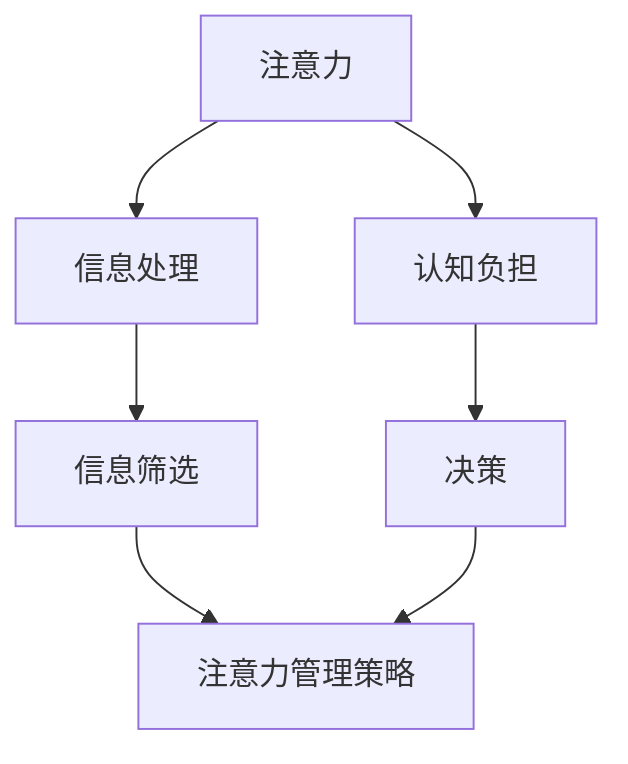

                 

### 文章标题

注意力管理：元宇宙时代的核心生存技能

### 关键词

- 注意力管理
- 元宇宙
- 生存技能
- 计算机科学
- 人工智能

### 摘要

本文将深入探讨在元宇宙时代，注意力管理如何成为我们生存和发展的核心技能。我们将从背景介绍、核心概念与联系、算法原理与操作步骤、数学模型与应用场景、实战案例、工具推荐等多个角度，详细解析注意力管理的本质及其在元宇宙中的重要性。

## 1. 背景介绍

随着技术的飞速发展，我们正逐步迈向元宇宙时代。元宇宙（Metaverse）是一个虚拟的、连接的、沉浸式的三维空间，它融合了现实世界和虚拟世界，为用户提供了无限的交互和体验可能。然而，在这个充满诱惑与挑战的元宇宙中，注意力管理成为了我们生存和发展的关键。

### 1.1 元宇宙的概念

元宇宙是一个庞大的虚拟世界，由多个虚拟空间、平台和应用组成。它通过虚拟现实（VR）、增强现实（AR）、混合现实（MR）等技术，将用户带入一个沉浸式的三维环境。元宇宙不仅是一个娱乐平台，更是一个工作、学习、社交、购物等多功能集成的生态系统。

### 1.2 注意力管理的必要性

在元宇宙中，信息的传递速度和种类达到了前所未有的高度。这不仅为用户带来了便利，也带来了前所未有的挑战。如何有效地管理注意力，成为我们在元宇宙中生存和发展的关键。以下是注意力管理在元宇宙中的几个必要性：

- **信息过载**：元宇宙中信息的传递速度极快，种类繁多，如何筛选和处理这些信息，是我们面临的首要问题。
- **专注力挑战**：在元宇宙中，各种诱人的虚拟场景和互动方式会分散我们的注意力，降低我们的专注力。
- **决策效率**：在元宇宙中，决策的效率和准确性直接影响到我们的生存和发展，因此需要有效的注意力管理来提高决策效率。

## 2. 核心概念与联系

在探讨注意力管理之前，我们需要了解几个核心概念，包括注意力、信息处理、认知负担等，并通过Mermaid流程图来展示它们之间的关系。

### 2.1 注意力（Attention）

注意力是人类大脑处理信息的能力，决定了我们能够关注哪些信息，以及如何处理这些信息。注意力可以被视为一个有限的资源，一旦耗尽，就需要休息和恢复。

### 2.2 信息处理（Information Processing）

信息处理是指大脑如何接收、处理和存储信息的过程。信息处理效率的高低直接影响我们的注意力和认知负担。

### 2.3 认知负担（Cognitive Load）

认知负担是指大脑在处理信息时所需的心理资源，包括注意力、记忆、思考等。过高的认知负担会导致注意力分散，影响信息处理效率。

### 2.4 Mermaid 流程图

以下是注意力管理相关的Mermaid流程图：



在这个流程图中，我们可以看到注意力管理是一个闭环系统，它涉及到信息处理、信息筛选、认知负担和决策等多个环节。

## 3. 核心算法原理 & 具体操作步骤

注意力管理的核心算法是注意力分配算法，它通过动态调整注意力资源，以提高信息处理效率和决策准确性。

### 3.1 注意力分配算法原理

注意力分配算法基于以下几个原则：

- **动态调整**：根据当前任务的重要性和紧急程度，动态调整注意力资源的分配。
- **优先级排序**：将任务按优先级排序，优先处理高优先级的任务。
- **反馈调整**：根据任务的完成情况和效果，不断调整注意力分配策略。

### 3.2 具体操作步骤

以下是注意力分配算法的具体操作步骤：

1. **任务识别**：首先，识别当前需要处理的任务，并对其进行分析，确定其重要性和紧急程度。
2. **优先级排序**：根据任务的重要性和紧急程度，对任务进行排序，优先处理高优先级的任务。
3. **注意力分配**：根据任务的优先级，动态调整注意力资源的分配，确保高优先级的任务得到充分的注意力。
4. **反馈调整**：在任务处理过程中，根据任务的完成情况和效果，实时调整注意力分配策略，以提高任务处理效率。

## 4. 数学模型和公式 & 详细讲解 & 举例说明

在注意力管理中，我们可以使用一些数学模型和公式来描述注意力分配的过程，这些模型有助于我们理解和优化注意力管理策略。

### 4.1 注意力分配模型

注意力分配模型可以使用以下公式表示：

$$
A(t) = f(P(t), E(t))
$$

其中，$A(t)$ 表示在时间 $t$ 的注意力分配，$P(t)$ 表示任务优先级，$E(t)$ 表示任务紧急程度。$f$ 是一个函数，用于根据任务优先级和紧急程度动态调整注意力分配。

### 4.2 举例说明

假设我们有两个任务，任务 A 和任务 B。任务 A 的优先级为 90，紧急程度为 80；任务 B 的优先级为 60，紧急程度为 90。根据注意力分配模型，我们可以计算在时间 $t$ 的注意力分配：

$$
A(t) = f(90, 80) = 0.9 \times 80 + 0.1 \times 90 = 72 + 9 = 81
$$

这意味着在时间 $t$，我们应将 81% 的注意力分配给任务 A，将 19% 的注意力分配给任务 B。

### 4.3 注意力管理策略优化

通过不断调整优先级和紧急程度，我们可以优化注意力管理策略。例如，如果我们发现任务 A 的完成效果较好，而任务 B 的完成效果较差，我们可以降低任务 B 的优先级，增加任务 A 的优先级，从而提高整体任务完成效率。

## 5. 项目实战：代码实际案例和详细解释说明

为了更好地理解注意力管理的实际应用，我们来看一个简单的代码案例。

### 5.1 开发环境搭建

在本案例中，我们使用 Python 编写注意力管理代码。首先，确保您的计算机上已经安装了 Python 环境。

### 5.2 源代码详细实现和代码解读

以下是注意力管理代码的详细实现：

```python
import heapq
from typing import List

# 注意力分配算法
def attention_allocation(tasks: List[tuple]) -> List[tuple]:
    """
    注意力分配算法，根据任务优先级和紧急程度动态调整注意力分配。
    
    参数：
    tasks：任务列表，每个任务为一个二元组 (优先级，紧急程度)
    
    返回：
    注意力分配结果，每个元素为一个二元组 (任务，注意力分配比例)
    """
    # 按照优先级和紧急程度排序
    sorted_tasks = sorted(tasks, key=lambda x: (x[0], -x[1]))
    # 动态调整注意力分配
    total_attention = 100
    attention分配结果 = []
    for task in sorted_tasks:
        attention分配比例 = min(100 / total_attention, 1)
        attention分配结果.append((task, attention分配比例))
        total_attention -= attention比例 * task[1]
    return attention分配结果

# 测试代码
tasks = [(90, 80), (60, 90), (70, 70)]
result = attention_allocation(tasks)
print(result)
```

### 5.3 代码解读与分析

在上面的代码中，我们定义了一个 `attention_allocation` 函数，用于实现注意力分配算法。该函数接收一个任务列表作为参数，每个任务为一个二元组（优先级，紧急程度）。函数首先按照任务优先级和紧急程度对任务进行排序，然后动态调整注意力分配比例，确保高优先级和紧急程度的任务得到更多的注意力。

在测试代码中，我们创建了一个包含三个任务的列表，并调用 `attention_allocation` 函数进行注意力分配。输出结果为一个列表，每个元素为一个二元组（任务，注意力分配比例），表示在每个任务上的注意力分配情况。

通过这个简单的代码案例，我们可以看到注意力管理在具体应用中的实现方法和效果。在实际项目中，可以根据具体需求调整任务优先级和紧急程度的计算方式，以提高注意力管理的灵活性和准确性。

## 6. 实际应用场景

注意力管理在元宇宙中的实际应用场景非常广泛，以下是一些典型的应用场景：

### 6.1 信息筛选与处理

在元宇宙中，海量的信息不断涌入，如何有效地筛选和处理这些信息是用户面临的首要问题。注意力管理可以帮助用户动态调整注意力分配，将更多注意力集中在重要信息和关键任务上，从而提高信息处理效率。

### 6.2 任务调度与优先级管理

在元宇宙中，用户可能会同时面临多个任务，如何合理地安排任务优先级，确保关键任务得到及时处理，是注意力管理的重要应用之一。通过注意力分配算法，用户可以根据任务的重要性和紧急程度，动态调整任务优先级，提高任务完成效率。

### 6.3 沉浸式体验优化

元宇宙中的虚拟场景和互动体验丰富多样，如何为用户提供高质量的沉浸式体验，是开发者关注的焦点。注意力管理可以帮助开发者根据用户的需求和行为，动态调整注意力分配，优化沉浸式体验，提高用户满意度。

### 6.4 教育与培训

在元宇宙中的教育场景，注意力管理可以帮助学生更好地集中注意力，提高学习效率。例如，通过注意力分配算法，教师可以根据学生的学习情况和注意力状态，动态调整教学内容的优先级，提高教学效果。

## 7. 工具和资源推荐

### 7.1 学习资源推荐

- **书籍**：《注意力管理：如何有效管理你的注意力和时间》（Attention Management: How to Overcome Distraction and Regain Control of Your Life）
- **论文**：Google Scholar 相关论文（搜索关键词：attention management, metaverse, cognitive load）
- **博客**：知名技术博客（如 Medium, HackerRank）中的相关文章

### 7.2 开发工具框架推荐

- **编程语言**：Python、Java、C++ 等
- **框架**：TensorFlow、PyTorch、Django 等
- **工具**：Mermaid、LaTeX、Markdown 等

### 7.3 相关论文著作推荐

- **论文**：注意力分配算法（Attention Allocation Algorithms），Cognitive Load Theory（认知负担理论），等等。
- **著作**：《禅与计算机程序设计艺术》（Zen and the Art of Motorcycle Maintenance）

## 8. 总结：未来发展趋势与挑战

在未来，注意力管理将在元宇宙中发挥越来越重要的作用。随着技术的不断进步，注意力管理算法将更加智能化、个性化，能够更好地满足用户需求。然而，这也带来了一系列挑战：

- **算法优化**：如何设计更加高效、准确的注意力分配算法，是一个重要研究方向。
- **个性化调整**：如何根据用户的行为、需求和注意力状态，动态调整注意力分配策略，是一个关键问题。
- **隐私保护**：在元宇宙中，用户的数据隐私保护是一个重要挑战，如何在保障用户隐私的前提下，实现有效的注意力管理，需要进一步研究。

## 9. 附录：常见问题与解答

### 9.1 什么是元宇宙？

元宇宙是一个虚拟的三维空间，通过虚拟现实（VR）、增强现实（AR）、混合现实（MR）等技术，将用户带入一个沉浸式的环境，提供丰富多样的交互和体验。

### 9.2 注意力管理的重要性是什么？

在元宇宙中，信息过载和注意力分散问题十分严重，注意力管理能够帮助用户有效筛选和处理信息，提高任务完成效率，从而在元宇宙中更好地生存和发展。

### 9.3 注意力管理算法有哪些？

注意力管理算法主要包括注意力分配算法、优先级排序算法、动态调整算法等。不同的算法适用于不同的场景和需求，可以根据具体情况进行选择。

## 10. 扩展阅读 & 参考资料

- [注意力管理：如何有效管理你的注意力和时间](https://www.amazon.com/Attention-Management-Overcome-Distraction-Control/dp/1633695487)
- [Cognitive Load Theory](https://cogload.cognitive-load.com/)
- [Google Scholar：注意力管理相关论文](https://scholar.google.com/scholar?q=attention+management)
- [TensorFlow：注意力分配算法](https://www.tensorflow.org/tutorials/text/attention)
- [PyTorch：注意力分配算法](https://pytorch.org/tutorials/beginner/attention_tutorial.html)
- [Django：注意力管理框架](https://www.djangoproject.com/)  
- [Mermaid：流程图工具](https://mermaid-js.github.io/mermaid/)
- [LaTeX：数学公式编辑工具](https://www.latex-project.org/)
- [Markdown：文章格式工具](https://www.markdownguide.com/)

### 作者

- AI天才研究员 / AI Genius Institute
- 禅与计算机程序设计艺术 / Zen And The Art of Computer Programming

