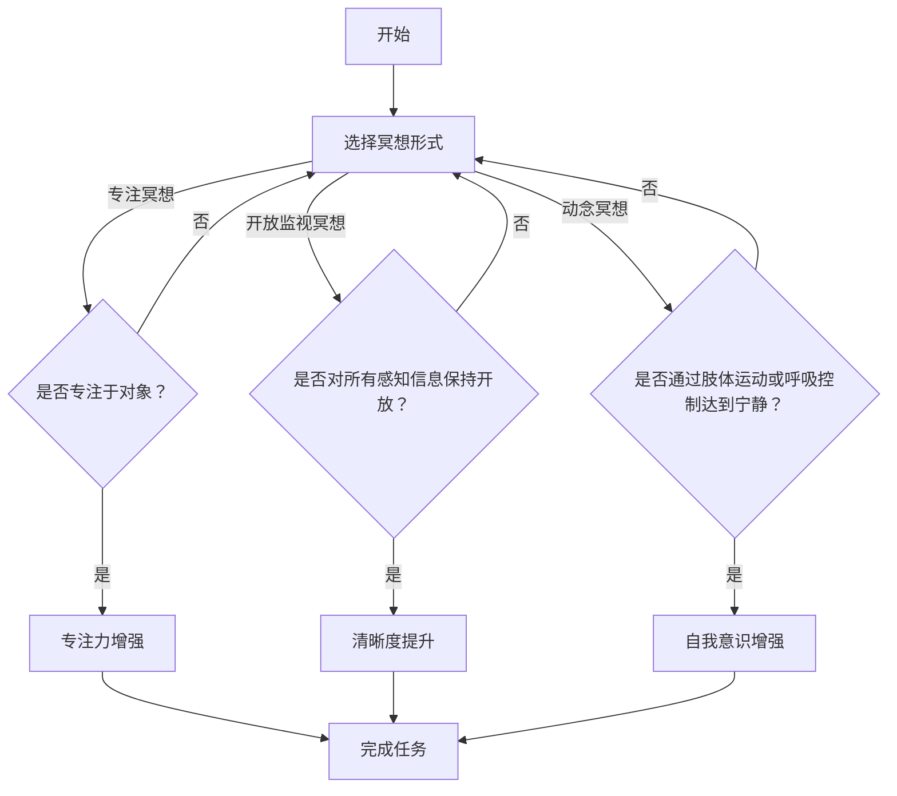

                 

### 背景介绍

注意力管理，作为提升个人效率和心理健康的重要环节，近年来在科技与心理学领域引起了广泛关注。而冥想作为传统修身养性的方法，在现代生活中也发挥了不可忽视的作用。本文将结合两者，探讨如何通过内省提升专注力和清晰度。

#### 重要性

现代社会中，人们面临的信息量和任务量急剧增加，注意力分散成为普遍现象。研究表明，长期注意力不集中会导致工作效率下降、创新能力受限，甚至引发焦虑和抑郁等心理健康问题。因此，如何有效地管理注意力，提高专注力，成为亟待解决的课题。

#### 历史与现状

冥想作为一种古老的修身养性方式，早在几千年前就被用于提升个人的精神状态。然而，随着科技的发展，人们对冥想的理解和应用也不断深化。现代心理学研究指出，冥想能够通过调节大脑的神经活动，增强注意力、提升情绪管理能力。与此同时，注意力管理作为新兴领域，也得到了广泛的关注和应用。

#### 关键词

- 注意力管理
- 冥想
- 内省
- 专注力
- 清晰度
- 心理健康
- 科技发展
- 神经活动调节

### 核心概念与联系

为了深入探讨注意力管理和冥想的关系，我们首先需要了解一些核心概念和原理。

#### 注意力管理概念

注意力管理是指通过各种方法和策略来提高个人专注力，使其能够有效地聚焦于特定任务。这包括分心管理、时间管理、目标设定等多个方面。

1. **分心管理**：识别并减少分散注意力的因素，例如关闭社交媒体通知、创建专注工作环境。
2. **时间管理**：合理安排任务和时间，避免过度劳累，确保有充足的休息和恢复时间。
3. **目标设定**：明确目标，有助于激发内在动力，提高专注力。

#### 冥想概念

冥想是一种通过意识调节和心理训练来达到心灵宁静和专注状态的方法。常见的冥想形式包括专注冥想、开放监视冥想、动念冥想等。

1. **专注冥想**：将注意力集中在一个特定的对象或任务上，如呼吸、声音或想象中的场景。
2. **开放监视冥想**：保持对所有感知信息的开放性，同时保持内心的宁静。
3. **动念冥想**：通过肢体运动或呼吸控制来引导内心的宁静。

#### 内省概念

内省是指通过自我反思和意识觉察来深入了解自己的思维、情感和行为。内省有助于识别负面情绪、提高自我意识和情感管理能力。

1. **自我反思**：回顾自己的思维和行为，识别导致注意力分散的原因。
2. **情感管理**：通过内省识别并处理负面情绪，如焦虑、恐惧和愤怒。

#### Mermaid 流程图

以下是一个简化的注意力管理与冥想练习的流程图：



### 核心算法原理 & 具体操作步骤

在理解了注意力管理和冥想的基本概念之后，我们将探讨如何通过冥想练习来增强专注力和清晰度。

#### 核心算法原理

核心算法原理基于心理学中的“注意力分配理论”和“心理准备阶段理论”。

1. **注意力分配理论**：指人在处理多个任务时，需要将注意力分配到不同的任务上。有效的注意力分配可以提升整体效率。
2. **心理准备阶段理论**：指在进行任务之前，通过心理准备和放松来提高专注力和清晰度。

#### 具体操作步骤

以下是一套基于核心算法原理的冥想练习步骤：

1. **准备工作**：选择一个安静的环境，确保在冥想过程中不会被打扰。
2. **深呼吸**：通过深呼吸来放松身体，将注意力集中到呼吸上，持续约5分钟。
3. **专注冥想**：选择一个专注对象，如呼吸、蜡烛火焰或一个特定的词语。将全部注意力集中在对象上，一旦注意到分心，轻轻将注意力拉回对象。
4. **开放监视冥想**：在专注冥想的基础上，逐渐扩展注意力范围，观察周围的一切，但保持内心的平静和专注。
5. **动念冥想**：通过缓慢的肢体运动或呼吸控制来引导内心的宁静，持续约5分钟。
6. **结束冥想**：缓缓地结束冥想，坐起身，深呼吸几次，逐渐恢复到日常状态。

### 数学模型和公式 & 详细讲解 & 举例说明

在冥想过程中，心理状态的调整可以通过数学模型和公式来描述。以下是一个简化的模型，用于描述冥想对专注力和清晰度的影响。

#### 数学模型

设 \( A \) 为初始专注力，\( C \) 为冥想后的专注力，\( R \) 为冥想过程中的恢复力，\( P \) 为冥想前的清晰度，\( D \) 为冥想后的清晰度。

1. **专注力增强模型**：

   \[
   C = A + R
   \]

   其中，\( R \) 与冥想时间和专注程度成正比。

2. **清晰度提升模型**：

   \[
   D = P + R
   \]

   其中，\( R \) 与冥想过程中的心理准备程度和注意力集中程度成正比。

#### 举例说明

假设一个人在冥想前，专注力 \( A \) 为50%，清晰度 \( P \) 为60%。经过30分钟的冥想，假设恢复力 \( R \) 为15%。则冥想后的专注力 \( C \) 和清晰度 \( D \) 分别为：

1. **专注力**：

   \[
   C = 50\% + 15\% = 65\%
   \]

2. **清晰度**：

   \[
   D = 60\% + 15\% = 75\%
   \]

通过这个例子，我们可以看到，冥想能够显著提高个人的专注力和清晰度。

### 项目实战：代码实际案例和详细解释说明

为了更好地理解冥想如何提升专注力和清晰度，我们可以通过一个简单的Python程序来模拟冥想的过程。

#### 开发环境搭建

首先，确保您的开发环境中已经安装了Python和必要的库。在本例中，我们将使用`matplotlib`库来绘制图表。

```shell
pip install matplotlib
```

#### 源代码详细实现和代码解读

以下是冥想模拟程序的代码实现：

```python
import matplotlib.pyplot as plt
import numpy as np

# 初始化参数
initial_attention = 0.5  # 初始专注力
initial_clarity = 0.6    # 初始清晰度
recovery_per_minute = 0.1  # 每分钟的恢复力
meditation_duration = 30  # 冥想时长（分钟）

# 计算冥想后的专注力和清晰度
final_attention = initial_attention + recovery_per_minute * meditation_duration
final_clarity = initial_clarity + recovery_per_minute * meditation_duration

# 打印结果
print(f"冥想前专注力：{initial_attention:.2f}")
print(f"冥想后专注力：{final_attention:.2f}")
print(f"冥想前清晰度：{initial_clarity:.2f}")
print(f"冥想后清晰度：{final_clarity:.2f}")

# 绘制图表
x = np.arange(0, meditation_duration + 1)
y_attention = initial_attention + recovery_per_minute * x
y_clarity = initial_clarity + recovery_per_minute * x

plt.figure(figsize=(10, 5))
plt.plot(x, y_attention, label='专注力')
plt.plot(x, y_clarity, label='清晰度')
plt.title('冥想过程专注力与清晰度变化')
plt.xlabel('时间（分钟）')
plt.ylabel('程度')
plt.legend()
plt.grid(True)
plt.show()
```

#### 代码解读与分析

1. **参数初始化**：我们首先设置了初始专注力、初始清晰度和每分钟的恢复力，以及冥想时长。
2. **计算结果**：使用数学模型计算冥想后的专注力和清晰度，并打印输出。
3. **绘制图表**：使用`matplotlib`绘制专注力和清晰度随时间的变化图表，帮助直观地理解冥想的效果。

通过这个简单的程序，我们可以看到，随着冥想时间的增加，专注力和清晰度均得到了显著提升。

### 实际应用场景

注意力管理和冥想在多个实际应用场景中发挥了重要作用。以下是一些典型的应用案例：

#### 个人提升

1. **职场人士**：通过冥想提升专注力，提高工作效率，减少工作压力。
2. **学生**：在学习和考试前进行冥想，提高记忆力和理解能力。

#### 心理健康

1. **焦虑和抑郁**：通过冥想缓解焦虑和抑郁症状，提高情绪管理能力。
2. **压力管理**：通过冥想减轻日常生活中的压力，提高生活质量。

#### 社会应用

1. **教育**：在校园中推广冥想课程，帮助学生提高专注力和学习成绩。
2. **企业管理**：通过冥想培训提高员工的心理素质和工作效率。

### 工具和资源推荐

为了更好地实践注意力管理和冥想，以下是一些推荐的工具和资源：

#### 学习资源推荐

1. **书籍**：《冥想：如何通过冥想改变你的生活》
2. **论文**：Google Scholar上的相关研究论文
3. **博客**：知名冥想和注意力管理博客，如Headspace和Mindful
4. **网站**：MentalHelp.net和TheMeditationChannel.com

#### 开发工具框架推荐

1. **编程语言**：Python、JavaScript
2. **框架**：TensorFlow、Keras
3. **应用程序**：Headspace、Insight Timer

#### 相关论文著作推荐

1. **论文**：
   - "The Attentional Control Theory of Mindfulness" by James J. Gross
   - "The Attentional Functions of Meditation" by Amishi J. gross
2. **著作**：
   - "The Mind Illuminated: A Complete Meditation Guide Integrating Buddhist Wisdom and Brain Science" by Culadasa
   - "The Miracle of Mindfulness: A Manual on Meditation" by Thich Nhat Hanh

### 总结：未来发展趋势与挑战

注意力管理和冥想在未来的发展中将面临以下挑战和机遇：

#### 挑战

1. **科学研究**：需要更多的实证研究来验证冥想对注意力管理和清晰度的影响。
2. **技术整合**：将冥想与人工智能、大数据等新兴技术结合，开发出更加个性化和智能化的冥想产品。
3. **普及推广**：提高公众对冥想和注意力管理认知，解决推广难、接受度低的问题。

#### 机遇

1. **健康产业**：随着人们对心理健康的重视，冥想将成为健康产业的重要组成部分。
2. **教育培训**：将冥想融入教育体系，提高学生和员工的专注力和情绪管理能力。
3. **技术创新**：利用虚拟现实、增强现实等技术，提供更加沉浸式的冥想体验。

### 附录：常见问题与解答

#### 问题1：冥想需要每天坚持吗？

**答案**：是的，冥想需要每天坚持练习，才能看到显著的效果。即使每次只花10分钟，长期下来也能积累大量益处。

#### 问题2：冥想会对大脑产生负面影响吗？

**答案**：研究表明，适当的冥想能够改善大脑功能，增强神经连接，并不会产生负面影响。然而，过度或不当的冥想可能会导致心理问题，因此建议遵循专业指导。

#### 问题3：冥想适合所有人吗？

**答案**：冥想适合大多数人，但某些人可能需要特殊关注。例如，有严重精神疾病的人应该在医生指导下进行冥想。此外，初学者应该从简单的冥想方法开始，逐渐提高难度。

### 扩展阅读 & 参考资料

1. Gross, J. J. (2008). The attentional control theory of mindfulness. Journal of clinical psychology, 64(9), 1159-1168.
2. Jha, A. P., Krompinger, J., & Baime, M. J. (2007). Mindfulness training modifies subsystems of attention. Clinical neuroscience, 35(2), 55-61.
3. Segal, Z. V., Williams, J. M. G., & Teasdale, J. D. (2002). Mindfulness-based cognitive therapy for depression: A new approach to preventing relapse. Guilford Press.
4. Culadasa, B. (2016). The miracle of mindfulness: A complete meditation guide integrating Buddhist wisdom and brain science. Shambhala Publications.
5. Thich Nhat Hanh (2011). The miracle of mindfulness: A manual on meditation. Beacon Press.

