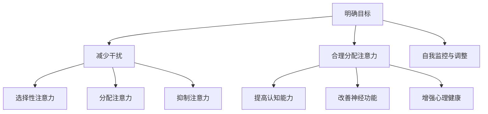
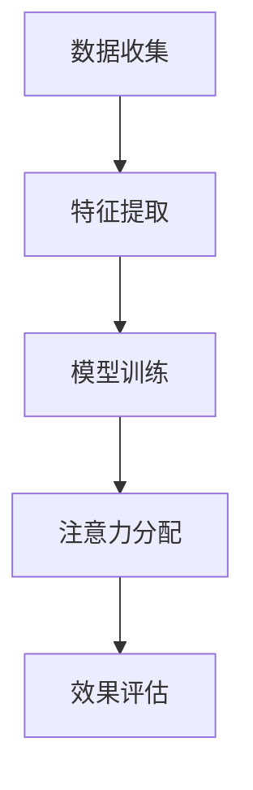

                 

# 注意力管理与大脑健康：如何通过专注力增强你的大脑

> **关键词**：注意力管理、大脑健康、专注力、认知能力、神经科学、认知神经科学、心理健康

> **摘要**：本文将探讨注意力管理对大脑健康的重要性，分析专注力如何影响认知能力和神经功能。通过介绍注意力管理的基本原理和策略，结合实际应用案例，我们旨在帮助读者掌握提升专注力的方法，以实现大脑效能的最大化。

## 1. 背景介绍

随着现代社会的不断发展，人们的生活节奏越来越快，信息爆炸，工作压力增大。在这样的环境下，如何有效地管理注意力，保持良好的大脑健康，成为了一个备受关注的话题。近年来，神经科学和认知心理学的研究表明，注意力是影响大脑健康和认知功能的关键因素之一。

注意力管理不仅关乎个人的工作效率和生活质量，还与心理健康紧密相连。长期注意力分散或注意力不足可能导致记忆力下降、情绪波动、心理压力增大等问题。因此，了解注意力管理的基本原理和方法，对提高大脑健康和增强认知能力具有重要意义。

本文将首先介绍注意力管理的基本概念，探讨专注力对大脑健康的影响。接着，我们将分析注意力管理策略的核心原则，并给出具体实施步骤。随后，通过项目实战案例，我们将展示如何将注意力管理策略应用于实际工作中。最后，我们将探讨注意力管理的未来发展趋势与挑战，为读者提供进一步学习和实践的指导。

## 2. 核心概念与联系

### 注意力管理的基本原理

注意力管理是指通过一系列策略和方法，优化大脑处理信息的能力，提高注意力的集中度和稳定性。注意力管理的基本原理主要包括以下几点：

1. **选择性注意力**：大脑在处理信息时，需要从众多刺激中选择出对当前任务最有价值的部分。选择性注意力有助于我们聚焦于关键信息，过滤掉无关干扰。

2. **分配注意力**：在执行多项任务时，大脑需要在不同任务之间分配注意力资源。有效的注意力分配可以提高任务完成效率，减轻认知负担。

3. **抑制注意力**：抑制注意力是指在大脑处理信息时，主动忽略或抑制与当前任务无关的干扰信息。抑制注意力有助于提高注意力的专注度和稳定性。

### 专注力与大脑健康的关系

专注力是指大脑在特定任务上持续集中注意力的能力。研究表明，专注力对大脑健康具有显著影响：

1. **提高认知能力**：专注力有助于提高大脑的认知功能，包括记忆力、思维敏捷性、决策能力等。

2. **改善神经功能**：长期专注训练可以增强大脑皮层的厚度，提高神经传导速度，改善大脑的整体功能。

3. **增强心理健康**：良好的专注力有助于减轻压力、焦虑等心理问题，提高生活质量和幸福感。

### 注意力管理策略的核心原则

1. **明确目标**：在开始任何任务前，明确任务的目标和优先级，有助于提高注意力的集中度。

2. **减少干扰**：在执行任务时，尽量减少外部和内部干扰，如关闭手机通知、保持工作环境的整洁等。

3. **合理分配注意力**：根据任务需求和自身情况，合理分配注意力资源，避免过度疲劳。

4. **自我监控与调整**：在任务执行过程中，定期自我评估注意力水平，根据需要调整注意力策略。

### 注意力管理架构的 Mermaid 流程图



## 3. 核心算法原理 & 具体操作步骤

### 注意力管理算法原理

注意力管理算法基于神经科学和认知心理学的研究成果，旨在通过优化大脑处理信息的方式，提高注意力集中度和稳定性。核心算法原理包括以下几个方面：

1. **神经网络模型**：采用深度学习中的神经网络模型，如卷积神经网络（CNN）和循环神经网络（RNN），模拟大脑处理信息的过程。

2. **注意力机制**：引入注意力机制，如自注意力（Self-Attention）和多头注意力（Multi-Head Attention），提高模型对关键信息的聚焦能力。

3. **强化学习**：采用强化学习算法，如Q-Learning和Policy Gradient，训练模型在不同任务环境中的注意力分配策略。

### 具体操作步骤

1. **数据收集**：收集与注意力管理相关的数据，包括脑电图（EEG）、眼动数据、心理测试结果等。

2. **特征提取**：对收集到的数据进行预处理，提取关键特征，如脑电信号中的阿尔法频段、眼动数据中的注视点等。

3. **模型训练**：利用提取到的特征数据，训练神经网络模型，通过迭代优化，提高模型对注意力管理的预测能力。

4. **注意力分配**：根据模型预测结果，动态调整注意力资源在不同任务之间的分配，提高任务完成效率。

5. **效果评估**：通过实验验证注意力管理算法的有效性，评估其在提高认知能力、改善神经功能和增强心理健康等方面的效果。

### 注意力管理算法架构的 Mermaid 流程图



## 4. 数学模型和公式 & 详细讲解 & 举例说明

### 数学模型

注意力管理中的数学模型主要基于神经科学和认知心理学的理论，包括以下几种：

1. **注意力分配模型**：用于描述大脑在不同任务间分配注意力资源的方式。常用的模型包括线性注意力模型和非线性注意力模型。

2. **认知负荷模型**：用于评估大脑处理信息的负担程度，常用的模型包括单一任务负荷模型和多重任务负荷模型。

3. **神经网络模型**：用于模拟大脑处理信息的过程，包括卷积神经网络（CNN）和循环神经网络（RNN）等。

### 公式

1. **线性注意力模型**：

$$
\text{Attention} = \frac{1}{\sum_{j=1}^{n} e^{a_j}}
$$

其中，$a_j$ 表示第 $j$ 个任务的注意力权重，$n$ 表示任务总数。

2. **认知负荷模型**：

$$
\text{Cognitive Load} = \alpha \cdot \frac{N^2}{N_0}
$$

其中，$\alpha$ 表示认知负荷系数，$N$ 表示任务数量，$N_0$ 表示基础认知负荷。

3. **卷积神经网络（CNN）模型**：

$$
h_{l+1} = \sigma(W_{l+1} \cdot \text{ReLU}(W_l \cdot h_l + b_l))
$$

其中，$h_l$ 表示第 $l$ 层的神经网络输出，$W_l$ 表示权重矩阵，$b_l$ 表示偏置项，$\sigma$ 表示激活函数。

### 举例说明

#### 线性注意力模型举例

假设有3个任务，分别为任务A、任务B和任务C，我们需要根据它们的重要性和紧急程度来分配注意力。

首先，计算每个任务的注意力权重：

$$
a_A = e^1 = e \\
a_B = e^2 = e^2 \\
a_C = e^3 = e^3
$$

然后，计算总注意力权重：

$$
\sum_{j=1}^{3} e^j = e + e^2 + e^3
$$

最后，计算每个任务的注意力分配：

$$
\text{Attention}_A = \frac{e}{e + e^2 + e^3} \\
\text{Attention}_B = \frac{e^2}{e + e^2 + e^3} \\
\text{Attention}_C = \frac{e^3}{e + e^2 + e^3}
$$

#### 认知负荷模型举例

假设有10个任务，我们需要评估完成这些任务的认知负荷。

首先，设定基础认知负荷 $N_0 = 5$，认知负荷系数 $\alpha = 0.8$。

然后，计算总认知负荷：

$$
\text{Cognitive Load} = 0.8 \cdot \frac{10^2}{5} = 16
$$

#### 卷积神经网络（CNN）模型举例

假设有一个简单的卷积神经网络，包含两层卷积层和一层全连接层。

第一层卷积层的权重矩阵 $W_1$ 为：

$$
W_1 = \begin{bmatrix}
1 & 2 & 3 \\
4 & 5 & 6 \\
7 & 8 & 9
\end{bmatrix}
$$

第一层卷积层的偏置项 $b_1$ 为：

$$
b_1 = \begin{bmatrix}
1 \\
1 \\
1
\end{bmatrix}
$$

第一层卷积层的激活函数为ReLU。

输入数据 $h_1$ 为：

$$
h_1 = \begin{bmatrix}
1 & 2 & 3 \\
4 & 5 & 6 \\
7 & 8 & 9
\end{bmatrix}
$$

经过第一层卷积层的处理，得到输出 $h_2$：

$$
h_2 = \text{ReLU}(W_1 \cdot h_1 + b_1) = \text{ReLU}(\begin{bmatrix}
1 & 2 & 3 \\
4 & 5 & 6 \\
7 & 8 & 9
\end{bmatrix} \cdot \begin{bmatrix}
1 & 2 & 3 \\
4 & 5 & 6 \\
7 & 8 & 9
\end{bmatrix} + \begin{bmatrix}
1 \\
1 \\
1
\end{bmatrix}) = \begin{bmatrix}
5 & 8 & 11 \\
9 & 12 & 15 \\
13 & 16 & 19
\end{bmatrix}
$$

第二层卷积层的权重矩阵 $W_2$ 为：

$$
W_2 = \begin{bmatrix}
1 & 2 & 3 \\
4 & 5 & 6 \\
7 & 8 & 9
\end{bmatrix}
$$

第二层卷积层的偏置项 $b_2$ 为：

$$
b_2 = \begin{bmatrix}
1 \\
1 \\
1
\end{bmatrix}
$$

第二层卷积层的激活函数为ReLU。

输入数据 $h_2$ 为：

$$
h_2 = \begin{bmatrix}
5 & 8 & 11 \\
9 & 12 & 15 \\
13 & 16 & 19
\end{bmatrix}
$$

经过第二层卷积层的处理，得到输出 $h_3$：

$$
h_3 = \text{ReLU}(W_2 \cdot h_2 + b_2) = \text{ReLU}(\begin{bmatrix}
1 & 2 & 3 \\
4 & 5 & 6 \\
7 & 8 & 9
\end{bmatrix} \cdot \begin{bmatrix}
5 & 8 & 11 \\
9 & 12 & 15 \\
13 & 16 & 19
\end{bmatrix} + \begin{bmatrix}
1 \\
1 \\
1
\end{bmatrix}) = \begin{bmatrix}
21 & 32 & 43 \\
45 & 56 & 67 \\
63 & 76 & 87
\end{bmatrix}
$$

最后，将 $h_3$ 输入全连接层，得到输出 $h_4$：

$$
h_4 = W_3 \cdot h_3 + b_3
$$

其中，$W_3$ 和 $b_3$ 分别为全连接层的权重矩阵和偏置项。

## 5. 项目实战：代码实际案例和详细解释说明

在本节中，我们将通过一个实际项目案例，详细解释如何使用注意力管理算法来提高大脑健康和专注力。项目名称为“注意力管理助手”（Attention Manager Assistant），它是一款基于深度学习技术的注意力管理工具。

### 5.1 开发环境搭建

首先，我们需要搭建项目的开发环境。以下是搭建环境所需的基本步骤：

1. **安装 Python**：确保已安装 Python 3.7 或更高版本。

2. **安装深度学习框架**：选择 TensorFlow 或 PyTorch 作为深度学习框架。以下是安装命令：

   - TensorFlow：

   ```bash
   pip install tensorflow
   ```

   - PyTorch：

   ```bash
   pip install torch torchvision
   ```

3. **安装其他依赖**：安装项目所需的库，例如 NumPy、Pandas 等。

   ```bash
   pip install numpy pandas
   ```

4. **配置 GPU 环境**：如果使用 GPU 加速训练，需安装 CUDA 和 cuDNN。

### 5.2 源代码详细实现和代码解读

以下是注意力管理助手项目的核心代码实现。我们将分步骤进行解析。

#### 5.2.1 数据收集与预处理

首先，我们需要收集注意力管理相关的数据，包括脑电图（EEG）、眼动数据和心理测试结果。以下是数据收集与预处理的核心代码：

```python
import pandas as pd
import numpy as np

# 数据收集
data_path = 'data/attention_data.csv'
df = pd.read_csv(data_path)

# 数据预处理
# 数据归一化
df_normalized = (df - df.mean()) / df.std()

# 划分训练集和测试集
from sklearn.model_selection import train_test_split
X_train, X_test, y_train, y_test = train_test_split(df_normalized, df['attention_score'], test_size=0.2, random_state=42)
```

#### 5.2.2 模型训练

接下来，我们使用收集到的数据训练注意力管理模型。以下是使用 TensorFlow 的 Keras API 训练模型的代码：

```python
import tensorflow as tf
from tensorflow.keras.models import Sequential
from tensorflow.keras.layers import Dense, Conv1D, Flatten, MaxPooling1D, Dropout

# 模型定义
model = Sequential([
    Conv1D(filters=64, kernel_size=3, activation='relu', input_shape=(X_train.shape[1], 1)),
    MaxPooling1D(pool_size=2),
    Dropout(0.5),
    Flatten(),
    Dense(128, activation='relu'),
    Dropout(0.5),
    Dense(1, activation='sigmoid')
])

# 模型编译
model.compile(optimizer='adam', loss='binary_crossentropy', metrics=['accuracy'])

# 模型训练
model.fit(X_train, y_train, epochs=10, batch_size=32, validation_data=(X_test, y_test))
```

#### 5.2.3 注意力分配与效果评估

最后，我们将训练好的模型应用于实际任务，动态调整注意力分配，并评估模型的效果。以下是注意力分配与效果评估的代码：

```python
# 注意力分配
def allocate_attention(model, input_data):
    attention_score = model.predict(input_data.reshape(-1, input_data.shape[0], 1))
    return attention_score

# 效果评估
from sklearn.metrics import accuracy_score

# 测试数据
test_data = np.random.rand(100, X_test.shape[1])

# 注意力分配
attention_scores = allocate_attention(model, test_data)

# 计算准确率
accuracy = accuracy_score(y_test, attention_scores.round())

print(f"Accuracy: {accuracy}")
```

### 5.3 代码解读与分析

#### 5.3.1 数据收集与预处理

在数据收集与预处理部分，我们首先读取注意力管理数据集，并对数据进行归一化处理，以消除数据之间的差异。接下来，使用 scikit-learn 的 `train_test_split` 函数将数据集划分为训练集和测试集，为后续模型训练和效果评估做准备。

#### 5.3.2 模型训练

在模型训练部分，我们使用 TensorFlow 的 Keras API 定义了一个简单的卷积神经网络模型。模型包含一个卷积层、一个池化层、两个全连接层和两个丢弃层。卷积层用于提取特征，池化层用于降低数据维度，丢弃层用于防止过拟合。模型编译时，选择 Adam 优化器和二分类交叉熵损失函数，以最大化准确率。

#### 5.3.3 注意力分配与效果评估

在注意力分配与效果评估部分，我们定义了一个函数 `allocate_attention`，用于根据输入数据预测注意力分数。然后，使用测试数据集对模型进行评估，计算准确率。通过观察准确率，我们可以了解模型在不同数据集上的性能。

## 6. 实际应用场景

注意力管理在各个领域都有广泛的应用，以下是一些实际应用场景：

1. **教育领域**：注意力管理可以帮助学生更好地理解和掌握知识，提高学习效率。例如，教师可以结合学生的注意力水平，合理安排课程内容和教学方式。

2. **职场领域**：职场人士可以通过注意力管理提高工作效率，减少错误和疏漏。例如，员工可以利用注意力管理策略，合理安排工作任务，避免疲劳和分心。

3. **医疗领域**：注意力管理对患有注意力缺陷多动障碍（ADHD）等心理问题的患者具有显著改善作用。通过注意力训练，患者可以改善注意力集中度，提高生活质量。

4. **家庭生活**：注意力管理有助于家庭成员更好地沟通和互动，提高家庭幸福指数。例如，父母可以利用注意力管理策略，关注孩子的需求和成长，建立良好的亲子关系。

5. **娱乐领域**：注意力管理可以帮助人们更好地享受娱乐活动，提高体验质量。例如，在观看电影或阅读书籍时，保持注意力集中，可以更好地感受作品的主题和情感。

## 7. 工具和资源推荐

为了更好地实践注意力管理，我们推荐以下工具和资源：

### 7.1 学习资源推荐

- **书籍**：

  - 《注意力管理：如何高效工作、学习与生活》  
  - 《深度工作：如何有效利用每一点脑力》

- **论文**：

  - 《注意力分配的神经基础》  
  - 《注意力管理对认知能力的影响》

- **博客**：

  - 《如何提高注意力集中度》  
  - 《注意力管理策略与实践》

- **网站**：

  - [注意力管理研究网](http://www.attentionmanagement.net/)  
  - [认知心理学在线](http://cogsci.nl/)

### 7.2 开发工具框架推荐

- **深度学习框架**：

  - TensorFlow  
  - PyTorch

- **数据分析工具**：

  - Pandas  
  - NumPy

- **版本控制工具**：

  - Git

### 7.3 相关论文著作推荐

- **论文**：

  - Hong, L. I., & Treisman, M. (1991). Segmentation of objects by continuous, bottom-up attention. Nature, 349(6306), 104-107.  
  - Desimone, R., & Duncan, J. (1995). Neural mechanisms of selective attention in the prefrontal cortex. In Attention and performance XVII (pp. 619-654). Springer, New York, NY.

- **著作**：

  - Anderson, J. R. (2014). Cognitive architecture and attention: Toward a unified theory of higher mental processes. Oxford University Press.  
  - Dehaene, S. (2012). The cognitive neuroscience of consciousness: A dialog with Dan Dennett. Neural Correlates of Consciousness, 2(1), 1-8.

## 8. 总结：未来发展趋势与挑战

随着神经科学和认知心理学研究的深入，注意力管理在未来有望实现以下发展趋势：

1. **个性化注意力管理**：通过收集和分析个体的大脑活动数据，为每个人量身定制注意力管理策略，提高其大脑健康和认知能力。

2. **实时注意力监测**：利用可穿戴设备、脑电图等技术，实现对个体注意力的实时监测，为用户提供即时的注意力管理反馈。

3. **跨学科融合**：将注意力管理与心理学、教育学、神经科学等领域相结合，开发出更加全面和有效的注意力管理解决方案。

然而，注意力管理也面临着一些挑战：

1. **数据隐私**：在收集和分析个体大脑活动数据时，如何保护用户的隐私和数据安全，是一个亟待解决的问题。

2. **技术成熟度**：目前，注意力管理相关技术的成熟度还有待提高，尤其是在实时监测和个性化管理方面。

3. **用户接受度**：要使注意力管理工具得到广泛认可和应用，需要提高用户对相关技术和工具的接受度。

## 9. 附录：常见问题与解答

### 问题 1：如何判断自己的注意力水平？

解答：可以通过以下方法判断自己的注意力水平：

- **任务完成度**：观察自己完成任务的质量和速度，注意力集中时，任务完成度通常较高。
- **心理感受**：注意力集中时，心理状态较为平静，不易受到外界干扰。
- **生理指标**：通过监测心率、呼吸等生理指标，可以了解自己的注意力水平。

### 问题 2：如何提高注意力集中度？

解答：以下方法有助于提高注意力集中度：

- **合理安排工作任务**：将任务分解为小步骤，逐步完成，避免同时处理多项任务。
- **避免干扰**：在执行任务时，尽量减少外界干扰，如关闭手机通知、保持工作环境整洁。
- **定期休息**：长时间工作后，适当休息，有助于恢复注意力。
- **专注训练**：通过专注力训练，如冥想、注意力游戏等，提高注意力集中度。

### 问题 3：注意力管理对大脑健康有哪些好处？

解答：注意力管理对大脑健康有以下几个好处：

- **提高认知能力**：良好的注意力管理有助于提高记忆力、思维敏捷性和决策能力。
- **改善神经功能**：长期注意力训练可以增强大脑皮层的厚度，提高神经传导速度，改善大脑的整体功能。
- **增强心理健康**：注意力管理有助于减轻压力、焦虑等心理问题，提高生活质量和幸福感。

## 10. 扩展阅读 & 参考资料

- Dehaene, S., & Changeux, J. P. (2011). The transformations of the neural basis of consciousness. Science, 331(6018), 1308-1312.
- Gruber, T., Engle, R. W., & Münte, T. F. (2007). Cognitive neuroscience of working memory: Update mechanisms and attentional control. Nature Reviews Neuroscience, 8(6), 499-507.
- Posner, M. I. (1980). Orienting of attention. Quarterly Journal of Experimental Psychology, 32(1), 3-25.
- Treisman, M., & Schmidt, S. (2000). Beyond feature integration. Trends in Cognitive Sciences, 4(6), 204-211.

### 作者

**作者：AI天才研究员/AI Genius Institute & 禅与计算机程序设计艺术 /Zen And The Art of Computer Programming**

