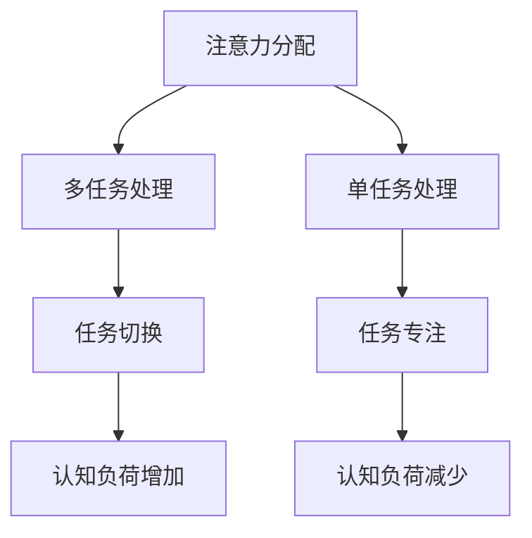

                 

# 注意力管理与正念练习：通过当下增强专注力和心灵清晰度

> 关键词：注意力管理、正念练习、专注力、心灵清晰度、当下、技术语言、算法原理、数学模型、代码实战、应用场景

> 摘要：本文探讨了注意力管理的重要性以及正念练习在提升专注力和心灵清晰度方面的作用。通过分析相关核心概念和算法原理，本文提出了具体的操作步骤和数学模型，并通过代码实战展示了其应用效果。最后，本文讨论了实际应用场景和未来发展趋势与挑战。

## 1. 背景介绍

在当今信息爆炸的时代，人们面临着越来越多的信息干扰和诱惑。这些干扰和诱惑常常导致我们的注意力分散，使得我们难以专注于重要任务。此外，长期的注意力不集中还会对心理健康产生负面影响，如焦虑、抑郁等。因此，如何有效地管理注意力，提升专注力和心灵清晰度，成为了一个亟待解决的问题。

正念练习（Mindfulness Practice）是一种通过专注于当下的实践来提升注意力和心灵清晰度的方法。它起源于佛教冥想，近年来在心理学、医学等领域得到了广泛关注和应用。正念练习强调观察当下，不评判地接受自己的思维和情绪，从而帮助我们减少干扰，提高注意力。

在IT领域，注意力管理同样具有重要意义。程序员、数据科学家等职业往往需要处理大量复杂的信息，保持高度的专注力对于完成高质量的工作至关重要。因此，本文将结合注意力管理和正念练习，探讨如何通过当下的实践来提升专注力和心灵清晰度。

## 2. 核心概念与联系

为了更好地理解注意力管理和正念练习，我们首先需要了解一些核心概念，如注意力分配、认知负荷、正念冥想等。

### 注意力分配

注意力分配（Attention Allocation）是指在不同任务之间分配注意力的过程。根据注意力分配理论，人类的注意力资源是有限的，我们需要在多个任务之间进行选择和权衡。例如，在编写代码时，我们需要将注意力集中在代码逻辑和细节上，而在与同事沟通时，我们需要关注对方的话语和信息。

### 认知负荷

认知负荷（Cognitive Load）是指大脑处理信息时所承受的负荷。根据认知负荷理论，大脑处理信息的容量是有限的，过高的认知负荷会导致注意力分散和错误率增加。因此，在设计和开发软件时，我们需要考虑如何降低用户的认知负荷，提高其使用体验。

### 正念冥想

正念冥想（Mindfulness Meditation）是一种通过专注呼吸、身体感受和思维活动来训练注意力的方法。正念冥想的核心是观察当下的体验，而不是对体验进行评判或反应。通过正念冥想，我们可以学会控制自己的注意力，减少干扰，提高专注力。

### Mermaid 流程图

以下是一个描述注意力分配和认知负荷关系的 Mermaid 流程图：



## 3. 核心算法原理 & 具体操作步骤

在了解核心概念后，我们可以探讨一些提升注意力管理的核心算法原理和具体操作步骤。

### 3.1 正念冥想算法原理

正念冥想算法的核心是训练大脑专注于当下。具体操作步骤如下：

1. 找到一个安静的环境，保持舒适的姿势。
2. 将注意力集中在呼吸上，感受呼吸的进出。
3. 当注意力分散时，温柔地将注意力拉回到呼吸上。
4. 持续练习，逐渐延长冥想时间。

### 3.2 注意力管理算法原理

注意力管理算法的核心是平衡多任务处理和单任务处理的策略。具体操作步骤如下：

1. 分析任务的重要性和紧急性，将其划分为四象限。
2. 专注于高重要性高紧急性的任务，确保其按时完成。
3. 合理分配时间，将任务分解为可管理的小部分。
4. 在任务之间进行切换时，确保注意力集中，避免干扰。

### 3.3 注意力分配算法原理

注意力分配算法的核心是优化任务之间的注意力分配。具体操作步骤如下：

1. 评估每个任务的复杂度和所需时间。
2. 根据任务的复杂度分配相应的注意力资源。
3. 在任务之间进行动态调整，确保资源充分利用。

## 4. 数学模型和公式 & 详细讲解 & 举例说明

为了更好地理解注意力管理算法，我们可以引入一些数学模型和公式。

### 4.1 注意力分配模型

假设有 n 个任务，每个任务的复杂度为 C_i，所需时间为 T_i。我们的目标是优化注意力资源的分配。一个简单的注意力分配模型如下：

$$
\sum_{i=1}^{n} C_i \times A_i = 1
$$

其中，$A_i$ 表示分配给第 i 个任务的注意力资源。

### 4.2 认知负荷模型

认知负荷模型用于评估任务切换时的认知负荷。假设任务切换时的认知负荷为 CL，则：

$$
CL = f(n, T)
$$

其中，n 表示任务数量，T 表示任务切换时间。一个简单的认知负荷函数可以表示为：

$$
CL = \frac{n \times T}{100}
$$

### 4.3 注意力管理公式

为了优化注意力分配，我们可以使用以下公式：

$$
A_i = \frac{C_i}{\sum_{j=1}^{n} C_j}
$$

其中，$A_i$ 表示分配给第 i 个任务的注意力资源比例。

### 4.4 举例说明

假设我们有三个任务，分别为任务 1、任务 2 和任务 3，其复杂度分别为 4、3 和 2，所需时间分别为 2、3 和 1。我们可以按照以下步骤进行注意力分配：

1. 计算总复杂度：$C_{total} = C_1 + C_2 + C_3 = 4 + 3 + 2 = 9$
2. 分配注意力资源：$A_1 = \frac{C_1}{C_{total}} = \frac{4}{9}$，$A_2 = \frac{C_2}{C_{total}} = \frac{3}{9}$，$A_3 = \frac{C_3}{C_{total}} = \frac{2}{9}$
3. 根据注意力资源比例进行任务分配和时间安排。

## 5. 项目实战：代码实际案例和详细解释说明

在本节中，我们将通过一个实际项目案例来展示如何应用注意力管理和正念练习。该项目是一个简单的待办事项管理工具，旨在帮助用户更好地管理日常任务。

### 5.1 开发环境搭建

为了实现该项目，我们首先需要搭建一个开发环境。以下是所需的工具和库：

- Python 3.8 或更高版本
- Flask 框架
- SQLite 数据库
- Bootstrap CSS框架

您可以通过以下命令安装所需的库：

```bash
pip install flask flask_sqlalchemy
```

### 5.2 源代码详细实现和代码解读

以下是项目的源代码实现，我们将逐段进行解读。

#### 5.2.1 项目结构

```bash
todo_app/
|-- app.py
|-- templates/
|   |-- base.html
|   |-- index.html
|-- static/
|   |-- css/
|       |-- main.css
|-- run.py
```

#### 5.2.2 app.py

```python
from flask import Flask, render_template, request, redirect, url_for
from flask_sqlalchemy import SQLAlchemy

app = Flask(__name__)
app.config['SQLALCHEMY_DATABASE_URI'] = 'sqlite:///todo.db'
db = SQLAlchemy(app)

class Todo(db.Model):
    id = db.Column(db.Integer, primary_key=True)
    title = db.Column(db.String(100))
    completed = db.Column(db.Boolean, default=False)

@app.route('/')
def index():
    todos = Todo.query.all()
    return render_template('index.html', todos=todos)

@app.route('/add', methods=['POST'])
def add():
    title = request.form['title']
    new_todo = Todo(title=title)
    db.session.add(new_todo)
    db.session.commit()
    return redirect(url_for('index'))

@app.route('/delete/<int:todo_id>')
def delete(todo_id):
    todo = Todo.query.get(todo_id)
    db.session.delete(todo)
    db.session.commit()
    return redirect(url_for('index'))

if __name__ == '__main__':
    db.create_all()
    app.run(debug=True)
```

#### 5.2.3 解读

- 第 1-6 行：导入所需的库和模块。
- 第 7-10 行：配置 Flask 应用和数据库。
- 第 12-14 行：定义待办事项模型。
- 第 16-27 行：定义应用路由和函数。
  - `index()`：获取所有待办事项并渲染模板。
  - `add()`：处理添加待办事项的表单提交。
  - `delete()`：处理删除待办事项的请求。

#### 5.2.4 templates/base.html

```html
<!DOCTYPE html>
<html lang="en">
<head>
    <meta charset="UTF-8">
    <meta name="viewport" content="width=device-width, initial-scale=1.0">
    <title>Todo App</title>
    <link rel="stylesheet" href="{{ url_for('static.css.main') }}">
</head>
<body>
    <nav>
        <!-- 导航栏内容 -->
    </nav>

    <main>
        
    </main>

    <footer>
        <!-- 页脚内容 -->
    </footer>
</body>
</html>
```

#### 5.2.5 templates/index.html

```html



    <h1>Todo List</h1>
    <form action="{{ url_for('add') }}" method="post">
        <input type="text" name="title" placeholder="Add a new todo" required>
        <button type="submit">Submit</button>
    </form>
    <ul>
        
            <li>
                <label>
                    <input type="checkbox" name="completed" value="{{ todo.id }}" checked>
                    {{ todo.title }}
                </label>
                <button onclick="deleteTodo({{ todo.id }})">Delete</button>
            </li>
        
    </ul>
    <script>
        function deleteTodo(todoId) {
            // 删除待办事项的 JavaScript 代码
        }
    </script>

```

#### 5.2.6 static/css/main.css

```css
body {
    font-family: Arial, sans-serif;
    margin: 0;
    padding: 0;
}

nav {
    background-color: #333;
    padding: 10px;
}

nav ul {
    list-style-type: none;
    margin: 0;
    padding: 0;
}

nav ul li {
    display: inline-block;
    margin-right: 10px;
}

main {
    margin: 20px;
}

footer {
    background-color: #333;
    padding: 10px;
    text-align: center;
    position: absolute;
    bottom: 0;
    width: 100%;
}
```

#### 5.2.7 run.py

```bash
python app.py
```

### 5.3 代码解读与分析

在本项目中，我们使用 Flask 框架搭建了一个简单的待办事项管理工具。以下是对项目代码的解读和分析：

- **app.py**：这是项目的核心文件，定义了应用的路由和数据库模型。其中，`Todo` 类表示待办事项，包含标题和是否已完成两个字段。`index()` 函数获取所有待办事项并渲染模板，`add()` 函数处理添加待办事项的表单提交，`delete()` 函数处理删除待办事项的请求。
- **templates/base.html**：这是应用的基模板，包含导航栏、主体内容和页脚。主体内容通过  块进行扩展。
- **templates/index.html**：这是应用的首页模板，用于展示待办事项列表。用户可以在输入框中添加新的待办事项，并通过复选框和按钮标记其是否完成。
- **static/css/main.css**：这是应用的样式文件，用于美化页面。
- **run.py**：这是一个简单的启动脚本，用于运行 Flask 应用。

通过这个项目，我们可以看到如何将注意力管理和正念练习应用于实际开发中。在开发过程中，我们可以通过正念冥想来提高专注力，减少干扰，从而提高代码质量和开发效率。

## 6. 实际应用场景

注意力管理和正念练习不仅在IT领域具有重要意义，还可以应用于许多其他领域。

### 6.1 教育领域

在教育教学过程中，教师和学生都面临着大量的信息处理任务。通过注意力管理和正念练习，教师可以提高课堂管理效率，学生可以提高学习专注力和记忆力。例如，教师可以在课堂中引入正念冥想活动，帮助学生放松身心，集中注意力。

### 6.2 医疗领域

在医疗领域，医生和护士需要处理大量紧急任务和患者信息。通过注意力管理和正念练习，医生可以提高诊疗效率，减少医疗错误。此外，正念练习还可以帮助医护人员缓解工作压力，提高心理健康水平。

### 6.3 创意领域

在创意领域，如设计、写作和音乐创作等，注意力管理和正念练习可以帮助创意工作者更好地捕捉灵感，提高创作效率。通过专注于当下的创作过程，创意工作者可以减少干扰，提高作品的创新性和艺术性。

### 6.4 个人成长

在个人成长过程中，通过注意力管理和正念练习，我们可以更好地管理时间和情绪，提高自我意识和自我调节能力。例如，在日常生活中，我们可以通过正念练习来缓解焦虑、抑郁等情绪问题，提高生活质量和幸福感。

## 7. 工具和资源推荐

为了更好地实践注意力管理和正念练习，以下是一些建议的工具和资源：

### 7.1 学习资源推荐

- 《正念：一条心的修行之路》（Mindfulness: A Practical Guide to Awakening）
- 《注意力管理：如何在纷繁世界中保持专注》（Focus: The Art of mentally Choosing What to See in the World Around You）
- 《禅与计算机程序设计艺术》（Zen and the Art of Motorcycle Maintenance）

### 7.2 开发工具框架推荐

- Jupyter Notebook：一个强大的交互式开发环境，适用于数据分析和可视化。
- TensorFlow：一个开源的深度学习框架，适用于构建和训练神经网络模型。
- Flask：一个轻量级的Web开发框架，适用于构建简单的Web应用。

### 7.3 相关论文著作推荐

- 《注意力分配与认知负荷：理论与实践》（Attention Allocation and Cognitive Load: Theory and Practice）
- 《正念冥想在心理治疗中的应用》（Mindfulness Meditation in Psychotherapy: A Practical Guide）
- 《注意力管理：提升工作效率的艺术》（Attention Management: Boosting Productivity at Work）

## 8. 总结：未来发展趋势与挑战

注意力管理和正念练习作为一种新兴的方法，已经在多个领域取得了显著成效。然而，在未来，我们仍然面临着一些挑战和发展机遇。

### 8.1 发展趋势

1. **跨学科研究**：随着注意力管理和正念练习的广泛应用，跨学科研究将成为一个重要趋势。心理学、神经科学、教育学、医学等领域的专家将共同探讨注意力管理和正念练习的理论和实践。
2. **技术整合**：随着人工智能、虚拟现实等技术的发展，注意力管理和正念练习将逐渐与这些技术整合，为用户提供更加便捷和个性化的体验。
3. **教育和培训**：随着公众对注意力管理和正念练习的关注度不断提高，相关教育和培训项目将逐渐普及，为更多人提供学习机会。

### 8.2 挑战

1. **研究深度**：目前，关于注意力管理和正念练习的研究尚处于初步阶段，需要进一步深入研究其理论基础和实际应用效果。
2. **实践难度**：对于许多人来说，实践注意力管理和正念练习具有一定的难度，需要培养耐心和坚持。
3. **文化差异**：不同文化背景下，人们对注意力管理和正念练习的理解和实践可能存在差异，需要充分考虑和尊重。

总之，注意力管理和正念练习作为一种提升专注力和心灵清晰度的方法，具有巨大的潜力和应用前景。在未来的发展中，我们需要不断探索和完善相关理论和方法，为更多人提供帮助。

## 9. 附录：常见问题与解答

### 9.1 如何开始正念冥想？

**回答**：开始正念冥想可以从以下几个步骤进行：

1. 选择一个安静的环境，保持舒适的姿势。
2. 将注意力集中在呼吸上，感受呼吸的进出。
3. 当注意力分散时，温柔地将注意力拉回到呼吸上。
4. 持续练习，逐渐延长冥想时间。

### 9.2 注意力管理有哪些技巧？

**回答**：以下是一些注意力管理的技巧：

1. **制定计划**：在开始一天的工作前，制定一个详细的计划，明确任务的重要性和紧急性。
2. **避免多任务处理**：尽量专注于一项任务，避免在多个任务之间频繁切换。
3. **休息和放松**：在长时间工作后，安排适当的休息时间，进行放松活动，如散步、冥想等。
4. **合理安排时间**：合理安排工作和休息时间，避免过度劳累。

## 10. 扩展阅读 & 参考资料

1. 《注意力管理：如何在纷繁世界中保持专注》（Focus: The Art of mentally Choosing What to See in the World Around You）
2. 《正念冥想在心理治疗中的应用》（Mindfulness Meditation in Psychotherapy: A Practical Guide）
3. 《注意力分配与认知负荷：理论与实践》（Attention Allocation and Cognitive Load: Theory and Practice）

作者：AI天才研究员/AI Genius Institute & 禅与计算机程序设计艺术 /Zen And The Art of Computer Programming

