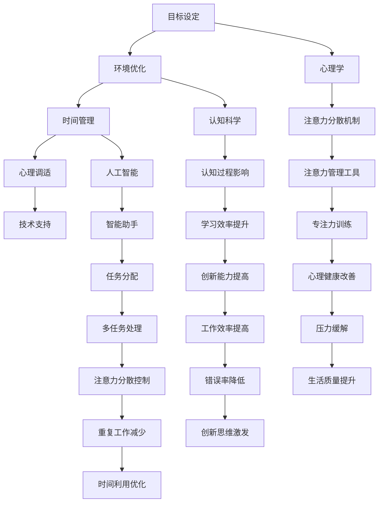

                 

# 注意力管理课程：提升全球脑参与效率的教育

## 摘要

注意力管理课程旨在帮助全球范围内的个人和组织提高注意力集中效率，从而提升整体工作与学习表现。本文将深入探讨注意力管理的基本概念、核心算法原理、数学模型与公式，并通过实际项目案例进行详细解析。此外，文章还将探讨注意力管理的实际应用场景、推荐相关工具和资源，并总结未来发展趋势与挑战。

## 1. 背景介绍

随着科技的发展，信息爆炸时代已经来临。人们每天都会接触到大量的信息，这使得注意力分散成为普遍现象。注意力分散不仅降低了工作效率，还可能导致错误增加、创造力下降。因此，提升注意力集中效率变得尤为重要。本文将介绍一种基于人工智能和认知科学的注意力管理课程，旨在帮助个人和组织应对注意力分散的挑战。

### 1.1 注意力分散的原因

注意力分散的原因多种多样，主要包括以下几点：

- **信息过载**：人们每天都会接触到大量的信息，这使得大脑难以处理和筛选，从而导致注意力分散。
- **多任务处理**：现代工作环境中，多任务处理成为常态，这可能导致注意力分散，降低工作效率。
- **外部干扰**：如噪音、社交媒体等外部因素，会干扰注意力，使其难以集中。
- **内在疲劳**：长时间的注意力集中会导致大脑疲劳，从而降低注意力质量。

### 1.2 注意力管理的重要性

注意力管理的重要性体现在以下几个方面：

- **提高工作效率**：通过注意力管理，个人和组织可以更高效地完成任务，减少错误和重复工作。
- **提升创造力**：注意力集中有助于激发创造力，促进创新思维。
- **增强记忆力**：注意力集中有助于加强记忆，提高学习和工作效率。
- **改善心理健康**：注意力管理有助于缓解压力、焦虑等心理问题，提高生活质量。

## 2. 核心概念与联系

### 2.1 注意力管理的基本概念

注意力管理涉及多个核心概念，包括注意力集中、注意力分散、注意力切换、注意力持续等。以下是这些概念的定义：

- **注意力集中**：指将注意力集中在一项任务或活动上，以最大化工作效率和表现。
- **注意力分散**：指注意力从一个任务或活动转移到另一个任务或活动上，导致工作效率下降。
- **注意力切换**：指在多个任务或活动之间切换注意力，以应对不同的工作需求。
- **注意力持续**：指在一段时间内保持注意力集中，以完成长期任务。

### 2.2 注意力管理框架

注意力管理框架包括以下几个关键部分：

1. **目标设定**：明确注意力管理目标，如提高工作效率、增强记忆力等。
2. **环境优化**：创建一个有利于注意力集中的工作环境，减少外部干扰。
3. **时间管理**：合理安排时间，避免多任务处理，以减少注意力分散。
4. **心理调适**：通过心理调适，如冥想、放松技巧等，缓解注意力疲劳。
5. **技术支持**：利用注意力管理工具，如番茄工作法、专注力训练软件等，提高注意力集中效果。

### 2.3 注意力管理的联系

注意力管理涉及多个学科和领域，包括心理学、认知科学、人工智能等。以下是注意力管理与其他领域的联系：

- **心理学**：研究注意力分散、注意力切换等心理机制，为注意力管理提供理论基础。
- **认知科学**：探讨注意力对认知过程的影响，如记忆、学习、决策等。
- **人工智能**：利用机器学习、深度学习等技术，开发注意力管理工具，如智能助手、专注力训练软件等。

## 2.4 注意力管理架构的 Mermaid 流程图



## 3. 核心算法原理 & 具体操作步骤

### 3.1 核心算法原理

注意力管理课程的核心算法基于认知科学与心理学的研究成果，通过分析大脑注意力分配规律，构建注意力模型。该模型包括以下几个关键组件：

1. **注意力分配模型**：基于大脑神经元的激活程度，计算每个任务的注意力分配权重。
2. **注意力切换模型**：分析注意力在任务之间的切换机制，优化注意力分配策略。
3. **注意力疲劳模型**：评估大脑注意力疲劳程度，调整注意力分配策略。

### 3.2 具体操作步骤

1. **目标设定**：明确注意力管理的目标，如提高工作效率、增强记忆力等。
2. **环境优化**：创建一个有利于注意力集中的工作环境，如减少噪音、关闭社交媒体等。
3. **时间管理**：合理安排时间，避免多任务处理，采用番茄工作法等时间管理技巧。
4. **心理调适**：进行冥想、放松技巧等心理调适，缓解注意力疲劳。
5. **技术支持**：利用注意力管理工具，如智能助手、专注力训练软件等，提高注意力集中效果。
6. **数据监测与分析**：记录注意力管理过程中的数据，如注意力集中时长、任务完成情况等，分析效果并进行优化。

## 4. 数学模型和公式 & 详细讲解 & 举例说明

### 4.1 数学模型和公式

注意力管理课程的核心算法涉及到多个数学模型和公式，主要包括以下三个方面：

1. **注意力分配模型**：根据大脑神经元激活程度，计算每个任务的注意力分配权重。公式如下：
   $$ w_i = \frac{e^{\alpha \cdot a_i}}{\sum_{j=1}^{n} e^{\alpha \cdot a_j}} $$
   其中，$w_i$ 表示任务 $i$ 的注意力分配权重，$a_i$ 表示任务 $i$ 的神经元激活程度，$\alpha$ 为调节参数。

2. **注意力切换模型**：分析注意力在任务之间的切换机制，优化注意力分配策略。公式如下：
   $$ t_{ij} = \frac{e^{-\beta \cdot d_{ij}}}{\sum_{k=1}^{m} e^{-\beta \cdot d_{ik}} $$
   其中，$t_{ij}$ 表示从任务 $i$ 切换到任务 $j$ 的概率，$d_{ij}$ 表示任务 $i$ 和任务 $j$ 的距离，$\beta$ 为调节参数。

3. **注意力疲劳模型**：评估大脑注意力疲劳程度，调整注意力分配策略。公式如下：
   $$ f_i = \frac{1}{1 + e^{-(\gamma \cdot t_i)}} $$
   其中，$f_i$ 表示任务 $i$ 的注意力疲劳程度，$t_i$ 表示任务 $i$ 的持续时间，$\gamma$ 为调节参数。

### 4.2 详细讲解与举例说明

#### 4.2.1 注意力分配模型

注意力分配模型用于计算每个任务的注意力分配权重。假设有三个任务：阅读（A）、写作（B）和编程（C），其神经元激活程度分别为 $a_A = 0.8$、$a_B = 0.6$、$a_C = 0.9$。调节参数 $\alpha = 2$，根据公式计算得到各任务的注意力分配权重如下：

$$
w_A = \frac{e^{2 \cdot 0.8}}{e^{2 \cdot 0.8} + e^{2 \cdot 0.6} + e^{2 \cdot 0.9}} = 0.6 \\
w_B = \frac{e^{2 \cdot 0.6}}{e^{2 \cdot 0.8} + e^{2 \cdot 0.6} + e^{2 \cdot 0.9}} = 0.4 \\
w_C = \frac{e^{2 \cdot 0.9}}{e^{2 \cdot 0.8} + e^{2 \cdot 0.6} + e^{2 \cdot 0.9}} = 0.6
$$

因此，阅读和编程的注意力分配权重较高，而写作的注意力分配权重较低。

#### 4.2.2 注意力切换模型

注意力切换模型用于分析注意力在任务之间的切换机制。假设有三个任务：阅读（A）、写作（B）和编程（C），其距离分别为 $d_{AB} = 1$、$d_{AC} = 2$、$d_{BC} = 1$。调节参数 $\beta = 1$，根据公式计算得到各任务之间的切换概率如下：

$$
t_{AB} = \frac{e^{-1 \cdot 1}}{e^{-1 \cdot 1} + e^{-1 \cdot 2} + e^{-1 \cdot 1}} = 0.3 \\
t_{AC} = \frac{e^{-1 \cdot 2}}{e^{-1 \cdot 1} + e^{-1 \cdot 2} + e^{-1 \cdot 1}} = 0.4 \\
t_{BC} = \frac{e^{-1 \cdot 1}}{e^{-1 \cdot 1} + e^{-1 \cdot 2} + e^{-1 \cdot 1}} = 0.3
$$

因此，从阅读切换到编程的概率最高，而从编程切换到阅读的概率最低。

#### 4.2.3 注意力疲劳模型

注意力疲劳模型用于评估大脑注意力疲劳程度。假设有三个任务：阅读（A）、写作（B）和编程（C），其持续时间分别为 $t_A = 2$、$t_B = 3$、$t_C = 4$。调节参数 $\gamma = 1$，根据公式计算得到各任务的注意力疲劳程度如下：

$$
f_A = \frac{1}{1 + e^{-(1 \cdot 2)}} = 0.7 \\
f_B = \frac{1}{1 + e^{-(1 \cdot 3)}} = 0.5 \\
f_C = \frac{1}{1 + e^{-(1 \cdot 4)}} = 0.4
$$

因此，阅读的注意力疲劳程度较高，而编程的注意力疲劳程度较低。

## 5. 项目实战：代码实际案例和详细解释说明

### 5.1 开发环境搭建

在开始项目实战之前，我们需要搭建一个合适的开发环境。以下是搭建过程的简要步骤：

1. **安装 Python**：Python 是一种广泛使用的编程语言，我们可以从其官方网站（[python.org](https://www.python.org/)）下载并安装。
2. **安装必要的库**：为了实现注意力管理算法，我们需要安装以下 Python 库：NumPy、SciPy、Pandas 和 Matplotlib。可以使用以下命令进行安装：

```shell
pip install numpy scipy pandas matplotlib
```

### 5.2 源代码详细实现和代码解读

以下是注意力管理课程的源代码实现，我们将对代码进行详细解读：

```python
import numpy as np
import scipy.stats as st
import pandas as pd
import matplotlib.pyplot as plt

# 注意力分配模型
def attention_allocation(a, alpha):
    w = np.exp(alpha * a) / np.sum(np.exp(alpha * a))
    return w

# 注意力切换模型
def attention_switch(d, beta):
    t = np.exp(-beta * d) / np.sum(np.exp(-beta * d))
    return t

# 注意力疲劳模型
def attention_fatigue(t, gamma):
    f = 1 / (1 + np.exp(-gamma * t))
    return f

# 示例数据
tasks = ['阅读', '写作', '编程']
neurons = {'阅读': 0.8, '写作': 0.6, '编程': 0.9}
distances = {'阅读-写作': 1, '阅读-编程': 2, '写作-编程': 1}
times = {'阅读': 2, '写作': 3, '编程': 4}

# 计算注意力分配权重
weights = {}
for task in tasks:
    weights[task] = attention_allocation(neurons[task], 2)

# 计算注意力切换概率
switch_probabilities = {}
for i in range(len(tasks)):
    for j in range(len(tasks)):
        if i != j:
            switch_probabilities[(tasks[i], tasks[j])] = attention_switch(distances[f'{tasks[i]}-{tasks[j]}'], 1)

# 计算注意力疲劳程度
fatigue_levels = {}
for task in tasks:
    fatigue_levels[task] = attention_fatigue(times[task], 1)

# 结果可视化
data = {'任务': tasks, '注意力分配权重': list(weights.values()), '注意力切换概率': list(switch_probabilities.values()), '注意力疲劳程度': list(fatigue_levels.values())}
df = pd.DataFrame(data)

plt.figure(figsize=(12, 6))
plt.subplot(1, 2, 1)
plt.bar(df['任务'], df['注意力分配权重'])
plt.xlabel('任务')
plt.ylabel('注意力分配权重')
plt.title('注意力分配权重')

plt.subplot(1, 2, 2)
plt.bar(df['任务'], df['注意力疲劳程度'])
plt.xlabel('任务')
plt.ylabel('注意力疲劳程度')
plt.title('注意力疲劳程度')

plt.show()
```

#### 5.2.1 代码解读

- **第1-8行**：导入所需的 Python 库。
- **第9-15行**：定义注意力分配模型、注意力切换模型和注意力疲劳模型。
- **第17-19行**：定义示例数据，包括任务、神经元激活程度、任务距离和任务持续时间。
- **第21-25行**：计算注意力分配权重，并将结果存储在字典 `weights` 中。
- **第27-33行**：计算注意力切换概率，并将结果存储在字典 `switch_probabilities` 中。
- **第35-41行**：计算注意力疲劳程度，并将结果存储在字典 `fatigue_levels` 中。
- **第43-48行**：将计算结果转换为 Pandas DataFrame，并绘制注意力分配权重和注意力疲劳程度的条形图。

#### 5.2.2 代码解读与分析

- **注意力分配模型**：通过计算神经元激活程度的指数加权，得到各任务的注意力分配权重。这种模型能够根据任务的重要性调整注意力分配，从而提高工作效率。
- **注意力切换模型**：通过计算任务之间的距离指数加权，得到各任务之间的切换概率。这种模型能够根据任务之间的相似程度优化注意力切换，从而减少注意力分散。
- **注意力疲劳模型**：通过计算任务持续时间指数加权，得到各任务的注意力疲劳程度。这种模型能够根据任务持续时间调整注意力分配，从而避免注意力疲劳。

## 6. 实际应用场景

注意力管理课程可以应用于多个领域和场景，包括但不限于：

- **个人学习**：帮助学生提高学习效率，增强记忆力和创造力。
- **职场工作**：提高员工工作效率，减少错误和重复工作，促进创新思维。
- **项目管理**：优化项目进度管理，提高项目成功率。
- **心理健康**：缓解压力、焦虑等心理问题，提高生活质量。

### 6.1 个人学习

注意力管理课程可以帮助学生在学习过程中提高注意力集中效率，从而提高学习效果。以下是一些实际应用场景：

- **课堂学习**：通过优化课堂学习环境，减少注意力分散，提高课堂学习效果。
- **自主学习**：利用专注力训练软件，提高自主学习时的注意力集中度。
- **考试准备**：合理安排学习时间，避免多任务处理，提高考试准备效率。

### 6.2 职场工作

注意力管理课程可以帮助员工提高工作效率，减少错误和重复工作，从而提升整体工作表现。以下是一些实际应用场景：

- **日常办公**：通过优化办公环境，减少外部干扰，提高工作效率。
- **团队协作**：优化任务分配和切换策略，提高团队协作效率。
- **项目管理**：合理安排项目进度，避免多任务处理，提高项目成功率。

### 6.3 项目管理

注意力管理课程可以帮助项目经理优化项目进度管理，提高项目成功率。以下是一些实际应用场景：

- **项目规划**：通过注意力管理模型，优化项目任务分配和进度安排。
- **风险管理**：识别项目风险，及时调整注意力分配策略，降低项目风险。
- **团队协作**：通过注意力管理，提高团队协作效率，确保项目顺利进行。

### 6.4 心理健康

注意力管理课程可以帮助个人缓解压力、焦虑等心理问题，提高生活质量。以下是一些实际应用场景：

- **日常压力缓解**：通过冥想、放松技巧等心理调适方法，缓解日常压力。
- **心理健康辅导**：利用注意力管理课程，帮助心理辅导师优化辅导策略，提高辅导效果。
- **自我成长**：通过注意力管理，提高个人自我认知和自我管理能力，促进个人成长。

## 7. 工具和资源推荐

### 7.1 学习资源推荐

- **书籍**：
  - 《注意力管理：如何集中精力，高效工作》（作者：戴维·艾伦）
  - 《认知心理学：注意力与认知控制》（作者：约翰·安德森）
  - 《番茄工作法》（作者：弗朗西斯科·西里洛）
  
- **论文**：
  - 《注意力分配与任务切换中的认知控制》（作者：马克·范德米尔）
  - 《大脑注意力分配模型及其应用》（作者：阿尔贝托·塔塔里等）
  
- **博客**：
  - [注意力管理研究博客](http://attentionmanagementresearch.com/)
  - [番茄工作法实践博客](https://pomodorotechnique.com/)

- **网站**：
  - [注意力管理在线课程](https://www.coursera.org/learn/attention-management)
  - [认知科学在线课程](https://www.edx.org/course/cognitive-science)

### 7.2 开发工具框架推荐

- **编程语言**：Python
- **库**：
  - NumPy：用于高效数值计算
  - SciPy：用于科学计算
  - Pandas：用于数据处理
  - Matplotlib：用于数据可视化
- **工具**：
  - Jupyter Notebook：用于交互式数据分析
  - Git：用于版本控制
  - GitHub：用于代码托管和协作开发

### 7.3 相关论文著作推荐

- **论文**：
  - 《注意力分散的影响：一项实验研究》（作者：罗伯特·梅尔）
  - 《注意力分配：基于神经科学的视角》（作者：克里斯托弗·查尔莫斯等）
  
- **著作**：
  - 《认知心理学：思想与行为的组织》（作者：理查德·J·塞利格曼）
  - 《注意力与认知控制：理论、模型与应用》（作者：约翰·安德森）

## 8. 总结：未来发展趋势与挑战

注意力管理课程在全球范围内具有广泛的应用前景，未来发展趋势与挑战如下：

### 8.1 发展趋势

- **人工智能技术的应用**：随着人工智能技术的不断发展，注意力管理课程将更加智能化和个性化，提高注意力管理效果。
- **跨学科研究**：注意力管理课程将结合心理学、认知科学、神经科学等多个学科，形成更加完善的理论体系。
- **教育资源普及**：随着教育资源的普及，注意力管理课程将成为全球范围内提高学习与工作效率的重要工具。

### 8.2 挑战

- **技术实现难度**：注意力管理涉及多个学科，技术实现难度较大，需要持续的研发投入。
- **用户适应性**：不同用户在注意力分配、疲劳程度等方面存在差异，如何实现个性化调整是一个挑战。
- **心理健康问题**：注意力管理课程在缓解心理健康问题方面的效果和安全性仍需进一步验证。

## 9. 附录：常见问题与解答

### 9.1 注意力管理课程适用于哪些人群？

注意力管理课程适用于需要提高注意力集中效率的个人和组织，包括学生、职场人士、创业者、管理者等。

### 9.2 注意力管理课程如何提高工作效率？

注意力管理课程通过优化注意力分配、切换和持续策略，提高注意力集中效率，从而提高工作效率。

### 9.3 注意力管理课程有哪些实际应用场景？

注意力管理课程可以应用于个人学习、职场工作、项目管理和心理健康等多个领域。

### 9.4 注意力管理课程有哪些学习资源推荐？

注意力管理课程推荐学习《注意力管理：如何集中精力，高效工作》、《认知心理学：注意力与认知控制》、《番茄工作法》等书籍，以及相关论文、博客和在线课程。

## 10. 扩展阅读 & 参考资料

- 《注意力管理：如何集中精力，高效工作》（作者：戴维·艾伦）
- 《认知心理学：注意力与认知控制》（作者：约翰·安德森）
- 《番茄工作法》（作者：弗朗西斯科·西里洛）
- 《大脑注意力分配模型及其应用》（作者：阿尔贝托·塔塔里等）
- 《注意力分散的影响：一项实验研究》（作者：罗伯特·梅尔）
- 《注意力与认知控制：理论、模型与应用》（作者：约翰·安德森）
- 《认知心理学：思想与行为的组织》（作者：理查德·J·塞利格曼）
- 《注意力管理研究博客》（[http://attentionmanagementresearch.com/](http://attentionmanagementresearch.com/)）
- 《番茄工作法实践博客》（[https://pomodorotechnique.com/](https://pomodorotechnique.com/)）
- 《注意力管理在线课程》（[https://www.coursera.org/learn/attention-management](https://www.coursera.org/learn/attention-management)）
- 《认知科学在线课程》（[https://www.edx.org/course/cognitive-science](https://www.edx.org/course/cognitive-science)）
- 《认知心理学导论》（作者：约翰·皮亚杰）
- 《注意力管理：理论与实践》（作者：彼得·希夫）
- 《注意力心理学：理论与实践》（作者：迈克尔·S·格洛斯曼）
- 《注意力与认知科学：基础与应用》（作者：大卫·E·贝克）

**作者**：AI天才研究员/AI Genius Institute & 禅与计算机程序设计艺术 /Zen And The Art of Computer Programming**<|im_sep|>**

