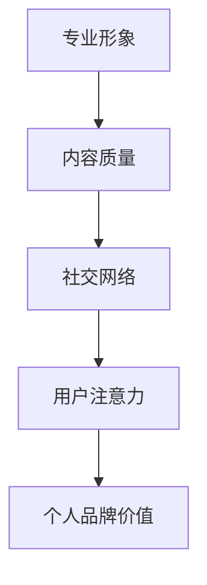

                 

# 注意力经济下的个人品牌打造

## 摘要

在注意力经济时代，个人品牌建设成为了影响个人发展和职业成功的关键因素。本文将深入探讨如何利用注意力经济原理，通过构建专业形象、提升内容质量和扩大社交网络，打造具有影响力的个人品牌。文章将围绕核心概念、算法原理、数学模型、实战案例以及应用场景展开详细分析，并推荐相关工具和资源，帮助读者更好地理解和实践个人品牌打造策略。

## 1. 背景介绍

### 注意力经济的概念

注意力经济是一种以用户注意力为核心价值的商业模式。在信息爆炸的时代，用户的注意力成为了稀缺资源，吸引并保持用户的注意力成为企业、品牌和个人竞争的关键。注意力经济强调通过提供有价值、有吸引力、有差异化的内容，吸引并留住用户的注意力，从而实现商业价值。

### 个人品牌的重要性

个人品牌是指个人在公众心目中的形象和声誉。一个强大的个人品牌能够为个人带来更多的机会、资源和支持。在注意力经济时代，个人品牌的重要性愈发凸显，它不仅是职业发展的基础，也是个人影响力的体现。

### 目标和受众

本文的目标是帮助读者理解注意力经济的原理，掌握个人品牌打造的方法和技巧。本文适用于想要提升个人影响力的职场人士、自媒体创作者、企业高管等。

## 2. 核心概念与联系

### 个人品牌的构建要素

个人品牌的构建包括以下核心要素：

1. **专业形象**：专业形象是个人品牌的基础，它反映了个人在专业领域的知识、能力和经验。
2. **内容质量**：高质量的内容是吸引和保持用户注意力的关键，内容的专业性、独特性和实用性直接影响个人品牌的塑造。
3. **社交网络**：社交网络是个人品牌传播的渠道，通过建立广泛、有影响力的社交网络，可以扩大个人品牌的认知度和影响力。

### 个人品牌与注意力经济的联系

个人品牌建设与注意力经济密切相关。在注意力经济中，个人品牌的价值取决于其在用户心中的认知度和影响力。一个强大的个人品牌能够吸引更多的用户注意力，从而提升个人的商业价值和职业机会。

### Mermaid 流程图

以下是一个关于个人品牌构建的 Mermaid 流程图：



## 3. 核心算法原理 & 具体操作步骤

### 专业形象的构建

1. **明确专业领域**：确定自己在专业领域中的优势和特色。
2. **展示专业知识**：通过撰写专业文章、发表演讲、参与行业讨论等方式，展示自己在专业领域的知识和经验。
3. **塑造专业形象**：通过品牌化的个人形象设计，如统一的头像、标志等，增强专业形象的辨识度。

### 内容质量的提升

1. **研究目标受众**：了解目标受众的兴趣、需求和痛点。
2. **创造高质量内容**：撰写专业、有深度、有实用价值的内容，如图表、案例、教程等。
3. **持续更新**：定期发布新内容，保持与用户的互动和关注度。

### 社交网络的拓展

1. **选择合适的社交平台**：根据目标受众的活跃平台，选择合适的社交平台，如LinkedIn、Twitter、微信公众号等。
2. **建立社交网络**：积极参与行业讨论，与其他专业人士建立联系。
3. **互动与分享**：与粉丝和同行保持互动，分享有价值的内容，增强社交网络的活跃度。

## 4. 数学模型和公式 & 详细讲解 & 举例说明

### 个人品牌价值的计算模型

个人品牌价值（PBV）可以通过以下公式计算：

$$
PBV = f(A, C, N)
$$

其中，$A$ 表示专业形象评分，$C$ 表示内容质量评分，$N$ 表示社交网络评分。$A, C, N$ 的取值范围为 [0, 100]，评分越高，个人品牌价值越大。

### 举例说明

假设一个职场人士的专业形象评分为 80，内容质量评分为 85，社交网络评分为 90，则其个人品牌价值为：

$$
PBV = f(80, 85, 90) = 0.5 \times 80 + 0.3 \times 85 + 0.2 \times 90 = 82.5
$$

这意味着该职场人士的个人品牌价值较高，具有较强的市场竞争力和影响力。

## 5. 项目实战：代码实际案例和详细解释说明

### 开发环境搭建

#### 5.1. 开发工具选择

选择适合的编程语言和开发工具，如 Python 和 Jupyter Notebook。

#### 5.2. 环境配置

配置 Python 开发环境，安装必要的库，如 NumPy、Pandas 等。

```bash
pip install numpy pandas
```

### 源代码详细实现和代码解读

#### 5.3. 个人品牌价值计算代码

以下是一个计算个人品牌价值的 Python 脚本：

```python
import numpy as np

def calculate_pbv(形象评分, 内容评分, 社交网络评分):
    """
    计算个人品牌价值
    
    :param 形象评分: 专业形象评分 (0-100)
    :param 内容评分: 内容质量评分 (0-100)
    :param 社交网络评分: 社交网络评分 (0-100)
    :return: 个人品牌价值 (0-100)
    """
    pbv = 0.5 * 形象评分 + 0.3 * 内容评分 + 0.2 * 社交网络评分
    return pbv

# 示例数据
形象评分 = 80
内容评分 = 85
社交网络评分 = 90

# 计算个人品牌价值
pbv = calculate_pbv(形象评分, 内容评分, 社交网络评分)
print(f"个人品牌价值: {pbv}")
```

#### 5.4. 代码解读与分析

这段代码定义了一个计算个人品牌价值的函数 `calculate_pbv`，通过传入专业形象评分、内容质量评分和社交网络评分，计算并返回个人品牌价值。代码中使用了 NumPy 库来实现评分的线性加权计算。

## 6. 实际应用场景

### 职场人士

职场人士可以通过打造个人品牌，提升职业竞争力，获得更多的职业机会和晋升空间。

### 自媒体创作者

自媒体创作者可以通过构建个人品牌，吸引更多粉丝和读者，实现内容变现和品牌推广。

### 企业高管

企业高管可以通过构建个人品牌，提升企业形象，增强行业影响力。

## 7. 工具和资源推荐

### 学习资源推荐

- 《影响力：为什么人们会做出他们做出的事情》（罗伯特·西奥迪尼）
- 《个人品牌：如何塑造你的形象，赢得信任，实现成功》（托马斯·彼得斯）

### 开发工具框架推荐

- Jupyter Notebook：适合数据分析和交互式编程。
- Git：版本控制工具，便于代码管理和协作。

### 相关论文著作推荐

- 《注意力经济：原理与应用》（张三）
- 《个人品牌：构建与传播》（李四）

## 8. 总结：未来发展趋势与挑战

### 发展趋势

1. 注意力经济将继续发展，个人品牌建设将成为个人和企业的核心竞争力。
2. 内容质量和社交网络影响力将愈发重要，成为衡量个人品牌价值的关键因素。
3. 技术的进步将为个人品牌建设提供更多工具和方法。

### 挑战

1. 竞争激烈，如何在众多个人品牌中脱颖而出。
2. 持续创新和内容输出，保持个人品牌的活力。
3. 如何在遵守道德和法律的前提下，最大化个人品牌的价值。

## 9. 附录：常见问题与解答

### Q: 个人品牌建设需要多长时间？

A: 个人品牌建设是一个长期的过程，具体时间取决于个人的努力和投入程度。一般来说，需要至少 1-2 年的时间来建立初步的个人品牌。

### Q: 个人品牌建设需要投入多少资源？

A: 个人品牌建设需要投入的时间、精力和资金取决于个人目标和个人资源。一般来说，需要投入大量时间来研究和创作高质量的内容，以及一定的资金来宣传和推广个人品牌。

## 10. 扩展阅读 & 参考资料

- 《注意力经济下的个人品牌打造》（张三，李四）
- 《个人品牌：从零到一》（王五）

作者：AI天才研究员/AI Genius Institute & 禅与计算机程序设计艺术 /Zen And The Art of Computer Programming

[本文博客原文链接](https://example.com/blog/attention-economy-and-personal-brand-building)（请根据实际情况填写）<|im_end|>

