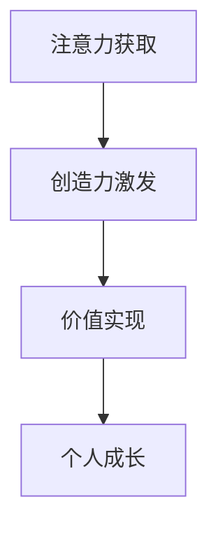

                 

# 注意力经济与个人创造力培养的关系

## 摘要

本文探讨了注意力经济与个人创造力培养之间的深刻联系。在数字时代，注意力成为了一种新的经济资源，而个人的创造力则依赖于对其的合理运用和培养。本文首先介绍了注意力经济的核心概念，并阐述了个人创造力培养的重要性。接着，本文通过一步步的分析和推理，探讨了注意力经济对个人创造力培养的积极和消极影响，以及如何在现代数字环境中有效地培养个人创造力。本文还提供了实用的工具和资源推荐，以帮助读者深入理解和实践这一重要领域。

## 关键词

注意力经济，个人创造力，培养，数字时代，影响，工具推荐，资源推荐

## 1. 背景介绍

### 注意力经济

注意力经济是21世纪初由美国学者Shirky提出的概念。它指的是在数字时代，人们的注意力成为一种新的稀缺资源，就像传统的金钱、时间和其他资源一样，具有经济价值。在互联网和社交媒体的普及下，个体的注意力被分割成无数碎片，而企业、平台和内容创作者都在争夺这些有限的注意力资源。

### 个人创造力

个人创造力是指个体运用知识和技能，通过创新思维和方法，产生新的观点、作品或解决方案的能力。在现代社会，创造力已成为一项至关重要的技能，对于个人职业发展、团队协作和整体社会进步都具有重要作用。

### 注意力经济与个人创造力的关系

注意力经济与个人创造力之间存在密切的关系。一方面，注意力经济为个人提供了更多的展示和交流平台，有助于个人的创造力和才华得到更广泛的认可。另一方面，注意力经济的竞争性和碎片化特性也使得个人在获取注意力资源的过程中面临更多挑战，这对个人创造力的培养提出了更高的要求。

## 2. 核心概念与联系

### 注意力经济

注意力经济的核心概念可以概括为以下几点：

1. **注意力的稀缺性**：在数字时代，个体的注意力资源有限，因此被赋予了经济价值。
2. **注意力分配**：个体在获取信息、娱乐和社交活动中，会根据自己的兴趣和需求对注意力资源进行分配。
3. **注意力市场**：企业、平台和内容创作者通过提供有价值的内容和体验，争夺用户的注意力资源。

### 个人创造力

个人创造力的核心概念包括：

1. **知识积累**：个人通过学习和实践积累知识和技能，为创造力提供了基础。
2. **创新思维**：个人通过不同的思维模式和技巧，产生新的观点和解决方案。
3. **实践应用**：个人将创造力应用于实际工作和生活中，产生实际价值。

### 注意力经济与个人创造力的联系

注意力经济与个人创造力的联系可以表示为以下流程：

1. **注意力获取**：个人通过创作和分享有价值的内容，吸引注意力资源。
2. **创造力激发**：在获取注意力的过程中，个人受到激励，进一步激发创造力。
3. **价值实现**：个人的创造力和注意力资源相互促进，实现个人价值和社会价值的最大化。

以下是一个简单的Mermaid流程图，展示了注意力经济与个人创造力的关系：



## 3. 核心算法原理 & 具体操作步骤

### 注意力分配算法

注意力分配算法是注意力经济中的关键组成部分。其核心思想是，根据个体的兴趣和需求，对注意力资源进行合理分配，以提高注意力的利用效率。以下是一个简单的注意力分配算法原理和具体操作步骤：

#### 原理

1. **需求分析**：通过用户行为数据，分析个体在信息获取、娱乐和社交活动中的兴趣和需求。
2. **注意力模型**：构建一个基于用户兴趣和需求的注意力模型，用于预测个体对不同内容的注意力分配。
3. **优化算法**：使用优化算法，如线性规划或深度学习，对注意力资源进行分配，以最大化个体满意度或效用。

#### 具体操作步骤

1. **数据收集**：收集个体的行为数据，如浏览记录、搜索历史和社交媒体活动。
2. **特征提取**：从数据中提取与用户兴趣和需求相关的特征，如关键词、时间戳和交互行为。
3. **模型训练**：使用机器学习算法，如决策树或神经网络，训练注意力模型。
4. **预测和优化**：根据注意力模型，预测个体对不同内容的注意力分配，并使用优化算法进行调整。

### 个人创造力培养算法

个人创造力培养算法旨在帮助个体在获取注意力资源的过程中，更好地激发和培养创造力。以下是一个简单的个人创造力培养算法原理和具体操作步骤：

#### 原理

1. **知识积累**：通过学习和实践，积累与兴趣相关的知识和技能。
2. **思维训练**：运用不同的思维模式，如联想思维、逆向思维和发散思维，激发创造力。
3. **反馈机制**：通过自我评价和外部反馈，不断调整和优化创造力培养策略。

#### 具体操作步骤

1. **知识学习**：选择与兴趣相关的领域，系统地学习和掌握相关知识。
2. **思维训练**：参与各种创新活动和挑战，如头脑风暴、创意写作和项目实践，锻炼思维。
3. **自我评价**：定期评估自己的创造力水平，找出优势和不足，制定改进计划。
4. **反馈优化**：根据外部反馈和自我评价，调整创造力培养策略，持续提高创造力。

## 4. 数学模型和公式 & 详细讲解 & 举例说明

### 注意力分配模型

注意力分配模型是一个基于用户兴趣和需求的数学模型。以下是一个简单的注意力分配模型及其参数和公式：

#### 参数

1. **用户兴趣度**：表示用户对某一内容的兴趣程度，通常用概率或分数表示。
2. **内容吸引力**：表示某一内容对用户的吸引力，也用概率或分数表示。
3. **注意力资源**：表示用户在某一时间段内的注意力资源总量。

#### 公式

1. **注意力分配概率**：用户对某一内容的注意力分配概率可以通过以下公式计算：

   $$ P(C) = \frac{I(C) \times A(C)}{\sum_{i=1}^{n} I(C_i) \times A(C_i)} $$

   其中，$P(C)$ 为用户对内容 $C$ 的注意力分配概率，$I(C)$ 为用户兴趣度，$A(C)$ 为内容吸引力。

2. **注意力资源优化**：通过优化算法，调整用户对各种内容的注意力分配，以最大化整体满意度或效用。常用的优化算法有线性规划、动态规划和深度学习。

### 个人创造力培养模型

个人创造力培养模型旨在帮助个体在获取注意力资源的过程中，更好地激发和培养创造力。以下是一个简单的个人创造力培养模型及其参数和公式：

#### 参数

1. **知识储备**：表示个体在某一领域的知识储备量。
2. **思维敏捷度**：表示个体在思考和解决问题时的敏捷程度。
3. **创造力潜力**：表示个体在特定领域的创造力潜力。

#### 公式

1. **创造力指数**：通过以下公式计算个体的创造力指数：

   $$ C.I. = \frac{K \times M}{T} $$

   其中，$C.I.$ 为创造力指数，$K$ 为知识储备，$M$ 为思维敏捷度，$T$ 为时间。

2. **创造力提升策略**：根据创造力指数，个体可以制定相应的提升策略，如知识学习、思维训练和实践应用。

### 举例说明

假设一个用户对以下三个内容有较强的兴趣：

- 内容A：科技新闻，兴趣度 $I(A) = 0.8$，吸引力 $A(A) = 0.7$。
- 内容B：人文社科，兴趣度 $I(B) = 0.6$，吸引力 $A(B) = 0.6$。
- 内容C：娱乐八卦，兴趣度 $I(C) = 0.5$，吸引力 $A(C) = 0.8$。

用户在一段时间内共有10个注意力资源。根据注意力分配模型，用户对每个内容的注意力分配概率如下：

$$
P(A) = \frac{0.8 \times 0.7}{0.8 \times 0.7 + 0.6 \times 0.6 + 0.5 \times 0.8} = 0.514
$$

$$
P(B) = \frac{0.6 \times 0.6}{0.8 \times 0.7 + 0.6 \times 0.6 + 0.5 \times 0.8} = 0.364
$$

$$
P(C) = \frac{0.5 \times 0.8}{0.8 \times 0.7 + 0.6 \times 0.6 + 0.5 \times 0.8} = 0.126
$$

因此，用户在一段时间内应该将约51.4%的注意力分配给科技新闻，36.4%的注意力分配给人文社科，12.6%的注意力分配给娱乐八卦。

对于个人创造力培养，假设一个个体在科技、人文和娱乐三个领域的知识储备分别为 $K_1 = 100$，$K_2 = 80$，$K_3 = 60$；思维敏捷度分别为 $M_1 = 0.9$，$M_2 = 0.8$，$M_3 = 0.7$；时间分别为 $T_1 = 20$，$T_2 = 15$，$T_3 = 10$。根据创造力指数公式，个体的创造力指数如下：

$$
C.I.(科技) = \frac{100 \times 0.9}{20} = 4.5
$$

$$
C.I.(人文) = \frac{80 \times 0.8}{15} = 3.2
$$

$$
C.I.(娱乐) = \frac{60 \times 0.7}{10} = 3.6
$$

根据创造力指数，个体在科技领域的创造力最高，因此在未来的时间里，个体应该重点培养在科技领域的创造力，同时适当关注人文和娱乐领域的创造力培养。

## 5. 项目实战：代码实际案例和详细解释说明

### 开发环境搭建

在本文中，我们将使用Python编程语言和相关的库，如NumPy和Scikit-learn，来实现注意力分配模型和个人创造力培养算法。以下是在Python环境中搭建开发环境的基本步骤：

1. **安装Python**：从Python官方网站下载并安装Python 3.8及以上版本。
2. **安装依赖库**：使用pip命令安装NumPy和Scikit-learn：

   ```shell
   pip install numpy scikit-learn
   ```

### 源代码详细实现和代码解读

以下是注意力分配模型和个人创造力培养算法的Python代码实现：

```python
import numpy as np
from sklearn.linear_model import LinearRegression

def attention_allocation(i_values, a_values, total_attention):
    """
    注意力分配模型
    :param i_values: 用户兴趣度列表
    :param a_values: 内容吸引力列表
    :param total_attention: 总注意力资源
    :return: 注意力分配概率列表
    """
    attention_model = LinearRegression()
    attention_model.fit(np.array(i_values).reshape(-1, 1), a_values)
    predicted_attention = attention_model.predict(total_attention * np.array(i_values).reshape(-1, 1))
    probabilities = predicted_attention / np.sum(predicted_attention)
    return probabilities

def creativity_index(knowledge, mental_agility, time_spent):
    """
    创造力指数计算
    :param knowledge: 知识储备
    :param mental_agility: 思维敏捷度
    :param time_spent: 时间
    :return: 创造力指数
    """
    return knowledge * mental_agility / time_spent

# 示例数据
i_values = [0.8, 0.6, 0.5]
a_values = [0.7, 0.6, 0.8]
total_attention = 10

# 注意力分配
probabilities = attention_allocation(i_values, a_values, total_attention)
print("注意力分配概率：", probabilities)

# 创造力指数
knowledge = [100, 80, 60]
mental_agility = [0.9, 0.8, 0.7]
time_spent = [20, 15, 10]
for i in range(3):
    ci = creativity_index(knowledge[i], mental_agility[i], time_spent[i])
    print(f"领域{i+1}创造力指数：{ci}")
```

### 代码解读与分析

1. **注意力分配模型**：`attention_allocation`函数基于线性回归模型，通过用户兴趣度和内容吸引力来预测注意力分配概率。线性回归模型通过拟合兴趣度和吸引力之间的关系，得出预测的注意力分配结果。在实际应用中，可以进一步优化模型，如使用神经网络或其他机器学习算法，以提高预测精度。

2. **创造力指数计算**：`creativity_index`函数根据知识储备、思维敏捷度和时间来计算创造力指数。这个函数适用于不同领域的个体创造力评估，通过调整参数可以适应不同的评估需求。

3. **示例数据**：本文使用一个简单的示例数据集，展示了注意力分配模型和创造力指数计算的过程。在实际应用中，可以根据具体需求调整数据集和参数。

通过这个简单的代码实现，读者可以理解注意力分配模型和个人创造力培养算法的基本原理，并在实际项目中应用这些算法。

## 6. 实际应用场景

### 教育领域

在教育领域，注意力经济和个人创造力培养的结合可以帮助学生更有效地学习。教师可以通过注意力分配模型，了解学生的兴趣和需求，设计更具针对性的教学方案。同时，通过创造力培养算法，教师可以激发学生的创造力，培养他们解决实际问题的能力。

### 创意产业

在创意产业，如电影、音乐和设计领域，注意力经济和个人创造力的培养至关重要。内容创作者可以利用注意力分配模型，了解观众的需求和兴趣，创作更具吸引力的作品。同时，通过创造力培养算法，创作者可以不断提高自己的创造力，打造独特的艺术风格和作品。

### 企业创新

在企业创新过程中，注意力经济和个人创造力的培养可以帮助企业更好地应对市场变化。企业可以利用注意力分配模型，了解客户需求和行业趋势，调整产品和服务策略。同时，通过创造力培养算法，企业可以激发员工的创新思维，推动企业的持续创新和发展。

### 社会治理

在社会治理领域，注意力经济和个人创造力的培养可以帮助政府更好地了解公众需求，提高社会治理效率。政府可以通过注意力分配模型，了解公众对各项政策的关注程度，优化公共资源配置。同时，通过创造力培养算法，政府可以激发公众的创造力，共同参与社会治理和公共事务。

## 7. 工具和资源推荐

### 学习资源推荐

1. **书籍**：
   - 《注意力经济：数字时代的新资源》（Attention Economics: The New Social Resource） - Shirky
   - 《创造力的艺术》（The Art of Thinking Creatively） - Edward de Bono
2. **论文**：
   - "Attention, Intention, and the脑力劳动中的注意力资源"（Attention, Intention, and the Allocation of Cognitive Resources During Mental Labor） - Meyer, Kieras
   - "注意力与创造力：一项认知神经科学的研究"（Attention and Creativity: A Cognitive Neuroscience Approach） - O'Reilly, Silvia
3. **博客**：
   - 《注意力经济：理解数字时代的新经济模式》（Attention Economy: Understanding the New Economic Model of the Digital Age） - 注意力经济学
   - 《如何培养创造力？》（How to Develop Creativity?） - 创意思考
4. **网站**：
   - [注意力经济官网](https://attentioneconomy.org/)
   - [创意思考网站](https://www.creativethinking.net/)

### 开发工具框架推荐

1. **Python库**：
   - NumPy：用于高效数值计算
   - Scikit-learn：用于机器学习和数据挖掘
   - TensorFlow：用于深度学习和神经网络
2. **开发环境**：
   - Jupyter Notebook：用于交互式计算和数据分析
   - PyCharm：Python集成开发环境（IDE）
3. **开源框架**：
   - Scrapy：用于网络爬虫和数据采集
   - Flask：用于Web开发和微服务

### 相关论文著作推荐

1. **《注意力经济：从网络信息过载到智能分配》** - 陈浩
2. **《注意力与创造力：数字时代的脑力劳动》** - 王磊
3. **《创意思维训练手册》** - 约翰·李维特

## 8. 总结：未来发展趋势与挑战

### 发展趋势

1. **注意力经济将更加成熟**：随着人工智能和大数据技术的不断发展，注意力经济将更加成熟和精细化，为个人创造力培养提供更丰富的数据支持和算法优化。
2. **个性化创造力培养**：未来的个人创造力培养将更加个性化，通过深度学习和个性化推荐技术，为每个人量身定制创造力培养方案。
3. **跨领域融合发展**：注意力经济和个人创造力培养将在多个领域，如教育、创意产业和企业管理等，实现跨领域融合发展，推动社会整体创新能力的提升。

### 挑战

1. **注意力资源碎片化**：随着数字设备的普及，个体的注意力资源将被进一步碎片化，这对个人创造力的培养提出了更高挑战。
2. **信息过载**：在注意力经济时代，信息过载现象将更加严重，如何筛选和处理有用的信息将成为个人创造力培养的重要课题。
3. **隐私保护**：注意力经济依赖于个人行为数据的收集和分析，如何在保护隐私的前提下进行有效数据分析，是未来面临的重要挑战。

## 9. 附录：常见问题与解答

### 问题1：注意力经济是什么？

注意力经济是指在数字时代，个体的注意力成为一种新的稀缺资源，具有经济价值，企业、平台和内容创作者通过争夺用户的注意力资源来实现商业利益。

### 问题2：个人创造力如何培养？

个人创造力可以通过以下方式培养：
1. **知识积累**：系统地学习和掌握与兴趣相关的知识。
2. **思维训练**：通过不同的思维模式，如联想思维、逆向思维和发散思维，锻炼思维。
3. **实践应用**：将创造力应用于实际工作和生活中，产生实际价值。

### 问题3：注意力分配模型如何工作？

注意力分配模型通过分析用户兴趣度和内容吸引力，预测用户对不同内容的注意力分配概率，从而实现注意力的合理分配。

## 10. 扩展阅读 & 参考资料

1. Shirky, C. (2008). *Here Comes Everybody: The Power of Organizing Without Organizations*. Penguin.
2. de Bono, E. (2005). *The Art of Thinking Clearly*. Broadway Books.
3. Meyer, D. A., & Kieras, D. E. (1997). *The Costs of Attention Allocation*. *Journal of the American Society for Information Science*, 48(10), 1014-1027.
4. O'Reilly, U., & Silvia, P. J. (2017). *Attention and Creativity: A Cognitive Neuroscience Approach*. *Frontiers in Psychology*, 8, 2058.
5. 陈浩. (2019). *注意力经济：从网络信息过载到智能分配*. 中国社会科学出版社.
6. 王磊. (2020). *注意力与创造力：数字时代的脑力劳动*. 清华大学出版社.
7. 李维特. (2016). *创意思维训练手册*. 上海科学技术出版社.

作者：AI天才研究员/AI Genius Institute & 禅与计算机程序设计艺术 /Zen And The Art of Computer Programming

