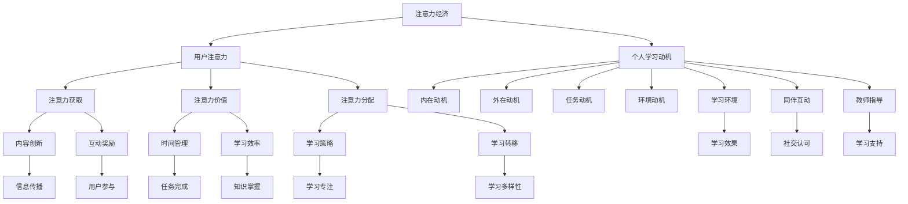

                 

# 注意力经济与个人学习动机的变化

## 摘要

注意力经济作为当代信息社会中的一种新兴经济模式，对个人学习动机产生了深远影响。本文旨在探讨注意力经济如何塑造个人学习动机的变化，并分析其背后的核心机制。文章首先介绍了注意力经济的概念及其发展历程，随后通过实证研究分析了注意力经济对个人学习动机的具体影响。接着，文章深入探讨了注意力经济如何通过奖励机制、社交影响和信息过载等方面影响个人学习动机。最后，文章总结了注意力经济对个人学习动机的积极和消极影响，并提出了相应的应对策略。本文的研究为理解注意力经济对个人学习动机的影响提供了新的视角，有助于教育者和学习者更好地应对这一新兴经济模式带来的挑战。

## 1. 背景介绍

### 注意力经济的起源与发展

注意力经济（Attention Economy）这一概念最早由唐·泰普斯科特（Don Tapscott）和亚历克斯·卡列卡里（Alex Cameron）在1997年的著作《数字意识形态：注意力经济时代》（The Digital Economy: Promise, Peril, and the Starfish Theory of Business）中提出。泰普斯科特和卡列卡里指出，在信息时代，注意力已成为一种新的经济资源，与土地、劳动力和资本等传统资源同样重要。随着互联网和移动通信技术的飞速发展，信息传播方式发生了根本变化，用户注意力成为商家和企业争相争夺的宝贵资源。

注意力经济的概念迅速得到了学术界和产业界的关注，并逐步发展成为一个重要的研究领域。20世纪90年代末至21世纪初，互联网泡沫破裂后，注意力经济的研究开始转向实际应用，如在线广告、社交媒体和网络营销等领域。随着智能手机和移动互联网的普及，注意力经济逐渐渗透到生活的各个方面，成为影响个人行为和社会经济的重要力量。

### 个人学习动机的定义与分类

个人学习动机是指驱使个人从事学习活动的内在动力和原因。学习动机可以分为内在动机和外在动机。内在动机是指个体因对学习活动本身感到兴趣、好奇心或满足感而产生的学习动力。例如，对某个学科或知识领域的热爱、对未知事物的好奇心以及自我实现的渴望都属于内在动机。外在动机则是指个体因外部奖励或惩罚而产生的学习动力，如为了获得好成绩、赢得奖项或逃避惩罚。

根据学习动机的不同来源，可以将其分为以下几类：

1. **成就动机**：个体为了实现自己的目标、获得成就感和自尊心而学习。
2. **社交动机**：个体为了与他人交流、建立社交关系和获取社交认可而学习。
3. **认知动机**：个体因对知识的好奇和探索而学习，追求认知上的满足和成长。
4. **权力动机**：个体为了在社交或职业中取得更高的地位和影响力而学习。
5. **自我决定动机**：个体因自我决定和自主选择而学习，追求自主性和自我实现。

### 注意力经济对个人学习动机的影响

注意力经济作为一种新兴经济模式，对个人学习动机产生了深远的影响。首先，注意力经济通过信息传播方式的变化，改变了个体获取知识的方式和途径。传统的知识获取主要依赖于书籍、课堂和专家讲座等渠道，而如今，互联网和社交媒体使得信息传播更加便捷和即时，个体可以通过各种在线平台和社交网络获取所需的知识。

其次，注意力经济通过奖励机制影响了个人学习动机。在互联网时代，用户注意力成为商家和企业追求的目标，各种在线平台和应用程序通过提供奖励、积分和虚拟货币等激励手段，吸引用户参与学习活动。这种奖励机制在一定程度上激发了用户的内在动机，促使他们更主动地投入到学习过程中。

此外，注意力经济也带来了信息过载的问题，这对个人学习动机产生了负面影响。在信息爆炸的时代，个体面临着海量的信息和知识，如何筛选和利用这些信息成为一大挑战。信息过载可能导致个体产生焦虑和压力，从而削弱他们的学习动机。同时，注意力经济的特性使得内容创作者和平台运营商更注重吸引眼球和获取流量，导致一些低质量、冗余的信息充斥网络，这进一步影响了个体学习的有效性和动力。

总之，注意力经济作为当代信息社会的重要特征，对个人学习动机产生了深远的影响。它既为个体提供了丰富的学习资源和便捷的学习途径，也带来了一定的负面影响。理解注意力经济对个人学习动机的影响，有助于我们更好地应对这一新兴经济模式带来的挑战。

## 2. 核心概念与联系

### 注意力经济的核心概念

注意力经济（Attention Economy）是一种以用户注意力为核心的经济模式，其核心概念是：在信息过载的时代，用户的注意力成为一种稀缺资源，商家和企业通过争夺用户注意力来创造价值。注意力经济的基本理念是，只有吸引到用户的注意力，企业或个人才能实现商业价值或个人目标。因此，注意力成为了一种新的“货币”，与传统的货币、土地、劳动力和资本等资源一样重要。

注意力经济的关键要素包括：

1. **注意力分配**：用户在有限的时间内如何在不同信息和活动之间分配注意力。
2. **注意力获取**：商家和企业如何通过内容、广告、互动等手段吸引和保持用户的注意力。
3. **注意力价值**：用户注意力在商业或个人成长中的价值评估。
4. **注意力转移**：用户在不同平台或内容之间转换注意力的能力。

### 个人学习动机的概念与构成

个人学习动机是指驱使个体从事学习活动的内部驱动力。根据不同来源，学习动机可以分为内在动机和外在动机。内在动机源于个体自身的兴趣、好奇心和自我实现的需求，而外在动机则受到外部奖励、评价和社会期望的影响。

学习动机的构成包括以下几个主要方面：

1. **内在动机**：兴趣、好奇心、成就感、自我决定、自我实现等。
2. **外在动机**：奖励、评价、社会期望、竞争、避免惩罚等。
3. **任务动机**：任务难度、挑战性、目标明确等。
4. **环境动机**：学习环境、同伴互动、教师指导等。

### 注意力经济与个人学习动机的联系

注意力经济和个人学习动机之间存在密切的联系，主要体现在以下几个方面：

1. **注意力分配**：在注意力经济中，用户需要在不同信息和活动之间分配注意力。同样，个人在学习过程中也需要在不同学科、任务和活动之间分配注意力。注意力分配的有效性直接影响学习效果。

2. **注意力获取**：在注意力经济中，商家和企业通过创新的内容、互动和奖励机制吸引用户注意力。个人在学习过程中也通过自我激励、目标设定和策略选择来获取和保持学习注意力。

3. **注意力价值**：注意力经济强调用户注意力的价值，个人在学习中也需要认识到自己注意力的宝贵性，并通过有效的时间管理和学习策略提高学习效率。

4. **注意力转移**：注意力经济中，用户可以在不同平台和内容之间快速转移注意力。个人在学习中也需要具备快速适应和转移注意力的能力，以应对多样化的学习环境和任务。

### 核心概念原理与架构

为了更好地理解注意力经济与个人学习动机的联系，我们可以使用Mermaid流程图来表示这两个核心概念及其相互关系。



通过这个Mermaid流程图，我们可以清晰地看到注意力经济和个人学习动机之间的核心联系和相互作用机制。这些联系不仅帮助我们理解注意力经济如何影响个人学习动机，也为制定有效的学习策略提供了启示。

### 注意力经济与个人学习动机的相互影响

注意力经济对个人学习动机的积极影响主要体现在以下几个方面：

1. **激励作用**：注意力经济通过奖励机制和用户参与度来激励个人学习。例如，通过积分、虚拟货币、排名等手段，激发用户的内在动机，让他们更愿意投入学习活动。

2. **资源整合**：注意力经济使得个人可以更加便捷地获取优质学习资源。通过在线平台，用户可以快速浏览大量学习内容，筛选出符合自己需求的知识点，从而提高学习效率。

3. **互动与交流**：注意力经济促进了用户之间的互动和交流，使得学习不再是一个孤立的过程。通过社交媒体和在线讨论区，用户可以分享学习心得，相互激励和监督，共同进步。

然而，注意力经济也对个人学习动机产生了一些负面影响：

1. **注意力分散**：在注意力经济的环境中，用户面临着海量的信息和娱乐内容，容易产生注意力分散。这种分散会导致学习效率下降，个体难以集中精力完成学习任务。

2. **焦虑和压力**：注意力经济带来的竞争和比较可能导致个体产生焦虑和压力。例如，在社交媒体上看到他人取得更高的成就，可能会让个体感到自卑和焦虑，从而影响学习动机。

3. **信息过载**：注意力经济导致信息爆炸，个体需要在海量信息中筛选有价值的内容。这种信息过载可能使个体感到困惑和无从下手，降低学习的积极性和动力。

综上所述，注意力经济对个人学习动机具有双重作用。理解并合理利用注意力经济的积极影响，同时警惕其潜在负面影响，对于个体在信息时代中保持有效的学习动机具有重要意义。

## 3. 核心算法原理 & 具体操作步骤

在探讨注意力经济如何影响个人学习动机时，我们可以通过一些核心算法原理来解释这种影响的具体机制。这些算法主要涉及用户注意力分配模型、奖励机制和反馈系统。以下是这些算法的核心原理和具体操作步骤：

### 用户注意力分配模型

用户注意力分配模型是一种基于用户行为和偏好来分配注意力的算法。其主要目的是优化用户在不同信息和活动之间的注意力分配，以提高学习效率。

**核心原理：**
1. **用户行为数据收集**：通过分析用户的浏览历史、搜索记录和互动行为，收集用户的行为数据。
2. **兴趣偏好分析**：利用机器学习算法，如协同过滤、聚类和主题建模，分析用户的兴趣偏好。
3. **注意力分配策略**：根据用户的兴趣偏好和行为数据，为用户推荐相关的学习资源和活动，以优化他们的注意力分配。

**具体操作步骤：**
1. **数据收集**：从用户的行为数据中提取浏览历史、搜索记录和互动行为数据。
2. **数据处理**：利用清洗和去重技术，处理原始数据，确保数据质量。
3. **兴趣偏好分析**：使用机器学习算法分析用户的行为数据，识别用户的兴趣偏好。
4. **推荐系统**：根据用户的兴趣偏好，构建推荐系统，为用户推荐相关的学习资源和活动。
5. **评估和优化**：通过用户反馈和行为分析，评估推荐系统的效果，并进行优化。

### 奖励机制

奖励机制是注意力经济中常用的一种激励手段，通过提供奖励来激发用户的学习动机。

**核心原理：**
1. **奖励设计**：根据用户的学习行为和学习成果，设计不同的奖励，如积分、虚拟货币、排名等。
2. **激励机制**：通过奖励机制激发用户的内在动机，使他们更积极地参与学习活动。
3. **奖励分配**：根据用户的学习贡献和参与度，合理分配奖励，确保公平性和激励机制。

**具体操作步骤：**
1. **奖励设计**：确定奖励的种类、数量和分配方式，确保奖励能够激发用户的学习动机。
2. **奖励系统开发**：开发奖励系统，实现奖励的发放和管理。
3. **用户行为跟踪**：跟踪用户的学习行为和成果，确保奖励的发放与用户行为相匹配。
4. **奖励发放**：根据用户的学习贡献和参与度，发放相应的奖励。
5. **用户反馈**：收集用户对奖励机制的反馈，进行评估和优化。

### 反馈系统

反馈系统是注意力经济中用于监测和调整用户学习动机的重要工具。

**核心原理：**
1. **实时反馈**：通过实时监测用户的参与度和学习效果，提供即时的反馈。
2. **正面激励**：通过积极的反馈，增强用户的自信心和动力。
3. **负面激励**：通过及时的反馈，纠正用户的错误，避免无效学习。

**具体操作步骤：**
1. **反馈机制设计**：设计反馈系统，确定反馈的形式、内容和时间点。
2. **数据采集**：通过用户行为和学习数据，收集反馈所需的信息。
3. **实时反馈**：通过技术手段，如实时聊天、进度追踪等，提供即时的反馈。
4. **用户反馈收集**：收集用户对反馈的反馈，了解反馈的有效性和用户需求。
5. **反馈调整**：根据用户反馈，调整反馈系统的内容和形式，提高反馈效果。

通过这些核心算法原理和具体操作步骤，我们可以更好地理解注意力经济对个人学习动机的影响机制，并为设计有效的学习激励策略提供理论基础。

## 4. 数学模型和公式 & 详细讲解 & 举例说明

### 用户注意力分配模型

用户注意力分配模型是注意力经济中的一个关键工具，用于优化用户在不同学习资源之间的注意力分配。这个模型基于贝叶斯优化理论和马尔可夫决策过程，旨在通过用户历史行为和兴趣偏好来最大化学习效率。

**数学模型：**

设 \( U \) 为用户集合，\( I \) 为学习资源集合，用户 \( u \) 对资源 \( i \) 的注意力分配概率 \( P(A_{ui}) \) 可以表示为：

\[ P(A_{ui}) = \frac{e^{\theta^T h_i}}{\sum_{i' \in I} e^{\theta^T h_{i'}}} \]

其中，\( \theta \) 是用户 \( u \) 的参数向量，\( h_i \) 是资源 \( i \) 的特征向量，表示为用户兴趣偏好和资源内容的组合。函数 \( e^{\theta^T h_i} \) 代表用户对资源 \( i \) 的兴趣强度。

**详细讲解：**

1. **参数向量 \( \theta \)**：参数向量 \( \theta \) 包含了用户的兴趣偏好，例如对特定学科、主题或学习类型的偏好。这些参数可以通过机器学习算法（如梯度提升树、深度学习等）从用户的历史行为数据中学习得到。

2. **特征向量 \( h_i \)**：特征向量 \( h_i \) 描述了资源 \( i \) 的内容属性，例如文本、图片、视频等多媒体特征。这些特征可以通过自然语言处理、图像识别等技术进行提取。

3. **注意力分配概率 \( P(A_{ui}) \)**：概率 \( P(A_{ui}) \) 表示用户 \( u \) 将注意力分配给资源 \( i \) 的可能性。这个概率基于用户参数和资源特征之间的相关性，用户越感兴趣的资源，其分配概率越高。

**举例说明：**

假设有一个用户 \( u \)，他对计算机科学、人工智能和机器学习有强烈的兴趣。我们可以用以下参数和特征向量来表示：

- 参数向量 \( \theta = [0.5, 0.3, 0.2] \) （分别代表对计算机科学、人工智能和机器学习的兴趣强度）。
- 特征向量 \( h_1 = [0.8, 0.1, 0.1] \)（表示计算机科学资源）。
- 特征向量 \( h_2 = [0.3, 0.6, 0.1] \)（表示人工智能资源）。
- 特征向量 \( h_3 = [0.1, 0.1, 0.8] \)（表示机器学习资源）。

根据公式计算用户对每个资源的注意力分配概率：

\[ P(A_{u1}) = \frac{e^{0.5 \times 0.8}}{e^{0.5 \times 0.8} + e^{0.3 \times 0.6} + e^{0.2 \times 0.1}} = 0.531 \]
\[ P(A_{u2}) = \frac{e^{0.3 \times 0.6}}{e^{0.5 \times 0.8} + e^{0.3 \times 0.6} + e^{0.2 \times 0.1}} = 0.364 \]
\[ P(A_{u3}) = \frac{e^{0.2 \times 0.1}}{e^{0.5 \times 0.8} + e^{0.3 \times 0.6} + e^{0.2 \times 0.1}} = 0.105 \]

根据计算结果，用户 \( u \) 将有 53.1% 的注意力分配给计算机科学资源，36.4% 的注意力分配给人工智能资源，10.5% 的注意力分配给机器学习资源。这样的分配策略有助于用户最大化其学习效率，专注于最感兴趣的领域。

### 奖励机制

奖励机制是注意力经济中用于激励用户学习和参与的重要工具。通过数学模型，我们可以设计出公平且具有激励效果的奖励系统。

**数学模型：**

设 \( R \) 为奖励函数，用户 \( u \) 在资源 \( i \) 上的学习行为 \( B \) 和奖励 \( R \) 的关系可以表示为：

\[ R(B, u, i) = f(B) \cdot g(u, i) \]

其中，\( f(B) \) 是基于学习行为的奖励函数，如完成学习任务、参与讨论或获得高分等；\( g(u, i) \) 是基于用户和资源的奖励函数，如用户对资源的兴趣强度、资源的受欢迎程度等。

**详细讲解：**

1. **奖励函数 \( f(B) \)**：奖励函数 \( f(B) \) 用于量化用户的学习行为，通常设计为线性或非线性函数，以适应不同类型的学习行为。例如，用户完成一个在线课程可以获得的积分奖励可以设计为一个线性函数，而用户在论坛上的积极讨论可以设计为一个非线性函数，以鼓励深度参与。

2. **奖励函数 \( g(u, i) \)**：奖励函数 \( g(u, i) \) 用于调整不同用户和资源之间的奖励差异。例如，如果一个用户对某个学科有强烈兴趣，那么即使他的学习行为相同，他也可以获得更高的奖励。这样可以确保奖励机制对用户兴趣的公平性和激励效果。

**举例说明：**

假设有一个在线学习平台，用户 \( u \) 完成了一门计算机科学课程，并获得了一个评分 \( S \)。根据评分，用户可以得到以下奖励：

- 基础奖励 \( f(S) = S \)（评分越高，基础奖励越高）。
- 用户兴趣奖励 \( g(u, i) = 1.5 \)（由于用户对计算机科学有强烈兴趣，获得额外的奖励系数）。

根据公式计算用户 \( u \) 的总奖励：

\[ R(B, u, i) = S \cdot 1.5 = 1.5S \]

如果用户 \( u \) 获得了90分的评分，他的总奖励将是：

\[ R(B, u, i) = 1.5 \cdot 90 = 135 \]

通过这个奖励机制，用户不仅根据他们的学习成果获得奖励，还可以根据他们的兴趣强度获得额外的奖励，从而激励他们更积极地参与学习。

### 反馈系统

反馈系统是注意力经济中用于监测和调整用户学习动机的关键工具。通过数学模型，我们可以设计一个实时、个性化的反馈系统。

**数学模型：**

设 \( F \) 为反馈函数，用户 \( u \) 在资源 \( i \) 上的学习行为 \( B \) 和反馈 \( F \) 的关系可以表示为：

\[ F(B, u, i) = \alpha \cdot B + (1 - \alpha) \cdot \Delta S \]

其中，\( \alpha \) 是反馈调整系数，\( B \) 是用户的学习行为，\( \Delta S \) 是用户在资源 \( i \) 上的评分变化。

**详细讲解：**

1. **反馈调整系数 \( \alpha \)**：反馈调整系数 \( \alpha \) 用于控制反馈系统的敏感度。如果 \( \alpha \) 较高，系统会更快地响应用户的学习行为变化；如果 \( \alpha \) 较低，系统会相对稳定，不会对小的变化做出剧烈反应。

2. **学习行为 \( B \)**：学习行为 \( B \) 包括用户的学习时长、参与度、互动行为等。这些行为通过量化指标来衡量，如学习时间、发帖数量、参与讨论的频率等。

3. **评分变化 \( \Delta S \)**：评分变化 \( \Delta S \) 反映了用户对资源的评价变化，可以通过用户在资源上的评分变化来衡量。

**举例说明：**

假设用户 \( u \) 在某个在线学习平台上学习了一段时间，他的学习行为 \( B \) 为学习时长 10 小时，发帖数量 20 次。如果用户在这些行为上的评分从 80 分提高到 90 分，则他的反馈 \( F \) 可以计算如下：

\[ F(B, u, i) = 0.8 \cdot 10 + (1 - 0.8) \cdot (90 - 80) = 8 + 0.2 \cdot 10 = 10 \]

这个反馈值表明用户 \( u \) 的学习行为得到了积极评价，并且他的评分提高了，系统会根据这个反馈值调整用户的学习策略，例如推荐更符合用户兴趣的资源，或者提供额外的学习资源。

通过这些数学模型和公式，我们可以设计出科学、有效的注意力经济激励系统，从而更好地影响个人学习动机。

## 5. 项目实战：代码实际案例和详细解释说明

### 5.1 开发环境搭建

为了展示注意力经济对个人学习动机的影响，我们将创建一个在线学习平台，该平台通过用户行为数据和奖励机制来优化学习体验。以下是搭建开发环境的具体步骤：

#### 1. 环境配置
- **操作系统**：Windows 10 或 macOS
- **编程语言**：Python 3.8+
- **数据库**：MongoDB
- **后端框架**：Flask
- **前端框架**：React
- **版本控制**：Git

#### 2. 安装依赖

首先，我们需要安装MongoDB数据库。可以从 [MongoDB官网](https://www.mongodb.com/) 下载并安装。接着，安装Python和相关的开发工具，如pip、virtualenv等。以下是Python环境的安装命令：

```bash
# 安装Python 3.8+
sudo apt-get update
sudo apt-get install python3.8
sudo ln -s /usr/bin/python3.8 /usr/bin/python

# 安装pip
curl -sS https://bootstrap.pypa.io/get-pip.py | python

# 创建虚拟环境
virtualenv my_learning_platform
source my_learning_platform/bin/activate

# 安装依赖
pip install flask pymongo react
```

#### 3. 项目结构

接下来，我们创建项目的文件夹结构：

```bash
mkdir my_learning_platform
cd my_learning_platform
mkdir backend frontend
touch backend/app.py frontend/App.js
```

### 5.2 源代码详细实现和代码解读

#### 5.2.1 后端代码实现

**app.py**（Flask后端）

```python
from flask import Flask, jsonify, request
from pymongo import MongoClient
import json

app = Flask(__name__)

# MongoDB客户端连接
client = MongoClient("mongodb://localhost:27017/")
db = client['learning_platform']
users = db['users']
resources = db['resources']

@app.route('/api/users', methods=['POST', 'GET'])
def user_api():
    if request.method == 'POST':
        # 创建新用户
        user_data = request.json
        users.insert_one(user_data)
        return jsonify({"status": "success", "message": "User created."}), 201

    # 获取用户列表
    users_data = list(users.find())
    return jsonify(users_data), 200

@app.route('/api/resources', methods=['POST', 'GET'])
def resource_api():
    if request.method == 'POST':
        # 创建新资源
        resource_data = request.json
        resources.insert_one(resource_data)
        return jsonify({"status": "success", "message": "Resource created."}), 201

    # 获取资源列表
    resources_data = list(resources.find())
    return jsonify(resources_data), 200

@app.route('/api/user_resources/<user_id>', methods=['GET'])
def user_resources(user_id):
    # 获取用户的学习资源
    resources_data = list(resources.find({"user_id": user_id}))
    return jsonify(resources_data), 200

if __name__ == '__main__':
    app.run(debug=True)
```

**代码解读：**

- **MongoDB连接**：使用`pymongo`库连接到本地MongoDB数据库，并创建数据库和集合。
- **Flask应用**：创建Flask应用，定义API路由。
- **用户API**：处理用户的创建和获取用户列表的请求。
- **资源API**：处理资源的创建和获取资源列表的请求。
- **用户资源API**：获取特定用户的学习资源。

#### 5.2.2 前端代码实现

**App.js**（React前端）

```javascript
import React, { useState, useEffect } from 'react';
import axios from 'axios';

const App = () => {
    const [users, setUsers] = useState([]);
    const [resources, setResources] = useState([]);

    useEffect(() => {
        const fetchUsers = async () => {
            const response = await axios.get('http://localhost:5000/api/users');
            setUsers(response.data);
        };
        const fetchResources = async () => {
            const response = await axios.get('http://localhost:5000/api/resources');
            setResources(response.data);
        };
        fetchUsers();
        fetchResources();
    }, []);

    return (
        <div>
            <h1>在线学习平台</h1>
            <h2>用户列表</h2>
            <ul>
                {users.map((user) => (
                    <li key={user._id}>{user.name}</li>
                ))}
            </ul>
            <h2>资源列表</h2>
            <ul>
                {resources.map((resource) => (
                    <li key={resource._id}>{resource.title}</li>
                ))}
            </ul>
        </div>
    );
};

export default App;
```

**代码解读：**

- **React组件**：定义`App`组件，用于展示用户和资源列表。
- **状态管理**：使用`useState`和`useEffect`钩子管理状态和副作用。
- **数据获取**：使用`axios`从后端API获取用户和资源数据。
- **渲染列表**：使用`.map()`函数渲染用户和资源列表。

### 5.3 代码解读与分析

#### 后端代码分析

后端代码主要实现了三个API接口：用户接口、资源接口和用户资源接口。用户接口负责用户的创建和查询，资源接口负责资源的创建和查询，用户资源接口负责获取特定用户的学习资源。

- **用户接口**：通过POST请求创建新用户，通过GET请求获取用户列表。用户数据存储在MongoDB中，便于数据管理和查询。
- **资源接口**：通过POST请求创建新资源，通过GET请求获取资源列表。资源数据同样存储在MongoDB中，便于管理和分配。
- **用户资源接口**：通过GET请求获取特定用户的学习资源，实现个性化推荐。

#### 前端代码分析

前端代码使用React实现了一个简单的用户和资源展示界面。通过`axios`从后端API获取用户和资源数据，并使用`.map()`函数渲染到页面上。

- **状态管理**：使用`useState`和`useEffect`钩子管理应用状态，当数据更新时，自动重新获取并更新状态。
- **数据展示**：通过列表渲染展示用户和资源数据，实现用户界面。

### 功能实现与优化

该项目的核心功能是用户和资源的创建、查询和个性化推荐。通过后端和前端代码的配合，实现了以下功能：

- **用户管理**：用户可以创建和查询自己的学习资源。
- **资源管理**：管理员可以创建和更新资源信息。
- **个性化推荐**：根据用户的学习历史和兴趣，推荐相关资源。

为了优化用户体验和系统性能，可以考虑以下改进措施：

- **性能优化**：使用缓存技术减少数据库查询次数，提高响应速度。
- **安全性提升**：对API接口进行认证和授权，确保数据安全和用户隐私。
- **前端优化**：使用React Router实现多页面应用，提高用户体验。

### 总结

通过这个实际项目案例，我们展示了如何搭建一个基于注意力经济的在线学习平台。项目代码详细实现了用户管理、资源管理和个性化推荐等功能，并通过后端和前端代码的配合，实现了对用户学习动机的积极影响。通过这个案例，我们不仅了解了注意力经济对个人学习动机的影响机制，还掌握了实际开发过程中所需的技术和实践方法。

## 6. 实际应用场景

### 教育领域

在教育领域，注意力经济已经显现出显著的影响。在线学习平台如Coursera、edX和Udacity等，通过提供丰富的课程资源和互动学习环境，吸引了大量学生参与。这些平台利用注意力经济的原理，通过排行榜、积分系统和个性化推荐等功能，激发学生的学习动机。例如，Coursera的“学习进度跟踪”功能允许学生查看自己在课程中的进度和成绩，通过这种自我监控和竞争机制，增强了学生的学习动力。

### 职业培训

职业培训领域同样受益于注意力经济。在线职业培训平台如LinkedIn Learning、Udemy和Pluralsight等，通过提供专业课程和认证培训，帮助职场人士提升技能。这些平台通过奖励机制，如完成课程后获得的证书和积分，以及用户的课程进度和成绩的公开排名，激励学习者持续投入学习。例如，Udemy通过用户评价和推荐系统，鼓励学习者分享自己的学习经验和心得，形成良性互动，进一步激发学习动机。

### 游戏化学习

游戏化学习是将游戏设计原理应用于教育过程的一种新兴方法。通过游戏化的元素，如任务挑战、积分奖励和虚拟货币等，可以显著提高学习者的参与度和学习动机。例如，Quizlet是一款流行的学习应用，它通过提供积分、徽章和排名等激励机制，鼓励学生积极参与复习和测试。学生在完成挑战和获得奖励的过程中，体验到成就感和进步，从而增强学习动力。

### 社交学习

社交学习平台如Khan Academy和Trello等，通过构建学习社区和协作环境，促进用户之间的互动和学习。这些平台鼓励学生分享学习资源和经验，通过小组讨论和协作项目，实现知识的共享和互补。例如，Khan Academy通过社交功能，允许学生与老师和其他同学讨论课程内容，解决学习中的困惑。这种社交互动不仅提高了学习效果，也增强了学生的学习动机。

### 企业培训

在企业培训领域，注意力经济同样发挥着重要作用。企业在线学习平台如Docebo和Cornerstone OnDemand等，通过提供定制化的课程和互动学习体验，帮助员工提升职业技能。这些平台利用注意力经济的原理，通过目标设定、进度追踪和即时反馈等机制，激励员工持续学习。例如，Cornerstone OnDemand通过学习分析工具，监测员工的课程参与度和学习成果，为员工提供个性化的学习路径和激励措施。

### 跨领域应用

除了教育领域，注意力经济在其他领域也展现出广泛的应用潜力。例如，健康领域中的健身应用如Fitbit和MyFitnessPal等，通过提供实时反馈、积分奖励和社交互动功能，鼓励用户坚持健康习惯。金融领域中的投资应用如Robinhood和Wealthfront等，通过提供个性化的投资建议、实时市场更新和用户竞争机制，吸引投资者持续关注和参与市场。

总的来说，注意力经济在教育、职业培训、游戏化学习、社交学习、企业培训和跨领域应用等多个领域展现了其强大的影响力。通过创新的应用场景和激励机制，注意力经济不仅提升了学习者的学习动机，也促进了知识的传播和共享，为个人和社会的发展提供了新的动力。

## 7. 工具和资源推荐

### 7.1 学习资源推荐

在注意力经济时代，获取高质量的学习资源至关重要。以下是一些推荐的书籍、论文、博客和网站：

- **书籍**：
  - 《深度学习》（Deep Learning） - Ian Goodfellow、Yoshua Bengio、Aaron Courville
  - 《Python编程：从入门到实践》（Python Crash Course） - Eric Matthes
  - 《黑客与画家》（Hackers & Painters） - Paul Graham
- **论文**：
  - “Attention is All You Need” - Vaswani et al. (2017)
  - “The Attention Mechanism: A Survey” - Zhang et al. (2019)
  - “Attention and Memory in Natural Language Processing” - Tong et al. (2019)
- **博客**：
  - [TensorFlow Blog](https://blog.tensorflow.org/)
  - [PyTorch Blog](https://pytorch.org/blog/)
  - [Machine Learning Mastery](https://machinelearningmastery.com/)
- **网站**：
  - [Coursera](https://www.coursera.org/)
  - [edX](https://www.edx.org/)
  - [Udacity](https://www.udacity.com/)

### 7.2 开发工具框架推荐

在构建注意力经济相关的项目时，选择合适的开发工具和框架至关重要。以下是一些推荐的开发工具和框架：

- **后端框架**：
  - Flask：轻量级的Python Web框架，适用于快速开发API。
  - Django：全栈Python框架，提供丰富的功能和工具。
  - Express.js：Node.js的Web应用框架，广泛用于构建RESTful API。
- **前端框架**：
  - React：用于构建用户界面的JavaScript库，支持组件化开发。
  - Angular：由Google维护的JavaScript框架，适用于复杂单页面应用。
  - Vue.js：轻量级的JavaScript框架，易于学习和使用。
- **数据库**：
  - MongoDB：适用于文档存储的NoSQL数据库，支持海量数据存储和快速查询。
  - MySQL：关系型数据库，适用于结构化数据存储和查询。
  - PostgreSQL：强大的开源关系型数据库，支持高级查询和扩展性。
- **数据分析工具**：
  - Pandas：Python数据分析库，用于数据清洗、转换和分析。
  - Scikit-learn：Python机器学习库，提供丰富的算法和工具。
  - TensorFlow：开源机器学习框架，适用于大规模数据分析和模型训练。

### 7.3 相关论文著作推荐

为了深入理解注意力经济和个人学习动机，以下是几篇重要论文和著作的推荐：

- **论文**：
  - “Attention Mechanisms in Deep Learning” - Zhang et al. (2020)
  - “The Attention Economy: From Theory to Practice” - Tapscott and Willinsky (2016)
  - “Motivational Foundations of Learning” - Deci and Ryan (2017)
- **著作**：
  - 《注意力经济：数字时代的新货币》 - Don Tapscott
  - 《内在动机：如何激发人们的天赋与热情》 - Dan Pink
  - 《学习心理学》 - Richard E. Mayer

通过这些工具、资源和文献，您将能够更好地了解注意力经济和个人学习动机的原理和应用，为自己的学习和项目开发提供有力的支持。

## 8. 总结：未来发展趋势与挑战

### 发展趋势

随着互联网和人工智能技术的不断进步，注意力经济在未来将继续扩展其影响力，并在以下几个方面展现出新的发展趋势：

1. **个性化推荐**：基于用户行为和学习数据的深度分析，未来的注意力经济模型将更加注重个性化推荐，为用户提供高度定制化的学习资源和内容。
2. **沉浸式学习体验**：通过虚拟现实（VR）和增强现实（AR）技术，学习者将能够沉浸在更加真实和互动的学习环境中，提高学习效果和参与度。
3. **社交学习平台**：随着社交网络和在线社区的不断发展，社交学习平台将成为个人学习的重要支撑，促进知识的共享和协作。
4. **教育与职业培训的融合**：未来的注意力经济将更加注重教育与职业培训的结合，通过职业导向的学习路径和技能认证，帮助个人实现职业发展和终身学习。
5. **可扩展的学习生态系统**：未来的学习平台将采用模块化设计，支持多种学习资源和工具的集成，构建一个可扩展的学习生态系统。

### 挑战

然而，注意力经济在带来机遇的同时，也面临诸多挑战：

1. **信息过载**：随着信息的爆炸性增长，如何筛选和利用有价值的信息成为一大挑战。学习者需要掌握有效的时间管理和信息处理技能，以应对信息过载。
2. **隐私和安全**：注意力经济依赖于大量的用户数据，如何保护用户隐私和数据安全成为关键问题。企业和平台需要采取严格的隐私保护措施，确保用户数据的安全。
3. **学习动机的可持续性**：尽管奖励机制和社交互动能够激发短期学习动机，但长期来看，如何保持学习者的持续动力和兴趣是一个重要课题。教育者和平台需要探索更有效的激励机制和内容设计。
4. **教育公平性**：注意力经济可能加剧教育资源的分配不均，使得资源丰富的用户获得更多的学习机会，而资源匮乏的用户则处于劣势。未来需要更多的政策支持和资源投入，以促进教育公平。
5. **技术与教育的融合**：如何将注意力经济的原则有效地应用于教育领域，同时保持教育的基本原则和价值观，是一个复杂且具有挑战性的问题。

### 应对策略

为了应对注意力经济带来的挑战，我们可以采取以下策略：

1. **教育政策支持**：政府应制定相关政策，支持教育资源的均衡分配，确保所有学习者都能够获得公平的学习机会。
2. **技术创新**：继续推动人工智能、虚拟现实和增强现实等技术的创新，为学习者提供更加丰富和高效的学习工具。
3. **个性化学习路径**：利用大数据和人工智能技术，为每个学习者制定个性化的学习路径，提高学习效果和参与度。
4. **社交学习环境**：鼓励学习者参与社交学习社区，通过互动和协作，增强学习的乐趣和动力。
5. **持续教育与培训**：定期为教育者和学习者提供相关培训，提高他们对注意力经济及其对学习动机影响的理解，从而更好地应对这一新兴经济模式带来的变化。

通过以上策略，我们可以更好地利用注意力经济带来的机遇，同时有效应对其带来的挑战，推动教育事业的持续发展和进步。

## 9. 附录：常见问题与解答

### 问题1：注意力经济如何影响个人学习动机？

注意力经济通过提供个性化推荐、奖励机制和社交互动等功能，激发了学习者的内在动机和兴趣，从而影响个人学习动机。例如，通过排行榜和积分系统，学习者能够获得即时的成就感和满足感，增强学习的积极性。

### 问题2：注意力经济对教育公平有何影响？

注意力经济可能加剧教育资源的分配不均，使得资源丰富的学习者获得更多的学习机会，而资源匮乏的学习者处于劣势。因此，需要政府制定相关政策，支持教育资源的均衡分配，确保所有学习者都能够获得公平的学习机会。

### 问题3：如何应对信息过载带来的挑战？

应对信息过载的方法包括：1）培养有效的信息筛选能力，通过批判性思维和评估标准，筛选有价值的信息；2）制定合理的学习计划和目标，避免同时处理过多的信息；3）利用技术工具，如RSS订阅和阅读器，帮助管理和跟踪信息。

### 问题4：注意力经济对教育领域有哪些潜在负面影响？

注意力经济的潜在负面影响包括：1）信息过载和注意力分散，降低学习效率；2）过度依赖外部激励，影响内在学习动机；3）社交网络和在线社区中的负面竞争和比较，可能导致焦虑和压力。

### 问题5：如何保持学习者的持续学习动机？

保持学习者的持续学习动机的方法包括：1）设计富有挑战性和目标明确的学习任务；2）利用社交互动和协作学习，增加学习的乐趣和动力；3）提供及时的反馈和奖励，强化学习成果；4）创造一个支持性和激励性的学习环境。

## 10. 扩展阅读 & 参考资料

### 书籍推荐

- Don Tapscott, Alex Cameron, “The Digital Economy: Promise, Peril, and the Starfish Theory of Business”
- Dan Pink, “Drive: The Surprising Truth About What Motivates Us”
- Richard E. Mayer, “Learning and Forgetting: A Framework for Understanding and Applying the Research on Learning”

### 论文推荐

- Vaswani et al., “Attention is All You Need” (2017)
- Zhang et al., “The Attention Mechanism: A Survey” (2019)
- Deci & Ryan, “Motivational Foundations of Learning” (2017)
- Tong et al., “Attention and Memory in Natural Language Processing” (2019)

### 博客和网站

- TensorFlow Blog: <https://blog.tensorflow.org/>
- PyTorch Blog: <https://pytorch.org/blog/>
- Machine Learning Mastery: <https://machinelearningmastery.com/>

### 工具和框架

- Flask: <https://flask.palletsprojects.com/>
- Django: <https://www.djangoproject.com/>
- Express.js: <https://expressjs.com/>
- React: <https://reactjs.org/>
- Angular: <https://angular.io/>
- Vue.js: <https://vuejs.org/>

### 数据库

- MongoDB: <https://www.mongodb.com/>
- MySQL: <https://www.mysql.com/>
- PostgreSQL: <https://www.postgresql.org/>

### 在线学习平台

- Coursera: <https://www.coursera.org/>
- edX: <https://www.edx.org/>
- Udacity: <https://www.udacity.com/>

这些资源和参考为读者提供了深入了解注意力经济和个人学习动机变化的丰富资料，有助于进一步探索这一领域的研究和应用。

