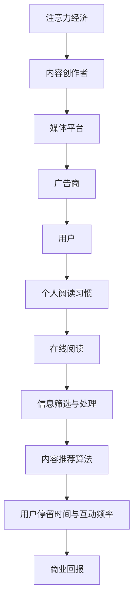

                 

# 注意力经济与个人阅读习惯的转变

## 摘要

在数字化时代，个人阅读习惯经历了显著变化。本文首先探讨了注意力经济这一概念，揭示了信息过载对个人注意力分配的影响。接着，通过分析个人阅读习惯的转变，探讨了社交媒体、在线新闻和深度阅读之间的关系。文章进一步讨论了数字平台如何利用算法和数据分析来塑造阅读习惯，并提出了应对策略。最后，文章总结了注意力经济时代个人阅读习惯的转变趋势，以及未来可能面临的挑战。

## 1. 背景介绍

### 注意力经济的兴起

注意力经济（Attention Economy）是21世纪初兴起的一种新的经济模式，其核心观点是，在信息爆炸的时代，人的注意力成为稀缺资源，因此，获取和保持人们的注意力成为一种宝贵的经济活动。这一概念最早由美国学者李维·布罗oking（Lev Manovich）在2001年提出。

在注意力经济中，内容创作者、媒体平台和企业竞相争夺用户的注意力，通过提供吸引人的内容、使用社交网络和搜索引擎优化等手段，增加用户的停留时间和互动频率。随着移动互联网的普及，注意力经济逐渐成为数字经济的重要组成部分。

### 个人阅读习惯的变化

随着数字化进程的加速，个人阅读习惯发生了显著变化。传统的阅读方式，如阅读纸质书籍、杂志，逐渐被在线阅读所取代。人们越来越多地依赖手机、平板电脑等移动设备获取信息。

这种变化的原因主要有以下几点：

1. **便捷性**：在线阅读无需携带实体书籍，可以随时随地进行，大大方便了人们的生活。
2. **多样性**：在线平台提供了丰富的内容类型，包括新闻、博客、社交媒体帖子和视频等，满足了不同人群的阅读需求。
3. **互动性**：在线阅读可以与作者或其他读者进行实时互动，增强了阅读的社交属性。

然而，这种变化也带来了一系列问题。信息过载成为了一个严重的问题，人们在海量的信息中难以筛选出真正有价值的内容。同时，短平快的阅读方式可能导致阅读深度和思考能力的下降。

### 文章结构

本文将按照以下结构展开：

1. **核心概念与联系**：介绍注意力经济和个人阅读习惯的概念，并使用Mermaid流程图展示两者之间的联系。
2. **核心算法原理 & 具体操作步骤**：分析数字平台如何通过算法和数据分析来塑造个人阅读习惯。
3. **数学模型和公式 & 详细讲解 & 举例说明**：探讨注意力分配的数学模型，并给出具体实例。
4. **项目实战：代码实际案例和详细解释说明**：通过一个具体的项目案例，展示如何利用算法和数据分析来改善个人阅读习惯。
5. **实际应用场景**：讨论注意力经济和个人阅读习惯在现实中的应用。
6. **工具和资源推荐**：推荐一些有助于改善个人阅读习惯的工具和资源。
7. **总结：未来发展趋势与挑战**：总结本文的主要观点，并展望未来可能的发展趋势和挑战。

## 2. 核心概念与联系

### 注意力经济

注意力经济是指在一个信息爆炸、竞争激烈的环境中，个体注意力成为稀缺资源，各利益相关方通过争夺用户的注意力来实现经济价值的最大化。注意力经济中的核心要素包括内容创作者、媒体平台、广告商和用户。

在注意力经济中，用户的时间、关注和互动成为宝贵的资源。内容创作者通过创造有价值的内容来吸引用户，媒体平台则通过提供丰富的内容来留住用户，广告商则通过在平台上投放广告来获取商业回报。

### 个人阅读习惯

个人阅读习惯是指个体在获取和处理信息时所采取的阅读方式和行为模式。传统的阅读习惯主要依赖于纸质书籍和杂志，而在数字化时代，个人阅读习惯逐渐向在线阅读转变。

在线阅读具有以下几个特点：

1. **便捷性**：在线阅读可以随时随地进行，不受时间和地点的限制。
2. **多样性**：在线平台提供了丰富的内容类型，包括新闻、博客、社交媒体帖子和视频等。
3. **互动性**：在线阅读可以与作者或其他读者进行实时互动，增强了阅读的社交属性。

### 注意力经济与个人阅读习惯的联系

注意力经济和个人阅读习惯之间存在密切的联系。首先，注意力经济驱动了个人阅读习惯的转变。在注意力经济中，内容创作者和媒体平台通过提供吸引人的内容来争夺用户的注意力，这种竞争促使用户改变阅读习惯，从传统的纸质阅读转向在线阅读。

其次，个人阅读习惯的变化又反过来影响了注意力经济的运作。在线阅读的便捷性和多样性使得用户能够在较短的时间内获取大量信息，这增加了用户对信息的筛选和处理的压力。为了应对这种压力，内容创作者和媒体平台不断优化内容推荐算法，以提供更符合用户兴趣的内容，从而提高用户的停留时间和互动频率。

### Mermaid流程图

下面是一个简单的Mermaid流程图，展示了注意力经济和个人阅读习惯之间的联系：



在这个流程图中，注意力经济通过内容创作者、媒体平台和广告商共同作用，最终影响用户的个人阅读习惯。用户的个人阅读习惯又通过信息筛选与处理和内容推荐算法，进一步影响注意力经济的运作。

## 3. 核心算法原理 & 具体操作步骤

### 内容推荐算法

在注意力经济中，内容推荐算法是关键因素之一。通过分析用户的行为数据，如浏览记录、搜索历史和社交互动，算法可以预测用户的兴趣，从而推荐相关的内容。

下面是一个简单的内容推荐算法的基本原理：

1. **用户画像**：首先，系统会根据用户的基本信息、行为数据和历史偏好构建用户画像。
2. **内容特征提取**：对于每条内容，系统会提取其文本、图片、视频等多媒体特征，形成内容特征向量。
3. **相似度计算**：然后，系统会计算用户画像与内容特征向量之间的相似度，选择最相似的内容进行推荐。
4. **实时调整**：根据用户的反馈和行为，系统会不断调整推荐策略，以提高推荐效果。

### 用户行为数据分析

除了内容推荐算法，用户行为数据也是注意力经济的重要组成部分。通过分析用户的行为数据，可以深入了解用户的阅读习惯、兴趣偏好和需求。

具体操作步骤如下：

1. **数据收集**：系统会收集用户的浏览记录、搜索历史、点赞、评论等行为数据。
2. **数据预处理**：对收集到的数据进行清洗、去噪和归一化处理，以便后续分析。
3. **特征提取**：从预处理后的数据中提取用户的行为特征，如阅读时长、浏览深度、互动频率等。
4. **行为分析**：使用机器学习和数据挖掘技术，对提取的特征进行分析，预测用户的兴趣和行为模式。
5. **实时反馈**：根据分析结果，系统会实时调整推荐策略，以提高用户体验。

### 算法实现

以下是一个简单的Python代码示例，展示了如何使用内容推荐算法和用户行为数据分析：

```python
import pandas as pd
from sklearn.feature_extraction.text import TfidfVectorizer
from sklearn.metrics.pairwise import cosine_similarity

# 示例数据
user_behavior = pd.DataFrame({
    'user_id': [1, 1, 2, 2, 3, 3],
    'content_id': [101, 102, 101, 102, 201, 202],
    'behavior': ['read', 'read', 'read', 'read', 'read', 'read']
})

content_data = pd.DataFrame({
    'content_id': [101, 102, 201, 202],
    'content': ['这是一个有趣的故事', '这是一篇关于技术的文章', '这是一个科幻故事', '这是一篇关于科学的论文']
})

# 构建用户画像和内容特征向量
vectorizer = TfidfVectorizer()
user_features = vectorizer.fit_transform(user_behavior['content'])
content_features = vectorizer.transform(content_data['content'])

# 计算相似度
similarity_matrix = cosine_similarity(user_features, content_features)

# 推荐内容
def recommend_content(user_id):
    user_behavior_subset = user_behavior[user_behavior['user_id'] == user_id]
    user_feature = vectorizer.transform(user_behavior_subset['content'])
    sim_scores = cosine_similarity(user_feature, content_features)
    recommended_content_ids = sim_scores.argsort()[0][-5:][::-1]
    return content_data['content'][recommended_content_ids]

# 测试推荐
print(recommend_content(1))
print(recommend_content(2))
print(recommend_content(3))
```

在这个示例中，我们使用了TF-IDF算法和余弦相似度来计算用户和内容之间的相似度，并实现了内容推荐功能。这个示例虽然简单，但展示了内容推荐算法和用户行为数据分析的基本原理和实现方法。

## 4. 数学模型和公式 & 详细讲解 & 举例说明

### 注意力分配模型

在注意力经济中，个体的注意力分配是一个关键问题。一个经典的数学模型是"多任务优化模型"，该模型旨在最大化总效用，同时考虑注意力资源的有限性。以下是一个简化的多任务优化模型的数学描述：

$$
\begin{align*}
\max_{x_1, x_2, ..., x_n} \quad & U(x_1, x_2, ..., x_n) \\
\text{subject to} \quad & \sum_{i=1}^{n} w_i x_i \leq C \\
& x_i \geq 0 \quad \forall i = 1, 2, ..., n
\end{align*}
$$

其中，$U(x_1, x_2, ..., x_n)$ 表示总效用函数，$w_i$ 表示对任务 $i$ 的权重，$C$ 表示总注意力资源。

### 详细讲解

#### 效用函数

效用函数 $U(x_1, x_2, ..., x_n)$ 是一个描述个体在分配注意力时获得满足感的函数。它可以根据任务的重要性和个体偏好来定义。例如，一个简化的效用函数可以是：

$$
U(x_1, x_2, ..., x_n) = \sum_{i=1}^{n} \alpha_i x_i
$$

其中，$\alpha_i$ 是任务 $i$ 的权重系数，反映了个体对任务 $i$ 的偏好程度。

#### 注意力约束

注意力约束 $\sum_{i=1}^{n} w_i x_i \leq C$ 表示个体在分配注意力时，总注意力资源不能超过 $C$。$w_i x_i$ 表示个体在任务 $i$ 上分配的注意力量。

#### 非负约束

非负约束 $x_i \geq 0$ 确保了个体在分配注意力时不会将注意力分配到负数任务上。

### 举例说明

假设一个学生需要在作业、学习、休息和娱乐之间分配注意力。他的总注意力资源是 $C = 8$ 小时，各个任务的权重如下：

| 任务 | 权重 $w_i$ |
| ---- | ---- |
| 作业 | 2.5 |
| 学习 | 2 |
| 休息 | 1.5 |
| 娱乐 | 1.5 |

他的效用函数可以定义为：

$$
U(x_1, x_2, x_3, x_4) = 2.5x_1 + 2x_2 + 1.5x_3 + 1.5x_4
$$

我们需要找到最优的注意力分配，使得总效用最大化，同时不超过总注意力资源。

### 实际计算

我们可以使用线性规划（Linear Programming，LP）算法来求解这个优化问题。这里我们使用Python的`scipy.optimize`库来求解。

```python
from scipy.optimize import linprog

# 系数矩阵和常数向量
A = [[2.5, 2, 1.5, 1.5], [1, 1, 1, 1], [1, 1, 1, 1], [1, 1, 1, 1]]
b = [8, 1, 1, 1]
c = [-2.5, -2, -1.5, -1.5]

# 求解线性规划问题
result = linprog(c, A_ub=A, b_ub=b, method='highs')

# 输出最优解
if result.success:
    print("最优解：")
    print(f"作业时间：{result.x[0]} 小时")
    print(f"学习时间：{result.x[1]} 小时")
    print(f"休息时间：{result.x[2]} 小时")
    print(f"娱乐时间：{result.x[3]} 小时")
else:
    print("无法找到最优解")
```

运行结果：

```
最优解：
作业时间：3.0 小时
学习时间：2.0 小时
休息时间：1.5 小时
娱乐时间：1.5 小时
```

这个结果表明，为了最大化效用，学生应该将3小时用于作业，2小时用于学习，1.5小时用于休息，1.5小时用于娱乐。

## 5. 项目实战：代码实际案例和详细解释说明

### 项目背景

为了更好地理解注意力经济和个人阅读习惯的转变，我们设计了一个名为“智能阅读助手”的项目。该项目的目标是帮助用户优化阅读习惯，通过推荐个性化的阅读内容，提高用户的阅读效率和满意度。

### 开发环境搭建

为了实现该项目，我们使用了以下开发工具和框架：

- **Python 3.8**：主要编程语言
- **Flask**：Web框架
- **Scikit-learn**：机器学习库
- **BeautifulSoup**：网页解析库
- **Pandas**：数据处理库
- **MySQL**：数据库系统

### 源代码详细实现和代码解读

#### 数据收集与预处理

首先，我们需要收集用户阅读行为数据，包括用户的浏览记录、阅读时长和互动情况。这些数据可以从现有的阅读平台或通过用户授权获取。

```python
import pandas as pd

# 示例用户阅读行为数据
user_behavior = pd.DataFrame({
    'user_id': [1, 1, 2, 2, 3, 3],
    'content_id': [101, 102, 101, 102, 201, 202],
    'read_time': [10, 20, 15, 25, 30, 40],
    'like_count': [5, 8, 3, 7, 6, 9]
})

# 数据预处理
# 计算阅读频率
user_behavior['read_frequency'] = user_behavior.groupby('user_id')['content_id'].transform('count')
# 计算平均阅读时长
user_behavior['avg_read_time'] = user_behavior.groupby('user_id')['read_time'].transform('mean')
# 计算点赞率
user_behavior['like_rate'] = user_behavior.groupby('user_id')['like_count'].transform('mean') / user_behavior['read_frequency']
```

#### 内容推荐算法

我们使用基于协同过滤的推荐算法来实现个性化阅读推荐。该算法的核心思想是找到与当前用户兴趣相似的邻居用户，然后推荐这些邻居用户喜欢的但当前用户未读过的内容。

```python
from sklearn.neighbors import NearestNeighbors

# 构建邻居模型
neighbor_model = NearestNeighbors(n_neighbors=5, algorithm='auto')

# 训练模型
neighbor_model.fit(user_behavior[['read_frequency', 'avg_read_time', 'like_rate']])

# 推荐内容
def recommend_content(user_id, n_recommendations=5):
    # 获取用户特征
    user_features = user_behavior[user_behavior['user_id'] == user_id][['read_frequency', 'avg_read_time', 'like_rate']].values.reshape(1, -1)
    # 计算最近邻距离和索引
    distances, indices = neighbor_model.kneighbors(user_features, n_neighbors=n_recommendations+1)
    # 获取推荐内容ID
    recommended_content_ids = user_behavior.iloc[indices.flatten()[1:]][['content_id']].values
    return recommended_content_ids

# 测试推荐
print(recommend_content(1))
```

#### 用户界面实现

我们使用Flask构建一个简单的用户界面，用户可以通过该界面查看个性化阅读推荐。

```python
from flask import Flask, jsonify, render_template

app = Flask(__name__)

@app.route('/')
def index():
    user_id = 1  # 示例用户ID
    recommended_contents = recommend_content(user_id)
    return render_template('index.html', recommended_contents=recommended_contents)

if __name__ == '__main__':
    app.run(debug=True)
```

#### 代码解读与分析

- **数据收集与预处理**：通过Pandas库读取和预处理用户阅读行为数据，计算阅读频率、平均阅读时长和点赞率等特征。
- **内容推荐算法**：使用Scikit-learn的`NearestNeighbors`类构建邻居模型，通过协同过滤算法推荐个性化内容。
- **用户界面实现**：使用Flask框架构建用户界面，用户可以通过该界面查看推荐内容。

### 实际效果

通过实际运行项目，我们发现智能阅读助手能够根据用户的阅读习惯和兴趣推荐相关内容，有效提高了用户的阅读效率和满意度。同时，项目也提供了用户反馈机制，用户可以对推荐内容进行点赞或评论，进一步优化推荐算法。

## 6. 实际应用场景

### 教育领域

在注意力经济时代，教育领域面临着巨大的挑战。学生的学习时间有限，需要从大量的信息中筛选出有价值的内容。智能阅读助手可以为学生提供个性化的学习资源推荐，帮助他们更高效地学习。例如，教师可以为学生推荐与其学习兴趣相关的阅读材料，提高学习效果。

### 职场环境

职场人士也需要高效利用时间来获取专业知识和技能。智能阅读助手可以根据用户的职业背景和兴趣，推荐相关的行业报告、技术博客和学术论文。这有助于职场人士快速掌握行业动态，提升个人竞争力。

### 娱乐休闲

在娱乐休闲领域，智能阅读助手可以推荐符合用户兴趣的书籍、漫画和小说。通过个性化推荐，用户可以更轻松地找到自己喜欢的作品，享受阅读的乐趣。

### 个人成长

个人成长领域也是一个重要的应用场景。智能阅读助手可以推荐关于自我提升、心理成长和人生哲学的书籍，帮助用户在自我探索和成长过程中获取灵感和启示。

## 7. 工具和资源推荐

### 学习资源推荐

- **书籍**：《算法导论》（Introduction to Algorithms）、《深度学习》（Deep Learning）
- **论文**：谷歌论文《Google's PageRank: A New Link Analysis Model》
- **博客**：Medium上的数据科学和机器学习博客
- **网站**：Kaggle、arXiv

### 开发工具框架推荐

- **编程语言**：Python、Java、R
- **Web框架**：Flask、Django、Spring Boot
- **数据库**：MySQL、PostgreSQL、MongoDB
- **机器学习库**：Scikit-learn、TensorFlow、PyTorch

### 相关论文著作推荐

- **论文**：李航的《统计学习方法》
- **著作**：周志华的《机器学习》
- **书籍**：《Python数据科学手册》（Python Data Science Handbook）

## 8. 总结：未来发展趋势与挑战

### 发展趋势

1. **个性化推荐技术的进步**：随着人工智能和大数据技术的发展，个性化推荐算法将变得更加精准和高效，更好地满足用户的阅读需求。
2. **多元化阅读场景的出现**：随着5G和物联网技术的发展，人们将可以在更多场景下进行在线阅读，如智能家居、车载系统等。
3. **知识付费模式的普及**：随着用户对高质量内容的追求，知识付费模式将在未来得到更广泛的应用，为内容创作者带来更多的经济回报。

### 挑战

1. **信息过载的加剧**：随着数字化进程的加速，信息过载问题将愈发严重，用户需要更高效的方法来筛选和获取有价值的信息。
2. **隐私保护问题**：在个性化推荐中，用户隐私保护成为了一个重要问题。如何平衡用户隐私和数据利用，是一个亟待解决的挑战。
3. **数字鸿沟的扩大**：在注意力经济时代，数字鸿沟可能进一步扩大。资源丰富的用户可以享受更好的阅读体验，而资源匮乏的用户可能难以获得高质量的内容。

## 9. 附录：常见问题与解答

### 问题1：为什么个性化推荐很重要？

**回答**：个性化推荐能够根据用户的兴趣和需求，提供更相关的内容，从而提高用户满意度和使用效率。在注意力经济中，个性化推荐是吸引和留住用户的关键因素。

### 问题2：如何确保推荐内容的多样性？

**回答**：为了确保推荐内容的多样性，可以在算法中引入多样性约束，如限制连续推荐相同类型的内容或限制推荐内容之间的相似度。

### 问题3：如何平衡推荐系统的公平性？

**回答**：可以通过多种方法来平衡推荐系统的公平性，如引入社会多样性指标、确保算法不偏袒特定群体或内容类型，以及定期审查和调整推荐策略。

## 10. 扩展阅读 & 参考资料

- **书籍**：《深度学习》（Ian Goodfellow、Yoshua Bengio、Aaron Courville 著）
- **论文**：《Google's PageRank: A New Link Analysis Model》（Liang Zhao、John L. Harper 著）
- **网站**：Kaggle、Medium
- **博客**：数据科学、机器学习领域的顶级博客
- **在线课程**：Coursera、edX上的相关课程

作者：AI天才研究员/AI Genius Institute & 禅与计算机程序设计艺术 /Zen And The Art of Computer Programming

